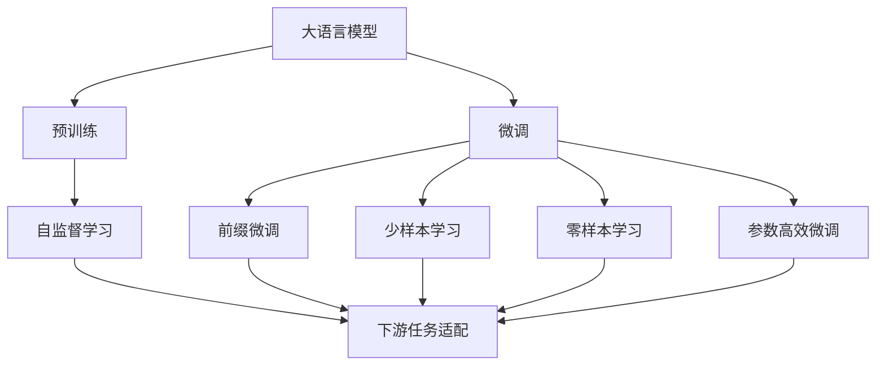
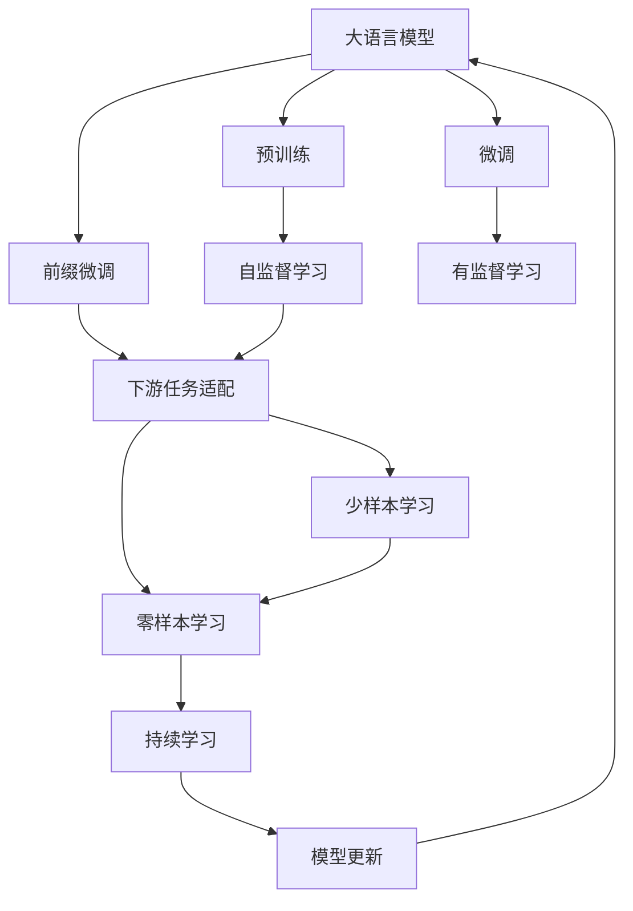
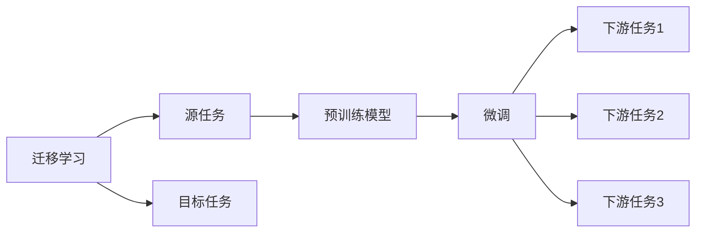
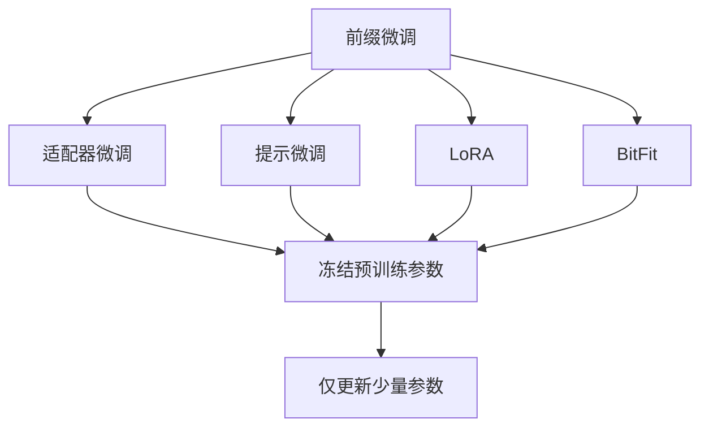
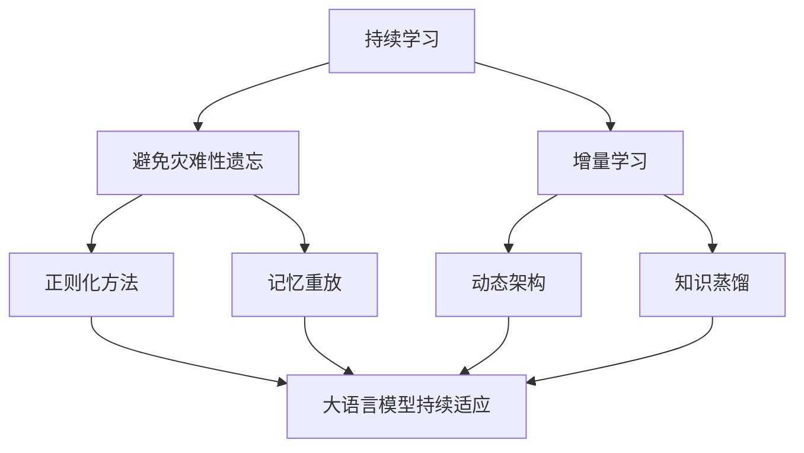
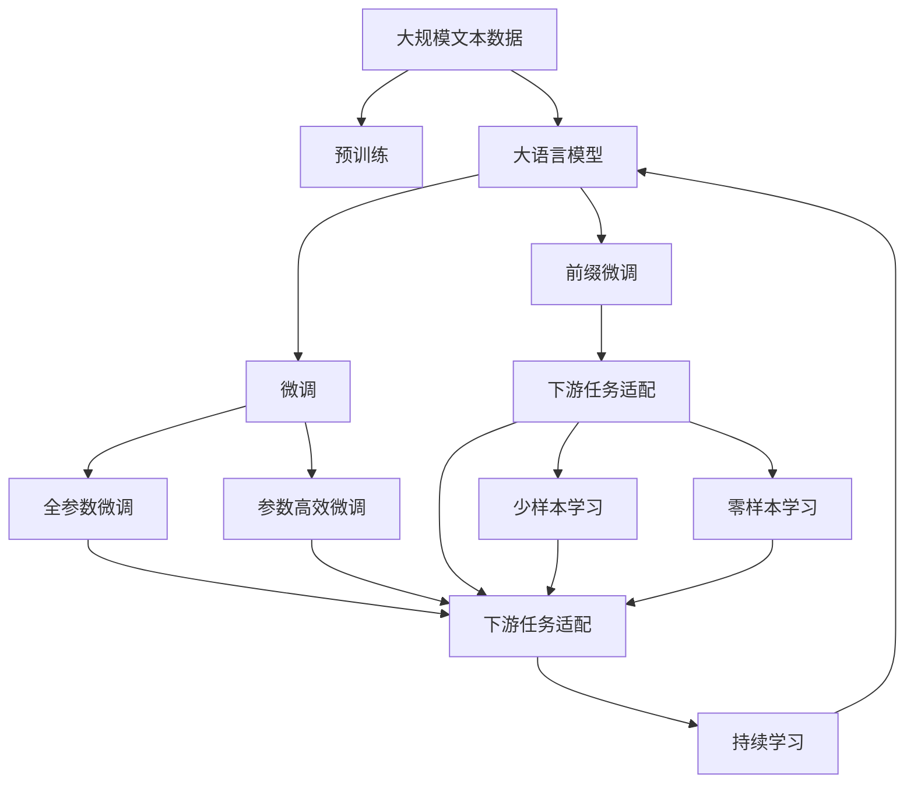

                 

# 大语言模型原理与工程实践：前缀微调

> 关键词：大语言模型,前缀微调,迁移学习,自监督学习,Transformer,BERT,预训练,下游任务,参数高效微调,自然语言处理(NLP)

## 1. 背景介绍

### 1.1 问题由来

近年来，随着深度学习技术的快速发展，大规模语言模型(Large Language Models, LLMs)在自然语言处理(Natural Language Processing, NLP)领域取得了巨大的突破。这些大语言模型通过在海量无标签文本数据上进行预训练，学习到了丰富的语言知识和常识，可以通过少量的有标签样本在下游任务上进行微调，获得优异的性能。其中最具代表性的大模型包括OpenAI的GPT系列模型、Google的BERT、T5等。

然而，由于预训练语料的广泛性和泛化能力的不足，这些通用的大语言模型在特定领域应用时，效果往往难以达到实际应用的要求。因此，如何针对特定任务进行大模型微调，提升模型性能，成为了当前大语言模型研究和应用的一个热点问题。本文聚焦于基于前缀微调的前沿技术，以期对大语言模型微调实践提供更全面的指导。

### 1.2 问题核心关键点

前缀微调（Prefix Tuning）是一种特殊的微调方法，旨在利用大语言模型的自回归生成能力，通过在输入前添加特定的前缀（Prompt），指导模型生成特定的输出。与传统的微调方法不同，前缀微调不需要修改模型参数，而是通过在模型输入中巧妙地嵌入任务相关信息，让模型在微调过程中逐渐学习到任务相关知识。这种方法在零样本学习和少样本学习中表现优异，可以显著减少微调所需的标注数据，甚至在某些情况下实现无需标注的数据驱动学习。

前缀微调的核心思想是：在大语言模型的输入中，通过精心设计的提示模板（Prompt Template），将模型引导至特定的任务目标，从而减少微调所需的训练样本，提升模型的泛化能力。常见的前缀包括自然语言指令、代码片段、表格数据等，通过这些前缀，模型能够理解任务要求并输出符合期望的结果。

## 2. 核心概念与联系

### 2.1 核心概念概述

为更好地理解前缀微调方法，本节将介绍几个密切相关的核心概念：

- 大语言模型(Large Language Model, LLM)：以自回归(如GPT)或自编码(如BERT)模型为代表的大规模预训练语言模型。通过在大规模无标签文本语料上进行预训练，学习通用的语言表示，具备强大的语言理解和生成能力。

- 预训练(Pre-training)：指在大规模无标签文本语料上，通过自监督学习任务训练通用语言模型的过程。常见的预训练任务包括言语建模、遮挡语言模型等。预训练使得模型学习到语言的通用表示。

- 微调(Fine-tuning)：指在预训练模型的基础上，使用下游任务的少量标注数据，通过有监督地训练来优化模型在该任务上的性能。通常只需要调整顶层分类器或解码器，并以较小的学习率更新全部或部分的模型参数。

- 前缀微调(Prompt Tuning)：一种特殊的微调方法，通过在输入前添加特定的前缀，引导大语言模型生成特定的输出。在微调过程中不需要修改模型参数，而是通过前缀中嵌入任务相关信息，使模型学习到任务相关知识。

- 少样本学习(Few-shot Learning)：指在只有少量标注样本的情况下，模型能够快速适应新任务的学习方法。在大语言模型中，通常通过在输入中提供少量示例来实现，无需更新模型参数。

- 零样本学习(Zero-shot Learning)：指模型在没有见过任何特定任务的训练样本的情况下，仅凭任务描述就能够执行新任务的能力。大语言模型通过预训练获得的广泛知识，使其能够理解任务指令并生成相应输出。

- 迁移学习(Transfer Learning)：指将一个领域学习到的知识，迁移应用到另一个不同但相关的领域的学习范式。大模型的预训练-微调过程即是一种典型的迁移学习方式。

- 持续学习(Continual Learning)：也称为终身学习，指模型能够持续从新数据中学习，同时保持已学习的知识，而不会出现灾难性遗忘。这对于保持大语言模型的时效性和适应性至关重要。

这些核心概念之间的逻辑关系可以通过以下Mermaid流程图来展示：



这个流程图展示了大语言模型的核心概念及其之间的关系：

1. 大语言模型通过预训练获得基础能力。
2. 微调是对预训练模型进行任务特定的优化，可以分为全参数微调和参数高效微调（PEFT）。
3. 前缀微调是一种不更新模型参数的方法，可以实现零样本或少样本学习。
4. 迁移学习是连接预训练模型与下游任务的桥梁，可以通过微调或前缀微调来实现。
5. 持续学习旨在使模型能够不断学习新知识，同时避免遗忘旧知识。

这些概念共同构成了大语言模型的学习和应用框架，使其能够在各种场景下发挥强大的语言理解和生成能力。通过理解这些核心概念，我们可以更好地把握大语言模型的工作原理和优化方向。

### 2.2 概念间的关系

这些核心概念之间存在着紧密的联系，形成了大语言模型的微调生态系统。下面我们通过几个Mermaid流程图来展示这些概念之间的关系。

#### 2.2.1 大语言模型的学习范式



这个流程图展示了大语言模型的三种主要学习范式：预训练、微调和前缀微调。预训练主要采用自监督学习方法，而微调则是有监督学习的过程。前缀微调可以通过在输入前添加特定前缀，使模型快速适应新任务，而无需修改模型参数。

#### 2.2.2 迁移学习与微调的关系



这个流程图展示了迁移学习的基本原理，以及它与微调的关系。迁移学习涉及源任务和目标任务，预训练模型在源任务上学习，然后通过微调适应各种下游任务（目标任务）。

#### 2.2.3 前缀微调方法



这个流程图展示了几种常见的前缀微调方法，包括适配器微调、提示微调、LoRA和BitFit。这些方法的共同特点是冻结大部分预训练参数，只更新少量前缀微调参数，从而提高微调效率。

#### 2.2.4 持续学习在大语言模型中的应用



这个流程图展示了持续学习在大语言模型中的应用。持续学习的主要目标是避免灾难性遗忘和实现增量学习。通过正则化方法、记忆重放、动态架构和知识蒸馏等技术，可以使大语言模型持续适应新的任务和数据。

### 2.3 核心概念的整体架构

最后，我们用一个综合的流程图来展示这些核心概念在大语言模型微调过程中的整体架构：



这个综合流程图展示了从预训练到微调，再到持续学习的完整过程。大语言模型首先在大规模文本数据上进行预训练，然后通过微调（包括全参数微调和参数高效微调）或前缀微调，使模型快速适应下游任务。最后，通过持续学习技术，模型可以不断更新和适应新的任务和数据。 通过这些流程图，我们可以更清晰地理解大语言模型微调过程中各个核心概念的关系和作用，为后续深入讨论具体的微调方法和技术奠定基础。

## 3. 核心算法原理 & 具体操作步骤
### 3.1 算法原理概述

前缀微调（Prompt Tuning）本质上是一种基于自回归生成模型的微调方法，旨在通过精心设计的提示（Prompt），指导模型生成特定的输出。其核心思想是：在大语言模型的输入中，通过添加特定的前缀，引导模型学习到任务相关的知识，从而在微调过程中无需修改模型参数，即可提升模型性能。

形式化地，假设预训练模型为 $M_{\theta}$，其中 $\theta$ 为预训练得到的模型参数。给定下游任务 $T$ 的少量标注数据集 $D=\{(x_i, y_i)\}_{i=1}^N$，前缀微调的目标是找到新的前缀 $\textit{prefix}_i$，使得：

$$
\textit{prefix}_i = \mathop{\arg\min}_{\textit{prefix}} \mathcal{L}(M_{\theta},D,\textit{prefix}_i)
$$

其中 $\mathcal{L}$ 为针对任务 $T$ 设计的损失函数，用于衡量模型在给定前缀 $\textit{prefix}_i$ 下的预测输出与真实标签之间的差异。常见的损失函数包括交叉熵损失、均方误差损失等。

通过梯度下降等优化算法，前缀微调过程不断更新前缀 $\textit{prefix}_i$，最小化损失函数 $\mathcal{L}$，使得模型在给定前缀时的输出逼近真实标签。由于 $\textit{prefix}_i$ 已经通过预训练获得了较好的初始化，因此即便在小规模数据集 $D$ 上进行微调，也能较快收敛到理想的前缀 $\textit{prefix}_i$。

### 3.2 算法步骤详解

前缀微调的一般步骤如下：

**Step 1: 准备预训练模型和数据集**
- 选择合适的预训练语言模型 $M_{\theta}$ 作为初始化参数，如 BERT、GPT 等。
- 准备下游任务 $T$ 的少量标注数据集 $D$，划分为训练集、验证集和测试集。一般要求标注数据与预训练数据的分布不要差异过大。

**Step 2: 设计前缀模板**
- 根据任务类型，设计合适的输入前缀 $\textit{prefix}_i$。
- 对于分类任务，通常设计一个格式为 "<prefix> Task: <output>" 的前缀，引导模型生成任务描述和期望输出。
- 对于生成任务，设计一个包含任务提示的输入前缀。

**Step 3: 设置微调超参数**
- 选择合适的优化算法及其参数，如 AdamW、SGD 等，设置学习率、批大小、迭代轮数等。
- 设置正则化技术及强度，包括权重衰减、Dropout、Early Stopping 等。
- 确定冻结预训练参数的策略，如仅微调前缀，或全部参数都参与微调。

**Step 4: 执行前缀微调**
- 将训练集数据分批次输入模型，前向传播计算损失函数。
- 反向传播计算前缀梯度，根据设定的优化算法和学习率更新前缀 $\textit{prefix}_i$。
- 周期性在验证集上评估模型性能，根据性能指标决定是否触发 Early Stopping。
- 重复上述步骤直到满足预设的迭代轮数或 Early Stopping 条件。

**Step 5: 测试和部署**
- 在测试集上评估微调后的前缀 $\textit{prefix}_i$ 的性能，对比微调前后的效果。
- 使用微调后的前缀 $\textit{prefix}_i$ 对新样本进行推理预测，集成到实际的应用系统中。
- 持续收集新的数据，定期重新微调前缀，以适应数据分布的变化。

以上是前缀微调的一般流程。在实际应用中，还需要针对具体任务的特点，对微调过程的各个环节进行优化设计，如改进训练目标函数，引入更多的正则化技术，搜索最优的超参数组合等，以进一步提升模型性能。

### 3.3 算法优缺点

前缀微调方法具有以下优点：
1. 简单高效。只需设计合适的提示，即可对预训练模型进行快速适配，获得较大的性能提升。
2. 通用适用。适用于各种NLP下游任务，包括分类、匹配、生成等，设计合适的提示即可实现微调。
3. 参数高效。通过前缀微调，可以在不增加模型参数量的情况下，仍可取得不错的提升。
4. 效果显著。在学术界和工业界的诸多任务上，基于前缀微调的方法已经刷新了最先进的性能指标。

同时，该方法也存在一定的局限性：
1. 依赖提示质量。提示设计的优劣直接影响微调效果，设计好的提示能显著提升模型性能，而设计不当的提示则可能导致模型输出错误。
2. 提示依赖强。对于特定任务，提示可能具有较强的依赖性，提示的质量和适应性决定了模型的泛化能力。
3. 可解释性不足。前缀微调模型通常缺乏可解释性，难以对其推理逻辑进行分析和调试。
4. 提示嵌入计算量大。在前缀微调中，每轮微调都需要对提示进行编码和解码，计算量较大。

尽管存在这些局限性，但就目前而言，前缀微调方法仍是大语言模型应用的一个主流范式。未来相关研究的重点在于如何进一步降低提示设计对性能的依赖，提高模型的少样本学习和跨领域迁移能力，同时兼顾可解释性和伦理安全性等因素。

### 3.4 算法应用领域

前缀微调在大语言模型中的应用，已经涵盖了几乎所有常见的NLP任务，例如：

- 文本分类：如情感分析、主题分类、意图识别等。通过设计合适的提示，引导模型学习分类任务的关键特征。
- 命名实体识别：识别文本中的人名、地名、机构名等特定实体。设计包含实体类型的提示，引导模型识别和标注实体。
- 关系抽取：从文本中抽取实体之间的语义关系。通过设计关系抽取提示，引导模型学习实体关系的三元组。
- 问答系统：对自然语言问题给出答案。将问题-答案对作为提示，引导模型推理生成答案。
- 机器翻译：将源语言文本翻译成目标语言。设计包含翻译方向的提示，引导模型生成翻译结果。
- 文本摘要：将长文本压缩成简短摘要。设计包含摘要关键词的提示，引导模型提取和生成摘要。
- 对话系统：使机器能够与人自然对话。设计包含对话历史的提示，引导模型生成对话回复。

除了上述这些经典任务外，前缀微调还被创新性地应用到更多场景中，如可控文本生成、常识推理、代码生成、数据增强等，为NLP技术带来了全新的突破。随着预训练模型和前缀微调方法的不断进步，相信NLP技术将在更广阔的应用领域大放异彩。

## 4. 数学模型和公式 & 详细讲解 & 举例说明
### 4.1 数学模型构建

本节将使用数学语言对前缀微调过程进行更加严格的刻画。

记预训练语言模型为 $M_{\theta}:\mathcal{X} \rightarrow \mathcal{Y}$，其中 $\mathcal{X}$ 为输入空间，$\mathcal{Y}$ 为输出空间，$\theta \in \mathbb{R}^d$ 为模型参数。假设微调任务的训练集为 $D=\{(x_i, y_i)\}_{i=1}^N$，其中 $x_i \in \mathcal{X}$ 为输入文本，$y_i \in \mathcal{Y}$ 为任务标签。

定义模型 $M_{\theta}$ 在输入 $x$ 上的输出为 $\hat{y}=M_{\theta}(x)$，表示样本属于某个类别的概率。真实标签 $y_i \in \{0,1\}$。则前缀微调的任务是在给定提示 $\textit{prefix}_i$ 的情况下，最小化损失函数 $\mathcal{L}(\theta,\textit{prefix}_i)$，使得模型输出的概率分布与真实标签匹配。

将提示 $\textit{prefix}_i$ 作为前缀输入，引导模型生成输出 $\hat{y}$。由于提示通常较长，一般使用掩码技术进行截断，只保留与任务相关的部分。模型输出的概率分布为：

$$
P_{\textit{prefix}_i}(\hat{y}) = \frac{e^{M_{\theta}(x,\textit{prefix}_i)}}{\sum_{y \in \mathcal{Y}} e^{M_{\theta}(x,\textit{prefix}_i)}}
$$

其中 $M_{\theta}(x,\textit{prefix}_i)$ 为模型在输入 $x$ 和提示 $\textit{prefix}_i$ 下的输出。

前缀微调的目标是最小化损失函数：

$$
\mathcal{L}(\theta,\textit{prefix}_i) = -\frac{1}{N}\sum_{i=1}^N [y_i \log P_{\textit{prefix}_i}(y_i) + (1-y_i) \log (1-P_{\textit{prefix}_i}(y_i))]
$$

通过梯度下降等优化算法，前缀微调过程不断更新前缀 $\textit{prefix}_i$，最小化损失函数 $\mathcal{L}$，使得模型在给定前缀时的输出逼近真实标签。由于 $\textit{prefix}_i$ 已经通过预训练获得了较好的初始化，因此即便在小规模数据集 $D$ 上进行微调，也能较快收敛到理想的前缀 $\textit{prefix}_i$。

### 4.2 公式推导过程

以下我们以二分类任务为例，推导交叉熵损失函数及其梯度的计算公式。

假设模型 $M_{\theta}$ 在输入 $x$ 和提示 $\textit{prefix}_i$ 下的输出为 $\hat{y}=M_{\theta}(x,\textit{prefix}_i) \in [0,1]$，表示样本属于正类的概率。真实标签 $y_i \in \{0,1\}$。则二分类交叉熵损失函数定义为：

$$
\ell(M_{\theta}(x,\textit{prefix}_i),y_i) = -[y_i\log \hat{y} + (1-y_i)\log (1-\hat{y})]
$$

将其代入前缀微调的损失函数，得：

$$
\mathcal{L}(\theta,\textit{prefix}_i) = -\frac{1}{N}\sum_{i=1}^N [y_i\log P_{\textit{prefix}_i}(y_i)+(1-y_i)\log(1-P_{\textit{prefix}_i}(y_i))]
$$

根据链式法则，损失函数对模型参数 $\theta_k$ 的梯度为：

$$
\frac{\partial \mathcal{L}(\theta,\textit{prefix}_i)}{\partial \theta_k} = -\frac{1}{N}\sum_{i=1}^N \frac{\partial}{\partial \theta_k} [y_i\log P_{\textit{prefix}_i}(y_i)+(1-y_i)\log(1-P_{\textit{prefix}_i}(y_i))]
$$

在得到损失函数的梯度后，即可带入参数更新公式，完成模型的迭代优化。重复上述过程直至收敛，最终得到适应下游任务的最优前缀 $\textit{prefix}_i$。

### 4.3 案例分析与讲解

以情感分析任务为例，设计一个包含情感标签的提示，训练前缀微调模型。具体步骤如下：

1. 收集情感分析的标注数据集，如电影评论、商品评价等。
2. 设计一个提示模板，如 "<电影评论> 这是一个令人感动的电影，情感：<标签>"，其中 "<电影评论>" 为前缀，引导模型关注评论内容。
3. 在提示后添加一个情感标签，如 "正面" 或 "负面"。
4. 将数据集分为训练集、验证集和测试集。
5. 选择预训练模型，如BERT，作为初始化参数。
6. 设置学习率、批大小等超参数。
7. 通过前缀微调，优化模型在给定提示下的输出。
8. 在测试集上评估微调后的模型性能。

通过以上步骤，可以训练一个基于前缀微调的情感分析模型。在这个过程中，提示的设计是关键，需要仔细考虑如何引导模型学习情感特征。如果提示设计不当，可能导致模型输出错误。例如，设计一个包含无关信息的前缀，可能使得模型无法正确理解情感信息，从而影响性能。

## 5. 项目实践：代码实例和详细解释说明
### 5.1 开发环境搭建

在进行前缀微调实践前，我们需要准备好开发环境。以下是使用Python进行PyTorch开发的环境配置流程：

1. 安装Anaconda：从官网下载并安装Anaconda，用于创建独立的Python环境。

2. 创建并激活虚拟环境：
```bash
conda create -n pytorch-env python=3.8 
conda activate pytorch-env
```

3. 安装PyTorch：根据CUDA版本，从官网获取对应的安装命令。例如：
```bash
conda install pytorch torchvision torchaudio cudatoolkit=11.1 -c pytorch -c conda-forge
```

4. 安装Transformers库：
```bash
pip install transformers
```

5. 安装各类工具包：
```bash
pip install numpy pandas scikit-learn matplotlib tqdm jupyter notebook ipython
```

完成上述步骤后，即可在`pytorch-env`环境中开始前缀微调实践。

### 5.2 源代码详细实现

这里我们以情感分析任务为例，给出使用Transformers库对BERT模型进行前缀微调的PyTorch代码实现。

首先，定义情感分析任务的数据处理函数：

```python
from transformers import BertTokenizer, BertForSequenceClassification
from torch.utils.data import Dataset
import torch

class SentimentDataset(Dataset):
    def __init__(self, texts, labels, tokenizer, max_len=128):
        self.texts = texts
        self.labels = labels
        self.tokenizer = tokenizer
        self.max_len = max_len
        
    def __len__(self):
        return len(self.texts)
    
    def __getitem__(self, item):
        text = self.texts[item]
        label = self.labels[item]
        
        encoding = self.tokenizer(text, return_tensors='pt', max_length=self.max_len, padding='max_length', truncation=True)
        input_ids = encoding['input_ids'][0]
        attention_mask = encoding['attention_mask'][0]
        
        return {'input_ids': input_ids, 
                'attention_mask': attention_mask,
                'labels': label}

# 标签与id的映射
label2id = {'负面': 0, '正面': 1}
id2label = {v: k for k, v in label2id.items()}

# 创建dataset
tokenizer = BertTokenizer.from_pretrained('bert-base-cased')

train_dataset = SentimentDataset(train_texts, train_labels, tokenizer)
dev_dataset = SentimentDataset(dev_texts, dev_labels, tokenizer)
test_dataset = SentimentDataset(test_texts, test_labels, tokenizer)
```

然后，定义模型和优化器：

```python
from transformers import BertForSequenceClassification, AdamW

model = BertForSequenceClassification.from_pretrained('bert-base-cased', num_labels=len(label2id))

optimizer = AdamW(model.parameters(), lr=2e-5)
```

接着，定义训练和评估函数：

```python
from torch.utils.data import DataLoader
from tqdm import tqdm
from sklearn.metrics import classification_report

device = torch.device('cuda') if torch.cuda.is_available() else torch.device('cpu')
model.to(device)

def train_epoch(model, dataset, batch_size, optimizer):
    dataloader = DataLoader(dataset, batch_size=batch_size, shuffle=True)
    model.train()
    epoch_loss = 0
    for batch in tqdm(datal

