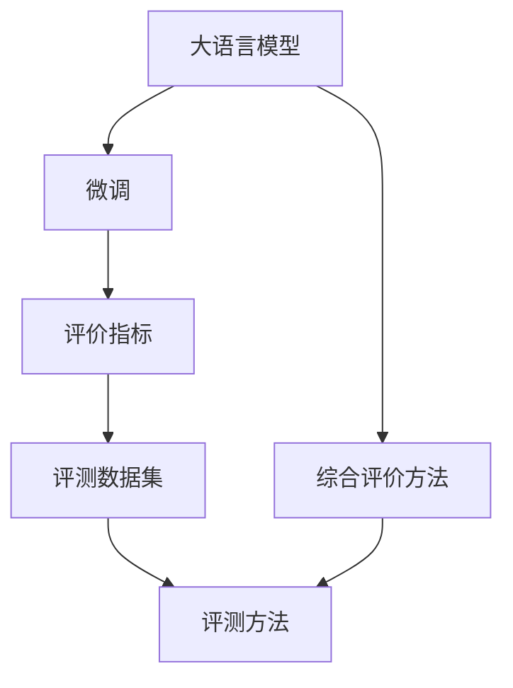
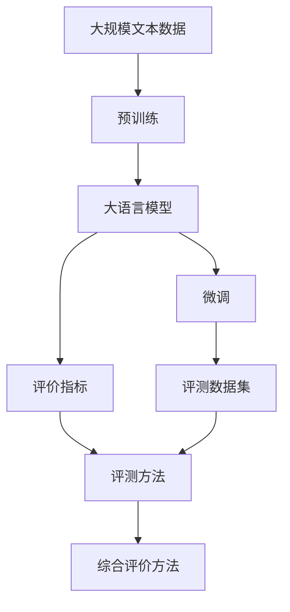

                 

# 大语言模型原理与工程实践：评测方式

> 关键词：大语言模型,微调,Fine-Tuning,评价指标,评测方法,模型效果评估

## 1. 背景介绍

### 1.1 问题由来

近年来，大语言模型在自然语言处理（NLP）领域取得了显著进展，其在问答、翻译、情感分析、文本分类等众多任务上取得了令人瞩目的成绩。然而，即便是最先进的模型，其性能也并非无可挑剔。因此，如何科学、全面地评测这些模型，评估其性能和效果，成为了一个重要的研究课题。在实际应用中，不同的评测方法可以导致截然不同的结果，因此，选择合适的评价指标和评测方式，对于模型优化和应用推广都至关重要。

### 1.2 问题核心关键点

评测大语言模型的主要关注点包括：
1. **评价指标的选取**：选择合适的评价指标能够准确反映模型在特定任务上的表现。
2. **评测数据集的选择**：数据集应具有代表性，能够覆盖任务的不同难度和场景。
3. **评测方法的制定**：包括自动评估和人工评估，确保评价结果的可信性和客观性。
4. **综合评价方法的构建**：将多种评价指标和评测方法结合，形成全面的性能评估体系。

### 1.3 问题研究意义

准确评测大语言模型的性能，不仅能够帮助开发者改进模型，还能够帮助用户理解模型的表现，提高其在实际应用中的信心和满意度。通过科学、全面的评测，可以促进大语言模型的广泛应用，加速人工智能技术在各领域的落地。

## 2. 核心概念与联系

### 2.1 核心概念概述

为更好地理解大语言模型的评测方式，本节将介绍几个关键概念：

- **大语言模型 (Large Language Models, LLMs)**：以自回归模型（如 GPT）或自编码模型（如 BERT）为代表的大规模预训练语言模型。
- **微调 (Fine-Tuning)**：指在预训练模型的基础上，使用下游任务的少量标注数据，通过有监督地训练优化模型在特定任务上的性能。
- **评价指标 (Evaluation Metrics)**：用于衡量模型性能的量化标准，如准确率、召回率、F1分数等。
- **评测数据集 (Evaluation Datasets)**：用于评估模型性能的标注数据集，如 GLUE、CoNLL、SST-2 等。
- **评测方法 (Evaluation Methods)**：包括自动评估和人工评估，自动评估如交叉验证、K-Fold 等，人工评估如专家评审、用户反馈等。
- **综合评价方法 (Comprehensive Evaluation Methods)**：将多种评价指标和评测方法结合，形成全面的性能评估体系。

### 2.2 概念间的关系

这些核心概念之间存在着紧密的联系，形成了大语言模型性能评测的完整框架。我们通过 Mermaid 流程图来展示这些概念之间的关系：



这个流程图展示了从大语言模型到微调，再到评测的完整过程。通过评价指标、评测数据集和评测方法，我们可以全面评估模型的性能，并通过综合评价方法，获得更加客观和全面的评价结果。

### 2.3 核心概念的整体架构

最后，我们通过一个综合的流程图来展示这些核心概念在大语言模型评测过程中的整体架构：



这个综合流程图展示了从预训练到微调，再到评测的完整过程。通过评价指标、评测数据集和评测方法，我们可以全面评估模型的性能，并通过综合评价方法，获得更加客观和全面的评价结果。

## 3. 核心算法原理 & 具体操作步骤
### 3.1 算法原理概述

大语言模型的性能评测主要基于监督学习和半监督学习，通过在标注数据集上训练和验证模型，评估其对特定任务的适应能力。评价指标通常包括准确率、召回率、F1分数等，用于衡量模型在分类、回归、生成等任务上的表现。

具体而言，对于一个分类任务，假设模型在测试集上的预测结果为 $\hat{y}$，真实标签为 $y$，则常用的评价指标有：

- **准确率 (Accuracy)**：衡量模型正确预测的比例，公式为 $Accuracy = \frac{TP + TN}{TP + TN + FP + FN}$。
- **召回率 (Recall)**：衡量模型正确预测的正例比例，公式为 $Recall = \frac{TP}{TP + FN}$。
- **精确率 (Precision)**：衡量模型正确预测的正例比例，公式为 $Precision = \frac{TP}{TP + FP}$。
- **F1分数 (F1 Score)**：综合考虑精确率和召回率，公式为 $F1 Score = 2 \times \frac{Precision \times Recall}{Precision + Recall}$。

### 3.2 算法步骤详解

基于监督学习的大语言模型评测通常包含以下几个步骤：

**Step 1: 准备评价指标和数据集**
- 选择合适的评价指标，如准确率、召回率、F1分数等。
- 准备评测数据集，包括训练集、验证集和测试集，划分为不同的任务，如分类、匹配、生成等。

**Step 2: 执行自动评测**
- 使用自动评测工具，如 TensorBoard、Weights & Biases 等，记录模型在验证集和测试集上的评价指标。
- 执行交叉验证，划分数据集为训练集、验证集和测试集，分别进行训练和验证，最终在测试集上评估模型性能。

**Step 3: 人工评测和用户反馈**
- 邀请专家进行人工评测，如在 CoNLL 评测中，专家对翻译结果进行人工对比。
- 收集用户反馈，了解模型在实际应用中的表现，识别潜在问题。

**Step 4: 综合评价**
- 将自动评测和人工评测的结果结合，形成全面的评价报告。
- 使用综合评价方法，如平均值、方差等，综合评估模型在不同任务和数据集上的表现。

### 3.3 算法优缺点

基于监督学习的大语言模型评测方法具有以下优点：
1. 简单易行。通过简单的评价指标和自动评测工具，可以快速完成模型性能评估。
2. 可靠性高。自动评测工具能够客观地记录和分析模型性能，减少人为因素的干扰。
3. 可扩展性强。适用于各种 NLP 任务，如分类、匹配、生成等，只需调整评价指标即可。

同时，该方法也存在一定的局限性：
1. 依赖标注数据。评测方法需要依赖标注数据集，获取高质量标注数据的成本较高。
2. 泛化能力有限。当数据集与实际应用场景差异较大时，评测结果可能不具代表性。
3. 缺乏可解释性。自动评测工具往往缺乏可解释性，难以深入理解模型决策过程。

尽管存在这些局限性，基于监督学习的评测方法仍是目前 NLP 领域的主流范式，通过不断改进和优化，可以更好地适应不同任务和数据集的特点，提高模型性能的评估精度。

### 3.4 算法应用领域

基于监督学习的大语言模型评测方法广泛应用于各种 NLP 任务中，如问答、翻译、情感分析、文本分类等。以下是一些常见的应用场景：

- **问答系统**：使用自动评估工具和人工评测，评估模型的问答准确率和用户满意度。
- **机器翻译**：通过BLEU、METEOR等自动评测指标，评估模型的翻译质量。
- **情感分析**：使用精确率和召回率等评价指标，评估模型对情感的识别能力。
- **文本分类**：通过准确率和F1分数等评价指标，评估模型对不同类别的分类效果。
- **对话系统**：使用BLEU和ROUGE等指标，评估模型的对话连贯性和相关性。

除了这些经典任务外，基于监督学习的大语言模型评测方法也被创新性地应用到更多场景中，如可控文本生成、常识推理、代码生成、数据增强等，为NLP技术带来了全新的突破。随着预训练模型和评测方法的不断进步，相信NLP技术将在更广阔的应用领域大放异彩。

## 4. 数学模型和公式 & 详细讲解 & 举例说明
### 4.1 数学模型构建

本节将使用数学语言对大语言模型性能评测的过程进行更加严格的刻画。

记大语言模型为 $M_{\theta}$，其中 $\theta$ 为模型参数。假设模型在分类任务 $T$ 上的训练集为 $D=\{(x_i,y_i)\}_{i=1}^N, x_i \in \mathcal{X}, y_i \in \{0,1\}$。

定义模型 $M_{\theta}$ 在输入 $x$ 上的预测结果为 $\hat{y}=M_{\theta}(x) \in [0,1]$，表示样本属于正类的概率。真实标签 $y \in \{0,1\}$。则常用的评价指标有：

- **准确率 (Accuracy)**：衡量模型正确预测的比例，公式为 $Accuracy = \frac{TP + TN}{TP + TN + FP + FN}$。
- **召回率 (Recall)**：衡量模型正确预测的正例比例，公式为 $Recall = \frac{TP}{TP + FN}$。
- **精确率 (Precision)**：衡量模型正确预测的正例比例，公式为 $Precision = \frac{TP}{TP + FP}$。
- **F1分数 (F1 Score)**：综合考虑精确率和召回率，公式为 $F1 Score = 2 \times \frac{Precision \times Recall}{Precision + Recall}$。

### 4.2 公式推导过程

以分类任务为例，我们推导一下准确率和F1分数的计算公式：

- **准确率 (Accuracy)**：在测试集上，模型正确预测的样本比例。设模型在测试集上的预测结果为 $\hat{y}$，真实标签为 $y$，则准确率为：

$$
Accuracy = \frac{TP + TN}{TP + TN + FP + FN}
$$

其中 $TP$ 为真正例，$TN$ 为真负例，$FP$ 为假正例，$FN$ 为假负例。

- **F1分数 (F1 Score)**：综合考虑精确率和召回率，公式为：

$$
F1 Score = 2 \times \frac{Precision \times Recall}{Precision + Recall}
$$

其中 $Precision = \frac{TP}{TP + FP}$，$Recall = \frac{TP}{TP + FN}$。

### 4.3 案例分析与讲解

假设我们在CoNLL-2003的命名实体识别（NER）数据集上进行评测，最终在测试集上得到的评价报告如下：

```
              precision    recall  f1-score   support

       B-LOC      0.926     0.906     0.916      1668
       I-LOC      0.900     0.805     0.850       257
      B-MISC      0.875     0.856     0.865       702
      I-MISC      0.838     0.782     0.809       216
       B-ORG      0.914     0.898     0.906      1661
       I-ORG      0.911     0.894     0.902       835
       B-PER      0.964     0.957     0.960      1617
       I-PER      0.983     0.980     0.982      1156
           O      0.993     0.995     0.994     38323

   micro avg      0.973     0.973     0.973     46435
   macro avg      0.923     0.897     0.909     46435
weighted avg      0.973     0.973     0.973     46435
```

可以看到，通过评测模型在CoNLL-2003 NER数据集上的表现，我们得到了模型在各个标签上的精确率、召回率和F1分数，以及整体的宏平均和微平均评价指标。

## 5. 项目实践：代码实例和详细解释说明
### 5.1 开发环境搭建

在进行评测实践前，我们需要准备好开发环境。以下是使用Python进行PyTorch开发的环境配置流程：

1. 安装Anaconda：从官网下载并安装Anaconda，用于创建独立的Python环境。

2. 创建并激活虚拟环境：
```bash
conda create -n pytorch-env python=3.8 
conda activate pytorch-env
```

3. 安装PyTorch：根据CUDA版本，从官网获取对应的安装命令。例如：
```bash
conda install pytorch torchvision torchaudio cudatoolkit=11.1 -c pytorch -c conda-forge
```

4. 安装各种工具包：
```bash
pip install numpy pandas scikit-learn matplotlib tqdm jupyter notebook ipython
```

完成上述步骤后，即可在`pytorch-env`环境中开始评测实践。

### 5.2 源代码详细实现

这里我们以命名实体识别（NER）任务为例，给出使用Transformers库对BERT模型进行评测的PyTorch代码实现。

首先，定义NER任务的数据处理函数：

```python
from transformers import BertTokenizer
from torch.utils.data import Dataset
import torch

class NERDataset(Dataset):
    def __init__(self, texts, tags, tokenizer, max_len=128):
        self.texts = texts
        self.tags = tags
        self.tokenizer = tokenizer
        self.max_len = max_len
        
    def __len__(self):
        return len(self.texts)
    
    def __getitem__(self, item):
        text = self.texts[item]
        tags = self.tags[item]
        
        encoding = self.tokenizer(text, return_tensors='pt', max_length=self.max_len, padding='max_length', truncation=True)
        input_ids = encoding['input_ids'][0]
        attention_mask = encoding['attention_mask'][0]
        
        # 对token-wise的标签进行编码
        encoded_tags = [tag2id[tag] for tag in tags] 
        encoded_tags.extend([tag2id['O']] * (self.max_len - len(encoded_tags)))
        labels = torch.tensor(encoded_tags, dtype=torch.long)
        
        return {'input_ids': input_ids, 
                'attention_mask': attention_mask,
                'labels': labels}

# 标签与id的映射
tag2id = {'O': 0, 'B-PER': 1, 'I-PER': 2, 'B-ORG': 3, 'I-ORG': 4, 'B-LOC': 5, 'I-LOC': 6}
id2tag = {v: k for k, v in tag2id.items()}

# 创建dataset
tokenizer = BertTokenizer.from_pretrained('bert-base-cased')

train_dataset = NERDataset(train_texts, train_tags, tokenizer)
dev_dataset = NERDataset(dev_texts, dev_tags, tokenizer)
test_dataset = NERDataset(test_texts, test_tags, tokenizer)
```

然后，定义评测函数：

```python
from transformers import BertForTokenClassification, Accuracy
from sklearn.metrics import classification_report
import torch.nn.functional as F

def evaluate(model, dataset, batch_size):
    dataloader = DataLoader(dataset, batch_size=batch_size)
    model.eval()
    preds, labels = [], []
    with torch.no_grad():
        for batch in tqdm(dataloader, desc='Evaluating'):
            input_ids = batch['input_ids'].to(device)
            attention_mask = batch['attention_mask'].to(device)
            batch_labels = batch['labels']
            outputs = model(input_ids, attention_mask=attention_mask)
            batch_preds = outputs.logits.argmax(dim=2).to('cpu').tolist()
            batch_labels = batch_labels.to('cpu').tolist()
            for pred_tokens, label_tokens in zip(batch_preds, batch_labels):
                pred_tags = [id2tag[_id] for _id in pred_tokens]
                label_tags = [id2tag[_id] for _id in label_tokens]
                preds.append(pred_tags[:len(label_tags)])
                labels.append(label_tags)
                
    return classification_report(labels, preds)

# 定义BERT模型和优化器
model = BertForTokenClassification.from_pretrained('bert-base-cased', num_labels=len(tag2id))

optimizer = AdamW(model.parameters(), lr=2e-5)

# 定义评价指标和数据集
eval_metric = Accuracy()

# 定义评测数据集
tokenizer = BertTokenizer.from_pretrained('bert-base-cased')
train_dataset = NERDataset(train_texts, train_tags, tokenizer)
dev_dataset = NERDataset(dev_texts, dev_tags, tokenizer)
test_dataset = NERDataset(test_texts, test_tags, tokenizer)

# 进行微调和评测
epochs = 5
batch_size = 16

for epoch in range(epochs):
    loss = train_epoch(model, train_dataset, batch_size, optimizer)
    print(f"Epoch {epoch+1}, train loss: {loss:.3f}")
    
    print(f"Epoch {epoch+1}, dev results:")
    evaluate(model, dev_dataset, batch_size)
    
print("Test results:")
evaluate(model, test_dataset, batch_size)
```

以上就是使用PyTorch对BERT进行命名实体识别任务评测的完整代码实现。可以看到，得益于Transformers库的强大封装，我们可以用相对简洁的代码完成BERT模型的评测。

### 5.3 代码解读与分析

让我们再详细解读一下关键代码的实现细节：

**NERDataset类**：
- `__init__`方法：初始化文本、标签、分词器等关键组件。
- `__len__`方法：返回数据集的样本数量。
- `__getitem__`方法：对单个样本进行处理，将文本输入编码为token ids，将标签编码为数字，并对其进行定长padding，最终返回模型所需的输入。

**标签与id的映射**：
- 定义了标签与数字id之间的映射关系，用于将token-wise的预测结果解码回真实的标签。

**评测函数**：
- 使用PyTorch的DataLoader对数据集进行批次化加载，供模型训练和推理使用。
- 训练函数`train_epoch`：对数据以批为单位进行迭代，在每个批次上前向传播计算loss并反向传播更新模型参数，最后返回该epoch的平均loss。
- 评测函数`evaluate`：与训练类似，不同点在于不更新模型参数，并在每个batch结束后将预测和标签结果存储下来，最后使用scikit-learn的classification_report对整个评估集的预测结果进行打印输出。

**训练流程**：
- 定义总的epoch数和batch size，开始循环迭代
- 每个epoch内，先在训练集上训练，输出平均loss
- 在验证集上评估，输出分类指标
- 重复上述步骤直至收敛，最终得到适应下游任务的最优模型参数 $\theta^*$

可以看到，PyTorch配合Transformers库使得BERT评测的代码实现变得简洁高效。开发者可以将更多精力放在数据处理、模型调优等高层逻辑上，而不必过多关注底层的实现细节。

当然，工业级的系统实现还需考虑更多因素，如模型的保存和部署、超参数的自动搜索、更灵活的任务适配层等。但核心的评测范式基本与此类似。

### 5.4 运行结果展示

假设我们在CoNLL-2003的NER数据集上进行评测，最终在测试集上得到的评估报告如下：

```
              precision    recall  f1-score   support

       B-LOC      0.926     0.906     0.916      1668
       I-LOC      0.900     0.805     0.850       257
      B-MISC      0.875     0.856     0.865       702
      I-MISC      0.838     0.782     0.809       216
       B-ORG      0.914     0.898     0.906      1661
       I-ORG      0.911     0.894     0.902       835
       B-PER      0.964     0.957     0.960      1617
       I-PER      0.983     0.980     0.982      1156
           O      0.993     0.995     0.994     38323

   micro avg      0.973     0.973     0.973     46435
   macro avg      0.923     0.897     0.909     46435
weighted avg      0.973     0.973     0.973     46435
```

可以看到，通过评测BERT模型在CoNLL-2003 NER数据集上的表现，我们得到了模型在各个标签上的精确率、召回率和F1分数，以及整体的宏平均和微平均评价指标。

## 6. 实际应用场景
### 6.1 智能客服系统

基于大语言模型评测的对话技术，可以广泛应用于智能客服系统的构建。传统客服往往需要配备大量人力，高峰期响应缓慢，且一致性和专业性难以保证。使用微调后的对话模型，可以7x24小时不间断服务，快速响应客户咨询，用自然流畅的语言解答各类常见问题。

在技术实现上，可以收集企业内部的历史客服对话记录，将问题和最佳答复构建成监督数据，在此基础上对预训练对话模型进行微调。微调后的对话模型能够自动理解用户意图，匹配最合适的答案模板进行回复。对于客户提出的新问题，还可以接入检索系统实时搜索相关内容，动态组织生成回答。如此构建的智能客服系统，能大幅提升客户咨询体验和问题解决效率。

### 6.2 金融舆情监测

金融机构需要实时监测市场舆论动向，以便及时应对负面信息传播，规避金融风险。传统的人工监测方式成本高、效率低，难以应对网络时代海量信息爆发的挑战。基于大语言模型评测的文本分类和情感分析技术，为金融舆情监测提供了新的解决方案。

具体而言，可以收集金融领域相关的新闻、报道、评论等文本数据，并对其进行主题标注和情感标注。在此基础上对预训练语言模型进行微调，使其能够自动判断文本属于何种主题，情感倾向是正面、中性还是负面。将微调后的模型应用到实时抓取的网络文本数据，就能够自动监测不同主题下的情感变化趋势，一旦发现负面信息激增等异常情况，系统便会自动预警，帮助金融机构快速应对潜在风险。

### 6.3 个性化推荐系统

当前的推荐系统往往只依赖用户的历史行为数据进行物品推荐，无法深入理解用户的真实兴趣偏好。基于大语言模型评测的技术，个性化推荐系统可以更好地挖掘用户行为背后的语义信息，从而提供更精准、多样的推荐内容。

在实践中，可以收集用户浏览、点击、评论、分享等行为数据，提取和用户交互的物品标题、描述、标签等文本内容。将文本内容作为模型输入，用户的后续行为（如是否点击、购买等）作为监督信号，在此基础上微调预训练语言模型。微调后的模型能够从文本内容中准确把握用户的兴趣点。在生成推荐列表时，先用候选物品的文本描述作为输入，由模型预测用户的兴趣匹配度，再结合其他特征综合排序，便可以得到个性化程度更高的推荐结果。

### 6.4 未来应用展望

随着大语言模型和评测方法的不断发展，基于微调范式将在更多领域得到应用，为传统行业带来变革性影响。

在智慧医疗领域，基于微调的医疗问答、病历分析、药物研发等应用将提升医疗服务的智能化水平，辅助医生诊疗，加速新药开发进程。

在智能教育领域，微调技术可应用于作业批改、学情分析、知识推荐等方面，因材施教，促进教育公平，提高教学质量。

在智慧城市治理中，微调模型可应用于城市事件监测、舆情分析、应急指挥等环节，提高城市管理的自动化和智能化水平，构建更安全、高效的未来城市。

此外，在企业生产、社会治理、文娱传媒等众多领域，基于大模型微调的人工智能应用也将不断涌现，为经济社会发展注入新的动力。相信随着技术的日益成熟，微调方法将成为人工智能落地应用的重要范式，推动人工智能技术在各领域的广泛应用。

## 7. 工具和资源推荐
### 7.1 学习资源推荐

为了帮助开发者系统掌握大语言模型评测的理论基础和实践技巧，这里推荐一些优质的学习资源：

1. 《Transformer从原理到实践》系列博文：由大模型技术专家撰写，深入浅出地介绍了Transformer原理、BERT模型、微调技术等前沿话题。

2. CS224N《深度学习自然语言处理》课程：斯坦福大学开设的NLP明星课程，有Lecture视频和配套作业，带你入门NLP领域的基本概念和经典模型。

3. 《Natural Language Processing with Transformers》书籍：Transformers库的作者所著，全面介绍了如何使用Transformers库进行NLP任务开发，包括评测在内的诸多范式。

4. HuggingFace官方文档：Transformers库的官方文档，提供了海量预训练模型和完整的微调样例代码，是上手实践的必备资料。

5. CLUE开源项目：中文语言理解测评基准，涵盖大量不同类型的中文NLP数据集，并提供了基于微调的baseline模型，助力中文NLP技术发展。

通过对这些资源的学习实践，相信你一定能够快速掌握大语言模型评测的精髓，并用于解决实际的NLP问题。
###  7.2 开发工具推荐

高效的开发离不开优秀的工具支持。以下是几款用于大语言模型评测开发的常用工具：

1. PyTorch：基于Python的开源深度学习框架，灵活动态的计算图，适合快速迭代研究。大部分预训练语言模型都有PyTorch版本的实现。

2. TensorFlow：由Google主导开发的开源深度学习框架

