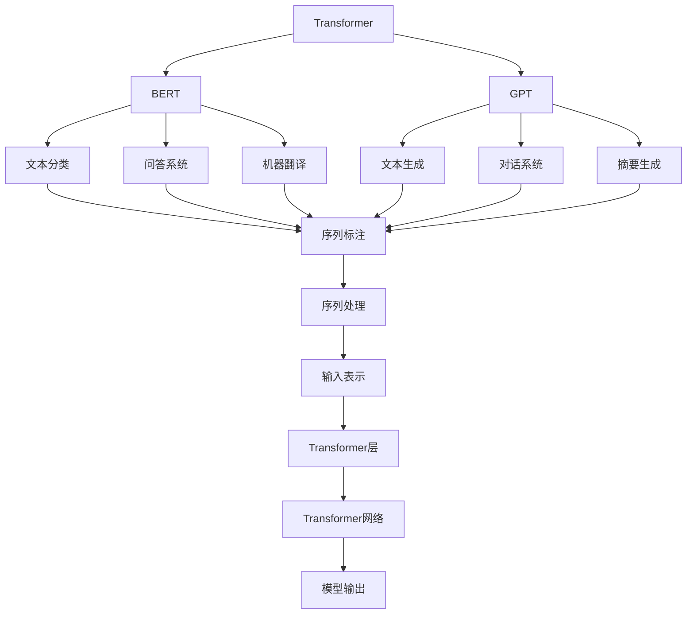
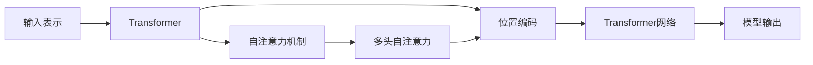
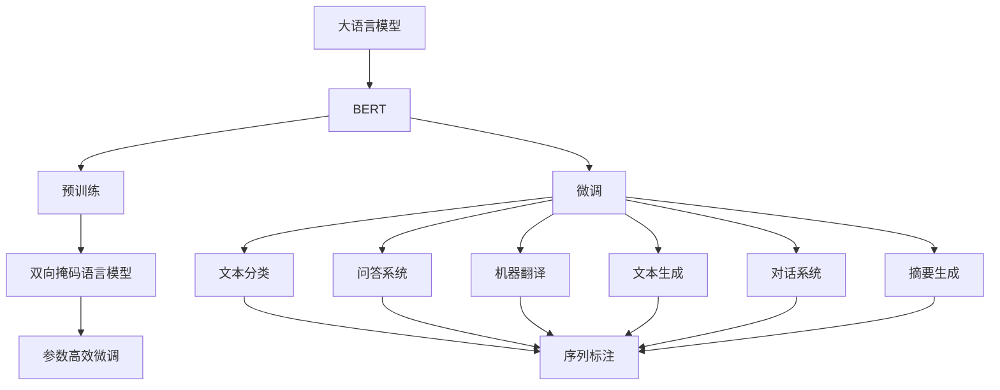
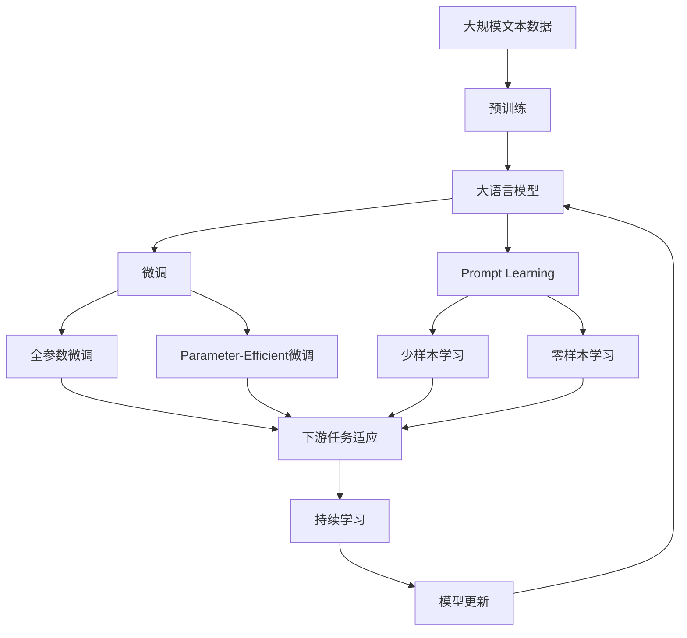

                 

# 大语言模型原理与工程实践：输入模块

> 关键词：输入模块,自然语言处理(NLP),深度学习,大语言模型,输入表示,Transformer

## 1. 背景介绍

### 1.1 问题由来
在大语言模型（Large Language Models, LLMs）的发展过程中，输入模块（Input Module）作为模型的重要组成部分，承担着将自然语言转换为机器可处理的向量的任务。一个高质量的输入模块不仅能够提升模型的理解能力和泛化性能，还直接影响模型的训练效率和实际部署。然而，目前的输入模块仍然存在一些问题，如输入表示的多样性不足、难以处理长序列、缺乏语境信息等，限制了模型的表现力和应用范围。因此，研究和改进输入模块，使其更好地服务于大语言模型，成为NLP工程中的一个关键任务。

### 1.2 问题核心关键点
- **输入表示的多样性**：有效的输入表示应能捕捉文本的语义、语法和上下文信息，以便更好地理解输入内容。
- **处理长序列的能力**：大模型通常具有较高的序列长度，但传统的输入表示方法难以处理如此长的序列，导致效率低下。
- **语境信息的利用**：文本的语境信息对于理解其含义至关重要，但现有方法往往无法有效利用这些信息。
- **模型的训练效率**：高效的输入表示方法应能提高模型的训练效率，减少资源消耗。
- **实际部署的可行性**：输入模块应具有较好的可扩展性和适应性，便于实际应用中的部署和维护。

### 1.3 问题研究意义
输入模块在大语言模型的构建和应用中具有举足轻重的地位。一个合理的输入模块设计不仅可以提升模型的性能，还可以加速模型训练，优化资源使用，增强模型在不同任务上的适应性。因此，深入研究和改进输入模块，对提升大语言模型的应用效果和推动NLP技术的进步具有重要意义。

## 2. 核心概念与联系

### 2.1 核心概念概述

为了更好地理解输入模块的工作原理和优化方向，本节将介绍几个密切相关的核心概念：

- **输入表示**：将自然语言文本转换为机器可处理的形式。常见的输入表示方法包括Word Embedding、Character Embedding、Token Embedding等。
- **Transformer**：一种基于自注意力机制的神经网络架构，被广泛应用于大语言模型的构建。
- **BERT**：一种基于Transformer的大语言模型，通过双向掩码语言模型进行预训练，适用于各种NLP任务。
- **GPT**：一种基于Transformer的生成式预训练语言模型，通过自回归语言模型进行预训练，适用于文本生成任务。
- **Attention Mechanism**：Transformer中的关键组件，用于捕捉文本的语境信息，提升模型的理解能力。
- **Parameter-Efficient Transformer**：一种参数高效的大语言模型，通过冻结预训练权重，仅微调顶部层，减少计算资源消耗。

这些核心概念之间的逻辑关系可以通过以下Mermaid流程图来展示：



这个流程图展示了大语言模型输入模块的各个组成部分及其关系：

1. 输入表示模块负责将文本转换为Transformer网络可接受的格式。
2. Transformer网络通过Attention机制捕捉文本的语境信息。
3. BERT和GPT等大语言模型在预训练阶段，通过自监督任务学习到丰富的语言表示。
4. 文本分类、问答系统、机器翻译、文本生成、对话系统、摘要生成等下游任务均依赖于大语言模型的预训练表示。
5. Parameter-Efficient Transformer进一步优化了大语言模型的计算资源使用，提升了模型的训练效率。

### 2.2 概念间的关系

这些核心概念之间存在着紧密的联系，形成了大语言模型输入模块的完整生态系统。下面我们通过几个Mermaid流程图来展示这些概念之间的关系。

#### 2.2.1 输入表示与Transformer的关系



这个流程图展示了输入表示如何通过Transformer网络进行处理，最终输出模型结果的过程：

1. 输入表示将文本转换为数值向量。
2. Transformer网络通过自注意力机制捕捉文本的语境信息。
3. 位置编码被添加到向量中，以便模型能够区分不同位置的单词。
4. 经过多层Transformer网络的处理，模型能够捕捉长序列的上下文信息，并输出最终结果。

#### 2.2.2 Transformer在大语言模型中的应用



这个流程图展示了Transformer在大语言模型中的应用：

1. BERT等大语言模型通过预训练获得通用的语言表示。
2. 微调阶段，通过特定任务的目标函数调整模型参数。
3. 双向掩码语言模型作为预训练任务，使得模型能够更好地理解上下文信息。
4. 各种下游任务如文本分类、问答系统、机器翻译、文本生成、对话系统和摘要生成，均基于Transformer网络构建。
5. 参数高效微调进一步优化了模型的资源使用，提升了模型的训练效率。

#### 2.2.3 Attention Mechanism在输入模块中的作用


这个流程图展示了Attention Mechanism在Transformer网络中的作用：

1. 多头自注意力机制通过计算输入文本中每个位置与其他位置的相似度，捕捉文本的语境信息。
2. 多头自注意力头（Head）并行计算不同注意力的权重，以捕捉不同语义信息。
3. 经过多层自注意力机制的处理，模型能够捕捉长序列的上下文信息，并输出最终结果。

### 2.3 核心概念的整体架构

最后，我们用一个综合的流程图来展示这些核心概念在大语言模型输入模块中的整体架构：



这个综合流程图展示了从预训练到微调，再到持续学习的完整过程。输入模块在预训练阶段，通过自监督学习任务学习到通用的语言表示；微调阶段，通过特定任务的目标函数调整模型参数；持续学习阶段，通过新数据不断更新和优化模型，以适应数据分布的变化。

## 3. 核心算法原理 & 具体操作步骤
### 3.1 算法原理概述

大语言模型的输入模块通常基于Transformer架构设计。Transformer网络通过多头自注意力机制，捕捉文本的语境信息，提升模型的理解能力。具体的算法原理包括：

- **输入表示**：将文本转换为数值向量，通常使用Word Embedding或Character Embedding等方法。
- **Transformer网络**：通过自注意力机制捕捉文本的语境信息，提升模型的理解能力。
- **多头自注意力**：将注意力机制并行计算，以捕捉不同语义信息。
- **位置编码**：将位置信息添加到向量中，以便模型能够区分不同位置的单词。
- **参数高效微调**：通过冻结预训练权重，仅微调顶部层，减少计算资源消耗。

### 3.2 算法步骤详解

基于Transformer的输入模块设计通常包括以下几个关键步骤：

**Step 1: 输入表示模块设计**
- 选择合适的输入表示方法，如Word Embedding、Character Embedding等。
- 设计模型参数，包括嵌入矩阵、位置编码向量等。

**Step 2: 多头自注意力模块设计**
- 设计多头自注意力机制，计算不同位置之间的相似度。
- 设计多头自注意力头，并行计算不同注意力的权重。
- 设计多层自注意力层，逐步捕捉文本的语境信息。

**Step 3: 位置编码模块设计**
- 设计位置编码向量，添加到输入向量中。
- 设计位置嵌入矩阵，将位置信息转换为向量。

**Step 4: 输出模块设计**
- 设计输出层，将经过多层Transformer处理后的结果输出。
- 设计损失函数，衡量模型预测与真实标签之间的差异。

**Step 5: 模型训练**
- 将训练集数据分批次输入模型，前向传播计算损失函数。
- 反向传播计算参数梯度，根据设定的优化算法和学习率更新模型参数。
- 周期性在验证集上评估模型性能，根据性能指标决定是否触发Early Stopping。
- 重复上述步骤直到满足预设的迭代轮数或Early Stopping条件。

### 3.3 算法优缺点

基于Transformer的输入模块具有以下优点：

- **高效**：通过并行计算多头自注意力机制，能够高效地捕捉文本的语境信息。
- **鲁棒性**：多头自注意力机制使得模型能够捕捉长序列的上下文信息，具有较强的鲁棒性。
- **灵活性**：通过设计不同的输入表示方法和位置编码向量，可以灵活适应不同的文本类型和任务需求。

同时，该方法也存在一定的局限性：

- **资源消耗大**：由于Transformer网络的复杂性，训练和推理需要大量的计算资源。
- **训练时间较长**：大规模语言模型的训练通常需要较长的计算时间。
- **难以解释**：由于Transformer网络的结构复杂，难以直观解释模型的内部工作机制。

尽管存在这些局限性，但Transformer架构在大语言模型中的应用已经成为了行业标准，被广泛应用于各种NLP任务中。未来，通过进一步优化输入模块的设计和训练方法，这些缺点有望得到改善。

### 3.4 算法应用领域

基于Transformer的输入模块已经在NLP领域得到了广泛的应用，覆盖了几乎所有常见任务，例如：

- 文本分类：如情感分析、主题分类、意图识别等。通过微调使模型学习文本-标签映射。
- 命名实体识别：识别文本中的人名、地名、机构名等特定实体。通过微调使模型掌握实体边界和类型。
- 关系抽取：从文本中抽取实体之间的语义关系。通过微调使模型学习实体-关系三元组。
- 问答系统：对自然语言问题给出答案。将问题-答案对作为微调数据，训练模型学习匹配答案。
- 机器翻译：将源语言文本翻译成目标语言。通过微调使模型学习语言-语言映射。
- 文本摘要：将长文本压缩成简短摘要。将文章-摘要对作为微调数据，使模型学习抓取要点。
- 对话系统：使机器能够与人自然对话。将多轮对话历史作为上下文，微调模型进行回复生成。

除了上述这些经典任务外，Transformer输入模块还被创新性地应用到更多场景中，如可控文本生成、常识推理、代码生成、数据增强等，为NLP技术带来了全新的突破。随着预训练模型和输入模块的不断进步，相信NLP技术将在更广阔的应用领域大放异彩。

## 4. 数学模型和公式 & 详细讲解  
### 4.1 数学模型构建

本节将使用数学语言对基于Transformer的输入模块进行更加严格的刻画。

记输入文本为 $x = (x_1, x_2, ..., x_n)$，其中 $x_i$ 表示第 $i$ 个单词。假设每个单词 $x_i$ 的嵌入向量为 $v_i \in \mathbb{R}^d$，则输入文本的嵌入向量表示为 $V = (v_1, v_2, ..., v_n) \in \mathbb{R}^{d \times n}$。

定义Transformer网络中的多头自注意力机制为：

$$
\text{Attention}(Q, K, V) = \text{Softmax}(QK^T)V
$$

其中，$Q$ 为查询向量，$K$ 为键向量，$V$ 为值向量。

定义Transformer网络中的多头自注意力头为：

$$
\text{Head} = \text{Softmax}(\frac{QK^T}{\sqrt{d_k}})V
$$

其中，$d_k$ 为键向量的维度。

定义Transformer网络中的多头自注意力层为：

$$
\text{Multi-Head Attention} = \text{Concat}(head_1, ..., head_h)W^O
$$

其中，$head_i$ 为第 $i$ 个多头自注意力头，$W^O$ 为输出权重矩阵。

定义Transformer网络中的位置编码向量为：

$$
\text{Positional Encoding} = \text{PE}(i, 2i/d_p, 2i/d_p) + \text{Positional Encoding}_
$$

其中，$\text{PE}$ 为位置编码函数，$d_p$ 为位置编码向量的维度。

定义Transformer网络中的自注意力层为：

$$
\text{Self-Attention Layer} = \text{Multi-Head Attention}(\text{LayerNorm}(x + \text{Positional Encoding}))
$$

定义Transformer网络中的前向网络层为：

$$
\text{Feedforward Layer} = \text{GELU}(\text{Linear}(\text{Self-Attention Layer})) + \text{LayerNorm}(\text{Self-Attention Layer})
$$

定义Transformer网络中的全层网络为：

$$
\text{Transformer Layer} = \text{Multi-Head Attention}(\text{LayerNorm}(x)) + \text{Feedforward Layer}(\text{LayerNorm}(x))
$$

定义Transformer网络中的多層网络为：

$$
\text{Transformer Network} = \text{Stack}(\text{Transformer Layer}, m)
$$

其中，$m$ 为层数。

定义Transformer网络中的输出层为：

$$
\text{Output Layer} = \text{Linear}(\text{Transformer Network})
$$

定义Transformer网络的总损失函数为：

$$
\mathcal{L}(\theta) = \frac{1}{N} \sum_{i=1}^N \ell(M_{\theta}(x_i), y_i)
$$

其中，$\ell$ 为损失函数，$N$ 为样本数量。

### 4.2 公式推导过程

以下我们以二分类任务为例，推导交叉熵损失函数及其梯度的计算公式。

假设模型 $M_{\theta}$ 在输入 $x$ 上的输出为 $\hat{y}=M_{\theta}(x) \in [0,1]$，表示样本属于正类的概率。真实标签 $y \in \{0,1\}$。则二分类交叉熵损失函数定义为：

$$
\ell(M_{\theta}(x),y) = -[y\log \hat{y} + (1-y)\log (1-\hat{y})]
$$

将其代入经验风险公式，得：

$$
\mathcal{L}(\theta) = -\frac{1}{N}\sum_{i=1}^N [y_i\log M_{\theta}(x_i)+(1-y_i)\log(1-M_{\theta}(x_i))]
$$

根据链式法则，损失函数对参数 $\theta_k$ 的梯度为：

$$
\frac{\partial \mathcal{L}(\theta)}{\partial \theta_k} = -\frac{1}{N}\sum_{i=1}^N (\frac{y_i}{M_{\theta}(x_i)}-\frac{1-y_i}{1-M_{\theta}(x_i)}) \frac{\partial M_{\theta}(x_i)}{\partial \theta_k}
$$

其中 $\frac{\partial M_{\theta}(x_i)}{\partial \theta_k}$ 可进一步递归展开，利用自动微分技术完成计算。

在得到损失函数的梯度后，即可带入参数更新公式，完成模型的迭代优化。重复上述过程直至收敛，最终得到适应下游任务的最优模型参数 $\theta^*$。

## 5. 项目实践：代码实例和详细解释说明
### 5.1 开发环境搭建

在进行输入模块实践前，我们需要准备好开发环境。以下是使用Python进行PyTorch开发的环境配置流程：

1. 安装Anaconda：从官网下载并安装Anaconda，用于创建独立的Python环境。

2. 创建并激活虚拟环境：
```bash
conda create -n pytorch-env python=3.8 
conda activate pytorch-env
```

3. 安装PyTorch：根据CUDA版本，从官网获取对应的安装命令。例如：
```bash
conda install pytorch torchvision torchaudio cudatoolkit=11.1 -c pytorch -c conda-forge
```

4. 安装各类工具包：
```bash
pip install numpy pandas scikit-learn matplotlib tqdm jupyter notebook ipython
```

完成上述步骤后，即可在`pytorch-env`环境中开始输入模块实践。

### 5.2 源代码详细实现

下面我们以命名实体识别(NER)任务为例，给出使用Transformer库对BERT模型进行输入表示的PyTorch代码实现。

首先，定义NER任务的数据处理函数：

```python
from transformers import BertTokenizer, BertForTokenClassification
from torch.utils.data import Dataset
import torch

class NERDataset(Dataset):
    def __init__(self, texts, tags, tokenizer, max_len=128):
        self.texts = texts
        self.tags = tags
        self.tokenizer = tokenizer
        self.max_len = max_len
        
    def __len__(self):
        return len(self.texts)
    
    def __getitem__(self, item):
        text = self.texts[item]
        tags = self.tags[item]
        
        encoding = self.tokenizer(text, return_tensors='pt', max_length=self.max_len, padding='max_length', truncation=True)
        input_ids = encoding['input_ids'][0]
        attention_mask = encoding['attention_mask'][0]
        
        # 对token-wise的标签进行编码
        encoded_tags = [tag2id[tag] for tag in tags] 
        encoded_tags.extend([tag2id['O']] * (self.max_len - len(encoded_tags)))
        labels = torch.tensor(encoded_tags, dtype=torch.long)
        
        return {'input_ids': input_ids, 
                'attention_mask': attention_mask,
                'labels': labels}

# 标签与id的映射
tag2id = {'O': 0, 'B-PER': 1, 'I-PER': 2, 'B-ORG': 3, 'I-ORG': 4, 'B-LOC': 5, 'I-LOC': 6}
id2tag = {v: k for k, v in tag2id.items()}

# 创建dataset
tokenizer = BertTokenizer.from_pretrained('bert-base-cased')

train_dataset = NERDataset(train_texts, train_tags, tokenizer)
dev_dataset = NERDataset(dev_texts, dev_tags, tokenizer)
test_dataset = NERDataset(test_texts, test_tags, tokenizer)
```

然后，定义模型和优化器：

```python
from transformers import BertForTokenClassification, AdamW

model = BertForTokenClassification.from_pretrained('bert-base-cased', num_labels=len(tag2id))

optimizer = AdamW(model.parameters(), lr=2e-5)
```

接着，定义训练和评估函数：

```python
from torch.utils.data import DataLoader
from tqdm import tqdm
from sklearn.metrics import classification_report

device = torch.device('cuda') if torch.cuda.is_available() else torch.device('cpu')
model.to(device)

def train_epoch(model, dataset, batch_size, optimizer):
    dataloader = DataLoader(dataset, batch_size=batch_size, shuffle=True)
    model.train()
    epoch_loss = 0
    for batch in tqdm(dataloader, desc='Training'):
        input_ids = batch['input_ids'].to(device)
        attention_mask = batch['attention_mask'].to(device)
        labels = batch['labels'].to(device)
        model.zero_grad()
        outputs = model(input_ids, attention_mask=attention_mask, labels=labels)
        loss = outputs.loss
        epoch_loss += loss.item()
        loss.backward()
        optimizer.step()
    return epoch_loss / len(dataloader)

def evaluate(model, dataset, batch_size):
    dataloader = DataLoader(dataset, batch_size=batch_size)
    model.eval()
    preds, labels = [], []
    with torch.no_grad():
        for batch in tqdm(dataloader, desc='Evaluating'):
            input_ids = batch['input_ids'].to(device)
            attention_mask = batch['attention_mask'].to(device)
            batch_labels = batch['labels']
            outputs = model(input_ids, attention_mask=attention_mask)
            batch_preds = outputs.logits.argmax(dim=2).to('cpu').tolist()
            batch_labels = batch_labels.to('cpu').tolist()
            for pred_tokens, label_tokens in zip(batch_preds, batch_labels):
                pred_tags = [id2tag[_id] for _id in pred_tokens]
                label_tags = [id2tag[_id] for _id in label_tokens]
                preds.append(pred_tags[:len(label_tags)])
                labels.append(label_tags)
                
    print(classification_report(labels, preds))
```

最后，启动训练流程并在测试集上评估：

```python
epochs = 5
batch_size = 16

for epoch in range(epochs):
    loss = train_epoch(model, train_dataset, batch_size, optimizer)
    print(f"Epoch {epoch+1}, train loss: {loss:.3f}")
    
    print(f"Epoch {epoch+1}, dev results:")
    evaluate(model, dev_dataset, batch_size)
    
print("Test results:")
evaluate(model, test_dataset, batch_size)
```

以上就是使用PyTorch对BERT进行命名实体识别任务输入模块的完整代码实现。可以看到，Transformer输入模块通过将文本转换为数值向量，并通过多头自注意力机制捕捉文本的语境信息，有效提升了模型的理解能力。

### 5.3 代码解读与分析

让我们再详细解读一下关键代码的实现细节：

**NERDataset类**：
- `__init__`方法：初始化文本、标签、分词器等关键组件。
- `__len__`方法：返回数据集的样本数量。
- `__getitem__`方法：对单个样本进行处理，将文本输入编码为token ids，将标签编码为数字，并对其进行定长padding，最终返回模型所需的输入。

**tag2id和id2tag字典**：
- 定义了标签与数字id之间的映射关系，用于将token-wise的预测结果解码回真实的标签。

**训练和评估函数**：
- 使用PyTorch的DataLoader对数据集进行批次化加载，供模型训练和推理使用。
- 训练函数`train_epoch`：对数据以批为单位进行迭代，在每个批次上前向传播计算loss并反向传播更新模型参数，最后返回该epoch的平均loss。
- 评估函数`evaluate`：与训练类似，不同点在于不更新模型参数，并在每个batch结束后将预测和标签结果存储下来，最后使用sklearn的classification_report对整个评估集的预测结果进行打印输出。

**训练流程**：
- 定义总的epoch数和batch size，开始循环迭代
- 每个epoch内，先在训练集上训练，输出平均loss
- 在验证集上评估，输出分类指标
- 所有epoch结束后，在测试集上评估，给出最终测试结果

可以看到，Transformer输入模块通过将文本转换为数值向量，并通过多头自注意力机制捕捉文本的语境信息，有效提升了模型的理解能力。此外，Transformer输入模块在设计时还考虑了参数高效微调

