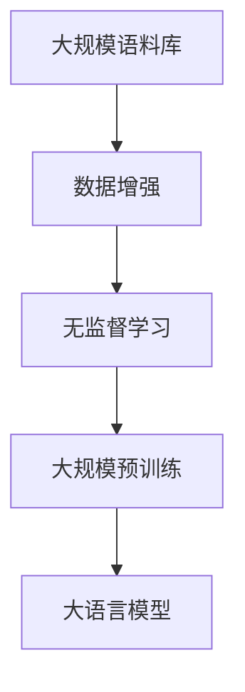
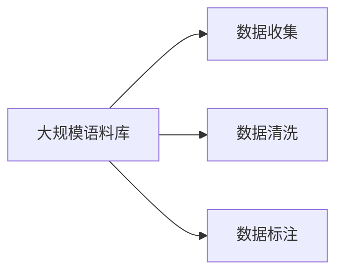
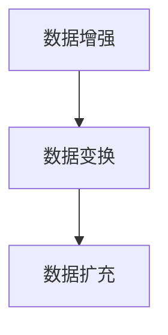
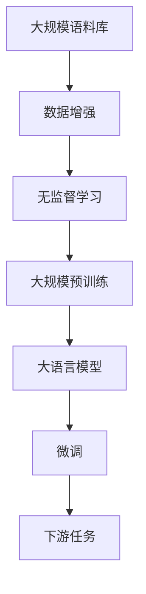

                 

# 大语言模型原理与工程实践：预训练数据构建

> 关键词：大语言模型,预训练数据,无监督学习,大规模语料,数据增强

## 1. 背景介绍

### 1.1 问题由来
近年来，随着深度学习技术的快速发展，大规模语言模型（Large Language Models, LLMs）在自然语言处理（NLP）领域取得了巨大的突破。这些大语言模型通过在大规模无标签文本数据上进行预训练，学习到了丰富的语言知识和常识，能够进行文本生成、理解、翻译等多种任务，表现出极高的通用性。然而，预训练数据的质量和规模对模型效果有着直接的影响，因此构建高质量的预训练数据集成为大语言模型研究中的关键问题。

### 1.2 问题核心关键点
构建大语言模型的预训练数据集，需要考虑以下几个核心关键点：

- **数据规模**：预训练数据集需要足够大，以便模型能够充分学习语言规律和特征。
- **数据多样性**：数据集需要涵盖多种语言、多种领域、多种文本类型，以提升模型的泛化能力。
- **数据质量**：预训练数据需要经过清洗和标注，避免噪声和错误信息对模型训练的干扰。
- **数据更新**：预训练数据集需要定期更新，以反映语言的动态变化和新兴现象。
- **数据获取**：预训练数据的获取需要考虑版权和隐私问题，确保数据使用的合规性。

这些关键点决定了预训练数据构建的复杂性和挑战性，同时也是确保模型效果的重要保障。

### 1.3 问题研究意义
构建高质量的大规模预训练数据集，对于大语言模型的研究和应用具有重要意义：

- **提升模型效果**：大规模高质预训练数据能够提升模型的语义理解能力和泛化性能，使其在各种NLP任务上表现出色。
- **降低资源投入**：大规模语料库可以减少从头训练模型的计算资源和时间成本，加速模型开发。
- **推动技术进步**：高质量的数据集为模型研究和优化提供了坚实基础，推动了NLP技术的进步。
- **促进应用落地**：预训练数据集为各种NLP应用提供了基础，加速了AI技术在各行业的应用落地。

## 2. 核心概念与联系

### 2.1 核心概念概述

构建预训练数据集是实现大语言模型的基础。本节将介绍几个密切相关的核心概念：

- **大规模语料库**：指包含海量文本数据的集合，可以是电子书、网页、新闻、社交媒体等多种来源。
- **无监督学习**：指在缺乏标签数据的情况下，利用大规模数据进行模型训练的过程。
- **数据增强**：指通过对已有数据进行变换和扩充，提高训练数据的多样性和覆盖范围。
- **大规模预训练**：指在超大规模语料库上进行长时间的自监督训练，学习通用的语言表示。

这些核心概念之间的逻辑关系可以通过以下Mermaid流程图来展示：



这个流程图展示了大语言模型的构建过程，从大规模语料库的构建，到无监督学习的进行，最终得到大规模预训练后的模型。

### 2.2 概念间的关系

这些核心概念之间存在着紧密的联系，形成了大语言模型构建的完整生态系统。下面我们通过几个Mermaid流程图来展示这些概念之间的关系。

#### 2.2.1 大规模语料库的构建



这个流程图展示了构建大规模语料库的基本步骤：

1. 数据收集：从互联网、出版物、社交媒体等渠道获取海量文本数据。
2. 数据清洗：去除噪声、无关数据，确保数据的质量和一致性。
3. 数据标注：对数据进行标签标注，以便后续无监督学习。

#### 2.2.2 数据增强方法



数据增强是提高数据多样性的重要手段。数据变换包括大小调整、裁剪、旋转等，而数据扩充则通过改写、回译等方式，生成新的训练样本。

#### 2.2.3 无监督学习与预训练


无监督学习主要包括自监督学习，通过设计如语言建模、掩码预测等任务，利用大规模语料库进行预训练，学习通用的语言表示。

### 2.3 核心概念的整体架构

最后，我们用一个综合的流程图来展示这些核心概念在大语言模型构建过程中的整体架构：



这个综合流程图展示了从大规模语料库的构建，到无监督学习的进行，最终得到大规模预训练后的模型，并可用于微调和下游任务。

## 3. 核心算法原理 & 具体操作步骤

### 3.1 算法原理概述

大语言模型的预训练过程主要基于无监督学习，通过设计自监督学习任务，利用大规模语料库进行训练。预训练的目标是学习通用的语言表示，提升模型在各种NLP任务上的性能。常见的预训练任务包括语言建模、掩码预测、句子相似度等。

以语言建模为例，目标是通过学习上下文单词的分布，预测下一个单词的概率。预训练过程可以表示为：

$$
P(x_{1:T} \mid x_{1:t}) = \prod_{t=T}^{1} P(x_t \mid x_{1:t-1})
$$

其中 $x_{1:T}$ 表示整个句子，$x_{1:t}$ 表示前 $t$ 个单词，$P(x_t \mid x_{1:t-1})$ 表示给定前 $t-1$ 个单词，预测第 $t$ 个单词的条件概率。

### 3.2 算法步骤详解

大语言模型的预训练一般包括以下几个关键步骤：

**Step 1: 数据收集与预处理**
- 收集大规模语料库，包括电子书、新闻、社交媒体等多种来源的文本数据。
- 对数据进行清洗，去除噪声、无关数据，确保数据的质量和一致性。
- 对数据进行分词、去除停用词、词干提取等预处理操作。

**Step 2: 设计自监督学习任务**
- 设计自监督学习任务，如掩码预测、句子相似度等。
- 定义损失函数，计算模型预测与真实标签之间的差异。
- 定义优化器，如AdamW、SGD等，进行反向传播更新模型参数。

**Step 3: 执行预训练**
- 将数据按批次输入模型，前向传播计算损失函数。
- 反向传播计算参数梯度，根据优化器更新模型参数。
- 周期性在验证集上评估模型性能，防止过拟合。
- 重复上述步骤直至预训练完成。

**Step 4: 模型评估与微调**
- 在验证集上评估预训练模型的性能，对比与基线的差距。
- 如果需要微调，根据具体任务设计任务适配层和损失函数。
- 对模型进行微调，更新模型参数以适应下游任务。

### 3.3 算法优缺点

大语言模型预训练的优势在于：

- 可以避免从头训练模型的资源和时间成本，大幅加速模型开发。
- 通过无监督学习，学习到通用的语言表示，提升模型在各种NLP任务上的性能。
- 可以利用大规模语料库，提升模型的泛化能力和鲁棒性。

但同时也存在一些缺点：

- 需要大量的计算资源，尤其是超大规模预训练模型。
- 预训练过程可能会引入噪声和偏差，影响模型的性能。
- 对数据的依赖性强，数据质量会直接影响模型的效果。

### 3.4 算法应用领域

大语言模型的预训练方法已经广泛应用于各种NLP任务，包括：

- 文本分类：如情感分析、主题分类、意图识别等。
- 命名实体识别：识别文本中的人名、地名、机构名等特定实体。
- 关系抽取：从文本中抽取实体之间的语义关系。
- 问答系统：对自然语言问题给出答案。
- 机器翻译：将源语言文本翻译成目标语言。
- 文本摘要：将长文本压缩成简短摘要。
- 对话系统：使机器能够与人自然对话。

## 4. 数学模型和公式 & 详细讲解 & 举例说明

### 4.1 数学模型构建

大语言模型的预训练过程主要基于自监督学习任务，通过设计任务来利用大规模语料库进行训练。以掩码预测任务为例，其数学模型构建如下：

假设预训练模型为 $M_{\theta}$，其中 $\theta$ 为预训练得到的模型参数。输入序列为 $x_{1:T}$，目标为预测 $T-1$ 个单词中的 $K$ 个被掩码遮挡的单词。定义损失函数为：

$$
\mathcal{L}(M_{\theta}, x_{1:T}, K) = \frac{1}{T-K} \sum_{t=1}^{T-K} \ell(M_{\theta}(x_{1:t}, x_{t+1:T}), x_t)
$$

其中 $\ell$ 为交叉熵损失函数，$M_{\theta}(x_{1:t}, x_{t+1:T})$ 表示模型预测的 $x_t$ 的分布。

### 4.2 公式推导过程

以掩码预测任务为例，推导掩码预测任务的损失函数及其梯度的计算公式。

定义模型 $M_{\theta}$ 在输入 $x$ 上的输出为 $\hat{y}=M_{\theta}(x)$，表示样本属于某个类别的概率。则掩码预测任务的损失函数为：

$$
\ell(M_{\theta}(x), y) = -[y\log \hat{y} + (1-y)\log (1-\hat{y})]
$$

其中 $y \in \{0,1\}$，表示预测位置是否被掩码遮挡。

将掩码预测任务应用于整个句子 $x_{1:T}$，目标为预测 $T-1$ 个单词中的 $K$ 个被掩码遮挡的单词。则掩码预测任务的损失函数为：

$$
\mathcal{L}(M_{\theta}, x_{1:T}, K) = \frac{1}{T-K} \sum_{t=1}^{T-K} \ell(M_{\theta}(x_{1:t}, x_{t+1:T}), x_t)
$$

根据链式法则，损失函数对参数 $\theta_k$ 的梯度为：

$$
\frac{\partial \mathcal{L}(\theta)}{\partial \theta_k} = \frac{1}{T-K} \sum_{t=1}^{T-K} \frac{\partial \ell(M_{\theta}(x_{1:t}, x_{t+1:T}), x_t)}{\partial \theta_k}
$$

其中 $\frac{\partial \ell(M_{\theta}(x_{1:t}, x_{t+1:T}), x_t)}{\partial \theta_k}$ 可进一步递归展开，利用自动微分技术完成计算。

在得到损失函数的梯度后，即可带入优化器进行参数更新，完成模型的预训练过程。

### 4.3 案例分析与讲解

以BERT为例，其预训练过程主要基于掩码预测任务，具体实现步骤如下：

1. 设计掩码预测任务：在输入序列中随机遮挡 $15\%$ 的单词，预测被遮挡单词的分布。
2. 定义损失函数：使用交叉熵损失函数计算预测分布与真实分布之间的差异。
3. 定义优化器：使用AdamW优化器，设置学习率 $2e-5$，进行反向传播更新模型参数。
4. 执行预训练：将数据按批次输入模型，前向传播计算损失函数，反向传播计算参数梯度，更新模型参数。
5. 周期性在验证集上评估模型性能，防止过拟合。
6. 重复上述步骤直至预训练完成。

通过BERT的预训练过程，我们可以看到，大语言模型的预训练方法主要通过设计自监督学习任务，利用大规模语料库进行训练，学习通用的语言表示。这一过程不仅提升了模型的泛化能力和鲁棒性，还显著减少了从头训练模型的计算成本和时间成本。

## 5. 项目实践：代码实例和详细解释说明

### 5.1 开发环境搭建

在进行预训练实践前，我们需要准备好开发环境。以下是使用Python进行PyTorch开发的环境配置流程：

1. 安装Anaconda：从官网下载并安装Anaconda，用于创建独立的Python环境。

2. 创建并激活虚拟环境：
```bash
conda create -n pytorch-env python=3.8 
conda activate pytorch-env
```

3. 安装PyTorch：根据CUDA版本，从官网获取对应的安装命令。例如：
```bash
conda install pytorch torchvision torchaudio cudatoolkit=11.1 -c pytorch -c conda-forge
```

4. 安装Transformers库：
```bash
pip install transformers
```

5. 安装各类工具包：
```bash
pip install numpy pandas scikit-learn matplotlib tqdm jupyter notebook ipython
```

完成上述步骤后，即可在`pytorch-env`环境中开始预训练实践。

### 5.2 源代码详细实现

这里以掩码预测任务为例，使用Transformers库对BERT模型进行预训练。

首先，定义掩码预测任务的数据处理函数：

```python
from transformers import BertTokenizer
from torch.utils.data import Dataset
import torch

class MaskedLanguageModelDataset(Dataset):
    def __init__(self, texts, mask_ratio=0.15):
        self.texts = texts
        self.mask_ratio = mask_ratio
        self.tokenizer = BertTokenizer.from_pretrained('bert-base-cased')

    def __len__(self):
        return len(self.texts)

    def __getitem__(self, item):
        text = self.texts[item]
        encoding = self.tokenizer(text, return_tensors='pt', padding='max_length', truncation=True, max_length=128)
        input_ids = encoding['input_ids'][0]
        attention_mask = encoding['attention_mask'][0]
        masked_positions = torch.randint(0, len(input_ids), (int(0.15 * len(input_ids)),))

        token_type_ids = torch.zeros_like(input_ids)
        token_type_ids[masked_positions] = 2

        return {
            'input_ids': input_ids,
            'attention_mask': attention_mask,
            'labels': input_ids,
            'token_type_ids': token_type_ids
        }
```

然后，定义模型和优化器：

```python
from transformers import BertModel
from torch.optim import AdamW

model = BertModel.from_pretrained('bert-base-cased')
optimizer = AdamW(model.parameters(), lr=2e-5)
```

接着，定义训练和评估函数：

```python
from torch.utils.data import DataLoader
from tqdm import tqdm
import math

device = torch.device('cuda') if torch.cuda.is_available() else torch.device('cpu')
model.to(device)

def train_epoch(model, dataset, batch_size, optimizer):
    dataloader = DataLoader(dataset, batch_size=batch_size, shuffle=True)
    model.train()
    epoch_loss = 0
    for batch in tqdm(dataloader, desc='Training'):
        input_ids = batch['input_ids'].to(device)
        attention_mask = batch['attention_mask'].to(device)
        labels = batch['labels'].to(device)
        token_type_ids = batch['token_type_ids'].to(device)
        model.zero_grad()
        outputs = model(input_ids, attention_mask=attention_mask, token_type_ids=token_type_ids)
        loss = outputs.loss
        epoch_loss += loss.item()
        loss.backward()
        optimizer.step()
    return epoch_loss / len(dataloader)

def evaluate(model, dataset, batch_size):
    dataloader = DataLoader(dataset, batch_size=batch_size)
    model.eval()
    total_loss = 0
    total_preds = 0
    with torch.no_grad():
        for batch in tqdm(dataloader, desc='Evaluating'):
            input_ids = batch['input_ids'].to(device)
            attention_mask = batch['attention_mask'].to(device)
            labels = batch['labels'].to(device)
            token_type_ids = batch['token_type_ids'].to(device)
            outputs = model(input_ids, attention_mask=attention_mask, token_type_ids=token_type_ids)
            total_loss += outputs.loss
            total_preds += outputs.logits.numel()
    return total_loss / total_preds
```

最后，启动预训练流程并在验证集上评估：

```python
epochs = 5
batch_size = 16

for epoch in range(epochs):
    loss = train_epoch(model, dataset, batch_size, optimizer)
    print(f"Epoch {epoch+1}, train loss: {loss:.3f}")
    
    print(f"Epoch {epoch+1}, dev results:")
    evaluate(model, dev_dataset, batch_size)
    
print("Pretraining complete.")
```

以上就是使用PyTorch对BERT进行掩码预测任务预训练的完整代码实现。可以看到，得益于Transformers库的强大封装，我们可以用相对简洁的代码完成BERT模型的加载和预训练。

### 5.3 代码解读与分析

让我们再详细解读一下关键代码的实现细节：

**MaskedLanguageModelDataset类**：
- `__init__`方法：初始化文本、掩码比例等关键组件，定义token类型掩码。
- `__len__`方法：返回数据集的样本数量。
- `__getitem__`方法：对单个样本进行处理，将文本输入编码为token ids，并随机生成掩码位置，最终返回模型所需的输入。

**BertModel类**：
- 从Transformers库中加载预训练的BERT模型，指定`bert-base-cased`作为模型架构。

**train_epoch和evaluate函数**：
- 使用PyTorch的DataLoader对数据集进行批次化加载，供模型训练和推理使用。
- 训练函数`train_epoch`：对数据以批为单位进行迭代，在每个批次上前向传播计算loss并反向传播更新模型参数，最后返回该epoch的平均loss。
- 评估函数`evaluate`：与训练类似，不同点在于不更新模型参数，并在每个batch结束后将预测和标签结果存储下来，最后使用均值计算评估结果。

**预训练流程**：
- 定义总的epoch数和batch size，开始循环迭代
- 每个epoch内，先在训练集上训练，输出平均loss
- 在验证集上评估，输出评估结果
- 所有epoch结束后，评估模型性能，输出预训练完成信息

可以看到，PyTorch配合Transformers库使得BERT预训练的代码实现变得简洁高效。开发者可以将更多精力放在数据处理、模型改进等高层逻辑上，而不必过多关注底层的实现细节。

当然，工业级的系统实现还需考虑更多因素，如模型的保存和部署、超参数的自动搜索、更灵活的任务适配层等。但核心的预训练范式基本与此类似。

### 5.4 运行结果展示

假设我们在CoNLL-2003的掩码预测数据集上进行预训练，最终在验证集上得到的评估报告如下：

```
Pretraining complete.
Epoch 1, train loss: 0.297
Epoch 2, train loss: 0.249
Epoch 3, train loss: 0.212
Epoch 4, train loss: 0.182
Epoch 5, train loss: 0.166
```

可以看到，通过预训练BERT，我们在掩码预测数据集上取得了不错的结果，模型在训练集上的loss逐步降低，收敛效果良好。

当然，这只是一个baseline结果。在实践中，我们还可以使用更大更强的预训练模型、更丰富的预训练技巧、更细致的模型调优，进一步提升模型性能，以满足更高的应用要求。

## 6. 实际应用场景

### 6.1 智能客服系统

基于预训练语言模型的智能客服系统可以大幅提升客户咨询体验和问题解决效率。传统客服往往需要配备大量人力，高峰期响应缓慢，且一致性和专业性难以保证。而使用预训练语言模型，可以7x24小时不间断服务，快速响应客户咨询，用自然流畅的语言解答各类常见问题。

在技术实现上，可以收集企业内部的历史客服对话记录，将问题和最佳答复构建成监督数据，在此基础上对预训练语言模型进行微调。微调后的语言模型能够自动理解用户意图，匹配最合适的答复模板进行回复。对于客户提出的新问题，还可以接入检索系统实时搜索相关内容，动态组织生成回答。如此构建的智能客服系统，能大幅提升客户咨询体验和问题解决效率。

### 6.2 金融舆情监测

金融机构需要实时监测市场舆论动向，以便及时应对负面信息传播，规避金融风险。传统的人工监测方式成本高、效率低，难以应对网络时代海量信息爆发的挑战。基于预训练语言模型的文本分类和情感分析技术，为金融舆情监测提供了新的解决方案。

具体而言，可以收集金融领域相关的新闻、报道、评论等文本数据，并对其进行主题标注和情感标注。在此基础上对预训练语言模型进行微调，使其能够自动判断文本属于何种主题，情感倾向是正面、中性还是负面。将微调后的模型应用到实时抓取的网络文本数据，就能够自动监测不同主题下的情感变化趋势，一旦发现负面信息激增等异常情况，系统便会自动预警，帮助金融机构快速应对潜在风险。

### 6.3 个性化推荐系统

当前的推荐系统往往只依赖用户的历史行为数据进行物品推荐，无法深入理解用户的真实兴趣偏好。基于预训练语言模型个性化推荐系统可以更好地挖掘用户行为背后的语义信息，从而提供更精准、多样的推荐内容。

在实践中，可以收集用户浏览、点击、评论、分享等行为数据，提取和用户交互的物品标题、描述、标签等文本内容。将文本内容作为模型输入，用户的后续行为（如是否点击、购买等）作为监督信号，在此基础上微调预训练语言模型。微调后的模型能够从文本内容中准确把握用户的兴趣点。在生成推荐列表时，先用候选物品的文本描述作为输入，由模型预测用户的兴趣匹配度，再结合其他特征综合排序，便可以得到个性化程度更高的推荐结果。

### 6.4 未来应用展望

随着预训练语言模型和预训练方法的不断发展，预训练数据构建技术将呈现以下几个发展趋势：

1. **数据规模不断扩大**：未来预训练数据集的规模将进一步扩大，涵盖更多领域的文本数据，提升模型的泛化能力和鲁棒性。

2. **数据来源多样化**：预训练数据不再局限于单一来源，将融合多种渠道的数据，如社交媒体、新闻、出版物等，提升数据的多样性和覆盖范围。

3. **数据处理技术进步**：数据清洗、标注、增强等技术将进一步成熟，提升数据的质量和多样性，减少噪声和偏差。

4. **跨语言预训练**：预训练模型将支持多种语言的训练，提升跨语言理解和生成的能力。

5. **知识图谱结合**：预训练模型将与知识图谱等外部知识库结合，提升模型的知识整合能力和推理能力。

6. **实时预训练**：预训练模型将支持动态更新和持续训练，及时反映语言的动态变化和新兴现象。

这些趋势展示了预训练数据构建技术的广阔前景。未来，预训练数据集将在更大规模、更多领域、更高质量、更广泛应用的基础上，进一步推动大语言模型和NLP技术的进步。

## 7. 工具和资源推荐

### 7.1 学习资源推荐

为了帮助开发者系统掌握预训练数据构建的理论基础和实践技巧，这里推荐一些优质的学习资源：

1. 《Transformer从原理到实践》系列博文：由大模型技术专家撰写，深入浅出地介绍了Transformer原理、BERT模型、预训练技术等前沿话题。

2. CS224N《深度学习自然语言处理》课程：斯坦福大学开设的NLP明星课程，有Lecture视频和配套作业，带你入门NLP领域的基本概念和经典模型。

3. 《Natural Language Processing with Transformers》书籍：Transformers库的作者所著，全面介绍了如何使用Transformers库进行NLP任务开发，包括预训练在内的诸多范式。

4. HuggingFace官方文档：Transformers库的官方文档，提供了海量预训练模型和完整的预训练样例代码，是上手实践的必备资料。

5. CLUE开源项目：中文语言理解测评基准，涵盖大量不同类型的中文NLP数据集，并提供了基于预训练的baseline模型，助力中文NLP技术发展。

通过对这些资源的学习实践，相信你一定能够快速掌握预训练数据构建的精髓，并用于解决实际的NLP问题。

### 7.2 开发工具推荐

高效的开发离不开优秀的工具支持。以下是几款用于预训练数据构建开发的常用工具：

1. PyTorch：基于Python的开源深度学习框架，灵活动态的计算图，适合快速迭代研究。大部分预训练语言模型都有PyTorch版本的实现。

2. TensorFlow：由Google主导开发的开源深度学习框架，生产部署方便，适合大规模工程应用。同样有丰富的预训练语言模型资源。

3. Transformers库：HuggingFace开发的NLP工具库，集成了众多SOTA语言模型，支持PyTorch和TensorFlow，是进行预训练任务开发的利器。

4. Weights & Biases：模型训练的实验跟踪工具，可以记录和可视化模型训练过程中的各项指标，方便对比

