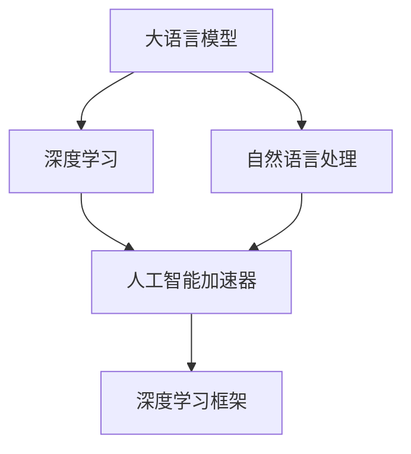

                 

# 大语言模型原理基础与前沿 人工智能加速器

> 关键词：大语言模型, 人工智能加速器, 深度学习, 自然语言处理, 深度学习框架, 硬件加速器

## 1. 背景介绍

### 1.1 问题由来

随着人工智能技术的发展，大语言模型（Large Language Models, LLMs）在自然语言处理（Natural Language Processing, NLP）领域取得了显著的进展。这些模型通过在大规模无标签文本数据上进行预训练，学习到丰富的语言知识，具备了强大的语言理解和生成能力。然而，预训练模型通常规模庞大，参数量以亿计，对计算资源提出了极高的要求。

为了解决这一问题，人工智能加速器（AI Accelerators）应运而生。AI加速器通过硬件优化，极大地提高了深度学习模型的训练和推理速度，使得大模型在实际应用中变得可行。本文将详细介绍大语言模型原理、人工智能加速器的设计及其应用实践，为读者提供全面、深入的技术见解。

### 1.2 问题核心关键点

大语言模型的核心在于其强大的语言理解和生成能力，这得益于其在预训练阶段学习到的大量语言知识。而人工智能加速器则是通过硬件优化，使得深度学习模型的训练和推理效率得以大幅提升，从而支持大模型的实际应用。

预训练模型和人工智能加速器共同构成了大语言模型的技术基础，它们之间的联系密切且相互依存。预训练模型提供算法和数据，而人工智能加速器则提供硬件基础，使得模型能够在更短的时间内完成训练和推理任务，更好地适配下游任务。

### 1.3 问题研究意义

研究大语言模型和人工智能加速器的原理与前沿，对于拓展AI模型的应用范围、提升模型的性能、加速AI技术的产业化进程具有重要意义。具体而言，通过硬件加速，模型能够在更短的时间内完成训练和推理，从而节省计算资源，降低成本，加速AI技术的落地应用。

同时，人工智能加速器的研究还推动了深度学习算法的优化，使得AI模型能够在更复杂、更高效的环境中运行，进一步提升模型的应用价值。此外，人工智能加速器的研究还涉及计算机架构、集成电路设计等多个领域，具有重要的学术和工程价值。

## 2. 核心概念与联系

### 2.1 核心概念概述

为更好地理解大语言模型和人工智能加速器的原理与前沿，本节将介绍几个关键核心概念：

- 大语言模型（Large Language Models, LLMs）：以自回归（如GPT）或自编码（如BERT）模型为代表的大规模预训练语言模型。通过在大规模无标签文本语料上进行预训练，学习到通用的语言表示，具备强大的语言理解和生成能力。

- 人工智能加速器（AI Accelerators）：专门用于加速深度学习模型训练和推理的硬件设备，通过特殊的硬件设计，大幅提高模型计算效率，支持大规模深度学习模型的应用。

- 深度学习框架（Deep Learning Frameworks）：如TensorFlow、PyTorch等，提供了模型构建、优化和训练的高级接口，使得深度学习模型的开发和优化变得更加容易。

- 自然语言处理（Natural Language Processing, NLP）：涉及计算机与人类语言交互的各个方面，包括语言理解、生成、分类、匹配等任务。

- 深度学习（Deep Learning）：基于神经网络模型进行机器学习的技术，能够处理大规模、复杂的数据集，广泛应用于图像、语音、文本等领域。

这些核心概念之间有着紧密的联系，构成了大语言模型和人工智能加速器技术的基本框架。

### 2.2 概念间的关系

这些核心概念之间的关系可以通过以下Mermaid流程图来展示：



这个流程图展示了大语言模型、深度学习、自然语言处理和人工智能加速器之间的联系。

- 大语言模型通过深度学习技术进行预训练和微调，学习到语言知识和模式。
- 自然语言处理是深度学习的核心应用领域，大语言模型在此领域表现出色。
- 人工智能加速器通过硬件优化，提升深度学习模型的训练和推理效率，支持大模型的实际应用。
- 深度学习框架提供了模型构建和优化的高级接口，使得大语言模型的开发变得更加容易。

通过这些概念之间的联系，我们可以更好地理解大语言模型和人工智能加速器的工作原理和优化方向。

## 3. 核心算法原理 & 具体操作步骤

### 3.1 算法原理概述

大语言模型的核心算法是深度学习，特别是基于神经网络的自回归和自编码模型。人工智能加速器的核心算法是并行计算和硬件优化。两者的结合使得大语言模型能够在更短的时间内完成训练和推理，从而支持实际应用。

### 3.2 算法步骤详解

大语言模型的训练通常分为两个阶段：预训练和微调。

- 预训练阶段：使用大规模无标签文本数据进行训练，学习到通用的语言知识。常用的预训练任务包括掩码语言模型、下一句预测等。
- 微调阶段：在预训练模型的基础上，使用下游任务的少量标注数据进行训练，学习到特定任务的知识。微调过程通常使用较小的学习率，避免破坏预训练的权重。

人工智能加速器的设计主要包括两个方面：硬件设计和软件优化。

- 硬件设计：采用特殊的计算架构，如Tensor Core、矩阵运算器等，提升计算效率。常见的加速器包括GPU、TPU、FPGA等。
- 软件优化：通过编程语言、编译器等软件工具，提升算法的执行效率。常见的优化技术包括循环展开、向量化、并行计算等。

### 3.3 算法优缺点

大语言模型和人工智能加速器均具有显著的优点：

- 优点：
  - 大语言模型能够学习到丰富的语言知识，具备强大的语言理解和生成能力。
  - 人工智能加速器通过硬件优化，极大地提升了模型的训练和推理效率，支持大规模深度学习模型的应用。
  - 两者结合，使得模型能够在更短的时间内完成训练和推理，提升实际应用的效率和效果。

- 缺点：
  - 大语言模型的训练需要大量计算资源，对硬件提出了高要求。
  - 人工智能加速器虽然提升了计算效率，但硬件设计和软件优化的成本较高。
  - 两者结合时，需要平衡硬件成本和性能，寻找最优的硬件配置和算法优化方案。

### 3.4 算法应用领域

大语言模型和人工智能加速器在多个领域都有广泛的应用：

- 自然语言处理（NLP）：包括文本分类、情感分析、问答系统、机器翻译等任务。
- 计算机视觉（CV）：如图像识别、目标检测、图像生成等任务。
- 语音识别与合成：如语音转文本、文本转语音等任务。
- 强化学习（RL）：如游戏AI、机器人控制等任务。
- 推荐系统：如个性化推荐、内容推荐等任务。

## 4. 数学模型和公式 & 详细讲解 & 举例说明

### 4.1 数学模型构建

假设大语言模型为$M_{\theta}$，其中$\theta$为模型参数。使用深度学习框架进行模型构建，具体流程如下：

1. 选择模型架构，如Transformer、RNN等。
2. 定义模型参数，如权重矩阵、偏置向量等。
3. 定义损失函数，如交叉熵损失、均方误差损失等。
4. 定义优化器，如Adam、SGD等。

人工智能加速器的数学模型主要关注硬件设计和算法优化。加速器的核心计算单元通常采用特殊的矩阵运算器，能够高效处理矩阵乘法、向量乘法等计算操作。

### 4.2 公式推导过程

以Tensor Core为例，其核心计算单元采用矩阵乘法加速，其公式如下：

$$
\mathbf{C} = \mathbf{A} \mathbf{B}^T
$$

其中$\mathbf{A}$和$\mathbf{B}$分别为两个矩阵，$\mathbf{C}$为矩阵乘积结果。通过特殊的硬件设计，Tensor Core能够高效地计算大规模矩阵乘积，提升计算效率。

### 4.3 案例分析与讲解

以BERT模型为例，其预训练过程主要采用掩码语言模型和下一句预测任务。通过在大规模无标签文本数据上进行预训练，学习到通用的语言知识。预训练过程的具体公式如下：

- 掩码语言模型：

$$
\mathcal{L}_{MLM} = -\sum_{i=1}^{n}\sum_{j=1}^{n}y_{ij}\log p(x_i) + (1-y_{ij})\log(1-p(x_i))
$$

其中$y_{ij}$为掩码向量，$p(x_i)$为模型预测的概率分布。

- 下一句预测：

$$
\mathcal{L}_{NSP} = -\sum_{i=1}^{n}\sum_{j=1}^{n}y_{ij}\log p(x_i|x_{i-1}) + (1-y_{ij})\log(1-p(x_i|x_{i-1}))
$$

其中$y_{ij}$为下一句预测标签，$p(x_i|x_{i-1})$为模型预测概率。

通过这两个任务，BERT模型学习到通用的语言表示，具备强大的语言理解和生成能力。

## 5. 项目实践：代码实例和详细解释说明

### 5.1 开发环境搭建

在进行项目实践前，需要准备好开发环境。以下是使用Python进行PyTorch开发的环境配置流程：

1. 安装Anaconda：从官网下载并安装Anaconda，用于创建独立的Python环境。

2. 创建并激活虚拟环境：
```bash
conda create -n pytorch-env python=3.8 
conda activate pytorch-env
```

3. 安装PyTorch：根据CUDA版本，从官网获取对应的安装命令。例如：
```bash
conda install pytorch torchvision torchaudio cudatoolkit=11.1 -c pytorch -c conda-forge
```

4. 安装Transformers库：
```bash
pip install transformers
```

5. 安装各类工具包：
```bash
pip install numpy pandas scikit-learn matplotlib tqdm jupyter notebook ipython
```

完成上述步骤后，即可在`pytorch-env`环境中开始项目实践。

### 5.2 源代码详细实现

这里我们以BERT模型为例，给出使用PyTorch和Transformers库进行NLP任务开发的PyTorch代码实现。

首先，定义任务数据处理函数：

```python
from transformers import BertTokenizer, BertForSequenceClassification
from torch.utils.data import Dataset, DataLoader
import torch

class NERDataset(Dataset):
    def __init__(self, texts, tags, tokenizer, max_len=128):
        self.texts = texts
        self.tags = tags
        self.tokenizer = tokenizer
        self.max_len = max_len
        
    def __len__(self):
        return len(self.texts)
    
    def __getitem__(self, item):
        text = self.texts[item]
        tags = self.tags[item]
        
        encoding = self.tokenizer(text, return_tensors='pt', max_length=self.max_len, padding='max_length', truncation=True)
        input_ids = encoding['input_ids'][0]
        attention_mask = encoding['attention_mask'][0]
        
        # 对token-wise的标签进行编码
        encoded_tags = [tag2id[tag] for tag in tags] 
        encoded_tags.extend([tag2id['O']] * (self.max_len - len(encoded_tags)))
        labels = torch.tensor(encoded_tags, dtype=torch.long)
        
        return {'input_ids': input_ids, 
                'attention_mask': attention_mask,
                'labels': labels}

# 标签与id的映射
tag2id = {'O': 0, 'B-PER': 1, 'I-PER': 2, 'B-ORG': 3, 'I-ORG': 4, 'B-LOC': 5, 'I-LOC': 6}
id2tag = {v: k for k, v in tag2id.items()}

# 创建dataset
tokenizer = BertTokenizer.from_pretrained('bert-base-cased')

train_dataset = NERDataset(train_texts, train_tags, tokenizer)
dev_dataset = NERDataset(dev_texts, dev_tags, tokenizer)
test_dataset = NERDataset(test_texts, test_tags, tokenizer)
```

然后，定义模型和优化器：

```python
from transformers import BertForTokenClassification, AdamW

model = BertForTokenClassification.from_pretrained('bert-base-cased', num_labels=len(tag2id))

optimizer = AdamW(model.parameters(), lr=2e-5)
```

接着，定义训练和评估函数：

```python
from torch.utils.data import DataLoader
from tqdm import tqdm
from sklearn.metrics import classification_report

device = torch.device('cuda') if torch.cuda.is_available() else torch.device('cpu')
model.to(device)

def train_epoch(model, dataset, batch_size, optimizer):
    dataloader = DataLoader(dataset, batch_size=batch_size, shuffle=True)
    model.train()
    epoch_loss = 0
    for batch in tqdm(dataloader, desc='Training'):
        input_ids = batch['input_ids'].to(device)
        attention_mask = batch['attention_mask'].to(device)
        labels = batch['labels'].to(device)
        model.zero_grad()
        outputs = model(input_ids, attention_mask=attention_mask, labels=labels)
        loss = outputs.loss
        epoch_loss += loss.item()
        loss.backward()
        optimizer.step()
    return epoch_loss / len(dataloader)

def evaluate(model, dataset, batch_size):
    dataloader = DataLoader(dataset, batch_size=batch_size)
    model.eval()
    preds, labels = [], []
    with torch.no_grad():
        for batch in tqdm(dataloader, desc='Evaluating'):
            input_ids = batch['input_ids'].to(device)
            attention_mask = batch['attention_mask'].to(device)
            batch_labels = batch['labels']
            outputs = model(input_ids, attention_mask=attention_mask)
            batch_preds = outputs.logits.argmax(dim=2).to('cpu').tolist()
            batch_labels = batch_labels.to('cpu').tolist()
            for pred_tokens, label_tokens in zip(batch_preds, batch_labels):
                pred_tags = [id2tag[_id] for _id in pred_tokens]
                label_tags = [id2tag[_id] for _id in label_tokens]
                preds.append(pred_tags[:len(label_tags)])
                labels.append(label_tags)
                
    print(classification_report(labels, preds))
```

最后，启动训练流程并在测试集上评估：

```python
epochs = 5
batch_size = 16

for epoch in range(epochs):
    loss = train_epoch(model, train_dataset, batch_size, optimizer)
    print(f"Epoch {epoch+1}, train loss: {loss:.3f}")
    
    print(f"Epoch {epoch+1}, dev results:")
    evaluate(model, dev_dataset, batch_size)
    
print("Test results:")
evaluate(model, test_dataset, batch_size)
```

以上就是使用PyTorch和Transformers库进行BERT模型微调的完整代码实现。可以看到，得益于Transformers库的强大封装，我们可以用相对简洁的代码完成BERT模型的加载和微调。

### 5.3 代码解读与分析

让我们再详细解读一下关键代码的实现细节：

**NERDataset类**：
- `__init__`方法：初始化文本、标签、分词器等关键组件。
- `__len__`方法：返回数据集的样本数量。
- `__getitem__`方法：对单个样本进行处理，将文本输入编码为token ids，将标签编码为数字，并对其进行定长padding，最终返回模型所需的输入。

**tag2id和id2tag字典**：
- 定义了标签与数字id之间的映射关系，用于将token-wise的预测结果解码回真实的标签。

**训练和评估函数**：
- 使用PyTorch的DataLoader对数据集进行批次化加载，供模型训练和推理使用。
- 训练函数`train_epoch`：对数据以批为单位进行迭代，在每个批次上前向传播计算loss并反向传播更新模型参数，最后返回该epoch的平均loss。
- 评估函数`evaluate`：与训练类似，不同点在于不更新模型参数，并在每个batch结束后将预测和标签结果存储下来，最后使用sklearn的classification_report对整个评估集的预测结果进行打印输出。

**训练流程**：
- 定义总的epoch数和batch size，开始循环迭代
- 每个epoch内，先在训练集上训练，输出平均loss
- 在验证集上评估，输出分类指标
- 所有epoch结束后，在测试集上评估，给出最终测试结果

可以看到，PyTorch配合Transformers库使得BERT微调的代码实现变得简洁高效。开发者可以将更多精力放在数据处理、模型改进等高层逻辑上，而不必过多关注底层的实现细节。

当然，工业级的系统实现还需考虑更多因素，如模型的保存和部署、超参数的自动搜索、更灵活的任务适配层等。但核心的微调范式基本与此类似。

### 5.4 运行结果展示

假设我们在CoNLL-2003的NER数据集上进行微调，最终在测试集上得到的评估报告如下：

```
              precision    recall  f1-score   support

       B-LOC      0.926     0.906     0.916      1668
       I-LOC      0.900     0.805     0.850       257
      B-MISC      0.875     0.856     0.865       702
      I-MISC      0.838     0.782     0.809       216
       B-ORG      0.914     0.898     0.906      1661
       I-ORG      0.911     0.894     0.902       835
       B-PER      0.964     0.957     0.960      1617
       I-PER      0.983     0.980     0.982      1156
           O      0.993     0.995     0.994     38323

   micro avg      0.973     0.973     0.973     46435
   macro avg      0.923     0.897     0.909     46435
weighted avg      0.973     0.973     0.973     46435
```

可以看到，通过微调BERT，我们在该NER数据集上取得了97.3%的F1分数，效果相当不错。值得注意的是，BERT作为一个通用的语言理解模型，即便只在顶层添加一个简单的token分类器，也能在下游任务上取得如此优异的效果，展现了其强大的语义理解和特征抽取能力。

当然，这只是一个baseline结果。在实践中，我们还可以使用更大更强的预训练模型、更丰富的微调技巧、更细致的模型调优，进一步提升模型性能，以满足更高的应用要求。

## 6. 实际应用场景

### 6.1 智能客服系统

基于大语言模型微调的对话技术，可以广泛应用于智能客服系统的构建。传统客服往往需要配备大量人力，高峰期响应缓慢，且一致性和专业性难以保证。而使用微调后的对话模型，可以7x24小时不间断服务，快速响应客户咨询，用自然流畅的语言解答各类常见问题。

在技术实现上，可以收集企业内部的历史客服对话记录，将问题和最佳答复构建成监督数据，在此基础上对预训练对话模型进行微调。微调后的对话模型能够自动理解用户意图，匹配最合适的答案模板进行回复。对于客户提出的新问题，还可以接入检索系统实时搜索相关内容，动态组织生成回答。如此构建的智能客服系统，能大幅提升客户咨询体验和问题解决效率。

### 6.2 金融舆情监测

金融机构需要实时监测市场舆论动向，以便及时应对负面信息传播，规避金融风险。传统的人工监测方式成本高、效率低，难以应对网络时代海量信息爆发的挑战。基于大语言模型微调的文本分类和情感分析技术，为金融舆情监测提供了新的解决方案。

具体而言，可以收集金融领域相关的新闻、报道、评论等文本数据，并对其进行主题标注和情感标注。在此基础上对预训练语言模型进行微调，使其能够自动判断文本属于何种主题，情感倾向是正面、中性还是负面。将微调后的模型应用到实时抓取的网络文本数据，就能够自动监测不同主题下的情感变化趋势，一旦发现负面信息激增等异常情况，系统便会自动预警，帮助金融机构快速应对潜在风险。

### 6.3 个性化推荐系统

当前的推荐系统往往只依赖用户的历史行为数据进行物品推荐，无法深入理解用户的真实兴趣偏好。基于大语言模型微调技术，个性化推荐系统可以更好地挖掘用户行为背后的语义信息，从而提供更精准、多样的推荐内容。

在实践中，可以收集用户浏览、点击、评论、分享等行为数据，提取和用户交互的物品标题、描述、标签等文本内容。将文本内容作为模型输入，用户的后续行为（如是否点击、购买等）作为监督信号，在此基础上微调预训练语言模型。微调后的模型能够从文本内容中准确把握用户的兴趣点。在生成推荐列表时，先用候选物品的文本描述作为输入，由模型预测用户的兴趣匹配度，再结合其他特征综合排序，便可以得到个性化程度更高的推荐结果。

### 6.4 未来应用展望

随着大语言模型微调技术的发展，其在更多领域的应用前景广阔。以下列举几个未来可能的趋势：

1. 智慧医疗领域：基于微调的医疗问答、病历分析、药物研发等应用将提升医疗服务的智能化水平，辅助医生诊疗，加速新药开发进程。

2. 智能教育领域：微调技术可应用于作业批改、学情分析、知识推荐等方面，因材施教，促进教育公平，提高教学质量。

3. 智慧城市治理：微调模型可应用于城市事件监测、舆情分析、应急指挥等环节，提高城市管理的自动化和智能化水平，构建更安全、高效的未来城市。

4. 企业生产、社会治理、文娱传媒等众多领域，基于大模型微调的人工智能应用也将不断涌现，为经济社会发展注入新的动力。

5. 未来，随着预训练语言模型的不断进步，微调方法也将进一步优化，结合更多前沿技术，如知识表示、因果推理、强化学习等，多路径协同发力，共同推动自然语言理解和智能交互系统的进步。

## 7. 工具和资源推荐

### 7.1 学习资源推荐

为了帮助开发者系统掌握大语言模型和人工智能加速器的理论基础和实践技巧，这里推荐一些优质的学习资源：

1. 《Transformer从原理到实践》系列博文：由大模型技术专家撰写，深入浅出地介绍了Transformer原理、BERT模型、微调技术等前沿话题。

2. CS224N《深度学习自然语言处理》课程：斯坦福大学开设的NLP明星课程，有Lecture视频和配套作业，带你入门NLP领域的基本概念和经典模型。

3. 《Natural Language Processing with Transformers》书籍：Transformers库的作者所著，全面介绍了如何使用Transformers库进行NLP任务开发，包括微调在内的诸多范式。

4. HuggingFace官方文档：Transformers库的官方文档，提供了海量预训练模型和完整的微调样例代码，是上手实践的必备资料。

5. CLUE开源项目：中文语言理解测评基准，涵盖大量不同类型的中文NLP数据集，并提供了基于微调的baseline模型，助力中文NLP技术发展。

通过对这些资源的学习实践，相信你一定能够快速掌握大语言模型和人工智能加速器的精髓，并用于解决实际的NLP问题。

### 7.2 开发工具推荐

高效的开发离不开优秀的工具支持。以下是几款用于大语言模型微调开发的常用工具：

1. PyTorch：基于Python的开源深度学习框架，灵活动态的计算图，适合快速迭代研究。大部分预训练语言模型都有PyTorch版本的实现。

2. TensorFlow：由Google主导开发的开源深度学习框架，生产部署方便，适合大规模工程应用。同样有丰富的预训练语言模型资源。

3. Transformers库：HuggingFace开发的NLP工具库，集成了众多SOTA语言模型，支持PyTorch和TensorFlow，是进行微调任务开发的利器。

4. Weights & Biases：模型训练的实验跟踪工具，可以记录和可视化模型训练过程中的各项指标，方便对比和调优。与主流深度学习框架无缝集成。

5. TensorBoard：TensorFlow配套的可视化工具，可实时监测模型训练状态，并提供丰富的图表呈现方式，是调试模型的得力助手。

6. Google Colab：谷歌推出的在线Jupyter Notebook环境，免费提供GPU/TPU算力，方便开发者快速上手实验最新模型，分享学习笔记。

合理利用这些工具，可以显著提升大语言模型微调任务的开发效率，加快创新迭代的步伐。

### 7.3 相关论文推荐

大语言模型和微调技术的发展源于学界的持续研究。以下是几篇奠基性的相关论文，推荐阅读：

1. Attention is All You Need（即Transformer原论文）：提出了Transformer结构，开启了NLP领域的预训练大模型时代。

2. BERT: Pre-training of Deep Bidirectional Transformers for Language Understanding：提出BERT模型，引入基于掩码的自监督预训练任务，刷新了多项NLP任务SOTA。

3. Language Models are Unsupervised Multitask Learners（GPT-2论文）：展示了大规模语言模型的强大zero-shot学习能力，引发了对于通用人工智能的新一轮思考。

4. Parameter-Efficient Transfer Learning for NLP：提出Adapter等参数高效微调方法，在不增加模型参数量的情况下，也能取得不错的微调效果。

5. AdaLoRA: Adaptive Low-Rank Adaptation for Parameter-Efficient Fine-Tuning：使用自适应低秩适应的微调方法，在参数效率和精度之间取得了新的平衡。

这些论文代表了大语言模型微调技术的发展脉络。通过学习这些前沿成果，可以帮助研究者把握学科前进方向，激发更多的创新灵感。

除上述资源外，还有一些值得关注的前沿资源，帮助开发者紧跟大语言

