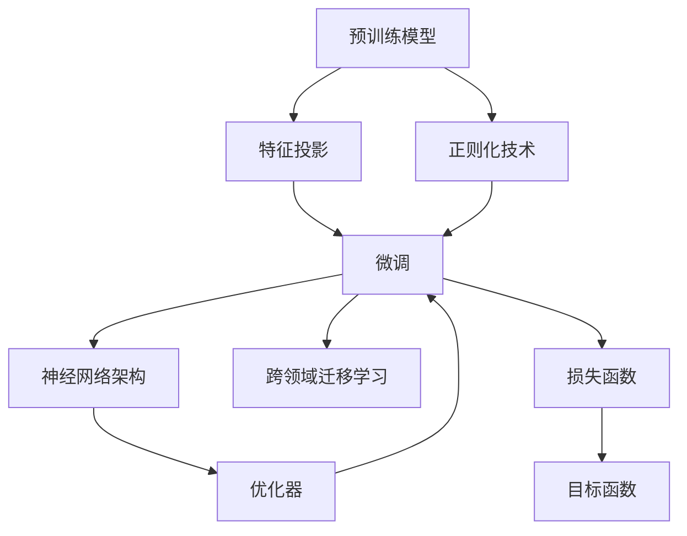
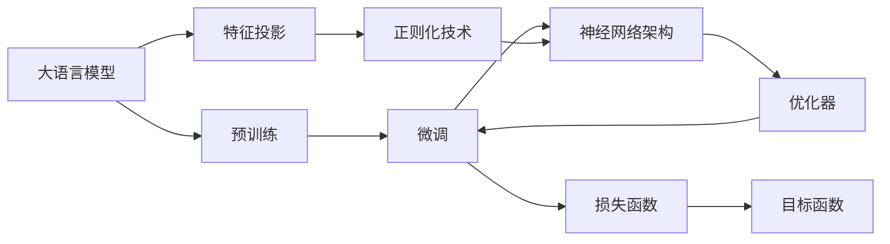
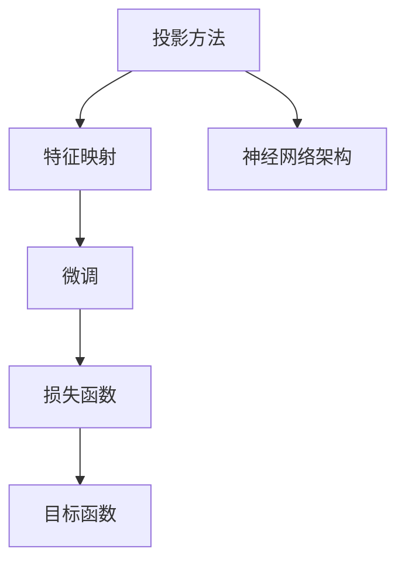

                 

# 大语言模型原理基础与前沿 基于投影和正则化的方法

> 关键词：大语言模型,投影方法,正则化技术,神经网络,深度学习,自然语言处理(NLP)

## 1. 背景介绍

### 1.1 问题由来
近年来，深度学习技术的迅猛发展，尤其是在自然语言处理(NLP)领域，通过大规模预训练语言模型，如BERT、GPT-3等，已经取得了革命性的突破。这些预训练模型在处理语言理解、生成、分类等任务上展现了强大的能力，成为推动NLP领域进步的重要力量。然而，尽管预训练模型在处理大规模无标签文本数据上表现卓越，但在特定领域的应用上，其泛化能力往往存在不足，需要针对特定任务进行微调。

微调是深度学习中一个重要的技术手段，通过在预训练模型的基础上，使用有标签数据对模型进行有监督学习，使得模型在特定任务上获得更好的性能。微调的关键在于如何避免过拟合，同时最大化利用预训练模型的知识，提升模型在特定任务上的泛化能力。本论文聚焦于基于投影和正则化的方法，探讨如何在微调过程中更高效地利用预训练模型的知识，并提升模型的泛化能力和鲁棒性。

### 1.2 问题核心关键点
基于投影和正则化的大语言模型微调方法，在技术上主要通过以下关键点进行优化：

- **投影方法**：通过将预训练模型中特定的特征映射到低维空间，使得模型能够更好地适应特定任务的特征空间。投影方法包括但不限于线性投影、矩阵分解等。

- **正则化技术**：通过在损失函数中添加正则项，避免模型在微调过程中过度拟合训练数据，同时保留预训练模型的泛化能力。正则化技术包括L2正则、Dropout、Early Stopping等。

- **深度学习框架**：现代深度学习框架如TensorFlow、PyTorch等，提供了丰富的优化器和正则化工具，支持大规模模型的微调和训练。

- **神经网络架构**：传统的全连接神经网络难以处理大规模数据和高维空间，而卷积神经网络(CNN)、循环神经网络(RNN)、Transformer等架构在处理序列数据和结构化数据上表现优异。

- **跨领域迁移学习**：通过跨领域迁移学习，预训练模型在通用领域学到的知识能够迁移到特定领域，提升模型在不同领域上的泛化能力。

这些关键点共同构成了基于投影和正则化的大语言模型微调方法的核心技术框架。本文将详细探讨这些核心技术，并结合数学模型和实际代码，提供具体的微调实现方案。

### 1.3 问题研究意义
基于投影和正则化的大语言模型微调方法，对于推动NLP技术的普及和应用，具有重要意义：

1. **提高模型泛化能力**：通过投影和正则化技术，模型在特定任务上的泛化能力得到提升，能够更好地适应不同的数据分布。
2. **减少标注数据需求**：在数据标注成本较高的情况下，投影和正则化方法能够有效降低微调过程中对标注数据的需求，提升模型训练的效率。
3. **提升模型鲁棒性**：正则化技术的应用，能够增强模型的鲁棒性，使其在面对噪声数据和对抗样本时表现更加稳定。
4. **支持大规模模型的应用**：投影方法能够处理大规模的高维数据，使得预训练模型在大规模数据上的泛化能力得到充分发挥。
5. **加速模型开发**：投影和正则化技术在模型微调过程中的高效利用，能够显著加速模型开发和应用的迭代周期。

通过深入研究投影和正则化方法，本论文旨在为NLP领域的微调实践提供更科学、更高效的指导，推动深度学习技术在实际应用中的落地和普及。

## 2. 核心概念与联系

### 2.1 核心概念概述

为了更好地理解基于投影和正则化的大语言模型微调方法，本节将介绍几个关键概念及其联系：

- **预训练模型**：如BERT、GPT-3等，通过在大规模无标签数据上进行自监督学习，学习到通用的语言表示。
- **特征投影**：将预训练模型中特定的特征映射到低维空间，使得模型能够更好地适应特定任务的特征空间。
- **正则化技术**：如L2正则、Dropout、Early Stopping等，用于避免模型在微调过程中过度拟合训练数据。
- **神经网络架构**：如CNN、RNN、Transformer等，支持大规模模型的微调和训练。
- **跨领域迁移学习**：通过将预训练模型在通用领域学到的知识迁移到特定领域，提升模型在不同领域上的泛化能力。

这些概念之间的联系通过以下Mermaid流程图展示：



此流程图展示了从预训练到微调，再到跨领域迁移学习的完整过程。特征投影和正则化技术在微调过程中发挥关键作用，优化器则支持模型的高效训练。

### 2.2 概念间的关系

这些核心概念之间存在着紧密的联系，形成了大语言模型微调的完整生态系统。下面我们通过几个Mermaid流程图来展示这些概念之间的关系：

#### 2.2.1 大语言模型的学习范式



这个流程图展示了大语言模型的学习范式，包括预训练、特征投影、正则化技术、神经网络架构、优化器和目标函数等关键组件。

#### 2.2.2 投影方法与微调的关系



这个流程图展示了投影方法在大语言模型微调中的应用，通过特征映射，使得模型能够更好地适应特定任务的特征空间。

#### 2.2.3 正则化技术与微调的关系


这个流程图展示了正则化技术在微调中的应用，通过在损失函数中添加正则项，避免模型过度拟合训练数据，提升模型泛化能力。

## 3. 核心算法原理 & 具体操作步骤
### 3.1 算法原理概述

基于投影和正则化的大语言模型微调方法，在原理上主要基于以下两个核心步骤：

1. **特征投影**：通过将预训练模型中特定的特征映射到低维空间，使得模型能够更好地适应特定任务的特征空间。这一步骤可以通过线性投影、矩阵分解等方法实现。

2. **正则化**：通过在损失函数中添加正则项，避免模型在微调过程中过度拟合训练数据，同时保留预训练模型的泛化能力。这一步骤可以通过L2正则、Dropout、Early Stopping等方法实现。

### 3.2 算法步骤详解

基于投影和正则化的大语言模型微调一般包括以下几个关键步骤：

**Step 1: 准备预训练模型和数据集**
- 选择合适的预训练语言模型 $M_{\theta}$ 作为初始化参数，如BERT、GPT等。
- 准备下游任务 $T$ 的标注数据集 $D=\{(x_i,y_i)\}_{i=1}^N, x_i \in \mathcal{X}, y_i \in \mathcal{Y}$。

**Step 2: 添加任务适配层**
- 根据任务类型，在预训练模型顶层设计合适的输出层和损失函数。
- 对于分类任务，通常在顶层添加线性分类器和交叉熵损失函数。
- 对于生成任务，通常使用语言模型的解码器输出概率分布，并以负对数似然为损失函数。

**Step 3: 设置微调超参数**
- 选择合适的优化算法及其参数，如 AdamW、SGD 等，设置学习率、批大小、迭代轮数等。
- 设置正则化技术及强度，包括权重衰减、Dropout、Early Stopping等。
- 确定冻结预训练参数的策略，如仅微调顶层，或全部参数都参与微调。

**Step 4: 执行梯度训练**
- 将训练集数据分批次输入模型，前向传播计算损失函数。
- 反向传播计算参数梯度，根据设定的优化算法和学习率更新模型参数。
- 周期性在验证集上评估模型性能，根据性能指标决定是否触发 Early Stopping。
- 重复上述步骤直到满足预设的迭代轮数或 Early Stopping 条件。

**Step 5: 测试和部署**
- 在测试集上评估微调后模型 $M_{\hat{\theta}}$ 的性能，对比微调前后的精度提升。
- 使用微调后的模型对新样本进行推理预测，集成到实际的应用系统中。
- 持续收集新的数据，定期重新微调模型，以适应数据分布的变化。

以上是基于投影和正则化的大语言模型微调的一般流程。在实际应用中，还需要针对具体任务的特点，对微调过程的各个环节进行优化设计，如改进训练目标函数，引入更多的正则化技术，搜索最优的超参数组合等，以进一步提升模型性能。

### 3.3 算法优缺点

基于投影和正则化的大语言模型微调方法具有以下优点：
1. **提高泛化能力**：通过投影和正则化技术，模型在特定任务上的泛化能力得到提升，能够更好地适应不同的数据分布。
2. **减少标注数据需求**：在数据标注成本较高的情况下，投影和正则化方法能够有效降低微调过程中对标注数据的需求，提升模型训练的效率。
3. **提升模型鲁棒性**：正则化技术的应用，能够增强模型的鲁棒性，使其在面对噪声数据和对抗样本时表现更加稳定。
4. **支持大规模模型的应用**：投影方法能够处理大规模的高维数据，使得预训练模型在大规模数据上的泛化能力得到充分发挥。
5. **加速模型开发**：投影和正则化技术在模型微调过程中的高效利用，能够显著加速模型开发和应用的迭代周期。

同时，该方法也存在一定的局限性：
1. **投影方法的复杂性**：不同的投影方法可能需要不同程度的数学推导和实现复杂度。
2. **正则化技术的平衡**：正则化强度的选择需要仔细权衡，太强或太弱的正则化都可能导致模型性能的下降。
3. **过度正则化风险**：过度正则化可能导致模型在特定任务上的性能下降，需要在微调过程中进行仔细调整。

尽管存在这些局限性，基于投影和正则化的大语言模型微调方法仍是大语言模型应用的主流范式之一。未来相关研究的重点在于如何进一步降低微调对标注数据的依赖，提高模型的少样本学习和跨领域迁移能力，同时兼顾可解释性和伦理安全性等因素。

### 3.4 算法应用领域

基于投影和正则化的大语言模型微调方法，在NLP领域已经得到了广泛的应用，覆盖了几乎所有常见任务，例如：

- 文本分类：如情感分析、主题分类、意图识别等。通过微调使模型学习文本-标签映射。
- 命名实体识别：识别文本中的人名、地名、机构名等特定实体。通过微调使模型掌握实体边界和类型。
- 关系抽取：从文本中抽取实体之间的语义关系。通过微调使模型学习实体-关系三元组。
- 问答系统：对自然语言问题给出答案。将问题-答案对作为微调数据，训练模型学习匹配答案。
- 机器翻译：将源语言文本翻译成目标语言。通过微调使模型学习语言-语言映射。
- 文本摘要：将长文本压缩成简短摘要。将文章-摘要对作为微调数据，使模型学习抓取要点。
- 对话系统：使机器能够与人自然对话。将多轮对话历史作为上下文，微调模型进行回复生成。

除了上述这些经典任务外，基于投影和正则化的大语言模型微调方法也被创新性地应用到更多场景中，如可控文本生成、常识推理、代码生成、数据增强等，为NLP技术带来了全新的突破。

## 4. 数学模型和公式 & 详细讲解  
### 4.1 数学模型构建

本节将使用数学语言对基于投影和正则化的大语言模型微调过程进行更加严格的刻画。

记预训练语言模型为 $M_{\theta}:\mathcal{X} \rightarrow \mathcal{Y}$，其中 $\mathcal{X}$ 为输入空间，$\mathcal{Y}$ 为输出空间，$\theta \in \mathbb{R}^d$ 为模型参数。假设微调任务的训练集为 $D=\{(x_i,y_i)\}_{i=1}^N, x_i \in \mathcal{X}, y_i \in \mathcal{Y}$。

定义模型 $M_{\theta}$ 在数据样本 $(x,y)$ 上的损失函数为 $\ell(M_{\theta}(x),y)$，则在数据集 $D$ 上的经验风险为：

$$
\mathcal{L}(\theta) = \frac{1}{N} \sum_{i=1}^N \ell(M_{\theta}(x_i),y_i)
$$

微调的优化目标是最小化经验风险，即找到最优参数：

$$
\theta^* = \mathop{\arg\min}_{\theta} \mathcal{L}(\theta)
$$

在实践中，我们通常使用基于梯度的优化算法（如SGD、Adam等）来近似求解上述最优化问题。设 $\eta$ 为学习率，$\lambda$ 为正则化系数，则参数的更新公式为：

$$
\theta \leftarrow \theta - \eta \nabla_{\theta}\mathcal{L}(\theta) - \eta\lambda\theta
$$

其中 $\nabla_{\theta}\mathcal{L}(\theta)$ 为损失函数对参数 $\theta$ 的梯度，可通过反向传播算法高效计算。

### 4.2 公式推导过程

以下我们以二分类任务为例，推导交叉熵损失函数及其梯度的计算公式。

假设模型 $M_{\theta}$ 在输入 $x$ 上的输出为 $\hat{y}=M_{\theta}(x) \in [0,1]$，表示样本属于正类的概率。真实标签 $y \in \{0,1\}$。则二分类交叉熵损失函数定义为：

$$
\ell(M_{\theta}(x),y) = -[y\log \hat{y} + (1-y)\log (1-\hat{y})]
$$

将其代入经验风险公式，得：

$$
\mathcal{L}(\theta) = -\frac{1}{N}\sum_{i=1}^N [y_i\log M_{\theta}(x_i)+(1-y_i)\log(1-M_{\theta}(x_i))]
$$

根据链式法则，损失函数对参数 $\theta_k$ 的梯度为：

$$
\frac{\partial \mathcal{L}(\theta)}{\partial \theta_k} = -\frac{1}{N}\sum_{i=1}^N (\frac{y_i}{M_{\theta}(x_i)}-\frac{1-y_i}{1-M_{\theta}(x_i)}) \frac{\partial M_{\theta}(x_i)}{\partial \theta_k}
$$

其中 $\frac{\partial M_{\theta}(x_i)}{\partial \theta_k}$ 可进一步递归展开，利用自动微分技术完成计算。

### 4.3 案例分析与讲解

以BERT模型为例，介绍如何使用正则化和投影方法进行微调。

首先，在BERT模型的基础上进行微调，需要先定义一个线性分类器作为任务适配层。假设微调任务为情感分析，则适配层结构如下：

```
BERT - LayerNorm - Dropout - Linear
```

其中，LayerNorm为归一化层，Dropout为正则化层，Linear为线性分类器，输出维度为1。

定义损失函数为交叉熵损失：

$$
\mathcal{L} = -\frac{1}{N}\sum_{i=1}^N \sum_{j=1}^{C} (y_{ij}\log p_{ij} + (1-y_{ij})\log(1-p_{ij}))
$$

其中 $C$ 为情感类别数，$y_{ij}$ 为样本 $i$ 在第 $j$ 个类别的标签，$p_{ij}$ 为模型对样本 $i$ 在第 $j$ 个类别的预测概率。

接下来，需要选择合适的正则化技术和投影方法。常见的正则化方法包括L2正则和Dropout，投影方法包括矩阵分解和特征映射。本节以L2正则和矩阵分解为例，进行具体说明。

#### L2正则化

L2正则化是一种常见的正则化方法，通过在损失函数中添加 $L_2$ 范数惩罚项，避免模型参数过大，防止过拟合。L2正则化的公式如下：

$$
\mathcal{L}_{\text{reg}} = \frac{\lambda}{2} \sum_{k=1}^d \theta_k^2
$$

其中 $\lambda$ 为正则化强度。

#### 矩阵分解

矩阵分解是一种常用的投影方法，通过将模型参数 $\theta$ 分解成两个低秩矩阵的乘积，使得模型能够更好地适应低维空间。矩阵分解的公式如下：

$$
\theta = U \cdot V^T
$$

其中 $U$ 和 $V$ 分别为左右两个低秩矩阵，$T$ 表示矩阵转置。

将L2正则和矩阵分解结合起来，可以构建如下优化目标：

$$
\mathcal{L}_{\text{total}} = \mathcal{L} + \mathcal{L}_{\text{reg}} + \frac{\lambda}{2} ||UV^T - \theta||^2
$$

其中 $||\cdot||$ 表示矩阵的Frobenius范数。

最终，通过优化上述目标函数，可以实现基于投影和正则化的大语言模型微调。

## 5. 项目实践：代码实例和详细解释说明
### 5.1 开发环境搭建

在进行微调实践前，我们需要准备好开发环境。以下是使用Python进行PyTorch开发的环境配置流程：

1. 安装Anaconda：从官网下载并安装Anaconda，用于创建独立的Python环境。

2. 创建并激活虚拟环境：
```bash
conda create -n pytorch-env python=3.8 
conda activate pytorch-env
```

3. 安装PyTorch：根据CUDA版本，从官网获取对应的安装命令。例如：
```bash
conda install pytorch torchvision torchaudio cudatoolkit=11.1 -c pytorch -c conda-forge
```

4. 安装Transformers库：
```bash
pip install transformers
```

5. 安装各类工具包：
```bash
pip install numpy pandas scikit-learn matplotlib tqdm jupyter notebook ipython
```

完成上述步骤后，即可在`pytorch-env`环境中开始微调实践。

### 5.2 源代码详细实现

这里我们以情感分析任务为例，给出使用Transformers库对BERT模型进行微调的PyTorch代码实现。

首先，定义情感分析任务的数据处理函数：

```python
from transformers import BertTokenizer
from torch.utils.data import Dataset
import torch

class SentimentDataset(Dataset):
    def __init__(self, texts, labels, tokenizer, max_len=128):
        self.texts = texts
        self.labels = labels
        self.tokenizer = tokenizer
        self.max_len = max_len
        
    def __len__(self):
        return len(self.texts)
    
    def __getitem__(self, item):
        text = self.texts[item]
        label = self.labels[item]
        
        encoding = self.tokenizer(text, return_tensors='pt', max_length=self.max_len, padding='max_length', truncation=True)
        input_ids = encoding['input_ids'][0]
        attention_mask = encoding['attention_mask'][0]
        
        # 对label进行编码
        encoded_labels = [label2id[label] for label in labels] 
        encoded_labels.extend([label2id['O']] * (self.max_len - len(encoded_labels)))
        labels = torch.tensor(encoded_labels, dtype=torch.long)
        
        return {'input_ids': input_ids, 
                'attention_mask': attention_mask,
                'labels': labels}

# 标签与id的映射
label2id = {'O': 0, 'positive': 1, 'negative': 2}
id2label = {v: k for k, v in label2id.items()}

# 创建dataset
tokenizer = BertTokenizer.from_pretrained('bert-base-cased')

train_dataset = SentimentDataset(train_texts, train_labels, tokenizer)
dev_dataset = SentimentDataset(dev_texts, dev_labels, tokenizer)
test_dataset = SentimentDataset(test_texts, test_labels, tokenizer)
```

然后，定义模型和优化器：

```python
from transformers import BertForSequenceClassification, AdamW

model = BertForSequenceClassification.from_pretrained('bert-base-cased', num_labels=len(label2id))

optimizer = AdamW(model.parameters(), lr=2e-5)
```

接着，定义训练和评估函数：

```python
from torch.utils.data import DataLoader
from tqdm import tqdm
from sklearn.metrics import classification_report

device = torch.device('cuda') if torch.cuda.is_available() else torch.device('cpu')
model.to(device)

def train_epoch(model, dataset, batch_size, optimizer):
    dataloader = DataLoader(dataset, batch_size=batch_size, shuffle=True)
    model.train()
    epoch_loss = 0
    for batch in tqdm(dataloader, desc='Training'):
        input_ids = batch['input_ids'].to(device)
        attention_mask = batch['attention_mask'].to(device)
        labels = batch['labels'].to(device)
        model.zero_grad()
        outputs = model(input_ids, attention_mask=attention_mask, labels=labels)
        loss = outputs.loss
        epoch_loss += loss.item()
        loss.backward()
        optimizer.step()
    return epoch_loss / len(dataloader)

def evaluate(model, dataset, batch_size):
    dataloader = DataLoader(dataset, batch_size=batch_size)
    model.eval()
    preds, labels = [], []
    with torch.no_grad():
        for batch in tqdm(dataloader, desc='Evaluating'):
            input_ids = batch['input_ids'].to(device)
            attention_mask = batch['attention_mask'].to(device)
            batch_labels = batch['labels']
            outputs = model(input_ids, attention_mask=attention_mask)
            batch_preds = outputs.logits.argmax(dim=2).to('cpu').tolist()
            batch_labels = batch_labels.to('cpu').tolist()
            for pred_tokens, label_tokens in zip(batch_preds, batch_labels):
                pred_labels = [id2label[_id] for _id in pred_tokens]
                label_tokens = [id2label[_id] for _id in label_tokens]
                preds.append(pred_labels[:len(label_tokens)])
                labels.append(label_tokens)
                
    print(classification_report(labels, preds))
```

最后，启动训练流程并在测试集上评估：

```python
epochs = 5
batch_size = 16

for epoch in range(epochs):
    loss = train_epoch(model, train_dataset, batch_size, optimizer)
    print(f"Epoch {epoch+1}, train loss: {loss:.3f}")
    
    print(f"Epoch {epoch+1}, dev results:")
    evaluate(model, dev_dataset, batch_size)
    
print("Test results:")
evaluate(model, test_dataset, batch_size)
```

以上就是使用PyTorch对BERT进行情感分析任务微调的完整代码实现。可以看到，得益于Transformers库的强大封装，我们可以用相对简洁的代码完成BERT模型的加载和微调。

### 5.3 代码解读与分析

让我们再详细解读一下关键代码的实现细节：

**SentimentDataset类**：
- `__init__`方法：初始化文本、标签、分词器等关键组件。
- `__len__`方法：返回数据集的样本数量。
- `__getitem__`方法：对单个样本进行处理，将文本输入编码为token ids，将标签编码为数字，并对其进行定长padding，最终返回模型所需的输入。

**label2id和id2label字典**：
- 定义了标签与数字id之间的映射关系，用于将预测结果解码回真实的标签。

**训练和评估函数**：
- 使用PyTorch的DataLoader对数据集进行批次化加载，供模型训练和推理使用。
- 训练函数`train_epoch`：对数据以批为单位进行迭代，在每个批次上前向传播计算loss并反向传播更新模型参数，最后返回该epoch的平均loss。
- 评估函数`evaluate`：与训练类似，不同点在于不更新模型参数，并在每个batch结束后将预测和标签结果存储下来，最后使用sklearn的classification_report对整个

