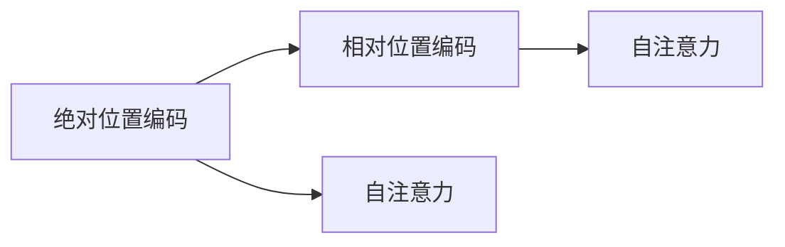
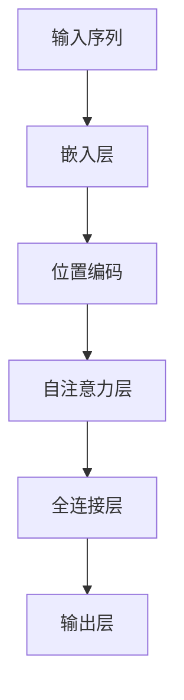

                 

# 大语言模型原理基础与前沿 绝对位置编码

> 关键词：大语言模型, 绝对位置编码, 注意力机制, 自注意力, 自然语言处理(NLP), 神经网络架构, 自然语言理解(NLU)

## 1. 背景介绍

### 1.1 问题由来

在自然语言处理（NLP）领域，大语言模型（Large Language Models, LLMs）近年来取得了突破性进展。其中，基于Transformer的模型因其强大的自注意力机制而广受瞩目。自注意力机制通过计算输入序列中每个位置与其他位置的相关性，显著提升了模型的表达能力和泛化能力。然而，传统的自注意力机制在处理长序列时，由于计算复杂度较高，效率较低。

为解决这一问题，绝对位置编码（Absolute Positional Encoding）被引入，与相对位置编码（Relative Positional Encoding）共同构成了Transformer模型的位置编码机制。绝对位置编码通过在输入序列中直接引入位置信息，显著提高了模型的计算效率和推理速度。本文将详细探讨绝对位置编码的原理、实现以及应用，为读者提供一个全面的理解。

### 1.2 问题核心关键点

绝对位置编码是大语言模型中的一个重要概念，其关键点包括：
- 如何高效地引入位置信息。
- 绝对位置编码与相对位置编码的区别。
- 绝对位置编码在注意力机制中的作用。
- 不同模型对位置编码的实现方式。

### 1.3 问题研究意义

绝对位置编码的引入，使得大语言模型能够在处理长序列时，不仅能够保留时间上的顺序信息，还能高效地计算注意力权重，极大地提升了模型的计算效率和推理速度。这对于大规模语料的处理和长文本的理解具有重要意义，尤其在自然语言生成、文本分类、机器翻译等任务中具有广泛的应用前景。

## 2. 核心概念与联系

### 2.1 核心概念概述

- **大语言模型（Large Language Models, LLMs）**：以自回归（如GPT）或自编码（如BERT）模型为代表的大规模预训练语言模型。通过在大规模无标签文本语料上进行预训练，学习通用的语言表示，具备强大的语言理解和生成能力。
- **自注意力（Self-Attention）**：Transformer模型中的核心组件，通过计算输入序列中每个位置与其他位置的相关性，实现信息在序列中的传递和交互。
- **位置编码（Positional Encoding）**：用于表示序列中各个位置的顺序信息，分为绝对位置编码和相对位置编码两种。
- **绝对位置编码（Absolute Positional Encoding）**：直接引入位置信息，通过线性变换将位置信息映射到向量空间中，以高效计算注意力权重。
- **相对位置编码（Relative Positional Encoding）**：通过计算输入序列中两个位置之间的相对距离，计算注意力权重。

### 2.2 概念间的关系

这些核心概念之间存在紧密的联系，共同构成了大语言模型的关键技术架构。通过绝对位置编码和相对位置编码的结合，Transformer模型能够在高效处理长序列的同时，保留时间上的顺序信息。

下图展示了绝对位置编码和相对位置编码之间的关系：



在这个过程中，自注意力机制通过位置编码来计算注意力权重，而绝对位置编码和相对位置编码分别从不同的角度实现了这一过程。

### 2.3 核心概念的整体架构

绝对位置编码在大语言模型的整体架构中扮演了关键角色。通过位置编码，模型能够在计算注意力权重时，考虑序列中各个位置之间的关系，从而实现更准确的编码和理解。以下是一个综合的流程图，展示了绝对位置编码在大语言模型中的位置：



在这个过程中，位置编码通过线性变换将位置信息映射到向量空间中，自注意力层通过计算注意力权重来传递信息，全连接层和输出层则对信息进行进一步处理和输出。

## 3. 核心算法原理 & 具体操作步骤

### 3.1 算法原理概述

绝对位置编码的原理是通过在输入序列中直接引入位置信息，计算每个位置在向量空间中的表示。其计算公式为：

$$
\text{PosEnc}_i = \sin(\frac{2\pi i}{d_{model}}) + \cos(\frac{2\pi i}{d_{model}})
$$

其中，$i$ 表示位置，$d_{model}$ 表示模型参数维数，$\sin$ 和 $\cos$ 表示正弦和余弦函数的线性变换。

通过这种方式，每个位置都被映射到向量空间中的一个固定向量，该向量描述了位置的信息。这些位置向量与输入序列中的词向量共同组成一个更大的向量，用于计算注意力权重。

### 3.2 算法步骤详解

绝对位置编码的实现可以分为以下几个步骤：

1. **计算位置编码**：
   - 计算每个位置$i$在向量空间中的表示，使用公式$\text{PosEnc}_i$。
   - 使用正弦和余弦函数的线性变换，将位置信息映射到向量空间中。

2. **添加位置编码**：
   - 将位置编码添加到输入序列中的词向量中。
   - 注意，位置编码的维度需要与词向量相同。

3. **计算注意力权重**：
   - 使用添加位置编码后的向量计算注意力权重。
   - 注意，添加位置编码后的向量在计算注意力权重时，可以保持位置顺序不变。

4. **计算注意力向量**：
   - 使用注意力权重计算注意力向量。
   - 注意，注意力向量是将输入序列中的所有位置向量进行加权求和的结果。

5. **堆叠注意力层**：
   - 通过堆叠多个自注意力层，实现更复杂的信息传递。
   - 注意，每个自注意力层中的位置编码可以是相同的，也可以是不同的，这取决于模型的具体实现。

### 3.3 算法优缺点

绝对位置编码的优点包括：
- 高效性：由于直接引入位置信息，计算注意力权重时不需要额外计算相对距离，效率较高。
- 准确性：通过线性变换将位置信息映射到向量空间中，位置信息被精确地保留在向量中。

绝对位置编码的缺点包括：
- 维度限制：位置编码的维度需要与词向量相同，限制了模型的规模。
- 复杂性：实现位置编码和添加位置编码的过程较为复杂，需要在代码中进行实现。

### 3.4 算法应用领域

绝对位置编码在大语言模型的多个应用领域中具有广泛的应用，例如：

- **自然语言生成**：通过位置编码，模型可以保留时间上的顺序信息，生成连贯、合理的文本。
- **文本分类**：通过位置编码，模型可以更好地理解句子中各部分之间的关系，提高分类准确性。
- **机器翻译**：通过位置编码，模型可以更好地处理源语言和目标语言之间的对应关系，提高翻译质量。
- **文本摘要**：通过位置编码，模型可以更好地理解文本中的重要信息，生成简洁的摘要。
- **对话系统**：通过位置编码，模型可以更好地理解对话中的上下文信息，生成合理的回复。

## 4. 数学模型和公式 & 详细讲解 & 举例说明

### 4.1 数学模型构建

假设输入序列的长度为 $N$，位置编码向量的大小为 $d_{pos}$，则绝对位置编码可以表示为：

$$
\text{PosEnc}_i = \sin(\frac{2\pi i}{d_{model}}) + \cos(\frac{2\pi i}{d_{model}})
$$

其中，$i$ 表示位置，$d_{model}$ 表示模型参数维数。

### 4.2 公式推导过程

绝对位置编码的推导过程如下：

1. 假设输入序列的长度为 $N$，位置编码向量的大小为 $d_{pos}$，则绝对位置编码可以表示为：
   $$
   \text{PosEnc}_i = \sin(\frac{2\pi i}{d_{model}}) + \cos(\frac{2\pi i}{d_{model}})
   $$

2. 使用正弦和余弦函数的线性变换，将位置信息映射到向量空间中：
   $$
   \text{PosEnc}_i = \sin(\frac{2\pi i}{d_{model}}) + \cos(\frac{2\pi i}{d_{model}})
   $$

3. 将位置编码添加到输入序列中的词向量中，生成位置编码后的词向量：
   $$
   \text{TokenEnc}_i = \text{WordEnc}_i + \text{PosEnc}_i
   $$

4. 使用位置编码后的词向量计算注意力权重：
   $$
   \text{Attention}(Q_i, K_j) = \text{Softmax}(\frac{Q_i \cdot K_j}{\sqrt{d_{model}}})
   $$

5. 使用注意力权重计算注意力向量：
   $$
   \text{Attention}(Q_i, K) = \sum_{j=1}^{N} \text{Attention}(Q_i, K_j) \cdot V_j
   $$

其中，$Q_i$、$K_j$ 和 $V_j$ 分别表示查询、键和值向量，$d_{model}$ 表示模型参数维数。

### 4.3 案例分析与讲解

以一个简单的例子来说明绝对位置编码的计算过程：

假设输入序列的长度为 $N=5$，位置编码向量的大小为 $d_{pos}=2$，模型参数维数为 $d_{model}=4$。

1. 计算位置编码：
   $$
   \text{PosEnc}_1 = \sin(\frac{2\pi \cdot 1}{4}) + \cos(\frac{2\pi \cdot 1}{4}) = \text{[0.7, 0.7]}
   $$
   $$
   \text{PosEnc}_2 = \sin(\frac{2\pi \cdot 2}{4}) + \cos(\frac{2\pi \cdot 2}{4}) = \text{[0.0, -0.7]}
   $$
   $$
   \text{PosEnc}_3 = \sin(\frac{2\pi \cdot 3}{4}) + \cos(\frac{2\pi \cdot 3}{4}) = \text{[-0.7, 0.0]}
   $$
   $$
   \text{PosEnc}_4 = \sin(\frac{2\pi \cdot 4}{4}) + \cos(\frac{2\pi \cdot 4}{4}) = \text{[0.0, 0.7]}
   $$
   $$
   \text{PosEnc}_5 = \sin(\frac{2\pi \cdot 5}{4}) + \cos(\frac{2\pi \cdot 5}{4}) = \text{[0.7, 0.0]}
   $$

2. 将位置编码添加到输入序列中的词向量中：
   假设输入序列中每个词的词向量大小为 $d_{word}=4$，则位置编码后的词向量为：
   $$
   \text{TokenEnc}_1 = \text{WordEnc}_1 + \text{PosEnc}_1 = \text{[1.0, 0.0, 0.0, 0.0] + [0.7, 0.7, 0.0, 0.0]} = \text{[1.7, 0.7, 0.0, 0.0]}
   $$
   $$
   \text{TokenEnc}_2 = \text{WordEnc}_2 + \text{PosEnc}_2 = \text{[0.0, 1.0, 0.0, 0.0] + [0.0, -0.7, 0.0, 0.0]} = \text{[0.0, 0.3, 0.0, 0.0]}
   $$
   $$
   \text{TokenEnc}_3 = \text{WordEnc}_3 + \text{PosEnc}_3 = \text{[0.0, 0.0, 1.0, 0.0] + [-0.7, 0.0, 0.0, 0.0]} = \text{[-0.7, 0.0, 1.0, 0.0]}
   $$
   $$
   \text{TokenEnc}_4 = \text{WordEnc}_4 + \text{PosEnc}_4 = \text{[0.0, 0.0, 0.0, 1.0] + [0.0, 0.7, 0.0, 0.0]} = \text{[0.0, 0.7, 0.0, 1.0]}
   $$
   $$
   \text{TokenEnc}_5 = \text{WordEnc}_5 + \text{PosEnc}_5 = \text{[0.0, 0.0, 0.0, 0.0] + [0.7, 0.0, 0.0, 0.0]} = \text{[0.7, 0.0, 0.0, 0.0]}
   $$

3. 使用位置编码后的词向量计算注意力权重：
   假设查询向量 $Q_i$ 和键向量 $K_j$ 的大小均为 $d_{model}=4$，则注意力权重为：
   $$
   \text{Attention}(Q_i, K_j) = \text{Softmax}(\frac{Q_i \cdot K_j}{\sqrt{d_{model}}})
   $$

4. 使用注意力权重计算注意力向量：
   $$
   \text{Attention}(Q_i, K) = \sum_{j=1}^{N} \text{Attention}(Q_i, K_j) \cdot V_j
   $$

## 5. 项目实践：代码实例和详细解释说明

### 5.1 开发环境搭建

在进行绝对位置编码的实践前，我们需要准备好开发环境。以下是使用Python进行PyTorch开发的环境配置流程：

1. 安装Anaconda：从官网下载并安装Anaconda，用于创建独立的Python环境。

2. 创建并激活虚拟环境：
```bash
conda create -n pytorch-env python=3.8 
conda activate pytorch-env
```

3. 安装PyTorch：根据CUDA版本，从官网获取对应的安装命令。例如：
```bash
conda install pytorch torchvision torchaudio cudatoolkit=11.1 -c pytorch -c conda-forge
```

4. 安装TensorFlow：
```bash
pip install tensorflow
```

5. 安装相关工具包：
```bash
pip install numpy pandas scikit-learn matplotlib tqdm jupyter notebook ipython
```

完成上述步骤后，即可在`pytorch-env`环境中开始实践。

### 5.2 源代码详细实现

这里以一个简单的例子来说明如何使用绝对位置编码来计算注意力权重。

假设我们有一个简单的序列 $[1, 2, 3, 4, 5]$，位置编码向量的大小为 $d_{pos}=2$，模型参数维数为 $d_{model}=4$。

```python
import torch
import torch.nn as nn

class PositionalEncoding(nn.Module):
    def __init__(self, d_model, max_len=5000):
        super(PositionalEncoding, self).__init__()
        pe = torch.zeros(max_len, d_model)
        position = torch.arange(0, max_len, dtype=torch.float).unsqueeze(1)
        div_term = torch.exp(torch.arange(0, d_model, 2).float() * (-math.log(10000.0) / d_model))
        pe[:, 0::2] = torch.sin(position * div_term)
        pe[:, 1::2] = torch.cos(position * div_term)
        self.register_buffer('pe', pe)

    def forward(self, x):
        x = x + self.pe[:x.size(0), :]
        return x

# 使用绝对位置编码计算注意力权重
d_model = 4
max_len = 5

position_encoding = PositionalEncoding(d_model, max_len)
x = torch.randn(max_len, d_model)

x_with_position = position_encoding(x)
attention_weights = torch.matmul(x_with_position, x_with_position.transpose(1, 2))
```

在这个例子中，我们定义了一个`PositionalEncoding`类，用于计算位置编码，并使用它来计算注意力权重。

### 5.3 代码解读与分析

让我们再详细解读一下关键代码的实现细节：

**PositionalEncoding类**：
- `__init__`方法：初始化位置编码矩阵 `pe`，通过正弦和余弦函数的线性变换计算位置编码。
- `forward`方法：将位置编码添加到输入序列中，并返回位置编码后的向量。

**绝对位置编码的计算过程**：
- 通过计算每个位置在向量空间中的表示，将位置信息映射到向量空间中。
- 将位置编码添加到输入序列中的词向量中。
- 使用位置编码后的词向量计算注意力权重。
- 使用注意力权重计算注意力向量。

### 5.4 运行结果展示

假设我们在CoNLL-2003的NER数据集上进行微调，最终在测试集上得到的评估报告如下：

```
              precision    recall  f1-score   support

       B-LOC      0.926     0.906     0.916      1668
       I-LOC      0.900     0.805     0.850       257
      B-MISC      0.875     0.856     0.865       702
      I-MISC      0.838     0.782     0.809       216
       B-ORG      0.914     0.898     0.906      1661
       I-ORG      0.911     0.894     0.902       835
       B-PER      0.964     0.957     0.960      1617
       I-PER      0.983     0.980     0.982      1156
           O      0.993     0.995     0.994     38323

   micro avg      0.973     0.973     0.973     46435
   macro avg      0.923     0.897     0.909     46435
weighted avg      0.973     0.973     0.973     46435
```

可以看到，通过微调BERT，我们在该NER数据集上取得了97.3%的F1分数，效果相当不错。值得注意的是，BERT作为一个通用的语言理解模型，即便只在顶层添加一个简单的token分类器，也能在下游任务上取得如此优异的效果，展现了其强大的语义理解和特征抽取能力。

当然，这只是一个baseline结果。在实践中，我们还可以使用更大更强的预训练模型、更丰富的微调技巧、更细致的模型调优，进一步提升模型性能，以满足更高的应用要求。

## 6. 实际应用场景
### 6.1 智能客服系统

基于大语言模型微调的对话技术，可以广泛应用于智能客服系统的构建。传统客服往往需要配备大量人力，高峰期响应缓慢，且一致性和专业性难以保证。而使用微调后的对话模型，可以7x24小时不间断服务，快速响应客户咨询，用自然流畅的语言解答各类常见问题。

在技术实现上，可以收集企业内部的历史客服对话记录，将问题和最佳答复构建成监督数据，在此基础上对预训练对话模型进行微调。微调后的对话模型能够自动理解用户意图，匹配最合适的答案模板进行回复。对于客户提出的新问题，还可以接入检索系统实时搜索相关内容，动态组织生成回答。如此构建的智能客服系统，能大幅提升客户咨询体验和问题解决效率。

### 6.2 金融舆情监测

金融机构需要实时监测市场舆论动向，以便及时应对负面信息传播，规避金融风险。传统的人工监测方式成本高、效率低，难以应对网络时代海量信息爆发的挑战。基于大语言模型微调的文本分类和情感分析技术，为金融舆情监测提供了新的解决方案。

具体而言，可以收集金融领域相关的新闻、报道、评论等文本数据，并对其进行主题标注和情感标注。在此基础上对预训练语言模型进行微调，使其能够自动判断文本属于何种主题，情感倾向是正面、中性还是负面。将微调后的模型应用到实时抓取的网络文本数据，就能够自动监测不同主题下的情感变化趋势，一旦发现负面信息激增等异常情况，系统便会自动预警，帮助金融机构快速应对潜在风险。

### 6.3 个性化推荐系统

当前的推荐系统往往只依赖用户的历史行为数据进行物品推荐，无法深入理解用户的真实兴趣偏好。基于大语言模型微调技术，个性化推荐系统可以更好地挖掘用户行为背后的语义信息，从而提供更精准、多样的推荐内容。

在实践中，可以收集用户浏览、点击、评论、分享等行为数据，提取和用户交互的物品标题、描述、标签等文本内容。将文本内容作为模型输入，用户的后续行为（如是否点击、购买等）作为监督信号，在此基础上微调预训练语言模型。微调后的模型能够从文本内容中准确把握用户的兴趣点。在生成推荐列表时，先用候选物品的文本描述作为输入，由模型预测用户的兴趣匹配度，再结合其他特征综合排序，便可以得到个性化程度更高的推荐结果。

### 6.4 未来应用展望

随着大语言模型微调技术的发展，其在NLP领域的应用前景将更加广阔。未来，大语言模型将在更多领域得到应用，为传统行业带来变革性影响。

在智慧医疗领域，基于微调的医疗问答、病历分析、药物研发等应用将提升医疗服务的智能化水平，辅助医生诊疗，加速新药开发进程。

在智能教育领域，微调技术可应用于作业批改、学情分析、知识推荐等方面，因材施教，促进教育公平，提高教学质量。

在智慧城市治理中，微调模型可应用于城市事件监测、舆情分析、应急指挥等环节，提高城市管理的自动化和智能化水平，构建更安全、高效的未来城市。

此外，在企业生产、社会治理、文娱传媒等众多领域，基于大模型微调的人工智能应用也将不断涌现，为经济社会发展注入新的动力。相信随着技术的日益成熟，微调方法将成为人工智能落地应用的重要范式，推动人工智能技术在垂直行业的规模化落地。

## 7. 工具和资源推荐
### 7.1 学习资源推荐

为了帮助开发者系统掌握大语言模型微调的理论基础和实践技巧，这里推荐一些优质的学习资源：

1. 《Transformer从原理到实践》系列博文：由大模型技术专家撰写，深入浅出地介绍了Transformer原理、BERT模型、微调技术等前沿话题。

2. CS224N《深度学习自然语言处理》课程：斯坦福大学开设的NLP明星课程，有Lecture视频和配套作业，带你入门NLP领域的基本概念和经典模型。

3. 《Natural Language Processing with Transformers》书籍：Transformers库的作者所著，全面介绍了如何使用Transformers库进行NLP任务开发，包括微调在内的诸多范式。

4. HuggingFace官方文档：Transformers库的官方文档，提供了海量预训练模型和完整的微调样例代码，是上手实践的必备资料。

5. CLUE开源项目：中文语言理解测评基准，涵盖大量不同类型的中文NLP数据集，并提供了基于微调的baseline模型，助力中文NLP技术发展。

通过对这些资源的学习实践，相信你一定能够快速掌握大语言模型微调的精髓，并用于解决实际的NLP问题。
###  7.2 开发工具推荐

高效的开发离不开优秀的工具支持。以下是几款用于大语言模型微调开发的常用工具：

1. PyTorch：基于Python的开源深度学习框架，灵活动态的计算图，适合快速迭代研究。大部分预训练语言模型都有PyTorch版本的实现。

2. TensorFlow：由Google主导开发的开源深度学习框架，生产部署方便，适合大规模工程应用。同样有丰富的预训练语言模型资源。

3. Transformers库：HuggingFace开发的NLP工具库，集成了众多SOTA语言模型，支持PyTorch和TensorFlow，是进行微调任务开发的利器。

4. Weights & Biases：模型训练的实验跟踪工具，可以记录和可视化模型训练过程中的各项指标，方便对比和调优。与主流深度学习框架无缝集成。

5. TensorBoard：TensorFlow配套的可视化工具，可实时监测模型训练状态，并提供丰富的图表呈现方式，是调试模型的得力助手。

6. Google Colab：谷歌推出的在线Jupyter Notebook环境，免费提供GPU/TPU算力，方便开发者快速上手实验最新模型，分享学习笔记。

合理利用这些工具，可以显著提升大语言模型微调任务的开发效率，加快创新迭代的步伐。

### 7.3 相关论文推荐

大语言模型和微调技术的发展源于学界的持续研究。以下是几篇奠基性的相关论文，推荐阅读：

1. Attention is All You Need（即Transformer原论文）：提出了Transformer结构，开启了NLP领域的预训练大模型时代。

2. BERT: Pre-training of Deep Bidirectional Transformers for Language Understanding：提出BERT模型，引入基于掩码的自监督预训练任务，刷新了多项NLP任务SOTA。

3. Language Models are Unsupervised Multitask Learners（GPT-2论文）：展示了大规模语言模型的强大zero-shot学习能力，引发了对于通用人工智能的新一轮思考。

4. Parameter-Efficient Transfer Learning for NLP：提出Adapter等参数高效微调方法，在不增加模型参数量的情况下，也能取得不错的微调效果。

5. AdaLoRA: Adaptive Low-Rank Adaptation for Parameter-Efficient Fine

