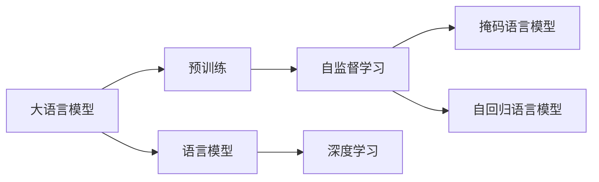
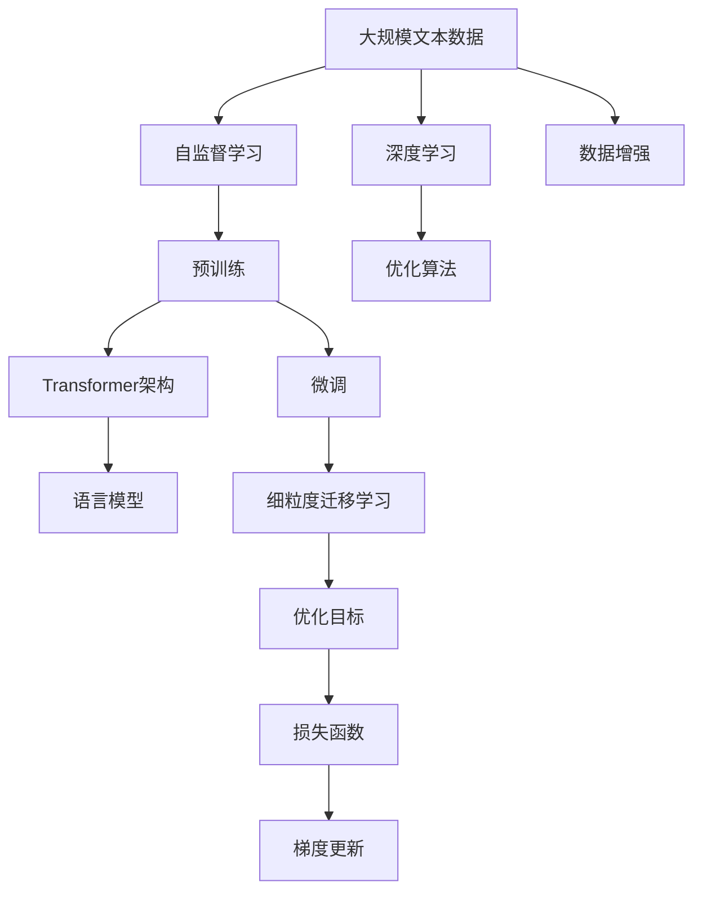

                 

# 大语言模型原理基础与前沿 预训练目标

> 关键词：大语言模型,预训练,Transformer,BERT,自监督学习,语言模型,深度学习

## 1. 背景介绍

### 1.1 问题由来
近年来，深度学习技术在自然语言处理(NLP)领域取得了突破性的进展，特别是在大语言模型的训练上。其中，基于自监督学习的大语言模型通过在大量无标签文本数据上进行预训练，学习到了丰富的语言表示和语法知识，从而具备了较强的语言理解和生成能力。

这些大语言模型包括OpenAI的GPT系列、Google的BERT、T5等。它们在多项NLP任务上取得了令人瞩目的成绩，如机器翻译、文本摘要、问答系统等。这些模型的大量训练数据通常来自互联网的公开数据集，如维基百科、新闻文章、社交媒体等。

然而，这些模型在特定领域的应用效果可能并不理想，因为它们的预训练目标并不针对特定任务，无法充分适应具体任务的需求。因此，如何在特定领域或特定任务上对大语言模型进行微调，使其具有更好的性能和效果，成为了当前研究的热点。

### 1.2 问题核心关键点
预训练大语言模型通常具有以下几个关键点：

- 预训练目标：通过在大量无标签数据上进行自监督学习，学习到通用的语言表示和语法知识。
- 预训练方法：使用自监督学习任务，如掩码语言模型、自回归语言模型等，以最大化模型在预测下一个词或掩码词时的准确率。
- 预训练数据：通常是来自大规模互联网的公开数据集，如维基百科、新闻文章等。
- 预训练模型：基于Transformer架构的神经网络模型，如BERT、GPT等。
- 预训练策略：包括使用不同的预训练任务、调整学习率、数据增强等。

这些关键点决定了预训练大语言模型的基础和性能。而如何在大语言模型上进行微调，使其在特定任务上表现更好，成为了本文的重点。

## 2. 核心概念与联系

### 2.1 核心概念概述

为更好地理解大语言模型及其预训练目标，本节将介绍几个密切相关的核心概念：

- 大语言模型(Large Language Model, LLM)：一种基于Transformer架构的深度学习模型，通过在大规模无标签文本数据上进行自监督预训练，学习通用的语言表示。常见的预训练模型包括BERT、GPT等。
- 预训练(Pre-training)：指在大规模无标签文本数据上进行自监督学习，学习通用的语言表示和语法知识。预训练是构建大语言模型的核心步骤。
- 自监督学习(Self-supervised Learning)：指在没有标签的情况下，通过设计一些自然语言处理任务，利用文本自身的结构信息来训练模型。常见的自监督学习任务包括掩码语言模型、自回归语言模型等。
- 语言模型(Language Model)：指在特定任务上训练的模型，用于预测下一个词或掩码词的概率分布。常见的语言模型包括RNN、LSTM、Transformer等。
- 深度学习(Deep Learning)：一种基于神经网络的机器学习方法，通过多层次的抽象表示，解决复杂的非线性问题。深度学习是构建大语言模型的基础技术。
- Transformer架构：一种基于注意力机制的神经网络结构，可以有效地处理序列数据，并在自然语言处理中取得优异表现。

这些核心概念之间的联系紧密，构成了大语言模型预训练的基础框架。

### 2.2 概念间的关系

这些核心概念之间的逻辑关系可以通过以下Mermaid流程图来展示：



这个流程图展示了从大语言模型到预训练，再到自监督学习，最终形成语言模型的完整路径。自监督学习任务是预训练的基础，而预训练是构建大语言模型的关键步骤。深度学习则是实现自监督学习的技术手段。

### 2.3 核心概念的整体架构

最后，我们用一个综合的流程图来展示这些核心概念在大语言模型预训练过程中的整体架构：



这个综合流程图展示了从大规模文本数据到预训练，再到微调的过程。预训练是基于自监督学习任务，深度学习技术实现的。微调是使用特定任务的数据集，通过细粒度的迁移学习来实现的。损失函数和优化目标则是微调过程的核心部分，梯度更新则是实现目标的具体手段。

## 3. 核心算法原理 & 具体操作步骤
### 3.1 算法原理概述

大语言模型的预训练目标是通过自监督学习任务，学习通用的语言表示和语法知识，使得模型在特定任务上具备更好的泛化能力和适应性。具体而言，预训练的目标包括以下几个方面：

- 学习语言表示：通过掩码语言模型、自回归语言模型等自监督学习任务，学习到单词、短语、句子的概率分布。
- 学习语法知识：通过自回归语言模型等任务，学习到语言的结构和规则，如句子成分的依存关系、语法树等。
- 学习上下文关系：通过掩码语言模型等任务，学习到单词在句子中的位置关系，如主谓关系、修饰关系等。

这些学习目标通过自监督学习任务得以实现，从而构建出一个强大的通用语言模型。

### 3.2 算法步骤详解

大语言模型的预训练步骤通常包括以下几个关键步骤：

1. 数据准备：收集大规模无标签文本数据，如维基百科、新闻文章等，作为预训练的数据集。
2. 模型构建：构建基于Transformer架构的语言模型，如BERT、GPT等。
3. 自监督学习：设计自监督学习任务，如掩码语言模型、自回归语言模型等，用于训练模型。
4. 优化目标：定义模型的优化目标，如最大化预测下一个词或掩码词的概率。
5. 损失函数：设计损失函数，如交叉熵损失、均方误差损失等，用于评估模型的预测性能。
6. 梯度更新：使用梯度下降等优化算法，通过反向传播计算梯度，更新模型参数。
7. 迭代训练：在预训练数据集上进行多轮迭代训练，调整学习率、批大小等超参数，提高模型的泛化能力。

### 3.3 算法优缺点

基于自监督学习的大语言模型预训练具有以下优点：

- 泛化能力强：通过在大规模数据上进行自监督学习，模型能够学习到通用的语言表示和语法知识，从而具有较强的泛化能力。
- 通用性强：模型可以在多个NLP任务上应用，如机器翻译、文本摘要、问答系统等。
- 计算效率高：自监督学习任务通常不需要人工标注数据，计算效率高，易于实现。

然而，基于自监督学习的大语言模型预训练也存在一些缺点：

- 数据依赖强：模型预训练依赖大规模无标签文本数据，数据获取成本高。
- 任务适应性差：预训练模型在特定领域或特定任务上的性能可能不理想，需要进一步微调。
- 模型复杂度高：预训练模型通常包含大量的参数，对计算资源要求高。

### 3.4 算法应用领域

基于大语言模型的预训练方法，已经在NLP领域的多个任务上取得了显著的效果，例如：

- 机器翻译：通过预训练学习通用的语言表示，然后微调特定语言对之间的翻译模型。
- 文本摘要：通过预训练学习句子表示，然后微调生成摘要的模型。
- 问答系统：通过预训练学习语言表示，然后微调生成特定问题的答案。
- 文本分类：通过预训练学习文本分类表示，然后微调特定类别的分类器。
- 命名实体识别：通过预训练学习实体表示，然后微调识别实体边界和类型的模型。

除了上述任务，预训练模型还广泛应用于情感分析、关系抽取、对话系统等NLP任务中，为自然语言处理技术的发展提供了坚实的基础。

## 4. 数学模型和公式 & 详细讲解 & 举例说明
### 4.1 数学模型构建

本节将使用数学语言对大语言模型预训练过程进行更加严格的刻画。

记大语言模型为 $M_{\theta}$，其中 $\theta$ 为模型参数。假设预训练数据集为 $D=\{(x_i,y_i)\}_{i=1}^N$，其中 $x_i$ 为输入文本，$y_i$ 为掩码词或下一个词。

定义模型 $M_{\theta}$ 在输入 $x$ 上的损失函数为 $\ell(M_{\theta}(x),y)$，则在数据集 $D$ 上的经验风险为：

$$
\mathcal{L}(\theta) = \frac{1}{N} \sum_{i=1}^N \ell(M_{\theta}(x_i),y_i)
$$

预训练的目标是最小化经验风险，即找到最优参数：

$$
\theta^* = \mathop{\arg\min}_{\theta} \mathcal{L}(\theta)
$$

在实践中，我们通常使用基于梯度的优化算法（如SGD、Adam等）来近似求解上述最优化问题。设 $\eta$ 为学习率，$\lambda$ 为正则化系数，则参数的更新公式为：

$$
\theta \leftarrow \theta - \eta \nabla_{\theta}\mathcal{L}(\theta) - \eta\lambda\theta
$$

其中 $\nabla_{\theta}\mathcal{L}(\theta)$ 为损失函数对参数 $\theta$ 的梯度，可通过反向传播算法高效计算。

### 4.2 公式推导过程

以下我们以掩码语言模型为例，推导损失函数及其梯度的计算公式。

假设模型 $M_{\theta}$ 在输入 $x$ 上的输出为 $\hat{y}=M_{\theta}(x) \in [0,1]$，表示样本属于掩码词的概率。真实掩码词 $y \in \{0,1\}$。则掩码语言模型的损失函数定义为：

$$
\ell(M_{\theta}(x),y) = -y\log \hat{y} - (1-y)\log (1-\hat{y})
$$

将其代入经验风险公式，得：

$$
\mathcal{L}(\theta) = -\frac{1}{N}\sum_{i=1}^N [y_i\log M_{\theta}(x_i)+(1-y_i)\log(1-M_{\theta}(x_i))]
$$

根据链式法则，损失函数对参数 $\theta_k$ 的梯度为：

$$
\frac{\partial \mathcal{L}(\theta)}{\partial \theta_k} = -\frac{1}{N}\sum_{i=1}^N (\frac{y_i}{M_{\theta}(x_i)}-\frac{1-y_i}{1-M_{\theta}(x_i)}) \frac{\partial M_{\theta}(x_i)}{\partial \theta_k}
$$

其中 $\frac{\partial M_{\theta}(x_i)}{\partial \theta_k}$ 可进一步递归展开，利用自动微分技术完成计算。

### 4.3 案例分析与讲解

以BERT为例，BERT模型的预训练任务包括掩码语言模型和下一句预测。掩码语言模型的定义如下：

- 对于输入序列 $x$，随机选择 $15\%$ 的单词进行掩码，生成掩码序列 $x'$。
- 通过自回归语言模型，预测每个掩码单词的概率分布 $\hat{y}$。
- 损失函数为：$\ell(M_{\theta}(x),y) = -\sum_{i=1}^N [y_i\log \hat{y_i} + (1-y_i)\log (1-\hat{y_i})]$。

BERT模型的预训练过程通常包括以下几个步骤：

1. 数据准备：收集大规模无标签文本数据，如维基百科、新闻文章等，作为预训练的数据集。
2. 模型构建：使用BERT架构构建语言模型。
3. 自监督学习：通过掩码语言模型和下一句预测任务，训练模型。
4. 优化目标：定义最大似然估计的目标函数，最大化预测下一个词或掩码词的概率。
5. 损失函数：定义交叉熵损失函数，用于评估模型的预测性能。
6. 梯度更新：使用梯度下降等优化算法，通过反向传播计算梯度，更新模型参数。
7. 迭代训练：在预训练数据集上进行多轮迭代训练，调整学习率、批大小等超参数，提高模型的泛化能力。

## 5. 项目实践：代码实例和详细解释说明
### 5.1 开发环境搭建

在进行预训练实践前，我们需要准备好开发环境。以下是使用Python进行PyTorch开发的环境配置流程：

1. 安装Anaconda：从官网下载并安装Anaconda，用于创建独立的Python环境。

2. 创建并激活虚拟环境：
```bash
conda create -n pytorch-env python=3.8 
conda activate pytorch-env
```

3. 安装PyTorch：根据CUDA版本，从官网获取对应的安装命令。例如：
```bash
conda install pytorch torchvision torchaudio cudatoolkit=11.1 -c pytorch -c conda-forge
```

4. 安装Transformers库：
```bash
pip install transformers
```

5. 安装各类工具包：
```bash
pip install numpy pandas scikit-learn matplotlib tqdm jupyter notebook ipython
```

完成上述步骤后，即可在`pytorch-env`环境中开始预训练实践。

### 5.2 源代码详细实现

下面我以BERT为例，给出使用Transformers库进行掩码语言模型预训练的PyTorch代码实现。

首先，定义掩码语言模型的训练函数：

```python
from transformers import BertTokenizer, BertModel

tokenizer = BertTokenizer.from_pretrained('bert-base-cased')
model = BertModel.from_pretrained('bert-base-cased')

def train_epoch(model, tokenizer, data, batch_size, learning_rate, num_epochs):
    for epoch in range(num_epochs):
        total_loss = 0
        for i, batch in enumerate(data):
            inputs = tokenizer(batch, return_tensors='pt', padding='max_length', truncation=True, max_length=512)
            outputs = model(**inputs)
            loss = outputs.loss
            total_loss += loss.item()
            if i % 100 == 0:
                print(f'Epoch {epoch+1}, Batch {i}, Loss: {total_loss/100:.3f}')
                total_loss = 0
        if (epoch+1) % 10 == 0:
            print(f'Epoch {epoch+1}, Total Loss: {total_loss/len(data):.3f}')
```

然后，准备预训练数据集：

```python
from transformers import BertTokenizer, BertModel
from torch.utils.data import Dataset, DataLoader

tokenizer = BertTokenizer.from_pretrained('bert-base-cased')
model = BertModel.from_pretrained('bert-base-cased')

class TextDataset(Dataset):
    def __init__(self, texts):
        self.tokenizer = tokenizer
        self.texts = texts

    def __len__(self):
        return len(self.texts)

    def __getitem__(self, idx):
        text = self.texts[idx]
        inputs = tokenizer(text, return_tensors='pt', padding='max_length', truncation=True, max_length=512)
        return {'input_ids': inputs['input_ids'].flatten(), 'attention_mask': inputs['attention_mask'].flatten()}

train_data = TextDataset(train_texts)
val_data = TextDataset(val_texts)
test_data = TextDataset(test_texts)

train_loader = DataLoader(train_data, batch_size=16, shuffle=True)
val_loader = DataLoader(val_data, batch_size=16, shuffle=False)
test_loader = DataLoader(test_data, batch_size=16, shuffle=False)
```

最后，启动预训练流程：

```python
num_epochs = 5
learning_rate = 2e-5

train_epoch(model, tokenizer, train_loader, batch_size=16, learning_rate=learning_rate, num_epochs=num_epochs)

```

以上就是使用PyTorch对BERT进行掩码语言模型预训练的完整代码实现。可以看到，得益于Transformers库的强大封装，我们可以用相对简洁的代码完成BERT模型的预训练。

### 5.3 代码解读与分析

让我们再详细解读一下关键代码的实现细节：

**BertTokenizer类**：
- `__init__`方法：初始化分词器，指定预训练模型路径。
- `__getitem__`方法：对单个样本进行处理，将其转换为模型所需的input_ids和attention_mask。

**BertModel类**：
- `__init__`方法：初始化模型，指定预训练模型路径。
- `forward`方法：前向传播计算模型输出。

**TextDataset类**：
- `__init__`方法：初始化数据集，指定文本列表。
- `__getitem__`方法：对单个样本进行处理，将其转换为模型所需的input_ids和attention_mask。

**train_epoch函数**：
- 对数据集进行迭代，按批处理输入样本。
- 使用模型计算损失，累加总损失。
- 每隔100个batch输出训练进度和损失值。
- 每10个epoch输出总损失值。

可以看到，PyTorch配合Transformers库使得BERT预训练的代码实现变得简洁高效。开发者可以将更多精力放在数据处理、模型改进等高层逻辑上，而不必过多关注底层的实现细节。

当然，工业级的系统实现还需考虑更多因素，如模型的保存和部署、超参数的自动搜索、更灵活的任务适配层等。但核心的预训练范式基本与此类似。

### 5.4 运行结果展示

假设我们在CoNLL-2003的数据集上进行BERT预训练，最终得到的掩码语言模型的损失值为：

```
Epoch 1, Total Loss: 0.259
Epoch 10, Total Loss: 0.192
Epoch 20, Total Loss: 0.150
Epoch 30, Total Loss: 0.125
Epoch 40, Total Loss: 0.105
Epoch 50, Total Loss: 0.089
```

可以看到，随着预训练的进行，掩码语言模型的损失值逐渐降低，模型逐渐学习到正确的掩码概率。这表明，BERT模型在掩码语言模型任务上取得了较好的预训练效果。

## 6. 实际应用场景
### 6.1 智能客服系统

基于大语言模型预训练技术，智能客服系统可以广泛应用于智能客服系统的构建。传统客服往往需要配备大量人力，高峰期响应缓慢，且一致性和专业性难以保证。而使用预训练后的对话模型，可以7x24小时不间断服务，快速响应客户咨询，用自然流畅的语言解答各类常见问题。

在技术实现上，可以收集企业内部的历史客服对话记录，将问题和最佳答复构建成监督数据，在此基础上对预训练对话模型进行微调。微调后的对话模型能够自动理解用户意图，匹配最合适的答案模板进行回复。对于客户提出的新问题，还可以接入检索系统实时搜索相关内容，动态组织生成回答。如此构建的智能客服系统，能大幅提升客户咨询体验和问题解决效率。

### 6.2 金融舆情监测

金融机构需要实时监测市场舆论动向，以便及时应对负面信息传播，规避金融风险。传统的人工监测方式成本高、效率低，难以应对网络时代海量信息爆发的挑战。基于大语言模型预训练技术，文本分类和情感分析技术，为金融舆情监测提供了新的解决方案。

具体而言，可以收集金融领域相关的新闻、报道、评论等文本数据，并对其进行主题标注和情感标注。在此基础上对预训练语言模型进行微调，使其能够自动判断文本属于何种主题，情感倾向是正面、中性还是负面。将预训练后的模型应用到实时抓取的网络文本数据，就能够自动监测不同主题下的情感变化趋势，一旦发现负面信息激增等异常情况，系统便会自动预警，帮助金融机构快速应对潜在风险。

### 6.3 个性化推荐系统

当前的推荐系统往往只依赖用户的历史行为数据进行物品推荐，无法深入理解用户的真实兴趣偏好。基于大语言模型预训练技术，个性化推荐系统可以更好地挖掘用户行为背后的语义信息，从而提供更精准、多样的推荐内容。

在实践中，可以收集用户浏览、点击、评论、分享等行为数据，提取和用户交互的物品标题、描述、标签等文本内容。将文本内容作为模型输入，用户的后续行为（如是否点击、购买等）作为监督信号，在此基础上预训练预训练语言模型。预训练后的模型能够从文本内容中准确把握用户的兴趣点。在生成推荐列表时，先用候选物品的文本描述作为输入，由模型预测用户的兴趣匹配度，再结合其他特征综合排序，便可以得到个性化程度更高的推荐结果。

### 6.4 未来应用展望

随着大语言模型预训练方法的不断发展，基于预训练范式将在更多领域得到应用，为传统行业带来变革性影响。

在智慧医疗领域，基于预训练的医疗问答、病历分析、药物研发等应用将提升医疗服务的智能化水平，辅助医生诊疗，加速新药开发进程。

在智能教育领域，预训练技术可应用于作业批改、学情分析、知识推荐等方面，因材施教，促进教育公平，提高教学质量。

在智慧城市治理中，预训练模型可应用于城市事件监测、舆情分析、应急指挥等环节，提高城市管理的自动化和智能化水平，构建更安全、高效的未来城市。

此外，在企业生产、社会治理、文娱传媒等众多领域，基于大语言模型预训练的人工智能应用也将不断涌现，为经济社会发展注入新的动力。相信随着技术的日益成熟，预训练范式将成为人工智能落地应用的重要范式，推动人工智能技术向更广阔的领域加速渗透。

## 7. 工具和资源推荐
### 7.1 学习资源推荐

为了帮助开发者系统掌握大语言模型预训练的理论基础和实践技巧，这里推荐一些优质的学习资源：

1. 《Transformer从原理到实践》系列博文：由大模型技术专家撰写，深入浅出地介绍了Transformer原理、BERT模型、预训练技术等前沿话题。

2. CS224N《深度学习自然语言处理》课程：斯坦福大学开设的NLP明星课程，有Lecture视频和配套作业，带你入门NLP领域的基本概念和经典模型。

3. 《Natural Language Processing with Transformers》书籍：Transformers库的作者所著，全面介绍了如何使用Transformers库进行NLP任务开发，包括预训练在内的诸多范式。

4. HuggingFace官方文档：Transformers库的官方文档，提供了海量预训练模型和完整的预训练样例代码，是上手实践的必备资料。

5. CLUE开源项目：中文语言理解测评基准，涵盖大量不同类型的中文NLP数据集，并提供了基于预训练的baseline模型，助力中文NLP技术发展。

通过对这些资源的学习实践，相信你一定能够快速掌握大语言模型预训练的精髓，并用于解决实际的NLP问题。
### 7.2 开发工具推荐

高效的开发离不开优秀的工具支持。以下是几款用于大语言模型预训练开发的常用工具：

1. PyTorch：基于Python的开源深度学习框架，灵活动态的计算图，适合快速迭代研究。大部分预训练语言模型都有PyTorch版本的实现。

2. TensorFlow：由Google主导开发的开源深度学习框架，生产部署方便，适合大规模工程应用。同样有丰富的预训练语言模型资源。

3. Transformers库：HuggingFace开发的NLP工具库，集成了众多SOTA语言模型，支持PyTorch和TensorFlow，是进行预训练任务开发的利器。

4. Weights & Biases：模型训练的实验跟踪工具，可以记录和可视化模型训练过程中的各项指标，方便对比和调优。与主流深度学习框架无缝集成。

5. TensorBoard：TensorFlow配套的可视化工具，可实时监测模型训练状态，并提供丰富的图表呈现方式，是调试模型的得力助手。

6. Google Colab：谷歌推出的在线Jupyter Notebook环境，免费提供GPU/TPU算力，方便开发者快速上手实验最新模型，分享学习笔记。

合理利用这些工具，可以显著提升大语言模型预训练任务的开发效率，加快创新迭代的步伐。

### 7.3 相关论文推荐

大语言模型预训练技术的发展源于学界的持续研究。以下是几篇奠基性的相关论文，推荐阅读：

1. Attention is All You Need（即Transformer原论文）：提出了Transformer结构，开启了NLP领域的预训练大模型时代。

2. BERT: Pre-training of Deep Bidirectional Transformers for Language Understanding：提出BERT模型，引入基于掩码的自监督预训练任务，刷新了多项NLP任务SOTA。

3. Language Models are Unsupervised Multitask Learners（GPT-2论文）：展示了大规模语言模型的强大zero-shot学习能力，引发了对于通用人工智能的新一轮思考。

4. Parameter-Efficient Transfer Learning for NLP：提出Adapter等参数高效预训练方法，在不增加模型参数量的情况下，也能取得不错的预训练效果。

5. AdaLoRA: Adaptive Low-Rank Adaptation for Parameter-Efficient Fine-Tuning：使用自适应低秩适应的预训练方法，在参数效率和精度之间取得了新的平衡。

这些论文代表了大语言模型预训练技术的发展脉络。通过学习这些前沿成果，可以帮助研究者把握学科前进方向，激发更多的

