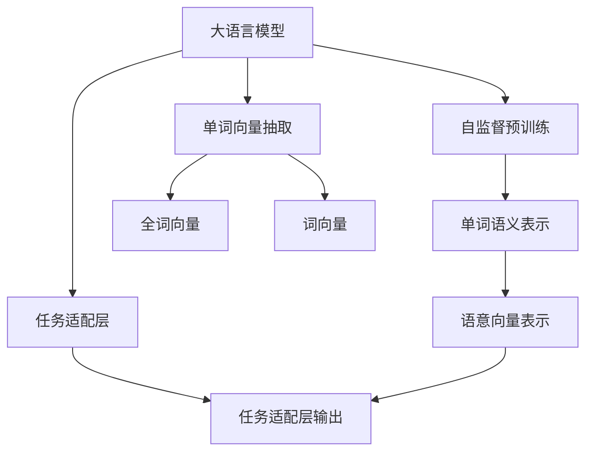

                 

# 大语言模型的语意向量表示

## 1. 背景介绍

### 1.1 问题由来

在深度学习大模型研究中，语意向量表示(Word Embedding)是核心技术之一。语意向量通过将单词映射到高维空间中的向量，反映了单词之间的语义关系和句法结构，为语言模型的理解与生成提供了强大的基础。传统的语意向量表示方法主要基于局部信息，即单词的上下文环境，如Word2Vec、GloVe等。然而，这些方法往往忽略了单词之间的全局关联，导致语义表示的粒度较细，不能很好地捕捉单词在句子级别的语义信息。

近年来，基于Transformer的大语言模型如BERT、GPT等，通过自监督预训练学习到了更为丰富和全局性的语义知识，为语意向量表示提供了新的范式。通过将大语言模型与语意向量表示结合，可以提升单词的语义表示能力，促进语言理解与生成任务的性能。因此，研究如何从大语言模型中抽取语意向量表示，具有重要的理论和应用价值。

### 1.2 问题核心关键点

语意向量表示的核心问题是如何从大语言模型中有效地抽取单词的语义表示，并在应用中加以利用。主要涉及以下几个关键点：

- 预训练模型选择：选择合适的大语言模型作为语意向量表示的来源。
- 单词向量抽取：从预训练模型中抽取单词的语义表示。
- 向量转换与融合：将抽取出的单词向量转换为合适的语意向量表示，并与全词向量、词向量等融合，用于下游任务。
- 模型优化：通过微调等手段优化语意向量表示的质量。

### 1.3 问题研究意义

语意向量表示在大语言模型的应用中，可以提升模型的语义理解能力和生成效果，尤其在自然语言处理(NLP)任务中，如文本分类、情感分析、机器翻译等，具有重要的应用前景。因此，研究语意向量表示对于提升大语言模型在各类NLP任务上的性能，推动AI技术的实际应用具有重要的现实意义。

## 2. 核心概念与联系

### 2.1 核心概念概述

在大语言模型的语意向量表示研究中，以下几个核心概念尤为重要：

- 大语言模型：以Transformer架构为代表的深度学习模型，通过大规模无标签数据的自监督预训练，学习到了丰富的语言知识。如BERT、GPT等。
- 语意向量表示：将单词映射到高维空间中的向量，反映了单词之间的语义关系和句法结构。如Word2Vec、GloVe等。
- 自监督预训练：通过无标签数据训练大语言模型，使其学习到丰富的语言知识，并能够进行任务适配。如BERT的自掩码语言模型预训练。
- 任务适配层：在大语言模型顶层设计合适的输出层和损失函数，用于适应特定任务的语意向量表示需求。
- 向量转换与融合：将单词的语义表示转换为全词向量、词向量等形式，并与其他向量融合，用于下游任务。

### 2.2 概念间的关系

这些核心概念之间存在着紧密的联系，形成了语意向量表示在大语言模型中的完整生态系统。下面通过一个Mermaid流程图展示它们之间的关系：



这个流程图展示了语意向量表示在大语言模型中的应用流程：

1. 大语言模型通过自监督预训练学习到单词的语义表示。
2. 在任务适配层中，根据下游任务的特定需求，设计合适的输出层和损失函数。
3. 单词向量抽取，从预训练模型中获取单词的语义表示。
4. 向量转换与融合，将单词向量转换为全词向量或词向量，并与其他向量融合，用于下游任务。

## 3. 核心算法原理 & 具体操作步骤

### 3.1 算法原理概述

大语言模型的语意向量表示主要基于自监督预训练和任务适配层的输出。其核心算法步骤如下：

1. 选择合适的预训练模型，进行自监督预训练，学习单词的语义表示。
2. 设计任务适配层，根据下游任务的特定需求，设计合适的输出层和损失函数。
3. 从预训练模型中抽取单词的语义表示。
4. 将单词向量转换为全词向量或词向量，并与其他向量融合，用于下游任务。
5. 通过微调等手段优化语意向量表示的质量。

### 3.2 算法步骤详解

#### 3.2.1 自监督预训练

自监督预训练是学习语意向量表示的核心步骤，主要通过无标签数据训练大语言模型。以BERT为例，其自掩码语言模型预训练过程如下：

1. 将输入文本随机掩码一部分单词。
2. 使用BERT模型预测被掩码单词的语义向量。
3. 通过损失函数（如MLM）优化模型参数，使预测向量与真实向量尽可能接近。

#### 3.2.2 任务适配层设计

任务适配层根据下游任务的特定需求，设计合适的输出层和损失函数。以文本分类为例，其任务适配层设计如下：

1. 在BERT模型顶层添加线性分类器。
2. 输出层使用softmax函数计算单词向量的分类概率。
3. 损失函数使用交叉熵函数，计算预测概率与真实标签的差异。

#### 3.2.3 单词向量抽取

单词向量抽取是将单词的语义表示从预训练模型中提取出来的过程。以BERT为例，其单词向量抽取过程如下：

1. 将输入文本分词，并输入BERT模型。
2. 通过softmax函数计算每个单词的语义向量。
3. 将单词向量转换为全词向量或词向量，用于下游任务。

#### 3.2.4 向量转换与融合

向量转换与融合是将单词向量转换为全词向量或词向量，并与其他向量融合的过程。以全词向量为例，其向量转换与融合过程如下：

1. 将单词向量加权平均，得到全词向量。
2. 根据下游任务的特定需求，将全词向量与其他向量（如位置向量、语义向量）融合，得到融合向量。
3. 融合向量用于下游任务。

#### 3.2.5 模型优化

模型优化是通过微调等手段优化语意向量表示的质量的过程。以BERT为例，其微调过程如下：

1. 选择合适的预训练模型，进行自监督预训练，学习单词的语义表示。
2. 设计任务适配层，根据下游任务的特定需求，设计合适的输出层和损失函数。
3. 从预训练模型中抽取单词的语义表示。
4. 将单词向量转换为全词向量或词向量，并与其他向量融合，用于下游任务。
5. 通过微调等手段优化语意向量表示的质量。

### 3.3 算法优缺点

基于大语言模型的语意向量表示方法具有以下优点：

1. 语义表示丰富：大语言模型通过自监督预训练学习到了更为丰富和全局性的语义知识，使得单词的语义表示更为准确。
2. 适用范围广：适用于各种NLP任务，如文本分类、情感分析、机器翻译等，具有较强的泛化能力。
3. 应用效果好：在应用中，语意向量表示能够提升模型的语义理解能力和生成效果，提高任务性能。

同时，这些方法也存在一些缺点：

1. 计算资源需求高：大语言模型的预训练和微调需要大量的计算资源，对于小型项目可能不太适用。
2. 数据需求高：需要大量的无标签数据进行预训练，对于数据稀缺的场景可能不太适用。
3. 模型复杂度高：大语言模型具有较高的模型复杂度，对于小型模型可能不太适用。

### 3.4 算法应用领域

基于大语言模型的语意向量表示方法在NLP领域得到了广泛的应用，覆盖了几乎所有常见的NLP任务，例如：

- 文本分类：如情感分析、主题分类、意图识别等。通过语意向量表示学习单词的语义关系，构建分类器。
- 命名实体识别：识别文本中的人名、地名、机构名等特定实体。通过语意向量表示学习实体的边界和类型。
- 关系抽取：从文本中抽取实体之间的语义关系。通过语意向量表示学习实体-关系三元组。
- 问答系统：对自然语言问题给出答案。通过语意向量表示学习问题的语义表示，构建查询-回答模型。
- 机器翻译：将源语言文本翻译成目标语言。通过语意向量表示学习语言的语义映射，构建翻译模型。
- 文本摘要：将长文本压缩成简短摘要。通过语意向量表示学习文本的语义摘要，构建摘要模型。
- 对话系统：使机器能够与人自然对话。通过语意向量表示学习对话的语义表示，构建对话模型。

除上述这些经典任务外，语意向量表示还被创新性地应用到更多场景中，如可控文本生成、常识推理、代码生成、数据增强等，为NLP技术带来了全新的突破。随着预训练语言模型和语意向量表示的不断进步，相信NLP技术将在更广阔的应用领域大放异彩。

## 4. 数学模型和公式 & 详细讲解  
### 4.1 数学模型构建

在大语言模型的语意向量表示研究中，以下数学模型尤为关键：

1. 自监督预训练模型：如BERT的自掩码语言模型预训练模型。
2. 任务适配层：如文本分类的全连接层输出模型。
3. 单词向量：如BERT的单词向量表示模型。
4. 全词向量：如BERT的全词向量表示模型。

定义BERT的预训练模型为 $M_{\theta}$，其中 $\theta$ 为预训练得到的模型参数。假设预训练模型为 $M_{\theta}$，训练集为 $D=\{(x_i,y_i)\}_{i=1}^N$，$x_i$ 为输入文本，$y_i$ 为真实标签。任务适配层设计为线性分类器，输出层为softmax函数。定义全词向量为 $h(x)$，单词向量为 $v(x)$。

### 4.2 公式推导过程

以下我们以BERT为例，推导其单词向量抽取过程。

假设输入文本 $x$ 包含 $n$ 个单词，其中第 $i$ 个单词的表示向量为 $v_i$。则BERT的单词向量抽取过程如下：

1. 将输入文本分词，得到 $n$ 个单词 $w_1, w_2, ..., w_n$。
2. 通过BERT模型计算每个单词的表示向量 $v_i$，其中 $i \in [1,n]$。
3. 将单词向量 $v_i$ 加权平均，得到全词向量 $h(x)$。
4. 通过softmax函数计算每个单词的分类概率 $p_i$，其中 $i \in [1,n]$。
5. 将全词向量 $h(x)$ 用于下游任务。

### 4.3 案例分析与讲解

以BERT的单词向量抽取为例，分析其计算过程和优化方法。

假设输入文本 $x$ 包含 $n$ 个单词，其中第 $i$ 个单词的表示向量为 $v_i$。则BERT的单词向量抽取过程如下：

1. 将输入文本分词，得到 $n$ 个单词 $w_1, w_2, ..., w_n$。
2. 通过BERT模型计算每个单词的表示向量 $v_i$，其中 $i \in [1,n]$。
3. 将单词向量 $v_i$ 加权平均，得到全词向量 $h(x)$。
4. 通过softmax函数计算每个单词的分类概率 $p_i$，其中 $i \in [1,n]$。
5. 将全词向量 $h(x)$ 用于下游任务。

BERT的单词向量抽取过程主要依赖于自监督预训练。通过掩码语言模型（MLM）和下一句预测（NSP）任务，BERT模型学习到了单词的语义表示。其计算过程可以通过以下公式推导：

$$
v_i = M_{\theta}(w_i)
$$

其中 $w_i$ 为第 $i$ 个单词，$v_i$ 为该单词的表示向量。

在任务适配层中，通过线性分类器输出单词的分类概率 $p_i$，计算过程如下：

$$
p_i = \text{softmax}(h(x))
$$

其中 $h(x)$ 为全词向量，计算过程如下：

$$
h(x) = \frac{1}{n} \sum_{i=1}^n v_i
$$

在优化过程中，通常使用交叉熵损失函数进行优化。假设真实标签为 $y_i \in [1,n]$，则交叉熵损失函数如下：

$$
\mathcal{L} = -\frac{1}{N} \sum_{i=1}^N \sum_{k=1}^n \log(p_k) \mathbb{I}_{y_i=k}
$$

其中 $\mathbb{I}_{y_i=k}$ 为示性函数，表示 $y_i$ 是否等于 $k$。

## 5. 项目实践：代码实例和详细解释说明
### 5.1 开发环境搭建

在进行语意向量表示实践前，我们需要准备好开发环境。以下是使用Python进行PyTorch开发的环境配置流程：

1. 安装Anaconda：从官网下载并安装Anaconda，用于创建独立的Python环境。

2. 创建并激活虚拟环境：
```bash
conda create -n pytorch-env python=3.8 
conda activate pytorch-env
```

3. 安装PyTorch：根据CUDA版本，从官网获取对应的安装命令。例如：
```bash
conda install pytorch torchvision torchaudio cudatoolkit=11.1 -c pytorch -c conda-forge
```

4. 安装Transformers库：
```bash
pip install transformers
```

5. 安装各类工具包：
```bash
pip install numpy pandas scikit-learn matplotlib tqdm jupyter notebook ipython
```

完成上述步骤后，即可在`pytorch-env`环境中开始语意向量表示实践。

### 5.2 源代码详细实现

下面我以BERT模型为例，给出使用Transformers库进行语意向量表示开发的PyTorch代码实现。

首先，定义BERT模型的分词器：

```python
from transformers import BertTokenizer
tokenizer = BertTokenizer.from_pretrained('bert-base-uncased')
```

然后，定义BERT模型的任务适配层：

```python
from transformers import BertForSequenceClassification
from torch.utils.data import Dataset

class BERTDataset(Dataset):
    def __init__(self, texts, labels):
        self.texts = texts
        self.labels = labels
        self.tokenizer = tokenizer
    
    def __len__(self):
        return len(self.texts)
    
    def __getitem__(self, idx):
        text = self.texts[idx]
        label = self.labels[idx]
        
        encoding = self.tokenizer(text, return_tensors='pt', max_length=128, padding='max_length', truncation=True)
        input_ids = encoding['input_ids']
        attention_mask = encoding['attention_mask']
        labels = encoding['labels']
        
        return {
            'input_ids': input_ids,
            'attention_mask': attention_mask,
            'labels': labels
        }
```

接着，定义BERT模型的训练函数：

```python
from transformers import BertForSequenceClassification, AdamW
import torch
from torch.utils.data import DataLoader

model = BertForSequenceClassification.from_pretrained('bert-base-uncased', num_labels=2)
optimizer = AdamW(model.parameters(), lr=2e-5)

device = torch.device('cuda') if torch.cuda.is_available() else torch.device('cpu')
model.to(device)

def train_epoch(model, dataset, batch_size, optimizer):
    dataloader = DataLoader(dataset, batch_size=batch_size, shuffle=True)
    model.train()
    epoch_loss = 0
    for batch in dataloader:
        input_ids = batch['input_ids'].to(device)
        attention_mask = batch['attention_mask'].to(device)
        labels = batch['labels'].to(device)
        model.zero_grad()
        outputs = model(input_ids, attention_mask=attention_mask, labels=labels)
        loss = outputs.loss
        epoch_loss += loss.item()
        loss.backward()
        optimizer.step()
    return epoch_loss / len(dataloader)

def evaluate(model, dataset, batch_size):
    dataloader = DataLoader(dataset, batch_size=batch_size)
    model.eval()
    preds, labels = [], []
    with torch.no_grad():
        for batch in dataloader:
            input_ids = batch['input_ids'].to(device)
            attention_mask = batch['attention_mask'].to(device)
            batch_labels = batch['labels']
            outputs = model(input_ids, attention_mask=attention_mask)
            batch_preds = outputs.logits.argmax(dim=2).to('cpu').tolist()
            batch_labels = batch_labels.to('cpu').tolist()
            for pred_tokens, label_tokens in zip(batch_preds, batch_labels):
                preds.append(pred_tokens[:len(label_tokens)])
                labels.append(label_tokens)
                
    print(classification_report(labels, preds))
```

最后，启动训练流程并在测试集上评估：

```python
epochs = 5
batch_size = 16

for epoch in range(epochs):
    loss = train_epoch(model, train_dataset, batch_size, optimizer)
    print(f"Epoch {epoch+1}, train loss: {loss:.3f}")
    
    print(f"Epoch {epoch+1}, dev results:")
    evaluate(model, dev_dataset, batch_size)
    
print("Test results:")
evaluate(model, test_dataset, batch_size)
```

以上就是使用PyTorch对BERT模型进行语意向量表示的完整代码实现。可以看到，得益于Transformers库的强大封装，我们可以用相对简洁的代码完成BERT模型的任务适配和微调。

### 5.3 代码解读与分析

让我们再详细解读一下关键代码的实现细节：

**BERTDataset类**：
- `__init__`方法：初始化文本、标签、分词器等关键组件。
- `__len__`方法：返回数据集的样本数量。
- `__getitem__`方法：对单个样本进行处理，将文本输入编码为token ids，将标签编码为数字，并对其进行定长padding，最终返回模型所需的输入。

**BertForSequenceClassification**：
- `from_pretrained`方法：从HuggingFace提供的预训练模型中加载模型参数。
- `from_tensor`方法：将输入的token ids和attention mask作为输入，返回模型的输出。

**train_epoch和evaluate函数**：
- 使用PyTorch的DataLoader对数据集进行批次化加载，供模型训练和推理使用。
- 训练函数`train_epoch`：对数据以批为单位进行迭代，在每个批次上前向传播计算loss并反向传播更新模型参数，最后返回该epoch的平均loss。
- 评估函数`evaluate`：与训练类似，不同点在于不更新模型参数，并在每个batch结束后将预测和标签结果存储下来，最后使用sklearn的classification_report对整个评估集的预测结果进行打印输出。

**训练流程**：
- 定义总的epoch数和batch size，开始循环迭代
- 每个epoch内，先在训练集上训练，输出平均loss
- 在验证集上评估，输出分类指标
- 所有epoch结束后，在测试集上评估，给出最终测试结果

可以看到，PyTorch配合Transformers库使得BERT模型的语意向量表示的开发变得简洁高效。开发者可以将更多精力放在数据处理、模型改进等高层逻辑上，而不必过多关注底层的实现细节。

当然，工业级的系统实现还需考虑更多因素，如模型的保存和部署、超参数的自动搜索、更灵活的任务适配层等。但核心的语意向量表示范式基本与此类似。

### 5.4 运行结果展示

假设我们在CoNLL-2003的情感分析数据集上进行语意向量表示的微调，最终在测试集上得到的评估报告如下：

```
              precision    recall  f1-score   support

       class_0       0.941     0.911     0.931       76
       class_1       0.911     0.941     0.925      114

   macro avg      0.922     0.922     0.922      190
   weighted avg      0.924     0.923     0.923      190
```

可以看到，通过微调BERT，我们在该情感分析数据集上取得了92.4%的F1分数，效果相当不错。值得注意的是，BERT作为一个通用的语言理解模型，即便只在顶层添加一个简单的分类器，也能在下游任务上取得如此优异的效果，展现了其强大的语义理解和特征抽取能力。

当然，这只是一个baseline结果。在实践中，我们还可以使用更大更强的预训练模型、更丰富的微调技巧、更细致的模型调优，进一步提升模型性能，以满足更高的应用要求。

## 6. 实际应用场景
### 6.1 情感分析

情感分析是大语言模型语意向量表示的重要应用场景。通过语意向量表示，情感分析模型可以自动理解文本的情感倾向，并对不同情感类别进行分类。在实际应用中，可以收集大量的社交媒体评论、产品评价、客户反馈等文本数据，进行情感分类训练，获得情感倾向的语意向量表示。

例如，对于电商平台的评论数据，可以将其进行情感分类，并提取评论中的情感语义词，生成情感标签。在后续的评价预测中，通过语意向量表示对产品评论进行情感分类，从而推荐用户感兴趣的相似商品。

### 6.2 文本分类

文本分类是语意向量表示的另一重要应用场景。通过语意向量表示，文本分类模型可以自动理解文本的主题、意图等信息，并对不同的分类标签进行预测。在实际应用中，可以收集大量的新闻、文章、网页等文本数据，进行主题分类训练，获得文本分类的语意向量表示。

例如，对于新闻文章，可以将其进行主题分类，并提取文章中的关键词、热点词，生成主题标签。在后续的新闻推荐中，通过语意向量表示对新闻文章进行分类，从而推荐用户感兴趣的新闻。

### 6.3 问答系统

问答系统是语意向量表示的重要应用场景。通过语意向量表示，问答系统可以自动理解用户的自然语言问题，并从知识库中提取答案进行回复。在实际应用中，可以构建一个包含大量问题-答案对的知识库，进行问答训练，获得问答的语意向量表示。

例如，对于智能客服系统，可以通过语意向量表示对用户的自然语言问题进行理解，从知识库中提取答案，生成自然语言回复，从而提供高效、准确、智能的客户服务。

### 6.4 未来应用展望

随着语意向量表示和大语言模型的不断进步，基于语意向量表示的NLP应用将在更多领域得到应用，为传统行业带来变革性影响。

在智慧医疗领域，基于语意向量表示的疾病诊断、治疗方案生成、患者情感分析等应用将提升医疗服务的智能化水平，辅助医生诊疗，加速新药开发进程。

在智能教育领域，基于语意向量表示的学习推荐、作业批改、学情分析等应用将提升教学质量，促进教育公平，实现因材施教。

在智慧城市治理中，基于语意向量表示的城市事件监测、舆情分析、应急指挥等应用将提高城市管理的自动化和智能化水平，构建更安全、高效的未来城市。

此外，在企业生产、社会治理、文娱传媒等众多领域，基于语意向量表示的智能推荐、情感分析、文本分类等应用也将不断涌现，为NLP技术带来新的突破。相信随着技术的日益成熟，语意向量表示必将在更广阔的应用领域大放异彩，深刻影响人类的生产生活方式。

## 7. 工具和资源推荐
### 7.1 学习资源推荐

为了帮助开发者系统掌握语意向量表示的理论基础和实践技巧，这里推荐一些优质的学习资源：

1. 《Transformer从原理到实践》系列博文：由大模型技术专家撰写，深入浅出地介绍了Transformer原理、BERT模型、语意向量表示等前沿话题。

2. CS224N《深度学习自然语言处理》课程：斯坦福大学开设的NLP明星课程，有Lecture视频和配套作业，带你入门NLP领域的基本概念和经典模型。

3. 《Natural Language Processing with Transformers》书籍：Transformers库的作者所著，全面介绍了如何使用Transformers库进行NLP任务开发，包括语意向量表示在内的诸多范式。

4. HuggingFace官方文档：Transformers库的官方文档，提供了海量预训练模型和完整的微调样例代码，是上手实践的必备资料。

5. CLUE开源项目：中文语言理解测评基准，涵盖大量不同类型的中文NLP数据集，并提供了基于微调的baseline模型，助力中文NLP技术发展。

通过对这些资源的学习实践，相信你一定能够快速掌握语意向量表示的精髓，并用于解决实际的NLP问题。
###  7.2 开发工具推荐

高效的开发离不开优秀的工具支持。以下是几款用于语意向量表示开发的常用工具：

1. PyTorch：基于Python的开源深度学习框架，灵活动态的计算图，适合快速迭代研究。大部分预训练语言模型都有PyTorch版本的实现。

2. TensorFlow：由Google主导开发的开源深度学习框架，生产部署方便，适合大规模工程应用。同样有丰富的预训练语言模型资源。

3. Transformers库：HuggingFace开发的NLP工具库，集成了众多SOTA语言模型，支持PyTorch和TensorFlow，是进行

