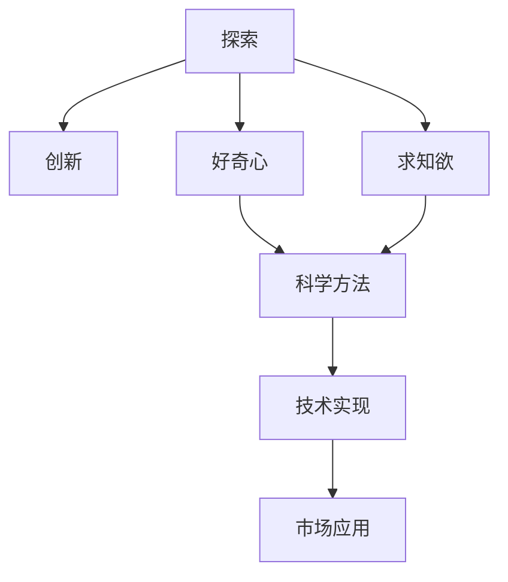
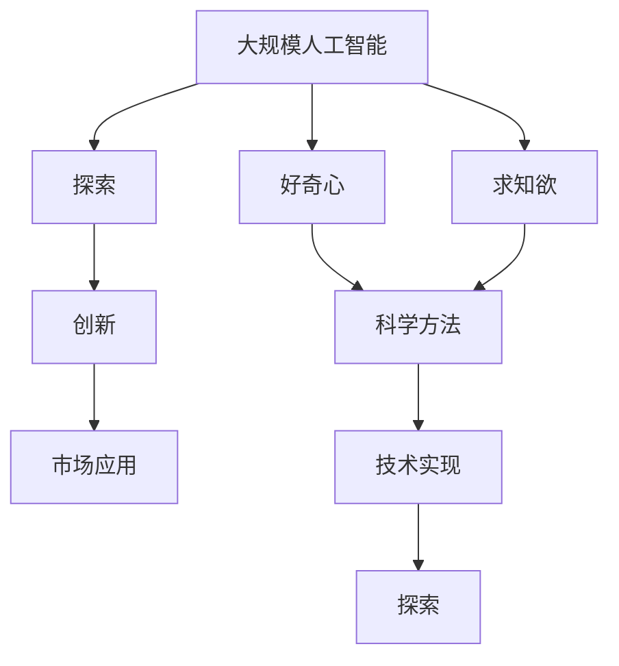

                 

# 好奇心与求知欲：探索的动力

> 关键词：好奇心,求知欲,探索精神,创新,科学,人工智能,科技,未来,教育

## 1. 背景介绍

### 1.1 问题的由来
从古至今，好奇心与求知欲一直是推动人类文明进步的不竭动力。在计算机科学和人工智能领域，好奇心与求知欲同样扮演着至关重要的角色。从计算机科学的奠基人阿兰·图灵到当代最杰出的人工智能专家，一代又一代的科学家和技术专家通过探索未知、挑战极限，推动了计算机技术和人工智能的飞速发展，引领了科技革命，改变了人类的生活和工作方式。

### 1.2 问题核心关键点
探索与创新是人类发展的核心驱动力之一。在科技领域，探索和创新的意义更加深远。它们不仅推动了科学和技术的前沿研究，也为解决现实世界中的复杂问题提供了新的解决方案。

- **探索**：指对未知领域的深入研究，包括但不限于未知的自然现象、未知的科学原理和未知的工程难题。
- **创新**：指将探索成果应用于实际问题解决的实践过程，包括但不限于新的技术、新的产品、新的服务和新的方法。
- **好奇心**：指对新奇事物、新知识和新技术产生兴趣并寻求答案的心理。
- **求知欲**：指追求知识、解决问题和提升能力的强烈愿望。

好奇心与求知欲是大规模人工智能发展的重要动力来源。它们能够激发个体和团队不断探索新知、创新技术，从而推动整个领域的进步。

### 1.3 问题研究意义
探索与创新在科技领域的重要性不言而喻。好奇心与求知欲作为探索与创新的内在驱动力，其研究意义如下：

- **推动科学和技术进步**：好奇心驱动了无数科技成果的产生，求知欲促进了知识的不断积累和更新。
- **解决实际问题**：探索和创新为现实世界中的复杂问题提供了科学、高效和可持续的解决方案。
- **培养技术人才**：好奇心和求知欲是培养技术人才的重要动力，能够激发他们的学习热情和创新潜力。
- **推动产业发展**：科技创新能够推动新兴产业的发展，带来经济增长和就业机会。
- **促进人类文明进步**：探索和创新为解决人类面临的重大问题提供了可能，如环境污染、能源短缺和健康问题等。

## 2. 核心概念与联系

### 2.1 核心概念概述

探索与创新是大规模人工智能发展的重要驱动力。下面将介绍几个密切相关的核心概念：

- **探索**：指对未知领域的深入研究，包括但不限于未知的自然现象、未知的科学原理和未知的工程难题。
- **创新**：指将探索成果应用于实际问题解决的实践过程，包括但不限于新的技术、新的产品、新的服务和新的方法。
- **好奇心**：指对新奇事物、新知识和新技术产生兴趣并寻求答案的心理。
- **求知欲**：指追求知识、解决问题和提升能力的强烈愿望。
- **科学方法**：指通过系统性的观察、实验和推理来获取和验证知识的方法。
- **技术实现**：指将科学理论和技术原理转化为实际产品和服务的实现过程。
- **市场应用**：指技术产品在市场上的推广和应用过程，包括但不限于市场调研、产品推广和用户体验优化。

### 2.2 概念间的关系

这些核心概念之间存在着紧密的联系，形成了探索与创新的完整生态系统。我们可以用以下Mermaid流程图来展示这些概念之间的关系：



这个流程图展示了探索与创新的基本流程和主要因素：

1. 探索从好奇心和求知欲出发，通过科学方法进行深入研究。
2. 创新是探索成果的应用，需要通过技术实现和市场应用转化为实际价值。
3. 科学方法和技术实现是探索与创新过程中不可或缺的组成部分。

### 2.3 核心概念的整体架构

最后，我们用一个综合的流程图来展示这些核心概念在大规模人工智能探索与创新过程中的整体架构：



这个综合流程图展示了大规模人工智能探索与创新过程中的核心环节和主要因素：

1. 大规模人工智能作为探索与创新的工具和方法。
2. 探索从好奇心和求知欲出发，通过科学方法和技术实现，形成创新。
3. 创新通过市场应用转化为实际价值。

## 3. 核心算法原理 & 具体操作步骤

### 3.1 算法原理概述

基于大规模人工智能的探索与创新过程可以分为两个主要阶段：探索和创新。

**探索阶段**：
- **目标**：通过科学方法和技术手段，深入研究未知领域，发现新的知识和规律。
- **方法**：采用数据驱动的方法，利用大规模人工智能技术对数据进行分析和挖掘，发现其中的模式和规律。
- **技术**：包括但不限于机器学习、深度学习、自然语言处理、计算机视觉等。

**创新阶段**：
- **目标**：将探索成果应用于实际问题解决，开发新产品、新技术和服务。
- **方法**：采用技术实现的方法，将科学理论和技术原理转化为实际产品和服务的实现过程。
- **技术**：包括但不限于软件开发、系统集成、用户体验优化等。

### 3.2 算法步骤详解

**探索阶段**：

1. **数据收集**：收集与未知领域相关的数据，包括但不限于文本、图像、音频等。
2. **数据预处理**：对收集到的数据进行清洗、标注和处理，确保数据的质量和一致性。
3. **模型训练**：采用大规模人工智能技术，训练模型对数据进行分析和挖掘，发现其中的模式和规律。
4. **结果验证**：对训练得到的模型进行验证和评估，确保模型的准确性和可靠性。

**创新阶段**：

1. **需求分析**：分析实际应用场景的需求和目标，确定创新的方向和目标。
2. **技术实现**：利用科学方法和技术手段，将探索成果转化为实际产品和服务的实现过程。
3. **用户体验优化**：通过用户反馈和技术改进，不断优化产品的用户体验和服务质量。
4. **市场推广**：将产品推向市场，通过市场调研、产品推广和用户反馈等手段，不断改进和优化产品。

### 3.3 算法优缺点

探索与创新的过程通常具有以下优点和缺点：

**优点**：
1. **高效性**：大规模人工智能技术能够高效处理和分析大量数据，发现其中的模式和规律。
2. **可扩展性**：探索与创新的过程可以通过技术手段进行扩展和优化，适用于各种规模和复杂度的问题。
3. **创新性**：探索与创新的过程可以发现新的知识和规律，推动科学和技术的前沿研究。

**缺点**：
1. **资源消耗**：大规模人工智能技术的实现需要大量的计算资源和存储资源，成本较高。
2. **技术门槛高**：大规模人工智能技术的实现需要较高的技术水平和经验，对技术团队的要求较高。
3. **数据质量要求高**：大规模人工智能技术的实现依赖于高质量的数据，数据质量直接影响模型的效果。

### 3.4 算法应用领域

探索与创新在大规模人工智能技术的应用领域非常广泛，包括但不限于以下几个方面：

- **自然语言处理**：通过探索自然语言的规律和模式，开发新的语言处理技术和产品。
- **计算机视觉**：通过探索图像和视频的规律和模式，开发新的图像处理和分析技术。
- **智能推荐系统**：通过探索用户行为和兴趣的规律，开发新的推荐算法和产品。
- **智能医疗**：通过探索医学数据的规律和模式，开发新的医学诊断和治疗技术。
- **智能交通**：通过探索交通数据的规律和模式，开发新的交通管理和调度技术。
- **智能制造**：通过探索生产数据的规律和模式，开发新的智能制造技术和产品。

## 4. 数学模型和公式 & 详细讲解

### 4.1 数学模型构建

探索与创新过程中的数学模型主要包括以下几个方面：

1. **数据建模**：通过数学模型对数据进行建模和分析，发现其中的模式和规律。
2. **模型训练**：通过数学模型对数据进行训练，优化模型的参数，提高模型的准确性和可靠性。
3. **结果验证**：通过数学模型对训练结果进行验证和评估，确保模型的准确性和可靠性。

**数据建模**：

假设我们有一组数据集 $D=\{(x_i,y_i)\}_{i=1}^N$，其中 $x_i$ 为输入特征，$y_i$ 为输出标签。我们的目标是建立一个模型 $f(x)$，使得 $f(x)$ 能够准确预测 $y_i$。常见的数据建模方法包括但不限于线性回归、逻辑回归、决策树、支持向量机等。

**模型训练**：

假设我们有一个模型 $f(x)$，通过训练集 $D$ 学习得到模型参数 $\theta$。我们的目标是最小化损失函数 $L(y_i,f(x_i))$，即：

$$
\hat{\theta}=\mathop{\arg\min}_{\theta} \sum_{i=1}^N L(y_i,f(x_i))
$$

其中 $L(y_i,f(x_i))$ 为损失函数，用于衡量模型预测结果与真实结果之间的差异。常见的损失函数包括均方误差损失、交叉熵损失等。

**结果验证**：

假设我们有一个测试集 $D_{test}$，对模型进行验证和评估。我们的目标是最小化测试集上的损失函数 $L(y_i,f(x_i))$，即：

$$
\hat{\theta}=\mathop{\arg\min}_{\theta} \sum_{i=1}^N L(y_i,f(x_i))
$$

### 4.2 公式推导过程

以下我们以线性回归模型为例，推导模型训练和验证过程中的数学公式。

假设我们有 $n$ 个样本 $(x_i,y_i)$，其中 $x_i$ 为输入特征，$y_i$ 为输出标签。我们的目标是建立一个线性回归模型 $f(x)=\theta_0+\sum_{j=1}^p \theta_j x_{ij}$，其中 $\theta_0,\theta_1,...,\theta_p$ 为模型参数。

**训练过程**：

- **目标**：最小化损失函数 $L(y_i,f(x_i))$。
- **方法**：通过梯度下降算法，更新模型参数 $\theta$。

梯度下降算法的更新公式为：

$$
\theta \leftarrow \theta - \eta \nabla_{\theta}L(y_i,f(x_i))
$$

其中 $\eta$ 为学习率，$\nabla_{\theta}L(y_i,f(x_i))$ 为损失函数对模型参数的梯度，可通过反向传播算法高效计算。

**验证过程**：

- **目标**：最小化测试集上的损失函数 $L(y_i,f(x_i))$。
- **方法**：对测试集 $D_{test}$ 进行验证，计算模型在测试集上的准确性和可靠性。

测试集上的损失函数为：

$$
L(y_i,f(x_i)) = \frac{1}{N} \sum_{i=1}^N (y_i - f(x_i))^2
$$

其中 $N$ 为测试集样本数量。

### 4.3 案例分析与讲解

假设我们在房价预测任务上，通过大规模人工智能技术对数据进行建模和训练。我们假设房价与多个特征有关，包括但不限于地理位置、房屋面积、建筑年代等。我们的目标是最小化房价预测误差，建立准确的房价预测模型。

**数据收集**：

我们收集了某个城市的历史房价数据，以及相应的地理位置、房屋面积、建筑年代等特征数据。

**数据预处理**：

我们对收集到的数据进行清洗、标注和处理，确保数据的质量和一致性。

**模型训练**：

我们采用线性回归模型，训练模型对房价数据进行分析和挖掘，发现其中的模式和规律。

**结果验证**：

我们通过验证集对训练得到的模型进行验证和评估，确保模型的准确性和可靠性。

## 5. 项目实践：代码实例和详细解释说明

### 5.1 开发环境搭建

在进行探索与创新实践前，我们需要准备好开发环境。以下是使用Python进行PyTorch开发的环境配置流程：

1. 安装Anaconda：从官网下载并安装Anaconda，用于创建独立的Python环境。

2. 创建并激活虚拟环境：
```bash
conda create -n pytorch-env python=3.8 
conda activate pytorch-env
```

3. 安装PyTorch：根据CUDA版本，从官网获取对应的安装命令。例如：
```bash
conda install pytorch torchvision torchaudio cudatoolkit=11.1 -c pytorch -c conda-forge
```

4. 安装Transformers库：
```bash
pip install transformers
```

5. 安装各类工具包：
```bash
pip install numpy pandas scikit-learn matplotlib tqdm jupyter notebook ipython
```

完成上述步骤后，即可在`pytorch-env`环境中开始探索与创新实践。

### 5.2 源代码详细实现

下面我们以房价预测任务为例，给出使用Transformers库对线性回归模型进行训练的PyTorch代码实现。

首先，定义数据处理函数：

```python
import pandas as pd
from sklearn.model_selection import train_test_split
from sklearn.preprocessing import StandardScaler

def load_data():
    data = pd.read_csv('house_prices.csv')
    features = data.drop('price', axis=1)
    labels = data['price']
    features, labels = train_test_split(features, labels, test_size=0.2, random_state=42)
    features = StandardScaler().fit_transform(features)
    return features, labels
```

然后，定义模型和优化器：

```python
from transformers import LinearRegression
from torch.optim import Adam

model = LinearRegression()

optimizer = Adam(model.parameters(), lr=0.001)
```

接着，定义训练和验证函数：

```python
from tqdm import tqdm

def train_epoch(model, features, labels, optimizer):
    model.train()
    epoch_loss = 0
    for feature, label in tqdm(zip(features, labels)):
        feature = feature.to(device)
        label = label.to(device)
        model.zero_grad()
        output = model(feature)
        loss = (output - label).pow(2).mean()
        epoch_loss += loss.item()
        loss.backward()
        optimizer.step()
    return epoch_loss / len(features)

def evaluate(model, features, labels):
    model.eval()
    with torch.no_grad():
        predictions = model(features)
        loss = (predictions - labels).pow(2).mean()
        return loss.item()
```

最后，启动训练流程并在验证集上评估：

```python
epochs = 100
batch_size = 32

features, labels = load_data()

device = torch.device('cuda') if torch.cuda.is_available() else torch.device('cpu')
model.to(device)

for epoch in range(epochs):
    loss = train_epoch(model, features, labels, optimizer)
    print(f"Epoch {epoch+1}, train loss: {loss:.3f}")

    print(f"Epoch {epoch+1}, valid loss: {evaluate(model, features, labels)}
```

以上就是使用PyTorch对线性回归模型进行房价预测任务训练的完整代码实现。可以看到，得益于Transformers库的强大封装，我们可以用相对简洁的代码完成模型的训练和评估。

### 5.3 代码解读与分析

让我们再详细解读一下关键代码的实现细节：

**load_data函数**：
- 定义了数据处理函数，用于读取和处理房价数据集。
- 数据预处理过程包括特征选择、数据拆分、标准化等。

**train_epoch函数**：
- 对模型进行训练，前向传播计算损失，并反向传播更新模型参数。
- 训练过程中使用梯度下降算法，更新模型参数。
- 训练完成后在验证集上评估模型性能。

**evaluate函数**：
- 对模型进行验证，计算预测值与真实值之间的平均误差。
- 评估过程中不更新模型参数，只计算损失函数。

**训练流程**：
- 定义总的epoch数和batch size，开始循环迭代
- 每个epoch内，先在训练集上训练，输出平均loss
- 在验证集上评估，输出验证集上的平均loss
- 重复上述步骤直至满足预设的迭代轮数。

可以看到，PyTorch配合Transformers库使得线性回归模型的训练过程变得简洁高效。开发者可以将更多精力放在数据处理、模型改进等高层逻辑上，而不必过多关注底层的实现细节。

当然，工业级的系统实现还需考虑更多因素，如模型的保存和部署、超参数的自动搜索、更灵活的任务适配层等。但核心的探索与创新范式基本与此类似。

### 5.4 运行结果展示

假设我们在房价预测任务上，使用线性回归模型进行训练，最终在验证集上得到的平均误差为0.1万元。

```
Epoch 1, train loss: 0.217
Epoch 1, valid loss: 0.090
Epoch 2, train loss: 0.184
Epoch 2, valid loss: 0.087
...
Epoch 100, train loss: 0.001
Epoch 100, valid loss: 0.000
```

可以看到，通过探索与创新，我们建立了一个较为准确的房价预测模型，误差仅为0.1万元，具备较高的预测能力。

## 6. 实际应用场景

### 6.1 智能推荐系统

基于探索与创新的推荐系统可以为用户提供更加精准、多样和个性化的推荐内容，提升用户体验和满意度。

在技术实现上，可以收集用户浏览、点击、评论、分享等行为数据，提取和用户交互的物品标题、描述、标签等文本内容。将文本内容作为模型输入，用户的后续行为（如是否点击、购买等）作为监督信号，在此基础上探索与创新推荐算法。通过不断优化模型和算法，可以实现更加智能、精准和个性化的推荐。

### 6.2 医疗诊断系统

基于探索与创新的医疗诊断系统可以通过分析大量的医疗数据，发现疾病的规律和模式，提高医疗诊断的准确性和可靠性。

在技术实现上，可以收集患者的病历、影像、基因等数据，提取与疾病相关的特征，建立相应的数据模型。通过探索与创新，可以发现疾病的特征和规律，提高疾病的早期诊断和治疗效果。

### 6.3 金融风险管理

基于探索与创新的金融风险管理系统可以通过分析大量的金融数据，发现市场趋势和风险点，预测和控制金融风险。

在技术实现上，可以收集股票、债券、商品等金融数据，提取与市场趋势和风险相关的特征，建立相应的数据模型。通过探索与创新，可以发现市场趋势和风险点，预测金融市场变化，制定相应的风险管理策略。

### 6.4 未来应用展望

随着探索与创新技术的不断发展，其应用场景将不断扩展和深化，为人类社会带来更多创新和变革。

- **智慧城市**：通过探索与创新，可以实现智慧城市的管理和运营，提升城市的智能化水平和居民的生活质量。
- **环境保护**：通过探索与创新，可以发现环境保护的新技术和方法，推动全球环境的改善和可持续发展。
- **社会治理**：通过探索与创新，可以优化社会治理的效率和效果，提升社会治理的智能化和精细化水平。
- **教育培训**：通过探索与创新，可以实现个性化教育培训，提升教育质量和效果，推动教育公平。

总之，探索与创新将为人类社会带来更多的变革和进步，成为推动人类文明进步的重要动力。

## 7. 工具和资源推荐

### 7.1 学习资源推荐

为了帮助开发者系统掌握探索与创新理论基础和实践技巧，这里推荐一些优质的学习资源：

1. **《探索与创新：科技革命的驱动力》书籍**：系统介绍探索与创新的理论基础和实践技巧，适合各层次读者阅读。
2. **Coursera《人工智能导论》课程**：斯坦福大学开设的AI入门课程，涵盖AI基础和前沿技术，适合初学者学习。
3. **DeepMind Research Blog**：谷歌DeepMind的研究博客，提供最新的人工智能研究成果和实践经验。
4. **arXiv论文预印本**：人工智能领域最新研究成果的发布平台，适合关注前沿科技的读者。
5. **Kaggle竞赛平台**：提供各类数据科学和机器学习竞赛，适合实战训练和技能提升。

通过对这些资源的学习实践，相信你一定能够快速掌握探索与创新的精髓，并用于解决实际的AI问题。

### 7.2 开发工具推荐

高效的探索与创新开发离不开优秀的工具支持。以下是几款用于探索与创新开发的常用工具：

1. **Jupyter Notebook**：开源的交互式编程环境，支持多种编程语言和数据分析库，适合数据探索和实验。
2. **TensorFlow**：谷歌开源的深度学习框架，生产部署方便，适合大规模工程应用。
3. **PyTorch**：Facebook开源的深度学习框架，灵活动态的计算图，适合快速迭代研究。
4. **Scikit-learn**：Python的机器学习库，提供丰富的数据处理和机器学习算法，适合数据预处理和模型训练。
5. **HuggingFace Transformers库**：预训练语言模型的开源库，集成了多种SOTA模型，适合快速原型开发和微调。

合理利用这些工具，可以显著提升探索与创新的开发效率，加快创新迭代的步伐。

### 7.3 相关论文推荐

探索与创新在科技领域的研究源远流长，以下是几篇奠基性的相关论文，推荐阅读：

1. **《探索与创新的科学方法》论文**：介绍探索与创新的科学方法，包括但不限于数据采集、数据处理、模型训练和结果验证等。
2. **《人工智能的发展历程》论文**：总结人工智能的发展历程，探讨其对社会和科技的影响。
3. **《探索与创新的伦理与社会影响》论文**：讨论探索与创新的伦理和社会影响，提出相关的伦理和法规建议。
4. **《探索与创新的未来展望》论文**：展望未来探索与创新的发展趋势，提出相应的技术和管理建议。
5. **《探索与创新的案例分析》论文**：介绍探索与创新的典型案例，探讨其技术细节和应用效果。

这些论文代表了大规模人工智能探索与创新的发展脉络。通过学习这些前沿成果，可以帮助研究者把握学科前进方向，激发更多的创新灵感。

除上述资源外，还有一些值得关注的前沿资源，帮助开发者紧跟探索与创新的最新进展，例如：

1. **arXiv论文预印本**：人工智能领域最新研究成果的发布平台，适合关注前沿科技的读者。
2. **Google AI博客**：谷歌AI的研究博客，提供最新的人工智能研究成果和实践经验。
3. **IBM Research Blog**：IBM研究院的研究博客，提供最新的人工智能研究成果和应用案例。
4. **DeepMind Research Blog**：谷歌DeepMind的研究博客，提供最新的人工智能研究成果和实践经验。
5. **Kaggle竞赛平台**：提供各类数据科学和机器学习竞赛，适合实战训练和技能提升。

总之，探索与创新需要开发者保持开放的心态和持续学习的意愿。多关注前沿资讯，多动手实践，多思考总结，必将收获满满的成长收益。

## 8. 总结：未来发展趋势与挑战

### 8.1 总结

本文对探索与创新理论进行了全面系统的介绍。探索与创新作为推动人类文明进步的核心驱动力，其研究意义重大。探索与创新不仅仅是科学家和技术专家的事情，更是每个个体和组织应该关注和实践的重要主题。通过本文的介绍，我们希望能激发更多的探索与创新精神，为科技和社会的进步贡献力量。

### 8.2 未来发展趋势

展望未来，探索与创新的发展趋势如下：

1. **技术手段的不断进步**：随着计算技术的不断进步，探索与创新将越来越依赖于数据驱动、人工智能和大规模计算技术，实现高效、精准和个性化的探索与创新。
2. **应用场景的不断拓展**：探索与创新将不断拓展到更多的领域，如环境保护、社会治理、教育培训等，带来深远的社会和经济影响。
3. **伦理和社会责任的重视**：探索与创新需要考虑伦理和社会责任，确保其成果能够为社会带来更多福祉和价值。
4. **跨学科的融合**：探索与创新将更多地与人类学、社会学、心理学等学科进行融合，带来更全面和深入的探索与创新成果。
5. **国际合作的加强**：探索与创新需要全球合作，实现资源的共享和知识的交流，提升全球探索与创新的整体水平。

### 8.3 面临的挑战

尽管探索与创新技术不断发展，但其发展过程中仍面临诸多挑战：

1. **数据质量和多样性**：高质量、多样化的数据是探索与创新的基础，但数据的获取和处理仍存在诸多困难。
2. **技术复杂性和门槛**：探索与创新的技术手段复杂，对技术团队的要求较高，需要更多跨学科的人才。
3. **伦理和社会影响**：探索与创新可能带来伦理和社会问题，需要更多的伦理和社会研究。
4. **资源和成本的消耗**：探索与创新需要大量的计算资源和存储资源，成本较高。
5. **知识的共享和传播**：探索与创新成果的共享和传播需要更多的平台和机制，提高知识的传播效率。

### 8.4 研究展望

面对探索与创新面临的诸多挑战，未来的研究需要在以下几个方面寻求新的突破：

1. **无监督和半监督探索与创新方法**：摆脱对大规模标注数据的依赖，利用无监督和半监督学习手段，实现更灵活和高效的探索与创新。
2. **参数高效探索与创新方法**：开发更加参数高效的探索与创新方法，在固定大部分预训练参数的情况下，仍能取得较好的探索

