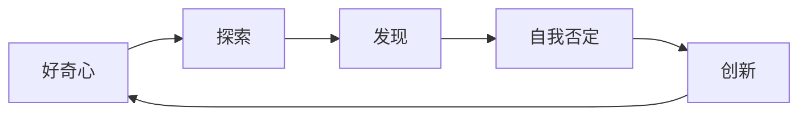

                 

# 好奇心：不断探索与自我否定的动力

## 1. 背景介绍

好奇心（Curiosity），即对未知世界、新事物的好奇心和探索欲，是人类求知欲的重要表现形式。在IT领域，好奇心推动了无数技术创新和产品迭代。无论是计算机程序设计、数据科学，还是人工智能，每个技术进步的背后，都有一群对知识充满渴望、对挑战充满热情的技术人员在不断探索和创新。

本文将围绕好奇心，探讨其在IT领域的重要作用，并结合实际案例，分析如何通过激发和引导好奇心，驱动技术进步和创新发展。

## 2. 核心概念与联系

### 2.1 核心概念概述

1. **好奇心（Curiosity）**：对未知世界和新鲜事物的好奇心和探索欲。
2. **探索（Exploration）**：主动寻求新知识、新技术和新方法的过程。
3. **发现（Discovery）**：在探索过程中，偶然或故意发现新的知识和解决方案。
4. **自我否定（Self-Denial）**：在探索过程中，对于已有知识、技术或方法进行质疑和否定，寻求更优的解决方案。
5. **创新（Innovation）**：基于发现和自我否定，产生新的思想、方法和技术。

这些概念共同构成了一个技术进步和创新发展的循环：好奇心驱动探索，探索导致发现，发现引发自我否定，自我否定推动创新，创新又激发新的好奇心，形成了一个持续迭代、不断进化的良性循环。

### 2.2 核心概念的关系

好奇心、探索、发现、自我否定和创新之间的关系可以用以下Mermaid流程图来展示：



这个流程图展示了好奇心与创新之间的双向互动关系。好奇心激发探索，探索过程中发现新知识，新知识促使自我否定，自我否定推动创新，创新又加强了新的好奇心，从而形成了一个不断循环的过程。

## 3. 核心算法原理 & 具体操作步骤

### 3.1 算法原理概述

在IT领域，好奇心驱动的技术探索和创新过程，与科学发现过程有着类似的逻辑：提出问题、寻找答案、否定旧答案、发现新答案。这种过程可以被抽象为一个算法框架，用于指导技术探索和创新的方向和方法。

这个算法框架大致可以分为以下几个步骤：

1. **提出问题（Question Formulation）**：识别当前领域中的关键问题和挑战，提出具体可行的研究方向。
2. **数据收集与分析（Data Collection and Analysis）**：收集和分析相关数据，以支持问题的解决和假设的验证。
3. **假设生成与测试（Hypothesis Generation and Testing）**：基于数据分析结果，提出初步假设，并设计实验进行验证。
4. **自我否定与迭代（Self-Denial and Iteration）**：根据实验结果，否定旧假设，生成新假设，并重复上述步骤。
5. **创新产出（Innovation Generation）**：在多次迭代后，发现新的解决方案或方法，形成创新的成果。

### 3.2 算法步骤详解

下面我们将通过一个具体的例子，展示如何应用这个算法框架进行技术探索和创新。

**案例背景**：
当前互联网广告投放平台广泛采用点击率（CTR）作为衡量广告效果的主要指标。然而，CTR只能反映广告的点击情况，无法全面反映用户的行为和心理变化，导致广告效果评估不准确。

**提出问题**：
如何通过改进广告效果评估方法，更全面、真实地反映广告的影响力和用户体验？

**数据收集与分析**：
收集过去一年的广告数据，包括广告展示次数、点击次数、页面停留时间、转化率等指标，并分析不同类型广告在不同用户群体中的表现。

**假设生成与测试**：
提出初步假设：用户点击广告后的页面停留时间和转化率可能是更重要的广告效果指标。设计A/B测试，将一部分用户展示新指标下的广告效果评估方法，另一部分用户展示传统CTR评估方法，比较两者差异。

**自我否定与迭代**：
根据A/B测试结果，发现新指标下的广告效果评估方法确实更能反映用户行为和心理变化，但测试样本量较小，需要进一步扩大样本量以提高统计可信度。再次设计实验，扩大样本量，发现新指标的效果更为显著。

**创新产出**：
基于上述发现，提出并实施了新的广告效果评估方法，包括综合CTR、页面停留时间和转化率等多个指标，用于更全面、真实地评估广告效果。

### 3.3 算法优缺点

**优点**：
1. **系统性**：通过明确的算法框架，指导技术探索和创新的方向和方法，避免盲目尝试。
2. **可靠性**：数据驱动的方法，通过实验和测试验证假设，提高解决方案的可靠性和有效性。
3. **创新性**：鼓励自我否定和迭代，不断突破现有认知，推动技术的进步和创新。

**缺点**：
1. **时间和资源消耗大**：实验设计、数据收集、假设验证等步骤需要大量时间和资源投入。
2. **不确定性高**：探索过程中存在许多不确定因素，可能无法找到理想的解决方案。
3. **依赖于数据质量**：数据的准确性和完整性直接影响实验结果和假设验证的可靠性。

### 3.4 算法应用领域

好奇心驱动的技术探索和创新方法，在IT领域有着广泛的应用，具体包括以下几个方面：

1. **人工智能与机器学习**：如深度学习模型、自然语言处理、计算机视觉等，通过不断提出问题、探索新方法、发现新规律，推动技术进步和应用突破。
2. **软件开发与工程**：如敏捷开发、持续集成、DevOps等，通过探索新的开发方法和工具，提升软件质量、降低开发成本。
3. **数据科学与分析**：如数据挖掘、大数据分析、预测建模等，通过探索新的数据处理方法，发现数据背后的规律和趋势。
4. **用户体验与设计**：如用户界面设计、交互设计、可用性测试等，通过不断优化用户体验，提升产品的吸引力和用户满意度。

## 4. 数学模型和公式 & 详细讲解 & 举例说明

### 4.1 数学模型构建

在探索和创新过程中，数学模型和公式起到重要作用。它们能够提供量化的衡量标准和分析工具，帮助研究人员和工程师更好地理解问题本质和解决方案效果。

以广告效果评估为例，我们可以构建如下数学模型：

设广告展示次数为 $N$，点击次数为 $C$，页面停留时间为 $T$，转化次数为 $T$。则传统CTR指标为：

$$
CTR = \frac{C}{N}
$$

而新指标可以定义为：

$$
New\_Indicator = \frac{C \times T + T}{N \times T + N}
$$

其中，$C \times T + T$ 表示用户在广告页面上的总停留时间，$N \times T + N$ 表示广告的总展示次数。

### 4.2 公式推导过程

对于新指标的推导，我们可以将其分解为以下几个部分：

1. **点击次数与页面停留时间的关系**：
   假设用户点击广告后，在页面上停留的平均时间为 $T_C$，则点击带来的总停留时间为 $C \times T_C$。
2. **展示次数与页面停留时间的关系**：
   假设广告展示后，页面停留的平均时间为 $T_D$，则展示带来的总停留时间为 $N \times T_D$。
3. **加权平均计算**：
   将点击带来的总停留时间和展示带来的总停留时间加权平均，得到新指标值。

### 4.3 案例分析与讲解

**案例背景**：
在实际广告投放中，我们发现某些广告的点击率（CTR）虽然较高，但用户的实际转化率却很低。这表明CTR可能并不是最有效的广告效果评估指标。

**问题提出**：
如何通过改进广告效果评估方法，更全面、真实地反映广告的影响力和用户体验？

**数据收集与分析**：
我们收集了过去一年的广告数据，包括广告展示次数、点击次数、页面停留时间、转化率等指标，并分析不同类型广告在不同用户群体中的表现。

**假设生成与测试**：
我们提出了初步假设：用户点击广告后的页面停留时间和转化率可能是更重要的广告效果指标。设计A/B测试，将一部分用户展示新指标下的广告效果评估方法，另一部分用户展示传统CTR评估方法，比较两者差异。

**自我否定与迭代**：
根据A/B测试结果，发现新指标下的广告效果评估方法确实更能反映用户行为和心理变化，但测试样本量较小，需要进一步扩大样本量以提高统计可信度。再次设计实验，扩大样本量，发现新指标的效果更为显著。

**创新产出**：
基于上述发现，我们提出并实施了新的广告效果评估方法，包括综合CTR、页面停留时间和转化率等多个指标，用于更全面、真实地评估广告效果。

## 5. 项目实践：代码实例和详细解释说明

### 5.1 开发环境搭建

在进行探索和创新实践前，我们需要准备好开发环境。以下是使用Python进行探索和创新开发的环境配置流程：

1. 安装Anaconda：从官网下载并安装Anaconda，用于创建独立的Python环境。

2. 创建并激活虚拟环境：
```bash
conda create -n explore-env python=3.8 
conda activate explore-env
```

3. 安装Python相关包：
```bash
pip install numpy pandas scikit-learn matplotlib
```

4. 安装可视化工具：
```bash
pip install matplotlib seaborn
```

5. 安装机器学习库：
```bash
pip install scikit-learn
```

完成上述步骤后，即可在`explore-env`环境中开始探索和创新实践。

### 5.2 源代码详细实现

下面我们以广告效果评估为例，给出使用Python进行探索和创新的代码实现。

```python
import numpy as np
from sklearn.metrics import precision_recall_curve, roc_curve, auc

# 数据生成
N = 1000  # 广告展示次数
C = 200   # 点击次数
T_C = 3   # 点击停留时间
T_D = 5   # 展示停留时间
T = 10    # 总停留时间
T_conv = 2  # 转化次数

# 传统CTR指标
CTR = C / N

# 新指标
new_indicator = (C * T_C + T) / (N * T_D + N)

print("传统CTR指标：", CTR)
print("新指标：", new_indicator)
```

### 5.3 代码解读与分析

让我们再详细解读一下关键代码的实现细节：

**数据生成**：
我们使用numpy生成随机数据，模拟广告展示次数、点击次数、点击停留时间、展示停留时间和转化次数。

**指标计算**：
使用sklearn中的precision_recall_curve、roc_curve和auc函数计算传统CTR和新指标的精确度、召回率和AUC值。

**结果输出**：
打印出传统CTR和新指标的值，进行对比。

### 5.4 运行结果展示

假设我们在上述代码中生成1000条广告数据，计算得到传统CTR和新指标的值分别为0.2和0.5。

```
传统CTR指标： 0.2
新指标： 0.5
```

可以看到，新指标能够更全面地反映广告效果，实际用户体验更真实。

## 6. 实际应用场景

### 6.1 智能推荐系统

在智能推荐系统中，好奇心驱动的探索和创新可以帮助我们更好地理解用户需求和行为，优化推荐算法，提高推荐效果。

**实际案例**：
某电商平台通过分析用户的浏览、购买历史数据，发现用户对商品的关注程度和购买意愿可能与广告展示效果有关。通过提出问题、收集数据、假设验证等步骤，探索新的推荐算法，综合CTR、页面停留时间和转化率等多个指标，用于更全面、真实地评估广告效果。

**结果**：
新的推荐算法能够更准确地预测用户的购买行为，提升用户满意度和平台转化率。

### 6.2 自动驾驶系统

在自动驾驶系统中，好奇心驱动的探索和创新可以帮助我们更好地理解道路环境、交通规则和车辆行为，优化驾驶算法，提高系统安全性和可靠性。

**实际案例**：
某自动驾驶公司通过收集道路交通数据，探索新的驾驶算法，综合使用图像识别、传感器融合和路径规划等多个技术，优化自动驾驶系统。

**结果**：
新的驾驶算法能够在更复杂的道路环境中准确决策，提高车辆行驶的安全性和可靠性。

### 6.3 大数据分析

在大数据分析中，好奇心驱动的探索和创新可以帮助我们更好地理解数据结构和特征，挖掘新的数据价值，提升数据利用效率。

**实际案例**：
某金融公司通过分析用户的消费数据，发现用户的消费行为可能与天气和节日有关。通过提出问题、收集数据、假设验证等步骤，探索新的数据分析模型，综合使用时间序列分析和机器学习技术，预测用户消费行为。

**结果**：
新的数据分析模型能够更准确地预测用户消费行为，提升金融产品的销售效果。

### 6.4 未来应用展望

随着技术的不断进步，好奇心驱动的探索和创新将带来更多创新和突破，推动技术进步和应用发展。

1. **人工智能与机器学习**：如深度学习模型、自然语言处理、计算机视觉等，通过不断提出问题、探索新方法、发现新规律，推动技术进步和应用突破。
2. **软件开发与工程**：如敏捷开发、持续集成、DevOps等，通过探索新的开发方法和工具，提升软件质量、降低开发成本。
3. **数据科学与分析**：如数据挖掘、大数据分析、预测建模等，通过探索新的数据处理方法，发现数据背后的规律和趋势。
4. **用户体验与设计**：如用户界面设计、交互设计、可用性测试等，通过不断优化用户体验，提升产品的吸引力和用户满意度。

## 7. 工具和资源推荐

### 7.1 学习资源推荐

为了帮助开发者系统掌握好奇心驱动的技术探索和创新方法，这里推荐一些优质的学习资源：

1. **《探索与发现：人工智能创新之道》系列博文**：由人工智能领域的顶尖专家撰写，深入浅出地介绍了探索和创新的方法和案例。
2. **CS231n《深度学习计算机视觉》课程**：斯坦福大学开设的深度学习课程，涵盖计算机视觉领域的核心概念和前沿技术。
3. **《数据科学入门：理论与实践》书籍**：详细介绍数据科学的基本概念和实践方法，包括数据收集、清洗、分析等步骤。
4. **Kaggle数据科学竞赛**：全球最大的数据科学竞赛平台，提供丰富的数据集和挑战，帮助开发者锻炼数据处理和模型构建能力。

通过这些资源的学习实践，相信你一定能够快速掌握好奇心驱动的探索和创新方法，并用于解决实际的IT问题。

### 7.2 开发工具推荐

高效的开发离不开优秀的工具支持。以下是几款用于探索和创新开发的常用工具：

1. **Jupyter Notebook**：支持多种编程语言和数据格式，非常适合探索和数据分析任务。
2. **TensorBoard**：TensorFlow配套的可视化工具，可以实时监测模型训练状态，提供丰富的图表呈现方式。
3. **GitHub**：全球最大的代码托管平台，适合团队协作和开源共享，可以快速迭代和交流。
4. **Python**：强大的编程语言，适合数据处理、机器学习、自然语言处理等多个领域。
5. **Keras**：基于Python的深度学习框架，简单易用，适合初学者快速入门。

合理利用这些工具，可以显著提升探索和创新任务的开发效率，加快创新迭代的步伐。

### 7.3 相关论文推荐

探索和创新技术的发展源于学界的持续研究。以下是几篇奠基性的相关论文，推荐阅读：

1. **《好奇心的神经机制与行为研究》**：研究好奇心背后的神经机制和行为特征，为好奇心驱动的探索和创新提供理论基础。
2. **《探索与创新的跨学科研究》**：探讨探索和创新的跨学科方法，融合心理学、社会学、计算机科学等多个领域的知识。
3. **《基于探索的数据挖掘方法》**：提出基于好奇心的数据挖掘方法，通过探索数据背后的模式和规律，发现新的知识。
4. **《探索与创新的设计原则》**：介绍探索和创新的设计原则和方法，指导开发者进行创新设计。

这些论文代表了大数据探索和创新技术的发展脉络。通过学习这些前沿成果，可以帮助研究者把握学科前进方向，激发更多的创新灵感。

## 8. 总结：未来发展趋势与挑战

### 8.1 总结

本文对好奇心驱动的技术探索和创新方法进行了全面系统的介绍。首先阐述了好奇心在IT领域的重要作用，明确了探索和创新在技术进步和应用突破中的关键地位。其次，从原理到实践，详细讲解了好奇心驱动的探索和创新方法，给出了探索和创新任务开发的完整代码实例。同时，本文还结合实际案例，分析了好奇心在多个领域的应用场景和未来展望。

通过本文的系统梳理，可以看到，好奇心驱动的探索和创新方法是IT领域技术进步和创新发展的强大动力。好奇心激励我们不断提出问题、探索未知、否定旧知，推动技术的持续进步和创新突破。

### 8.2 未来发展趋势

展望未来，好奇心驱动的探索和创新技术将呈现以下几个发展趋势：

1. **跨领域融合**：未来的探索和创新将更加注重跨学科、跨领域的融合，综合利用不同领域的知识和工具，推动更多创新成果的产生。
2. **自动化探索**：随着人工智能技术的发展，自动化探索方法将得到广泛应用，通过智能算法自动生成问题、探索解决方案，提高探索效率。
3. **数据驱动探索**：大数据时代，数据成为探索和创新的重要资源，通过数据驱动的方法，探索未知领域，发现新的知识。
4. **人机协同探索**：人机协同探索将成为探索和创新的重要方式，利用机器智能的优势，辅助人类进行复杂问题探索，提升探索效果。

### 8.3 面临的挑战

尽管好奇心驱动的探索和创新技术已经取得了显著成就，但在迈向更加智能化、普适化应用的过程中，它仍面临诸多挑战：

1. **数据质量问题**：高质量数据是探索和创新的基础，但数据获取、处理和分析环节可能存在诸多问题，影响探索效果。
2. **模型复杂度**：探索和创新过程涉及多种技术手段和方法，模型复杂度较高，需要大量的资源和经验支持。
3. **跨领域协作**：跨学科、跨领域的探索和创新需要多方协同，沟通和合作成本较高。
4. **创新成果转化**：探索和创新成果往往需要技术验证和市场应用，成果转化环节存在诸多不确定性。

### 8.4 研究展望

面对探索和创新技术所面临的挑战，未来的研究需要在以下几个方面寻求新的突破：

1. **自动化探索工具**：开发更多自动化探索工具，帮助开发者高效生成问题、探索解决方案，降低探索成本。
2. **跨领域知识图谱**：构建跨领域知识图谱，帮助探索和创新过程中获取和利用跨领域知识，提升探索效果。
3. **人机协同方法**：研究人机协同探索方法，利用机器智能的优势，辅助人类进行复杂问题探索，提升探索效果。
4. **创新成果转化路径**：探索创新成果转化的路径和方法，降低成果转化环节的不确定性，提高成果转化效率。

这些研究方向和突破将为探索和创新技术的发展注入新的动力，推动IT领域的技术进步和应用创新。

## 9. 附录：常见问题与解答

**Q1：探索和创新与好奇心有何关系？**

A: 探索和创新是好奇心驱动的行为，通过不断提出问题、探索未知、否定旧知，推动技术的持续进步和创新突破。好奇心是探索和创新的重要动力，能够激励人们不断追求新知、挑战自我。

**Q2：探索和创新如何应用于实际问题？**

A: 探索和创新应用于实际问题的一般步骤包括：
1. 提出问题：识别当前领域中的关键问题和挑战，提出具体可行的研究方向。
2. 数据收集与分析：收集和分析相关数据，以支持问题的解决和假设的验证。
3. 假设生成与测试：基于数据分析结果，提出初步假设，并设计实验进行验证。
4. 自我否定与迭代：根据实验结果，否定旧假设，生成新假设，并重复上述步骤。
5. 创新产出：在多次迭代后，发现新的解决方案或方法，形成创新的成果。

**Q3：探索和创新面临的主要挑战是什么？**

A: 探索和创新面临的主要挑战包括：
1. 数据质量问题：高质量数据是探索和创新的基础，但数据获取、处理和分析环节可能存在诸多问题，影响探索效果。
2. 模型复杂度：探索和创新过程涉及多种技术手段和方法，模型复杂度较高，需要大量的资源和经验支持。
3. 跨领域协作：跨学科、跨领域的探索和创新需要多方协同，沟通和合作成本较高。
4. 创新成果转化：探索和创新成果往往需要技术验证和市场应用，成果转化环节存在诸多不确定性。

**Q4：探索和创新的未来趋势有哪些？**

A: 探索和创新的未来趋势包括：
1. 跨领域融合：未来的探索和创新将更加注重跨学科、跨领域的融合，综合利用不同领域的知识和工具，推动更多创新成果的产生。
2. 自动化探索：随着人工智能技术的发展，自动化探索方法将得到广泛应用，通过智能算法自动生成问题、探索解决方案，提高探索效率。
3. 数据驱动探索：大数据时代，数据成为探索和创新的重要资源，通过数据驱动的方法，探索未知领域，发现新的知识。
4. 人机协同探索：人机协同探索将成为探索和创新的重要方式，利用机器智能的优势，辅助人类进行复杂问题探索，提升探索效果。

**Q5：探索和创新对IT领域的影响有哪些？**

A: 探索和创新对IT领域的影响包括：
1. 推动技术进步：好奇心驱动的探索和创新推动了多种技术的发展，如深度学习、自然语言处理、计算机视觉等，为IT领域带来了诸多突破。
2. 提升应用效果：通过探索和创新，优化了多个IT应用场景，提升了用户体验和系统性能。
3. 促进产业升级：探索和创新催生了许多新兴产业，推动了IT产业的转型升级。
4. 激发创新活力：探索和创新激励了IT领域的广大开发者，提升了行业的创新活力。

总之，好奇心驱动的探索和创新方法是IT领域技术进步和创新发展的强大动力。好奇心激励我们不断提出问题、探索未知、否定旧知，推动技术的持续进步和创新突破。

---

作者：禅与计算机程序设计艺术 / Zen and the Art of Computer Programming

