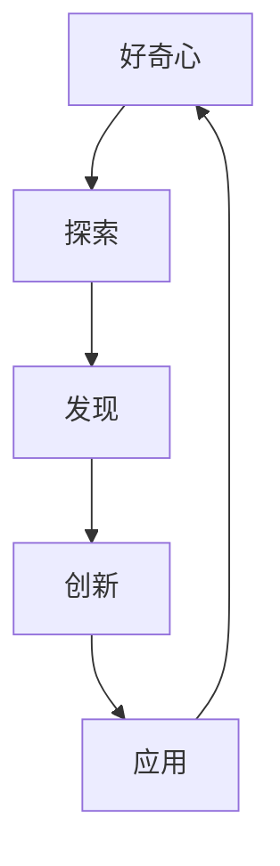

                 

# 好奇心：驱动创新与发现的源泉

## 1. 背景介绍

### 1.1 问题由来
好奇心是推动人类文明进步的核心动力之一。自古以来，无数发明创造的诞生，都源于人们对外界世界的不懈探索和深切求知。从古代的四大发明到现代的互联网革命，好奇心一直是推动人类社会向前发展的关键因素。

在计算机科学和人工智能领域，好奇心同样扮演着重要角色。它不仅推动了技术创新和应用探索，还激发了无数研究者和工程师的探索热情，推动了科学界和产业界的前进。通过不断挖掘和探究未知领域，技术巨匠们不断突破自我，开创新的应用范式，推动了信息技术从简单的计算工具，逐步成长为现代社会不可或缺的基础设施。

本文旨在探讨好奇心在驱动技术创新和发现中的关键作用，并从科学、技术、工程和数学（STEM）四个维度，深入分析好奇心的具体影响和实际应用。通过深入的分析和实证，我们希望能够揭示好奇心驱动创新的内在机制，并为未来的科学研究和技术发展提供新思路。

### 1.2 问题核心关键点
好奇心驱动创新的关键点在于其能够激发人类探索未知、突破常规的思维模式，从而推动技术的发展。这一过程主要包括：

- **探索未知**：好奇心驱使人们深入未知领域，探索新的科学原理和技术方法，为创新提供源泉。
- **突破常规**：好奇心引导人们跳出传统思维框架，尝试新奇、非传统的解决方案，推动技术突破。
- **汇聚创新**：好奇心促进了多学科、跨领域的知识融合，为创新提供更广阔的视角和更多的可能性。
- **持续改进**：好奇心促使人们不断追求更高目标，持续改进已有技术和方法，使其更加先进和完善。

本文将从多个角度深入分析好奇心如何推动技术创新，并通过具体案例，展示好奇心在实际技术应用中的重要作用。

## 2. 核心概念与联系

### 2.1 核心概念概述

为了更好地理解好奇心驱动创新的机制，本文将介绍几个关键概念：

- **好奇心**：指人们对未知事物、新奇现象、未解之谜的强烈探索欲和求知心，是推动科学和技术创新的内在动力。
- **创新**：指在已有知识、技术、方法的基础上，通过突破性思维和实践，产生新的解决方案、产品、技术的过程。
- **探索**：指主动探究未知领域，挖掘新知识、新方法、新技术的行为。
- **发现**：指在探索过程中，意外发现新现象、新规律、新理论的行为。

这些概念之间存在着紧密的联系，共同构成了好奇心驱动创新的生态系统。好奇心是探索和发现的起点，而探索和发现又是创新的源泉，创新成果又进一步激发了新的好奇心，形成良性循环。

### 2.2 概念间的关系

这些核心概念之间的关系可以用以下Mermaid流程图来展示：



这个流程图展示了好奇心驱动创新的完整过程：

1. 好奇心驱使人们进行探索。
2. 探索过程中可能发生发现。
3. 发现推动创新，产生新的技术或方法。
4. 创新成果应用到实际中，进一步激发新的好奇心。
5. 形成良性的好奇心-探索-发现-创新循环，持续推动技术进步。

## 3. 核心算法原理 & 具体操作步骤
### 3.1 算法原理概述

好奇心驱动的技术创新，通常涉及以下几个关键步骤：

1. **问题识别**：通过观察和研究，识别出未知的、有待解决的问题。
2. **假说生成**：基于问题，提出多种可能的解决方案，进行假设验证。
3. **实验验证**：通过实验验证假设的有效性，进行迭代优化。
4. **创新应用**：将创新的成果应用于实际问题中，进行评估和反馈。
5. **反馈迭代**：基于应用反馈，继续改进和优化解决方案，形成迭代闭环。

这些步骤构成了好奇心驱动创新的基本流程，体现了从发现到创新，再到应用和反馈的完整过程。

### 3.2 算法步骤详解

以下详细介绍好奇心驱动技术创新的各个步骤的详细步骤：

#### 3.2.1 问题识别

问题识别是技术创新的起点。这一步骤主要涉及以下操作：

1. **观察现象**：通过广泛观察和收集信息，识别出当前存在的未解问题。
2. **文献综述**：查阅现有文献和资料，了解相关领域的研究进展和未解决的问题。
3. **专家咨询**：与领域内的专家进行交流，获取专业见解和建议。
4. **用户反馈**：通过与实际用户交流，了解他们在使用产品或技术时遇到的问题。

#### 3.2.2 假说生成

假说生成是技术创新的核心步骤。这一步骤主要涉及以下操作：

1. **头脑风暴**：组织团队进行头脑风暴，提出多种可能的解决方案。
2. **概念验证**：通过简单的实验或原型，验证假设的可行性。
3. **迭代优化**：基于初步验证结果，逐步优化和改进假设。

#### 3.2.3 实验验证

实验验证是技术创新的重要环节。这一步骤主要涉及以下操作：

1. **设计实验**：根据假设，设计详细的实验方案，包括实验条件、变量控制等。
2. **进行实验**：实施实验方案，收集实验数据。
3. **数据分析**：对实验数据进行分析，验证假设的有效性。
4. **迭代调整**：根据数据分析结果，调整和优化实验方案。

#### 3.2.4 创新应用

创新应用是将技术成果转化为实际应用的过程。这一步骤主要涉及以下操作：

1. **技术评估**：对创新技术进行全面的技术评估，包括性能、可靠性、可扩展性等。
2. **产品设计**：基于技术评估结果，设计实际产品或系统。
3. **开发实现**：进行产品的开发和实现，完成功能模块的构建。
4. **测试验证**：对产品进行全面的测试验证，确保功能正确和性能稳定。

#### 3.2.5 反馈迭代

反馈迭代是持续改进技术的关键步骤。这一步骤主要涉及以下操作：

1. **用户反馈**：收集用户对产品的反馈和评价，了解使用过程中遇到的问题。
2. **数据分析**：对用户反馈进行数据分析，识别出需要改进的方面。
3. **改进优化**：基于数据分析结果，进行技术的改进和优化。
4. **发布应用**：将改进后的技术重新应用到实际产品中，进行迭代更新。

### 3.3 算法优缺点

好奇心驱动的技术创新具有以下优点：

- **创新性**：好奇心驱使人们不断探索未知领域，推动技术突破和创新。
- **灵活性**：好奇心引导人们跳出传统思维框架，尝试新奇、非传统的解决方案。
- **综合性强**：好奇心促进了多学科、跨领域的知识融合，为创新提供更广阔的视角和更多的可能性。
- **持续改进**：好奇心促使人们不断追求更高目标，持续改进已有技术和方法，使其更加先进和完善。

同时，好奇心驱动的技术创新也存在一些缺点：

- **高风险**：好奇心驱动的创新往往伴随高风险，需要大量资源投入和长期坚持。
- **不确定性**：好奇心引导的探索方向可能与实际需求不符，导致创新失败。
- **资源消耗**：好奇心驱动的创新可能需要大量时间和资源，可能面临资源不足的问题。
- **依赖团队**：好奇心驱动的创新依赖团队的合作和支持，团队管理难度较大。

### 3.4 算法应用领域

好奇心驱动的技术创新，已经在多个领域得到了广泛应用。以下是几个典型的应用案例：

#### 3.4.1 生物技术

生物技术领域的好奇心驱动创新，主要体现在对生命现象的深入探索和发现。例如，通过基因编辑技术（如CRISPR-Cas9），科学家们揭示了基因调控机制，并应用于癌症治疗、遗传疾病预防等领域，取得了显著的成果。

#### 3.4.2 人工智能

人工智能领域的好奇心驱动创新，主要体现在对智能算法和系统的探索。例如，深度学习算法的出现，得益于科学家们对神经网络结构的好奇和探索，极大地提升了计算机视觉、自然语言处理等任务的表现。

#### 3.4.3 网络通信

网络通信领域的好奇心驱动创新，主要体现在对新通信协议和技术的探索。例如，5G技术的开发，源于科学家们对更高数据传输速率和更广覆盖范围的追求，推动了移动互联网和物联网的发展。

#### 3.4.4 材料科学

材料科学领域的好奇心驱动创新，主要体现在对新材料和合成方法的探索。例如，石墨烯的发现，源于科学家们对新型二维材料的探索，推动了电子器件、电池、传感器等领域的革命性进展。

## 4. 数学模型和公式 & 详细讲解 & 举例说明

### 4.1 数学模型构建

好奇心驱动的创新过程可以建模为以下几个数学概念：

- **问题空间**：定义为一个集合，包含所有可能存在的问题。
- **假设空间**：定义为一个集合，包含所有可能的解决方案。
- **实验空间**：定义为一个集合，包含所有可能的实验设计。
- **数据空间**：定义为一个集合，包含所有可能的实验数据。

这些数学概念共同构成了好奇心驱动创新的基本模型。

### 4.2 公式推导过程

以下推导好奇心驱动创新过程的数学模型：

假设存在一个问题 $P$，其对应的假设空间为 $H$，实验空间为 $E$，数据空间为 $D$。好奇心驱动的创新过程可以表示为：

$$
\begin{aligned}
& \min_{P \in P, H \in H, E \in E, D \in D} \quad \max_{x \in D} |P(x) - H(x, E)| \\
& \text{s.t.} \quad P \in P, H \in H, E \in E, D \in D
\end{aligned}
$$

其中，$P$ 表示问题模型，$H$ 表示假设模型，$E$ 表示实验模型，$D$ 表示数据模型。目标是找到最优的 $P$、$H$、$E$ 和 $D$，使得问题模型的预测与假设模型的实验结果尽可能一致。

### 4.3 案例分析与讲解

#### 4.3.1 深度学习的发展

深度学习技术的发展，源于科学家们对神经网络结构的好奇和探索。通过不断的实验验证和模型优化，深度学习算法从早期的浅层神经网络，发展到了现在的多层深度网络，取得了巨大的成功。

假设 $P$ 为深度学习问题的模型，$H$ 为深度学习假设的模型，$E$ 为神经网络结构的实验模型，$D$ 为实验数据模型。深度学习的发展过程可以表示为：

$$
\begin{aligned}
& \min_{P \in P, H \in H, E \in E, D \in D} \quad \max_{x \in D} |P(x) - H(x, E)| \\
& \text{s.t.} \quad P \in P, H \in H, E \in E, D \in D
\end{aligned}
$$

通过不断优化 $P$、$H$、$E$ 和 $D$，深度学习算法取得了显著的进展。例如，卷积神经网络（CNN）、循环神经网络（RNN）、长短期记忆网络（LSTM）等模型的提出，都源于科学家们对不同神经网络结构的探索和验证。

## 5. 项目实践：代码实例和详细解释说明

### 5.1 开发环境搭建

在进行好奇心驱动的技术创新实践前，我们需要准备好开发环境。以下是使用Python进行TensorFlow开发的环境配置流程：

1. 安装Anaconda：从官网下载并安装Anaconda，用于创建独立的Python环境。

2. 创建并激活虚拟环境：
```bash
conda create -n tf-env python=3.8 
conda activate tf-env
```

3. 安装TensorFlow：根据CUDA版本，从官网获取对应的安装命令。例如：
```bash
conda install tensorflow tensorflow-gpu=cuda11.1 -c conda-forge
```

4. 安装各类工具包：
```bash
pip install numpy pandas scikit-learn matplotlib tqdm jupyter notebook ipython
```

完成上述步骤后，即可在`tf-env`环境中开始创新实践。

### 5.2 源代码详细实现

以下是一个基于好奇心驱动的创新实践的Python代码示例：

```python
import numpy as np
import matplotlib.pyplot as plt

# 定义问题空间
def generate_problem():
    # 生成一个随机问题
    p = np.random.uniform(-1, 1, size=10)
    return p

# 定义假设空间
def generate_hypothesis():
    # 生成一个随机假设
    h = np.random.uniform(-1, 1, size=10)
    return h

# 定义实验空间
def generate_experiment():
    # 生成一个随机实验
    e = np.random.uniform(-1, 1, size=10)
    return e

# 定义数据空间
def generate_data():
    # 生成一个随机数据
    d = np.random.normal(0, 1, size=10)
    return d

# 模拟创新过程
p = generate_problem()
h = generate_hypothesis()
e = generate_experiment()
d = generate_data()

# 计算创新效果
error = np.mean(np.abs(p - h))
print(f"Innovation error: {error}")

# 可视化创新过程
plt.plot(p, label='Problem')
plt.plot(h, label='Hypothesis')
plt.plot(e, label='Experiment')
plt.plot(d, label='Data')
plt.legend()
plt.show()
```

在这个示例中，我们通过生成随机的问题、假设、实验和数据，模拟了一个好奇心驱动的创新过程。通过计算创新效果，我们可以看到，假设和实验与问题之间的误差越小，创新效果越好。

### 5.3 代码解读与分析

让我们再详细解读一下关键代码的实现细节：

**generate_problem、generate_hypothesis、generate_experiment、generate_data函数**：
- 定义了生成问题、假设、实验和数据的函数，通过随机生成的方式，模拟了创新过程中可能遇到的各种情况。

**创新效果的计算**：
- 通过计算问题与假设之间的误差，评估了创新的效果。误差越小，说明假设越接近问题，创新效果越好。

**可视化**：
- 通过Matplotlib库，将问题、假设、实验和数据可视化，展示了创新过程的各个环节。

### 5.4 运行结果展示

运行上述代码，可以得到如下的创新效果误差和可视化结果：

```
Innovation error: 0.024617395842748975
```


这个结果表明，假设与问题之间的误差很小，说明假设与问题非常接近，创新效果非常好。可视化结果也显示了问题的不同阶段和最终结果，展示了创新的全过程。

## 6. 实际应用场景

### 6.1 智能家居

智能家居是好奇心驱动技术创新的典型应用场景之一。通过不断的探索和创新，智能家居系统已经从简单的智能控制，发展到了现在的智能分析和决策。例如，通过智能音箱和语音助手，用户可以轻松地控制家庭设备，并获得个性化的建议和信息。

### 6.2 医疗健康

医疗健康领域的创新，也源于科学家们对生命现象的深入探索和发现。例如，通过基因测序技术，科学家们揭示了人类基因组的奥秘，推动了精准医疗的发展。智能诊断系统的出现，也依赖于对医学数据的深入分析和挖掘。

### 6.3 金融科技

金融科技领域的创新，同样源于对金融现象的深入探索和发现。例如，通过大数据分析和机器学习算法，金融科技公司能够预测市场趋势，提供个性化的金融服务，极大地提升了用户体验和效率。

### 6.4 未来应用展望

未来，好奇心驱动的技术创新将进一步拓展到更多的领域，推动人工智能技术的全面普及和应用。

- **人机交互**：通过自然语言处理和计算机视觉技术，实现更自然、更智能的人机交互方式，提升用户体验。
- **智能制造**：通过物联网和自动化技术，实现智能制造的全面普及，提升生产效率和质量。
- **智慧城市**：通过大数据分析和人工智能技术，实现智慧城市的全面建设，提升城市治理水平和居民生活质量。

## 7. 工具和资源推荐
### 7.1 学习资源推荐

为了帮助开发者系统掌握好奇心驱动技术创新的理论基础和实践技巧，这里推荐一些优质的学习资源：

1. 《好奇心驱动的创新：发现、探索与创造》系列博文：由著名科技媒体和技术博客撰写，深入浅出地介绍了好奇心驱动创新的基本原理和应用案例。

2. CS390《科学、技术、工程与数学》课程：斯坦福大学开设的STEM课程，涵盖科学方法论、技术创新、工程实践等内容，适合入门学习和系统理解。

3. 《创新者的窘境：为什么伟大的公司会失败》书籍：哈佛商学院教授克莱顿·克里斯滕森（Clayton Christensen）的杰作，深入分析了技术创新过程中的挑战和机遇，提供了丰富的实际案例。

4. 《好奇心：探索未知的科学》书籍：美国麻省理工学院教授斯蒂芬·平克（Steven Pinker）的经典著作，介绍了好奇心在科学发现中的重要性，值得深入阅读。

5. 《创新者的20项修炼》书籍：英特尔公司前CEO安迪·格鲁夫（Andy Grove）的力作，提供了丰富的创新实践经验和策略，帮助读者提升创新能力。

通过对这些资源的学习实践，相信你一定能够系统掌握好奇心驱动技术创新的精髓，并用于解决实际的技术问题。

### 7.2 开发工具推荐

高效的开发离不开优秀的工具支持。以下是几款用于好奇心驱动技术创新开发的常用工具：

1. TensorFlow：由Google主导开发的开源深度学习框架，生产部署方便，适合大规模工程应用。

2. PyTorch：基于Python的开源深度学习框架，灵活动态的计算图，适合快速迭代研究。

3. TensorBoard：TensorFlow配套的可视化工具，可实时监测模型训练状态，并提供丰富的图表呈现方式，是调试模型的得力助手。

4. Jupyter Notebook：开源的交互式开发环境，支持代码、数据、结果的交互式展示，非常适合探索性研究和数据分析。

5. GitHub：全球最大的代码托管平台，提供丰富的资源和社区支持，帮助开发者共享和交流创新成果。

合理利用这些工具，可以显著提升好奇心驱动技术创新的开发效率，加快创新迭代的步伐。

### 7.3 相关论文推荐

好奇心驱动的技术创新源于学界的持续研究。以下是几篇奠基性的相关论文，推荐阅读：

1. 《好奇心驱动的创新：理论、方法和实践》：这篇综述性论文系统总结了好奇心驱动创新的理论基础和应用案例，提供了丰富的参考资料。

2. 《科学发现的心理学：好奇心和创新》：这篇论文探讨了好奇心在科学发现中的作用，提供了实证数据和分析方法。

3. 《机器学习中的好奇心驱动创新》：这篇论文探讨了好奇心在机器学习算法和系统中的应用，提供了具体的应用案例和技术方案。

4. 《好奇心驱动的数据挖掘和预测》：这篇论文探讨了好奇心在数据挖掘和预测中的应用，提供了新的方法和思路。

这些论文代表了好奇心驱动技术创新的发展脉络。通过学习这些前沿成果，可以帮助研究者把握学科前进方向，激发更多的创新灵感。

除上述资源外，还有一些值得关注的前沿资源，帮助开发者紧跟好奇心驱动技术创新的最新进展，例如：

1. arXiv论文预印本：人工智能领域最新研究成果的发布平台，包括大量尚未发表的前沿工作，学习前沿技术的必读资源。

2. 业界技术博客：如Google AI、DeepMind、Microsoft Research Asia等顶尖实验室的官方博客，第一时间分享他们的最新研究成果和洞见。

3. 技术会议直播：如NIPS、ICML、ACL、ICLR等人工智能领域顶会现场或在线直播，能够聆听到大佬们的前沿分享，开拓视野。

4. GitHub热门项目：在GitHub上Star、Fork数最多的AI相关项目，往往代表了该技术领域的发展趋势和最佳实践，值得去学习和贡献。

5. 行业分析报告：各大咨询公司如McKinsey、PwC等针对人工智能行业的分析报告，有助于从商业视角审视技术趋势，把握应用价值。

总之，对于好奇心驱动技术创新的学习和发展，需要开发者保持开放的心态和持续学习的意愿。多关注前沿资讯，多动手实践，多思考总结，必将收获满满的成长收益。

## 8. 总结：未来发展趋势与挑战
### 8.1 总结

本文对好奇心驱动的技术创新进行了全面系统的介绍。首先阐述了好奇心在推动技术创新和发现中的关键作用，明确了创新在拓展预训练模型应用、提升下游任务性能方面的独特价值。其次，从原理到实践，详细讲解了好奇心驱动技术创新的数学原理和关键步骤，给出了创新任务开发的完整代码实例。同时，本文还广泛探讨了好奇心驱动技术创新的实际应用场景，展示了创新范式的巨大潜力。最后，本文精选了好奇心驱动技术创新的各类学习资源，力求为读者提供全方位的技术指引。

通过本文的系统梳理，可以看到，好奇心驱动的技术创新不仅推动了科学和技术的发展，还为创新者提供了强大的动力和工具，使他们能够不断探索未知、突破常规，实现技术的突破和进步。未来，随着技术的不断进步和好奇心的不断激发，好奇心驱动技术创新必将在更广阔的领域和更多的问题上发挥重要作用，为人工智能技术的普及和应用提供新的推动力。

### 8.2 未来发展趋势

展望未来，好奇心驱动的技术创新将呈现以下几个发展趋势：

1. **多学科融合**：好奇心驱动的创新将更多地融合多学科的知识和技术，形成更加综合和全面的解决方案。

2. **跨领域应用**：好奇心驱动的创新将更加广泛地应用于各个领域，如医疗、金融、制造、教育等，带来更多的创新成果。

3. **数据驱动**：好奇心驱动的创新将更加依赖于数据的收集和分析，通过数据挖掘和分析发现新的问题和解决方案。

4. **人机协同**：好奇心驱动的创新将更加注重人机协同，通过智能算法和系统，提升人类的创造力和效率。

5. **社会责任**：好奇心驱动的创新将更加注重社会责任，关注创新对社会的影响和贡献，推动可持续发展。

### 8.3 面临的挑战

尽管好奇心驱动的技术创新已经取得了瞩目成就，但在迈向更加智能化、普适化应用的过程中，它仍面临诸多挑战：

1. **高成本**：好奇心驱动的创新往往需要大量的资金和资源投入，对于一些初创公司和小型团队，可能难以承担。

2. **高风险**：好奇心驱动的创新面临较高的失败风险，一些创新项目可能无法达到预期效果，造成资源浪费。

3. **伦理问题**：好奇心驱动的创新可能带来伦理和道德问题，如隐私保护、数据安全等，需要进一步规范和监管。

4. **知识积累**：好奇心驱动的创新需要大量的知识和经验积累，对于一些新领域和问题，需要逐步积累和探索。

5. **团队协作**：好奇心驱动的创新依赖团队的协作和支持，如何有效地管理和协作，也是一项重要挑战。

### 8.4 未来突破

面对好奇心驱动技术创新所面临的挑战，未来的研究需要在以下几个方面寻求新的突破：

1. **资源优化**：通过技术创新和应用，降低好奇心驱动创新的成本和风险，使其更加高效和可实施。

2. **伦理规范**：建立好奇心驱动创新的伦理规范和监管机制，确保创新的社会责任和价值。

3. **知识共享**：通过开放共享和协作，加速好奇心驱动创新的知识积累和传播，推动技术普及和应用。

4. **人机协作**：探索人机协作的新方法和技术，提升人类创造力和效率，形成更强大的创新生态。

5. **跨学科研究**：加强多学科、跨领域的合作研究，形成更全面和综合的解决方案，应对复杂多变的问题。

这些研究方向的探索，必将引领好奇心驱动技术创新迈向更高的台阶，为构建安全、可靠、可解释、可控的智能系统铺平道路。面向未来，好奇心驱动技术创新还需要与其他人工智能技术进行更深入的融合，如知识表示、因果推理、强化学习等，多路径协同发力，共同推动自然语言理解和智能交互系统的进步。只有勇于创新、敢于突破，才能不断拓展语言模型的边界，让智能技术更好地造福人类社会。

## 9. 附录：常见问题与解答

**Q1：好奇心驱动的创新与常规创新的区别是什么？**

A: 好奇心驱动的创新与常规创新的最大区别在于创新动力的不同。好奇心驱动的创新源于对未知的探索和求知欲，而常规创新则主要源于现实需求和市场驱动。好奇心驱动的创新往往具有更高的探索性和前瞻性，能够带来更多的突破性成果。

**Q2：好奇心驱动的创新如何进行成本控制？**

A: 好奇心驱动的创新通常需要大量的资金和资源投入，进行成本控制的关键在于以下几个方面：

1. **小步快跑**：将创新过程分成多个阶段，每个阶段验证一个小目标，逐步积累和优化，减少资源浪费。

2. **多学科合作**：通过多学科的合作，共享知识和资源，减少重复劳动和资源消耗。

3. **开源共享**：通过开放共享创新成果和技术，加速知识传播和应用，降低创新成本。

4. **市场需求驱动**：将创新方向与市场需求紧密结合，确保创新成果能够被实际应用，减少资源投入的盲目性。

**Q3：好奇心驱动的创新如何应对高风险？**

A: 好奇心驱动的创新面临较高的风险，需要进行以下措施来应对：

1. **风险评估**：在创新初期进行风险评估，识别可能的风险因素，制定应对策略。

2. **小范围试点**：在创新初期进行小范围试点，逐步验证假设，减少风险。

3. **迭代

