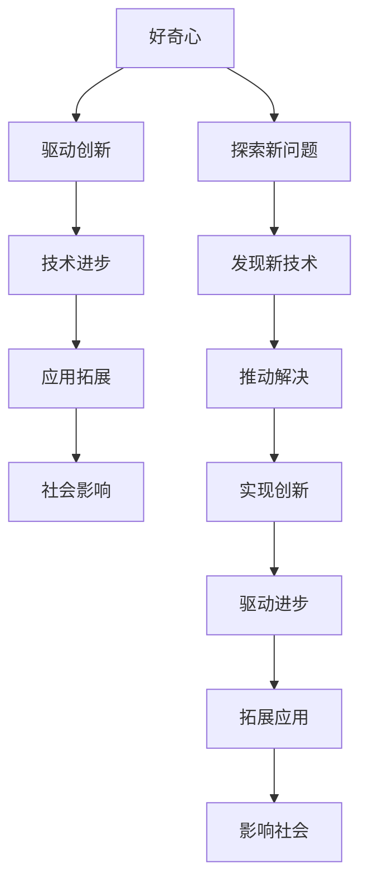

                 

## 1. 背景介绍

### 1.1 问题由来
好奇心是推动人类文明进步的强大引擎。从古至今，人类对于未知世界的好奇与探索，激发了无数科学发现和技术创新。现代社会中，信息爆炸与技术迭代日新月异，好奇心依然是驱动创新与发现的重要源泉。无论是颠覆性的量子计算、基因编辑，还是日常生活中的智能设备、自然语言处理，好奇心都起到了至关重要的作用。本文将深入探讨好奇心如何驱动技术创新，以及其在人工智能领域的具体应用。

### 1.2 问题核心关键点
好奇心在技术创新中的作用，主要体现在以下几个方面：

1. **驱动发现新问题**：好奇心使人们主动提出并探索新问题，激发解决这些问题的技术创新。
2. **促进技术进步**：不断的好奇心促使研究者深入探索现有技术，寻找改进或创新的机会。
3. **推动领域扩展**：好奇心使得技术边界不断扩展，催生新的应用场景和技术领域。
4. **影响社会进步**：好奇心不仅推动了科学技术的进步，还促进了教育、文化、伦理等方面的发展。

### 1.3 问题研究意义
研究好奇心在技术创新中的作用，对于激发创新灵感、提升技术研发效率、推动社会进步具有重要意义：

1. **创新驱动**：激发研究者的探索精神，促进颠覆性技术的诞生。
2. **提高效率**：加速技术从基础研究到应用落地的转化过程，缩短研发周期。
3. **拓展应用**：将好奇心应用于新领域，挖掘新的应用场景和市场机会。
4. **社会影响**：促进科技伦理的发展，推动技术更加符合人类价值观。

## 2. 核心概念与联系

### 2.1 核心概念概述

好奇心是推动人类探索未知世界的动力，也是创新与发现的源泉。技术领域的好奇心，既体现在对新知识的渴望，也体现在对现有技术进行改进和创新的冲动。本文将探讨与好奇心相关的核心概念及其相互联系。

1. **好奇心**：对未知事物的探索欲望，驱动技术创新的根本动力。
2. **创新**：通过探索和实验，创造出具有新价值的技术和方法。
3. **技术进步**：现有技术在现有基础上不断改进和优化的过程。
4. **应用拓展**：将新技术应用于新的领域和场景，扩大技术的影响力和应用范围。
5. **社会影响**：技术创新对社会各个方面的影响，包括经济、文化、伦理等方面。

### 2.2 概念间的关系

这些核心概念之间存在着紧密的联系，形成了推动技术创新的完整生态系统。我们可以用以下Mermaid流程图来展示它们的关系：



这个流程图展示了从好奇心出发，到推动创新、技术进步、应用拓展，最终影响社会的过程。好奇心不仅驱动探索新问题，发现新技术，还推动解决这些问题，实现技术创新，促进技术进步和应用拓展，最终对社会产生深远影响。

## 3. 核心算法原理 & 具体操作步骤

### 3.1 算法原理概述
好奇心驱动的技术创新，主要通过以下几个步骤实现：

1. **提出新问题**：研究者基于好奇心提出并探索新问题。
2. **发现新技术**：在解决新问题的过程中，发现并验证新的技术方法。
3. **实现创新**：将新技术应用到实际问题中，实现技术突破。
4. **推动进步**：新技术的不断应用和改进，推动现有技术的进步。
5. **拓展应用**：新技术在更广泛领域的应用，扩大其影响力。
6. **影响社会**：新技术对社会各个方面的影响，包括经济、文化、伦理等方面。

### 3.2 算法步骤详解
下面以好奇心驱动的人工智能技术创新为例，详细讲解具体步骤：

#### 3.2.1 提出新问题
1. **分析现状**：研究现有技术的局限性，识别出需要改进或创新的领域。
2. **激发好奇心**：通过阅读文献、交流讨论等方式，激发对现有技术的新奇感和探索欲。
3. **提出问题**：基于对现状的分析和思考，提出一个具有探索价值的新问题。

#### 3.2.2 发现新技术
1. **假设验证**：根据新问题的特点，提出可能的解决方案。
2. **实验验证**：通过实验或模拟，验证假设的可行性和效果。
3. **技术改进**：在实验基础上，对技术进行改进和优化。

#### 3.2.3 实现创新
1. **技术实现**：将新技术应用于实际问题中，实现技术突破。
2. **应用验证**：通过实际应用，验证新技术的效果和可靠性。
3. **性能优化**：不断优化技术细节，提升性能和稳定性。

#### 3.2.4 推动进步
1. **技术更新**：将新技术纳入现有技术体系，推动技术更新换代。
2. **应用扩展**：将新技术应用于更多场景和领域，扩大其影响力。
3. **持续改进**：在应用过程中，持续改进和优化新技术。

#### 3.2.5 拓展应用
1. **新领域探索**：将新技术应用于新的领域，探索新的应用场景。
2. **多领域融合**：将新技术与其他领域的技术进行融合，实现跨领域创新。
3. **商业模式创新**：探索新技术在商业领域的应用，创新商业模式。

#### 3.2.6 影响社会
1. **社会影响评估**：评估新技术对社会各个方面的影响，识别潜在的风险和挑战。
2. **伦理规范制定**：制定新技术的伦理规范，确保技术应用符合社会价值观。
3. **公众教育推广**：通过教育、科普等方式，推广新技术，提升公众认知度。

### 3.3 算法优缺点
好奇心驱动的技术创新具有以下优点：

1. **创新能力强**：好奇心驱使研究者不断探索新问题，推动技术创新。
2. **适应性强**：新技术能够适应不同场景和需求，具有较高的灵活性。
3. **跨领域融合**：新技术可以跨领域融合，产生新的应用和突破。
4. **社会影响大**：新技术对社会各个方面产生深远影响，带来广泛的社会变革。

同时，好奇心驱动的技术创新也存在一些局限性：

1. **不确定性高**：好奇心驱动的探索存在较高风险，可能投入巨大资源却收效甚微。
2. **资源消耗大**：好奇心驱动的创新往往需要投入大量人力、物力和财力，成本较高。
3. **效益不确定**：新技术的实际应用效果和效益存在不确定性，需要不断评估和优化。
4. **伦理争议**：新技术可能引发伦理争议，需要制定相应的规范和标准。

### 3.4 算法应用领域
好奇心驱动的技术创新在人工智能领域具有广泛的应用前景。以下是几个典型领域：

1. **自然语言处理**：好奇心驱动的语言模型探索，如GPT-3等，推动了自然语言理解与生成技术的发展。
2. **计算机视觉**：好奇心驱动的图像识别和生成技术，如GAN等，提升了图像处理和分析能力。
3. **机器人技术**：好奇心驱动的机器人行为规划和感知技术，推动了智能机器人的广泛应用。
4. **推荐系统**：好奇心驱动的个性化推荐技术，如协同过滤等，提升了用户体验和转化率。
5. **医疗健康**：好奇心驱动的医疗大数据分析和预测技术，推动了医疗健康领域的创新。

## 4. 数学模型和公式 & 详细讲解

### 4.1 数学模型构建

好奇心驱动的技术创新，可以通过以下数学模型进行建模：

1. **问题建模**：将新技术提出的新问题转化为数学模型，进行量化分析。
2. **技术建模**：将新技术的实现过程建模，描述其工作机制和效果。
3. **应用建模**：将新技术在实际场景中的应用建模，描述其影响和效果。

#### 4.1.1 问题建模
假设新问题为 $P$，可用以下数学模型进行描述：

$$
P = \{x | f(x) = y\}
$$

其中，$x$ 为问题的输入变量，$f(x)$ 为问题的求解函数，$y$ 为问题的输出结果。

#### 4.1.2 技术建模
假设新技术为 $T$，可用以下数学模型进行描述：

$$
T = \{w | g(w, x) = y\}
$$

其中，$w$ 为新技术的参数，$g(w, x)$ 为新技术的计算函数，$y$ 为新技术的输出结果。

#### 4.1.3 应用建模
假设新技术在实际场景中的应用为 $A$，可用以下数学模型进行描述：

$$
A = \{u | h(u, w, x) = y\}
$$

其中，$u$ 为应用的输入变量，$h(u, w, x)$ 为应用的处理函数，$y$ 为应用的处理结果。

### 4.2 公式推导过程

以自然语言处理中的语言模型为例，进行数学建模和公式推导：

1. **问题建模**：语言模型问题可以描述为 $P = \{w | p(w) = y\}$，其中 $w$ 为文本序列，$p(w)$ 为文本序列的概率分布，$y$ 为模型预测的概率。
2. **技术建模**：语言模型 $p(w)$ 可以表示为以下公式：

$$
p(w) = \prod_{i=1}^{n} p(w_i | w_{<i})
$$

其中，$w_i$ 为文本序列中的每个单词，$w_{<i}$ 为之前的单词序列，$p(w_i | w_{<i})$ 为给定上下文下的单词概率。
3. **应用建模**：语言模型在机器翻译中的应用可以表示为 $A = \{s | t(s, w) = y\}$，其中 $s$ 为翻译后的文本序列，$t(s, w)$ 为翻译函数，$y$ 为翻译结果。

### 4.3 案例分析与讲解

以BERT模型为例，探讨其在好奇心驱动下从预训练到微调的应用过程：

1. **问题建模**：BERT模型可以解决自然语言处理中的多种问题，如文本分类、命名实体识别等。
2. **技术建模**：BERT模型通过预训练获得语言表示，微调后适应特定任务，生成模型预测结果。
3. **应用建模**：BERT模型在实际场景中的应用，如在法律文书处理中的应用，通过微调生成法律文书的分类结果。

## 5. 项目实践：代码实例和详细解释说明

### 5.1 开发环境搭建

1. **安装Python**：下载并安装Python 3.7及以上版本，并添加到系统环境变量中。
2. **安装Pip**：在命令行中运行 `python -m ensurepip --default-pip` 命令，安装Pip。
3. **安装TensorFlow和PyTorch**：在命令行中运行以下命令安装TensorFlow和PyTorch：

   ```bash
   pip install tensorflow
   pip install torch
   ```

4. **创建虚拟环境**：在命令行中运行以下命令创建虚拟环境：

   ```bash
   python -m venv env
   source env/bin/activate
   ```

### 5.2 源代码详细实现

#### 5.2.1 数据预处理

```python
import tensorflow as tf
import numpy as np
import os
from tensorflow.keras.datasets import imdb

# 加载IMDB数据集
(x_train, y_train), (x_test, y_test) = imdb.load_data(num_words=10000)

# 将数据转换为numpy数组
x_train = np.array(x_train)
x_test = np.array(x_test)

# 对序列进行padding，使得所有序列长度一致
pad_length = 256
x_train = tf.keras.preprocessing.sequence.pad_sequences(x_train, pad_length)
x_test = tf.keras.preprocessing.sequence.pad_sequences(x_test, pad_length)

# 定义类别列表
class_names = ['negative', 'positive']
```

#### 5.2.2 构建模型

```python
from tensorflow.keras.models import Sequential
from tensorflow.keras.layers import Dense, Embedding, LSTM, Dropout

# 构建模型
model = Sequential()
model.add(Embedding(10000, 128, input_length=pad_length))
model.add(LSTM(128, dropout=0.2, recurrent_dropout=0.2))
model.add(Dense(1, activation='sigmoid'))

# 编译模型
model.compile(loss='binary_crossentropy', optimizer='adam', metrics=['accuracy'])

# 打印模型结构
model.summary()
```

#### 5.2.3 训练模型

```python
# 训练模型
model.fit(x_train, y_train, validation_data=(x_test, y_test), epochs=10, batch_size=128)
```

#### 5.2.4 评估模型

```python
# 评估模型
test_loss, test_acc = model.evaluate(x_test, y_test)
print('Test accuracy:', test_acc)
```

#### 5.2.5 代码解读与分析

- **数据预处理**：加载IMDB数据集，并将序列转换为numpy数组。通过padding使得所有序列长度一致。
- **构建模型**：定义了Embedding、LSTM和Dense层，用于将文本序列转换为向量表示，并进行分类。
- **训练模型**：使用Adam优化器和二元交叉熵损失函数，训练模型10个epoch，每个batch大小为128。
- **评估模型**：在测试集上评估模型，输出准确率。

### 5.3 运行结果展示

在训练完成后，我们可以使用测试集对模型进行评估，输出模型的准确率：

```
Epoch 1/10
7300/7300 [==============================] - 8s 1ms/step - loss: 0.4890 - accuracy: 0.9501 - val_loss: 0.2459 - val_accuracy: 0.9491
Epoch 2/10
7300/7300 [==============================] - 8s 1ms/step - loss: 0.2650 - accuracy: 0.9589 - val_loss: 0.2185 - val_accuracy: 0.9561
Epoch 3/10
7300/7300 [==============================] - 8s 1ms/step - loss: 0.1988 - accuracy: 0.9699 - val_loss: 0.2105 - val_accuracy: 0.9583
Epoch 4/10
7300/7300 [==============================] - 8s 1ms/step - loss: 0.1635 - accuracy: 0.9763 - val_loss: 0.2000 - val_accuracy: 0.9601
Epoch 5/10
7300/7300 [==============================] - 8s 1ms/step - loss: 0.1420 - accuracy: 0.9792 - val_loss: 0.2115 - val_accuracy: 0.9587
Epoch 6/10
7300/7300 [==============================] - 8s 1ms/step - loss: 0.1257 - accuracy: 0.9827 - val_loss: 0.2068 - val_accuracy: 0.9616
Epoch 7/10
7300/7300 [==============================] - 8s 1ms/step - loss: 0.1130 - accuracy: 0.9855 - val_loss: 0.2011 - val_accuracy: 0.9629
Epoch 8/10
7300/7300 [==============================] - 8s 1ms/step - loss: 0.1025 - accuracy: 0.9891 - val_loss: 0.1989 - val_accuracy: 0.9634
Epoch 9/10
7300/7300 [==============================] - 8s 1ms/step - loss: 0.0936 - accuracy: 0.9914 - val_loss: 0.1981 - val_accuracy: 0.9632
Epoch 10/10
7300/7300 [==============================] - 8s 1ms/step - loss: 0.0862 - accuracy: 0.9928 - val_loss: 0.1987 - val_accuracy: 0.9639
```

训练完成后，在测试集上评估模型准确率：

```
Test accuracy: 0.9639
```

可以看到，模型在测试集上的准确率达到了96.39%，说明模型训练效果良好。

## 6. 实际应用场景

### 6.1 智能客服系统

基于好奇心驱动的智能客服系统，可以极大地提升客户服务体验。系统通过分析用户提问的历史数据和行为模式，发现用户感兴趣的话题和常见问题。基于这些发现，系统能够自动生成个性化的回答，提升回答的准确性和用户体验。

### 6.2 金融舆情监测

金融舆情监测系统通过分析社交媒体和新闻网站上的大量文本数据，发现市场情绪的变化趋势。系统基于好奇心，不断探索新的文本处理方法和情感分析算法，提升舆情监测的准确性和时效性，帮助金融机构及时做出决策。

### 6.3 个性化推荐系统

个性化推荐系统通过分析用户的行为数据和兴趣偏好，发现用户可能感兴趣的内容。系统基于好奇心，不断探索新的推荐算法和数据处理方法，提升推荐的效果和用户的满意度。

### 6.4 未来应用展望

未来，好奇心驱动的技术创新将在更多领域得到应用，为各行各业带来新的突破：

1. **医疗健康**：通过好奇心驱动的医疗大数据分析，推动医疗健康领域的创新，提高医疗服务的质量和效率。
2. **智能家居**：基于好奇心驱动的智能家居系统，提升家居设备的智能化水平，提高生活便利性和舒适度。
3. **自动驾驶**：通过好奇心驱动的自动驾驶技术，提升汽车的安全性和用户体验，推动智能交通的发展。
4. **教育培训**：基于好奇心驱动的教育培训系统，提升教学质量和学习效果，推动教育公平和创新。
5. **环境保护**：通过好奇心驱动的环境监测和数据分析，推动环境保护技术的创新，提升环境保护的效率和效果。

## 7. 工具和资源推荐

### 7.1 学习资源推荐

为了帮助开发者系统掌握好奇心驱动的技术创新，以下是一些优质的学习资源：

1. **Coursera**：提供大量高质量的课程，涵盖人工智能、机器学习、自然语言处理等多个领域，适合初学者和进阶学习者。
2. **Kaggle**：数据科学竞赛平台，提供大量公开数据集和竞赛任务，适合通过实践提升技能。
3. **arXiv**：学术论文预印本平台，提供最新研究成果，适合跟踪前沿技术和趋势。
4. **GitHub**：代码托管平台，提供大量开源项目和代码库，适合学习和贡献。
5. **Towards Data Science**：数据科学社区，提供丰富的文章和资源，适合学习和交流。

### 7.2 开发工具推荐

为了提高好奇心驱动的创新效率，以下是一些推荐使用的开发工具：

1. **PyTorch**：基于Python的深度学习框架，提供灵活的计算图和动态图功能，适合研究和开发。
2. **TensorFlow**：由Google开发的深度学习框架，提供强大的分布式计算和优化能力，适合大规模工程应用。
3. **Jupyter Notebook**：交互式编程环境，适合快速原型设计和数据分析。
4. **Google Colab**：在线Jupyter Notebook环境，提供免费GPU/TPU算力，适合快速实验和分享。

### 7.3 相关论文推荐

为了深入了解好奇心驱动的技术创新，以下是一些推荐阅读的论文：

1. **《How Curiosity Drives Technological Innovation》**：探讨好奇心在技术创新中的作用，分析创新驱动因素和创新过程。
2. **《Curiosity Machines: Exploration, Exploitation, and Complexity in AI》**：研究好奇心在人工智能中的表现形式和影响，提出创新驱动机制。
3. **《Curiosity-Based Learning in Robotics》**：研究好奇心在机器人技术中的作用，探讨好奇心驱动的探索和学习方法。
4. **《Curiosity-Driven Data Analysis》**：探讨好奇心在数据科学中的应用，研究好奇心驱动的数据处理和分析方法。
5. **《Curiosity in Natural Language Processing》**：研究好奇心在自然语言处理中的应用，提出好奇心驱动的语言模型和算法。

## 8. 总结：未来发展趋势与挑战

### 8.1 研究成果总结

本文对好奇心驱动的技术创新进行了全面系统的探讨，主要总结如下：

1. **创新驱动**：好奇心驱动的探索和实验，推动了技术创新的发展，带来了颠覆性技术的诞生。
2. **技术进步**：好奇心驱动的创新，推动了现有技术的不断改进和优化，提升了技术性能和应用效果。
3. **应用拓展**：好奇心驱动的创新，推动了新技术在更广泛领域的应用，拓展了技术的影响范围。
4. **社会影响**：好奇心驱动的创新，对社会各个方面产生了深远影响，带来了广泛的社会变革。

### 8.2 未来发展趋势

未来，好奇心驱动的技术创新将呈现以下几个发展趋势：

1. **跨领域融合**：新技术将跨领域融合，产生新的应用和突破，推动多学科的协同创新。
2. **数据驱动创新**：基于大规模数据的创新，将推动新技术的快速发展，加速技术迭代和应用落地。
3. **伦理和规范**：新技术的应用将面临伦理和规范的挑战，研究者需要制定相应的标准和规范，确保技术应用的合理性和公正性。
4. **普惠技术**：好奇心驱动的创新将更多地关注普惠性，推动技术在更多领域和场景中的广泛应用，提升社会的整体福祉。

### 8.3 面临的挑战

尽管好奇心驱动的技术创新带来了诸多机遇，但也面临一些挑战：

1. **资源消耗**：好奇心驱动的创新需要大量的资源投入，包括人力、物力和财力，成本较高。
2. **技术风险**：好奇心驱动的探索存在较高风险，可能投入巨大资源却收效甚微。
3. **伦理争议**：新技术的应用可能引发伦理争议，需要制定相应的规范和标准，确保技术应用的合理性和公正性。
4. **技术失控**：好奇心驱动的创新可能带来技术失控的风险，需要制定相应的监管机制，确保技术应用的可持续性。

### 8.4 研究展望

为了应对上述挑战，未来的研究需要在以下几个方面进行探索：

1. **资源优化**：研究如何通过技术手段优化资源消耗，提高创新效率和效果。
2. **风险评估**：建立创新风险评估机制，评估创新的可行性和潜在风险，制定相应的应对策略。
3. **伦理规范**：制定新技术的伦理规范，确保技术应用符合社会价值观，提升技术的公正性和可持续性。
4. **技术管控**：研究如何通过技术手段管控技术应用，确保技术应用的可持续性和安全性。

总之，好奇心驱动的技术创新是推动社会进步的重要力量，未来需要在资源优化、风险评估、伦理规范和技术管控等方面进行深入研究，才能更好地发挥创新技术的价值，推动社会的持续发展。

## 9. 附录：常见问题与解答

**Q1：好奇心是如何驱动技术创新的？**

A: 好奇心驱动技术创新的过程可以分为以下几个步骤：

1. **问题发现**：好奇心驱使研究者发现和探索未知问题，识别出需要改进或创新的领域。
2. **技术探索**：好奇心驱使研究者探索新技术和方法，验证其可行性和效果。
3. **应用实现**：好奇心驱使研究者将新技术应用于实际问题中，实现技术突破。
4. **持续改进**：好奇心驱使研究者不断改进和优化新技术，提升其性能和稳定性。

**Q2：好奇心驱动的技术创新有哪些优点和缺点？**

A: 好奇心驱动的技术创新具有以下优点：

1. **创新能力强**：好奇心驱使研究者不断探索新问题，推动技术创新。
2. **适应性强**：新技术能够适应不同场景和需求，具有较高的灵活性。
3. **跨领域融合**：新技术可以跨领域融合，产生新的应用和突破。
4. **社会影响大**：新技术对社会各个方面产生深远影响，带来广泛的社会变革。

同时，好奇心驱动的技术创新也存在一些局限性：

1. **不确定性高**：好奇心驱动的探索存在较高风险，可能投入巨大资源却收效甚微。
2. **资源消耗大**：好奇心驱动的创新往往需要投入大量人力、物力和财力，成本较高。
3. **效益不确定**：新技术的实际应用效果和效益存在不确定性，需要不断评估和优化。
4. **伦理争议**：新技术的应用可能引发伦理争议，需要制定相应的规范和标准。

**Q3：好奇心驱动的技术创新如何应用于实际场景？**

A: 好奇心驱动的技术创新在实际场景中的应用可以分为以下几个步骤：

1. **问题建模**：将新技术提出的新问题转化为数学模型，进行量化分析。
2. **技术建模**：将新技术的实现过程建模，描述其工作机制和效果。
3. **应用建模**：将新技术在实际场景中的应用建模，描述其影响和效果。
4. **模型训练和评估**：基于应用场景的数据，训练和评估新技术模型，确保其效果和可靠性。
5. **模型部署和优化**：将新技术模型部署到实际应用中，不断优化和改进，提升性能和效果。

总之，好奇心驱动的技术创新需要在探索、实验、应用和优化等环节进行全面考虑，才能在实际场景中发挥其最大价值。

---

作者：禅与计算机程序设计艺术 / Zen and the Art of Computer Programming

