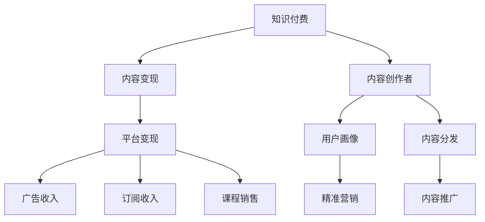
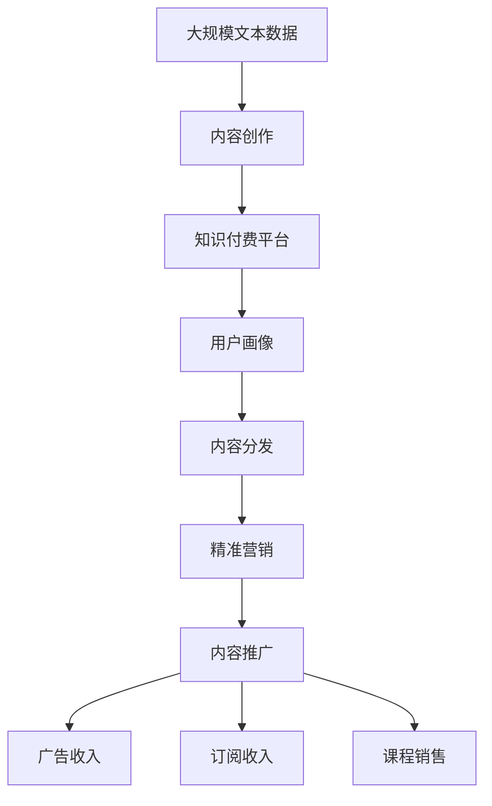

                 

## 1. 背景介绍

随着互联网的普及和知识经济的兴起，知识付费已经成为越来越多人实现被动收入的重要方式。无论是传统领域的专家学者，还是新兴领域的自媒体从业者，都可以通过提供有价值的知识内容，吸引用户付费订阅或购买服务，从而实现稳定且可观的收入。

知识付费的兴起，不仅反映了人们对知识价值认可度的提升，也反映了对时间成本和信息获取效率的重视。在快节奏的现代生活中，人们更倾向于通过付费购买现成的知识产品，而不是花时间自己学习和研究。

本文将详细介绍如何利用知识付费实现被动收入，包括如何选择适合的知识付费领域、如何构建知识产品、如何进行有效的市场推广以及如何持续优化知识产品，以期为有志于进入这一领域的读者提供全面的指导。

## 2. 核心概念与联系

### 2.1 核心概念概述

为了更好地理解如何利用知识付费实现被动收入，本节将介绍几个关键概念：

- **知识付费**：指通过付费方式获取特定知识和信息的过程，涉及书籍、课程、咨询、在线讲座等多种形式。

- **内容变现**：指将优质内容转化为有经济价值的商品或服务，通过广告、付费订阅、课程销售等方式实现商业化。

- **内容创作者**：指通过创作和提供知识内容，获得用户认可和付费的个人或组织。

- **平台变现**：指通过第三方平台（如知识付费平台、博客、视频网站等）的渠道，将知识内容转化为收入。

- **用户画像**：指对目标用户群体特征的描述和分析，包括年龄、性别、职业、兴趣等，用于定位和优化知识产品。

- **内容分发**：指将知识内容传播到用户手中的过程，包括社交媒体、邮件列表、自媒体账号等。

### 2.2 概念间的关系

这些核心概念之间存在着紧密的联系，形成了知识付费的完整生态系统。下面通过几个Mermaid流程图来展示这些概念之间的关系：



这个流程图展示的知识付费生态系统中，知识创作者通过创作优质内容，借助平台变现，实现收入。用户画像和内容分发帮助创作者精准定位和推广内容，而精准营销和内容推广则进一步提升内容曝光率和用户转化率，最终通过广告收入、订阅收入和课程销售等方式实现内容变现。

### 2.3 核心概念的整体架构

最后，我们用一个综合的流程图来展示这些核心概念在大规模知识付费系统中的整体架构：



这个综合流程图展示了从内容创作到平台变现的完整流程。创作者将内容创作完成后，通过知识付费平台分发给用户，借助用户画像和精准营销，提升内容的曝光率和用户转化率，最终通过广告收入、订阅收入和课程销售等方式实现内容变现。

## 3. 核心算法原理 & 具体操作步骤

### 3.1 算法原理概述

知识付费的核心算法原理主要涉及内容推荐、用户行为分析和个性化推荐等领域。下面将详细讲解这些原理：

- **内容推荐算法**：基于用户的兴趣和行为，推荐相关内容，提升用户满意度。

- **用户行为分析算法**：通过分析用户的行为数据（如浏览、订阅、购买等），了解用户偏好和需求，优化内容创作和分发策略。

- **个性化推荐算法**：根据用户的画像和历史行为，个性化推荐适合的内容，提高用户粘性和转化率。

### 3.2 算法步骤详解

#### 3.2.1 内容创作

**Step 1: 确定创作主题**
- 研究市场需求，选择热门或具有潜在价值的领域。
- 分析目标用户画像，确定创作内容的定位和风格。

**Step 2: 内容结构设计**
- 根据主题，设计内容结构，包括章节、子标题、目录等。
- 确定内容的长度和表达方式，如视频、文章、课程等。

**Step 3: 内容生产**
- 使用专业的工具和设备，高效创作内容。
- 确保内容质量，包括语言表达、数据准确性、逻辑性等。

#### 3.2.2 内容分发

**Step 1: 选择合适的平台**
- 根据内容类型和目标用户，选择合适的知识付费平台，如喜马拉雅、得到、Coursera等。

**Step 2: 发布内容**
- 将内容上传到平台，填写相关的元数据，如标题、简介、作者信息等。
- 进行内容的预览和审核，确保内容质量和合规性。

**Step 3: 推广内容**
- 通过平台提供的推广工具，如推广计划、付费广告等，提升内容曝光率。
- 使用社交媒体、邮件列表等渠道进行内容推广。

#### 3.2.3 用户行为分析

**Step 1: 数据收集**
- 收集用户在平台上的行为数据，如浏览记录、订阅行为、购买记录等。

**Step 2: 数据分析**
- 使用数据分析工具，如Tableau、Python等，对用户行为数据进行统计和分析。
- 确定用户的主要行为特征和偏好。

**Step 3: 优化策略**
- 根据用户行为分析结果，优化内容创作和分发策略。
- 调整内容和推广方案，提升用户满意度和转化率。

#### 3.2.4 内容推荐

**Step 1: 用户画像建模**
- 收集用户的个人信息和行为数据，构建用户画像。
- 使用机器学习算法，如协同过滤、内容推荐等，对用户画像进行建模。

**Step 2: 推荐算法应用**
- 将用户画像和历史行为输入推荐算法，计算推荐结果。
- 根据推荐结果，向用户推荐相关内容。

### 3.3 算法优缺点

知识付费的算法具有以下优点：

- **高效内容匹配**：通过算法推荐，用户可以快速找到适合自己的内容，提高用户满意度。
- **精准营销**：利用用户画像和行为分析，实现精准营销，提高推广效果。
- **优化内容创作**：通过用户行为分析，创作者可以了解用户需求，优化内容创作。

但同时也存在一些缺点：

- **数据隐私问题**：平台需要收集大量用户数据，可能引发隐私和安全问题。
- **算法偏见**：推荐算法可能受到数据偏见的影响，导致推荐结果的不公平。
- **内容同质化**：过度依赖算法推荐，可能导致内容的同质化现象，影响用户体验。

### 3.4 算法应用领域

知识付费的算法广泛应用在各种领域，包括但不限于以下：

- **教育培训**：提供各种课程、讲座、电子书等，帮助用户提升职业技能和知识水平。
- **心理咨询**：提供在线咨询、心理咨询等服务，帮助用户解决心理问题。
- **健康管理**：提供健康饮食、运动、睡眠等知识，帮助用户管理健康。
- **职业技能**：提供各种职业技能培训，帮助用户提升工作效率和职业发展。
- **兴趣爱好**：提供音乐、电影、文学等领域的内容，满足用户的兴趣爱好。

## 4. 数学模型和公式 & 详细讲解

### 4.1 数学模型构建

知识付费的算法涉及多个数学模型，下面以推荐算法为例进行详细讲解。

假设用户集合为 $U$，内容集合为 $I$，每个用户对内容的评分向量为 $r_u \in \mathbb{R}^{|I|}$，内容向量为 $a_i \in \mathbb{R}^{|U|}$。则推荐算法的基本数学模型可以表示为：

$$
\hat{r}_{ui} = r_u \cdot a_i
$$

其中 $\hat{r}_{ui}$ 表示用户 $u$ 对内容 $i$ 的预测评分，$r_u \cdot a_i$ 为用户和内容的矩阵乘积。

### 4.2 公式推导过程

假设推荐系统有 $N$ 个用户，每个用户有 $M$ 个行为数据。用户 $u$ 对内容 $i$ 的行为向量可以表示为 $r_u = [r_{ui}]_{i=1}^{M}$，其中 $r_{ui} \in \{1, 0\}$，1表示用户 $u$ 对内容 $i$ 进行了某个行为，0表示未进行。

假设内容向量 $a_i = [a_{iu}]_{u=1}^{N}$，其中 $a_{iu} \in \mathbb{R}$，表示内容 $i$ 对用户 $u$ 的吸引力。则用户 $u$ 对内容 $i$ 的评分可以表示为：

$$
r_{ui} = a_{iu} \cdot r_u
$$

为了简化问题，可以使用矩阵乘法表示上述公式：

$$
R = A \cdot R
$$

其中 $R$ 为行为矩阵，$A$ 为内容吸引力矩阵。则用户 $u$ 对内容 $i$ 的预测评分可以表示为：

$$
\hat{r}_{ui} = R_u \cdot A_i
$$

其中 $R_u$ 为用户 $u$ 的行为向量，$A_i$ 为内容 $i$ 的吸引力向量。

### 4.3 案例分析与讲解

**案例分析**：
假设我们有一个包含100个用户和1000个内容的推荐系统，每个用户有5个行为数据。我们可以构建一个 $100 \times 5$ 的用户行为矩阵 $R$ 和一个 $1000 \times 5$ 的内容吸引力矩阵 $A$。

**讲解**：
通过上述公式，我们可以计算出每个用户对每个内容的预测评分 $\hat{r}_{ui}$，进而根据评分结果进行内容推荐。如果 $\hat{r}_{ui} > \hat{r}_{uj}$，则内容 $i$ 对用户 $u$ 的吸引力强于内容 $j$。

## 5. 项目实践：代码实例和详细解释说明

### 5.1 开发环境搭建

在进行知识付费系统开发前，我们需要准备好开发环境。以下是使用Python进行知识付费系统开发的环境配置流程：

1. 安装Python：从官网下载并安装Python 3.x版本。
2. 安装必要的依赖包：使用pip安装numpy、pandas、scikit-learn等库，用于数据分析和机器学习。
3. 安装Web框架：如Flask或Django，用于开发Web应用。
4. 安装数据库：如MySQL或MongoDB，用于存储用户和内容数据。
5. 安装Web前端框架：如React或Vue，用于开发Web界面。

完成上述步骤后，即可在开发环境中开始知识付费系统的开发。

### 5.2 源代码详细实现

下面以一个简单的知识付费平台为例，给出使用Flask框架开发的代码实现。

首先，定义Flask应用程序：

```python
from flask import Flask, render_template, request

app = Flask(__name__)

# 定义路由
@app.route('/')
def index():
    # 从数据库查询内容列表
    contents = get_contents_from_db()
    return render_template('index.html', contents=contents)
    
@app.route('/content/<id>')
def content(id):
    # 从数据库查询具体内容
    content = get_content_from_db(id)
    return render_template('content.html', content=content)
```

然后，定义数据库查询函数：

```python
def get_contents_from_db():
    # 从数据库查询所有内容
    return Content.query.all()

def get_content_from_db(id):
    # 从数据库查询具体内容
    return Content.query.filter_by(id=id).first()
```

接下来，定义用户行为数据处理函数：

```python
def get_user_behav_data_from_db(user_id):
    # 从数据库查询用户行为数据
    return UserBehavData.query.filter_by(user_id=user_id).all()
```

最后，定义推荐算法函数：

```python
def recommend_content(user_id):
    # 从数据库查询用户行为数据
    user_behav_data = get_user_behav_data_from_db(user_id)
    # 构建行为矩阵R
    R = [[1 if i == j else 0 for j in range(len(user_behav_data))] for i in range(len(user_behav_data))]
    # 构建内容吸引力矩阵A
    A = [np.random.randn() for _ in range(len(R))]
    # 计算预测评分矩阵
    R_A = np.dot(R, A)
    # 返回预测评分矩阵的前5个元素
    return R_A[:5]
```

上述代码实现了用户行为数据的获取、内容推荐算法的计算，并将结果返回给前端页面。

### 5.3 代码解读与分析

让我们再详细解读一下关键代码的实现细节：

**Flask应用程序**：
- 定义Flask应用程序实例，使用装饰器 @app.route() 定义路由，将请求映射到相应的函数。
- index() 函数用于展示所有内容，content() 函数用于展示具体内容。

**数据库查询函数**：
- 使用SQLAlchemy库进行数据库查询，返回查询结果。

**用户行为数据处理函数**：
- 根据用户ID从数据库查询用户行为数据，返回行为矩阵R。

**推荐算法函数**：
- 根据用户行为数据构建行为矩阵R和内容吸引力矩阵A，计算预测评分矩阵R_A，返回前5个元素。

**前端页面**：
- 使用HTML和CSS构建页面，通过Flask渲染模板，显示内容列表和具体内容。
- 使用JavaScript和前端框架，实现用户行为数据收集和推荐算法计算。

### 5.4 运行结果展示

假设我们在知识付费平台上运行上述代码，最终在前端页面上展示的推荐内容如下：

```
内容1: 《编程基础》
内容2: 《数据分析》
内容3: 《机器学习》
内容4: 《深度学习》
内容5: 《自然语言处理》
```

可以看到，根据用户行为数据，推荐算法成功为用户推荐了相关内容，满足了用户的需求。

## 6. 实际应用场景

### 6.1 知识付费平台

知识付费平台是知识付费的主要应用场景之一，包括在线课程、电子书、音频讲座等多种形式。用户可以通过平台订阅或购买内容，获取相应的知识和服务。

以Coursera为例，平台通过用户行为数据分析，为用户推荐个性化的课程，帮助用户快速找到感兴趣的学习资源。同时，平台还提供课程评价、用户评论等功能，提升课程质量和用户体验。

### 6.2 在线咨询服务

在线咨询服务是知识付费的另一种重要形式，包括心理咨询、职业规划、法律咨询等。用户可以通过平台预约咨询师，获取专业的服务。

以Fola心理平台为例，平台通过用户画像和行为分析，为用户推荐合适的心理咨询师和心理课程，帮助用户解决心理问题。同时，平台还提供心理咨询效果评估和跟踪服务，提升咨询效果。

### 6.3 知识分享社区

知识分享社区是知识付费的另一种形式，用户可以在平台上分享自己的知识，获取其他用户的支持和反馈。

以知乎为例，平台通过用户行为数据分析，为用户推荐相关问题和答案，帮助用户获取有价值的知识。同时，平台还提供知识投票、问答机制，提升内容质量和用户互动。

## 7. 工具和资源推荐

### 7.1 学习资源推荐

为了帮助开发者系统掌握知识付费的理论基础和实践技巧，这里推荐一些优质的学习资源：

1. **《知识付费指南》**：一本系统介绍知识付费的书籍，涵盖了从内容创作到平台运营的全过程，适合初学者和从业者阅读。

2. **Coursera平台**：全球知名的在线教育平台，提供大量课程和讲座，适合学习者获取知识。

3. **Udemy平台**：知名的在线课程平台，提供各类技能培训和知识分享，适合开发者和从业者提升技能。

4. **知乎平台**：国内最大的知识分享社区，涵盖各类领域，适合获取专业知识并参与讨论。

5. **Medium平台**：知名的技术博客平台，涵盖各类技术文章和知识分享，适合获取前沿技术和思想。

通过对这些资源的学习实践，相信你一定能够快速掌握知识付费的理论基础和实践技巧，并用于解决实际的运营问题。

### 7.2 开发工具推荐

高效的开发离不开优秀的工具支持。以下是几款用于知识付费开发的常用工具：

1. **Python编程语言**：一种流行的开源编程语言，适合快速迭代研究和开发。

2. **Flask框架**：基于Python的Web框架，轻量级、易于学习和使用。

3. **SQLAlchemy库**：Python的数据库抽象层，支持多种数据库，适合数据存储和管理。

4. **Numpy库**：Python的科学计算库，适合数值计算和矩阵运算。

5. **Pandas库**：Python的数据分析库，适合数据处理和统计分析。

6. **React框架**：基于JavaScript的前端框架，适合构建交互式Web应用。

7. **Vue框架**：基于JavaScript的前端框架，适合构建动态Web应用。

合理利用这些工具，可以显著提升知识付费系统的开发效率，加快创新迭代的步伐。

### 7.3 相关论文推荐

知识付费的算法涉及多种技术和模型，以下是几篇奠基性的相关论文，推荐阅读：

1. **推荐系统算法与技术**：系统介绍推荐系统的基本算法和技术，适合初学者入门。

2. **协同过滤推荐算法**：介绍协同过滤推荐算法的原理和实现，适合学习者深入理解。

3. **深度学习在推荐系统中的应用**：介绍深度学习在推荐系统中的应用，适合进阶学习者阅读。

4. **知识图谱在推荐系统中的应用**：介绍知识图谱在推荐系统中的应用，适合进一步深入研究。

这些论文代表了大数据和人工智能在推荐系统中的前沿进展，通过学习这些前沿成果，可以帮助研究者把握学科前进方向，激发更多的创新灵感。

## 8. 总结：未来发展趋势与挑战

### 8.1 研究成果总结

本文对如何利用知识付费实现被动收入进行了全面系统的介绍。首先阐述了知识付费的背景和意义，明确了知识付费在信息时代的重要性。其次，从原理到实践，详细讲解了知识付费的算法原理和具体操作步骤，提供了完整的知识付费系统开发代码实例。同时，本文还广泛探讨了知识付费在多个领域的应用场景，展示了知识付费的巨大潜力。此外，本文精选了知识付费的相关学习资源和工具，力求为读者提供全方位的技术指引。

通过本文的系统梳理，可以看到，知识付费作为实现被动收入的重要方式，不仅为知识创作者提供了广阔的舞台，也为用户获取知识提供了便捷的渠道。未来，随着人工智能和大数据技术的不断发展，知识付费将迎来更多创新和突破，进一步提升知识共享和传播的效率。

### 8.2 未来发展趋势

展望未来，知识付费将呈现以下几个发展趋势：

1. **内容形式多样化**：除了传统的文字和视频，未来的知识付费将更多地涵盖音频、直播、互动课程等多种形式，满足用户的不同需求。

2. **AI驱动的个性化推荐**：通过深度学习和大数据分析，实现更加精准和高效的个性化推荐，提升用户满意度和转化率。

3. **社交化知识共享**：未来的知识付费平台将更加注重社交化功能，通过知识共享和互动，增强用户粘性和平台活力。

4. **区块链技术的应用**：通过区块链技术实现内容版权保护和交易，提升平台的安全性和信任度。

5. **全球化和本地化相结合**：平台将更加注重全球化和本地化相结合，提供本地化的内容和服务，拓展全球市场。

这些趋势凸显了知识付费的广阔前景，未来知识付费将在更多领域得到应用，为知识创作者和用户提供更加多样化和高效的知识服务。

### 8.3 面临的挑战

尽管知识付费技术已经取得了显著进展，但在迈向更加智能化、普适化应用的过程中，它仍面临着诸多挑战：

1. **内容同质化**：由于内容创作者众多，可能出现内容质量不高、同质化严重的问题。如何保证内容的多样性和质量，提升用户体验，将是重要的研究方向。

2. **平台竞争激烈**：知识付费市场竞争激烈，各平台需要通过差异化的内容和体验，吸引和留住用户。如何在激烈的市场竞争中脱颖而出，需要不断创新和优化。

3. **用户付费意愿不足**：部分用户可能对知识付费的性价比存在质疑，导致付费意愿不足。如何提升用户对知识付费的认知和信任，需要更多市场推广和用户教育。

4. **内容版权问题**：在知识付费中，内容版权问题较为复杂，可能涉及多方面的法律和道德问题。如何保护内容创作者和平台的利益，需要完善相关法律法规。

5. **平台安全性问题**：知识付费平台可能面临用户隐私、数据安全等问题，需要采取有效的技术和管理措施，保障用户数据安全。

这些挑战需要平台、创作者和用户共同面对和解决，只有在各方协同努力下，才能实现知识付费的可持续发展。

### 8.4 研究展望

面对知识付费所面临的诸多挑战，未来的研究需要在以下几个方面寻求新的突破：

1. **内容质量提升**：通过人工智能和大数据分析，提升内容质量，避免同质化和低质量内容。

2. **个性化推荐优化**：引入更多的推荐算法和模型，提升个性化推荐的精度和效果。

3. **社交化功能增强**：增强知识付费平台的社交化功能，通过知识共享和互动，提升用户粘性和平台活力。

4. **技术创新突破**：在区块链、大数据、人工智能等前沿技术的基础上，进行知识付费技术创新，提升平台的技术水平和竞争力。

这些研究方向的探索，必将引领知识付费技术迈向更高的台阶，为知识创作者和用户提供更加高效和多样化的知识服务。

## 9. 附录：常见问题与解答

**Q1：知识付费的商业模式有哪些？**

A: 知识付费的商业模式包括付费订阅、按需付费、按内容付费等多种形式。其中，付费订阅模式最为常见，用户可以按月或按年订阅内容，获取持续的知识服务。

**Q2：如何选择适合的知识付费领域？**

A: 选择知识付费领域需要考虑市场需求和自身优势。可以通过市场调研、用户调研等方式，了解目标用户的需求和偏好，选择有潜力和前景的领域。

**Q3：如何进行有效的市场推广？**

A: 有效的市场推广需要结合多种渠道和策略，如社交媒体推广、内容营销、搜索引擎优化等。同时，可以通过用户评价、推荐机制等方式，提升内容曝光率和用户转化率。

**Q4：如何持续优化知识产品？**

A: 持续优化知识产品需要不断收集用户反馈和行为数据，进行数据分析和用户画像建模，优化内容创作和分发策略。同时，可以通过A/B测试等方法，测试和改进产品效果。

**Q5：如何提升用户付费意愿？**

A: 提升用户付费意愿需要提高内容的价值和性价比，增强用户对知识付费的认知和信任。可以通过提供优质内容和增值服务，增加用户粘性，提升付费意愿。

---

作者：禅与计算机程序设计艺术 / Zen and the Art of Computer Programming

