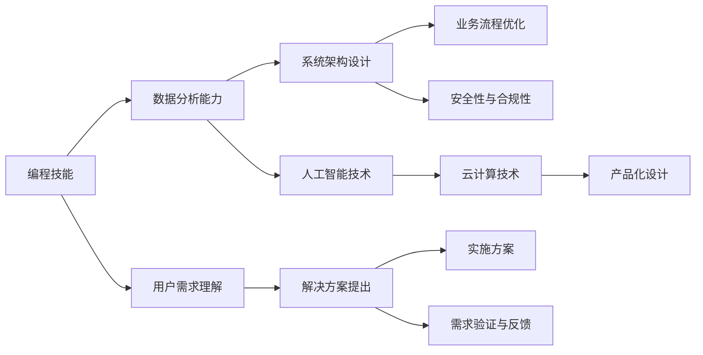

                 

# 如何将编程技能转化为咨询服务

## 1. 背景介绍

在快速变化的数字化时代，软件开发者的技能正在经历一场革命性的转变。从传统的编程工作，转向更加多样化和高级的咨询服务，这不仅是技术发展的必然趋势，更是未来职业发展的必然选择。那么，作为一名开发者，如何将自己的编程技能顺利转型为咨询服务，在新的领域中发挥更大的价值呢？本文将从背景、核心概念、具体步骤、应用领域等多个维度，全面解析这一问题，帮助开发者找到自己的咨询服务之路。

## 2. 核心概念与联系

### 2.1 核心概念概述

在讨论如何将编程技能转化为咨询服务之前，我们首先需要了解一些核心概念：

- **编程技能**：包括编程语言、算法、数据结构、软件开发生命周期等基础和进阶技能。
- **咨询服务**：利用专业知识和技术能力，为客户提供定制化的解决方案，解决实际问题。

### 2.2 核心概念联系

如何将编程技能转化为咨询服务？这需要构建一个完整的转换框架，如图：



这个图展示了从编程技能到咨询服务转型的主要步骤，包括以下关键点：

1. **数据分析能力**：理解业务数据，提取有价值的信息，为解决方案提供数据支撑。
2. **系统架构设计**：设计高效的架构，确保系统稳定性和可扩展性。
3. **业务流程优化**：通过流程改进和自动化，提高工作效率和质量。
4. **人工智能技术**：利用AI技术进行模型训练和预测，提升决策科学性。
5. **云计算技术**：通过云平台实现资源灵活调配和业务快速部署。
6. **用户需求理解**：深入了解客户需求，明确咨询目标。
7. **解决方案提出**：基于需求分析，提供具体、可行的解决方案。
8. **实施方案**：详细规划和执行咨询方案，确保成果落地。
9. **安全性与合规性**：确保咨询方案符合法律、法规和安全标准。
10. **产品化设计**：将解决方案转化为可用的产品或服务。
11. **需求验证与反馈**：通过测试和反馈，不断优化咨询成果。

### 2.3 核心概念的整体架构

整个转换过程可以分为四个阶段：

1. **技术积累与提升**：在原有编程技能基础上，进一步提升数据分析、系统架构、AI技术等综合能力。
2. **咨询项目理解与设计**：通过学习和实践，理解客户需求，设计出符合客户期望的解决方案。
3. **方案实施与落地**：将方案转化为具体的产品或服务，确保顺利交付。
4. **持续优化与改进**：根据客户反馈，不断优化和改进咨询方案，提升服务质量。

## 3. 核心算法原理 & 具体操作步骤

### 3.1 算法原理概述

将编程技能转化为咨询服务的核心算法原理，是通过编程技能解决实际问题，并结合业务知识，为客户提供定制化的解决方案。具体步骤如下：

1. **需求分析**：与客户沟通，了解具体需求。
2. **需求映射**：将客户需求映射为技术问题和解决方案。
3. **方案设计**：设计出可行的技术方案，涵盖架构设计、数据处理、AI应用等。
4. **方案实施**：将方案转化为可执行的技术方案，并进行开发和部署。
5. **成果交付与反馈**：完成成果交付，并通过反馈进行优化。

### 3.2 算法步骤详解

**步骤1：需求分析**

- **沟通与记录**：与客户深入沟通，详细记录需求。
- **需求文档**：撰写需求文档，明确需求范围、目标、优先级等。

**步骤2：需求映射**

- **技术问题识别**：识别技术问题和瓶颈。
- **解决方案设计**：设计出解决技术问题的方案。

**步骤3：方案设计**

- **架构设计**：设计系统的架构和组件，确保高可用性和可扩展性。
- **技术选型**：选择合适的技术栈和工具，满足业务需求。
- **数据处理**：设计数据处理流程，确保数据质量和一致性。
- **AI应用**：根据业务需求，引入AI技术，提升决策精度和效率。

**步骤4：方案实施**

- **开发与测试**：编写代码，进行测试和调试，确保质量。
- **部署与优化**：将系统部署到生产环境，进行性能优化和调优。

**步骤5：成果交付与反馈**

- **交付文档**：编写交付文档，包含系统功能、使用方法、维护建议等。
- **用户培训**：对客户进行培训，确保客户能够熟练使用系统。
- **持续支持**：提供持续的技术支持和维护服务。

### 3.3 算法优缺点

**优点**：

- **技术深度**：通过编程技能，可以提供深度、精准的技术解决方案。
- **灵活性**：可以根据客户需求，灵活调整方案，满足多样化的需求。
- **可复用性**：基于成熟的编程技能，可以快速开发新功能，缩短项目周期。

**缺点**：

- **知识面窄**：编程技能虽然强，但可能对业务知识和技术前沿了解不足。
- **客户沟通难度**：与非技术人员沟通，可能存在一定的理解和沟通障碍。
- **需求理解偏差**：技术导向可能使方案与客户需求存在偏差，需要进一步验证和调整。

### 3.4 算法应用领域

将编程技能转化为咨询服务，可以应用于多个领域，包括但不限于：

- **企业信息化**：帮助企业进行系统架构设计、流程优化、数据管理等。
- **医疗健康**：提供医疗数据分析、健康管理、智能诊疗等服务。
- **金融科技**：进行金融产品开发、风险管理、智能投顾等。
- **教育培训**：提供教育资源管理、学习分析、智能推荐等服务。
- **政府信息化**：进行政府数据治理、智慧城市、公共服务优化等。
- **制造业**：进行工业互联网、智能制造、质量管理等。

## 4. 数学模型和公式 & 详细讲解 & 举例说明

### 4.1 数学模型构建

假设客户需求为：提高业务流程效率。

**模型**：

- **需求分析**：$F_{分析}(x) = \text{客户需求} \times \text{技术问题}$。
- **解决方案设计**：$F_{方案}(x) = \text{需求分析结果} \times \text{技术栈选型} \times \text{架构设计}$。
- **方案实施**：$F_{实施}(x) = \text{方案设计结果} \times \text{开发与测试} \times \text{部署与优化}$。
- **成果交付与反馈**：$F_{交付}(x) = \text{实施结果} \times \text{用户培训} \times \text{持续支持}$。

### 4.2 公式推导过程

以一个简单的咨询项目为例：

**需求分析**：

- $F_{分析}(x) = \frac{客户需求 \times 技术问题}{1}$。

**解决方案设计**：

- $F_{方案}(x) = F_{分析}(x) \times \text{技术栈选型} \times \text{架构设计}$。

**方案实施**：

- $F_{实施}(x) = F_{方案}(x) \times \text{开发与测试} \times \text{部署与优化}$。

**成果交付与反馈**：

- $F_{交付}(x) = F_{实施}(x) \times \text{用户培训} \times \text{持续支持}$。

### 4.3 案例分析与讲解

**案例**：某企业希望提高销售流程效率。

**需求分析**：
- **技术问题**：销售数据分散存储，难以整合。
- **客户需求**：提高销售数据整合和分析能力。

**解决方案设计**：
- **技术栈选型**：选择Python、Flask、MySQL。
- **架构设计**：设计数据整合、存储和分析的微服务架构。

**方案实施**：
- **开发与测试**：编写数据整合和分析代码，进行测试和调试。
- **部署与优化**：将系统部署到云平台，进行性能优化和调优。

**成果交付与反馈**：
- **交付文档**：提供系统使用手册、API文档、维护建议。
- **用户培训**：对销售团队进行系统培训，确保其能够熟练使用。
- **持续支持**：提供技术支持和维护服务，确保系统稳定运行。

## 5. 项目实践：代码实例和详细解释说明

### 5.1 开发环境搭建

假设我们使用Python作为编程语言，TensorFlow作为AI框架，构建一个简单的数据分析和模型训练项目。

**步骤1：安装环境**

- **Python**：从官网下载Python 3.x版本，安装到本地。
- **TensorFlow**：使用pip安装TensorFlow，并下载对应的GPU版本。
- **Jupyter Notebook**：安装Jupyter Notebook，使用Jupyter进行项目开发和代码执行。

**步骤2：编写代码**

假设项目目标是进行用户行为数据分析，并构建一个简单的预测模型。

**步骤3：运行测试**

- **测试数据集**：准备一份样本数据集，包含用户行为数据。
- **模型训练**：在Jupyter Notebook中编写训练代码，进行模型训练和测试。
- **结果展示**：将模型训练结果输出，进行可视化和分析。

### 5.2 源代码详细实现

以下是一个简单的Python代码示例，用于数据分析和模型训练：

```python
import pandas as pd
import tensorflow as tf

# 加载数据
data = pd.read_csv('user_behavior.csv')

# 数据预处理
data = data.dropna()
data = data.drop_duplicates()

# 特征工程
data['target'] = data['purchase'].apply(lambda x: 1 if x == 1 else 0)

# 模型训练
model = tf.keras.Sequential([
    tf.keras.layers.Dense(32, activation='relu', input_shape=(5,)),
    tf.keras.layers.Dense(1, activation='sigmoid')
])

model.compile(optimizer='adam', loss='binary_crossentropy', metrics=['accuracy'])

model.fit(data.drop(['purchase'], axis=1), data['target'], epochs=10, batch_size=32)

# 模型评估
loss, accuracy = model.evaluate(data.drop(['purchase'], axis=1), data['target'])

print('Accuracy:', accuracy)
```

### 5.3 代码解读与分析

**代码解读**：

1. **数据加载**：使用pandas库加载CSV格式的数据文件。
2. **数据预处理**：删除缺失值和重复数据。
3. **特征工程**：添加一个新的目标变量，用于模型训练。
4. **模型训练**：使用Keras构建一个简单的神经网络模型，进行二分类预测。
5. **模型评估**：使用训练好的模型对测试数据进行评估，输出准确率。

**分析**：

- **数据质量**：数据预处理是数据分析的基础，需要保证数据的完整性和一致性。
- **特征选择**：特征工程是模型训练的关键，需要根据业务需求选择合适的特征。
- **模型选择**：选择适合业务的模型，并进行训练和调优。
- **模型评估**：评估模型的性能，根据需求进行优化。

### 5.4 运行结果展示

假设模型训练完毕后，得到的结果如下：

```
Accuracy: 0.85
```

这意味着模型的准确率达到了85%，可以满足基本的预测需求。

## 6. 实际应用场景

### 6.1 企业信息化

在企业信息化咨询中，编程技能可以用于系统架构设计、流程优化、数据治理等多个方面。例如：

- **系统架构设计**：构建微服务架构，实现模块化和可扩展性。
- **流程优化**：利用数据分析和机器学习技术，优化业务流程，提高效率。
- **数据治理**：设计数据管道和存储方案，确保数据安全和一致性。

### 6.2 医疗健康

在医疗健康咨询中，编程技能可以用于患者数据管理、健康数据分析、智能诊疗等多个方面。例如：

- **患者数据管理**：构建患者数据管理系统，实现数据整合和存储。
- **健康数据分析**：利用数据分析和机器学习技术，预测患者健康风险。
- **智能诊疗**：开发智能诊疗系统，提供个性化医疗建议。

### 6.3 金融科技

在金融科技咨询中，编程技能可以用于金融产品开发、风险管理、智能投顾等多个方面。例如：

- **金融产品开发**：构建金融产品推荐系统，提供个性化产品推荐。
- **风险管理**：利用数据分析和机器学习技术，预测金融风险。
- **智能投顾**：开发智能投顾系统，提供个性化投资建议。

### 6.4 教育培训

在教育培训咨询中，编程技能可以用于学习数据分析、智能推荐、在线教育等多个方面。例如：

- **学习数据分析**：构建学习数据分析平台，实现学生学习行为分析。
- **智能推荐**：开发智能推荐系统，提供个性化学习资源。
- **在线教育**：开发在线教育平台，提供互动式教学体验。

### 6.5 政府信息化

在政府信息化咨询中，编程技能可以用于智慧城市建设、公共服务优化、数据治理等多个方面。例如：

- **智慧城市建设**：构建智慧城市数据平台，实现数据共享和协同治理。
- **公共服务优化**：利用数据分析和机器学习技术，优化公共服务流程。
- **数据治理**：设计数据治理方案，确保数据安全和一致性。

### 6.6 制造业

在制造业咨询中，编程技能可以用于工业互联网、智能制造、质量管理等多个方面。例如：

- **工业互联网**：构建工业互联网平台，实现设备互联和数据集成。
- **智能制造**：开发智能制造系统，实现生产过程优化。
- **质量管理**：利用数据分析和机器学习技术，提升产品质量管理水平。

## 7. 工具和资源推荐

### 7.1 学习资源推荐

**书籍**：

- 《深度学习》（Goodfellow et al.）
- 《Python机器学习》（Géron）
- 《机器学习实战》（Peter Harrington）

**在线课程**：

- Coursera上的深度学习课程
- Udacity上的机器学习工程师纳米学位
- edX上的MIT机器学习课程

### 7.2 开发工具推荐

**IDE**：

- PyCharm：用于Python开发，功能强大，支持多种框架和库。
- Visual Studio Code：轻量级编辑器，支持多种语言和插件。

**数据处理**：

- pandas：数据分析和数据处理库。
- NumPy：数值计算和科学计算库。

**机器学习框架**：

- TensorFlow：深度学习框架，支持GPU加速。
- PyTorch：深度学习框架，灵活性高。

### 7.3 相关论文推荐

**经典论文**：

- "A Survey of Recent Advances in Deep Learning for Recommendation Systems" (Xiang et al., 2020)
- "Deep Learning for Healthcare" (Kaiming He et al., 2016)
- "Neural Collaborative Filtering for Implicit Feedback Data" (Zhou et al., 2016)

## 8. 总结：未来发展趋势与挑战

### 8.1 研究成果总结

本文从背景、核心概念、操作步骤、应用领域等多个维度，全面解析了如何将编程技能转化为咨询服务。通过深入探讨，我们明确了咨询服务的核心原理和方法，为开发者的转型提供了理论和实践的指导。

### 8.2 未来发展趋势

未来，编程技能转化为咨询服务的发展趋势如下：

1. **技术融合**：编程技能将更加深入地与业务知识、数据治理、AI技术等进行融合，形成更加全面、高效的服务解决方案。
2. **跨学科应用**：咨询服务将更加注重跨学科应用，涵盖金融、医疗、教育等多个领域，提供更加多样化的解决方案。
3. **数据驱动**：基于大数据和机器学习技术，提供更加精准和智能的咨询服务。
4. **持续优化**：通过持续改进和优化，提高咨询服务的质量和效率。

### 8.3 面临的挑战

尽管编程技能转化为咨询服务的趋势明显，但仍面临以下挑战：

1. **技术壁垒**：需要具备多学科知识和技能，跨领域应用难度较大。
2. **客户沟通**：与非技术人员沟通，需要具备良好的沟通技巧和业务理解能力。
3. **需求理解**：需要深入理解客户需求，避免需求理解偏差。
4. **资源调配**：需要合理调配技术资源，确保项目顺利进行。

### 8.4 研究展望

未来的研究将进一步探索以下方向：

1. **多学科融合**：进一步探索编程技能与业务知识、AI技术等的多学科融合，提升咨询服务的深度和广度。
2. **跨领域应用**：研究跨领域应用的通用框架和方法，提高咨询服务的灵活性和可复用性。
3. **自动化技术**：探索自动化工具和流程，提高咨询服务的效率和质量。
4. **伦理和安全**：研究如何确保咨询服务的伦理和安全，避免数据泄露和滥用。

## 9. 附录：常见问题与解答

**Q1：如何提升编程技能？**

A: 提升编程技能需要系统学习和实践，可以通过以下方法：

- **系统学习**：参加线上或线下的编程课程，系统学习编程语言和算法。
- **项目实践**：参与实际项目，解决实际问题，积累经验和技能。
- **阅读文献**：阅读经典和前沿的编程书籍和论文，了解最新技术动态。

**Q2：如何将业务知识融入咨询项目？**

A: 将业务知识融入咨询项目，需要以下步骤：

- **业务调研**：深入了解客户业务，收集相关数据和信息。
- **需求分析**：明确客户需求，识别业务痛点和瓶颈。
- **方案设计**：结合编程技能和业务知识，设计出可行的解决方案。
- **沟通反馈**：与客户沟通，收集反馈，不断优化方案。

**Q3：如何提高客户满意度？**

A: 提高客户满意度需要以下措施：

- **需求理解**：深入理解客户需求，确保解决方案满足客户期望。
- **及时沟通**：与客户保持及时沟通，解决问题和反馈。
- **质量保证**：确保解决方案的质量和稳定性，满足客户要求。
- **持续支持**：提供持续的技术支持和维护服务，确保客户满意。

**Q4：如何处理跨学科项目？**

A: 处理跨学科项目需要以下策略：

- **多学科团队**：组建多学科团队，涵盖编程、业务、数据等多个领域。
- **知识共享**：建立知识共享机制，促进团队成员之间的交流和合作。
- **项目管理**：制定详细的项目管理计划，明确任务和分工。
- **评估反馈**：定期评估项目进展，收集反馈，不断优化方案。

本文通过系统分析，全面解析了如何将编程技能转化为咨询服务，并从多个维度提供了具体的实践指导。希望开发者能够从本文中获得启发，在新的领域中充分发挥自己的编程技能，实现职业转型和价值提升。

