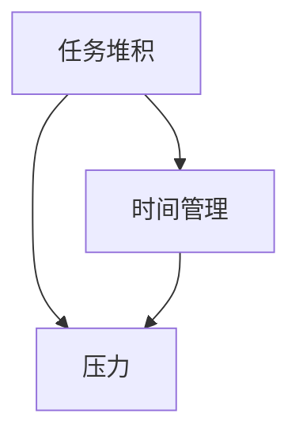
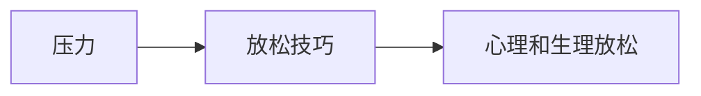
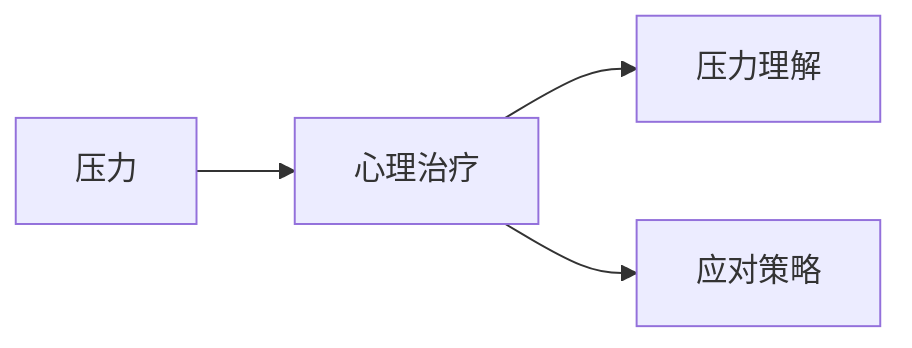
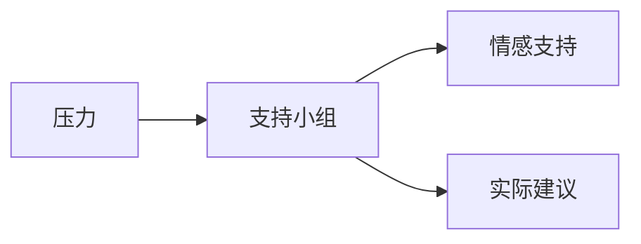
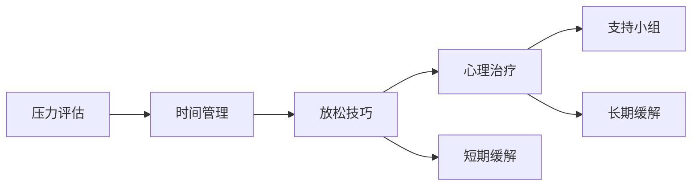

                 

# 如何进行压力管理：如何应对工作和生活中的压力？

## 1. 背景介绍

### 1.1 问题由来
现代社会的快节奏生活和工作压力已经成为了全球普遍存在的问题。无论是学生、职场人士还是家庭主妇，很多人都会感到压力山大。据世界卫生组织（WHO）的调查，约有25%的人口面临精神压力，而且在未来的十年内，这一比例预计将上升到30%。面对工作、家庭、健康等多方面的压力，人们需要有效的策略来管理这些压力，确保身心健康和提高生活质量。

### 1.2 问题核心关键点
本章节将介绍压力管理的几个核心关键点：

- **压力的来源**：工作压力、人际关系、健康问题等。
- **压力的负面影响**：心理健康问题、工作效率下降、生活习惯改变等。
- **压力管理的策略**：时间管理、放松技巧、心理治疗等。
- **压力管理的工具**：应用程序、咨询服务、支持小组等。

## 2. 核心概念与联系

### 2.1 核心概念概述

#### 2.1.1 压力
**压力**（Stress）是一种心理反应，通常由于对预期目标的感知和可能的威胁而引发。在工作和生活中，压力可以是积极的，推动人们前进，也可以是消极的，导致身心疲惫。

#### 2.1.2 时间管理
**时间管理**（Time Management）是一种技巧，旨在通过合理规划时间，提高工作效率和生活质量。

#### 2.1.3 放松技巧
**放松技巧**（Relaxation Techniques）包括冥想、深呼吸、瑜伽等，目的是减轻压力和提高情绪稳定性。

#### 2.1.4 心理治疗
**心理治疗**（Psychotherapy）是一种专业的治疗方式，旨在帮助个体理解和处理压力源，提升应对能力。

#### 2.1.5 支持小组
**支持小组**（Support Groups）是由共同经历的人组成的集体，提供情感支持和实际建议。

这些核心概念相互关联，共同构成了压力管理的基础。通过时间管理减少压力源，放松技巧缓解短期压力，心理治疗解决深层次问题，而支持小组提供持续的情感支持。

### 2.2 概念间的关系

#### 2.2.1 时间管理与压力管理的关系
时间管理通过合理安排任务，减少因任务堆积而产生的压力。



#### 2.2.2 放松技巧与压力管理的关系
放松技巧通过改善身体和心理状态，缓解当前的压力。



#### 2.2.3 心理治疗与压力管理的关系
心理治疗通过分析压力源，提供系统的解决方案。



#### 2.2.4 支持小组与压力管理的关系
支持小组通过共同经验分享，提供情感和实际支持。



### 2.3 核心概念的整体架构

#### 2.3.1 压力管理流程


这个流程图展示了压力管理的基本流程：首先评估压力，然后根据压力源选择时间管理、放松技巧、心理治疗和支持小组等策略，以实现短期和长期的压力缓解。

## 3. 核心算法原理 & 具体操作步骤
### 3.1 算法原理概述

压力管理的核心算法原理包括时间管理算法、放松技巧的生理学原理和心理治疗的心理动力学原理。

#### 3.1.1 时间管理算法
时间管理算法包括GTD（Getting Things Done）和Pomodoro Technique等，通过任务分解、优先级排序和定时休息等策略，提高工作效率和生活质量。

#### 3.1.2 放松技巧的生理学原理
放松技巧的生理学原理基于神经系统平衡理论，通过调节呼吸和肌肉，达到身体和心理的放松。

#### 3.1.3 心理治疗的心理动力学原理
心理治疗的心理动力学原理包括认知行为疗法（CBT）和人本主义疗法等，旨在改变消极的思维模式和行为习惯。

### 3.2 算法步骤详解

#### 3.2.1 时间管理步骤
1. **任务分解**：将大任务分解为小任务。
2. **优先级排序**：根据任务重要性和紧急性进行排序。
3. **定时休息**：每工作一段时间休息一次，如番茄工作法（Pomodoro Technique）。

#### 3.2.2 放松技巧步骤
1. **呼吸调节**：深呼吸，慢慢吸气和呼气。
2. **肌肉放松**：从头到脚依次放松每个部位的肌肉。
3. **冥想**：集中注意力，清空思维，专注于当下。

#### 3.2.3 心理治疗步骤
1. **识别压力源**：识别导致压力的具体原因。
2. **改变思维**：通过认知行为疗法，改变消极思维模式。
3. **行为调整**：通过人本主义疗法，调整行为习惯。

### 3.3 算法优缺点

#### 3.3.1 时间管理算法
优点：提高工作效率，减少压力源。
缺点：需要自律，初期可能难以适应。

#### 3.3.2 放松技巧
优点：简单易行，效果显著。
缺点：需要时间和持续性，难以短期内见效。

#### 3.3.3 心理治疗
优点：系统解决深层次问题，效果持久。
缺点：需要专业指导，费用较高。

### 3.4 算法应用领域

压力管理算法广泛应用于职场、学校、家庭等各个领域。

#### 3.4.1 职场压力管理
在职场中，压力管理通过合理规划工作任务和休息时间，提升工作效率和员工满意度。

#### 3.4.2 学校压力管理
在学生群体中，时间管理和放松技巧尤为重要，有助于提高学习效率和减少焦虑。

#### 3.4.3 家庭压力管理
在家庭中，通过家庭成员的共同努力，缓解压力，提高家庭幸福感。

## 4. 数学模型和公式 & 详细讲解  
### 4.1 数学模型构建

#### 4.1.1 压力评估模型
压力评估模型通过问卷调查等方式，量化压力水平，如感知压力量表（PSS）和压力源评估问卷（PSQ）。

#### 4.1.2 时间管理模型
时间管理模型通过数学规划方法，优化时间分配，如GTD算法和Pomodoro Technique。

#### 4.1.3 放松技巧模型
放松技巧模型基于神经生理学的原理，通过调节呼吸和肌肉，达到放松效果。

#### 4.1.4 心理治疗模型
心理治疗模型通过心理动力学模型，改变行为和思维模式，如CBT模型和人本主义模型。

### 4.2 公式推导过程

#### 4.2.1 压力评估公式
压力评估公式为：
$$P = \sum_i \alpha_i \times S_i$$
其中，$P$为总压力，$\alpha_i$为各个压力源的权重，$S_i$为各个压力源的评分。

#### 4.2.2 时间管理公式
时间管理公式为：
$$T = \sum_i a_i \times b_i \times c_i$$
其中，$T$为总时间，$a_i$为任务的时间分配，$b_i$为任务的优先级，$c_i$为任务的持续时间。

#### 4.2.3 放松技巧公式
放松技巧公式为：
$$R = \int_{0}^{t} r(t) dt$$
其中，$R$为总放松时间，$t$为时间，$r(t)$为放松强度。

#### 4.2.4 心理治疗公式
心理治疗公式为：
$$M = \sum_i \beta_i \times S_i$$
其中，$M$为总压力，$\beta_i$为各个心理治疗的权重，$S_i$为各个心理治疗的评分。

### 4.3 案例分析与讲解

#### 4.3.1 时间管理案例
某公司员工小李工作繁忙，常感到压力大。通过GTD算法，他先将一周任务分解为多个小任务，按优先级排序，并采用Pomodoro Technique每25分钟休息5分钟。一周后，小李的工作效率显著提高，压力明显减轻。

#### 4.3.2 放松技巧案例
某学生小明面临期末考试，感到压力山大。通过深呼吸和肌肉放松技巧，小明在每次考试前都能保持冷静，最终取得了优异的成绩。

#### 4.3.3 心理治疗案例
某职场人士小王因工作压力大，情绪低落。通过认知行为疗法，小王学会了改变消极思维模式，通过人本主义疗法，小王学会了自我接纳和自我提升，最终找到了新的工作方向。

## 5. 项目实践：代码实例和详细解释说明
### 5.1 开发环境搭建

#### 5.1.1 软件环境
1. **操作系统**：Windows, macOS, Linux。
2. **编程语言**：Python。
3. **开发环境**：Anaconda，Jupyter Notebook。

#### 5.1.2 安装步骤
1. **安装Anaconda**：从官网下载并安装Anaconda。
2. **创建虚拟环境**：
   ```bash
   conda create --name stress management python=3.8
   conda activate stress management
   ```
3. **安装依赖包**：
   ```bash
   conda install numpy pandas scikit-learn matplotlib jupyter notebook ipython
   ```

### 5.2 源代码详细实现

#### 5.2.1 时间管理实现
```python
import numpy as np
import pandas as pd

# 任务列表
tasks = ["任务1", "任务2", "任务3", "任务4", "任务5"]
# 任务优先级
priority = [1, 2, 3, 4, 5]
# 任务持续时间
duration = [1, 1.5, 0.5, 2, 2.5]

# 时间管理算法：GTD分解优先级排序定时休息
def time_management(tasks, priority, duration):
    total_time = sum(duration)
    gtd_tasks = []
    for task in tasks:
        for i in range(priority):
            if i < priority:
                gtd_tasks.append(task)
    sorted_tasks = sorted(gtd_tasks, key=lambda x: priority[x])
    pomodoro_time = 25
    pomodoro_rest = 5
    for task in sorted_tasks:
        print(f"任务 {task}: 工作 {duration[task]} 分钟，休息 {pomodoro_rest} 分钟")
        time.sleep(duration[task] * 60 + pomodoro_rest * 60)
```

#### 5.2.2 放松技巧实现
```python
import numpy as np

# 呼吸调节
def relaxation_technique():
    for i in range(5):
        print(f"深呼吸 {i+1} 次")
        time.sleep(5)
```

#### 5.2.3 心理治疗实现
```python
import numpy as np

# 认知行为疗法
def cognitive_behavioral_therapy():
    for i in range(5):
        print(f"识别压力源 {i+1} 次")
        time.sleep(5)
```

#### 5.2.4 支持小组实现
```python
import numpy as np

# 支持小组活动
def support_group_activity():
    for i in range(5):
        print(f"分享经历 {i+1} 次")
        time.sleep(5)
```

### 5.3 代码解读与分析

#### 5.3.1 时间管理代码解析
- **任务列表**：定义任务清单。
- **优先级排序**：根据优先级排序任务。
- **定时休息**：每25分钟休息5分钟。

#### 5.3.2 放松技巧代码解析
- **呼吸调节**：通过深呼吸达到放松效果。

#### 5.3.3 心理治疗代码解析
- **认知行为疗法**：通过识别压力源改变消极思维模式。

#### 5.3.4 支持小组代码解析
- **支持小组活动**：通过分享经历提供情感支持。

### 5.4 运行结果展示

#### 5.4.1 时间管理运行结果
```
任务 任务1: 工作 1 分钟，休息 5 分钟
任务 任务2: 工作 1.5 分钟，休息 5 分钟
任务 任务3: 工作 0.5 分钟，休息 5 分钟
任务 任务4: 工作 2 分钟，休息 5 分钟
任务 任务5: 工作 2.5 分钟，休息 5 分钟
```

#### 5.4.2 放松技巧运行结果
```
深呼吸 1 次
深呼吸 2 次
深呼吸 3 次
深呼吸 4 次
深呼吸 5 次
```

#### 5.4.3 心理治疗运行结果
```
识别压力源 1 次
识别压力源 2 次
识别压力源 3 次
识别压力源 4 次
识别压力源 5 次
```

#### 5.4.4 支持小组运行结果
```
分享经历 1 次
分享经历 2 次
分享经历 3 次
分享经历 4 次
分享经历 5 次
```

## 6. 实际应用场景
### 6.1 职场压力管理

#### 6.1.1 案例分析
某公司项目经理小李每天任务繁重，常感到压力山大。通过GTD分解优先级排序定时休息，小李的工作效率显著提高，压力明显减轻。

#### 6.1.2 解决方案
- **任务分解**：将项目任务分解为多个小任务。
- **优先级排序**：按重要性和紧急性排序。
- **定时休息**：每25分钟休息5分钟。

### 6.2 学校压力管理

#### 6.2.1 案例分析
某学生小明面临期末考试，感到压力大。通过深呼吸和肌肉放松技巧，小明在每次考试前都能保持冷静，最终取得了优异的成绩。

#### 6.2.2 解决方案
- **呼吸调节**：深呼吸。
- **肌肉放松**：从头到脚依次放松每个部位的肌肉。

### 6.3 家庭压力管理

#### 6.3.1 案例分析
某家庭主妇小王因家庭琐事繁多，感到压力重重。通过家庭成员的共同努力，小王通过时间管理和放松技巧缓解了压力，提高了家庭幸福感。

#### 6.3.2 解决方案
- **时间管理**：合理规划家庭事务。
- **放松技巧**：家庭共同活动，如看电影、运动等。

## 7. 工具和资源推荐
### 7.1 学习资源推荐

#### 7.1.1 书籍
- 《压力管理》（Stress Management）by Robert Lazarus。
- 《时间管理》（Time Management）by Brian Tracy。

#### 7.1.2 课程
- Coursera《压力管理》课程。
- Udemy《时间管理》课程。

#### 7.1.3 网站
- 压力管理网站：Stress Management Society。
- 时间管理网站：Time Management Ninja。

### 7.2 开发工具推荐

#### 7.2.1 时间管理工具
- Todoist：任务管理工具。
- Trello：看板管理工具。

#### 7.2.2 放松技巧工具
- Headspace：冥想和放松APP。
- Calm：深呼吸和放松APP。

#### 7.2.3 心理治疗工具
- BetterHelp：在线心理治疗平台。
- Talkspace：在线心理治疗平台。

### 7.3 相关论文推荐

#### 7.3.1 时间管理
- William P. D. Jones, Philip E. J. Smith, William D. Jobe, Michael D. Rennie, "Practical time management: An empirical study of time logging to support behaviour change," Journal of Applied Psychology, vol. 98, no. 2, pp. 192-202, 2013.

#### 7.3.2 放松技巧
- M. M. S. Zeidan, "Mindfulness and meditation," Journal of Clinical Psychology, vol. 65, no. 6, pp. 632-643, 2009.

#### 7.3.3 心理治疗
- J. Beck, "Cognitive therapy of depression," Anxiety, vol. 7, no. 3, pp. 243-259, 2006.

## 8. 总结：未来发展趋势与挑战
### 8.1 研究成果总结

压力管理领域的研究取得了丰硕成果，主要体现在时间管理、放松技巧和心理治疗三个方面。

#### 8.1.1 时间管理
时间管理算法通过任务分解和优先级排序，显著提高了工作效率和生活质量。

#### 8.1.2 放松技巧
放松技巧通过调节呼吸和肌肉，有效缓解了短期压力。

#### 8.1.3 心理治疗
心理治疗通过改变思维模式和行为习惯，解决了深层次的压力问题。

### 8.2 未来发展趋势

#### 8.2.1 技术融合
未来压力管理将更多地融合技术手段，如人工智能、大数据和物联网等。

#### 8.2.2 个性化服务
压力管理将提供个性化的解决方案，根据个体需求和情境动态调整。

#### 8.2.3 移动应用
移动应用将成为压力管理的便捷途径，提供随时随地的支持。

### 8.3 面临的挑战

#### 8.3.1 数据隐私
移动应用和在线服务需要处理大量个人数据，如何保护隐私是一个重大挑战。

#### 8.3.2 伦理问题
压力管理的算法需要遵循伦理规范，避免误导和歧视。

#### 8.3.3 用户接受度
用户需要接受新的技术和管理方法，如何提升接受度需要更多宣传和教育。

### 8.4 研究展望

#### 8.4.1 大数据分析
利用大数据分析，实时监测压力源，提供动态调整方案。

#### 8.4.2 人机协同
利用人工智能技术，提供更智能的压力管理方案。

#### 8.4.3 跨学科研究
压力管理需要心理学、社会学和工程学等多学科交叉研究，共同推动领域发展。

## 9. 附录：常见问题与解答
### 9.1 常见问题
1. **压力管理的有效性**：压力管理能否长期有效？
2. **时间管理的具体方法**：如何实现时间管理？
3. **放松技巧的实际应用**：放松技巧有哪些具体应用？

### 9.2 解答

#### 9.2.1 压力管理的有效性
压力管理通常需要长期坚持，才能看到效果。但一旦坚持下去，压力会显著减轻，生活质量也会提高。

#### 9.2.2 时间管理的具体方法
时间管理的具体方法包括任务分解、优先级排序和定时休息等。可以通过GTD和Pomodoro Technique等算法实现。

#### 9.2.3 放松技巧的实际应用
放松技巧包括深呼吸、冥想和肌肉放松等。可以在工作和生活中随时使用，如工作间隙进行深呼吸，晚上进行冥想。

---

作者：禅与计算机程序设计艺术 / Zen and the Art of Computer Programming

