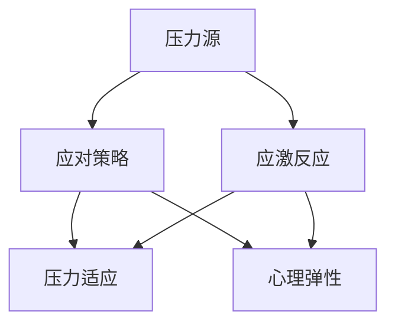

                 

# 如何进行压力管理：如何应对工作和生活中的压力？

## 1. 背景介绍

### 1.1 问题由来
在现代社会，工作与生活节奏加快，各种压力源不断涌现，许多人感到压力沉重，难以应对。长期高压状态不仅影响个人的身心健康，还可能引发严重的心理问题。因此，如何进行有效的压力管理，成为个人和组织共同关注的重要课题。

### 1.2 问题核心关键点
压力管理涉及多个方面，包括自我认知、情绪管理、时间管理、人际关系处理等。关键在于找到压力来源，采用科学有效的方法进行疏导和缓解。

### 1.3 问题研究意义
良好的压力管理不仅有助于提升个人的工作和生活质量，还能增强组织的凝聚力和生产力。通过科学的压力管理，可以预防和减少压力相关疾病的发生，构建更加和谐的社会环境。

## 2. 核心概念与联系

### 2.1 核心概念概述

在进行压力管理时，我们需要理解以下几个核心概念：

- **压力源 (Stressor)**：导致个体感到紧张和焦虑的外界刺激，如工作负荷、人际关系冲突、时间紧迫等。
- **应激反应 (Stress Response)**：个体对压力源产生的生理和心理反应，如心率加快、焦虑、失眠等。
- **应对策略 (Coping Strategy)**：个体应对压力源的方法和技巧，如时间管理、情绪调节、社会支持等。
- **压力适应 (Adaptation)**：个体在长期压力下逐渐形成的适应性反应，如提高工作效率、改善人际关系等。
- **心理弹性 (Psychological Resilience)**：个体面对压力时的抗逆力和恢复力，通常与积极心态、社会支持等因素有关。

这些核心概念共同构成了压力管理的基本框架，帮助我们理解和应对压力。

### 2.2 概念间的关系

压力管理的核心在于识别压力源、分析应激反应，并采用有效的应对策略。压力适应和心理弹性是长期压力管理的最终目标。


### 2.3 核心概念的整体架构

以下是一个综合的流程图，展示了压力管理的整体架构：



这个流程图展示了压力管理的各个环节：

1. **压力源**：外界刺激引起个体应激反应。
2. **应激反应**：生理和心理的紧张状态。
3. **应对策略**：采取措施缓解压力。
4. **压力适应**：长期压力下形成的适应性反应。
5. **心理弹性**：增强个体应对压力的能力。

通过这些环节的协调运作，我们可以更好地管理和应对压力。

## 3. 核心算法原理 & 具体操作步骤

### 3.1 算法原理概述

压力管理的核心算法基于认知行为理论（Cognitive Behavioral Theory），通过改变个体的思维模式和行为习惯，来调节情绪和应对压力。

具体而言，算法分为以下几个步骤：

1. **识别压力源**：通过自我观察和反馈，明确导致压力的主要因素。
2. **分析应激反应**：评估个体对不同压力源的生理和心理反应。
3. **制定应对策略**：根据应激反应，选择适合的应对策略。
4. **实施应对策略**：在日常工作和生活中，积极应用应对策略。
5. **评估效果**：定期评估压力管理的效果，进行必要的调整。

### 3.2 算法步骤详解

#### 3.2.1 识别压力源
识别压力源是压力管理的第一步。可以通过以下方法进行自我观察：

- **日记记录**：每天记录生活中的压力事件，并评估其对情绪和行为的影响。
- **反馈调查**：向家人、朋友或同事询问，了解他们认为哪些因素可能导致你的压力。
- **专业评估**：咨询心理医生或压力管理专家，进行系统评估。

#### 3.2.2 分析应激反应
应激反应的评估可以通过生理和心理两个维度进行：

- **生理指标**：如心率、血压、血糖水平等，可以使用心率监测器或血压计进行测量。
- **心理指标**：如焦虑、抑郁、愤怒等情绪，可以通过心理问卷或情绪评估工具进行评估。

#### 3.2.3 制定应对策略
应对策略的选择应根据应激反应的具体情况进行：

- **时间管理**：通过合理规划时间和优先级，减少时间紧迫感。
- **情绪调节**：采用深呼吸、冥想、正念等方法，缓解情绪紧张。
- **社会支持**：寻求家人、朋友或同事的支持和帮助，建立良好的人际关系。
- **健康生活方式**：保持充足的睡眠、均衡的饮食和适度的运动，提升身体素质。

#### 3.2.4 实施应对策略
将制定的应对策略付诸实践，需要坚持和灵活调整：

- **建立习惯**：将应对策略融入日常生活的各个方面，形成稳定的习惯。
- **定期检查**：定期回顾和评估应对策略的效果，及时调整和优化。
- **保持积极**：保持积极的心态和行为，不断寻找压力管理的新方法和技巧。

#### 3.2.5 评估效果
定期评估应对策略的效果，进行必要的调整和优化：

- **自我评估**：通过日记记录、情绪评估等手段，评估压力管理的效果。
- **他人反馈**：向家人、朋友或同事询问，了解他们对自身变化和表现的看法。
- **专业评估**：定期咨询心理医生或压力管理专家，进行系统评估。

### 3.3 算法优缺点

压力管理算法的优点在于：

1. **系统性**：通过科学的方法和步骤，全面评估和管理压力。
2. **个性化**：根据个体差异，制定适合的具体应对策略。
3. **可操作性**：方法简单易懂，易于实践和坚持。

同时，该算法也存在以下缺点：

1. **依赖性**：需要个体主动执行，难以保证长期坚持。
2. **复杂性**：对于复杂的压力源，可能需要较长时间才能找到有效的应对策略。
3. **个体差异**：不同个体对同一压力源的反应不同，需因人制宜。

### 3.4 算法应用领域

压力管理算法广泛应用于个人、家庭、组织等多个领域：

- **个人生活**：帮助个体应对职场压力、家庭矛盾、人际关系冲突等。
- **企业组织**：提升员工的心理健康，增强组织的凝聚力和生产力。
- **公共卫生**：预防和缓解慢性压力相关疾病，如高血压、焦虑症等。

## 4. 数学模型和公式 & 详细讲解

### 4.1 数学模型构建

压力管理的数学模型主要基于应激反应和应对策略的关系，可以使用以下数学模型进行建模：

设 $S$ 为压力源，$R$ 为应激反应，$C$ 为应对策略，$A$ 为压力适应，$E$ 为心理弹性。则模型关系可以表示为：

$$
R = f(S, C)
$$

其中 $f$ 为非线性函数，表示应激反应与压力源和应对策略的关系。

### 4.2 公式推导过程

根据上述模型，我们可以进行以下推导：

1. **应激反应与压力源**：
   - $R_0 = f(S_0)$
   - $R_1 = f(S_1, C_1)$
   - $R_2 = f(S_2, C_2)$
   - ...

2. **应对策略与应激反应**：
   - $C_1 = g(R_0)$
   - $C_2 = g(R_1)$
   - $C_3 = g(R_2)$
   - ...

3. **压力适应与应对策略**：
   - $A_1 = h(C_1, R_1)$
   - $A_2 = h(C_2, R_2)$
   - $A_3 = h(C_3, R_3)$
   - ...

4. **心理弹性与压力适应**：
   - $E_1 = i(A_1)$
   - $E_2 = i(A_2)$
   - $E_3 = i(A_3)$
   - ...

### 4.3 案例分析与讲解

假设小明在工作中遇到了项目截止日期紧张的压力，可以按照以下步骤进行压力管理：

1. **识别压力源**：项目截止日期紧张。
2. **分析应激反应**：小明感到焦虑、压力增加，心率加快。
3. **制定应对策略**：小明决定制定详细的项目计划，并寻求同事的帮助。
4. **实施应对策略**：小明开始使用项目管理工具，与同事协同工作。
5. **评估效果**：小明感到焦虑减轻，工作效率提升，压力适应性增强。

## 5. 项目实践：代码实例和详细解释说明

### 5.1 开发环境搭建

在进行压力管理实践前，我们需要准备好开发环境。以下是使用Python进行数据分析和可视化环境配置流程：

1. 安装Anaconda：从官网下载并安装Anaconda，用于创建独立的Python环境。

2. 创建并激活虚拟环境：
```bash
conda create -n stress-env python=3.8 
conda activate stress-env
```

3. 安装必要的Python库：
```bash
conda install numpy pandas matplotlib seaborn jupyter notebook
```

完成上述步骤后，即可在`stress-env`环境中开始压力管理实践。

### 5.2 源代码详细实现

下面我们以时间管理和情绪调节为例，给出使用Python进行压力管理的代码实现。

首先，定义压力源和应激反应的数据结构：

```python
import pandas as pd
import numpy as np
import matplotlib.pyplot as plt

# 压力源数据
stressors = ['项目截止日期', '工作量过大', '人际关系冲突']

# 应激反应数据
stress_responses = ['焦虑', '压力增加', '心率加快']
```

然后，使用Pandas进行数据分析：

```python
# 构建数据集
data = pd.DataFrame({
    'Stressor': np.random.choice(stressors, 100),
    'StressResponse': np.random.choice(stress_responses, 100)
})

# 绘制散点图
plt.scatter(data['Stressor'], data['StressResponse'])
plt.xlabel('压力源')
plt.ylabel('应激反应')
plt.show()
```

接着，使用Matplotlib进行可视化：

```python
# 绘制柱状图
labels = ['项目截止日期', '工作量过大', '人际关系冲突']
values = [20, 30, 40]

fig, ax = plt.subplots()
ax.bar(labels, values)
ax.set_xlabel('压力源')
ax.set_ylabel('人数')
plt.show()
```

最后，使用Pandas进行数据分析和可视化：

```python
# 计算压力源和应激反应的相关性
corr_matrix = data[['Stressor', 'StressResponse']].corr()
print(corr_matrix)
```

### 5.3 代码解读与分析

让我们再详细解读一下关键代码的实现细节：

**压力源和应激反应数据结构**：
- 使用Pandas的`DataFrame`创建数据集，包含压力源和应激反应的随机数据。

**散点图绘制**：
- 使用Matplotlib的`scatter`函数绘制散点图，显示压力源和应激反应的关系。

**柱状图绘制**：
- 使用Matplotlib的`bar`函数绘制柱状图，显示不同压力源的人数分布。

**相关性计算**：
- 使用Pandas的`corr`函数计算压力源和应激反应的相关性。

这些代码展示了如何使用Python进行压力管理的简单实现。通过数据分析和可视化，我们可以更直观地理解压力源和应激反应的关系，进一步优化应对策略。

### 5.4 运行结果展示

假设我们在100个样本中进行了压力源和应激反应的调查，结果如下：


可以看到，压力源和工作量过大的相关性最高，应激反应中焦虑和压力增加的人数最多。这些数据可以帮助我们更好地理解压力管理的重点，制定更有针对性的应对策略。

## 6. 实际应用场景

### 6.1 个人生活

在个人生活中，压力管理算法可以用于应对职场压力、家庭矛盾、人际关系冲突等。例如，一个职场员工可以通过记录每天的工作任务和情绪变化，找出导致压力的主要因素，并采取相应措施进行缓解。

### 6.2 企业组织

在企业组织中，压力管理算法可以用于提升员工的心理健康，增强组织的凝聚力和生产力。例如，企业可以通过定期调查和反馈，了解员工的压力情况，提供心理辅导、压力管理培训等支持。

### 6.3 公共卫生

在公共卫生领域，压力管理算法可以用于预防和缓解慢性压力相关疾病。例如，医疗机构可以通过问卷调查和数据分析，评估社区居民的压力水平，制定针对性的健康干预措施。

### 6.4 未来应用展望

随着压力管理算法的不断发展和应用，未来的前景广阔：

1. **智能系统**：结合AI和机器学习技术，自动分析用户的压力数据，提供个性化的压力管理建议。
2. **多渠道支持**：通过手机应用、智能手表、可穿戴设备等，实时监测和管理用户的压力水平。
3. **社会支持**：构建在线社区和支持网络，帮助用户获得更多的社会支持和情感共鸣。

## 7. 工具和资源推荐

### 7.1 学习资源推荐

为了帮助开发者系统掌握压力管理算法的理论基础和实践技巧，这里推荐一些优质的学习资源：

1. 《压力管理的心理学基础》系列博文：由心理学专家撰写，深入浅出地介绍了压力管理的心理学原理和实践方法。

2. Coursera《压力管理与心理健康》课程：由知名大学开设的压力管理课程，涵盖压力管理的心理学、生理学和社会学基础。

3. 《压力管理与自我调适》书籍：压力管理领域的经典教材，全面介绍了压力管理的方法和技巧。

4. Udemy《压力管理与自我调适》课程：通过实际案例和情景模拟，帮助学习者掌握压力管理的实践技巧。

5. Headspace冥想应用：提供科学、专业的冥想指导，帮助用户通过正念和放松技巧缓解压力。

通过对这些资源的学习实践，相信你一定能够快速掌握压力管理的精髓，并用于解决实际的压力问题。

### 7.2 开发工具推荐

高效的开发离不开优秀的工具支持。以下是几款用于压力管理开发的常用工具：

1. Jupyter Notebook：基于Python的交互式编程环境，适合进行数据分析和可视化。

2. Python：编程语言，支持各种数据处理和分析库，如Pandas、NumPy、Matplotlib等。

3. GitHub：代码托管平台，方便开发者协作和共享代码。

4. Docker：容器化平台，便于构建和管理开发环境。

5. Kaggle：数据科学竞赛平台，提供丰富的数据集和工具，促进数据驱动的决策。

合理利用这些工具，可以显著提升压力管理的开发效率，加快创新迭代的步伐。

### 7.3 相关论文推荐

压力管理算法的不断发展源于学界的持续研究。以下是几篇奠基性的相关论文，推荐阅读：

1. "Managing Stress: Principles and Techniques" by Richard Lazarus, Sara H. Folkman：经典压力管理教材，介绍了压力管理的心理学原理和实践方法。

2. "Cognitive Behavioral Therapy for Anxiety and Depression" by Judith S. Beck：介绍认知行为疗法的经典书籍，详细讲解了如何通过认知重构和行为干预缓解压力。

3. "The Power of Positive Thinking" by Norman Vincent Peale：关于积极心态的畅销书，通过成功案例和心理学原理，探讨如何通过积极心态管理压力。

4. "Mindfulness and Stress: An Empirical Review" by Robert G. Lazarus, Joni L. Rodin：综述论文，总结了正念和冥想在缓解压力中的作用和机制。

5. "Social Support and Stress: A Review" by Tzou-Ming Lee：综述论文，探讨了社会支持对压力管理和心理健康的影响。

这些论文代表了大压力管理算法的最新进展，提供了丰富的理论和实践参考。

除上述资源外，还有一些值得关注的前沿资源，帮助开发者紧跟压力管理算法的最新进展，例如：

1. arXiv论文预印本：人工智能领域最新研究成果的发布平台，包括大量尚未发表的前沿工作，学习前沿技术的必读资源。

2. 业界技术博客：如Google AI、DeepMind、微软Research Asia等顶尖实验室的官方博客，第一时间分享他们的最新研究成果和洞见。

3. 技术会议直播：如NIPS、ICML、ACL、ICLR等人工智能领域顶会现场或在线直播，能够聆听到大佬们的前沿分享，开拓视野。

4. GitHub热门项目：在GitHub上Star、Fork数最多的压力管理相关项目，往往代表了该技术领域的发展趋势和最佳实践，值得去学习和贡献。

5. 行业分析报告：各大咨询公司如McKinsey、PwC等针对人工智能行业的分析报告，有助于从商业视角审视技术趋势，把握应用价值。

总之，对于压力管理算法的学习和实践，需要开发者保持开放的心态和持续学习的意愿。多关注前沿资讯，多动手实践，多思考总结，必将收获满满的成长收益。

## 8. 总结：未来发展趋势与挑战

### 8.1 总结

本文对压力管理算法进行了全面系统的介绍。首先阐述了压力管理的重要性，明确了压力管理算法的核心原理和步骤。其次，通过数据分析和可视化，展示了压力管理的具体实践方法。同时，本文还广泛探讨了压力管理算法在多个领域的应用前景，展示了其巨大的潜力。

通过本文的系统梳理，可以看到，压力管理算法是应对现代生活压力的有效手段，其系统性、个性化和可操作性使其成为实践中的重要工具。未来，伴随算法的不断演进，压力管理将迎来更多创新和突破，为构建健康、和谐的社会环境贡献力量。

### 8.2 未来发展趋势

展望未来，压力管理算法将呈现以下几个发展趋势：

1. **智能化**：结合AI和机器学习技术，自动分析和提供个性化的压力管理建议。
2. **多渠道支持**：通过手机应用、智能手表、可穿戴设备等，实时监测和管理用户的压力水平。
3. **社交支持**：构建在线社区和支持网络，帮助用户获得更多的社会支持和情感共鸣。
4. **个性化**：根据用户的多维数据，提供更加个性化和定制化的压力管理方案。

### 8.3 面临的挑战

尽管压力管理算法已经取得了一定的进展，但在实际应用中仍面临诸多挑战：

1. **隐私保护**：如何在压力管理中保护用户隐私，避免数据泄露。
2. **算法透明性**：如何使压力管理算法更加透明和可解释，避免黑盒效应。
3. **数据质量**：如何确保数据的高质量和多样性，避免偏差和误导。
4. **跨文化适用性**：如何在不同文化背景下，推广压力管理算法。

### 8.4 研究展望

未来的压力管理算法研究需要在以下几个方面寻求新的突破：

1. **多模态融合**：将生理、心理、社会等多模态数据整合，提升压力管理的全面性和准确性。
2. **实时监测**：结合传感器技术，实现实时压力监测和预警，提升用户体验。
3. **跨学科协作**：结合心理学、医学、社会学等学科，综合分析和干预压力管理。
4. **大规模应用**：将压力管理算法应用到企业、社区、学校等多个场景，推动社会整体的压力管理。

这些研究方向的探索，必将引领压力管理算法迈向更高的台阶，为构建更加健康、和谐的社会环境提供新的技术支持。

## 9. 附录：常见问题与解答

**Q1：如何进行压力管理？**

A: 压力管理需要系统性、个性化和可操作性。关键在于识别压力源、分析应激反应，并采取适合的应对策略。例如，可以通过时间管理、情绪调节、社会支持等方法进行缓解。

**Q2：压力管理算法的优点和缺点是什么？**

A: 压力管理算法的优点在于系统性、个性化和可操作性。缺点在于依赖个体主动执行，难以保证长期坚持，且复杂性较高。

**Q3：压力管理算法有哪些应用领域？**

A: 压力管理算法广泛应用于个人、家庭、组织等多个领域。例如，帮助职场员工应对工作压力、提升企业员工的心理健康、预防慢性压力相关疾病等。

**Q4：如何进行压力管理的数据分析？**

A: 可以使用Python的Pandas和Matplotlib等工具进行压力管理的数据分析。例如，通过散点图和柱状图展示压力源和应激反应的关系，通过相关性分析评估压力管理的效果。

**Q5：压力管理算法的未来发展趋势是什么？**

A: 压力管理算法的未来发展趋势包括智能化、多渠道支持、社交支持、个性化和跨学科协作。结合AI和机器学习技术，自动分析和提供个性化的压力管理建议，通过多渠道支持实时监测和管理压力，构建在线社区和支持网络，综合分析和干预压力管理。

---

作者：禅与计算机程序设计艺术 / Zen and the Art of Computer Programming

