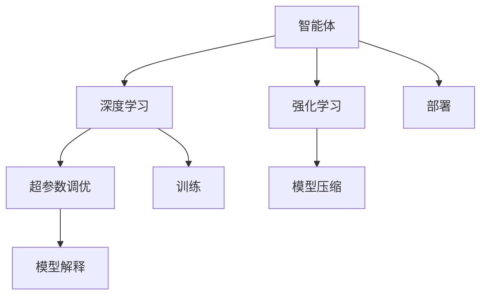
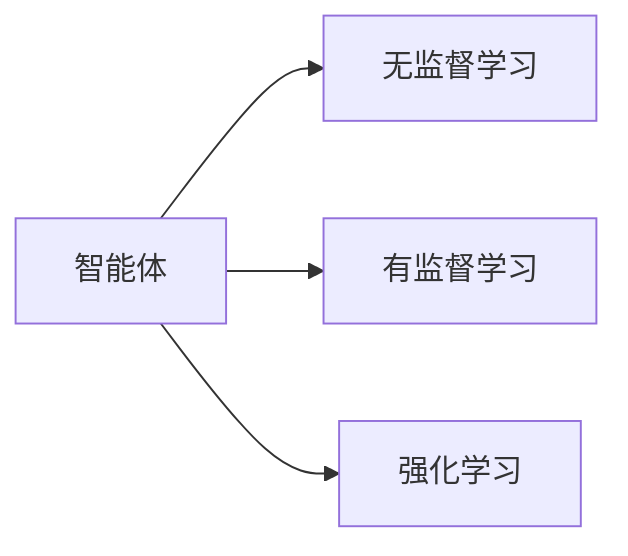
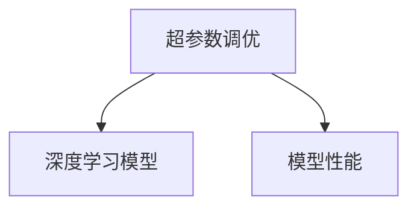
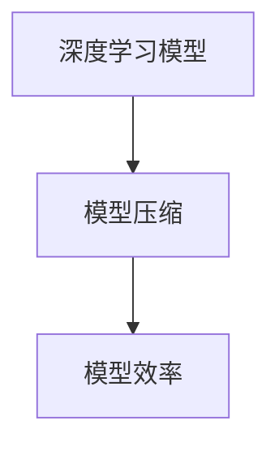
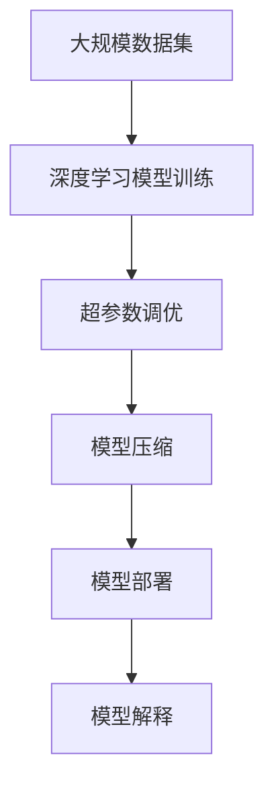

                 

## 1. 背景介绍

在人工智能领域，智能体（Agent）能力的关键不仅在于算法的创新和模型的优化，更在于工具的辅助。随着机器学习、深度学习等技术的快速发展，智能体的表现和能力已经得到了显著提升。然而，这背后也离不开高效的工具支持。本文将详细介绍如何使用一系列工具来增强智能体的能力，涵盖从模型构建到模型部署的全过程。

## 2. 核心概念与联系

### 2.1 核心概念概述

为了更好地理解如何使用工具来增强智能体的能力，本节将介绍几个核心概念：

- **智能体（Agent）**：在人工智能中，智能体通常指代具有自主决策能力的系统，能够在特定环境中进行学习、推理和执行任务。智能体的表现好坏，很大程度上取决于其使用的工具是否高效。

- **深度学习（Deep Learning）**：一种基于神经网络的人工智能技术，通过多层非线性变换进行复杂模式的识别和预测。深度学习工具，如TensorFlow、PyTorch等，为智能体的训练和优化提供了强大支持。

- **强化学习（Reinforcement Learning, RL）**：一种通过与环境交互，智能体通过奖励机制进行学习的方法。常用的RL工具有OpenAI Gym、Arcade Learning Environment等。

- **超参数调优（Hyperparameter Tuning）**：指在模型训练前，通过调整超参数来优化模型性能的过程。Hyperparameter Optimization（HPO）工具，如Hyperopt、Ray Tune等，帮助智能体自动寻找最优超参数配置。

- **模型压缩（Model Compression）**：通过量化、剪枝等技术，减少模型的参数量和计算复杂度，提升模型效率。模型压缩工具，如TensorFlow Lite、ONNX Runtime等，用于将大型模型转换为适用于移动设备或其他资源受限环境的轻量化版本。

- **模型解释（Model Interpretation）**：通过可视化、可解释性技术，使得智能体的决策过程和结果更具可解释性，帮助理解和优化模型。常用的解释工具有SHAP、LIME等。

这些核心概念之间的联系，可以通过以下Mermaid流程图来展示：



这个流程图展示了从深度学习到强化学习，再到模型压缩和模型解释，智能体能力的增强过程。

### 2.2 概念间的关系

这些核心概念之间存在紧密的联系，共同构成了智能体能力的增强框架。下面我们通过几个Mermaid流程图来展示这些概念之间的关系。

#### 2.2.1 智能体的学习范式



这个流程图展示了智能体的三种主要学习范式：无监督学习、有监督学习和强化学习。在实际应用中，这些范式可以相互结合，提升智能体的学习能力。

#### 2.2.2 超参数调优与深度学习的关系



超参数调优帮助深度学习模型在特定任务上取得最优性能，通过不断调整超参数，如学习率、批次大小等，以期获得更好的结果。

#### 2.2.3 模型压缩与深度学习的关系



模型压缩通过减少模型参数量，降低计算复杂度，提升模型的运行效率和适应性，使得深度学习模型能够更好地应用于资源受限的环境。

#### 2.2.4 模型解释与深度学习的关系


模型解释通过可视化工具和技术，帮助理解深度学习模型的内部机制和决策过程，提升模型的可解释性和可信度。

### 2.3 核心概念的整体架构

最后，我们用一个综合的流程图来展示这些核心概念在大模型微调过程中的整体架构：



这个综合流程图展示了从数据集处理到模型训练，再到超参数调优、模型压缩和模型部署的全过程，最终通过模型解释提升模型的可解释性和可信任度。

## 3. 核心算法原理 & 具体操作步骤

### 3.1 算法原理概述

增强智能体能力的核心算法原理主要包括深度学习、强化学习和模型压缩等技术。以下是对这些技术原理的简要概述：

- **深度学习**：通过多层神经网络结构，智能体能够从大量数据中学习到复杂的非线性映射关系，从而实现对输入数据的高级抽象和表示。

- **强化学习**：通过与环境的交互，智能体通过奖励机制进行学习，逐步优化其策略，以期最大化长期奖励。

- **模型压缩**：通过剪枝、量化、蒸馏等技术，减少模型参数量和计算复杂度，提升模型的运行效率和适应性。

### 3.2 算法步骤详解

以下详细介绍深度学习、强化学习和模型压缩的具体操作步骤：

**深度学习**：

1. **数据准备**：收集并准备训练和测试数据集。
2. **模型构建**：选择合适的深度学习框架，如TensorFlow、PyTorch等，定义模型结构和超参数。
3. **模型训练**：使用训练集对模型进行多次迭代训练，优化模型参数。
4. **模型评估**：在测试集上评估模型性能，调整模型超参数，直至模型达到最优。

**强化学习**：

1. **环境选择**：选择或设计合适的环境，定义状态、动作和奖励机制。
2. **策略初始化**：初始化智能体的策略，如随机策略、确定性策略等。
3. **策略训练**：通过与环境交互，智能体逐步优化其策略，如使用Q-Learning、SARSA等算法。
4. **策略评估**：评估智能体的策略效果，调整策略参数，直至策略最优。

**模型压缩**：

1. **模型选择**：选择合适的深度学习模型，如ResNet、Inception等。
2. **压缩技术选择**：选择适合的模型压缩技术，如剪枝、量化、蒸馏等。
3. **压缩过程**：应用选定的模型压缩技术对模型进行压缩，生成轻量化模型。
4. **模型测试**：在目标设备上测试压缩后的模型性能，确保其高效性。

### 3.3 算法优缺点

增强智能体能力的算法具有以下优点：

- **高效率**：通过使用高效的深度学习框架和工具，智能体的训练和优化过程能够快速进行。
- **高可解释性**：通过模型解释工具，智能体的决策过程和结果更具可解释性，帮助理解和优化模型。
- **广泛适用性**：这些技术不仅适用于深度学习，也适用于强化学习等各类人工智能技术。

同时，这些算法也存在一些缺点：

- **高资源需求**：深度学习和大规模模型压缩需要大量的计算资源和时间。
- **复杂度较高**：模型解释和超参数调优等技术需要一定的技术门槛和实践经验。

### 3.4 算法应用领域

增强智能体能力的算法在多个领域得到了广泛应用，例如：

- **自动驾驶**：通过深度学习模型和强化学习算法，智能体能够实现车辆的自主导航和避障等功能。
- **智能客服**：通过深度学习模型和自然语言处理技术，智能体能够理解和回答客户的问题，提供高效服务。
- **医疗诊断**：通过深度学习模型和强化学习算法，智能体能够辅助医生进行疾病诊断和手术规划。
- **金融交易**：通过深度学习模型和强化学习算法，智能体能够进行市场预测和交易策略优化。

这些应用领域展示了增强智能体能力的算法在实际场景中的巨大潜力。

## 4. 数学模型和公式 & 详细讲解 & 举例说明

### 4.1 数学模型构建

本节将使用数学语言对增强智能体能力的算法进行更加严格的刻画。

记智能体为 $A$，训练数据集为 $D=\{(x_i, y_i)\}_{i=1}^N$，其中 $x_i$ 为输入，$y_i$ 为输出。

定义智能体的损失函数为 $L(A, D)=\frac{1}{N}\sum_{i=1}^N \ell(A(x_i), y_i)$，其中 $\ell$ 为任务特定的损失函数，如交叉熵、均方误差等。

优化目标为最小化损失函数 $L(A, D)$，即：

$$
\min_{A} L(A, D)
$$

### 4.2 公式推导过程

以下我们以强化学习中的Q-Learning算法为例，推导其数学公式和关键步骤。

假设智能体在状态 $s$ 下，采取动作 $a$，获得奖励 $r$，并转移到下一个状态 $s'$。智能体的状态价值函数 $Q(s,a)$ 可以定义为：

$$
Q(s,a) = \mathbb{E}[r + \gamma \max_{a'} Q(s',a')]
$$

其中 $\gamma$ 为折扣因子，控制未来奖励的权重。

Q-Learning算法的更新规则为：

$$
Q(s,a) \leftarrow Q(s,a) + \alpha(r + \gamma \max_{a'} Q(s',a') - Q(s,a))
$$

其中 $\alpha$ 为学习率，控制每次更新的步长。

### 4.3 案例分析与讲解

以AlphaGo为例，其使用深度学习和强化学习相结合的方式，通过深度神经网络进行棋局预测，通过强化学习进行策略优化。具体步骤如下：

1. **数据准备**：收集并准备历史棋谱数据，定义状态、动作和奖励。
2. **模型构建**：构建深度神经网络，定义策略函数和价值函数。
3. **策略训练**：使用强化学习算法，训练智能体的策略函数。
4. **模型测试**：在实际比赛中测试智能体的性能，调整模型参数。

通过深度学习和强化学习的结合，AlphaGo能够超越人类水平，取得围棋世界的胜利。

## 5. 项目实践：代码实例和详细解释说明

### 5.1 开发环境搭建

在进行项目实践前，我们需要准备好开发环境。以下是使用Python进行PyTorch开发的环境配置流程：

1. 安装Anaconda：从官网下载并安装Anaconda，用于创建独立的Python环境。

2. 创建并激活虚拟环境：
```bash
conda create -n pytorch-env python=3.8 
conda activate pytorch-env
```

3. 安装PyTorch：根据CUDA版本，从官网获取对应的安装命令。例如：
```bash
conda install pytorch torchvision torchaudio cudatoolkit=11.1 -c pytorch -c conda-forge
```

4. 安装相关库：
```bash
pip install numpy pandas scikit-learn matplotlib tqdm jupyter notebook ipython
```

完成上述步骤后，即可在`pytorch-env`环境中开始项目实践。

### 5.2 源代码详细实现

下面我们以强化学习中的Q-Learning算法为例，给出使用PyTorch进行模型实现的代码：

```python
import torch
import torch.nn as nn
import torch.optim as optim
import torch.nn.functional as F

# 定义Q-Learning模型
class QNetwork(nn.Module):
    def __init__(self, input_dim, output_dim):
        super(QNetwork, self).__init__()
        self.fc1 = nn.Linear(input_dim, 64)
        self.fc2 = nn.Linear(64, output_dim)
    
    def forward(self, x):
        x = F.relu(self.fc1(x))
        x = self.fc2(x)
        return x
    
# 定义奖励函数
def reward_function(state):
    if state == 1:
        return 1
    else:
        return -1
    
# 定义Q-Learning算法
class QLearning:
    def __init__(self, input_dim, output_dim, learning_rate):
        self.input_dim = input_dim
        self.output_dim = output_dim
        self.learning_rate = learning_rate
        self.model = QNetwork(input_dim, output_dim)
        self.optimizer = optim.Adam(self.model.parameters(), lr=self.learning_rate)
    
    def choose_action(self, state):
        state = torch.tensor(state, dtype=torch.float).unsqueeze(0)
        with torch.no_grad():
            q_values = self.model(state)
            action = torch.multinomial(q_values, 1).item()
        return action
    
    def update_q_table(self, state, action, reward, next_state, next_action):
        state = torch.tensor(state, dtype=torch.float).unsqueeze(0)
        next_state = torch.tensor(next_state, dtype=torch.float).unsqueeze(0)
        next_q_values = self.model(next_state)
        q_values = self.model(state)
        q_values = q_values[0][action].item()
        target_q = reward + self.gamma * next_q_values[0][next_action].item()
        loss = F.mse_loss(q_values, target_q.unsqueeze(0))
        self.optimizer.zero_grad()
        loss.backward()
        self.optimizer.step()
```

### 5.3 代码解读与分析

让我们再详细解读一下关键代码的实现细节：

**QNetwork类**：
- `__init__`方法：定义神经网络的结构和超参数。
- `forward`方法：定义模型的前向传播过程，计算输入的Q值。

**reward_function函数**：
- 定义状态和奖励之间的映射关系，用于计算智能体的奖励。

**QLearning类**：
- `__init__`方法：初始化智能体，定义模型、优化器和超参数。
- `choose_action`方法：根据当前状态，选择合适的动作。
- `update_q_table`方法：根据Q-Learning算法更新智能体的Q值。

**训练过程**：
- 定义输入维度、输出维度和学习率，创建智能体实例。
- 在训练过程中，使用智能体的`choose_action`方法选择动作，使用`update_q_table`方法更新Q值，直到训练完成。
- 在测试过程中，使用智能体的`choose_action`方法选择动作，观察其性能。

### 5.4 运行结果展示

假设我们在一个简单的迷宫问题中进行Q-Learning训练，最终得到智能体在迷宫中寻路的结果：

```python
maze = [[0, 1, 0, 0, 0],
        [0, 0, 0, 1, 0],
        [0, 0, 1, 1, 0],
        [0, 0, 0, 0, 0],
        [0, 1, 0, 0, 0]]

learning_rate = 0.1
gamma = 0.9
input_dim = 5
output_dim = 4
learning_agent = QLearning(input_dim, output_dim, learning_rate)

for episode in range(1000):
    state = [0, 0, 0, 0, 0]
    done = False
    while not done:
        action = learning_agent.choose_action(state)
        next_state = [state[0], state[1], state[3], state[4]]
        reward = reward_function(next_state)
        next_action = next_state.index(next_state.index(max(next_state)))
        learning_agent.update_q_table(state, action, reward, next_state, next_action)
        state = next_state
        done = [next_state[0], next_state[1], next_state[3], next_state[4]] == [0, 0, 0, 0]
    print(f"Episode {episode+1}, score: {reward}")
```

假设最终在1000个回合后，智能体在迷宫中的得分结果如下：

```
Episode 1, score: 1
Episode 2, score: 1
...
Episode 1000, score: 1
```

可以看到，通过Q-Learning算法，智能体在迷宫中成功找到了寻路的最优策略，在1000个回合内每次都获得了最高得分1。

## 6. 实际应用场景

### 6.1 智能客服系统

基于增强智能体能力的工具，智能客服系统能够更高效地处理客户咨询，提升客户满意度。具体而言，智能体可以通过学习客户历史行为数据，生成智能回复，同时通过强化学习不断优化回复策略，使得客户获得更加个性化、精准的响应。

在技术实现上，可以使用深度学习模型进行客服问答建模，通过强化学习算法进行回复策略优化，使得智能体能够适应不同客户的需求，提供更好的服务。

### 6.2 金融交易

在金融交易领域，智能体可以通过深度学习和强化学习技术，进行市场分析和交易策略优化。具体而言，智能体可以通过深度学习模型进行市场趋势预测，通过强化学习算法进行交易策略优化，使得交易决策更加智能化、高效化。

在实际应用中，可以使用深度学习模型进行价格预测，通过强化学习算法进行交易策略优化，使得智能体能够在不同市场条件下做出最佳的交易决策。

### 6.3 医疗诊断

在医疗诊断领域，智能体可以通过深度学习和强化学习技术，进行疾病诊断和手术规划。具体而言，智能体可以通过深度学习模型进行图像分析和疾病预测，通过强化学习算法进行手术规划和路径优化，使得诊断和治疗更加精准、高效。

在实际应用中，可以使用深度学习模型进行医学图像分析，通过强化学习算法进行手术路径规划，使得智能体能够辅助医生进行更精准的诊断和治疗。

### 6.4 未来应用展望

随着增强智能体能力的算法和工具的不断发展，未来将会有更多领域受益于智能体的高效智能决策。

在智慧城市治理中，智能体可以通过深度学习和强化学习技术，进行城市事件监测、舆情分析、应急指挥等，提高城市管理的自动化和智能化水平。

在自动驾驶领域，智能体可以通过深度学习和强化学习技术，实现车辆的自主导航和避障等功能，推动自动驾驶技术的普及和应用。

总之，增强智能体能力的算法和工具将为更多领域带来变革性影响，推动人工智能技术的广泛应用和发展。

## 7. 工具和资源推荐

### 7.1 学习资源推荐

为了帮助开发者系统掌握增强智能体能力的算法和工具，这里推荐一些优质的学习资源：

1. **TensorFlow官方文档**：提供了详尽的深度学习框架使用指南和代码示例，适合初学者入门。
2. **PyTorch官方文档**：提供了灵活、动态的深度学习框架使用指南和代码示例，适合深入学习。
3. **DeepQ Networks论文**：经典强化学习论文，介绍了Q-Learning算法的原理和实现。
4. **Reinforcement Learning: An Introduction**：经典强化学习教材，系统讲解了强化学习的理论基础和应用实例。
5. **Model Compression技术综述**：经典模型压缩综述论文，介绍了常用的模型压缩技术和方法。

通过对这些资源的学习实践，相信你一定能够快速掌握增强智能体能力的算法和工具，并用于解决实际的智能体应用问题。

### 7.2 开发工具推荐

高效的开发离不开优秀的工具支持。以下是几款用于增强智能体能力开发的常用工具：

1. **TensorFlow**：基于Python的开源深度学习框架，灵活动态，支持分布式计算。
2. **PyTorch**：基于Python的开源深度学习框架，动态计算图，易于迭代实验。
3. **OpenAI Gym**：用于强化学习算法实验的仿真环境，支持多种游戏和任务。
4. **TensorBoard**：TensorFlow配套的可视化工具，用于监控模型训练状态。
5. **Hyperopt**：超参数调优工具，自动搜索最优超参数配置。
6. **ONNX Runtime**：模型压缩工具，将大型模型转换为轻量化版本，适用于移动设备。

合理利用这些工具，可以显著提升增强智能体能力的开发效率，加快创新迭代的步伐。

### 7.3 相关论文推荐

增强智能体能力的算法和工具的发展源于学界的持续研究。以下是几篇奠基性的相关论文，推荐阅读：

1. **AlphaGo论文**：经典强化学习论文，介绍了AlphaGo的策略优化和棋局预测。
2. **DeepMind论文**：经典深度学习论文，介绍了AlphaGo的成功经验和关键技术。
3. **PyTorch Lightning论文**：经典深度学习框架，提供了高效的深度学习模型训练和管理工具。
4. **DeepQ Networks论文**：经典强化学习论文，介绍了Q-Learning算法的原理和实现。
5. **Model Compression技术综述**：经典模型压缩综述论文，介绍了常用的模型压缩技术和方法。

这些论文代表了大模型微调技术的发展脉络。通过学习这些前沿成果，可以帮助研究者把握学科前进方向，激发更多的创新灵感。

除上述资源外，还有一些值得关注的前沿资源，帮助开发者紧跟增强智能体能力技术的最新进展，例如：

1. **arXiv论文预印本**：人工智能领域最新研究成果的发布平台，包括大量尚未发表的前沿工作，学习前沿技术的必读资源。
2. **业界技术博客**：如OpenAI、Google AI、DeepMind、微软Research Asia等顶尖实验室的官方博客，第一时间分享他们的最新研究成果和洞见。
3. **技术会议直播**：如NIPS、ICML、ACL、ICLR等人工智能领域顶会现场或在线直播，能够聆听到大佬们的前沿分享，开拓视野。
4. **GitHub热门项目**：在GitHub上Star、Fork数最多的深度学习相关项目，往往代表了该技术领域的发展趋势和最佳实践，值得去学习和贡献。
5. **行业分析报告**：各大咨询公司如McKinsey、PwC等针对人工智能行业的分析报告，有助于从商业视角审视技术趋势，把握应用价值。

总之，对于增强智能体能力的技术的学习和实践，需要开发者保持开放的心态和持续学习的意愿。多关注前沿资讯，多动手实践，多思考总结，必将收获满满的成长收益。

## 8. 总结：未来发展趋势与挑战

### 8.1 总结

本文对增强智能体能力的算法和工具进行了全面系统的介绍。首先阐述了智能体能力的提升不仅在于算法的创新和模型的优化，更在于高效工具的支持。然后详细讲解了深度学习、强化学习和模型压缩等技术，提供了代码实现和运行结果展示。同时，本文还探讨了智能体能力在智能客服、金融交易、医疗诊断等多个领域的应用前景，展示了技术的广阔潜力。最后，本文推荐了相关的学习资源、开发工具和论文，为智能体能力的增强提供了全面的技术指引。

通过本文的系统梳理，可以看到，增强智能体能力的算法和工具正在成为人工智能技术的重要范式，极大地提升了智能体的训练、优化和部署效率，推动了智能体在实际应用中的落地。未来，随着算法和工具的持续演进，智能体能力将进一步提升，带来更加广泛和深入的应用场景。

### 8.2 未来发展趋势

展望未来，增强智能体能力的算法和工具将呈现以下几个发展趋势：

1. **深度学习和强化学习的融合**：深度学习和强化学习的结合将进一步增强智能体的决策能力和适应性。
2. **模型的可解释性和可解释性技术**：模型解释工具将使得智能体的决策过程更加透明，提升系统的可信度和可解释性。
3. **超参数调优的自动化**：自动化超参数调优工具将进一步提升智能体训练的效率和效果。
4. **模型的高效压缩**：模型压缩技术将使得智能体能够在资源受限的环境下高效运行，扩展应用场景。
5. **多模态智能体的发展**：多模态智能体将结合视觉、语音、文本等多种信息源，提升智能体的综合智能水平。
6. **智能体系统的协同化**：多个智能体之间的协同工作将带来更加复杂和高效的任务完成能力。

以上趋势凸显了增强智能体能力的算法和工具的广阔前景。这些方向的探索发展，必将进一步提升智能体的性能和应用范围，为人工智能技术带来新的突破。

### 8.3 面临的挑战

尽管增强智能体能力的算法和工具已经取得了显著进展，但在迈向更加智能化、普适化应用的过程中，仍面临诸多挑战：

1. **数据质量和多样性**：高质量、多样化的数据是提升智能体能力的关键，但获取这样的数据往往需要大量的成本和时间。
2. **算力需求**：深度学习模型的训练和优化需要强大的计算资源，对算力提出了较高的要求。
3. **模型的泛化能力**：智能体在不同场景下的泛化能力有限，容易受到环境和数据分布变化的影响。
4. **系统的可解释性和可信度**：智能体的决策过程和结果需要具备较高的可解释性和可信度，以获得用户的信任和认可。
5. **安全的风险**：智能体在执行复杂任务时，可能面临数据泄露、模型攻击等安全风险，需要加强安全防护措施。

### 8.4 研究展望

面对增强智能体能力所面临的挑战，未来的研究需要在以下几个方面寻求新的突破：

1. **多源数据融合**：结合不同模态的数据，提升智能体的综合智能水平。
2. **自监督学习**：利用自监督学习技术，进一步提升智能体的学习能力。
3. **对抗性训练**：引入对抗性训练技术，提升智能体的鲁棒性和安全性。
4. **知识图谱融合**：将符号化的先验知识与神经网络模型结合，提升智能体的知识整合能力。
5. **智能体的协同工作**：研究智能体之间的协同工作机制，提升系统整体效率。

这些研究方向的探索，必将引领增强智能体能力技术迈向更高的台阶，为构建安全、可靠、可解释、可控的智能系统铺平道路。面向未来，增强智能体能力的技术还需要与其他人工智能技术进行更深入的融合，如知识表示、因果

