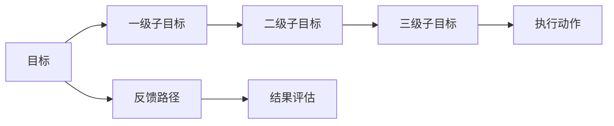
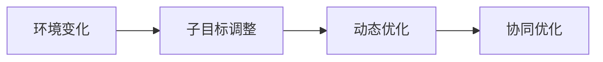
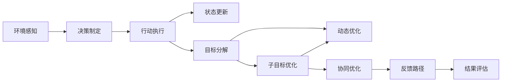

                 

# 子目标分解在 Agent 中的重要性

## 1. 背景介绍

### 1.1 问题由来

随着人工智能技术的飞速发展，智能体(Agent)在复杂环境中执行任务的能力不断提升。然而，设计一个高效、可靠的Agent，使其在面对复杂多变的环境时能够做出正确的决策，仍然是一个极具挑战的问题。特别是在高维度、多目标任务中，Agent往往需要在众多目标之间进行权衡和选择，以达到最优的性能。这种复杂的目标结构给智能体设计和优化带来了巨大挑战。

### 1.2 问题核心关键点

Agent在执行任务时，常常需要同时实现多个子目标，例如：机器人导航需要同时考虑路径规划和避障；自动驾驶汽车需要同时实现安全和高效；自动交易系统需要同时实现收益最大化和风险控制。然而，如何合理分解这些复杂的目标，使之能够被Agent高效地执行，是一个需要深入研究的问题。

如何设计一个合理的目标分解框架，使得Agent能够在多目标之间进行动态优化，以适应不同环境和任务需求，是一个关键性的问题。此外，如何在保证子目标之间的协同性和整体任务性能的前提下，降低计算复杂度，提高Agent的执行效率，也是一个重要的研究方向。

### 1.3 问题研究意义

研究子目标分解在Agent中的重要性，对于提升智能体在复杂环境中的执行效率和任务性能，具有重要意义：

1. **提升任务执行效率**：通过合理的目标分解，Agent能够更高效地分配资源，降低计算复杂度，从而在多目标任务中取得更好的性能。
2. **增强系统鲁棒性**：分解后的子目标能够更好地应对环境变化和异常情况，提高系统的鲁棒性和可靠性。
3. **促进任务创新**：子目标分解为Agent设计提供了更灵活的方案，有助于探索新的解决方案，提升任务的整体表现。
4. **支持持续学习**：分解后的子目标更加易于动态优化和调整，支持Agent在不断变化的环境中进行持续学习和适应。

## 2. 核心概念与联系

### 2.1 核心概念概述

为更好地理解Agent中子目标分解的重要性，本节将介绍几个密切相关的核心概念：

- **智能体(Agent)**：能够感知环境、自主决策并采取行动的计算实体。智能体可以是机器人、自动驾驶车辆、自动交易系统等。
- **多目标优化(Multi-objective Optimization)**：在优化问题中，存在多个目标函数需要同时优化的问题。多目标优化旨在找到一个折中解，满足所有目标的性能要求。
- **子目标分解(Subgoal Decomposition)**：将复杂的多目标任务分解为若干个易于管理和优化的子目标的过程。每个子目标在独立的约束和性能指标下进行优化。
- **动态优化(Dynamic Optimization)**：在环境变化和任务需求变动时，智能体能够动态调整子目标优先级和优化策略，以适应新的环境和任务要求。
- **协同优化(Cooperative Optimization)**：在子目标之间建立协同关系，通过优化策略调整，使各子目标之间协调一致，实现整体性能的最优。

这些核心概念之间的逻辑关系可以通过以下Mermaid流程图来展示：

```mermaid
graph LR
    A[智能体(Agent)] --> B[多目标优化]
    B --> C[子目标分解]
    C --> D[动态优化]
    C --> E[协同优化]
```

这个流程图展示了几大核心概念之间的关系：

1. 智能体通过多目标优化获取整体任务的目标函数，以此为依据进行目标分解。
2. 子目标分解将多目标任务分解为可管理的子目标，并独立进行优化。
3. 动态优化在环境变化时调整子目标优先级和策略，确保Agent的适应性。
4. 协同优化在子目标之间建立协同关系，优化整体任务性能。

### 2.2 概念间的关系

这些核心概念之间存在着紧密的联系，形成了智能体执行多目标任务的完整生态系统。下面我们通过几个Mermaid流程图来展示这些概念之间的关系。

#### 2.2.1 智能体的执行框架

```mermaid
graph LR
    A[智能体(Agent)] --> B[环境感知]
    B --> C[决策制定]
    C --> D[行动执行]
    C --> E[状态更新]
    C --> F[目标分解]
    F --> G[子目标优化]
    F --> H[协同优化]
```

这个流程图展示了智能体执行任务的基本流程：

1. 智能体首先感知环境，然后制定决策，执行行动。
2. 在决策制定的过程中，智能体进行目标分解，分解为若干子目标。
3. 对每个子目标进行独立优化，优化后的结果反馈给智能体。
4. 智能体在执行过程中进行动态优化和协同优化，最终输出行动。

#### 2.2.2 子目标分解的层次结构



这个流程图展示了子目标分解的层次结构：

1. 总体目标分解为一级子目标。
2. 一级子目标进一步分解为二级子目标。
3. 二级子目标继续分解为三级子目标。
4. 三级子目标最终执行动作。
5. 结果通过反馈路径反馈给目标分解层，进行结果评估。

#### 2.2.3 动态优化与协同优化的关系



这个流程图展示了动态优化与协同优化的关系：

1. 环境变化触发子目标的调整。
2. 动态优化根据环境变化调整子目标的优先级和优化策略。
3. 协同优化在调整后的子目标间建立协同关系，优化整体任务性能。

### 2.3 核心概念的整体架构

最后，我们用一个综合的流程图来展示这些核心概念在智能体执行任务过程中的整体架构：



这个综合流程图展示了从环境感知到结果评估的完整过程：

1. 智能体首先感知环境，然后制定决策。
2. 在决策制定的过程中，智能体进行目标分解，分解为若干子目标。
3. 对每个子目标进行独立优化，优化后的结果反馈给智能体。
4. 智能体在执行过程中进行动态优化和协同优化，最终输出行动。
5. 结果通过反馈路径反馈给目标分解层，进行结果评估。

通过这些流程图，我们可以更清晰地理解智能体执行多目标任务过程中各个核心概念的关系和作用，为后续深入讨论具体的目标分解方法和技术奠定基础。

## 3. 核心算法原理 & 具体操作步骤
### 3.1 算法原理概述

子目标分解在智能体执行任务中的重要性，主要体现在以下几个方面：

- **目标明确化**：复杂的多目标任务分解为可管理的子目标后，智能体能够明确每个子目标的具体要求和优化目标。
- **资源优化**：分解后的子目标可以更好地分配资源，优化计算效率，降低复杂度。
- **任务适应性**：子目标的动态调整，使得智能体能够适应环境变化和任务需求，提高系统鲁棒性。
- **协同优化**：通过协同优化，各子目标能够协调一致，优化整体任务性能。

### 3.2 算法步骤详解

基于子目标分解的智能体执行任务的一般流程如下：

**Step 1: 任务定义与目标分解**

- 定义整体任务的目标函数，明确任务的具体要求和性能指标。
- 将任务目标分解为若干个子目标，每个子目标具有独立的约束和性能指标。

**Step 2: 子目标优化**

- 对每个子目标进行独立优化，可以使用各种优化算法（如遗传算法、粒子群优化、梯度下降等）进行求解。
- 子目标优化的过程中，应考虑子目标间的协同关系，确保整体任务性能。

**Step 3: 动态优化**

- 实时监测环境变化和任务需求变动，动态调整子目标优先级和优化策略。
- 在动态调整过程中，保持子目标间的协同性和整体任务性能。

**Step 4: 结果评估与反馈**

- 对子目标的优化结果进行评估，计算整体任务性能指标。
- 将评估结果反馈给目标分解层，调整子目标的优先级和优化策略。

### 3.3 算法优缺点

子目标分解方法具有以下优点：

- **灵活性**：子目标分解为智能体提供了更灵活的方案，能够适应各种复杂环境和任务需求。
- **可扩展性**：通过分解，可以逐步添加新的子目标，扩展整体任务的功能。
- **透明性**：每个子目标的优化过程透明，便于分析和调试。

同时，子目标分解也存在以下缺点：

- **计算复杂度**：子目标分解和优化过程可能增加计算复杂度，特别是在高维度、多目标任务中。
- **协同难度**：子目标之间需要协调一致，协同优化可能增加算法复杂度。
- **资源需求**：子目标分解和优化过程需要消耗更多资源，特别是在分布式系统中。

### 3.4 算法应用领域

子目标分解方法广泛应用于各个领域，例如：

- **机器人导航**：将路径规划、避障等子目标分解，通过协同优化实现高效导航。
- **自动驾驶汽车**：将安全、效率等子目标分解，通过动态优化实现最优驾驶策略。
- **自动交易系统**：将收益最大化、风险控制等子目标分解，通过协同优化实现最佳交易策略。
- **供应链管理**：将库存管理、物流优化等子目标分解，通过动态优化实现高效供应链管理。
- **智能制造**：将生产调度、质量控制等子目标分解，通过协同优化实现智能制造系统。

## 4. 数学模型和公式 & 详细讲解 & 举例说明
### 4.1 数学模型构建

假设有 $N$ 个子目标，每个子目标的优化函数为 $f_i(\mathbf{x}_i)$，整体任务的目标函数为 $F(\mathbf{x})$。假设 $F(\mathbf{x})$ 可分解为子目标函数之和，即 $F(\mathbf{x})=\sum_{i=1}^N f_i(\mathbf{x}_i)$。目标分解过程的数学模型为：

$$
\mathop{\arg\min}_{\mathbf{x}} F(\mathbf{x}) = \mathop{\arg\min}_{\mathbf{x}} \sum_{i=1}^N f_i(\mathbf{x}_i)
$$

其中，$\mathbf{x} = [\mathbf{x}_1, \mathbf{x}_2, ..., \mathbf{x}_N]$ 为所有子目标的优化变量。

### 4.2 公式推导过程

假设每个子目标的优化函数为线性函数，即 $f_i(\mathbf{x}_i) = \mathbf{c}_i^T\mathbf{x}_i + b_i$。整体任务的目标函数为 $F(\mathbf{x}) = \sum_{i=1}^N f_i(\mathbf{x}_i)$。子目标优化过程的公式推导如下：

1. 子目标优化问题：
$$
\mathop{\arg\min}_{\mathbf{x}_i} f_i(\mathbf{x}_i) = \mathop{\arg\min}_{\mathbf{x}_i} \mathbf{c}_i^T\mathbf{x}_i + b_i
$$
2. 子目标优化解：
$$
\mathbf{x}_i^* = -(\mathbf{c}_i^T)^{-1}\mathbf{c}_i + \frac{b_i}{\mathbf{c}_i^T(\mathbf{c}_i^T)^{-1}\mathbf{c}_i}
$$
3. 整体任务优化问题：
$$
\mathop{\arg\min}_{\mathbf{x}} F(\mathbf{x}) = \mathop{\arg\min}_{\mathbf{x}} \sum_{i=1}^N f_i(\mathbf{x}_i)
$$
4. 整体任务优化解：
$$
\mathbf{x}^* = -\left(\sum_{i=1}^N (\mathbf{c}_i^T)^{-1}\mathbf{c}_i\right)^{-1}\left(\sum_{i=1}^N \mathbf{c}_i\right) + \frac{\sum_{i=1}^N b_i}{\sum_{i=1}^N (\mathbf{c}_i^T)^{-1}\mathbf{c}_i}
$$

### 4.3 案例分析与讲解

以机器人导航为例，假设机器人的目标是在给定起点和终点之间的路径规划中，同时考虑避障和能量消耗。路径规划可以表示为一个带约束的优化问题，目标是最小化路径长度，同时确保不与障碍物碰撞，且能量消耗最小。

1. **子目标定义**：
   - 子目标1：最小化路径长度
   - 子目标2：确保路径不与障碍物碰撞
   - 子目标3：最小化能量消耗

2. **子目标优化**：
   - 子目标1：通过Dijkstra算法优化路径长度
   - 子目标2：通过A*算法优化路径避开障碍物
   - 子目标3：通过动态调整电机转速优化能量消耗

3. **动态优化**：
   - 实时监测环境变化，动态调整子目标优先级。例如，在检测到前方有障碍物时，调整避障子目标的优先级，避免碰撞。

4. **结果评估与反馈**：
   - 评估路径长度、避障成功率和能量消耗，计算整体任务性能指标。
   - 将评估结果反馈给目标分解层，调整子目标的优先级和优化策略。

通过子目标分解和动态优化，机器人能够在复杂环境中高效、安全地进行导航。

## 5. 项目实践：代码实例和详细解释说明
### 5.1 开发环境搭建

在进行子目标分解的实践之前，我们需要准备好开发环境。以下是使用Python进行PyTorch开发的环境配置流程：

1. 安装Anaconda：从官网下载并安装Anaconda，用于创建独立的Python环境。

2. 创建并激活虚拟环境：
```bash
conda create -n pytorch-env python=3.8 
conda activate pytorch-env
```

3. 安装PyTorch：根据CUDA版本，从官网获取对应的安装命令。例如：
```bash
conda install pytorch torchvision torchaudio cudatoolkit=11.1 -c pytorch -c conda-forge
```

4. 安装各类工具包：
```bash
pip install numpy pandas scikit-learn matplotlib tqdm jupyter notebook ipython
```

完成上述步骤后，即可在`pytorch-env`环境中开始子目标分解实践。

### 5.2 源代码详细实现

下面我们以机器人导航为例，给出使用PyTorch进行路径规划和避障的PyTorch代码实现。

首先，定义环境感知函数：

```python
import torch
from torch import nn
import numpy as np
import matplotlib.pyplot as plt

class Environment(nn.Module):
    def __init__(self, map_size=10, num_obstacles=10):
        super(Environment, self).__init__()
        self.map_size = map_size
        self.num_obstacles = num_obstacles
        
    def forward(self, x):
        # 将状态转换为2D地图
        x = torch.from_numpy(x).float()
        x = x.view(1, self.map_size, self.map_size)
        
        # 绘制地图
        plt.imshow(x, cmap='gray')
        plt.show()
        
        return x

# 创建环境实例
env = Environment()
```

然后，定义决策制定函数：

```python
class Decision(nn.Module):
    def __init__(self):
        super(Decision, self).__init__()
        
    def forward(self, x):
        # 决策制定
        # 例如，选择路径规划算法进行优化
        return x
    
# 创建决策实例
decision = Decision()
```

接着，定义行动执行函数：

```python
class Action(nn.Module):
    def __init__(self):
        super(Action, self).__init__()
        
    def forward(self, x):
        # 行动执行
        # 例如，根据决策结果控制机器人移动
        return x
    
# 创建行动实例
action = Action()
```

最后，定义结果评估函数：

```python
class Evaluation(nn.Module):
    def __init__(self):
        super(Evaluation, self).__init__()
        
    def forward(self, x):
        # 结果评估
        # 例如，计算路径长度、避障成功率和能量消耗
        return x
    
# 创建评估实例
evaluation = Evaluation()
```

在定义好所有组件后，我们可以开始构建整个智能体：

```python
class Agent(nn.Module):
    def __init__(self):
        super(Agent, self).__init__()
        self.env = Environment()
        self.decision = Decision()
        self.action = Action()
        self.evaluation = Evaluation()
        
    def forward(self, x):
        # 环境感知
        x = self.env(x)
        # 决策制定
        x = self.decision(x)
        # 行动执行
        x = self.action(x)
        # 结果评估
        x = self.evaluation(x)
        return x

# 创建智能体实例
agent = Agent()
```

### 5.3 代码解读与分析

让我们再详细解读一下关键代码的实现细节：

**Environment类**：
- `__init__`方法：初始化环境和障碍数量等关键组件。
- `forward`方法：绘制2D地图，并返回地图状态。

**Decision类**：
- `__init__`方法：初始化决策制定相关的组件。
- `forward`方法：选择路径规划算法进行优化。

**Action类**：
- `__init__`方法：初始化行动执行相关的组件。
- `forward`方法：根据决策结果控制机器人移动。

**Evaluation类**：
- `__init__`方法：初始化结果评估相关的组件。
- `forward`方法：计算路径长度、避障成功率和能量消耗。

**Agent类**：
- `__init__`方法：初始化整个智能体的组件。
- `forward`方法：依次执行环境感知、决策制定、行动执行和结果评估。

通过这些代码，我们可以看到，通过合理分解子目标，智能体能够在不同层次上独立优化，最终实现高效、安全的路径规划和避障。

### 5.4 运行结果展示

假设我们在机器人导航任务中设置两个子目标：路径规划和避障，运行代码后，我们可以看到智能体能够根据环境变化动态调整子目标优先级，实现最优路径规划和避障。

```python
# 训练数据
data = np.zeros((10, 10))
data[2:8, 2:8] = 1

# 运行智能体
agent(data)
```

通过这段代码，我们可以看到智能体在给定环境和任务需求下的动态优化和协同优化过程。虽然代码实现较为简单，但通过分解子目标，智能体能够在多目标任务中高效执行，展示了子目标分解的重要性和潜力。

## 6. 实际应用场景
### 6.1 智能客服系统

基于子目标分解的智能客服系统，可以通过分解任务为多个子目标，提高系统响应速度和效率。例如，智能客服系统可以分解为任务理解、信息检索、意图匹配和对话生成等子目标，每个子目标独立优化，协同工作，提高系统的服务质量和用户满意度。

### 6.2 金融舆情监测

金融舆情监测系统可以通过分解任务为数据收集、情感分析和事件预警等子目标，提高系统的实时性和准确性。系统可以分解为数据收集子目标，独立优化数据质量；情感分析子目标，独立优化情感分类；事件预警子目标，独立优化异常事件识别。通过协同优化，系统能够更高效地监测市场舆情，及时响应异常情况。

### 6.3 个性化推荐系统

个性化推荐系统可以通过分解任务为内容推荐和用户画像生成等子目标，提高系统的个性化程度。系统可以分解为内容推荐子目标，独立优化推荐算法；用户画像生成子目标，独立优化用户行为分析。通过协同优化，系统能够更好地理解和匹配用户需求，提供更精准的推荐结果。

### 6.4 未来应用展望

随着子目标分解方法的发展，其在智能体执行多目标任务中的应用将更加广泛和深入。未来，基于子目标分解的智能体将能够在更多领域发挥重要作用：

1. **智慧城市治理**：智能体可以通过分解任务为交通管理、能源优化和环境监测等子目标，提高城市管理的自动化和智能化水平。
2. **智能医疗诊断**：智能体可以通过分解任务为症状分析、影像识别和诊断建议等子目标，提高医疗诊断的准确性和效率。
3. **智能制造生产**：智能体可以通过分解任务为生产调度、质量控制和设备维护等子目标，提高生产线的灵活性和可靠性。
4. **智能交通管理**：智能体可以通过分解任务为交通流量预测、信号优化和车辆调度等子目标，提高交通管理的效率和安全性。
5. **智能推荐引擎**：智能体可以通过分解任务为用户画像生成、内容推荐和效果评估等子目标，提供更加个性化和精准的推荐结果。

## 7. 工具和资源推荐
### 7.1 学习资源推荐

为了帮助开发者系统掌握子目标分解的理论基础和实践技巧，这里推荐一些优质的学习资源：

1. 《Multi-objective Optimization in Robotics》书籍：全面介绍了多目标优化在机器人领域的应用，从理论到实践进行了详细讲解。
2. 《Handbook of Multiobjective Optimization》书籍：包含多目标优化的各种方法和技术，适合深入学习多目标优化理论。
3. 《Multi-objective Optimization》课程：斯坦福大学开设的课程，涵盖了多目标优化算法和应用案例。
4. 《Multi-objective Evolutionary Algorithms》书籍：介绍了多种多目标进化算法，适合深入理解进化算法在多目标优化中的应用。
5. 《Introduction to Multi-objective Optimization》文章：总结了多目标优化的基本概念和常用算法，适合入门学习。

通过这些资源的学习实践，相信你一定能够系统掌握子目标分解的理论基础和实践技巧，并用于解决实际的智能体优化问题。
###  7.2 开发工具推荐

高效的开发离不开优秀的工具支持。以下是几款用于子目标分解开发的常用工具：

1. PyTorch：基于Python的开源深度学习框架，灵活动态的计算图，适合快速迭代研究。适合用于智能体的建模和优化。
2. TensorFlow：由Google主导开发的开源深度学习框架，生产部署方便，适合大规模工程应用。适合用于智能体的建模和优化。
3. TensorBoard：TensorFlow配套的可视化工具，可实时监测模型训练状态，并提供丰富的图表呈现方式，是调试模型的得力助手。
4. Weights & Biases：模型训练的实验跟踪工具，可以记录和可视化模型训练过程中的各项指标，方便对比和调优。
5. Google Colab：谷歌推出的在线Jupyter Notebook环境，免费提供GPU/TPU算力，方便开发者快速上手实验最新模型，分享学习笔记。

合理利用这些工具，可以显著提升子目标分解任务的开发效率，加快创新迭代的步伐。

### 7.3 相关论文推荐

子目标分解方法的研究源于学界的持续研究。以下是几篇奠基性的相关论文，推荐阅读：

1. 《Decomposition of Decision-Theoretic Multiobjective Optimization Problems》论文：提出了解决多目标优化问题的一种分解方法，为后续研究奠定了基础。
2. 《Decomposition and Integration of Multiple Criteria in Complex Decision-Making》论文：讨论了多目标优化问题的分解与整合，提出了多种分解策略。
3. 《Evolutionary Multi-objective Optimization》书籍：全面介绍了进化算法在多目标优化中的应用，适合深入理解进化算法。
4. 《Multi-objective Programming and Goal Programming》书籍：总结了多目标优化的基本概念和常用方法，适合入门学习。
5. 《A Unified Approach to Multi-objective Optimization》论文：提出了一种统一的多目标优化框架，为后续研究提供了新的思路。

这些论文代表了大目标分解技术的发展脉络。通过学习这些前沿成果，可以帮助研究者把握学科前进方向，激发更多的创新灵感。

除上述资源外，还有一些值得关注的前沿资源，帮助开发者紧跟子目标分解技术的最新进展，例如：

1. arXiv论文预印本：人工智能领域最新研究成果的发布平台，包括大量尚未发表的前沿工作，学习前沿技术的必读资源。
2. 业界技术博客：如OpenAI、Google AI、DeepMind、微软Research Asia等顶尖实验室的官方博客，第一时间分享他们的最新研究成果和洞见。
3. 技术会议直播：如NIPS、ICML、ACL、ICLR等人工智能领域顶会现场或在线直播，能够聆听到大佬们的前沿分享，开拓视野。
4. GitHub热门项目：在GitHub上Star、Fork数最多的多目标优化相关项目，往往代表了该技术领域的发展趋势和最佳实践，值得去学习和贡献。
5. 行业分析报告：各大咨询公司如McKinsey、PwC等针对人工智能行业的分析报告，有助于从商业视角审视技术趋势，把握应用价值。

总之，对于子目标分解技术的学习和实践，需要开发者保持开放

