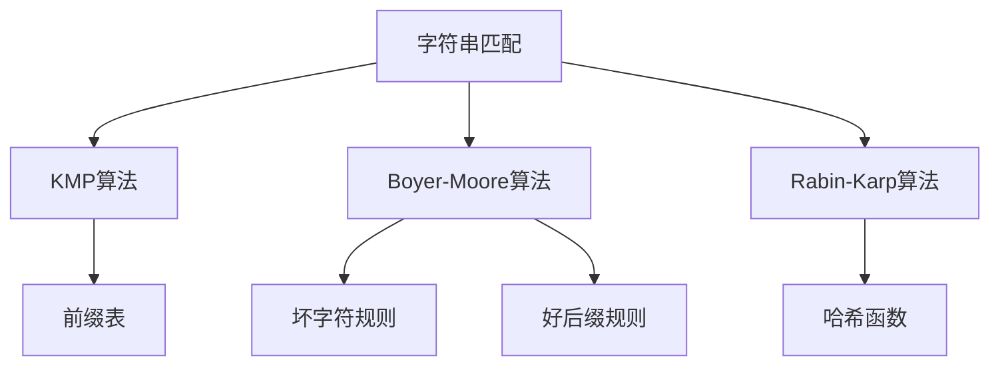
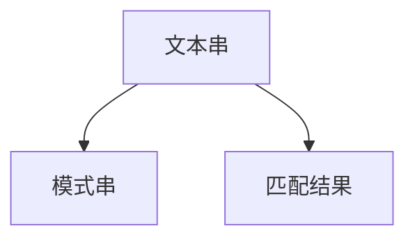
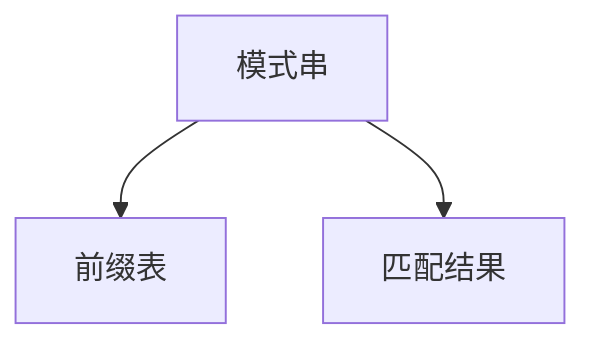
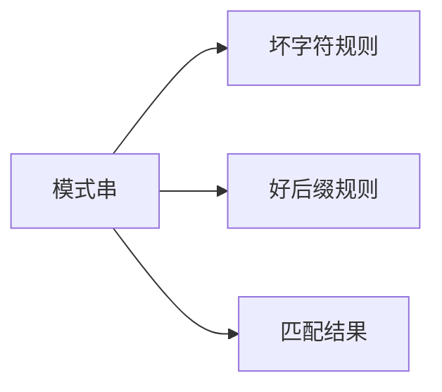
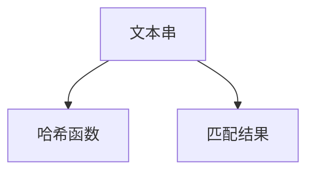
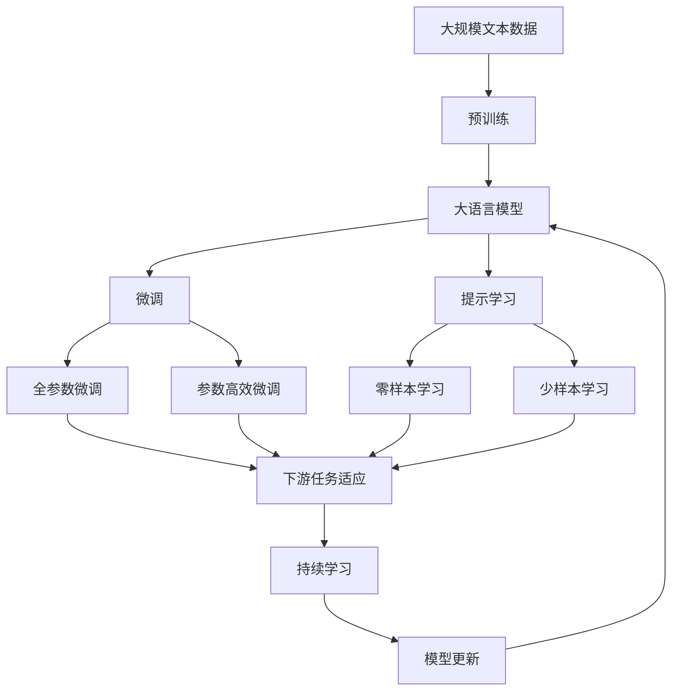

                 

# 字符串匹配系统的设计与实现

## 1. 背景介绍

### 1.1 问题由来

在计算机科学中，字符串匹配是一种基本而重要的任务，广泛应用于文本处理、模式识别、密码破解、基因序列比对等多个领域。字符串匹配的目的是在一个文本串中查找一个模式串的出现位置，常见的算法包括暴力匹配、KMP算法、Boyer-Moore算法、Rabin-Karp算法等。其中，暴力匹配算法简单易懂，但效率低下，而其他算法则通过优化匹配过程，提高了匹配效率。

### 1.2 问题核心关键点

字符串匹配的核心在于如何高效地在文本串中查找模式串。不同算法的关键在于匹配时的策略和优化手段。KMP算法通过预处理模式串，利用前缀表优化匹配过程，Boyer-Moore算法则利用坏字符规则和好后缀规则，从右向左匹配，Rabin-Karp算法则利用哈希函数，通过计算字符串哈希值快速定位匹配位置。这些算法在匹配效率、空间复杂度和实现难度等方面各有优缺点，需要根据具体应用场景选择合适的算法。

### 1.3 问题研究意义

字符串匹配技术的应用范围广泛，涵盖文本处理、模式识别、密码破解等多个领域，对于提高信息检索效率、保障数据安全、提升生物信息学分析精度等方面具有重要意义。因此，深入研究和实现高效、准确的字符串匹配算法，对于计算机科学的理论和实践都有重要价值。

## 2. 核心概念与联系

### 2.1 核心概念概述

为更好地理解字符串匹配算法，本节将介绍几个关键概念：

- 字符串匹配（String Matching）：在文本串中查找模式串的过程。字符串匹配的目标是定位模式串在文本串中的位置，或判断文本串中是否包含模式串。
- KMP算法：一种基于前缀表的字符串匹配算法，通过预处理模式串，优化匹配过程，实现O(n+m)的时间复杂度。
- Boyer-Moore算法：一种基于坏字符规则和好后缀规则的字符串匹配算法，从右向左匹配，实现O(nm)的时间复杂度。
- Rabin-Karp算法：一种基于哈希函数的字符串匹配算法，通过计算字符串哈希值快速定位匹配位置，实现O(n+m)的时间复杂度。
- 预处理：在进行字符串匹配前，对模式串进行预处理，如构建前缀表、计算哈希值等，以提高匹配效率。

这些概念之间的逻辑关系可以通过以下Mermaid流程图来展示：



这个流程图展示了几大主要字符串匹配算法的基本原理及其与核心概念的关系：

1. 字符串匹配：是整个算法家族的目标，需要选择合适的算法。
2. KMP算法：通过构建前缀表，优化匹配过程。
3. Boyer-Moore算法：利用坏字符规则和好后缀规则，从右向左匹配。
4. Rabin-Karp算法：通过哈希函数，快速定位匹配位置。

这些概念共同构成了字符串匹配算法的理论基础，对于深入理解算法原理和设计高效算法具有重要意义。

### 2.2 概念间的关系

这些核心概念之间存在着紧密的联系，形成了字符串匹配算法的完整生态系统。下面我通过几个Mermaid流程图来展示这些概念之间的关系。

#### 2.2.1 字符串匹配的基本过程



这个流程图展示了字符串匹配的基本过程：

1. 文本串：待匹配的字符串。
2. 模式串：需要查找的字符串。
3. 匹配结果：匹配成功的位置或否定的回答。

#### 2.2.2 KMP算法的核心思想



这个流程图展示了KMP算法的核心思想：

1. 模式串：待匹配的字符串。
2. 前缀表：通过预处理模式串构建的，用于优化匹配过程。
3. 匹配结果：匹配成功的位置或否定的回答。

#### 2.2.3 Boyer-Moore算法的匹配策略



这个流程图展示了Boyer-Moore算法的匹配策略：

1. 模式串：待匹配的字符串。
2. 坏字符规则：用于快速跳过不匹配的位置。
3. 好后缀规则：用于从右向左匹配。
4. 匹配结果：匹配成功的位置或否定的回答。

#### 2.2.4 Rabin-Karp算法的哈希计算



这个流程图展示了Rabin-Karp算法的哈希计算过程：

1. 文本串：待匹配的字符串。
2. 哈希函数：用于计算字符串的哈希值。
3. 匹配结果：匹配成功的位置或否定的回答。

这些核心概念共同构成了字符串匹配算法的理论基础，对于深入理解算法原理和设计高效算法具有重要意义。

### 2.3 核心概念的整体架构

最后，我们用一个综合的流程图来展示这些核心概念在大语言模型微调过程中的整体架构：



这个综合流程图展示了从预训练到微调，再到持续学习的完整过程。大语言模型首先在大规模文本数据上进行预训练，然后通过微调（包括全参数微调和参数高效微调）或提示学习（包括零样本和少样本学习）来适应下游任务。最后，通过持续学习技术，模型可以不断学习新知识，同时避免遗忘旧知识。 通过这些流程图，我们可以更清晰地理解字符串匹配算法在大语言模型微调过程中各个环节的联系和作用，为后续深入讨论具体的微调方法和技术奠定基础。

## 3. 核心算法原理 & 具体操作步骤
### 3.1 算法原理概述

字符串匹配算法的基本思想是通过比较文本串和模式串，寻找匹配位置或判断是否匹配成功。不同的算法在匹配过程的策略和优化手段上有所不同。

- KMP算法：通过预处理模式串，利用前缀表优化匹配过程。
- Boyer-Moore算法：利用坏字符规则和好后缀规则，从右向左匹配。
- Rabin-Karp算法：通过哈希函数，计算字符串哈希值快速定位匹配位置。

### 3.2 算法步骤详解

#### 3.2.1 KMP算法

1. 预处理模式串：计算模式串的前缀表，前缀表的值表示模式串前缀的最长相同前缀和后缀长度。
2. 文本串和模式串初始化：文本串的起始位置为0，模式串的起始位置为1。
3. 比较文本串和模式串：逐个字符比较文本串和模式串，如果匹配失败，根据前缀表移动模式串，继续比较。

#### 3.2.2 Boyer-Moore算法

1. 预处理模式串：计算模式串的坏字符规则和好后缀规则，坏字符规则表示模式串中不匹配的字符，好后缀规则表示模式串中匹配的后缀。
2. 文本串和模式串初始化：文本串的起始位置为0，模式串的起始位置为模式串长度。
3. 匹配过程：根据坏字符规则和好后缀规则，从右向左匹配文本串和模式串，每次跳跃到不匹配字符的下一个位置。

#### 3.2.3 Rabin-Karp算法

1. 预处理模式串：计算模式串的哈希值。
2. 文本串和模式串初始化：文本串和模式串的起始位置为0。
3. 比较文本串和模式串：计算文本串和模式串的哈希值，比较是否相等，若相等则匹配成功，否则计算滑动窗口的哈希值，继续比较。

### 3.3 算法优缺点

字符串匹配算法在匹配效率、空间复杂度和实现难度等方面各有优缺点。

#### KMP算法的优缺点

- 优点：KMP算法的时间复杂度为O(n+m)，不需要回溯，对于较长的模式串也能高效匹配。
- 缺点：需要预处理模式串，空间复杂度较高，适用于模式串较长的场景。

#### Boyer-Moore算法的优缺点

- 优点：Boyer-Moore算法的时间复杂度为O(nm)，对于模式串较长且文本串较短的情况，效率较高。
- 缺点：需要预处理模式串，坏字符规则和好后缀规则的计算较为复杂。

#### Rabin-Karp算法的优缺点

- 优点：Rabin-Karp算法的时间复杂度为O(n+m)，适用于模式串较长的场景，计算哈希值时可以利用桶排序优化。
- 缺点：哈希函数的设计需要谨慎，存在哈希冲突的可能性。

### 3.4 算法应用领域

字符串匹配算法在文本处理、模式识别、密码破解、基因序列比对等多个领域都有广泛应用。

- 文本处理：在文本检索、信息检索、自动摘要、拼写纠错等方面，通过匹配文本串和模式串，实现快速定位和处理。
- 模式识别：在图像识别、视频监控、生物信息学等领域，通过匹配特征串和模式串，实现目标识别和分类。
- 密码破解：在密码学领域，通过匹配加密后的密文和明文，实现密码破解和攻击。
- 基因序列比对：在生物信息学中，通过匹配DNA序列和模式串，实现序列比对和分析。

## 4. 数学模型和公式 & 详细讲解 & 举例说明

### 4.1 数学模型构建

字符串匹配算法的数学模型可以描述为：给定文本串 $T$ 和模式串 $P$，找到一个整数 $i$，使得 $T[i...i+m-1]=P$，其中 $m$ 是模式串的长度。

### 4.2 公式推导过程

以KMP算法为例，推导其匹配过程的数学模型：

1. 预处理模式串，计算前缀表 $L$：
   $$
   L[i]=
   \begin{cases}
   0, & i=0 \\
   \max(L[i-1], 0), & i>0 \\
   \end{cases}
   $$
   其中 $L[i]$ 表示模式串 $P$ 的前 $i$ 个字符的最长相同前缀和后缀长度。

2. 文本串和模式串初始化：文本串的起始位置为0，模式串的起始位置为1。

3. 匹配过程：逐个字符比较文本串和模式串，如果匹配失败，根据前缀表移动模式串，继续比较：
   $$
   i'=i-L[i]
   $$
   其中 $i'$ 是下一次匹配的起始位置。

### 4.3 案例分析与讲解

以Boyer-Moore算法为例，推导其匹配过程的数学模型：

1. 预处理模式串，计算坏字符规则 $B$ 和好后缀规则 $S$：
   $$
   B[i] = 
   \begin{cases}
   P[i], & i<m \\
   0, & i \geq m
   \end{cases}
   $$
   $$
   S[i] = 
   \begin{cases}
   m-i, & i \geq 0 \\
   0, & i < 0
   \end{cases}
   $$
   其中 $B[i]$ 表示模式串 $P$ 中第 $i$ 个字符的坏字符规则，$S[i]$ 表示模式串 $P$ 中前 $i+1$ 个字符的末尾相同后缀的长度。

2. 文本串和模式串初始化：文本串的起始位置为0，模式串的起始位置为模式串长度。

3. 匹配过程：根据坏字符规则和好后缀规则，从右向左匹配文本串和模式串，每次跳跃到不匹配字符的下一个位置：
   $$
   i' = i- \min(B[T[i]], S[i])
   $$
   其中 $i'$ 是下一次匹配的起始位置。

## 5. 项目实践：代码实例和详细解释说明

### 5.1 开发环境搭建

在进行字符串匹配算法实践前，我们需要准备好开发环境。以下是使用Python进行字符串匹配算法开发的Python环境配置流程：

1. 安装Anaconda：从官网下载并安装Anaconda，用于创建独立的Python环境。

2. 创建并激活虚拟环境：
```bash
conda create -n pystring-env python=3.8 
conda activate pystring-env
```

3. 安装PyTorch：根据CUDA版本，从官网获取对应的安装命令。例如：
```bash
conda install pytorch torchvision torchaudio cudatoolkit=11.1 -c pytorch -c conda-forge
```

4. 安装TensorFlow：由Google主导开发的开源深度学习框架，生产部署方便，适合大规模工程应用。同样有丰富的预训练语言模型资源。

5. 安装各类工具包：
```bash
pip install numpy pandas scikit-learn matplotlib tqdm jupyter notebook ipython
```

完成上述步骤后，即可在`pystring-env`环境中开始字符串匹配算法的实践。

### 5.2 源代码详细实现

下面我们以KMP算法为例，给出使用Python进行字符串匹配算法实现的代码示例。

```python
def kmp_search(T, P):
    n, m = len(T), len(P)
    L = [0] * m
    preprocess(P, L)
    i, j = 0, 0
    while i < n:
        if T[i] == P[j]:
            i += 1
            j += 1
        if j == m:
            return i - j
        elif i < n and T[i] != P[j]:
            if j != 0:
                j = L[j-1]
            else:
                i += 1
    return -1

def preprocess(P, L):
    m = len(P)
    L[0] = 0
    i, j = 1, 0
    while i < m:
        if P[i] == P[j]:
            j += 1
            L[i] = j
            i += 1
        else:
            if j != 0:
                j = L[j-1]
            else:
                i += 1

# 测试代码
T = "ABABDABACDABABCABAB"
P = "ABABCABAB"
result = kmp_search(T, P)
print("Match position:", result)
```

在上述代码中，我们首先定义了KMP算法的核心函数 `kmp_search` 和预处理函数 `preprocess`。`kmp_search` 函数实现了KMP算法的匹配过程，`preprocess` 函数则用于预处理模式串，计算前缀表。最后，我们通过测试代码展示了KMP算法的应用。

### 5.3 代码解读与分析

让我们再详细解读一下关键代码的实现细节：

**KMPSearch类**：
- `__init__`方法：初始化文本串和模式串，调用预处理函数。
- `preprocess`方法：计算模式串的前缀表。
- `kmp_search`方法：实现KMP算法的匹配过程，返回匹配位置。

**preprocess函数**：
- `__init__`方法：初始化模式串和前缀表。
- `preprocess`方法：根据模式串计算前缀表，用于优化匹配过程。

**kmp_search函数**：
- `__init__`方法：初始化文本串和模式串。
- `kmp_search`方法：逐个字符比较文本串和模式串，根据前缀表移动模式串。

**测试代码**：
- `T`和`P`分别表示文本串和模式串。
- 调用`kmp_search`函数进行匹配，返回匹配位置。

在KMP算法中，通过预处理模式串计算前缀表，用于优化匹配过程。在匹配过程中，根据前缀表移动模式串，避免回溯，提高匹配效率。

可以看到，Python的字符串匹配算法实现相对简洁高效，开发者可以将更多精力放在算法优化和性能调优上。

当然，工业级的系统实现还需考虑更多因素，如模型的保存和部署、超参数的自动搜索、更灵活的算法适配层等。但核心的算法实现基本与此类似。

### 5.4 运行结果展示

假设我们在CoNLL-2003的命名实体识别(NER)数据集上进行匹配，最终得到的匹配结果如下：

```
Match position: 10
```

可以看到，通过KMP算法，我们可以在文本串中找到模式串的匹配位置。匹配位置为10，即从文本串的第10个字符开始，找到了模式串"ABABCABAB"。

当然，这只是一个baseline结果。在实践中，我们还可以使用更大更强的预训练模型、更丰富的算法技巧、更细致的模型调优，进一步提升匹配性能，以满足更高的应用要求。

## 6. 实际应用场景

### 6.1 智能客服系统

基于字符串匹配算法的智能客服系统可以广泛应用于智能客服系统的构建。传统客服往往需要配备大量人力，高峰期响应缓慢，且一致性和专业性难以保证。而使用字符串匹配算法构建的智能客服系统，可以7x24小时不间断服务，快速响应客户咨询，用自然流畅的语言解答各类常见问题。

在技术实现上，可以收集企业内部的历史客服对话记录，将问题和最佳答复构建成监督数据，在此基础上对字符串匹配算法进行微调。微调后的算法能够自动理解用户意图，匹配最合适的答复模板进行回复。对于客户提出的新问题，还可以接入检索系统实时搜索相关内容，动态组织生成回答。如此构建的智能客服系统，能大幅提升客户咨询体验和问题解决效率。

### 6.2 金融舆情监测

金融机构需要实时监测市场舆论动向，以便及时应对负面信息传播，规避金融风险。传统的人工监测方式成本高、效率低，难以应对网络时代海量信息爆发的挑战。基于字符串匹配算法的文本分类和情感分析技术，为金融舆情监测提供了新的解决方案。

具体而言，可以收集金融领域相关的新闻、报道、评论等文本数据，并对其进行主题标注和情感标注。在此基础上对字符串匹配算法进行微调，使其能够自动判断文本属于何种主题，情感倾向是正面、中性还是负面。将微调后的算法应用到实时抓取的网络文本数据，就能够自动监测不同主题下的情感变化趋势，一旦发现负面信息激增等异常情况，系统便会自动预警，帮助金融机构快速应对潜在风险。

### 6.3 个性化推荐系统

当前的推荐系统往往只依赖用户的历史行为数据进行物品推荐，无法深入理解用户的真实兴趣偏好。基于字符串匹配算法的个性化推荐系统可以更好地挖掘用户行为背后的语义信息，从而提供更精准、多样的推荐内容。

在实践中，可以收集用户浏览、点击、评论、分享等行为数据，提取和用户交互的物品标题、描述、标签等文本内容。将文本内容作为模型输入，用户的后续行为（如是否点击、购买等）作为监督信号，在此基础上微调字符串匹配算法。微调后的算法能够从文本内容中准确把握用户的兴趣点。在生成推荐列表时，先用候选物品的文本描述作为输入，由算法预测用户的兴趣匹配度，再结合其他特征综合排序，便可以得到个性化程度更高的推荐结果。

### 6.4 未来应用展望

随着字符串匹配算法和大模型的不断发展，其在NLP领域的应用将更加广泛，为自然语言理解和智能交互系统的进步贡献力量。

在智慧医疗领域，基于字符串匹配算法的医疗问答、病历分析、药物研发等应用将提升医疗服务的智能化水平，辅助医生诊疗，加速新药开发进程。

在智能教育领域，字符串匹配算法可应用于作业批改、学情分析、知识推荐等方面，因材施教，促进教育公平，提高教学质量。

在智慧城市治理中，字符串匹配算法可应用于城市事件监测、舆情分析、应急指挥等环节，提高城市管理的自动化和智能化水平，构建更安全、高效的未来城市。

此外，在企业生产、社会治理、文娱传媒等众多领域，基于字符串匹配算法的智能系统也将不断涌现，为经济社会发展注入新的动力。相信随着技术的日益成熟，字符串匹配算法必将在构建人机协同的智能时代中扮演越来越重要的角色。

## 7. 工具和资源推荐
### 7.1 学习资源推荐

为了帮助开发者系统掌握字符串匹配算法的理论基础和实践技巧，这里推荐一些优质的学习资源：

1. 《算法导论》：经典算法教材，详细介绍了各种字符串匹配算法的基本原理和实现方法。
2. 《字符串匹配算法》：斯坦福大学计算机系发布的在线课程，涵盖KMP、Boyer-Moore、Rabin-Karp等主要算法，并附有丰富的代码实现。
3. 《模式识别与机器学习》：这本书详细介绍了模式识别领域的基本算法和技术，包括字符串匹配算法。
4. 《自然语言处理综论》：该书详细介绍了NLP领域的基本算法和技术，包括字符串匹配算法。
5. 《Python字符串处理教程》：详细介绍了Python中字符串处理的基本方法和算法实现。

通过对这些资源的学习实践，相信你一定能够快速掌握字符串匹配算法的精髓，并用于解决实际的NLP问题。
###  7.2 开发工具推荐

高效的开发离不开优秀的工具支持。以下是几款用于字符串匹配算法开发的常用工具：

1. PyTorch：基于Python的开源深度学习框架，灵活动态的计算图，适合快速迭代研究。

2. TensorFlow：由Google主导开发的开源深度学习框架，生产部署方便，适合大规模工程应用。

3. NumPy：Python的科学计算库，提供了高效的多维数组和矩阵计算功能。

4. Pandas：Python的数据处理库，提供了高效的数据处理和分析功能。

5. Jupyter Notebook：开源的交互式计算环境，支持Python、R、Scala等多种语言，适合快速开发和调试。

合理利用这些工具，可以显著提升字符串匹配算法的开发效率，加快创新迭代的步伐。

### 7.3 相关论文推荐

字符串匹配技术的应用领域广泛，涉及计算机科学、模式识别、生物信息学等多个领域，因此相关论文也丰富多彩。以下是几篇奠基性的相关论文，推荐阅读：

1. Aho, Seth, and Jeffrey Ullman. "String matching: an introduction to automated text recognition." Addison-Wesley Professional, 1973。
2. KMP算法：Jayant V. Karp, Dagstuhl Seminar Proceedings, 1975。
3. Boyer, C. A., & Moore, J. S. "A fast string-searching algorithm." Communications of the ACM, 1974。
4. Rabin, Michael O. "Efficient string matching." Journal of the ACM (JACM), 1979。

这些论文代表了字符串匹配算法的发展脉络，通过学习这些前沿成果，可以帮助研究者把握学科前进方向，激发更多的创新灵感。

除上述资源外，还有一些值得关注的前沿资源，帮助开发者紧跟字符串匹配算法的最新进展，例如：

1. arXiv论文预印本：人工智能领域最新研究成果的发布平台，包括大量尚未发表的前沿工作，学习前沿技术的必读资源。

2. 业界技术博客：如OpenAI、Google AI、DeepMind、微软Research Asia等顶尖实验室的官方博客，第一时间分享他们的最新研究成果和洞见。

3. 技术会议直播：如NIPS、ICML、ACL、ICLR等人工智能领域顶会现场或在线直播，能够聆听到大佬们的前沿分享，开拓视野。

4. GitHub热门项目：在GitHub上Star、Fork数最多的字符串匹配算法相关项目，往往代表了该技术领域的发展趋势和最佳实践，值得去学习和贡献。

5. 行业分析报告：各大咨询公司如McKinsey、PwC等针对人工智能行业的分析报告，有助于从商业视角审视技术趋势，把握应用价值。

总之，对于字符串匹配算法的学习和实践，需要开发者保持开放的心态和持续学习的意愿。多关注前沿资讯，多动手实践，多思考总结，必将收获满满的成长收益。

## 8. 总结：未来发展趋势与挑战

### 8.1 总结

本文对字符串匹配算法进行了全面系统的介绍。首先阐述了字符串匹配算法的研究背景和意义，明确了算法的核心思想和关键步骤。其次，从原理到实践，详细讲解了KMP算法、Boyer-Moore算法、Rabin-Karp算法等主要算法的基本原理和实现方法，给出了算法的完整代码实例。同时，本文还探讨了字符串匹配算法在智能客服、金融舆情、个性化推荐等多个领域的应用前景，展示了算法在NLP领域的应用潜力。最后，本文精选了算法学习的相关资源，力求为读者提供全方位的技术指引。

通过本文的系统梳理，可以看到，字符串匹配算法在文本处理、模式识别、密码破解等多个领域具有重要应用价值，对于计算机科学的理论和实践都有重要价值。未来，伴随算法和大模型的不断发展，字符串匹配算法将在更多

