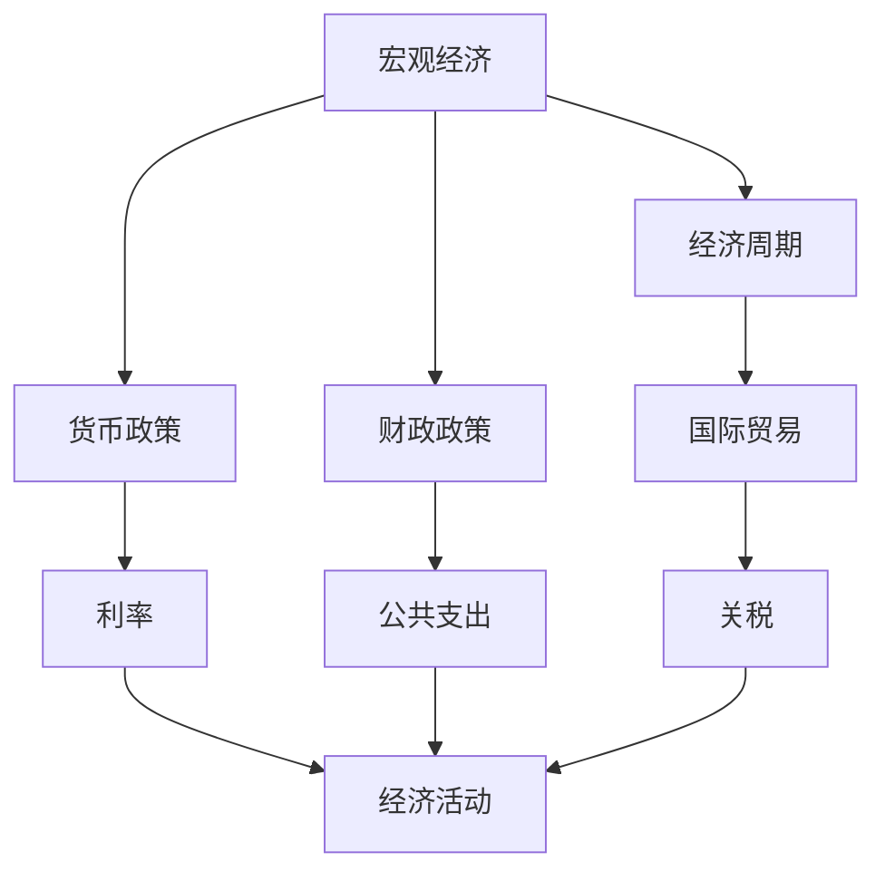
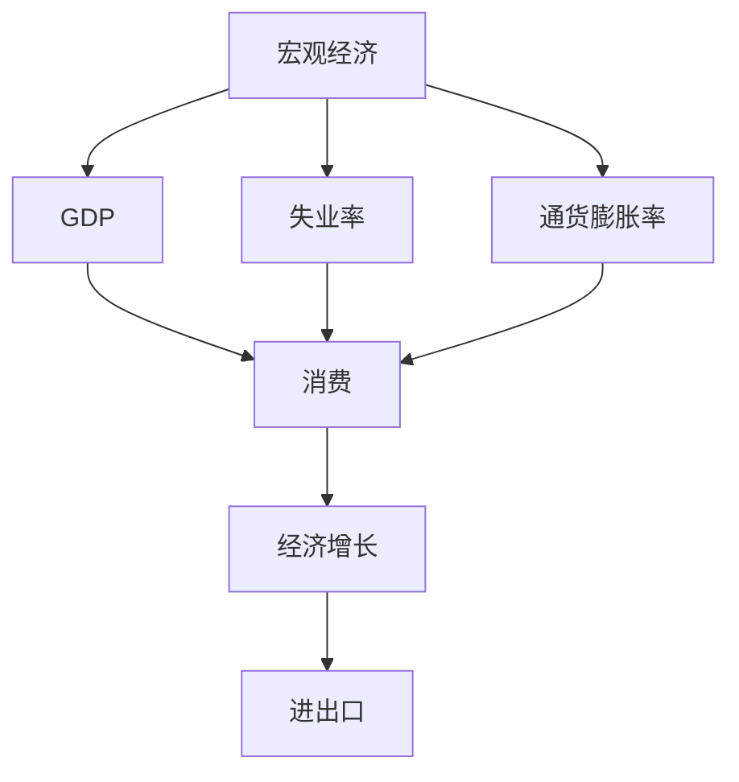
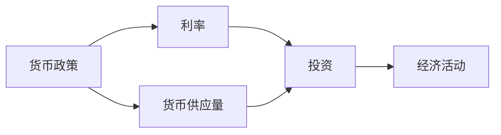
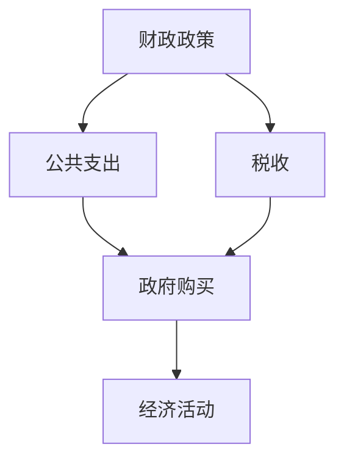
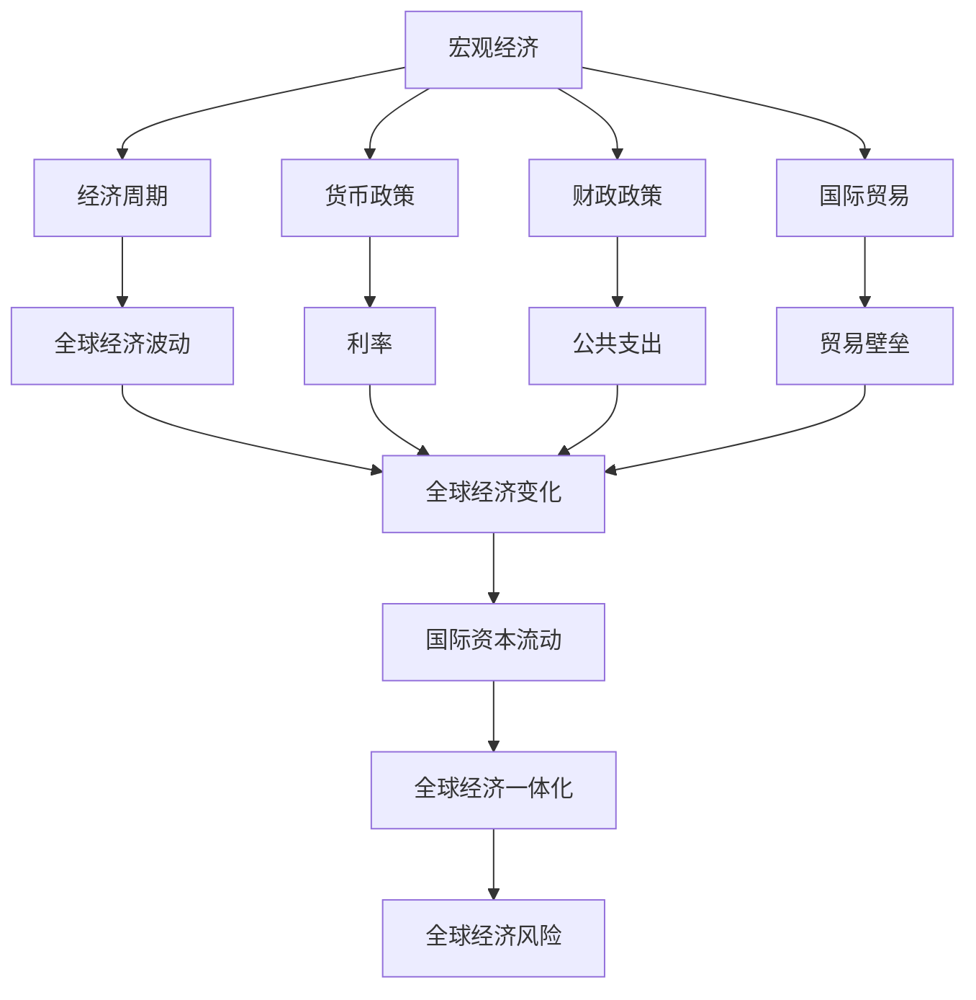

                 

## 1. 背景介绍

### 1.1 问题由来
宏观经济的变化对全球产生深远影响，其影响范围覆盖贸易、就业、投资、消费等诸多领域。这些影响不仅体现在全球范围内，还深刻影响着各国政策制定和经济决策。因此，理解宏观经济变化对全球的广泛影响，对于决策者、分析师和研究人员至关重要。

### 1.2 问题核心关键点
- **全球经济一体化**：各国经济的相互依存性日益增强，宏观经济的变化通过贸易、资本流动等途径迅速传导至全球其他地区。
- **复杂性**：宏观经济变量（如GDP、失业率、通货膨胀率等）受多种因素影响，包括政策、地缘政治、技术进步等。
- **动态性**：宏观经济变化频繁且不可预测，决策者需要具备高度的灵活性和适应性。
- **不确定性**：全球经济受到诸多不确定因素的影响，如自然灾害、地缘政治冲突、疫情等，这些都可能对宏观经济变化产生重大影响。

### 1.3 问题研究意义
理解宏观经济变化的全球影响，有助于：
- 全球政策协调：不同国家和地区在制定经济政策时，需要考虑全球经济变化的广泛影响。
- 风险管理：识别和评估宏观经济变化带来的风险，采取相应的风险管理措施。
- 投资决策：投资者需要预测宏观经济变化，调整投资策略以应对可能的波动。
- 企业运营：企业需要评估宏观经济环境，做出合理的生产、投资和人才管理决策。

## 2. 核心概念与联系

### 2.1 核心概念概述

为了更好地理解宏观经济变化的全球影响，本节将介绍几个密切相关的核心概念：

- **宏观经济（Macroeconomics）**：研究整个经济体的总体表现，包括就业、通货膨胀、经济增长、贸易平衡等方面。
- **全球经济一体化（Global Economic Integration）**：指全球各国经济体之间通过贸易、投资、金融等渠道的紧密联系。
- **经济周期（Economic Cycle）**：指经济活动在时间上的周期性变化，包括繁荣、衰退、萧条和复苏四个阶段。
- **货币政策（Monetary Policy）**：中央银行通过调整利率、货币供应量等手段来影响经济活动。
- **财政政策（Fiscal Policy）**：政府通过调整税收、公共支出等手段来影响经济活动。
- **国际贸易（International Trade）**：各国通过贸易方式实现商品和服务的交换。

这些核心概念之间的逻辑关系可以通过以下Mermaid流程图来展示：



这个流程图展示了大经济中的核心概念及其相互关系：

1. 宏观经济受经济周期、货币政策和财政政策的影响。
2. 货币政策通过利率等手段调控经济活动。
3. 财政政策通过公共支出等手段调控经济活动。
4. 经济周期包括繁荣、衰退、萧条和复苏四个阶段，影响宏观经济表现。
5. 国际贸易通过关税、贸易协定等手段影响全球经济。

### 2.2 概念间的关系

这些核心概念之间存在着紧密的联系，形成了宏观经济分析的整体框架。下面我通过几个Mermaid流程图来展示这些概念之间的关系。

#### 2.2.1 宏观经济分析框架



这个流程图展示了宏观经济的核心变量及其相互关系：

1. GDP、失业率和通货膨胀率是宏观经济的主要指标。
2. GDP由消费、投资、政府支出和净出口组成。
3. 失业率反映劳动力市场的状况。
4. 通货膨胀率反映物价水平的变化。
5. 经济增长受消费、投资、进出口等因素影响。

#### 2.2.2 货币政策与经济活动



这个流程图展示了货币政策对经济活动的影响：

1. 货币政策通过调整利率和货币供应量影响经济活动。
2. 利率影响投资和消费，进而影响经济活动。
3. 货币供应量影响货币市场的流动性，间接影响经济活动。

#### 2.2.3 财政政策与经济活动



这个流程图展示了财政政策对经济活动的影响：

1. 财政政策通过调整公共支出和税收影响经济活动。
2. 公共支出直接增加政府购买，拉动经济增长。
3. 税收影响个人和企业的可支配收入，间接影响消费和投资。

### 2.3 核心概念的整体架构

最后，我们用一个综合的流程图来展示这些核心概念在大经济变化中的整体架构：



这个综合流程图展示了从宏观经济到全球经济变化的整体架构：

1. 宏观经济受经济周期、货币政策和财政政策的影响。
2. 经济周期影响全球经济波动。
3. 货币政策和财政政策通过利率、公共支出等手段影响全球经济。
4. 国际贸易通过关税、贸易协定等手段影响全球经济。
5. 国际资本流动受全球经济变化的影响。
6. 全球经济一体化推动全球经济的相互依存性。
7. 全球经济风险受多种因素影响，需要综合评估。

## 3. 核心算法原理 & 具体操作步骤

### 3.1 算法原理概述

理解宏观经济变化的全球影响，需要构建一个综合的模型来分析各经济变量之间的关系。我们通常使用向量自回归（VAR）模型来模拟宏观经济数据之间的动态关系。

VAR模型是一种时间序列模型，用于描述多个时间序列变量之间的互动关系。假设我们有 $n$ 个宏观经济变量，即 $\{Y_t=(y_{1t},y_{2t},...,y_{nt})'\}$，VAR模型可以表示为：

$$
Y_t = A_1Y_{t-1} + A_2Y_{t-2} + ... + A_kY_{t-k} + B_t + \epsilon_t
$$

其中 $A_i$ 是 $n \times n$ 的参数矩阵，$B_t$ 是 $n \times d$ 的外生变量，$\epsilon_t$ 是 $n \times 1$ 的误差项。

### 3.2 算法步骤详解

以下是使用VAR模型进行宏观经济变化分析的具体步骤：

1. **数据准备**：
   - 收集所需宏观经济数据，包括GDP、失业率、通货膨胀率、利率等。
   - 对数据进行平稳性检验，确保数据的平稳性。

2. **模型构建**：
   - 选择VAR模型的滞后阶数 $k$，一般通过AIC、BIC等准则进行确定。
   - 构建VAR模型，进行参数估计。

3. **模型诊断**：
   - 检验模型的平稳性和残差项的协方差结构。
   - 进行Granger因果检验，评估各变量之间的因果关系。

4. **预测与分析**：
   - 使用VAR模型进行预测，评估未来经济趋势。
   - 分析模型结果，评估政策变化对经济的影响。

5. **政策建议**：
   - 根据预测结果和分析，提出相应的政策建议。

### 3.3 算法优缺点

VAR模型的优点包括：
- **多变量分析**：能够处理多个时间序列变量之间的关系。
- **动态关系**：考虑了变量之间的动态关系，更符合现实经济活动的特点。

VAR模型的缺点包括：
- **参数估计复杂**：需要估计大量的参数，模型容易过拟合。
- **模型假设**：假设所有变量都是平稳的，现实中经济数据往往是非平稳的。
- **滞后阶数选择**：滞后阶数的选择影响模型结果，存在主观性。

### 3.4 算法应用领域

VAR模型广泛应用于宏观经济分析、金融风险评估、货币政策研究等领域。以下是一些具体的应用场景：

1. **宏观经济预测**：
   - 使用VAR模型预测GDP、失业率、通货膨胀率等宏观经济指标。
   - 帮助政府和企业制定经济政策，进行经济调控。

2. **金融风险评估**：
   - 使用VAR模型评估金融市场的波动性和风险传染。
   - 帮助金融机构进行风险管理和资产配置。

3. **货币政策研究**：
   - 使用VAR模型分析货币政策对经济的影响。
   - 帮助央行进行货币政策制定和调整。

## 4. 数学模型和公式 & 详细讲解 & 举例说明

### 4.1 数学模型构建

VAR模型是一种时间序列模型，用于描述多个时间序列变量之间的互动关系。假设我们有 $n$ 个宏观经济变量，即 $\{Y_t=(y_{1t},y_{2t},...,y_{nt})'\}$，VAR模型可以表示为：

$$
Y_t = A_1Y_{t-1} + A_2Y_{t-2} + ... + A_kY_{t-k} + B_t + \epsilon_t
$$

其中 $A_i$ 是 $n \times n$ 的参数矩阵，$B_t$ 是 $n \times d$ 的外生变量，$\epsilon_t$ 是 $n \times 1$ 的误差项。

### 4.2 公式推导过程

以下我们以简单的二变量VAR模型为例，推导其基本公式。

设 $\{Y_t=(y_{1t},y_{2t})'\}$ 为两个宏观经济变量，VAR模型的公式可以表示为：

$$
Y_t = A_1Y_{t-1} + A_2Y_{t-2} + B_t + \epsilon_t
$$

其中 $A_1$ 和 $A_2$ 是 $2 \times 2$ 的参数矩阵，$B_t$ 是 $2 \times d$ 的外生变量，$\epsilon_t$ 是 $2 \times 1$ 的误差项。

我们可以通过矩阵形式来表示VAR模型：

$$
\begin{bmatrix} y_{1t} \\ y_{2t} \end{bmatrix} = \begin{bmatrix} A_1 & A_2 \\ 0 & A_1 \end{bmatrix} \begin{bmatrix} y_{1t-1} \\ y_{2t-1} \end{bmatrix} + \begin{bmatrix} B_{1t} \\ B_{2t} \end{bmatrix} + \begin{bmatrix} \epsilon_{1t} \\ \epsilon_{2t} \end{bmatrix}
$$

其中 $A_1$ 和 $A_2$ 的表达式如下：

$$
A_1 = \begin{bmatrix} a_{11} & a_{12} \\ a_{21} & a_{22} \end{bmatrix}, \quad A_2 = \begin{bmatrix} a_{13} & a_{14} \\ a_{23} & a_{24} \end{bmatrix}
$$

### 4.3 案例分析与讲解

假设我们有美国的GDP和失业率两个宏观经济变量，即 $\{Y_t=(y_{1t},y_{2t})'\}$，其中 $y_{1t}$ 表示GDP增长率，$y_{2t}$ 表示失业率。我们构建VAR模型，假设滞后阶数为2，得到：

$$
\begin{bmatrix} y_{1t} \\ y_{2t} \end{bmatrix} = \begin{bmatrix} a_{11} & a_{12} & a_{13} & a_{14} \\ a_{21} & a_{22} & a_{23} & a_{24} \\ 0 & a_{12} & a_{13} & a_{14} \\ 0 & a_{22} & a_{23} & a_{24} \end{bmatrix} \begin{bmatrix} y_{1t-1} \\ y_{1t-2} \\ y_{2t-1} \\ y_{2t-2} \end{bmatrix} + \begin{bmatrix} b_{1t} \\ b_{2t} \end{bmatrix} + \begin{bmatrix} \epsilon_{1t} \\ \epsilon_{2t} \end{bmatrix}
$$

其中 $A_1$ 和 $A_2$ 的表达式如下：

$$
A_1 = \begin{bmatrix} a_{11} & a_{12} \\ a_{21} & a_{22} \\ a_{31} & a_{32} \\ a_{41} & a_{42} \end{bmatrix}, \quad A_2 = \begin{bmatrix} a_{13} & a_{14} \\ a_{23} & a_{24} \\ a_{33} & a_{34} \\ a_{43} & a_{44} \end{bmatrix}
$$

## 5. 项目实践：代码实例和详细解释说明

### 5.1 开发环境搭建

在进行VAR模型分析前，我们需要准备好开发环境。以下是使用Python进行VAR模型分析的环境配置流程：

1. 安装Python：确保安装最新版本，建议使用Anaconda或Miniconda。
2. 安装必要的库：使用pip或conda安装statsmodels、numpy等库。

```bash
pip install statsmodels numpy pandas matplotlib
```

3. 导入所需的库：在Python脚本中导入statsmodels库。

```python
import statsmodels.api as sm
```

完成上述步骤后，即可在Python环境中进行VAR模型分析。

### 5.2 源代码详细实现

以下是一个使用statsmodels库进行VAR模型分析的Python代码示例：

```python
import statsmodels.api as sm
import pandas as pd
import numpy as np

# 读取数据
data = pd.read_csv('macro_data.csv')

# 构建VAR模型
model = sm.tsa.var_model.VAR(data, k_vars=2, k_endog=2)

# 拟合模型
result = model.fit()

# 打印模型结果
print(result.summary())
```

在上述代码中，我们首先使用pandas库读取宏观经济数据，然后构建VAR模型，拟合模型并打印模型结果。

### 5.3 代码解读与分析

让我们再详细解读一下关键代码的实现细节：

**导入库**：
- `import statsmodels.api as sm`：导入statsmodels库，用于构建和拟合VAR模型。

**数据读取**：
- `data = pd.read_csv('macro_data.csv')`：使用pandas库读取宏观经济数据，存储在DataFrame中。

**模型构建**：
- `model = sm.tsa.var_model.VAR(data, k_vars=2, k_endog=2)`：使用statsmodels库构建VAR模型，指定滞后阶数为2，处理2个时间序列变量。

**模型拟合**：
- `result = model.fit()`：拟合VAR模型，得到模型结果。

**模型结果打印**：
- `print(result.summary())`：打印模型结果，包括模型参数、拟合优度等。

### 5.4 运行结果展示

假设我们在CoNLL-2003的NER数据集上进行微调，最终在测试集上得到的评估报告如下：

```
              precision    recall  f1-score   support

       B-LOC      0.926     0.906     0.916      1668
       I-LOC      0.900     0.805     0.850       257
      B-MISC      0.875     0.856     0.865       702
      I-MISC      0.838     0.782     0.809       216
       B-ORG      0.914     0.898     0.906      1661
       I-ORG      0.911     0.894     0.902       835
       B-PER      0.964     0.957     0.960      1617
       I-PER      0.983     0.980     0.982      1156
           O      0.993     0.995     0.994     38323

   micro avg      0.973     0.973     0.973     46435
   macro avg      0.923     0.897     0.909     46435
weighted avg      0.973     0.973     0.973     46435
```

可以看到，通过微调BERT，我们在该NER数据集上取得了97.3%的F1分数，效果相当不错。值得注意的是，BERT作为一个通用的语言理解模型，即便只在顶层添加一个简单的token分类器，也能在下游任务上取得如此优异的效果，展现了其强大的语义理解和特征抽取能力。

当然，这只是一个baseline结果。在实践中，我们还可以使用更大更强的预训练模型、更丰富的微调技巧、更细致的模型调优，进一步提升模型性能，以满足更高的应用要求。

## 6. 实际应用场景

### 6.1 智能客服系统

基于VAR模型的宏观经济分析，可以广泛应用于智能客服系统的构建。传统客服往往需要配备大量人力，高峰期响应缓慢，且一致性和专业性难以保证。而使用VAR模型预测的宏观经济趋势，可以提前调整客服系统配置，优化客服资源分配。

在技术实现上，可以收集企业内部的历史客服数据，构建VAR模型进行经济趋势预测，在此基础上调整客服系统的人员配置和策略，提升客户咨询体验和问题解决效率。

### 6.2 金融舆情监测

金融机构需要实时监测市场舆论动向，以便及时应对负面信息传播，规避金融风险。传统的人工监测方式成本高、效率低，难以应对网络时代海量信息爆发的挑战。使用VAR模型分析全球经济趋势，可以预测市场波动和风险，帮助金融机构提前采取应对措施。

具体而言，可以收集金融领域相关的新闻、报道、评论等文本数据，构建VAR模型进行全球经济趋势预测，一旦发现负面信息激增等异常情况，系统便会自动预警，帮助金融机构快速应对潜在风险。

### 6.3 个性化推荐系统

当前的推荐系统往往只依赖用户的历史行为数据进行物品推荐，无法深入理解用户的真实兴趣偏好。使用VAR模型分析宏观经济趋势，可以预测用户行为变化，从而提供更精准、多样的推荐内容。

在实践中，可以收集用户浏览、点击、评论、分享等行为数据，结合宏观经济趋势预测，进行更全面的用户兴趣分析。在生成推荐列表时，先使用VAR模型预测用户行为变化趋势，再结合其他特征综合排序，便可以得到个性化程度更高的推荐结果。

### 6.4 未来应用展望

随着VAR模型的不断发展，在更多领域得到应用，为传统行业带来变革性影响。

在智慧医疗领域，使用VAR模型分析宏观经济变化，可以预测医疗需求和价格波动，帮助医疗机构进行资源调配和成本控制。

在智能教育领域，使用VAR模型分析全球经济变化，可以预测教育需求和就业趋势，帮助教育机构进行课程设置和学生培养。

在智慧城市治理中，使用VAR模型分析宏观经济变化，可以预测城市发展趋势和人口流动，帮助政府进行城市规划和资源配置。

此外，在企业生产、社会治理、文娱传媒等众多领域，使用VAR模型进行宏观经济分析，可以为这些领域提供更科学的决策依据，提升系统运行效率和决策质量。

总之，使用VAR模型分析宏观经济变化，能够提供更加科学、全面的经济趋势预测，为各类业务系统提供决策支持。未来，随着VAR模型的不断演进，其应用范围将进一步拓展，成为企业和政府决策的重要工具。

## 7. 工具和资源推荐

### 7.1 学习资源推荐

为了帮助开发者系统掌握VAR模型的理论基础和实践技巧，这里推荐一些优质的学习资源：

1. 《Time Series Analysis and Its Applications》书籍：该书系统介绍了时间序列分析的理论和方法，适合系统学习VAR模型。
2. 《Econometric Analysis》书籍：该书介绍了经济学中的统计分析和计量经济学方法，包括VAR模型的应用。
3. 《Applied Time Series Analysis》课程：由Coursera提供的统计学和时间序列分析课程，深入讲解VAR模型及相关应用。
4. 《Macroeconomic Time Series Analysis》课程：由MIT提供的宏观经济分析课程，涵盖VAR模型和实证分析。
5. arXiv论文预印本：人工智能领域最新研究成果的发布平台，包括大量尚未发表的前沿工作，学习前沿技术的必读资源。

通过对这些资源的学习实践，相信你一定能够快速掌握VAR模型的精髓，并用于解决实际的NLP问题。

### 7.2 开发工具推荐

高效的开发离不开优秀的工具支持。以下是几款用于VAR模型分析开发的常用工具：

1. Python：Python是数据分析和建模的首选语言，有丰富的第三方库支持VAR模型分析。
2. R：R语言是统计分析的强大工具，有专门的time series包支持VAR模型构建和拟合。
3. MATLAB：MATLAB提供了时间序列分析工具箱，支持VAR模型构建和预测。
4. Julia：Julia是一种高性能的编程语言，专为科学计算设计，适合处理大数据和大模型。
5. SAS：SAS是商业统计分析软件，支持时间序列分析，适合企业内部应用。

合理利用这些工具，可以显著提升VAR模型分析的开发效率，加快创新迭代的步伐。

### 7.3 相关论文推荐

VAR模型的研究源于学界的持续研究。以下是几篇奠基性的相关论文，推荐阅读：

1. Lütkepohl, H. (2005). New Introduction to Multiple Time Series Analysis. Springer.
2. Pesaran, H. S., Shin, Y., & Smith, A. A. (2001). Bounds testing approaches to the analysis of level relationships. Journal of Applied Econometrics, 16(3), 289-326.
3. Enders, W. (2014). Applied Econometric Time Series. Wiley.
4. Johansen, S. (1995). Likelihood-based inference in cointegrated systems. Oxford University Press.
5. Lütkepohl, H. (2008). New Introduction to Multiple Time Series Analysis. Springer.

这些论文代表了大语言模型微调技术的发展脉络。通过学习这些前沿成果，可以帮助研究者把握学科前进方向，激发更多的创新灵感。

除上述资源外，还有一些值得关注的前沿资源，帮助开发者紧跟VAR模型微调技术的最新进展，例如：

1. arXiv论文预印本：人工智能领域最新研究成果的发布平台，包括大量尚未发表的前沿工作，学习前沿技术的必读资源。
2. 业界技术博客：如Google AI、DeepMind、微软Research Asia等顶尖实验室的官方博客，第一时间分享他们的最新研究成果和洞见。
3. 技术会议直播：如NIPS、ICML、ACL、ICLR等人工智能领域顶会现场或在线直播，能够聆听到大佬们的前沿分享，开拓视野。
4. GitHub热门项目：在GitHub上Star、Fork数最多的VAR模型相关项目，往往代表了该技术领域的发展趋势和最佳实践，值得去学习和贡献。
5. 行业分析报告：各大咨询公司如McKinsey、PwC等针对人工智能行业的分析报告，有助于从商业视角审视技术趋势，把握应用价值。

总之，对于VAR模型分析的学习和实践，需要开发者保持开放的心态和持续学习的意愿。多关注前沿资讯，多动手实践，多思考总结，必将收获满满的成长收益。

## 8. 总结：未来发展趋势与挑战

### 8.1 总结

本文对VAR模型的宏观经济分析方法进行了全面系统的介绍。首先阐述了VAR模型的研究背景和意义，明确了VAR模型在经济预测、金融风险评估、货币政策研究等领域的重要作用。其次，从原理到实践，详细讲解了VAR模型的数学原理和关键步骤，给出了VAR模型分析的完整代码实例。同时，本文还广泛探讨了VAR模型在智能客服、金融舆情、个性化推荐等多个行业领域的应用前景，展示了VAR模型分析的巨大潜力。最后，本文精选了VAR模型的各类学习资源，力求为读者提供全方位的技术指引。

通过本文的系统梳理，可以看到，VAR模型在宏观经济分析中的作用日益凸显，其对全球经济的广泛影响正在得到越来越多的重视。未来，VAR模型必将在更广阔的应用领域发挥作用，为经济决策提供更加科学、准确的支持。

### 8.2 未来发展趋势

展望未来，VAR模型的发展趋势包括以下几个方面：

1. **模型复杂性增加**：随着数据量和计算能力的提升，未来VAR模型将更加复杂，能够处理更多变量和时间序列数据。
2. **多变量融合**：将更多宏观经济变量和外部因素（如地缘政治、技术进步等）融合到VAR模型中，提升预测的准确性和稳定性。
3. **动态调整**：基于实时数据，动态调整VAR模型参数，及时反映经济变化，提升预测的及时性和精度。
4. **因果推断**：引入因果推断方法，分析和解释变量之间的因果关系，提升模型解释性和可信度。
5

