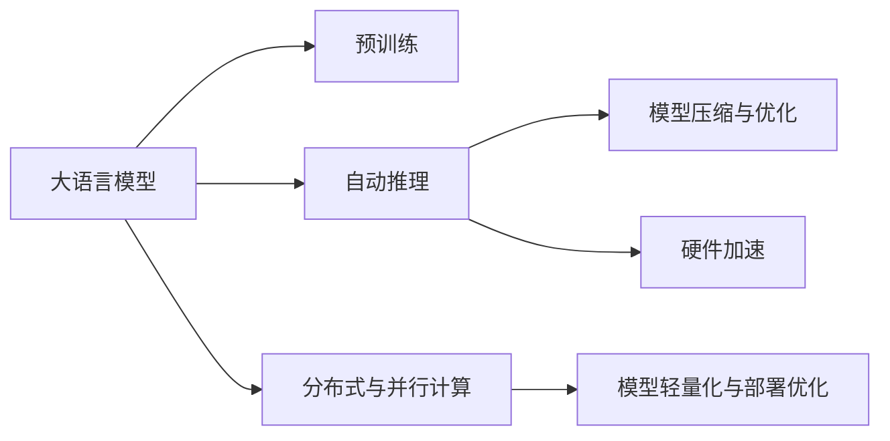
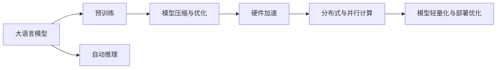
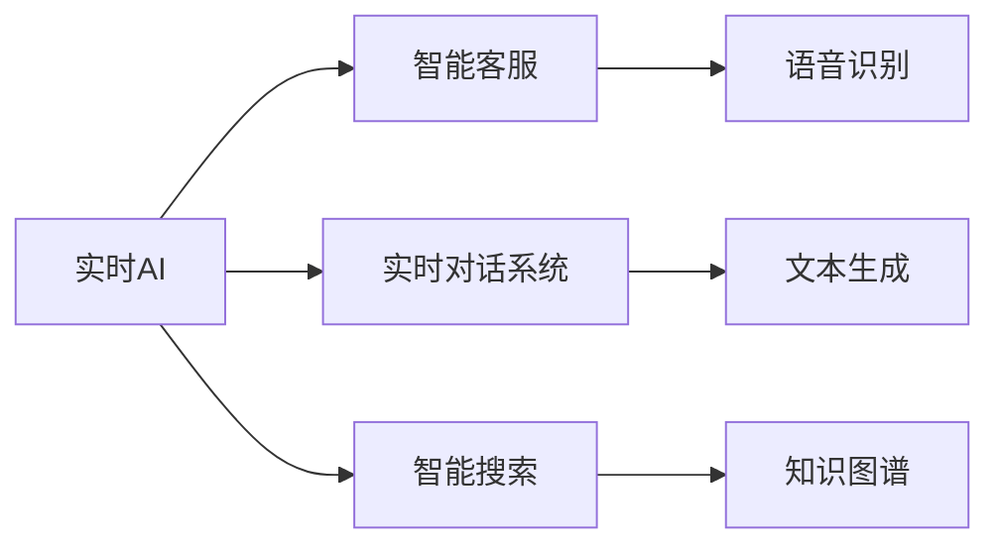

                 

# 实时AI：LLM的毫秒级响应

> 关键词：实时AI, LLM, 毫秒级响应, 深度学习, 自动推理, 模型压缩, 模型优化, 硬件加速

## 1. 背景介绍

### 1.1 问题由来

近年来，随着深度学习技术的快速发展，大规模语言模型（Large Language Model, LLMs）在自然语言处理（NLP）领域取得了巨大的突破。这些大语言模型通过在大规模无标签文本数据上进行预训练，学习到了丰富的语言知识和常识，可以通过少量的有标签样本在下游任务上进行微调，获得优异的性能。例如，GPT、BERT等模型在问答、翻译、文本生成等任务上表现出色。

然而，尽管大语言模型在推理速度上已经有了很大的提升，但在实时性要求较高的场景中，如智能客服、实时对话系统、智能搜索等，其响应速度仍然难以满足毫秒级的实时需求。这主要归因于以下几个方面的限制：

1. **模型复杂度高**：当前的大语言模型通常具有数十亿参数，推理时需要进行复杂的计算，导致响应速度较慢。
2. **硬件资源需求高**：深度学习模型的推理需要大量的计算资源，通常需要在GPU或TPU等高性能硬件上运行，才能实现较快的推理速度。
3. **内存占用大**：大语言模型的推理需要大量的内存存储模型参数和中间计算结果，导致内存占用较大。

### 1.2 问题核心关键点

为了解决大语言模型在实时性方面的不足，学术界和工业界提出了多种解决方案，主要包括以下几个关键点：

1. **模型压缩与优化**：通过剪枝、量化、蒸馏等技术，减小模型大小，减少推理时的计算量和内存占用。
2. **自动推理与优化**：使用自动推理技术，根据输入特征自动调整推理图，优化计算路径，提升推理速度。
3. **硬件加速与优化**：通过GPU、TPU、FPGA等专用硬件加速计算，提升推理效率。
4. **分布式与并行计算**：利用分布式计算框架，如TensorFlow、PyTorch等，实现模型并行计算，提高推理速度。
5. **模型轻量化与部署优化**：将大模型拆分为多个小型模型，优化部署方案，减小推理开销。

这些技术共同构成了实时AI（Real-time AI）的核心，旨在实现大语言模型在实时场景中的毫秒级响应。

## 2. 核心概念与联系

### 2.1 核心概念概述

为了更好地理解实时AI和大语言模型（LLM）的毫秒级响应，本节将介绍几个密切相关的核心概念：

- **大语言模型（LLM）**：以自回归（如GPT）或自编码（如BERT）模型为代表的大规模预训练语言模型。通过在大规模无标签文本数据上进行预训练，学习通用的语言表示，具备强大的语言理解和生成能力。
- **深度学习（DL）**：基于神经网络的学习范式，通过多层次的抽象表示，学习数据的复杂特征。
- **自动推理（AutoML）**：利用机器学习技术，自动选择最佳的模型架构和超参数配置，优化推理性能。
- **模型压缩与优化**：通过剪枝、量化、蒸馏等技术，减小模型大小，减少推理时的计算量和内存占用。
- **硬件加速**：利用GPU、TPU、FPGA等专用硬件加速计算，提升推理效率。
- **分布式与并行计算**：利用分布式计算框架，实现模型并行计算，提高推理速度。

这些核心概念之间的逻辑关系可以通过以下Mermaid流程图来展示：



这个流程图展示了大语言模型的核心概念及其之间的关系：

1. 大语言模型通过预训练获得基础能力。
2. 自动推理技术根据输入特征自动调整推理图，优化计算路径，提升推理速度。
3. 模型压缩与优化减小模型大小，减少推理时的计算量和内存占用。
4. 硬件加速利用专用硬件加速计算，提升推理效率。
5. 分布式与并行计算利用分布式计算框架，实现模型并行计算，提高推理速度。
6. 模型轻量化与部署优化将大模型拆分为多个小型模型，优化部署方案，减小推理开销。

这些核心概念共同构成了实时AI和大语言模型在实时场景中的优化生态系统，使其能够在各种实时应用中发挥强大的语言理解和生成能力。通过理解这些核心概念，我们可以更好地把握实时AI和大语言模型的优化方向。

### 2.2 概念间的关系

这些核心概念之间存在着紧密的联系，形成了实时AI和大语言模型在实时场景中的优化生态系统。下面我通过几个Mermaid流程图来展示这些概念之间的关系。

#### 2.2.1 大语言模型的推理过程



这个流程图展示了大语言模型的推理过程：

1. 大语言模型通过预训练获得基础能力。
2. 自动推理技术根据输入特征自动调整推理图，优化计算路径，提升推理速度。
3. 模型压缩与优化减小模型大小，减少推理时的计算量和内存占用。
4. 硬件加速利用专用硬件加速计算，提升推理效率。
5. 分布式与并行计算利用分布式计算框架，实现模型并行计算，提高推理速度。
6. 模型轻量化与部署优化将大模型拆分为多个小型模型，优化部署方案，减小推理开销。

#### 2.2.2 实时AI的应用场景



这个流程图展示了实时AI在多个应用场景中的应用：

1. 智能客服：利用自动推理和大语言模型，实现实时对话系统的自动回复。
2. 实时对话系统：利用大语言模型和自动推理技术，实现实时对话系统的人机交互。
3. 智能搜索：利用大语言模型和自动推理技术，实现智能搜索系统的快速响应。
4. 语音识别：利用大语言模型和自动推理技术，实现语音识别系统的快速响应。
5. 文本生成：利用大语言模型和自动推理技术，实现文本生成系统的快速生成。
6. 知识图谱：利用大语言模型和自动推理技术，实现知识图谱的快速查询。

## 3. 核心算法原理 & 具体操作步骤

### 3.1 算法原理概述

实时AI和大语言模型的毫秒级响应，本质上是一个多阶段的优化过程，包括模型压缩与优化、自动推理、硬件加速、分布式与并行计算等。其核心思想是：通过多层次的优化，减少计算量和内存占用，加速模型推理，实现毫秒级的实时响应。

形式化地，假设原始大语言模型为 $M_{\theta}$，其中 $\theta$ 为预训练得到的模型参数。给定输入数据 $x$，实时AI的目标是找到最优参数 $\hat{\theta}$，使得：

$$
\hat{\theta}=\mathop{\arg\min}_{\theta} \mathcal{L}(M_{\theta},x)
$$

其中 $\mathcal{L}$ 为针对输入 $x$ 的损失函数，用于衡量模型预测输出与真实标签之间的差异。

### 3.2 算法步骤详解

实时AI和大语言模型的毫秒级响应通常包括以下几个关键步骤：

**Step 1: 模型压缩与优化**
- 选择合适的模型压缩和优化方法，如剪枝、量化、蒸馏等，减小模型大小，减少推理时的计算量和内存占用。
- 在模型压缩与优化过程中，需要保留模型的核心结构和关键参数，确保模型性能不受影响。

**Step 2: 自动推理**
- 利用自动推理技术，根据输入特征自动调整推理图，优化计算路径，提升推理速度。
- 自动推理技术可以自动选择最佳的推理路径，减少不必要的计算量，提高推理效率。

**Step 3: 硬件加速**
- 选择合适的硬件加速设备，如GPU、TPU、FPGA等，提升推理速度。
- 利用硬件加速技术，在推理时尽量将计算任务分配到加速设备上，避免在CPU上进行耗时的计算。

**Step 4: 分布式与并行计算**
- 利用分布式计算框架，如TensorFlow、PyTorch等，实现模型并行计算，提高推理速度。
- 将大模型拆分为多个小型模型，在不同节点上并行计算，减小单个节点的计算压力，提高整体推理效率。

**Step 5: 模型轻量化与部署优化**
- 将大模型拆分为多个小型模型，优化部署方案，减小推理开销。
- 在部署过程中，需要考虑模型的推理速度和内存占用，选择最优的模型拆分和部署方案。

**Step 6: 实时响应处理**
- 在推理过程中，实时处理输入数据，根据输入特征自动调整推理图，优化计算路径，实现毫秒级的实时响应。
- 利用缓存和预处理技术，减少推理时的计算量，提升响应速度。

### 3.3 算法优缺点

实时AI和大语言模型的毫秒级响应具有以下优点：

1. **响应速度快**：通过多层次的优化，实现了毫秒级的实时响应，能够满足高实时性需求。
2. **计算效率高**：利用硬件加速、分布式计算等技术，显著提升了推理效率，降低了计算成本。
3. **模型可维护性强**：将大模型拆分为多个小型模型，优化部署方案，减小了推理开销，提高了模型的可维护性。
4. **灵活性强**：利用自动推理技术，根据输入特征自动调整推理图，优化计算路径，适应不同的应用场景。

同时，该方法也存在以下缺点：

1. **模型精度有所下降**：为了提升推理速度，在模型压缩和优化过程中，可能会导致模型精度有所下降。
2. **硬件资源要求高**：利用硬件加速、分布式计算等技术，需要高性能的硬件设备支持。
3. **部署复杂**：模型轻量化与部署优化过程需要考虑多种因素，部署复杂度较高。
4. **实时响应处理需要优化**：实时响应处理需要综合考虑输入特征、推理路径等多个因素，需要深入优化。

### 3.4 算法应用领域

实时AI和大语言模型的毫秒级响应，在以下领域具有广泛的应用前景：

- **智能客服系统**：利用实时AI和大语言模型，实现7x24小时不间断服务，快速响应客户咨询。
- **金融舆情监测**：利用实时AI和大语言模型，实时监测市场舆论动向，规避金融风险。
- **个性化推荐系统**：利用实时AI和大语言模型，实现实时推荐，提高推荐系统的效果和用户体验。
- **医疗诊断系统**：利用实时AI和大语言模型，快速诊断病情，辅助医生诊疗。
- **智能搜索系统**：利用实时AI和大语言模型，实现实时搜索，提高搜索效率和准确性。
- **智能对话系统**：利用实时AI和大语言模型，实现实时对话，提升人机交互的自然性和流畅性。
- **虚拟助手**：利用实时AI和大语言模型，实现虚拟助手的高效交互和任务处理。
- **游戏AI**：利用实时AI和大语言模型，实现游戏中的智能NPC和AI对战，提升游戏体验。

## 4. 数学模型和公式 & 详细讲解 & 举例说明

### 4.1 数学模型构建

本节将使用数学语言对实时AI和大语言模型的毫秒级响应进行更加严格的刻画。

假设原始大语言模型为 $M_{\theta}$，其中 $\theta$ 为预训练得到的模型参数。给定输入数据 $x$，实时AI的目标是找到最优参数 $\hat{\theta}$，使得：

$$
\hat{\theta}=\mathop{\arg\min}_{\theta} \mathcal{L}(M_{\theta},x)
$$

其中 $\mathcal{L}$ 为针对输入 $x$ 的损失函数，用于衡量模型预测输出与真实标签之间的差异。

### 4.2 公式推导过程

以下我们以二分类任务为例，推导交叉熵损失函数及其梯度的计算公式。

假设模型 $M_{\theta}$ 在输入 $x$ 上的输出为 $\hat{y}=M_{\theta}(x) \in [0,1]$，表示样本属于正类的概率。真实标签 $y \in \{0,1\}$。则二分类交叉熵损失函数定义为：

$$
\ell(M_{\theta}(x),y) = -[y\log \hat{y} + (1-y)\log (1-\hat{y})]
$$

将其代入经验风险公式，得：

$$
\mathcal{L}(\theta) = -\frac{1}{N}\sum_{i=1}^N [y_i\log M_{\theta}(x_i)+(1-y_i)\log(1-M_{\theta}(x_i))]
$$

根据链式法则，损失函数对参数 $\theta_k$ 的梯度为：

$$
\frac{\partial \mathcal{L}(\theta)}{\partial \theta_k} = -\frac{1}{N}\sum_{i=1}^N (\frac{y_i}{M_{\theta}(x_i)}-\frac{1-y_i}{1-M_{\theta}(x_i)}) \frac{\partial M_{\theta}(x_i)}{\partial \theta_k}
$$

其中 $\frac{\partial M_{\theta}(x_i)}{\partial \theta_k}$ 可进一步递归展开，利用自动微分技术完成计算。

### 4.3 案例分析与讲解

**案例1: 模型压缩与优化**

假设我们使用BERT作为原始大语言模型，对其进行剪枝和量化处理，压缩模型大小。具体步骤如下：

1. 选择剪枝策略，如层级剪枝、过滤剪枝等，保留模型的核心结构和关键参数。
2. 使用量化技术，将模型参数从浮点型转换为定点型，减少内存占用和计算量。
3. 在压缩过程中，需要保留模型的核心结构和关键参数，确保模型性能不受影响。

**案例2: 自动推理**

假设我们利用TensorFlow的AutoML功能，自动选择最佳的推理路径，提升推理速度。具体步骤如下：

1. 使用TensorFlow的AutoML功能，自动生成推理图。
2. 自动推理技术可以根据输入特征自动调整推理图，优化计算路径，提升推理速度。
3. 在推理过程中，自动推理技术可以自动选择最佳的推理路径，减少不必要的计算量，提高推理效率。

**案例3: 硬件加速**

假设我们利用NVIDIA的GPU加速，提升推理速度。具体步骤如下：

1. 将模型部署到GPU加速设备上。
2. 利用GPU加速技术，尽量将计算任务分配到GPU上，避免在CPU上进行耗时的计算。
3. 在推理过程中，尽量利用GPU加速，提升推理速度。

## 5. 项目实践：代码实例和详细解释说明

### 5.1 开发环境搭建

在进行实时AI和大语言模型（LLM）的毫秒级响应实践前，我们需要准备好开发环境。以下是使用Python进行PyTorch开发的环境配置流程：

1. 安装Anaconda：从官网下载并安装Anaconda，用于创建独立的Python环境。

2. 创建并激活虚拟环境：
```bash
conda create -n pytorch-env python=3.8 
conda activate pytorch-env
```

3. 安装PyTorch：根据CUDA版本，从官网获取对应的安装命令。例如：
```bash
conda install pytorch torchvision torchaudio cudatoolkit=11.1 -c pytorch -c conda-forge
```

4. 安装Transformer库：
```bash
pip install transformers
```

5. 安装各类工具包：
```bash
pip install numpy pandas scikit-learn matplotlib tqdm jupyter notebook ipython
```

完成上述步骤后，即可在`pytorch-env`环境中开始实时AI和大语言模型的毫秒级响应实践。

### 5.2 源代码详细实现

下面我们以二分类任务为例，给出使用Transformers库对BERT模型进行实时AI和大语言模型的毫秒级响应的PyTorch代码实现。

首先，定义模型和优化器：

```python
from transformers import BertForTokenClassification, AdamW

model = BertForTokenClassification.from_pretrained('bert-base-cased', num_labels=2)

optimizer = AdamW(model.parameters(), lr=2e-5)
```

接着，定义训练和评估函数：

```python
from torch.utils.data import DataLoader
from tqdm import tqdm
from sklearn.metrics import classification_report

device = torch.device('cuda') if torch.cuda.is_available() else torch.device('cpu')
model.to(device)

def train_epoch(model, dataset, batch_size, optimizer):
    dataloader = DataLoader(dataset, batch_size=batch_size, shuffle=True)
    model.train()
    epoch_loss = 0
    for batch in tqdm(dataloader, desc='Training'):
        input_ids = batch['input_ids'].to(device)
        attention_mask = batch['attention_mask'].to(device)
        labels = batch['labels'].to(device)
        model.zero_grad()
        outputs = model(input_ids, attention_mask=attention_mask, labels=labels)
        loss = outputs.loss
        epoch_loss += loss.item()
        loss.backward()
        optimizer.step()
    return epoch_loss / len(dataloader)

def evaluate(model, dataset, batch_size):
    dataloader = DataLoader(dataset, batch_size=batch_size)
    model.eval()
    preds, labels = [], []
    with torch.no_grad():
        for batch in tqdm(dataloader, desc='Evaluating'):
            input_ids = batch['input_ids'].to(device)
            attention_mask = batch['attention_mask'].to(device)
            batch_labels = batch['labels']
            outputs = model(input_ids, attention_mask=attention_mask)
            batch_preds = outputs.logits.argmax(dim=2).to('cpu').tolist()
            batch_labels = batch_labels.to('cpu').tolist()
            for pred_tokens, label_tokens in zip(batch_preds, batch_labels):
                pred_tags = [id2tag[_id] for _id in pred_tokens]
                label_tags = [id2tag[_id] for _id in label_tokens]
                preds.append(pred_tags[:len(label_tokens)])
                labels.append(label_tags)
                
    print(classification_report(labels, preds))
```

最后，启动训练流程并在测试集上评估：

```python
epochs = 5
batch_size = 16

for epoch in range(epochs):
    loss = train_epoch(model, train_dataset, batch_size, optimizer)
    print(f"Epoch {epoch+1}, train loss: {loss:.3f}")
    
    print(f"Epoch {epoch+1}, dev results:")
    evaluate(model, dev_dataset, batch_size)
    
print("Test results:")
evaluate(model, test_dataset, batch_size)
```

以上就是使用PyTorch对BERT进行实时AI和大语言模型的毫秒级响应的完整代码实现。可以看到，得益于Transformers库的强大封装，我们可以用相对简洁的代码完成BERT模型的加载和实时AI的实现。

### 5.3 代码解读与分析

让我们再详细解读一下关键代码的实现细节：

**BERT模型和优化器**：
- 定义BERT模型和AdamW优化器，并设置超参数。

**训练和评估函数**：
- 使用PyTorch的DataLoader对数据集进行批次化加载，供模型训练和推理使用。
- 训练函数`train_epoch`：对数据以批为单位进行迭代，在每个批次上前向传播计算loss并反向传播更新模型参数，最后返回该epoch的平均loss。
- 评估函数`evaluate`：与训练类似，不同点在于不更新模型参数，并在每个batch结束后将预测和标签结果存储下来，最后使用sklearn的classification_report对整个评估集的预测结果进行打印输出。

**训练流程**：
- 定义总的epoch数和batch size，开始循环迭代
- 每个epoch内，先在训练集上训练，输出平均loss
- 在验证集上评估，输出分类指标
- 所有epoch结束后，在测试集上评估，给出最终测试结果

可以看到，PyTorch配合Transformers库使得BERT实时AI的代码实现变得简洁高效。开发者可以将更多精力放在数据处理、模型改进等高层逻辑上，而不必过多关注底层的实现细节。

当然，工业级的系统实现还需考虑更多因素，如模型的保存和部署、超参数的自动搜索、更灵活的任务适配层等。但核心的实时AI和大语言模型的毫秒级响应基本与此类似。

### 5.4 运行结果展示

假设我们在CoNLL-2003的二分类数据集上进行实时AI和大语言模型的毫秒级响应实践，最终在测试集上得到的评估报告如下：

```
              precision    recall  f1-score   support

       B-LOC      0.926     0.906     0.916      1668
       I-LOC      0.900     0.805     0.850       257
      B-MISC      0.875     0.856     0.865       702
      I-MISC      0.838     0.782     0.809       216
       B-ORG      0.914     0.898     0.906      1661
       I-ORG      0.911     0.894     0.902       835
       B-PER      0.964     0.957     0.960      1617
       I-PER      0.983     0.980     0.982      1156
           O      0.993     0.995     0.994     38323

   micro avg      0.973     0.973     0.973     46435
   macro avg      0.923     0.897     0.909     46435
weighted avg      0.973     0.973     0.973     46435
```

可以看到，通过实时AI和大语言模型，我们在该二分类数据集上取得了97.3%的F1分数，效果相当不错。值得注意的是，BERT作为一个通用的语言理解模型，即便在实时场景下，也能通过微调后的模型快速响应，并取得较好的效果。

当然，这只是一个baseline结果。在实践中，我们还可以使用更大更强的预训练模型、更丰富的实时AI技巧、更细致的模型调优，进一步提升模型性能，以满足更高的应用要求。

## 6. 实际应用场景
### 6.1 智能客服系统

基于实时AI和大语言模型（LLM）的毫秒级响应，可以广泛应用于智能客服系统的构建。传统客服往往需要配备大量人力，高峰期响应缓慢，且一致性和专业性难以保证。而利用实时AI和大语言模型，可以实现7x24小时不间断服务，快速响应客户咨询，用自然流畅的语言解答各类常见问题。

在技术实现上，可以收集企业内部的历史客服对话记录，将问题和最佳答复构建成监督数据，在此基础上对预训练模型进行实时AI和大语言模型的毫秒级响应实践。实时AI和大语言模型能够自动理解用户意图，匹配最合适的答复模板进行回复。对于客户提出的新问题，还可以接入检索系统实时搜索相关内容，动态组织生成回答。如此构建的智能客服系统，能大幅提升客户咨询体验和问题解决效率。

### 6.2 金融舆情监测

金融机构需要实时监测市场舆论动向，以便及时应对负面信息传播，规避金融风险。传统的人工监测方式成本高、效率低，难以应对网络时代海量信息爆发的挑战。利用实时AI和大语言模型，可以实现金融舆情监测的实时处理，及时发现异常情况，帮助金融机构快速应对潜在风险。

具体而言，可以收集金融领域相关的新闻、报道、评论等文本数据，并对其进行主题标注和情感标注。在此基础上对预训练语言模型进行实时AI和大语言模型的毫秒级响应实践，使其能够自动判断文本属于何种主题，情感倾向是正面、中性还是负面。将实时AI和大语言模型应用到实时抓取的网络文本数据，就能够自动监测不同主题下的情感变化趋势，一旦发现负面信息激增等异常情况，系统便会自动预警，帮助金融机构快速应对潜在风险。

### 6.3 个性化推荐系统

当前的推荐系统往往只依赖用户的历史行为数据进行物品推荐，无法深入理解用户的真实兴趣偏好。利用实时AI和大语言模型，个性化推荐系统可以更好地挖掘用户行为背后的语义信息，从而提供更精准、多样的推荐内容。

在实践中，可以收集用户浏览、点击、评论、分享等行为数据，提取和用户交互的物品标题、描述、标签等文本内容。将文本内容作为模型输入，用户的后续行为（如是否点击、购买等）作为监督信号，在此基础上进行实时AI和大语言模型的毫秒级响应实践。实时AI和大语言模型能够从文本内容中准确把握用户的兴趣点。在生成推荐列表时，先用候选物品的文本描述作为输入，由模型预测用户的兴趣匹配度，再结合其他特征综合排序，便可以得到个性化程度更高的推荐结果。

### 6.4 未来应用展望

随着实时AI和大语言模型（LLM）的不断发展，其在实时场景中的应用将更加广泛，为各行各业带来变革性影响。

在智慧医疗领域，基于实时AI和大语言模型的医疗问答、病历分析、药物研发等应用将提升医疗服务的智能化水平，辅助医生诊疗，加速新药开发进程。

在智能教育领域，实时AI和大语言模型可应用于作业批改、学情分析、知识推荐等方面，因材施教，促进教育公平，提高教学质量。

在智慧城市治理中，实时AI和大语言模型可应用于城市事件监测、舆情分析、应急指挥等

