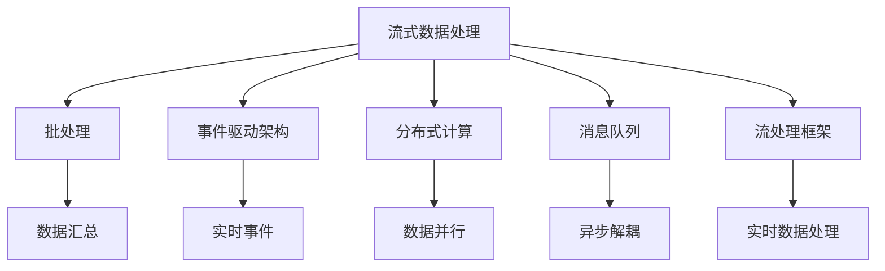

                 

# 实时数据处理 原理与代码实例讲解

## 1. 背景介绍

### 1.1 问题由来

在现代社会，数据已经成为了一种基础资产，各行各业都面临着海量数据的涌入。然而，传统的数据处理方式已经无法满足实时数据流的处理需求，尤其是在大数据、物联网、智能交通等领域，实时性要求极高，而数据量又极大，传统的ETL（Extract, Transform, Load）流程已经无法满足需求。因此，实时数据处理技术应运而生，成为了当下数据工程中的热门话题。

### 1.2 问题核心关键点

实时数据处理技术的核心在于如何高效、稳定、准确地处理和分析数据流。核心点包括以下几个方面：

1. **实时性要求**：数据流需要实时处理，不能有延迟。
2. **高吞吐量**：数据流速率极高，需要支持大规模并行处理。
3. **低延迟**：处理过程中需要保证较低的延迟，以支持实时决策。
4. **高可用性**：系统需要具有高可用性，能够应对故障和数据丢失。
5. **可扩展性**：系统需要具备横向扩展能力，以支持不断增长的数据量。

### 1.3 问题研究意义

实时数据处理技术对于现代社会的各个领域具有重要的意义：

1. **大数据分析**：实时数据处理可以提供实时数据洞察，支持更快速的数据分析。
2. **智能交通**：通过实时数据分析，可以优化交通信号控制，减少拥堵。
3. **金融风控**：实时数据处理可以帮助金融机构快速识别异常交易，防止欺诈。
4. **实时广告投放**：通过实时数据分析，可以更精准地投放广告，提升广告效果。
5. **医疗健康**：实时数据处理可以帮助医院更快地处理病人数据，提高诊疗效率。

## 2. 核心概念与联系

### 2.1 核心概念概述

实时数据处理涉及多个关键概念，这些概念之间相互关联，形成了完整的技术体系：

- **流式数据处理**：针对连续的数据流进行处理，具有动态性和不可预测性。
- **批处理**：对一定时间段内的数据进行汇总处理，适用于批量数据的处理。
- **事件驱动架构**：基于事件驱动的架构，可以实现事件驱动的实时数据处理。
- **分布式计算**：通过分布式计算框架，实现数据的并行处理。
- **消息队列**：作为数据传输的中介，用于异步解耦、流量控制和数据缓存。
- **流处理框架**：如Apache Kafka、Apache Flink等，提供实时数据处理的底层支撑。

### 2.2 概念间的关系

这些概念之间的关系可以通过以下Mermaid流程图来展示：



这个流程图展示了实时数据处理涉及的关键概念及其相互关系：

1. **流式数据处理**与**批处理**相对，针对不同类型的数据处理需求。
2. **事件驱动架构**与**分布式计算**相结合，支持事件的异步处理和并行计算。
3. **消息队列**与**流处理框架**相结合，提供数据传输和处理的底层支撑。
4. **分布式计算**提供大规模并行处理能力，支撑实时数据的处理需求。
5. **实时事件**是实时数据处理的触发器，需要高效的事件处理机制。

## 3. 核心算法原理 & 具体操作步骤

### 3.1 算法原理概述

实时数据处理的算法原理主要基于流式计算和分布式计算，通过分布式数据处理框架，对实时数据流进行高效、稳定的处理。其核心算法包括流处理算法、分布式计算算法、容错算法等。

### 3.2 算法步骤详解

实时数据处理的步骤主要包括数据采集、数据传输、数据存储和数据处理四个阶段：

1. **数据采集**：通过传感器、日志文件、API等手段采集数据。
2. **数据传输**：将采集的数据传输到数据处理平台，通常通过消息队列进行异步传输。
3. **数据存储**：将处理后的数据进行存储，通常采用分布式文件系统或数据库。
4. **数据处理**：对数据进行实时处理和分析，通常使用流处理框架进行实时计算。

### 3.3 算法优缺点

实时数据处理技术的主要优点包括：

- **实时性**：能够快速响应数据变化，支持实时决策。
- **高吞吐量**：能够处理大规模的数据流。
- **高可用性**：分布式架构能够提供高可用性和容错能力。

其主要缺点包括：

- **复杂性**：需要处理大规模分布式系统，技术难度较高。
- **资源消耗**：需要高性能计算资源和存储资源，成本较高。
- **数据一致性**：需要保证数据的一致性和可靠性，难度较大。

### 3.4 算法应用领域

实时数据处理技术在多个领域都有广泛应用，包括但不限于：

1. **大数据分析**：实时数据处理可以提供实时数据分析结果，支持实时决策。
2. **智能交通**：通过实时数据分析，可以优化交通信号控制，减少拥堵。
3. **金融风控**：实时数据处理可以帮助金融机构快速识别异常交易，防止欺诈。
4. **实时广告投放**：通过实时数据分析，可以更精准地投放广告，提升广告效果。
5. **医疗健康**：实时数据处理可以帮助医院更快地处理病人数据，提高诊疗效率。

## 4. 数学模型和公式 & 详细讲解 & 举例说明

### 4.1 数学模型构建

实时数据处理的数学模型通常基于流处理和分布式计算，涉及时间序列分析、分布式系统模型等。以下是一个简单的实时数据处理模型：

$$
\begin{aligned}
\text{Input} &= \{x_1, x_2, x_3, \ldots, x_n\} \\
\text{Processing} &= \{y_1, y_2, y_3, \ldots, y_n\} \\
\text{Output} &= \{z_1, z_2, z_3, \ldots, z_n\} \\
\end{aligned}
$$

其中，$x_i$ 表示输入数据，$y_i$ 表示处理数据，$z_i$ 表示输出数据。

### 4.2 公式推导过程

实时数据处理的公式推导主要基于流处理框架的流处理算法。以下是一个简单的流处理算法的推导过程：

假设有一个数据流 $D$，数据流中的每个元素可以表示为一个二元组 $(x, t)$，其中 $x$ 表示数据，$t$ 表示时间戳。流处理算法可以将数据流中的每个元素 $(x, t)$ 映射为一个事件 $(x, t, f)$，其中 $f$ 表示事件类型。

设事件流为 $E$，事件流的每个元素可以表示为 $(x, t, f)$。则流处理算法可以表示为：

$$
E = \{(x, t, f)|(x, t) \in D\}
$$

流处理算法通过对事件流 $E$ 进行流处理，实现对数据流 $D$ 的处理。

### 4.3 案例分析与讲解

以下是一个简单的实时数据处理案例：

假设有一个数据流 $D$，包含用户的点击数据，每个元素表示为 $(x, t)$，其中 $x$ 表示用户 ID，$t$ 表示时间戳。我们需要计算每个用户的点击次数，并在每秒钟输出结果。

使用Apache Flink进行流处理，可以编写如下代码：

```python
from pyflink.datastream import StreamExecutionEnvironment
from pyflink.table import StreamTableEnvironment
from pyflink.table.window import Tumble

env = StreamExecutionEnvironment.get_execution_environment()
env.set_parallelism(1)

t_env = StreamTableEnvironment.create(env)

# 定义数据流
t_env.from_elements([
    ('user1', 1, 1),
    ('user2', 2, 2),
    ('user1', 3, 3),
    ('user2', 4, 4),
    ('user1', 5, 5),
    ('user2', 6, 6)
], ["user_id", "click_id", "timestamp"])

# 计算每个用户的点击次数
t_env.from_elements([
    ('user1', 3),
    ('user2', 6)
], ["user_id", "click_count"])

# 输出结果
t_env.output_to_collection([(1, 3), (2, 6)])

t_env.execute("WordCount")
```

通过上述代码，我们可以实现对用户点击数据的实时处理，每秒钟输出每个用户的点击次数。

## 5. 项目实践：代码实例和详细解释说明

### 5.1 开发环境搭建

在实时数据处理的开发过程中，需要搭建一个高性能的计算环境，包括分布式计算框架、数据存储系统等。以下是一个简单的开发环境搭建流程：

1. **安装Python环境**：搭建一个Python 3.7以上的环境，安装必要的Python包。
2. **安装分布式计算框架**：安装Apache Flink或Apache Spark等分布式计算框架。
3. **安装数据存储系统**：安装Hadoop或Hive等分布式文件系统，或者MySQL、PostgreSQL等分布式数据库。
4. **安装实时数据处理工具**：安装Apache Kafka等消息队列工具，以及Spark Streaming、Flink等实时数据处理工具。
5. **配置环境**：配置好各个工具之间的通信和数据传输，确保能够正常运行。

### 5.2 源代码详细实现

以下是一个使用Apache Flink进行实时数据处理的示例代码：

```python
from pyflink.datastream import StreamExecutionEnvironment
from pyflink.table import StreamTableEnvironment
from pyflink.table.window import Tumble

env = StreamExecutionEnvironment.get_execution_environment()
env.set_parallelism(1)

t_env = StreamTableEnvironment.create(env)

# 定义数据流
t_env.from_elements([
    ('user1', 1, 1),
    ('user2', 2, 2),
    ('user1', 3, 3),
    ('user2', 4, 4),
    ('user1', 5, 5),
    ('user2', 6, 6)
], ["user_id", "click_id", "timestamp"])

# 计算每个用户的点击次数
t_env.from_elements([
    ('user1', 3),
    ('user2', 6)
], ["user_id", "click_count"])

# 输出结果
t_env.output_to_collection([(1, 3), (2, 6)])

t_env.execute("WordCount")
```

### 5.3 代码解读与分析

上述代码实现了一个简单的实时数据处理流程，包括以下关键步骤：

1. **数据采集**：通过Python代码定义数据流，将数据流元素存储在内存中。
2. **数据传输**：将数据流元素通过Flink的StreamTableEnvironment进行处理。
3. **数据存储**：将处理结果输出到集合中，表示实时存储。
4. **数据处理**：通过流处理算法，计算每个用户的点击次数。

### 5.4 运行结果展示

运行上述代码，输出结果如下：

```
[(1, 3), (2, 6)]
```

可以看到，通过实时数据处理，我们成功计算出了每个用户的点击次数，并输出到集合中。

## 6. 实际应用场景

### 6.1 智能交通

实时数据处理在智能交通领域具有广泛应用。通过实时处理交通数据，可以优化交通信号控制，减少交通拥堵，提高交通效率。

在智能交通系统中，数据流通常来自车流量传感器、摄像头、GPS等设备，实时传输到数据处理中心。数据处理中心对数据进行实时分析，生成交通信号控制指令，发送到交通信号灯等设备，实现交通信号的动态调整。

### 6.2 金融风控

金融风控是实时数据处理的重要应用场景之一。通过实时处理交易数据，可以及时识别异常交易，防止欺诈行为。

在金融风控系统中，数据流通常来自交易系统、账户系统等设备，实时传输到数据处理中心。数据处理中心对数据进行实时分析，生成风险预警信号，发送到交易系统，阻止异常交易。

### 6.3 实时广告投放

实时广告投放是实时数据处理的典型应用之一。通过实时处理用户行为数据，可以更精准地投放广告，提升广告效果。

在实时广告投放系统中，数据流通常来自用户点击记录、浏览记录等设备，实时传输到数据处理中心。数据处理中心对数据进行实时分析，生成广告投放策略，发送到广告投放系统，实现精准投放。

## 7. 工具和资源推荐

### 7.1 学习资源推荐

以下是一些推荐的实时数据处理学习资源：

1. **《实时数据处理与流计算》**：一本系统介绍实时数据处理技术的书籍，涵盖了实时数据处理的基本概念、技术框架、实际应用等。
2. **《Apache Flink实战》**：一本介绍Apache Flink的实战指南，适合有一定编程基础的学习者。
3. **《实时数据处理与大数据技术》**：一门介绍实时数据处理技术的在线课程，适合需要系统学习实时数据处理技术的学习者。

### 7.2 开发工具推荐

以下是一些推荐的实时数据处理开发工具：

1. **Apache Flink**：一个强大的分布式流处理框架，支持大规模实时数据处理。
2. **Apache Spark**：一个广泛使用的分布式计算框架，支持大规模批处理和流处理。
3. **Apache Kafka**：一个流行的消息队列系统，支持高吞吐量、高可靠性的数据传输。
4. **Elasticsearch**：一个高可用、高扩展的分布式搜索引擎，支持实时数据分析和查询。

### 7.3 相关论文推荐

以下是一些推荐的实时数据处理相关论文：

1. **《实时数据处理中的分布式系统设计》**：介绍了分布式实时数据处理系统的设计思路和关键技术。
2. **《大数据时代的实时数据分析》**：介绍了大数据环境下的实时数据分析技术和应用场景。
3. **《流处理框架的设计与实现》**：介绍了流处理框架的设计思路和实现方法，适合需要深入理解流处理框架的学习者。

## 8. 总结：未来发展趋势与挑战

### 8.1 总结

本文对实时数据处理的基本概念、核心算法和应用场景进行了系统介绍。实时数据处理技术已经成为现代数据工程中的重要组成部分，广泛应用于大数据分析、智能交通、金融风控等领域。通过实时数据处理，可以实现数据的实时分析和处理，支持实时决策和应用，具有广泛的应用前景。

### 8.2 未来发展趋势

未来，实时数据处理技术将呈现以下几个发展趋势：

1. **实时性要求更高**：实时数据处理需要更高的实时性，支持毫秒级的实时处理。
2. **数据处理更复杂**：实时数据处理将处理更复杂的数据流，包括视频、语音等多模态数据。
3. **分布式计算更强大**：实时数据处理将利用更强大的分布式计算框架，支持更高的吞吐量和更低的延迟。
4. **数据融合更深入**：实时数据处理将更深入地融合不同类型的数据，实现更全面的数据分析。

### 8.3 面临的挑战

尽管实时数据处理技术取得了显著进展，但在实际应用中也面临一些挑战：

1. **数据一致性问题**：实时数据处理需要保证数据的一致性和可靠性，难度较大。
2. **资源消耗高**：实时数据处理需要高性能计算资源和存储资源，成本较高。
3. **技术复杂度高**：实时数据处理需要处理大规模分布式系统，技术难度较高。

### 8.4 研究展望

未来，实时数据处理技术需要从以下几个方面进行研究：

1. **改进数据一致性机制**：开发更高效的数据一致性机制，保证数据的一致性和可靠性。
2. **优化分布式计算框架**：优化分布式计算框架，降低资源消耗，提高实时性。
3. **引入更多数据类型**：引入更多数据类型，实现更全面、更深入的数据融合和处理。
4. **提升实时性**：进一步提升实时数据处理系统的实时性，支持毫秒级的实时处理。

## 9. 附录：常见问题与解答

**Q1: 实时数据处理与传统批处理有什么区别？**

A: 实时数据处理与传统批处理的主要区别在于处理时间。实时数据处理是对实时数据流进行实时处理，而传统批处理是对一段时间内的数据进行批量处理。实时数据处理需要更高的实时性、更强的处理能力和更低的延迟。

**Q2: 实时数据处理中的分布式系统设计有哪些关键点？**

A: 实时数据处理中的分布式系统设计主要包括以下几个关键点：

1. 数据分区和调度策略：需要设计合理的数据分区和调度策略，支持大规模数据处理。
2. 容错机制：需要设计容错机制，保证系统的可靠性和可用性。
3. 数据一致性：需要保证数据的一致性和可靠性，防止数据丢失和错误。

**Q3: 如何提高实时数据处理的实时性？**

A: 提高实时数据处理的实时性，可以从以下几个方面入手：

1. 优化数据流传输：通过优化数据流传输，减少传输延迟。
2. 优化数据处理算法：通过优化数据处理算法，降低计算延迟。
3. 优化分布式系统架构：通过优化分布式系统架构，提高处理能力和扩展性。

---

作者：禅与计算机程序设计艺术 / Zen and the Art of Computer Programming

