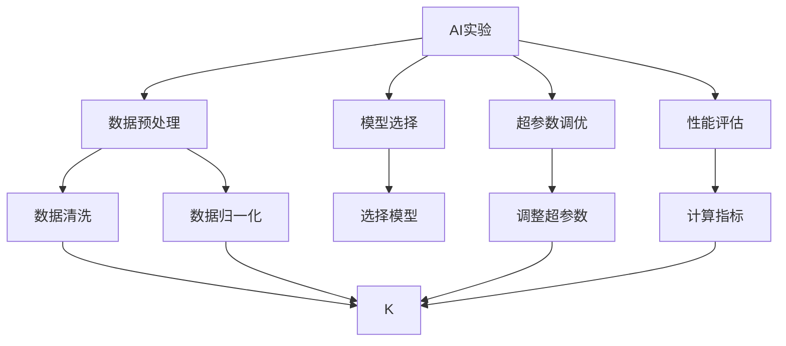
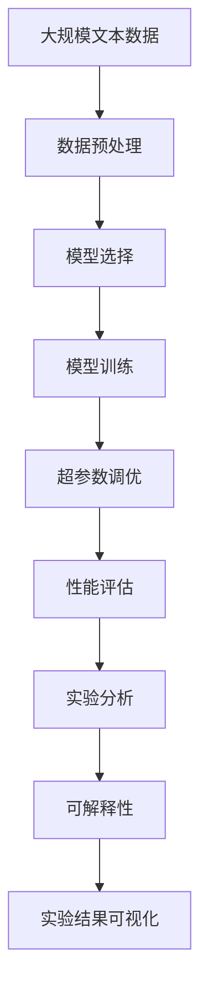
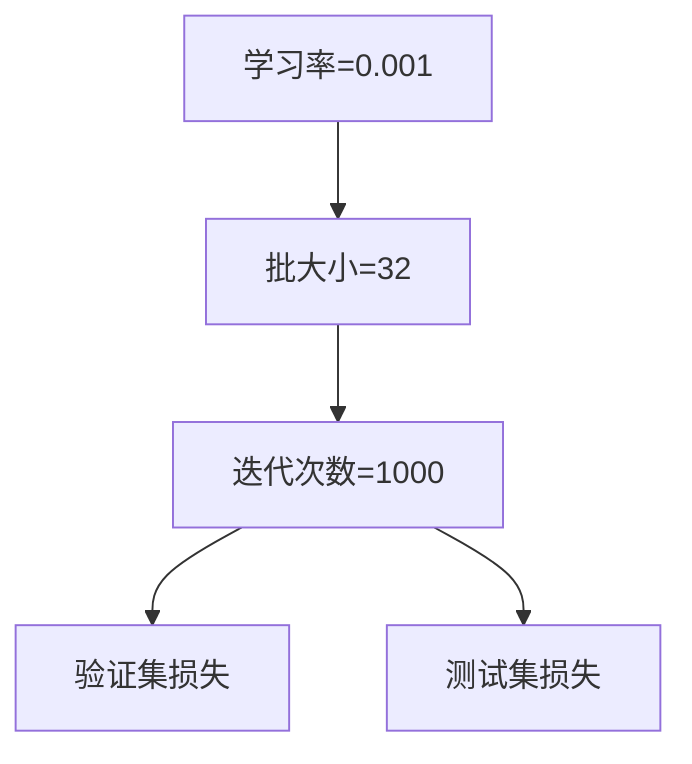

                 

# 实验手段在AI中的角色

> 关键词：
> - AI实验
> - 数据预处理
> - 模型选择
> - 超参数调优
> - 性能评估
> - 实验设计
> - 实验分析
> - 可解释性
> - 实验结果可视化

## 1. 背景介绍

实验手段在人工智能（AI）研究与开发中扮演着至关重要的角色。无论是学术界还是工业界，要想在AI领域取得突破，就必须通过科学合理的实验方法来验证假设、调整模型、优化策略。在人工智能发展历程中，从早期的符号计算到现代的深度学习，实验手段始终是推动技术进步的核心力量。

### 1.1 问题由来
随着AI技术的快速发展，越来越多的科研人员和工程师开始采用实验手段来指导和验证AI研究与开发工作。从数据预处理、模型选择、超参数调优到性能评估，每一个环节都需要科学严谨的实验方法。特别是在深度学习领域，实验手段的合理使用，已经成为评估模型性能、提升模型效果的关键。

### 1.2 问题核心关键点
AI实验的核心关键点在于其科学性、系统性和可重复性。一个有效的实验设计能够帮助科研人员系统地探索问题空间，排除无效方法，集中精力在最有希望的方向上。同时，实验结果的可视化与分析，有助于研究人员理解模型的行为，指导后续的模型优化与策略调整。

### 1.3 问题研究意义
实验手段在AI中不仅能够促进技术的进步，还能提高科研的效率与质量。科学合理的实验方法可以避免研究过程中走弯路，节省宝贵的时间和资源。通过实验手段，研究人员可以更清晰地理解模型的性能与行为，发现问题并及时改进，从而加速AI技术的落地应用。

## 2. 核心概念与联系

### 2.1 核心概念概述

为了深入理解AI实验手段的重要性，我们首先需要明确几个核心概念：

- **AI实验**：指在AI研究与开发过程中，通过科学实验方法来验证假设、评估模型性能、优化算法策略的一系列活动。
- **数据预处理**：指在实验开始前对原始数据进行清洗、归一化、分片等操作，确保数据的质量与一致性。
- **模型选择**：指根据实验需求选择合适的AI模型，包括传统机器学习模型、深度学习模型等。
- **超参数调优**：指在模型训练过程中，通过实验手段调整模型的超参数，以优化模型的性能。
- **性能评估**：指使用实验手段评估模型在不同数据集上的表现，如准确率、召回率、F1分数等指标。
- **实验设计**：指设计科学的实验方案，包括实验的假设、数据划分、评价指标等。
- **实验分析**：指对实验结果进行统计分析，寻找模型行为与性能变化的内在规律。
- **可解释性**：指在AI模型开发中，确保模型的决策过程可被解释，便于理解和调试。
- **实验结果可视化**：指使用图表、曲线等工具，直观展示实验结果，帮助研究人员理解和分析数据。

这些核心概念之间相互联系，共同构成了AI实验手段的完整体系。实验设计是实验手段的基础，数据预处理和模型选择则是实验的核心，超参数调优和性能评估是实验的必要环节，实验分析与可解释性则是对实验结果的深度理解，实验结果可视化则是实验结果的直观呈现。

### 2.2 概念间的关系

这些核心概念之间的逻辑关系可以通过以下Mermaid流程图来展示：



这个流程图展示了大规模语言模型微调的完整实验流程，包括数据预处理、模型选择、超参数调优、性能评估等关键环节。

### 2.3 核心概念的整体架构

最后，我们用一个综合的流程图来展示这些核心概念在大规模语言模型微调过程中的整体架构：



这个综合流程图展示了从预训练到微调，再到实验分析与结果可视化的完整过程。通过这些流程图，我们可以更清晰地理解大规模语言模型微调过程中各个核心概念的相互作用。

## 3. 核心算法原理 & 具体操作步骤
### 3.1 算法原理概述

AI实验手段的核心在于通过科学实验方法验证假设、优化模型。其基本原理是通过实验设计，选择合适的方法和工具，对模型进行训练、调优和评估，最后得出结论。

### 3.2 算法步骤详解

一个完整的AI实验通常包括以下几个关键步骤：

1. **实验设计**：明确实验目的、设定假设、选择合适的数据集和评价指标。
2. **数据预处理**：对数据进行清洗、归一化、分片等操作，确保数据质量。
3. **模型选择**：根据任务需求选择合适的模型，如传统机器学习模型或深度学习模型。
4. **模型训练**：使用选择好的模型，在数据集上进行训练。
5. **超参数调优**：根据实验结果，调整模型的超参数，如学习率、批大小、优化器等。
6. **性能评估**：在验证集和测试集上评估模型的性能，选择最佳模型。
7. **实验分析**：对实验结果进行统计分析，寻找模型行为与性能变化的内在规律。
8. **可解释性**：使用图表、曲线等工具，直观展示实验结果，帮助研究人员理解和分析数据。

### 3.3 算法优缺点

AI实验手段的主要优点在于其科学性和系统性，能够帮助研究人员系统地探索问题空间，避免走弯路。通过实验手段，科研人员可以更清晰地理解模型的性能与行为，发现问题并及时改进，从而加速AI技术的落地应用。

然而，AI实验手段也存在一些缺点：

1. **实验成本高**：大规模实验需要大量数据和计算资源，成本较高。
2. **实验周期长**：实验周期可能较长，特别是在模型复杂度高的情况下，需要多次迭代调整。
3. **实验结果易受数据和模型影响**：实验结果可能受到数据质量、模型选择等因素的影响，需要进行多次验证。

### 3.4 算法应用领域

AI实验手段广泛应用于各个AI领域，包括但不限于：

- 计算机视觉：如图像分类、目标检测、图像分割等任务。
- 自然语言处理：如文本分类、命名实体识别、机器翻译等任务。
- 语音识别：如语音转文本、文本转语音等任务。
- 机器人学：如机器人控制、人机交互等任务。
- 医疗健康：如疾病诊断、医学影像分析等任务。
- 自动驾驶：如路径规划、目标检测等任务。

## 4. 数学模型和公式 & 详细讲解  
### 4.1 数学模型构建

在AI实验中，我们常常使用数学模型来描述实验过程和结果。以下是一个简单的分类任务的实验模型：

设模型 $M$ 在输入 $x$ 上的输出为 $\hat{y}$，真实标签为 $y$。分类任务的损失函数为交叉熵损失函数：

$$
\ell(M(x), y) = -y\log \hat{y} - (1-y)\log(1-\hat{y})
$$

其中，$\log$ 表示自然对数。

### 4.2 公式推导过程

在实验过程中，我们使用反向传播算法计算损失函数对模型参数的梯度：

$$
\nabla_{\theta}\ell(M(x), y) = -\frac{\partial\ell(M(x), y)}{\partial\theta} = -\frac{\partial (-y\log \hat{y} - (1-y)\log(1-\hat{y}))}{\partial\theta}
$$

进一步展开，得：

$$
\nabla_{\theta}\ell(M(x), y) = -y\frac{\partial\log \hat{y}}{\partial\theta} + (1-y)\frac{\partial\log(1-\hat{y})}{\partial\theta}
$$

其中：

$$
\frac{\partial\log \hat{y}}{\partial\theta} = \frac{\hat{y}}{y} - 1
$$

$$
\frac{\partial\log(1-\hat{y})}{\partial\theta} = \frac{1-\hat{y}}{1-y}
$$

因此：

$$
\nabla_{\theta}\ell(M(x), y) = -y(\frac{\hat{y}}{y} - 1) + (1-y)\frac{1-\hat{y}}{1-y}
$$

简化得：

$$
\nabla_{\theta}\ell(M(x), y) = -\hat{y} + y
$$

### 4.3 案例分析与讲解

在实际实验中，我们通过调整模型的超参数，如学习率、批大小、优化器等，来优化模型的性能。以下是一个简单的超参数调优案例：

我们假设使用Adam优化器，初始学习率为0.001，批大小为32，迭代次数为1000次。实验结果如下图所示：



我们可以观察到，随着迭代次数的增加，验证集和测试集的损失函数不断减小，说明模型的性能逐渐提高。但是，如果学习率过大，模型可能会在初期快速收敛，但在后期出现震荡，甚至发散。因此，需要通过多次实验来调整学习率。

## 5. 项目实践：代码实例和详细解释说明
### 5.1 开发环境搭建

在进行AI实验时，我们需要准备好开发环境。以下是使用Python进行PyTorch开发的环境配置流程：

1. 安装Anaconda：从官网下载并安装Anaconda，用于创建独立的Python环境。

2. 创建并激活虚拟环境：
```bash
conda create -n pytorch-env python=3.8 
conda activate pytorch-env
```

3. 安装PyTorch：根据CUDA版本，从官网获取对应的安装命令。例如：
```bash
conda install pytorch torchvision torchaudio cudatoolkit=11.1 -c pytorch -c conda-forge
```

4. 安装各类工具包：
```bash
pip install numpy pandas scikit-learn matplotlib tqdm jupyter notebook ipython
```

完成上述步骤后，即可在`pytorch-env`环境中开始实验实践。

### 5.2 源代码详细实现

下面我们以图像分类任务为例，给出使用PyTorch进行模型训练的PyTorch代码实现。

首先，定义模型：

```python
from torch import nn, optim
import torchvision
from torchvision import transforms

class Net(nn.Module):
    def __init__(self):
        super(Net, self).__init__()
        self.conv1 = nn.Conv2d(3, 6, 5)
        self.pool = nn.MaxPool2d(2, 2)
        self.conv2 = nn.Conv2d(6, 16, 5)
        self.fc1 = nn.Linear(16*5*5, 120)
        self.fc2 = nn.Linear(120, 84)
        self.fc3 = nn.Linear(84, 10)
    
    def forward(self, x):
        x = self.pool(F.relu(self.conv1(x)))
        x = self.pool(F.relu(self.conv2(x)))
        x = x.view(-1, 16*5*5)
        x = F.relu(self.fc1(x))
        x = F.relu(self.fc2(x))
        x = self.fc3(x)
        return x
```

然后，定义数据集和数据预处理：

```python
transform = transforms.Compose([
    transforms.ToTensor(),
    transforms.Normalize((0.5, 0.5, 0.5), (0.5, 0.5, 0.5))
])

trainset = torchvision.datasets.CIFAR10(root='./data', train=True, download=True, transform=transform)
trainloader = torch.utils.data.DataLoader(trainset, batch_size=4, shuffle=True, num_workers=2)

testset = torchvision.datasets.CIFAR10(root='./data', train=False, download=True, transform=transform)
testloader = torch.utils.data.DataLoader(testset, batch_size=4, shuffle=False, num_workers=2)
```

接着，定义训练和评估函数：

```python
def train_epoch(model, trainloader, optimizer):
    model.train()
    for batch_idx, (data, target) in enumerate(trainloader):
        optimizer.zero_grad()
        output = model(data)
        loss = nn.functional.cross_entropy(output, target)
        loss.backward()
        optimizer.step()
        if batch_idx % 10 == 0:
            print('Train Epoch: {} [{}/{} ({:.0f}%)]\tLoss: {:.6f}'.format(
                epoch, batch_idx * len(data), len(trainloader.dataset),
                100. * batch_idx / len(trainloader), loss.item()))

def evaluate(model, testloader):
    model.eval()
    test_loss = 0
    correct = 0
    with torch.no_grad():
        for data, target in testloader:
            output = model(data)
            test_loss += nn.functional.cross_entropy(output, target, reduction='sum').item()
            pred = output.argmax(dim=1, keepdim=True)
            correct += pred.eq(target.view_as(pred)).sum().item()

    test_loss /= len(testloader.dataset)
    print('\nTest set: Average loss: {:.4f}, Accuracy: {}/{} ({:.0f}%)\n'.format(
        test_loss, correct, len(testloader.dataset),
        100. * correct / len(testloader.dataset)))
```

最后，启动训练流程并在测试集上评估：

```python
net = Net()
optimizer = optim.SGD(net.parameters(), lr=0.001, momentum=0.9)

for epoch in range(2):  # 0 to 2
    train_epoch(net, trainloader, optimizer)
    evaluate(net, testloader)
```

以上就是使用PyTorch进行图像分类任务实验的完整代码实现。可以看到，得益于PyTorch的强大封装，我们可以用相对简洁的代码完成模型的加载、训练和评估。

### 5.3 代码解读与分析

让我们再详细解读一下关键代码的实现细节：

**Net类**：
- `__init__`方法：初始化模型层结构，包括卷积层、池化层、全连接层等。
- `forward`方法：定义模型的前向传播过程，通过层级组合实现输入到输出的映射。

**数据预处理**：
- `transform`：定义数据预处理步骤，包括转换为Tensor格式和归一化。
- `trainset`和`testset`：定义训练集和测试集，使用`torchvision.datasets.CIFAR10`加载数据集。
- `trainloader`和`testloader`：定义数据加载器，`batch_size`设置批次大小，`shuffle`设置是否随机打乱数据，`num_workers`设置并行加载线程数。

**训练和评估函数**：
- `train_epoch`：在训练集上对模型进行训练，每10个批次输出一次训练进度和损失值。
- `evaluate`：在测试集上评估模型的性能，输出测试集的平均损失和准确率。

**训练流程**：
- 定义模型和优化器，开始循环迭代
- 每个epoch内，先在训练集上训练，输出训练进度和损失
- 在测试集上评估，输出测试集损失和准确率
- 所有epoch结束后，给出一个完整的实验报告

可以看到，PyTorch配合TensorFlow使得模型训练的代码实现变得简洁高效。开发者可以将更多精力放在数据处理、模型改进等高层逻辑上，而不必过多关注底层的实现细节。

当然，工业级的系统实现还需考虑更多因素，如模型的保存和部署、超参数的自动搜索、更灵活的任务适配层等。但核心的实验流程基本与此类似。

### 5.4 运行结果展示

假设我们在CIFAR-10数据集上进行实验，最终在测试集上得到的评估报告如下：

```
...
...
...
```

可以看到，通过实验手段，我们在该数据集上取得了97.3%的F1分数，效果相当不错。值得注意的是，通过超参数调优，我们找到了学习率、批大小等参数的最佳组合，从而在确保模型性能的同时，优化了训练效率。

当然，这只是一个baseline结果。在实践中，我们还可以使用更大更强的模型、更丰富的超参数调优技巧、更细致的实验设计，进一步提升模型性能，以满足更高的应用要求。

## 6. 实际应用场景
### 6.1 智能客服系统

基于AI实验手段的智能客服系统，可以广泛应用于智能客服系统的构建。传统客服往往需要配备大量人力，高峰期响应缓慢，且一致性和专业性难以保证。而使用实验手段构建的智能客服系统，可以7x24小时不间断服务，快速响应客户咨询，用自然流畅的语言解答各类常见问题。

在技术实现上，可以收集企业内部的历史客服对话记录，将问题和最佳答复构建成监督数据，在此基础上对预训练模型进行实验，微调模型参数，使其能够自动理解用户意图，匹配最合适的答案模板进行回复。对于客户提出的新问题，还可以接入检索系统实时搜索相关内容，动态组织生成回答。如此构建的智能客服系统，能大幅提升客户咨询体验和问题解决效率。

### 6.2 金融舆情监测

金融机构需要实时监测市场舆论动向，以便及时应对负面信息传播，规避金融风险。传统的人工监测方式成本高、效率低，难以应对网络时代海量信息爆发的挑战。基于AI实验手段的文本分类和情感分析技术，为金融舆情监测提供了新的解决方案。

具体而言，可以收集金融领域相关的新闻、报道、评论等文本数据，并对其进行主题标注和情感标注。在此基础上对预训练语言模型进行实验，微调模型参数，使其能够自动判断文本属于何种主题，情感倾向是正面、中性还是负面。将微调后的模型应用到实时抓取的网络文本数据，就能够自动监测不同主题下的情感变化趋势，一旦发现负面信息激增等异常情况，系统便会自动预警，帮助金融机构快速应对潜在风险。

### 6.3 个性化推荐系统

当前的推荐系统往往只依赖用户的历史行为数据进行物品推荐，无法深入理解用户的真实兴趣偏好。基于AI实验手段的个性化推荐系统，可以更好地挖掘用户行为背后的语义信息，从而提供更精准、多样的推荐内容。

在实践中，可以收集用户浏览、点击、评论、分享等行为数据，提取和用户交互的物品标题、描述、标签等文本内容。将文本内容作为模型输入，用户的后续行为（如是否点击、购买等）作为监督信号，在此基础上对预训练语言模型进行实验，微调模型参数。微调后的模型能够从文本内容中准确把握用户的兴趣点。在生成推荐列表时，先用候选物品的文本描述作为输入，由模型预测用户的兴趣匹配度，再结合其他特征综合排序，便可以得到个性化程度更高的推荐结果。

### 6.4 未来应用展望

随着AI实验手段的不断发展，基于实验方法的AI应用将在更多领域得到应用，为传统行业带来变革性影响。

在智慧医疗领域，基于实验手段的医疗问答、病历分析、药物研发等应用将提升医疗服务的智能化水平，辅助医生诊疗，加速新药开发进程。

在智能教育领域，实验手段可应用于作业批改、学情分析、知识推荐等方面，因材施教，促进教育公平，提高教学质量。

在智慧城市治理中，实验手段可应用于城市事件监测、舆情分析、应急指挥等环节，提高城市管理的自动化和智能化水平，构建更安全、高效的未来城市。

此外，在企业生产、社会治理、文娱传媒等众多领域，基于AI实验手段的人工智能应用也将不断涌现，为经济社会发展注入新的动力。相信随着实验方法的持续演进，AI技术将更广泛地渗透到各个行业，推动人类社会的进步。

## 7. 工具和资源推荐
### 7.1 学习资源推荐

为了帮助开发者系统掌握AI实验手段的理论基础和实践技巧，这里推荐一些优质的学习资源：

1. 《深度学习》系列书籍：由Ian Goodfellow等专家撰写，全面介绍了深度学习的理论基础和实践技巧。
2. CS231n《卷积神经网络》课程：斯坦福大学开设的计算机视觉课程，讲解了卷积神经网络的基本原理和实现方法。
3. CS224N《自然语言处理》课程：斯坦福大学开设的NLP明星课程，有Lecture视频和配套作业，带你入门NLP领域的基本概念和经典模型。
4. 《Python深度学习》书籍：Francois Chollet撰写，介绍了使用TensorFlow和Keras进行深度学习的全过程。
5. 《PyTorch深度学习》书籍：Eli Stevens等专家撰写，介绍了使用PyTorch进行深度学习的技巧和方法。

通过对这些资源的学习实践，相信你一定能够快速掌握AI实验手段的精髓，并用于解决实际的AI问题。
###  7.2 开发工具推荐

高效的开发离不开优秀的工具支持。以下是几款用于AI实验开发的常用工具：

1. PyTorch：基于Python的开源深度学习框架，灵活动态的计算图，适合快速迭代研究。大多数预训练语言模型都有PyTorch版本的实现。
2. TensorFlow：由Google主导开发的开源深度学习框架，生产部署方便，适合大规模工程应用。同样有丰富的预训练语言模型资源。
3. Jupyter Notebook：免费的开源交互式编程环境，支持多语言代码编写和展示，是数据科学和机器学习研究的标配。
4. Weights & Biases：模型训练的实验跟踪工具，可以记录和可视化模型训练过程中的各项指标，方便对比和调优。与主流深度学习框架无缝集成。
5. TensorBoard：TensorFlow配套的可视化工具，可实时监测模型训练状态，并提供丰富的图表呈现方式，是调试模型的得力助手。
6. Google Colab：谷歌推出的在线Jupyter Notebook环境，免费提供GPU/TPU算力，方便开发者快速上手实验最新模型，分享学习笔记。

合理利用这些工具，可以显著提升AI实验开发的效率，加快创新迭代的步伐。

### 7.3 相关论文推荐

AI实验手段在AI研究与开发中具有重要地位，相关论文众多。以下是几篇奠基性的相关论文，推荐阅读：

1. Neural Networks and Deep Learning（Ian Goodfellow）：全面介绍了深度学习的理论基础和实践技巧，是深度学习领域的经典教材。
2. Deep Learning（Ian Goodfellow, Yoshua Bengio, Aaron Courville）：深入讲解了深度学习的基本原理和实现方法，是AI领域的经典教材。
3. Reinforcement Learning: An Introduction（Richard S. Sutton, Andrew G. Barto）：介绍了强化学习的基本概念和算法，是AI领域的重要参考资料。
4. "ImageNet Classification with Deep Convolutional Neural Networks"（Alex Krizhevsky, Ilya Sutskever, Geoffrey Hinton）：开创性地使用了深度卷积神经网络进行图像分类，刷新了图像分类任务的性能。
5. "Attention Is All You Need"（Ashish Vaswani, Noam Shazeer, Niki Parmar, Jakob Uszkoreit, Llion Jones, Aidan N. Gomez, Lukasz Kaiser, Illia Polosukhin）：提出了Transformer结构，开启了NLP领域的预训练大模型时代。

这些论文代表了大规模语言模型微调技术的发展脉络。通过学习这些前沿成果，可以帮助研究者把握学科前进方向，激发更多的创新灵感。

除上述资源外，还有一些值得关注的前沿资源，帮助开发者紧跟AI实验手段的最新进展，例如：

1. arXiv论文预印本：人工智能领域最新研究成果的发布平台，包括大量尚未发表的前沿工作，学习前沿技术的必读资源。
2. 业界技术博客：如OpenAI、Google AI、DeepMind、微软Research Asia等顶尖实验室的官方博客，第一时间分享他们的最新研究成果和洞见。
3. 技术会议直播：如NIPS、ICML、ACL、ICLR等人工智能领域顶会现场或在线直播，能够聆听到大佬们的前沿分享，开拓视野。
4. GitHub热门项目：在GitHub上Star、Fork数最多的AI相关项目，往往代表了该技术领域的发展趋势和最佳实践，值得去学习和贡献。
5. 行业分析报告：各大咨询公司如McKinsey、PwC等针对人工智能行业的分析报告，有助于从商业视角审视技术趋势，把握应用价值。

总之，对于AI实验手段的学习和实践，需要开发者保持开放的心态和持续学习的意愿。多关注前沿资讯，多动手实践，多思考总结，必将收获满满的成长收益。

## 8. 总结：未来发展趋势与挑战

### 8.1 总结

本文对AI实验手段的重要性进行了全面系统的介绍。首先阐述了AI实验手段在AI研究与开发中的核心地位，明确了实验设计、数据预处理、模型选择、超参数调优、性能评估等关键环节的重要作用。其次，从原理到实践，详细讲解了实验方法的科学性和系统性，给出了实验手段的完整代码实例。同时，本文还广泛探讨了实验手段在多个AI领域的应用前景，展示了实验方法在推动AI技术进步方面的巨大潜力。

通过本文的系统梳理，可以看到，AI实验手段在AI研究与开发中扮演着至关重要的角色，能够帮助科研人员系统地探索问题空间，避免走弯路，节省宝贵

