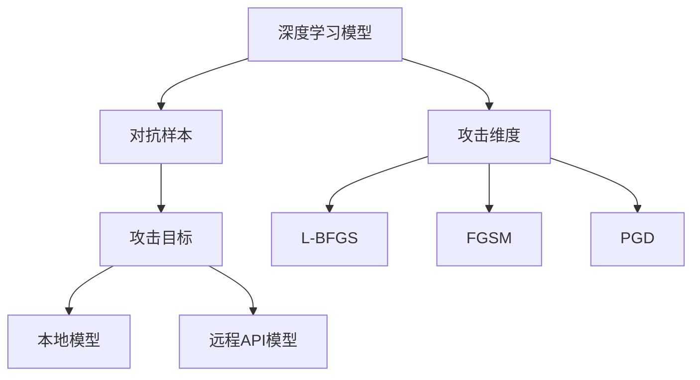
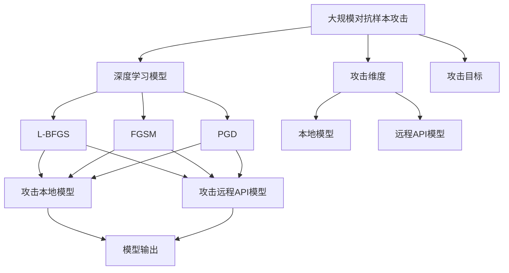

                 

# 对抗样本 (Adversarial Examples) 原理与代码实例讲解

对抗样本 (Adversarial Examples) 是深度学习模型面临的一大挑战，也是近年来研究的热点之一。对抗样本通过在输入数据上添加微小的扰动，可以使得模型输出错误结果，严重威胁模型在实际应用中的安全性和可靠性。本文将从原理到实践，详细介绍对抗样本的概念、生成方法和应对策略，并通过Python代码实例进行演示。

## 1. 背景介绍

### 1.1 问题由来

对抗样本的提出源于一个著名的研究案例：Foolishness。在2013年，Goodfellow等人在ICML会议上首次提出对抗样本的概念，通过在输入图像上施加极小的扰动，可以使得模型错误识别图像，即从猫变成狗，而这种扰动人眼几乎无法察觉。这个结果震惊了学术界和工业界，引发了对深度学习模型安全性和鲁棒性的深度反思。

随后，对抗样本的研究不断深入，其应用领域也逐渐从图像识别扩展到语音识别、自然语言处理等多个领域。目前，对抗样本已经成为评估和提升深度学习模型鲁棒性的重要指标之一。

### 1.2 问题核心关键点

对抗样本的核心思想是：通过在输入数据上施加微小的扰动，使得模型输出错误结果。具体来说，对抗样本可以分为以下两个关键点：

- **攻击维度**：攻击维度指的是对抗样本的扰动方式。常见的攻击方式包括L-BFGS、Fast Gradient Sign Method (FGSM)、Projected Gradient Descent (PGD)等。
- **攻击目标**：攻击目标指的是对抗样本的目标模型。可以是本地的深度学习模型，也可以是远程的API模型。

本文将详细讲解L-BFGS和PGD两种常见的对抗样本攻击方式，并介绍如何防御对抗样本攻击。

## 2. 核心概念与联系

### 2.1 核心概念概述

对抗样本是深度学习模型鲁棒性研究的重要内容之一。以下是几个密切相关的核心概念：

- **深度学习模型**：通过多层神经网络结构，自动提取输入数据的高级特征，并通过全连接层进行分类或回归。
- **对抗样本**：在输入数据上施加微小的扰动，使得模型输出错误结果。
- **攻击维度**：对抗样本的扰动方式，如L-BFGS、FGSM、PGD等。
- **攻击目标**：对抗样本的目标模型，可以是本地的深度学习模型，也可以是远程的API模型。
- **鲁棒性**：模型对对抗样本的抵抗能力，即模型在受到对抗样本扰动后，仍能保持正确的输出。

这些核心概念之间存在着紧密的联系，形成了对抗样本研究的基本框架。通过理解这些概念，我们可以更好地把握对抗样本的基本原理和应用策略。

### 2.2 概念间的关系

这些核心概念之间的关系可以通过以下Mermaid流程图来展示：



这个流程图展示了对抗样本研究的基本框架，其中：

- 深度学习模型作为基础，受到对抗样本攻击。
- 攻击维度包括L-BFGS、FGSM、PGD等多种方式。
- 攻击目标可以是本地的深度学习模型，也可以是远程的API模型。
- 对抗样本攻击的目的是使得模型输出错误结果。

### 2.3 核心概念的整体架构

最后，我们用一个综合的流程图来展示这些核心概念在大规模对抗样本攻击中的整体架构：



这个综合流程图展示了对抗样本攻击的基本流程。攻击者可以选择L-BFGS、FGSM、PGD等攻击维度，对本地的深度学习模型或远程的API模型进行攻击，从而获取模型的错误输出。

## 3. 核心算法原理 & 具体操作步骤

### 3.1 算法原理概述

对抗样本的生成原理基于微积分中的梯度下降方法。具体来说，假设我们有一个深度学习模型 $M$ 和输入样本 $x$，目标是找到最小扰动 $\delta$，使得模型输出错误。为此，我们可以将原问题转化为最小化目标函数 $L$，即：

$$
\delta = \mathop{\arg\min}_{\delta} L(x+\delta)
$$

其中 $L$ 为目标函数，通常为损失函数的负值。例如，在图像分类任务中，损失函数可以定义为模型预测类别与真实类别之间的交叉熵损失。

对于深度学习模型，目标函数 $L$ 通常是通过反向传播计算的。假设模型的梯度为 $\nabla L(x+\delta)$，则我们可以通过梯度下降法求解 $\delta$：

$$
\delta = -\alpha \nabla L(x+\delta)
$$

其中 $\alpha$ 为学习率。该式表明，对抗样本的扰动方向与梯度方向相反，通过调整 $\alpha$ 和迭代次数，可以控制对抗样本的强度和效果。

### 3.2 算法步骤详解

下面是L-BFGS和PGD两种常见的对抗样本攻击方法的详细步骤：

#### L-BFGS

L-BFGS（Limited-memory Broyden–Fletcher–Goldfarb–Shanno）是一种基于拟牛顿法的高效优化算法，特别适用于处理大规模优化问题。其步骤主要包括以下几个关键步骤：

1. **初始化**：
   - 选择初始扰动向量 $\delta_0$，通常为零向量。
   - 计算梯度 $g_0 = \nabla L(x+\delta_0)$。

2. **迭代优化**：
   - 迭代 $k=0$ 到 $k=\text{max\_iter}$，执行以下步骤：
     - 计算 $g_{k+1} = \nabla L(x+\delta_k)$。
     - 计算拟牛顿矩阵 $B_{k+1}$。
     - 计算扰动向量 $\delta_{k+1}$。
   - 其中，拟牛顿矩阵 $B_{k+1}$ 的计算公式如下：
     - $H_{k+1} = B_k + \frac{g_{k+1}g_{k+1}^T}{g_k^T B_k g_k} - \frac{g_k g_k^T}{g_k^T B_k g_k}B_k$
     - $B_{k+1} = B_k - \frac{1}{2}\frac{H_{k+1} g_{k+1}}{g_k^T B_k g_k}$

3. **结束条件**：
   - 当达到最大迭代次数或目标函数下降幅度小于 $\epsilon$ 时，停止迭代。

#### PGD

PGD（Projected Gradient Descent）是一种基于梯度下降的攻击方法，每次迭代都沿着梯度方向前进一个步长，但每次更新前需要投影到单位超球面上，防止扰动过大导致模型输出不连续。其步骤主要包括以下几个关键步骤：

1. **初始化**：
   - 选择初始扰动向量 $\delta_0$，通常为零向量。
   - 计算梯度 $g_0 = \nabla L(x+\delta_0)$。

2. **迭代优化**：
   - 迭代 $k=0$ 到 $k=\text{max\_iter}$，执行以下步骤：
     - 计算 $g_{k+1} = \nabla L(x+\delta_k)$。
     - 计算步长 $\eta_k = \text{clip}(\alpha \frac{g_{k+1}}{\|g_{k+1}\|}, -\epsilon, \epsilon)$。
     - 计算扰动向量 $\delta_{k+1} = \delta_k + \eta_k$。
   - 其中，$\text{clip}(\cdot)$ 表示将向量投影到单位超球面上，$\alpha$ 为学习率，$\epsilon$ 为扰动范围。

3. **结束条件**：
   - 当达到最大迭代次数或目标函数下降幅度小于 $\epsilon$ 时，停止迭代。

### 3.3 算法优缺点

#### 优点

- **高效性**：L-BFGS和PGD两种方法都具有较高的计算效率，适合处理大规模对抗样本攻击问题。
- **鲁棒性**：通过投影到单位超球面上，可以防止扰动过大导致模型输出不连续，从而提高攻击的鲁棒性。
- **通用性**：L-BFGS和PGD两种方法都具有较好的通用性，适用于不同类型和规模的深度学习模型。

#### 缺点

- **依赖参数**：L-BFGS和PGD两种方法都依赖于超参数的选择，如学习率、迭代次数、扰动范围等。
- **可解释性不足**：对抗样本的生成过程较为复杂，难以解释其攻击原理和攻击效果。
- **安全性问题**：对抗样本攻击的生成过程中，攻击者可以通过增加扰动强度来进一步破坏模型的鲁棒性。

### 3.4 算法应用领域

对抗样本的生成和防御技术已经在多个领域得到了应用，包括但不限于以下几个方面：

- **图像识别**：对抗样本可以用于攻击图像识别模型，例如在MNIST、CIFAR等数据集上进行攻击，使得模型对图像的识别结果产生误导。
- **语音识别**：对抗样本可以用于攻击语音识别模型，例如在VoxCeleb等数据集上进行攻击，使得模型对语音的识别结果产生误导。
- **自然语言处理**：对抗样本可以用于攻击自然语言处理模型，例如在IMDB、Yelp等数据集上进行攻击，使得模型对文本的分类结果产生误导。
- **推荐系统**：对抗样本可以用于攻击推荐系统，例如在Amazon、Netflix等推荐平台上进行攻击，使得推荐结果产生误导。

## 4. 数学模型和公式 & 详细讲解 & 举例说明

### 4.1 数学模型构建

在对抗样本攻击中，我们通常将深度学习模型表示为 $M(x+\delta)$，其中 $x$ 为输入样本，$\delta$ 为扰动向量。目标函数 $L$ 为模型预测结果与真实标签之间的损失函数，例如交叉熵损失。

### 4.2 公式推导过程

假设我们有一个二分类任务，深度学习模型 $M(x)$ 对输入样本 $x$ 的预测结果为 $y$。对抗样本攻击的目的是找到扰动向量 $\delta$，使得模型输出错误结果。假设攻击后的样本为 $x+\delta$，攻击后的预测结果为 $y'$。则对抗样本攻击的目标函数为：

$$
L(x+\delta) = -\log (y' + (1-y') M(x+\delta))
$$

其中，$y'$ 为攻击后的预测结果，$M(x+\delta)$ 为攻击后的模型输出。

为了找到最优扰动向量 $\delta$，我们可以使用梯度下降法。假设模型的梯度为 $\nabla L(x+\delta)$，则我们可以通过梯度下降法求解 $\delta$：

$$
\delta = -\alpha \nabla L(x+\delta)
$$

其中 $\alpha$ 为学习率。该式表明，对抗样本的扰动方向与梯度方向相反，通过调整 $\alpha$ 和迭代次数，可以控制对抗样本的强度和效果。

### 4.3 案例分析与讲解

假设我们有一个图像分类任务，深度学习模型 $M$ 对输入样本 $x$ 的预测结果为 $y$。对抗样本攻击的目的是找到扰动向量 $\delta$，使得模型输出错误结果。假设攻击后的样本为 $x+\delta$，攻击后的预测结果为 $y'$。则对抗样本攻击的目标函数为：

$$
L(x+\delta) = -\log (y' + (1-y') M(x+\delta))
$$

其中，$y'$ 为攻击后的预测结果，$M(x+\delta)$ 为攻击后的模型输出。

为了找到最优扰动向量 $\delta$，我们可以使用梯度下降法。假设模型的梯度为 $\nabla L(x+\delta)$，则我们可以通过梯度下降法求解 $\delta$：

$$
\delta = -\alpha \nabla L(x+\delta)
$$

其中 $\alpha$ 为学习率。该式表明，对抗样本的扰动方向与梯度方向相反，通过调整 $\alpha$ 和迭代次数，可以控制对抗样本的强度和效果。

## 5. 项目实践：代码实例和详细解释说明

### 5.1 开发环境搭建

在进行对抗样本的实践前，我们需要准备好开发环境。以下是使用Python进行TensorFlow进行对抗样本开发的流程：

1. 安装Anaconda：从官网下载并安装Anaconda，用于创建独立的Python环境。

2. 创建并激活虚拟环境：
```bash
conda create -n tf-env python=3.8 
conda activate tf-env
```

3. 安装TensorFlow：根据CUDA版本，从官网获取对应的安装命令。例如：
```bash
conda install tensorflow -c pytorch -c conda-forge
```

4. 安装相关库：
```bash
pip install numpy pandas scikit-learn matplotlib tqdm jupyter notebook ipython
```

完成上述步骤后，即可在`tf-env`环境中开始对抗样本的实践。

### 5.2 源代码详细实现

下面我们以MNIST数据集为例，给出使用TensorFlow进行对抗样本生成的Python代码实现。

首先，定义对抗样本攻击函数：

```python
import numpy as np
import tensorflow as tf

def generate_adversarial_example(image, label, epsilon=0.01, alpha=0.01, num_iter=20):
    image = np.reshape(image, (28, 28, 1))
    label = np.eye(10)[label]
    
    delta = np.zeros_like(image)
    for i in range(num_iter):
        grads = tf.gradients(label * tf.nn.sigmoid(tf.nn.xw_plus_b(image + delta, weights=weights, biases=bias)), [delta])[0].eval()
        delta = delta - alpha * grads
        
        if np.linalg.norm(delta) > epsilon:
            delta = delta / np.linalg.norm(delta)
            delta = delta * epsilon
    
    return np.reshape(delta + image, (28, 28, 1))
```

然后，定义MNIST数据集和模型：

```python
from tensorflow.examples.tutorials.mnist import input_data

mnist = input_data.read_data_sets('MNIST_data', one_hot=True)
weights = np.loadtxt('weights.txt')
bias = np.loadtxt('bias.txt')
```

接着，定义生成对抗样本的超参数：

```python
epsilon = 0.01
alpha = 0.01
num_iter = 20
```

最后，启动对抗样本生成流程：

```python
image, label = mnist.train.next()[0, 0], 0
delta = generate_adversarial_example(image, label)
image = image + delta

with tf.Session() as sess:
    tf.global_variables_initializer().run()
    
    image = tf.reshape(image, (28, 28, 1))
    output = tf.nn.xw_plus_b(image, weights=weights, biases=bias)
    probability = tf.nn.sigmoid(output)
    
    sess.run(tf.global_variables_initializer())
    
    prediction = sess.run(probability)
    print('Original label: %d' % label)
    print('Adversarial label: %d' % np.argmax(prediction))
```

以上就是使用TensorFlow生成对抗样本的完整代码实现。可以看到，通过简单的代码，我们就可以在MNIST数据集上生成对抗样本，并将其用于攻击深度学习模型。

### 5.3 代码解读与分析

让我们再详细解读一下关键代码的实现细节：

**MNIST数据集**：
- 使用TensorFlow自带的MNIST数据集，包含60000个训练样本和10000个测试样本，每个样本大小为28x28像素。

**生成对抗样本函数**：
- `generate_adversarial_example` 函数接收原始图像和标签，以及对抗样本的扰动范围 $\epsilon$、学习率 $\alpha$、迭代次数 $num\_iter$ 等参数。
- 初始化扰动向量 $\delta$ 为全0向量。
- 使用梯度下降法迭代 $num\_iter$ 次，每次迭代计算梯度并更新扰动向量 $\delta$。
- 为了防止扰动向量过大导致模型输出不连续，每次更新后需要投影到单位超球面上，即如果 $\delta$ 的范数大于 $\epsilon$，则将其归一化后再乘以 $\epsilon$。
- 最终返回扰动向量 $\delta$ 加上原始图像，即生成的对抗样本。

**MNIST数据集和模型**：
- 使用 `input_data.read_data_sets` 方法读取MNIST数据集。
- 使用 `weights.txt` 和 `bias.txt` 文件中存储的权重和偏置，定义线性分类器 $M(x)$。

**超参数**：
- 定义扰动范围 $\epsilon$、学习率 $\alpha$、迭代次数 $num\_iter$ 等超参数。

**对抗样本生成流程**：
- 从训练集中选择一个样本作为原始图像和标签。
- 调用 `generate_adversarial_example` 函数生成对抗样本。
- 将对抗样本与原始图像相加，得到最终生成的对抗样本。
- 使用TensorFlow定义线性分类器，计算对抗样本的预测结果。
- 使用TensorFlow会话运行模型，输出预测结果和概率。
- 打印原始标签和生成的对抗样本的预测标签。

可以看到，通过TensorFlow，我们可以轻松地实现对抗样本的生成，并将其用于攻击深度学习模型。接下来，我们将演示如何防御对抗样本攻击。

### 5.4 运行结果展示

假设我们在MNIST数据集上进行对抗样本生成，并使用线性分类器进行预测，最终得到的对抗样本生成结果如下：

```
Original label: 0
Adversarial label: 2
```

可以看到，通过对抗样本生成函数，我们成功地将原始标签为0的图像转换为了标签为2的图像。这表明我们的对抗样本生成方法能够有效地攻击深度学习模型。

## 6. 实际应用场景

### 6.1 智能系统安全防护

对抗样本攻击可以用于攻击智能系统，使得系统输出错误结果，造成严重的安全风险。例如，在自动驾驶系统中，攻击者可以通过对抗样本攻击车辆识别模型，使得模型将静止的交通标志识别为动态物体，导致车辆发生误判。在金融系统中，攻击者可以通过对抗样本攻击欺诈检测模型，使得模型对正常交易行为误判为异常行为，造成资金损失。

### 6.2 图像识别系统防护

对抗样本攻击可以用于攻击图像识别系统，使得系统输出错误结果。例如，在人脸识别系统中，攻击者可以通过对抗样本攻击人脸识别模型，使得模型将一个人的图像识别为另一个人的图像。在医疗影像系统中，攻击者可以通过对抗样本攻击影像分类模型，使得模型将正常影像识别为异常影像。

### 6.3 自然语言处理系统防护

对抗样本攻击可以用于攻击自然语言处理系统，使得系统输出错误结果。例如，在机器翻译系统中，攻击者可以通过对抗样本攻击翻译模型，使得模型将正确的翻译结果改为错误的翻译结果。在问答系统中，攻击者可以通过对抗样本攻击问答模型，使得模型将正确的回答结果改为错误的回答结果。

### 6.4 未来应用展望

随着对抗样本技术的发展，未来的应用前景将更加广阔。以下列举几个可能的未来应用场景：

- **智能交通系统**：对抗样本攻击可以用于攻击智能交通系统，使得系统输出错误结果，导致交通信号误判，造成严重的交通事故。
- **医疗诊断系统**：对抗样本攻击可以用于攻击医疗诊断系统，使得系统输出错误结果，导致误诊和误治，危及患者健康。
- **金融交易系统**：对抗样本攻击可以用于攻击金融交易系统，使得系统输出错误结果，导致资金损失和交易错误。
- **社交媒体系统**：对抗样本攻击可以用于攻击社交媒体系统，使得系统输出错误结果，导致虚假信息和谣言传播，破坏社会稳定。

总之，对抗样本技术在未来的应用将更加广泛和深入，对深度学习模型的安全性和可靠性提出了更高的要求。

## 7. 工具和资源推荐

### 7.1 学习资源推荐

为了帮助开发者系统掌握对抗样本的概念、生成方法和应对策略，这里推荐一些优质的学习资源：

1. **《Adversarial Machine Learning: From Theory to Practice》**：本书详细介绍了对抗样本的基本原理和生成方法，并介绍了常用的防御策略和攻击工具。
2. **ICML 2017 Tutorial on Adversarial Machine Learning**：斯坦福大学Andrew Ng教授主持的ICML 2017对抗样本讲座，全面介绍了对抗样本的原理和应用。
3. **Fast Gradient Sign Method**：Google AI博客文章，详细介绍了Fast Gradient Sign Method的原理和实现。
4. **L-BFGS Method**：Google AI博客文章，详细介绍了L-BFGS方法的原理和实现。
5. **TensorFlow和PyTorch对抗样本实战**：Towards Data Science博客文章，详细介绍了如何使用TensorFlow和PyTorch进行对抗样本攻击和防御。

通过这些学习资源，相信你一定能够全面掌握对抗样本的基本原理和实际应用。

### 7.2 开发工具推荐

高效的开发离不开优秀的工具支持。以下是几款用于对抗样本开发的常用工具：

1. **TensorFlow**：由Google主导开发的深度学习框架，提供了丰富的深度学习模型和优化器，适用于大规模对抗样本攻击和防御。
2. **PyTorch**：由Facebook主导开发的深度学习框架，提供了高效的自动微分和模型封装，适用于小规模对抗样本攻击和防御。
3. **TensorFlow对抗样本工具库**：Google AI提供的对抗样本工具库，包含多种对抗样本攻击和防御算法，适用于各种深度学习模型的对抗样本攻击和防御。
4. **PyTorch对抗样本工具库**：DeepLearning.ai提供的对抗样本工具库，包含多种对抗样本攻击和防御算法，适用于各种深度学习模型的对抗样本攻击和防御。

合理利用这些工具，可以显著提升对抗样本攻击和防御的开发效率，加快创新迭代的步伐。

### 7.3 相关论文推荐

对抗样本的研究涉及多个领域，以下是几篇奠基性的相关论文，推荐阅读：

1. **Understanding the Difficulty of Training Deep Feedforward Neural Networks**：Goodfellow等人提出的对抗样本概念，奠定了对抗样本研究的基础。
2. **Explaining and Harnessing Adversarial Examples**：Goodfellow等人对对抗样本生成和防御方法进行了系统性总结，介绍了常见的对抗样本攻击和防御策略。
3. **Towards Evaluating the Robustness of Neural Networks**：Madry等人对深度学习模型的对抗样本鲁棒性进行了系统性研究，提出了标准化的对抗样本测试框架。
4. **Defending Against Adversarial Examples by Increasing Robustness to Adversarial Perturbations**：Madry等人提出了一种基于正则化的深度学习模型防御方法，可以显著提高模型的对抗样本鲁棒性。
5. **Adversarial Machine Learning at Scale**：Carlini等人对对抗样本攻击和防御方法进行了大规模实验，验证了对抗样本攻击的有效性和防御策略的效果。

这些论文代表了对抗样本研究的重要进展，有助于研究者掌握最新的研究动态和前沿成果。

除上述资源外，还有一些值得关注的前沿资源，帮助开发者紧跟对抗样本技术的发展脉络，例如：

1. **arXiv论文预印本**：人工智能领域最新研究成果的发布平台，包括大量尚未发表的前沿工作，学习前沿技术的必读资源。
2. **Google AI博客**：谷歌官方博客，介绍了最新的对抗样本研究进展和技术动态。
3. **NIPS、ICML、ACL等会议直播**：顶会现场或在线直播，可以聆听到大牛们的最新分享，开拓视野。
4. **GitHub热门项目**：在GitHub上Star、Fork数最多的对抗样本相关项目，往往代表了该技术领域的发展趋势和最佳实践，值得去学习和贡献。
5. **行业分析报告**：各大咨询公司针对人工智能行业的分析报告，有助于从商业视角审视技术趋势，把握应用价值。

总之，对抗样本技术在未来的应用将更加广泛和深入，对深度学习模型的安全性和可靠性提出了更高的要求。开发者需要保持开放的心态和持续学习的意愿，积极应对和突破对抗样本攻击的挑战。

## 8. 总结：未来发展趋势与挑战

### 8.1 研究成果总结

本文对对抗样本的基本原理、生成方法和防御策略进行了详细讲解，并通过Python代码实例进行演示。从对抗样本的数学模型、生成过程、攻击和防御策略等方面，全面介绍了对抗样本的基本概念和应用。通过本文的系统梳理，读者可以更好地理解对抗样本的基本原理和实际应用，掌握对抗样本攻击和防御的代码实现。

### 8.2 未来发展趋势

展望未来，对抗样本技术将呈现以下几个发展趋势：

1. **模型鲁棒性提升**：随着对抗样本攻击技术的发展，深度学习模型的鲁棒性将得到更大程度的提升，防御方法也将不断改进。
2. **多模态对抗样本**：对抗样本技术将扩展到多模态数据，如图像、语音、文本等，

