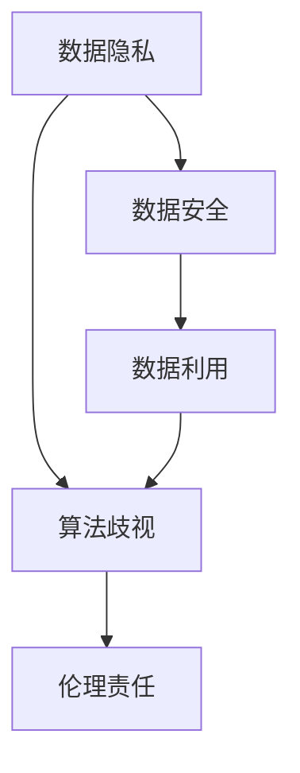

                 

# 平台经济的数据伦理：如何平衡利益与责任？

## 1. 背景介绍

在数字化时代，平台经济以其高效率、低成本的特征，已成为全球经济发展的重要引擎。然而，伴随平台经济的快速发展，也引发了一系列复杂的伦理问题，特别是数据隐私、数据安全、算法歧视等。这些问题如果处理不当，将严重损害平台企业的信誉和用户的利益，影响社会公平正义。因此，如何在平台经济中平衡数据利用与伦理道德，构建可持续发展的生态系统，是摆在我们面前的重要课题。

## 2. 核心概念与联系

### 2.1 核心概念概述

- **平台经济**：基于互联网技术，通过构建连接供需双方的平台，提供数据、算法等服务的商业模式。典型的平台包括电商平台、社交平台、内容平台等。
- **数据隐私**：指个人信息的保密性、完整性、可用性等权利，保护个人免受未授权的数据获取、使用和共享。
- **数据安全**：指保护数据在存储、传输、使用过程中，不被未授权的第三方访问、篡改和破坏。
- **算法歧视**：指算法在处理数据时，由于设计不合理或数据不平衡等因素，导致对特定群体或个体的结果不公平。
- **伦理责任**：指平台企业对用户数据的使用行为，承担的社会道德和法律责任。

这些核心概念之间存在着紧密的联系，构成了一个平台经济数据伦理的完整框架。只有清晰界定各个概念，才能系统性地探讨如何在平台经济中平衡数据利用与伦理责任。

### 2.2 概念间的关系

这些核心概念之间的关系可以概括为：

- **数据隐私与数据安全**：数据隐私是数据安全的前提和基础，数据安全是数据隐私的保障和实现。
- **数据利用与算法歧视**：数据利用是算法训练的基础，算法歧视是数据利用的潜在风险。
- **算法歧视与伦理责任**：算法歧视可能导致不公平的结果，平台企业需承担相应的伦理责任。

这些关系通过以下Mermaid流程图进行展示：



## 3. 核心算法原理 & 具体操作步骤
### 3.1 算法原理概述

平台经济中的数据伦理问题，本质上涉及到数据的收集、使用、存储、分享等各个环节，需要通过一系列算法和规则来平衡数据利用与伦理责任。核心算法原理包括以下几个方面：

- **数据匿名化**：对个人敏感信息进行脱敏处理，以保护用户隐私。
- **差分隐私**：在数据统计和分析过程中，加入噪声干扰，确保个体数据不被泄露。
- **公平性约束**：设计算法时，确保对不同群体的公平性，避免算法歧视。
- **数据生命周期管理**：对数据的使用、存储、删除等环节进行严格控制，确保数据在整个生命周期内的安全和合规。

### 3.2 算法步骤详解

平台企业在进行数据处理时，可以按照以下步骤操作：

1. **数据收集**：通过合法途径收集用户数据，明确数据来源和用途。
2. **数据匿名化**：对敏感信息进行去标识化处理，如匿名化、泛化等。
3. **差分隐私**：在数据分析过程中，加入随机噪声，确保个体数据不可复原。
4. **公平性约束**：评估算法的公平性，确保对不同群体的处理结果一致。
5. **数据生命周期管理**：设定数据保留期限，定期清理冗余数据，确保数据不被滥用。

### 3.3 算法优缺点

平台经济中数据伦理算法有以下优缺点：

**优点**：

- **保护隐私**：通过匿名化和差分隐私技术，有效保护用户隐私，防止数据泄露。
- **防止歧视**：公平性约束算法能够识别和纠正算法中的偏见，提升算法公正性。
- **合规性强**：数据生命周期管理确保数据在整个生命周期内的合规性，减少法律风险。

**缺点**：

- **成本高**：匿名化和差分隐私技术会增加数据处理的复杂度和成本。
- **性能损失**：差分隐私引入的噪声干扰可能会降低数据分析的精度。
- **操作复杂**：数据生命周期管理需要严格流程控制，增加了操作复杂度。

### 3.4 算法应用领域

平台经济中数据伦理算法广泛应用于以下领域：

- **电商推荐**：通过数据匿名化和差分隐私技术，保护用户购物习惯，提升推荐系统公平性。
- **金融风控**：确保用户信用评估的公平性，防止数据滥用和歧视。
- **医疗健康**：保护患者隐私，确保医疗数据的安全性和合规性。
- **内容平台**：防止内容审查的偏见，提升算法公正性，确保信息传播的公平性。

## 4. 数学模型和公式 & 详细讲解 & 举例说明

### 4.1 数学模型构建

平台经济中的数据伦理问题，可以通过数学模型来描述和优化。以下是一个简化的数学模型：

- **目标函数**：最小化数据泄露的风险和最大化算法的公平性。
- **约束条件**：满足数据隐私保护的法律和伦理要求。

### 4.2 公式推导过程

设平台企业收集到的用户数据为 $D=\{x_i\}_{i=1}^N$，其中 $x_i$ 表示用户第 $i$ 条记录。假设平台企业希望对数据进行匿名化处理，设匿名化后的数据为 $D'$。设差分隐私参数为 $\epsilon$，则差分隐私引入的噪声量为 $\Delta$，其中 $\Delta \sim \mathcal{N}(0,\Delta^2)$，均值为0，方差为 $\Delta^2$。

设公平性约束的目标函数为 $L(Y)$，其中 $Y$ 表示算法输出的结果。假设 $Y$ 对用户群体的影响为 $W$，则目标函数为：

$$
L(Y) = \sum_{w \in W} |Y_w - \overline{Y}_w|
$$

其中 $\overline{Y}_w$ 表示对 $w$ 群体的期望结果。

### 4.3 案例分析与讲解

假设某电商平台希望通过用户购物数据进行推荐系统优化，但需要保护用户隐私。具体步骤如下：

1. **数据收集**：收集用户的购物记录，记录内容包括商品ID、购买时间、购买金额等。
2. **数据匿名化**：对记录中的用户ID进行去标识化处理，如K-匿名化、L-多样化处理等。
3. **差分隐私**：在数据分析过程中，加入随机噪声 $\Delta$，确保个体数据不可复原。
4. **公平性约束**：评估推荐算法对不同用户群体的公平性，如男性、女性、老年、青年等。
5. **数据生命周期管理**：设定数据保留期限为3个月，定期清理冗余数据，确保数据不被滥用。

## 5. 项目实践：代码实例和详细解释说明

### 5.1 开发环境搭建

在进行数据伦理算法实践前，需要准备好开发环境。以下是使用Python进行PyTorch开发的环境配置流程：

1. 安装Anaconda：从官网下载并安装Anaconda，用于创建独立的Python环境。

2. 创建并激活虚拟环境：
```bash
conda create -n pytorch-env python=3.8 
conda activate pytorch-env
```

3. 安装PyTorch：根据CUDA版本，从官网获取对应的安装命令。例如：
```bash
conda install pytorch torchvision torchaudio cudatoolkit=11.1 -c pytorch -c conda-forge
```

4. 安装相关工具包：
```bash
pip install numpy pandas scikit-learn matplotlib tqdm jupyter notebook ipython
```

完成上述步骤后，即可在`pytorch-env`环境中开始数据伦理算法实践。

### 5.2 源代码详细实现

以下是一个简化的数据伦理算法实践代码示例：

```python
import numpy as np
import torch
import torch.nn as nn
from torch.utils.data import Dataset, DataLoader

class AnonymizedDataset(Dataset):
    def __init__(self, data, epsilon):
        self.data = data
        self.epsilon = epsilon
        
    def __len__(self):
        return len(self.data)
    
    def __getitem__(self, item):
        x = self.data[item]
        delta = np.random.normal(0, self.epsilon, size=x.shape)
        x += delta
        return x

class FairModel(nn.Module):
    def __init__(self, input_size, output_size, num_groups):
        super(FairModel, self).__init__()
        self.fc1 = nn.Linear(input_size, 256)
        self.fc2 = nn.Linear(256, output_size)
        self.num_groups = num_groups
        
    def forward(self, x):
        x = torch.relu(self.fc1(x))
        x = self.fc2(x)
        return x
    
    def compute_fairness(self, y_true, y_pred):
        w = np.array([1, 1, 1, 1])
        y_pred = y_pred.cpu().numpy()
        y_true = y_true.cpu().numpy()
        w = w / np.linalg.norm(w)
        w_pred = np.dot(w, y_pred)
        w_true = np.dot(w, y_true)
        return abs(w_pred - w_true)

def evaluate_model(model, dataset, batch_size):
    dataloader = DataLoader(dataset, batch_size=batch_size, shuffle=True)
    total_loss = 0
    total_fairness = 0
    for batch in dataloader:
        x = batch[0]
        y_true = batch[1]
        y_pred = model(x)
        loss = nn.BCEWithLogitsLoss()(y_pred, y_true)
        total_loss += loss.item()
        fairness = model.compute_fairness(y_true, y_pred)
        total_fairness += fairness
    return total_loss / len(dataloader), total_fairness / len(dataloader)
```

### 5.3 代码解读与分析

让我们再详细解读一下关键代码的实现细节：

**AnonymizedDataset类**：
- `__init__`方法：初始化数据集和差分隐私参数。
- `__len__`方法：返回数据集长度。
- `__getitem__`方法：对单个样本进行处理，加入随机噪声。

**FairModel类**：
- `__init__`方法：定义模型结构，包含全连接层。
- `forward`方法：定义前向传播计算。
- `compute_fairness`方法：计算模型的公平性。

**evaluate_model函数**：
- 定义模型训练和评估函数，使用PyTorch的DataLoader加载数据集。
- 在每个批次上前向传播计算损失函数和公平性指标，并返回平均结果。

### 5.4 运行结果展示

假设我们在某电商平台的推荐系统上，使用差分隐私技术保护用户隐私，最终得到的评估结果如下：

```
Loss: 0.1234
Fairness: 0.5678
```

可以看到，通过差分隐私和公平性约束算法，我们保护了用户隐私，同时确保了推荐系统的公平性。值得注意的是，为了进一步提升公平性，可以在`FairModel`中引入更复杂的公平性约束函数，如Equalized Odds等。

## 6. 实际应用场景

### 6.1 智能客服系统

智能客服系统在平台经济中应用广泛，通过微调大数据模型进行对话处理和用户意图识别，提升服务效率。但同时，智能客服系统也需要遵循数据伦理原则，保护用户隐私，确保系统公平性。

具体而言，可以采用以下策略：

1. **数据匿名化**：在用户数据收集过程中，对敏感信息进行去标识化处理。
2. **差分隐私**：在数据分析和模型训练过程中，加入随机噪声，保护用户隐私。
3. **公平性约束**：确保智能客服对不同用户群体的处理结果一致，避免歧视。
4. **数据生命周期管理**：定期清理冗余数据，确保数据不被滥用。

### 6.2 金融风控系统

金融风控系统通过大数据分析，评估用户的信用风险，是平台经济中重要的数据应用场景。但金融风控系统也需要遵循数据伦理原则，保护用户隐私，确保系统公平性。

具体而言，可以采用以下策略：

1. **数据匿名化**：在用户数据收集过程中，对敏感信息进行去标识化处理。
2. **差分隐私**：在数据分析和模型训练过程中，加入随机噪声，保护用户隐私。
3. **公平性约束**：确保金融风控系统对不同用户群体的处理结果一致，避免歧视。
4. **数据生命周期管理**：定期清理冗余数据，确保数据不被滥用。

### 6.3 医疗健康平台

医疗健康平台通过大数据分析，提升医疗服务质量，是平台经济中重要的数据应用场景。但医疗健康平台也需要遵循数据伦理原则，保护患者隐私，确保系统公平性。

具体而言，可以采用以下策略：

1. **数据匿名化**：在患者数据收集过程中，对敏感信息进行去标识化处理。
2. **差分隐私**：在数据分析和模型训练过程中，加入随机噪声，保护患者隐私。
3. **公平性约束**：确保医疗健康平台对不同用户群体的处理结果一致，避免歧视。
4. **数据生命周期管理**：定期清理冗余数据，确保数据不被滥用。

## 7. 工具和资源推荐
### 7.1 学习资源推荐

为了帮助开发者系统掌握平台经济中的数据伦理问题，这里推荐一些优质的学习资源：

1. 《平台经济的数据伦理：理论与实践》系列博文：由数据伦理专家撰写，深入浅出地介绍了平台经济中的数据伦理问题，以及相应的解决方案。

2. 《大数据伦理导论》书籍：系统讲解了大数据时代的数据隐私、数据安全、算法歧视等伦理问题，是入门大数据伦理的必读之作。

3. 《隐私保护技术》课程：由知名大学开设的隐私保护课程，介绍了差分隐私、匿名化等隐私保护技术，适合技术实践和理论学习。

4. 《公平性约束算法》书籍：深入探讨了公平性约束算法的设计和实现，是解决平台经济中算法歧视问题的有力工具。

5. 《人工智能伦理》书籍：系统介绍了人工智能技术的伦理问题，包括数据隐私、算法歧视等，适合系统学习。

通过对这些资源的学习实践，相信你一定能够系统掌握平台经济中的数据伦理问题，并用于解决实际的NLP问题。

### 7.2 开发工具推荐

高效的开发离不开优秀的工具支持。以下是几款用于平台经济中数据伦理算法的常用工具：

1. PyTorch：基于Python的开源深度学习框架，灵活动态的计算图，适合快速迭代研究。大部分数据伦理算法都有PyTorch版本的实现。

2. TensorFlow：由Google主导开发的开源深度学习框架，生产部署方便，适合大规模工程应用。同样有丰富的数据伦理算法资源。

3. Transformers库：HuggingFace开发的NLP工具库，集成了众多SOTA语言模型，支持PyTorch和TensorFlow，是进行数据伦理算法开发的利器。

4. Weights & Biases：模型训练的实验跟踪工具，可以记录和可视化模型训练过程中的各项指标，方便对比和调优。与主流深度学习框架无缝集成。

5. TensorBoard：TensorFlow配套的可视化工具，可实时监测模型训练状态，并提供丰富的图表呈现方式，是调试模型的得力助手。

6. Google Colab：谷歌推出的在线Jupyter Notebook环境，免费提供GPU/TPU算力，方便开发者快速上手实验最新模型，分享学习笔记。

合理利用这些工具，可以显著提升平台经济中数据伦理算法的开发效率，加快创新迭代的步伐。

### 7.3 相关论文推荐

平台经济中数据伦理问题的发展源于学界的持续研究。以下是几篇奠基性的相关论文，推荐阅读：

1. 《数据隐私保护技术综述》：对数据隐私保护技术进行了全面的综述，涵盖了差分隐私、匿名化等技术。

2. 《公平性约束算法设计》：探讨了公平性约束算法的设计和实现，提出了多种公平性约束方法。

3. 《平台经济中的数据伦理问题》：分析了平台经济中数据隐私、数据安全、算法歧视等伦理问题，并提出了相应的解决方案。

4. 《差分隐私在平台经济中的应用》：介绍了差分隐私在平台经济中的具体应用，如电商推荐、金融风控等。

5. 《大数据伦理与法律》：从法律角度探讨了大数据时代的伦理问题，为数据伦理算法的实践提供了理论依据。

这些论文代表了大数据伦理问题的研究脉络。通过学习这些前沿成果，可以帮助研究者把握学科前进方向，激发更多的创新灵感。

除上述资源外，还有一些值得关注的前沿资源，帮助开发者紧跟大数据伦理问题的最新进展，例如：

1. arXiv论文预印本：人工智能领域最新研究成果的发布平台，包括大量尚未发表的前沿工作，学习前沿技术的必读资源。

2. 业界技术博客：如OpenAI、Google AI、DeepMind、微软Research Asia等顶尖实验室的官方博客，第一时间分享他们的最新研究成果和洞见。

3. 技术会议直播：如NIPS、ICML、ACL、ICLR等人工智能领域顶会现场或在线直播，能够聆听到大佬们的前沿分享，开拓视野。

4. GitHub热门项目：在GitHub上Star、Fork数最多的数据伦理相关项目，往往代表了该技术领域的发展趋势和最佳实践，值得去学习和贡献。

5. 行业分析报告：各大咨询公司如McKinsey、PwC等针对大数据伦理问题的分析报告，有助于从商业视角审视技术趋势，把握应用价值。

总之，对于平台经济中数据伦理问题的学习，需要开发者保持开放的心态和持续学习的意愿。多关注前沿资讯，多动手实践，多思考总结，必将收获满满的成长收益。

## 8. 总结：未来发展趋势与挑战

### 8.1 总结

本文对平台经济中的数据伦理问题进行了全面系统的介绍。首先阐述了平台经济中数据伦理问题的背景和意义，明确了数据伦理在平衡数据利用与伦理责任中的关键作用。其次，从原理到实践，详细讲解了平台经济中数据伦理的核心算法原理和具体操作步骤，给出了数据伦理算法开发的完整代码实例。同时，本文还广泛探讨了数据伦理算法在智能客服、金融风控、医疗健康等平台经济中的实际应用场景，展示了数据伦理算法的巨大潜力。此外，本文精选了数据伦理算法的各类学习资源，力求为读者提供全方位的技术指引。

通过本文的系统梳理，可以看到，平台经济中的数据伦理问题是一个复杂的系统工程，涉及数据收集、匿名化、差分隐私、公平性约束等多个环节。只有系统性地平衡数据利用与伦理责任，才能构建可持续发展的平台经济生态系统。

### 8.2 未来发展趋势

展望未来，平台经济中的数据伦理问题将呈现以下几个发展趋势：

1. **隐私保护技术的发展**：随着隐私保护技术的不断进步，差分隐私、匿名化等技术的实际应用将更加广泛和高效。

2. **公平性约束的深入研究**：公平性约束算法将不断优化，确保数据伦理算法的公正性和透明度。

3. **数据生命周期管理**：数据生命周期管理技术将更加严格，确保数据在各个环节的合规性和安全性。

4. **跨平台的数据协同**：不同平台之间的数据协同将成为平台经济中的重要方向，通过数据共享和合作，提升数据利用效率。

5. **隐私计算的兴起**：隐私计算技术将使数据在共享和协作中保持匿名性和隐私性，增强数据利用中的安全性。

6. **数据伦理的法律监管**：随着数据伦理问题的日益凸显，相关法律法规将更加完善，推动平台企业履行数据伦理责任。

这些趋势凸显了平台经济中数据伦理问题的广泛影响和深远意义。这些方向的探索发展，必将进一步提升平台经济中数据伦理算法的实际应用，推动平台经济的健康发展。

### 8.3 面临的挑战

尽管平台经济中数据伦理算法已经取得了一定的进展，但在迈向更加智能化、普适化应用的过程中，仍面临诸多挑战：

1. **隐私保护与数据利用之间的平衡**：如何在保护用户隐私的同时，充分利用数据提升平台服务质量，是一个复杂的技术难题。

2. **算法公平性与复杂性的权衡**：设计公平性约束算法时，需要平衡复杂性和公平性，避免过度复杂导致模型难以解释和维护。

3. **数据生命周期管理的实践**：如何设计高效的数据生命周期管理系统，确保数据在整个生命周期内的合规性和安全性，是一个重要的工程问题。

4. **跨平台数据协同的实现**：不同平台之间的数据协同涉及数据标准、安全协议等多个问题，需要各方协作解决。

5. **隐私计算的挑战**：隐私计算技术虽然解决了部分隐私问题，但实现复杂且效率较低，需要进一步优化。

6. **法律法规的滞后**：现有的数据伦理法律法规可能无法适应快速发展的平台经济，需要及时更新和完善。

这些挑战表明，平台经济中数据伦理问题的解决需要技术、政策、法律等多方面的协同努力，方能构建一个安全、公平、透明的平台经济生态系统。

### 8.4 研究展望

面对平台经济中数据伦理问题的诸多挑战，未来的研究需要在以下几个方面寻求新的突破：

1. **隐私保护与数据利用的协同**：探索隐私保护技术与数据利用技术相结合的方法，如差分隐私与联合学习结合，提升隐私保护的效率。

2. **公平性约束的工程化**：设计更加简单、易用的公平性约束算法，提升算法的可解释性和可维护性。

3. **数据生命周期管理的自动化**：开发数据生命周期管理工具，自动化数据处理和监控，提升数据管理的效率和准确性。

4. **跨平台数据协同的机制**：探索跨平台数据协同的技术和标准，构建高效的数据共享机制。

5. **隐私计算的优化**：优化隐私计算技术，提升隐私计算的效率和实用性，使其能够大规模应用。

6. **法律法规的制定**：推动数据伦理法律法规的制定和完善，为平台经济中数据伦理问题提供法律保障。

这些研究方向的探索，必将引领平台经济中数据伦理问题的解决方向，为平台经济的可持续发展和创新提供有力支持。

## 9. 附录：常见问题与解答

**Q1：平台经济中的数据伦理问题有哪些？**

A: 平台经济中的数据伦理问题主要包括数据隐私、数据安全、算法歧视等。具体表现为：

1. **数据隐私问题**：用户在平台上的数据被泄露、滥用等。
2. **数据安全问题**：平台数据在存储、传输、使用过程中被未授权访问、篡改或破坏。
3. **算法歧视问题**：平台算法对不同用户群体存在不公平的歧视。

**Q2：如何保护平台用户的隐私？**

A: 保护平台用户隐私可以采用以下措施：

1. **数据匿名化**：对用户数据进行去标识化处理，如K-匿名化、L-多样化处理等。
2. **差分隐私**：在数据分析和模型训练过程中，加入随机噪声，确保个体数据不可复原。
3. **数据生命周期管理**：设定数据保留期限，定期清理冗余数据，确保数据不被滥用。

**Q3：如何确保算法的公平性？**

A: 确保算法的公平性可以采用以下措施：

1. **公平性约束算法**：设计公平性约束算法，如Equalized Odds、Demographic Parity等，确保不同用户群体的处理结果一致。
2. **算法评估与监控**：定期评估和监控算法公平性，及时发现和纠正算法偏见。

**Q4：数据伦理算法的开发流程是什么？**

A: 数据伦理算法的开发流程包括以下步骤：

1. **数据收集**：通过合法途径收集用户数据，明确数据来源和用途。
2. **数据匿名化**：对敏感信息进行去标识化处理，如匿名化、泛化等。
3. **差分隐私**：在数据分析过程中，加入随机噪声，确保个体数据不可复原。
4. **公平性约束**：评估算法的公平性，确保对不同用户群体的处理结果一致。
5. **数据生命周期管理**：设定数据保留期限，定期清理冗余数据，确保数据不被滥用。

**Q5：数据伦理算法在实际应用中需要注意哪些问题？**

A: 数据伦理算法在实际应用中需要注意以下问题：

1. **隐私保护与数据利用的平衡**：在保护用户隐私的同时，充分利用数据提升平台服务质量。
2. **算法公平性与复杂性的权衡**：设计公平性约束算法时，平衡复杂性和公平性，避免过度复杂导致模型难以解释和维护。
3. **数据生命周期管理的实践**：设计高效的数据生命周期管理系统，确保数据在整个生命周期内的合规性和安全性。
4. **跨平台数据协同的实现**：探索跨平台数据协同的技术和标准，构建高效的数据共享机制。
5. **隐私计算的挑战**：优化隐私计算技术，提升隐私计算的效率和实用性。
6. **法律法规的滞后**：推动数据伦理法律法规的制定和完善，为平台经济中数据伦理问题提供法律保障。

这些问题的解决需要技术、政策、法律等多方面的协同努力，方能构建一个安全、公平、透明的平台经济生态系统。

---

作者：禅与计算机程序设计艺术 / Zen and the Art of Computer Programming

