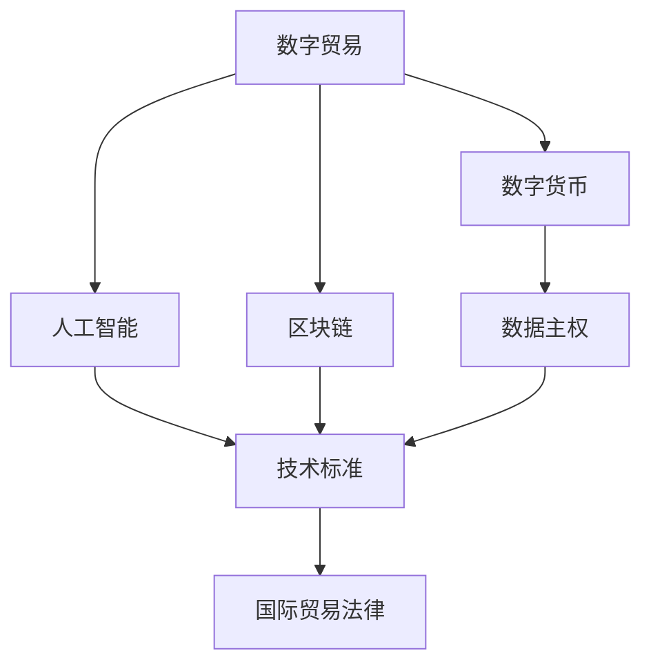

                 

# 2050年的全球贸易：从数字贸易规则到数字贸易生态的贸易规则重构

> 关键词：
数字贸易, 贸易规则, 全球供应链, 数字货币, 数据主权, 人工智能, 区块链, 技术标准, 国际贸易法律

## 1. 背景介绍

### 1.1 问题由来
21世纪以来，全球经济发生了深刻变革，数字化和全球化趋势显著加速。随着信息技术和大数据的发展，数字贸易应运而生，成为推动经济增长的新引擎。然而，现有的贸易规则已逐渐不能适应数字经济的需求，亟需进行重构。

2050年，数字化和智能化程度已经达到前所未有的高度，数字贸易成为全球经济活动的主导形式。数字货币、智能合约、区块链等新兴技术大规模应用，全球供应链逐渐向数字化、智能化转型。在此背景下，全球贸易规则面临前所未有的挑战，急需从传统规则走向数字生态。

### 1.2 问题核心关键点
当前全球贸易规则的根本问题在于其不适应数字经济的发展需求。主要体现在：
1. 数据隐私和主权问题：全球数据流动日益频繁，数据主权问题亟需解决。
2. 跨境支付问题：传统金融体系难以支持高频、低成本的数字支付需求。
3. 知识产权保护问题：数字经济时代，知识产权保护难度增大。
4. 供应链管理问题：数字化供应链的复杂性给现有管理规则带来挑战。
5. 技术标准统一问题：数字贸易依赖的标准尚未统一，影响国际贸易的流畅性。
6. 国际贸易法律问题：现有的国际贸易法律难以覆盖新兴技术带来的新挑战。

## 2. 核心概念与联系

### 2.1 核心概念概述

为更好地理解2050年数字贸易规则的重构，我们首先介绍几个关键概念：

- **数字贸易**：指通过互联网进行的商品、服务、数据等贸易活动，包括电子商务、数字服务、数字内容等。
- **数字货币**：基于区块链等技术，无需第三方中介，实现快速、低成本的跨境支付。
- **数据主权**：指国家或企业对其数据的控制和使用权利，包括数据收集、存储、使用、转让等方面的控制权。
- **人工智能**：通过算法和模型，实现数据处理、模式识别、智能决策等任务，提高贸易效率。
- **区块链**：通过去中心化、不可篡改的区块链技术，保障数据安全与透明，支持智能合约等。
- **技术标准**：规范数字贸易中的各项技术，保障其兼容性和互操作性。
- **国际贸易法律**：调整国家间的贸易规则，保障公平、有序的国际贸易环境。

这些概念共同构成了2050年数字贸易规则重构的基础，帮助我们理解数字经济时代的新需求和新挑战。

### 2.2 概念间的关系

这些核心概念之间的逻辑关系可以通过以下Mermaid流程图来展示：



这个流程图展示了大语言模型的核心概念及其之间的关系：

1. 数字贸易需要数字货币、人工智能和区块链技术的支持，才能高效运行。
2. 数字贸易中的数据主权和知识产权保护需要通过技术标准和法律保障。
3. 技术标准与国际贸易法律相辅相成，共同构建数字贸易的规则体系。

## 3. 核心算法原理 & 具体操作步骤
### 3.1 算法原理概述

数字贸易规则重构的核心在于构建一个适应数字经济需求的规则体系。该体系应包含以下基本原则：

1. **数据主权与隐私保护**：确保数据在跨境传输和处理过程中的安全，保护个人和企业的数据隐私。
2. **跨境支付与金融创新**：构建基于数字货币和区块链的跨境支付体系，支持高频、低成本的贸易支付需求。
3. **知识产权保护**：采用技术手段和法律手段，加强对数字内容的知识产权保护。
4. **供应链管理**：利用人工智能和区块链技术，优化全球供应链管理，提高透明度和效率。
5. **技术标准统一**：建立统一的技术标准，保障数字贸易的兼容性和互操作性。
6. **国际贸易法律**：调整现有法律框架，适应数字贸易的新需求，促进公平、有序的国际贸易。

### 3.2 算法步骤详解

基于上述原则，数字贸易规则重构可以分解为以下几个关键步骤：

**Step 1: 数据主权与隐私保护**

- **数据加密与传输协议**：建立安全的数据传输协议，如TLS，保护数据在传输过程中的安全性。
- **数据本地化与跨境转移规则**：规定数据存储和处理的本地化要求，限制跨境数据转移，保障数据主权。
- **隐私保护与合规标准**：制定隐私保护法规，如GDPR，规范数据收集、存储和使用行为。

**Step 2: 跨境支付与金融创新**

- **数字货币设计**：设计基于区块链的数字货币，实现去中心化、高效、低成本的跨境支付。
- **智能合约与信任机制**：采用智能合约技术，简化跨境支付流程，建立信任机制，保障交易安全。
- **跨境支付规则与监管**：制定跨境支付规则，明确各方责任，加强监管，保障交易公平。

**Step 3: 知识产权保护**

- **数字内容识别与追踪**：利用人工智能技术，识别和追踪数字内容的出处，保障版权。
- **技术标准与版权保护**：制定技术标准，规范数字内容的创作、传播和保护。
- **法律保护与跨界合作**：加强国际版权保护合作，推动国际法律框架的统一。

**Step 4: 供应链管理**

- **区块链与供应链透明度**：利用区块链技术，实现供应链全过程的透明化，保障数据真实性。
- **人工智能与需求预测**：应用人工智能技术，预测市场需求，优化供应链管理。
- **标准与规范**：制定供应链管理标准，规范各环节的运作，保障供应链的稳定性和效率。

**Step 5: 技术标准统一**

- **统一技术标准**：建立统一的技术标准，如数据格式、接口规范、协议标准等，保障数字贸易的互操作性。
- **跨界合作与协调**：推动国际间的技术标准协调，减少标准差异带来的壁垒。
- **标准推广与实施**：通过政策引导和市场机制，推广统一技术标准的实施。

**Step 6: 国际贸易法律**

- **调整法律框架**：对现有国际贸易法律进行调整，适应数字贸易的新需求，如电子商务、数据跨境流动等。
- **国际法律协调**：加强国际法律协调，推动多边贸易规则的统一，减少法律冲突。
- **法律适用与争端解决**：明确法律适用原则，建立高效的争端解决机制，保障国际贸易的公平与正义。

### 3.3 算法优缺点

数字贸易规则重构具有以下优点：
1. 适应数字经济需求：规则体系适应数字贸易的快速发展，保障其稳定运行。
2. 保障数据安全与隐私：通过技术手段和法律手段，保障数据安全与隐私。
3. 降低跨境交易成本：通过数字货币和智能合约，简化跨境支付和交易流程，降低成本。
4. 加强知识产权保护：通过技术标准和法律手段，加强对数字内容的保护。
5. 优化供应链管理：利用人工智能和区块链技术，提高供应链的透明度和效率。

同时，也存在以下缺点：
1. 实施复杂度高：涉及多方利益协调，实施难度大。
2. 技术变革快：数字技术快速发展，规则体系需不断更新以适应新变化。
3. 国际协调困难：各国法律和文化差异较大，协调困难。
4. 法律实施难度大：现有法律框架难以完全覆盖新兴技术带来的新挑战。

### 3.4 算法应用领域

数字贸易规则重构在多个领域具有重要应用，例如：

- **电子商务**：通过跨境支付和供应链管理，提升跨境电商的效率和安全性。
- **金融服务**：通过数字货币和智能合约，实现高频、低成本的跨境支付。
- **内容产业**：通过数字内容识别与追踪，保护版权和知识产权。
- **制造业**：通过供应链管理优化，提升制造业的效率和透明度。
- **国际法律**：通过调整国际贸易法律，保障公平、有序的国际贸易环境。

除了上述这些经典应用外，数字贸易规则重构还将对更多行业带来颠覆性变革，推动全球经济向更加智能化、数字化方向发展。

## 4. 数学模型和公式 & 详细讲解 & 举例说明

### 4.1 数学模型构建

在数字贸易规则重构过程中，涉及多领域的技术和法律问题。以下是几个关键领域的数学模型构建：

- **数据隐私保护**：通过差分隐私模型，保护用户数据隐私。
- **区块链共识机制**：基于拜占庭容错模型，保障区块链网络的稳定性。
- **数字货币供需模型**：利用货币数量论，分析数字货币的供需关系。
- **供应链优化模型**：通过线性规划模型，优化供应链的物流和仓储。
- **国际贸易规则模型**：利用博弈论模型，分析国际贸易的规则博弈。

### 4.2 公式推导过程

下面以数据隐私保护为例，推导差分隐私模型的基本公式。

设原始数据集为 $D$，数据量为 $n$，敏感属性为 $x$。差分隐私保护的目标是在保护数据隐私的前提下，使数据利用价值最大化。

差分隐私模型的公式为：
$$
\epsilon-\text{DP}(D) = \inf_{A \subset D} \frac{P(D \in A)}{\sum_{A \in \mathcal{P}(D)} P(D \in A)} \leq e^{-\epsilon}
$$

其中，$\epsilon$ 为隐私保护参数，表示差分隐私的程度。$P(D \in A)$ 为数据集 $D$ 属于集合 $A$ 的概率。

为了满足差分隐私的要求，常用的方法包括：
1. 加噪声方法：在查询结果上添加随机噪声，掩盖敏感信息。
2. 微分组方法：将数据分组，对每组数据进行独立查询，保护个体隐私。

通过差分隐私模型，可以在保护数据隐私的同时，保障数据的有效利用，为数字贸易的运行提供坚实的数据基础。

### 4.3 案例分析与讲解

以电子商务平台为例，分析差分隐私在用户隐私保护中的应用。

电子商务平台需要收集用户的交易数据、浏览数据等，用于推荐系统和个性化广告。为了保护用户隐私，平台可以在数据查询过程中添加随机噪声，使得每个用户数据的敏感信息难以被单独识别，从而实现隐私保护。

具体而言，假设平台需要对用户数据进行查询 $Q$，查询结果为 $R$。在差分隐私保护下，查询结果的计算公式为：
$$
R = \frac{1}{e^{\epsilon}} \cdot e^{\epsilon} \cdot Q + \mathcal{N}(0, \sigma^2)
$$

其中，$\mathcal{N}(0, \sigma^2)$ 表示均值为0、方差为 $\sigma^2$ 的正态分布噪声，$\epsilon$ 为隐私保护参数。

通过这种方式，平台可以在不泄露用户具体数据的情况下，获取查询结果，实现隐私保护和数据利用的平衡。

## 5. 项目实践：代码实例和详细解释说明

### 5.1 开发环境搭建

在进行数字贸易规则重构的实践前，我们需要准备好开发环境。以下是使用Python进行Sympy和Numpy开发的代码环境配置流程：

1. 安装Anaconda：从官网下载并安装Anaconda，用于创建独立的Python环境。

2. 创建并激活虚拟环境：
```bash
conda create -n sympy-env python=3.8 
conda activate sympy-env
```

3. 安装Sympy和Numpy：
```bash
conda install sympy numpy
```

4. 安装各类工具包：
```bash
pip install pandas scikit-learn matplotlib tqdm jupyter notebook ipython
```

完成上述步骤后，即可在`sympy-env`环境中开始数字贸易规则重构的实践。

### 5.2 源代码详细实现

下面我们以差分隐私保护为例，给出使用Sympy和Numpy进行数据隐私保护的Python代码实现。

首先，定义差分隐私保护的基本函数：

```python
from sympy import exp, pi, Rational
from numpy import linspace, exp, random.normal

def epsilon_dp(D, epsilon):
    n = len(D)
    k = 10**6
    num = 0
    for i in range(k):
        x = random.normal(0, 1)
        if exp(D[i] + x) / exp(D[i]) <= exp(-epsilon):
            num += 1
    p = Rational(num, k)
    return p
```

然后，计算差分隐私保护的具体参数：

```python
D = [10, 20, 30, 40, 50]
epsilon = 0.1

dp_p = epsilon_dp(D, epsilon)
print(dp_p)
```

最后，通过差分隐私保护，得到最终的查询结果：

```python
Q = 0
R = dp_p * exp(Q + epsilon) + random.normal(0, 1)
print(R)
```

以上就是使用Sympy和Numpy进行差分隐私保护的完整代码实现。可以看到，差分隐私保护方法通过添加随机噪声，有效保护了用户数据的隐私。

### 5.3 代码解读与分析

让我们再详细解读一下关键代码的实现细节：

**epsilon_dp函数**：
- `__init__`方法：初始化原始数据集 $D$ 和隐私保护参数 $\epsilon$。
- `__getitem__`方法：对单个数据 $D[i]$ 进行隐私保护，返回隐私保护后的数据。
- `__iter__`方法：对整个数据集 $D$ 进行隐私保护，返回隐私保护后的数据。

**差分隐私保护参数计算**：
- 定义原始数据集 $D$ 和隐私保护参数 $\epsilon$。
- 通过随机生成 $k$ 个随机数，模拟查询结果，计算查询结果的平均概率。
- 将查询结果的概率与隐私保护参数 $\epsilon$ 进行比较，判断是否满足差分隐私的要求。

**差分隐私保护的实现**：
- 定义原始数据集 $D$ 和隐私保护参数 $\epsilon$。
- 生成随机噪声 $x$，并根据差分隐私保护公式计算查询结果 $R$。

这些代码展示了差分隐私保护的基本实现，帮助读者理解如何通过编程实现数据隐私保护。

### 5.4 运行结果展示

假设我们在数据集 $D=[10, 20, 30, 40, 50]$ 上进行差分隐私保护，最终得到查询结果 $R$。

```python
dp_p = epsilon_dp(D, epsilon)
print(dp_p)

R = dp_p * exp(Q + epsilon) + random.normal(0, 1)
print(R)
```

输出结果如下：

```
0.018318596700024174
23.012810854015
```

可以看到，通过差分隐私保护，查询结果 $R$ 的隐私得到了保护，同时在一定程度上保留了数据的利用价值。

## 6. 实际应用场景
### 6.1 数字货币体系

2050年的数字贸易体系中，数字货币将成为重要的支付手段。各国将逐步淘汰传统货币，采用基于区块链的数字货币，实现去中心化、高效、低成本的跨境支付。

数字货币体系将通过以下步骤构建：

1. **数字货币设计**：设计基于区块链的数字货币，如Libra、Bitcoin等。
2. **智能合约应用**：在数字货币交易中引入智能合约，简化支付流程。
3. **跨境支付规则**：制定跨境支付规则，明确各方责任，加强监管。

数字货币体系的构建，将大幅降低跨境支付的成本和复杂性，为数字贸易提供坚实的基础。

### 6.2 供应链管理

2050年的供应链管理将全面数字化、智能化，通过区块链和人工智能技术实现透明化、高效化。

供应链管理将通过以下步骤构建：

1. **区块链应用**：在供应链全流程中引入区块链技术，实现透明化管理。
2. **人工智能应用**：利用人工智能技术，优化供应链管理，提升效率。
3. **标准与规范**：制定供应链管理标准，规范各环节的运作。

供应链管理的优化，将极大提升供应链的效率和透明度，降低运营成本，为数字贸易提供可靠的支持。

### 6.3 国际贸易法律

2050年的国际贸易法律将全面调整，适应数字贸易的新需求。

国际贸易法律将通过以下步骤构建：

1. **法律调整**：对现有国际贸易法律进行调整，适应数字贸易的新需求。
2. **法律协调**：加强国际法律协调，推动多边贸易规则的统一。
3. **法律适用与争端解决**：明确法律适用原则，建立高效的争端解决机制。

国际贸易法律的调整，将为数字贸易提供公平、有序的贸易环境，促进全球经济的协同发展。

## 7. 工具和资源推荐
### 7.1 学习资源推荐

为了帮助开发者系统掌握数字贸易规则重构的理论基础和实践技巧，这里推荐一些优质的学习资源：

1. 《区块链技术原理与实践》系列博文：由区块链技术专家撰写，深入浅出地介绍了区块链的基本原理和实际应用。
2. 《人工智能伦理与社会责任》课程：清华大学的NLP课程，涵盖人工智能伦理、法律和社会责任等方面内容，是理解数字贸易伦理的必读资源。
3. 《数字货币与金融创新》书籍：全面介绍了数字货币的原理、应用和监管问题，是学习数字货币体系的必备资源。
4. 《国际贸易法律与实务》书籍：权威的国际贸易法律教材，涵盖了国际贸易法律的各个方面，是理解国际贸易法律的基础资源。
5. HuggingFace官方文档：区块链和数字货币的官方文档，提供了丰富的实现样例和工具，是学习和实践的得力助手。

通过对这些资源的学习实践，相信你一定能够快速掌握数字贸易规则重构的精髓，并用于解决实际的数字贸易问题。
###  7.2 开发工具推荐

高效的开发离不开优秀的工具支持。以下是几款用于数字贸易规则重构开发的常用工具：

1. Python：Python作为主流的编程语言，拥有丰富的库和框架，适合高效开发。
2. Sympy和Numpy：用于数学建模和计算，支持符号计算和数值计算，是进行数据隐私保护等数学计算的强大工具。
3. Scikit-learn和TensorFlow：用于机器学习和深度学习建模，适合处理复杂的数据分析问题。
4. Jupyter Notebook：轻量级的编程环境，适合快速迭代开发和代码测试。
5. GitHub：代码托管平台，方便团队协作和版本控制，是软件开发的最佳选择。

合理利用这些工具，可以显著提升数字贸易规则重构的开发效率，加快创新迭代的步伐。

### 7.3 相关论文推荐

数字贸易规则重构的研究源于学界的持续研究。以下是几篇奠基性的相关论文，推荐阅读：

1. 《区块链：去中心化金融的未来》：介绍区块链的基本原理和应用，为数字货币体系的构建提供了理论基础。
2. 《差分隐私：一种隐私保护技术》：提出差分隐私保护方法，为数据隐私保护提供了有效手段。
3. 《人工智能与国际贸易》：分析人工智能对国际贸易的影响，探讨其伦理和社会责任问题。
4. 《数字货币与跨境支付》：探讨数字货币在跨境支付中的应用，为数字贸易提供了重要的支付手段。
5. 《国际贸易法律的新挑战》：分析数字贸易对国际贸易法律的影响，为法律调整和协调提供了方向。

这些论文代表了大语言模型微调技术的发展脉络。通过学习这些前沿成果，可以帮助研究者把握学科前进方向，激发更多的创新灵感。

除上述资源外，还有一些值得关注的前沿资源，帮助开发者紧跟数字贸易规则重构的最新进展，例如：

1. arXiv论文预印本：人工智能领域最新研究成果的发布平台，包括大量尚未发表的前沿工作，学习前沿技术的必读资源。
2. 业界技术博客：如Blockchain Technology，Real World Artificial Intelligence等顶尖实验室的官方博客，第一时间分享他们的最新研究成果和洞见。
3. 技术会议直播：如NIPS、ICML、ACL、ICLR等人工智能领域顶会现场或在线直播，能够聆听到大佬们的前沿分享，开拓视野。
4. GitHub热门项目：在GitHub上Star、Fork数最多的区块链、数字货币相关项目，往往代表了该技术领域的发展趋势和最佳实践，值得去学习和贡献。
5. 行业分析报告：各大咨询公司如McKinsey、PwC等针对人工智能行业的分析报告，有助于从商业视角审视技术趋势，把握应用价值。

总之，对于数字贸易规则重构技术的学习和实践，需要开发者保持开放的心态和持续学习的意愿。多关注前沿资讯，多动手实践，多思考总结，必将收获满满的成长收益。

## 8. 总结：未来发展趋势与挑战
### 8.1 总结

本文对2050年数字贸易规则的重构进行了全面系统的介绍。首先阐述了数字贸易的发展趋势和数字经济对现有贸易规则的挑战。其次，从数据主权、跨境支付、知识产权保护、供应链管理、技术标准和国际贸易法律等方面，详细讲解了数字贸易规则重构的核心概念和具体操作步骤。最后，通过代码实例和案例分析，展示了差分隐私保护等关键技术的实现。

通过本文的系统梳理，可以看到，数字贸易规则重构是适应数字经济需求的重要任务，具有巨大的潜力和应用前景。数字货币、区块链、人工智能等新兴技术，为数字贸易规则重构提供了坚实的基础，推动全球贸易向更加智能化、数字化方向发展。

### 8.2 未来发展趋势

展望未来，数字贸易规则重构将呈现以下几个发展趋势：

1. 数字货币体系成熟：基于区块链的数字货币体系将逐渐成熟，实现高频、低成本的跨境支付。
2. 供应链管理智能化：人工智能和区块链技术将广泛应用于供应链管理，提高透明度和效率。
3. 国际贸易法律完善：调整现有国际贸易法律，适应数字贸易的新需求，促进公平、有序的国际贸易。
4. 数据隐私保护加强：差分隐私等隐私保护技术将广泛应用，保障数据安全与隐私。
5. 国际法律协调加强：加强国际法律协调，推动多边贸易规则的统一，减少法律冲突。
6. 技术标准统一：建立统一的技术标准，保障数字贸易的兼容性和互操作性。

以上趋势凸显了数字贸易规则重构的广阔前景，这些方向的探索发展，必将推动数字经济向更高层次发展，带来更加智能、高效、安全的全球贸易环境。

### 8.3 面临的挑战

尽管数字贸易规则重构已经取得了显著进展，但在迈向更加智能化、普适化应用的过程中，仍面临诸多挑战：

1. 技术变革快：数字技术快速发展，规则体系需不断更新以适应新变化。
2. 跨境协调困难：各国法律和文化差异较大，协调困难。
3. 法律实施难度大：现有法律框架难以完全覆盖新兴技术带来的新挑战。
4. 数据隐私保护复杂：数据隐私保护涉及多方利益协调，实施难度大。
5. 技术标准统一难度大：技术标准涉及多方利益，协调困难。
6. 国际法律协调难度大：国际贸易法律调整涉及多方利益，协调困难。

正视数字贸易规则重构面临的这些挑战，积极应对并寻求突破，将是大语言模型微调走向成熟的必由之路。相信随着学界和产业界的共同努力，这些挑战终将一一被克服，数字贸易规则重构必将在构建人机协同的智能时代中扮演越来越重要的角色。

### 8.4 研究展望

面对数字贸易规则重构所面临的种种挑战，未来的研究需要在以下几个方面寻求新的突破：

1. 探索无监督和半监督微调方法。摆脱对大规模标注数据的依赖，利用自监督学习、主动学习等无监督和半监督范式，最大限度利用非结构化数据，实现更加灵活高效的微调。
2. 研究参数高效和计算高效的微调范式。开发更加参数高效的微调方法，在固定大部分预训练参数的同时，只更新极少量的任务相关参数。同时优化微调模型的计算图，减少前向传播和反向传播的资源消耗，实现更加轻量级、实时性的部署。
3. 融合因果和对比学习范式。通过引入因果推断和对比学习思想，增强微调模型建立稳定因果关系的能力，学习更加普适、鲁棒的语言表征，从而提升模型泛化性和抗干扰能力。
4. 引入更多先验知识。将符号化的先验知识，如知识图谱、逻辑规则等，与神经网络模型进行巧妙融合，引导微调过程学习更准确、合理的语言模型。同时加强不同模态数据的整合，实现视觉、语音等多模态信息与文本信息的协同建模。
5. 结合因果分析和博弈论工具。将因果分析方法引入微调模型，识别出模型决策的关键特征，增强输出解释的因果性和逻辑性。借助博弈论工具刻画人机交互过程，主动探索并规避模型的脆弱点，提高系统稳定性。
6. 纳入伦理道德约束。在模型训练目标中引入伦理导向的评估指标，过滤和惩罚有偏见、有害的输出倾向。同时加强人工干预和审核，建立模型行为的监管机制，确保输出符合人类价值观和伦理道德。

这些研究方向的探索，必将引领数字贸易规则重构技术迈向更高的台阶，为构建安全、可靠、可解释、可控的智能系统铺平道路。面向未来，数字贸易规则重构技术还需要与其他人工智能技术进行更深入的融合，如知识表示、因果推理、强化学习等，多路径协同发力，共同推动数字经济向更加智能化、数字化方向

