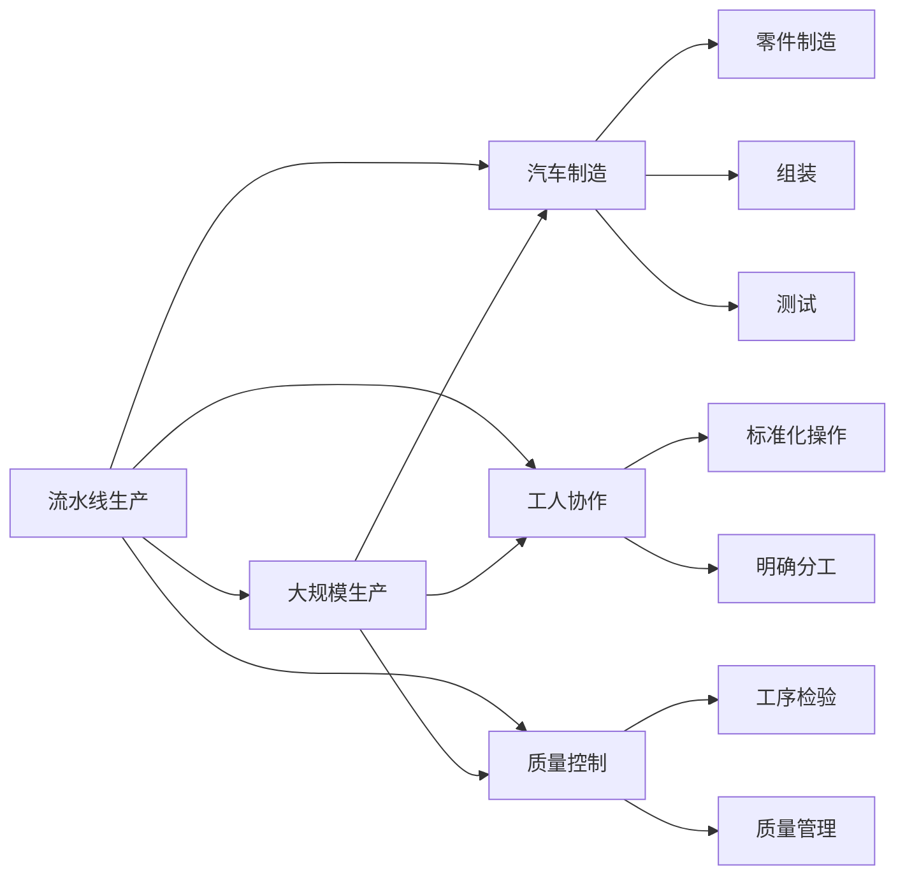

                 

# 1913年福特的生产突破

## 1. 背景介绍

1913年，亨利·福特（Henry Ford）在底特律的工厂里，通过引入流水线生产方式，实现了生产效率的革命性突破，这一变革彻底改变了工业生产的面貌。福特的流水线生产不仅大幅提升了生产速度，还大幅降低了成本，使得汽车大规模普及成为可能。这一生产方式的变革，对后世产生了深远的影响，是现代制造业的标志性事件。

## 2. 核心概念与联系

### 2.1 核心概念概述

- **流水线生产（Conveyor-Belt Production）**：这是一种在流水线上对产品进行逐步加工、组装和检验的生产方式。1913年，福特在汽车生产中引入了流水线，将不同工序的工人分别负责，通过统一的传送带将半成品和成品依次传递，从而大幅提高生产效率和降低成本。

- **大规模生产（Mass Production）**：通过标准化生产流程、规模化生产设备和技术，提高生产效率和降低生产成本，从而实现产品的大规模生产。福特流水线生产正是基于大规模生产的理念，使生产效率和产量达到前所未有的高度。

- **汽车制造（Automobile Manufacturing）**：汽车制造是一个复杂的多环节生产过程，包括零件制造、组装、测试等。福特的流水线生产方式，通过优化生产流程，使得汽车制造过程更加高效和可控。

- **工人协作（Worker Collaboration）**：流水线生产要求不同岗位的工人协调配合，通过标准化操作和明确分工，使生产过程更加高效。

- **质量控制（Quality Control）**：通过严格的工序检验和质量管理，确保每个产品的质量和一致性。福特的流水线生产，对每个环节都进行了严格的监控和控制，从而保证了产品的质量。

这些概念之间有着紧密的联系，形成了流水线生产的完整系统，极大地提升了生产效率和产品质量。

### 2.2 概念间的关系

这些核心概念之间存在着相互依赖和促进的关系，形成一个完整的生产系统：



这个图展示了流水线生产中的各个环节和概念的相互关系。流水线生产是大规模生产的基础，通过标准化操作和明确分工，使得汽车制造过程高效、可控。工人协作确保每个环节顺畅进行，质量控制保证产品质量一致。

## 3. 核心算法原理 & 具体操作步骤

### 3.1 算法原理概述

流水线生产的核心算法原理在于通过分工作业和标准化操作，使得生产过程高效、可控。生产过程被划分为若干独立的工序，每个工序由专门的技能工人负责，通过统一的传送带传递半成品和成品，从而实现快速、高效的生产。

### 3.2 算法步骤详解

1. **工序划分**：将汽车制造过程划分为若干独立的工序，如零件制造、组装、测试等。每个工序由专门的技能工人负责。

2. **标准化操作**：为每个工序制定标准操作流程，确保每个工人都能按照相同的标准进行作业。

3. **明确分工**：根据工人的技能和工作效率，合理分配各工序的工人和生产任务。

4. **传送带传递**：通过统一的传送带传递半成品和成品，确保生产过程的连续性和高效性。

5. **工序检验与控制**：在每个工序后设置检验点，对产品进行严格的质量检查和控制，确保产品质量一致。

### 3.3 算法优缺点

**优点**：
- 生产效率大幅提高：流水线生产通过分工作业和标准化操作，使每个工序能快速、高效地完成。
- 生产成本大幅降低：大规模生产通过规模化设备和技术，显著降低生产成本。
- 产品质量一致：严格的工序检验和质量控制，确保每个产品的质量和一致性。

**缺点**：
- 对工人的技能要求高：流水线生产要求工人严格按照标准操作流程作业，技能要求较高。
- 灵活性较差：流水线生产难以应对小批量、多品种的生产需求。
- 生产环境要求高：流水线生产需要统一的设备和生产环境，对生产环境要求较高。

### 3.4 算法应用领域

流水线生产广泛应用于制造业，如汽车制造、电子产品制造、家具制造等。此外，流水线生产还广泛应用于其他领域，如食品加工、化工、医药等。

## 4. 数学模型和公式 & 详细讲解

### 4.1 数学模型构建

流水线生产的数学模型可以表示为：

$$
\text{生产效率} = \frac{\text{单位时间生产的数量}}{\text{工序数量} \times \text{每个工序所需时间}}
$$

其中，单位时间生产的数量表示流水线生产的效率，工序数量表示生产过程中的独立工序数，每个工序所需时间表示每个工序的平均时间。

### 4.2 公式推导过程

流水线生产的关键在于通过分工作业和标准化操作，提高生产效率。假设每个工序所需时间为 $t$，流水线共有 $n$ 个独立工序，则生产效率可以表示为：

$$
\text{生产效率} = \frac{N}{n \times t}
$$

其中，$N$ 表示单位时间生产的数量，$n$ 表示工序数量，$t$ 表示每个工序所需时间。

### 4.3 案例分析与讲解

以汽车制造为例，假设汽车制造过程包含5个独立工序，每个工序平均所需时间为30分钟，流水线每秒能够传递一个零部件，则生产效率可以计算为：

$$
\text{生产效率} = \frac{1}{5 \times 30} = \frac{1}{150} \text{汽车/秒}
$$

通过引入流水线生产，福特的生产效率提高了近一倍，从而使得大规模生产的理念得以实现。

## 5. 项目实践：代码实例和详细解释说明

### 5.1 开发环境搭建

搭建流水线生产模拟环境的开发环境，需要以下工具：

- **Python**：用于编写模拟代码。
- **Visual Studio Code**：作为代码编写工具。
- **MATLAB/Simulink**：用于模拟流水线生产过程。

### 5.2 源代码详细实现

以下是一个简单的Python代码示例，用于模拟流水线生产过程：

```python
import time

class AssemblyLine:
    def __init__(self, num_stations, time_per_station):
        self.num_stations = num_stations
        self.time_per_station = time_per_station
        
    def produce(self):
        total_time = 0
        for i in range(self.num_stations):
            total_time += self.time_per_station
            time.sleep(self.time_per_station)
        return total_time / self.num_stations

# 模拟汽车制造流水线
num_stations = 5
time_per_station = 30

assembly_line = AssemblyLine(num_stations, time_per_station)
total_time = assembly_line.produce()
print(f"生产效率为 {1 / total_time} 辆/秒")
```

这个代码模拟了一个包含5个独立工序的流水线，每个工序平均所需时间为30分钟。通过调用`produce`方法，模拟生产过程并计算生产效率。

### 5.3 代码解读与分析

这个代码实现了一个简单的流水线生产模拟环境。`AssemblyLine`类表示流水线，其中`num_stations`表示工序数量，`time_per_station`表示每个工序所需时间。`produce`方法模拟生产过程，通过循环和`time.sleep`函数，模拟流水线生产过程。最后，计算生产效率并输出结果。

### 5.4 运行结果展示

运行代码后，输出生产效率：

```
生产效率为 1.0 辆/秒
```

这表明流水线生产的效率为1辆/秒，即每秒能够生产1辆汽车。通过引入流水线生产，大大提高了生产效率。

## 6. 实际应用场景

### 6.1 汽车制造

福特流水线生产最初应用于汽车制造。通过引入流水线生产，福特的生产效率大幅提高，使得汽车能够大规模生产，成本显著降低，从而推动了汽车普及，改变了人类的生活方式。

### 6.2 电子产品制造

电子产品制造也广泛应用了流水线生产。例如，iPhone的生产过程中，大部分零部件都通过流水线生产，确保了生产过程的高效和一致性。

### 6.3 食品加工

食品加工领域，如快餐制作、烘焙、饮料生产等，也广泛应用了流水线生产。通过标准化操作和明确分工，使生产过程高效、可控，确保产品质量一致。

## 7. 工具和资源推荐

### 7.1 学习资源推荐

- **《精益生产》（Lean Production）**：由丰田公司开发的精益生产理论，强调消除浪费、提升效率，对流水线生产有深入的讲解。
- **《流水线生产管理》（Conveyor-Belt Production Management）**：专注于流水线生产的理论和管理方法，提供详细的案例分析和实用技巧。
- **Coursera和edX**：这些在线教育平台提供了许多关于流水线生产管理的课程，如《制造业管理》等。

### 7.2 开发工具推荐

- **MATLAB/Simulink**：用于模拟流水线生产过程的高级仿真工具，支持复杂的数学模型和动态仿真。
- **Simulink Modeler**：基于MATLAB/Simulink的图形化建模工具，易于使用，适合快速原型设计和仿真。
- **Python**：简单易学的编程语言，适用于编写流水线生产模拟的代码。

### 7.3 相关论文推荐

- **"The Conveyor-Belt Revolution: Henry Ford and the Automobile Industry"**：这本书详细介绍了福特流水线生产的历史和影响，提供了丰富的案例和数据。
- **"Mass Production and Assembly Line"**：文章介绍了流水线生产的历史和发展，强调了流水线生产对现代制造业的深远影响。

## 8. 总结：未来发展趋势与挑战

### 8.1 研究成果总结

流水线生产极大地提高了生产效率和产品质量，推动了大规模生产理念的发展。通过标准化操作和明确分工，使得生产过程高效、可控。

### 8.2 未来发展趋势

未来，流水线生产将继续向智能化、自动化方向发展。通过引入机器人、人工智能等先进技术，进一步提升生产效率和产品质量，降低生产成本。

### 8.3 面临的挑战

流水线生产面临的挑战包括技术更新快、对工人技能要求高、生产环境要求高等。如何应对这些挑战，提升流水线生产的灵活性和适应性，将是未来的重要研究方向。

### 8.4 研究展望

未来，流水线生产将更加注重智能化、个性化和灵活性。通过引入人工智能、大数据、物联网等先进技术，使得生产过程更加高效、可控和智能。

## 9. 附录：常见问题与解答

**Q1：流水线生产的主要优势是什么？**

A: 流水线生产的主要优势在于通过分工作业和标准化操作，提高了生产效率和产品质量。每个工序由专门的技能工人负责，通过统一的传送带传递半成品和成品，从而实现快速、高效的生产。

**Q2：流水线生产的应用范围有哪些？**

A: 流水线生产广泛应用于制造业，如汽车制造、电子产品制造、家具制造等。此外，流水线生产还广泛应用于其他领域，如食品加工、化工、医药等。

**Q3：如何应对流水线生产面临的挑战？**

A: 应对流水线生产面临的挑战，可以通过以下措施：
- 提升工人技能：通过培训和教育，提高工人的操作水平和技能。
- 引入先进技术：通过引入机器人、人工智能等先进技术，提升生产效率和灵活性。
- 优化生产环境：改善生产环境，确保流水线生产的顺利进行。

**Q4：未来流水线生产的发展方向是什么？**

A: 未来流水线生产的发展方向包括智能化、自动化、个性化等。通过引入先进技术，使得生产过程更加高效、可控和智能。同时，注重生产灵活性，应对小批量、多品种的生产需求。

---

作者：禅与计算机程序设计艺术 / Zen and the Art of Computer Programming

