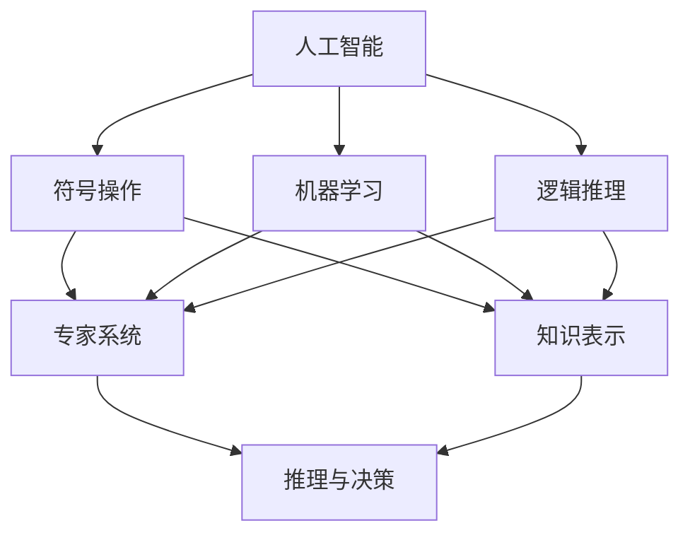

                 

# 1956年达特茅斯会议的宣言

1956年达特茅斯会议被视为人工智能的诞生，这次会议汇集了当时计算机科学、数学和心理学界的最优秀学者，标志着人工智能研究正式起步。会议结束后，人工智能的先驱们发表了一份宣言，奠定了人工智能发展的方向与基础。本文将详细解读这份宣言，探讨其对现代人工智能发展的影响，并展望未来人工智能的前景。

## 1. 背景介绍

### 1.1 问题由来
1950年，阿兰·图灵提出“图灵测试”，提出了人工智能的概念，即在未受限制的对话中，机器能否被看作是“智能”的。此后，人工智能成为科学界和工程界的热门话题，多个领域开始探索如何用机器模拟人类智能。

### 1.2 问题核心关键点
达特茅斯会议由约翰·麦卡锡、马文·明斯基、克劳德·香农和纳撒尼尔·罗切斯特主持，会议邀请了包括丹尼尔·希尔托、马文·爱德华兹和约翰·麦库利斯在内的众多顶尖学者。会议的核心讨论聚焦于如何通过计算机模拟人类的智能行为。

会议结束后，麦卡锡等人发表了《人工智能的研究计划》，对人工智能的未来进行了详细规划，并制定了研究框架。这份宣言明确了人工智能的核心任务和研究目标，对后来的AI发展起到了深远影响。

## 2. 核心概念与联系

### 2.1 核心概念概述

1. **人工智能（Artificial Intelligence, AI）**：指的是让机器执行通常需要人类智能的任务，如推理、问题解决、语言理解和学习。

2. **符号操作（Symbolic Manipulation）**：基于逻辑符号（如命题、谓词、变量）的操作，用以模拟人类思维过程中的抽象和逻辑推理。

3. **感知器（Perceptron）**：最初由弗兰克·罗森布拉特提出，用于模式识别和分类任务。感知器是人工神经网络的基础单元。

4. **机器学习（Machine Learning, ML）**：指让机器通过数据进行自我学习，从而提高其执行特定任务的性能。

5. **逻辑推理（Logical Reasoning）**：利用符号逻辑系统，通过逻辑推理过程得到新的知识或结论。

6. **专家系统（Expert Systems）**：基于人类专家的知识库和规则，通过逻辑推理解决问题的AI系统。

7. **知识表示（Knowledge Representation）**：用机器可理解的方式存储和组织知识，用于推理和学习。

这些核心概念构成了人工智能研究的基本框架，对后来的AI发展起到了决定性影响。

### 2.2 概念间的关系

我们可以使用Mermaid来展示这些核心概念之间的关系：



这个图表展示了大语言模型微调过程中各个核心概念之间的关系：

1. 人工智能是符号操作、机器学习和逻辑推理的基础。
2. 符号操作和逻辑推理结合，形成了专家系统和知识表示的基础。
3. 机器学习与符号操作和逻辑推理相结合，形成了更为复杂和高效的知识表示和推理机制。

通过这些概念，我们可以更清晰地理解达特茅斯宣言对人工智能的基本设想。

## 3. 核心算法原理 & 具体操作步骤

### 3.1 算法原理概述

达特茅斯宣言的核心算法原理是利用符号操作、逻辑推理和机器学习，构建能够执行人类智能任务的AI系统。具体来说，宣言提出了以下几点：

1. **符号操作**：通过符号逻辑系统，将问题转化为计算机可以理解和操作的形式。

2. **逻辑推理**：利用符号逻辑规则，从已有知识中推导出新的结论。

3. **机器学习**：通过数据训练，让AI系统逐渐掌握特定任务的技能。

这些算法原理构成了AI系统的核心逻辑，使得AI能够在特定任务上不断学习和优化。

### 3.2 算法步骤详解

AI系统的构建一般遵循以下步骤：

1. **数据收集**：收集特定任务的相关数据，作为训练AI系统的基础。

2. **符号表示**：将数据转换为符号逻辑形式，用于构建知识库和规则。

3. **规则制定**：根据领域专家的知识，制定逻辑推理规则，构建专家系统。

4. **训练AI系统**：利用数据训练AI系统，使其能够根据规则和知识库执行推理任务。

5. **评估与优化**：通过测试数据集评估AI系统的性能，根据结果不断优化算法和规则。

6. **应用部署**：将优化后的AI系统部署到实际应用场景中，进行持续监控和调整。

### 3.3 算法优缺点

#### 优点：

1. **逻辑清晰**：基于符号逻辑的系统，逻辑清晰，易于理解和解释。

2. **知识重用**：知识库和规则可以重用，提高系统的可扩展性和可维护性。

3. **推理能力强**：逻辑推理机制使得AI系统具备较强的推理和决策能力。

#### 缺点：

1. **数据依赖**：需要大量结构化的数据进行训练，数据获取和标注成本高。

2. **规则复杂**：构建规则库需要领域专家深入理解问题，成本高且复杂。

3. **泛化能力有限**：逻辑推理系统对输入数据和场景变化适应性较差。

4. **知识表示困难**：复杂任务的知识表示困难，难以处理非结构化数据。

### 3.4 算法应用领域

基于达特茅斯宣言的AI系统，已经在多个领域得到了广泛应用，例如：

1. **专家系统**：在医疗、金融、工程等领域，通过专家知识和规则，解决复杂问题。

2. **自然语言处理（NLP）**：通过符号表示和逻辑推理，实现语言理解和生成。

3. **机器人控制**：利用机器学习，训练AI系统进行自主导航和操作。

4. **机器视觉**：通过符号表示和逻辑推理，实现目标检测和图像识别。

5. **语音识别**：通过符号操作和逻辑推理，实现语音识别和处理。

6. **数据挖掘**：通过机器学习，从大量数据中提取知识和规律。

## 4. 数学模型和公式 & 详细讲解  
### 4.1 数学模型构建

在达特茅斯宣言中，符号操作和逻辑推理的核心数学模型是逻辑代数。假设符号逻辑系统为 $S=\{p_1, p_2, ..., p_n\}$，其中 $p_i$ 表示一个逻辑命题。系统中的逻辑推理规则为 $\phi(p_1, p_2, ..., p_n) \rightarrow \psi(p_1, p_2, ..., p_n)$，其中 $\phi$ 为前件，$\psi$ 为后件。

**例子**：假设系统中有两个命题 $p_1: \text{apple}$，$p_2: \text{red}$，则逻辑推理规则可以表示为 $\phi(p_1, p_2) \rightarrow \psi(p_1, p_2)$，其中 $\phi$ 表示“if $p_1$ and $p_2$”，$\psi$ 表示“there is a red apple”。

**示例代码**：

```python
import sympy as sp

# 定义逻辑命题
p1 = sp.Symbol('p1')
p2 = sp.Symbol('p2')
p3 = sp.Symbol('p3')

# 定义逻辑推理规则
phi = p1 & p2
psi = p3
rule = sp.Eq(phi, psi)

# 检查规则是否成立
result = sp.simplify(rule.lhs - rule.rhs)
print(result)
```

### 4.2 公式推导过程

逻辑代数中的推理规则包括：

- 命题的合取规则：$p_1 \land p_2$ 表示 $p_1$ 和 $p_2$ 同时成立。
- 命题的析取规则：$p_1 \lor p_2$ 表示 $p_1$ 和 $p_2$ 至少有一个成立。
- 命题的否定规则：$\neg p$ 表示 $p$ 不成立。
- 命题的合取规则的否定：$\neg(p_1 \land p_2)$ 表示 $p_1$ 和 $p_2$ 不同时成立。
- 命题的析取规则的否定：$\neg(p_1 \lor p_2)$ 表示 $p_1$ 和 $p_2$ 都不成立。

逻辑代数中的推理过程主要通过符号操作和逻辑规则进行推导。例如，假设我们有以下两个命题 $p_1: \text{apple}$ 和 $p_2: \text{red}$，则我们可以构建规则：

- 如果 $p_1$ 且 $p_2$，则 $p_3$ 成立：$\phi(p_1, p_2) \rightarrow \psi(p_3)$。

这个规则表示，如果同时存在苹果和红色的对象，那么可以判断该对象为红苹果。

### 4.3 案例分析与讲解

**例子**：假设有一个专家系统用于诊断是否存在某种疾病。专家系统中有两个规则：

- 如果病人有症状 $p_1$（头痛），且血液检测结果 $p_2$（血液异常），则诊断结果 $p_3$（患病）成立：$\phi(p_1, p_2) \rightarrow \psi(p_3)$。

- 如果病人没有症状 $p_1$，且血液检测结果 $p_2$ 正常，则诊断结果 $p_3$ 不成立：$\neg\phi(p_1, p_2) \rightarrow \neg\psi(p_3)$。

**代码实现**：

```python
# 定义逻辑命题
p1 = sp.Symbol('p1')
p2 = sp.Symbol('p2')
p3 = sp.Symbol('p3')

# 定义逻辑推理规则
phi1 = p1 & p2
psi1 = p3
rule1 = sp.Eq(phi1, psi1)

phi2 = ~p1 & ~p2
psi2 = ~p3
rule2 = sp.Eq(phi2, psi2)

# 检查规则是否成立
result1 = sp.simplify(rule1.lhs - rule1.rhs)
result2 = sp.simplify(rule2.lhs - rule2.rhs)

print(result1)
print(result2)
```

## 5. 项目实践：代码实例和详细解释说明
### 5.1 开发环境搭建

在进行符号逻辑系统构建时，我们需要使用Python的Sympy库。安装Sympy库的命令如下：

```bash
pip install sympy
```

### 5.2 源代码详细实现

以下是一个简单的符号逻辑系统的实现示例：

```python
import sympy as sp

# 定义符号
p1 = sp.Symbol('p1')
p2 = sp.Symbol('p2')
p3 = sp.Symbol('p3')

# 定义逻辑推理规则
phi1 = p1 & p2
psi1 = p3
rule1 = sp.Eq(phi1, psi1)

phi2 = ~p1 & ~p2
psi2 = ~p3
rule2 = sp.Eq(phi2, psi2)

# 检查规则是否成立
result1 = sp.simplify(rule1.lhs - rule1.rhs)
result2 = sp.simplify(rule2.lhs - rule2.rhs)

print(result1)
print(result2)
```

### 5.3 代码解读与分析

这段代码实现了两个简单的逻辑推理规则。`p1` 和 `p2` 表示命题，`phi1` 和 `psi1` 表示规则的前件和后件。规则1表示如果 $p_1$ 和 $p_2$ 同时成立，则 $p_3$ 成立。规则2表示如果 $p_1$ 和 $p_2$ 都不成立，则 $p_3$ 不成立。

## 6. 实际应用场景

基于符号操作和逻辑推理的AI系统，已经在多个领域得到了广泛应用。以下是几个典型的应用场景：

### 6.1 专家系统

专家系统利用符号逻辑和规则，模拟领域专家的知识和推理过程。在医疗、金融等领域，专家系统可以帮助医生进行疾病诊断、金融投资决策等复杂任务。例如，在医疗领域，专家系统可以通过推理规则，结合患者的症状和病历，快速诊断疾病。

### 6.2 自然语言处理

自然语言处理中，符号操作和逻辑推理用于语言理解和生成。例如，语义角色标注（SRL）和关系抽取任务中，通过符号表示和逻辑推理，识别文本中的实体关系。

### 6.3 机器人控制

在机器人控制中，符号逻辑和规则用于自主导航和操作。例如，通过逻辑推理规则，机器人可以判断障碍物位置，规划最优路径。

### 6.4 数据挖掘

数据挖掘中，符号逻辑和规则用于数据关联和规律提取。例如，通过逻辑推理规则，可以从海量数据中提取有用的知识，如用户行为模式和市场趋势。

## 7. 工具和资源推荐

### 7.1 学习资源推荐

为了深入理解符号逻辑和逻辑推理的AI系统，以下是一些推荐的学习资源：

1. **《人工智能：一种现代方法》（Artificial Intelligence: A Modern Approach）**：由 Stuart Russell 和 Peter Norvig 合著的经典教材，介绍了符号操作和逻辑推理的基本原理。

2. **《逻辑与计算机科学导论》（Introduction to Logic and Computation）**：由 Michael Sipser 编写的逻辑学教材，详细介绍了逻辑代数和符号操作。

3. **Coursera 上的“AI for Everyone”课程**：由斯坦福大学和Google合开的入门级AI课程，适合没有编程背景的初学者。

4. **Kaggle上的“符号逻辑”竞赛**：通过竞赛实战，掌握符号逻辑系统的构建和优化。

5. **GitHub上的“符号逻辑系统”项目**：大量开源符号逻辑系统的实现，可以借鉴和学习。

### 7.2 开发工具推荐

在符号逻辑系统的开发中，需要一些常用的开发工具：

1. **Sympy**：用于符号操作和逻辑推理的Python库。

2. **Prolog**：一种逻辑编程语言，用于构建专家系统和知识库。

3. **Wolfram Alpha**：一个强大的符号计算平台，可以用于验证和测试逻辑规则。

4. **ProofCheck**：一个在线逻辑验证工具，用于检查逻辑推理规则的正确性。

5. **Jupyter Notebook**：一个交互式编程环境，可以方便地进行符号操作和逻辑推理的实验。

### 7.3 相关论文推荐

达特茅斯宣言发表以来，符号逻辑和逻辑推理的AI研究取得了长足进展。以下是一些重要的相关论文：

1. **《符号逻辑基础》（A Formal Basis for Empirical Science）**：由 Alan Turing 发表的论文，讨论了符号逻辑在科学实验中的应用。

2. **《逻辑与人工智能的数学基础》（The Mathematical Foundations of Logic Programming）**：由 Donald Michie 和 Linda Townsend 合著的论文，探讨了逻辑编程在人工智能中的应用。

3. **《逻辑与人工智能的语义》（The Semantics of Logical Formulas in Artificial Intelligence）**：由 John McDermott 发表的论文，讨论了逻辑公式在AI中的语义分析。

4. **《符号逻辑的机器学习应用》（Learning in Symbolic AI Systems）**：由 Jon Moody 和 Patrick Judd 发表的论文，讨论了符号逻辑在机器学习中的应用。

## 8. 总结：未来发展趋势与挑战

### 8.1 研究成果总结

达特茅斯宣言奠定了符号逻辑和逻辑推理在人工智能中的重要地位。符号逻辑系统具有清晰的逻辑结构，易于理解和解释，适用于复杂推理和决策任务。逻辑推理规则可以重用，提高系统的可扩展性和可维护性。

### 8.2 未来发展趋势

未来，符号逻辑和逻辑推理的AI系统将进一步发展，主要趋势包括：

1. **符号与深度学习的融合**：符号操作和深度学习结合，可以处理非结构化数据，增强AI系统的泛化能力。

2. **知识图谱的应用**：利用知识图谱进行知识表示和推理，提高系统的推理速度和准确性。

3. **逻辑推理的自动化**：通过机器学习和自动推理技术，实现逻辑推理规则的自动生成和优化。

4. **多模态融合**：将符号逻辑与图像、语音、文本等多种模态数据结合，构建更全面的AI系统。

5. **形式化验证**：通过符号逻辑和自动验证工具，验证AI系统的正确性和安全性。

### 8.3 面临的挑战

尽管符号逻辑和逻辑推理的AI系统在理论上有显著优势，但实际应用中仍面临一些挑战：

1. **数据获取难度大**：构建符号逻辑系统需要大量结构化数据，数据获取和标注成本高。

2. **规则复杂度高**：构建逻辑规则需要领域专家深入理解问题，成本高且复杂。

3. **泛化能力有限**：逻辑推理系统对输入数据和场景变化适应性较差。

4. **知识表示困难**：复杂任务的知识表示困难，难以处理非结构化数据。

### 8.4 研究展望

未来，符号逻辑和逻辑推理的AI系统需要在以下方面进行深入研究：

1. **自动化知识获取**：通过机器学习和知识提取技术，自动生成和优化逻辑推理规则。

2. **多模态融合**：将符号逻辑与多种模态数据结合，构建更全面和高效的AI系统。

3. **可解释性和透明性**：增强AI系统的可解释性和透明性，提升用户信任度。

4. **形式化验证**：通过符号逻辑和自动验证工具，验证AI系统的正确性和安全性。

5. **人机协同**：探索人机协同的AI系统，利用人类专家的知识和经验，优化AI系统的推理和决策能力。

总之，符号逻辑和逻辑推理的AI系统在理论上有显著优势，但实际应用中仍需不断改进和优化。未来，符号逻辑和逻辑推理的AI系统将与深度学习、知识图谱等技术深度融合，构建更全面和高效的智能系统。

## 9. 附录：常见问题与解答

**Q1：符号操作和逻辑推理的AI系统是否适用于所有任务？**

A: 符号操作和逻辑推理的AI系统适用于结构化数据和逻辑推理任务，如医疗诊断、金融决策等。但对于非结构化数据和复杂模式识别任务，符号逻辑系统可能表现不佳。

**Q2：如何构建高效、可维护的符号逻辑系统？**

A: 构建高效、可维护的符号逻辑系统需要以下步骤：

1. **需求分析**：明确任务需求和应用场景，确定需要处理的数据类型和逻辑关系。

2. **知识库构建**：根据领域专家的知识，构建符号逻辑的知识库和规则。

3. **逻辑推理规则设计**：根据任务需求，设计逻辑推理规则，实现知识库的自动化推理。

4. **系统测试和优化**：通过测试数据集评估系统性能，不断优化逻辑规则和知识库。

**Q3：符号逻辑系统如何处理非结构化数据？**

A: 符号逻辑系统通常处理结构化数据，对于非结构化数据，可以通过符号操作和逻辑推理进行预处理，将非结构化数据转化为结构化数据。例如，通过自然语言处理技术，将文本转化为逻辑命题，再进行推理。

**Q4：符号逻辑系统如何与深度学习结合？**

A: 符号逻辑系统与深度学习结合，可以通过逻辑推理规则，对深度学习模型的输出进行后处理，提取有用的知识。例如，在自然语言处理任务中，可以通过逻辑推理规则，从深度学习模型的词向量中提取语义信息。

**Q5：符号逻辑系统如何处理多模态数据？**

A: 符号逻辑系统可以与其他模态数据结合，例如与图像数据结合，进行图像识别和目标检测。通过符号操作和逻辑推理，可以将图像数据转化为逻辑命题，进行推理和决策。

总之，符号逻辑和逻辑推理的AI系统具有清晰的逻辑结构，适用于复杂推理和决策任务。未来，符号逻辑和逻辑推理的AI系统需要不断改进和优化，结合深度学习、知识图谱等技术，构建更全面和高效的智能系统。

