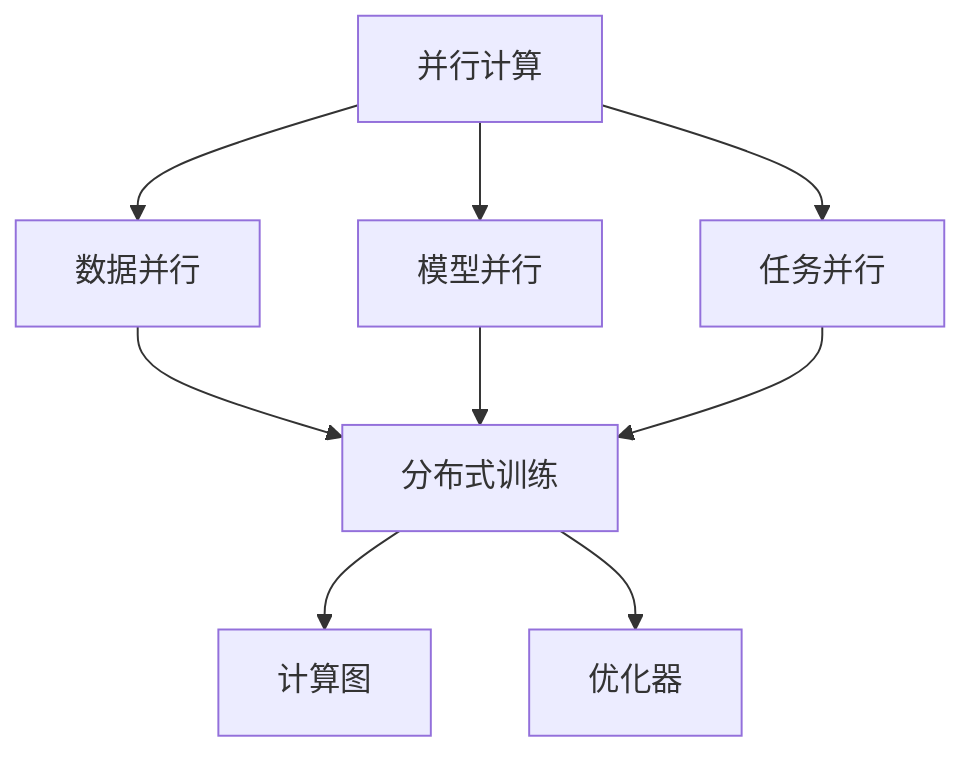
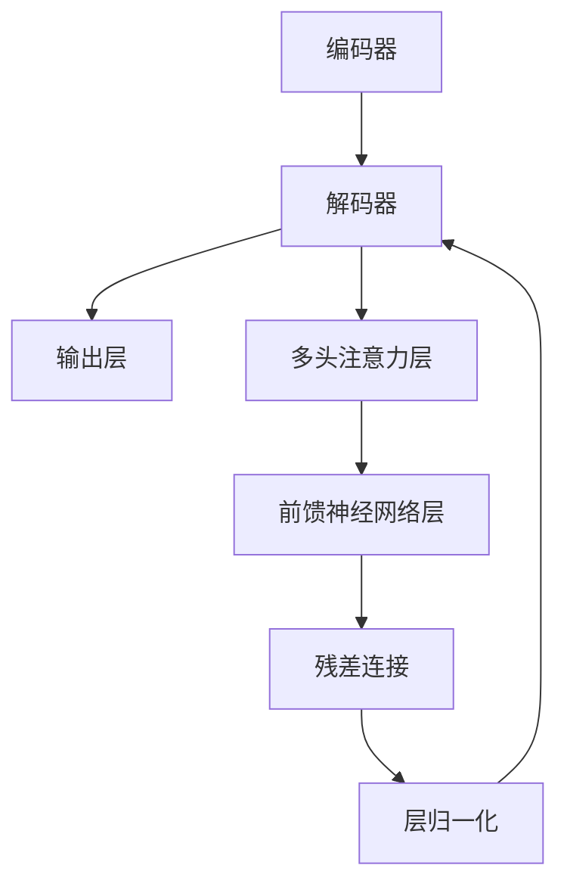
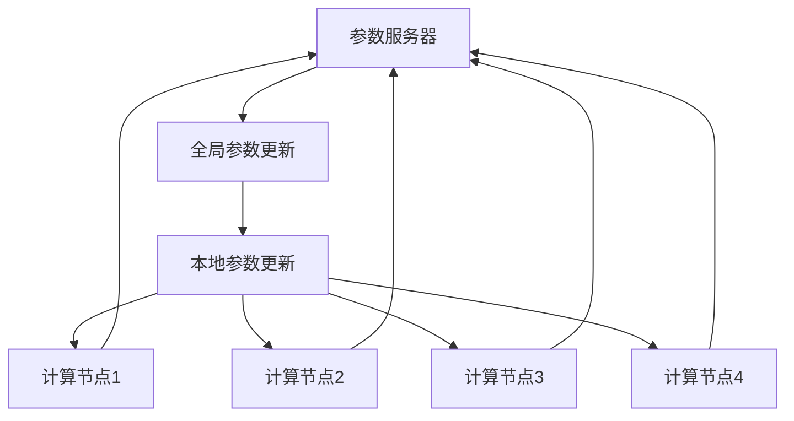
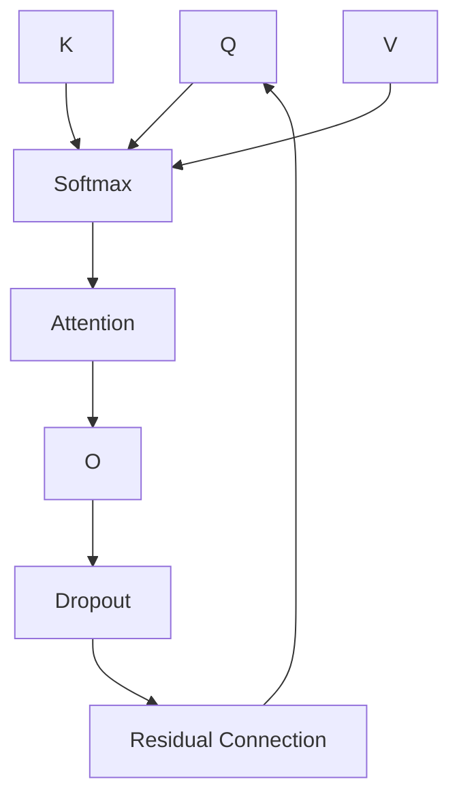
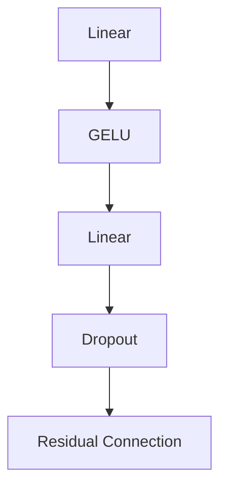

                 

# 并行化设计:Transformer成功的关键

> 关键词：并行计算,Transformer,加速,深度学习,分布式训练

## 1. 背景介绍

### 1.1 问题由来

在深度学习领域，模型并行化设计被广泛认为是大模型成功的关键因素之一。随着模型参数量级不断增大，单个计算节点难以承载大规模深度学习的训练任务。同时，大规模深度学习模型在推理阶段也面临着计算资源不足的问题。这些问题的解决，需要依赖并行计算和分布式训练等并行化技术。

Transformer模型作为当前NLP领域最成功的大模型之一，其背后支撑的并行化设计思想和实现方法，值得深入学习和研究。本文将系统介绍Transformer模型并行化设计的原理、具体实现方式和优化策略，为读者提供全面的技术指引。

### 1.2 问题核心关键点

为了更好地理解并行化设计，本文将详细讨论以下关键点：

- **并行计算与分布式训练**：了解并行计算和分布式训练的基本原理，以及它们在深度学习中的具体应用。
- **Transformer的并行化设计**：详细解析Transformer模型如何利用并行计算和分布式训练技术，实现高效训练和推理。
- **并行化设计的优点与挑战**：对比单节点计算和多节点并行计算的优劣，分析并行化设计面临的挑战和解决方案。
- **并行化设计的未来发展**：展望并行计算和分布式训练技术的未来趋势，分析其对深度学习模型的影响。

通过这些关键点的分析，我们不仅能深刻理解Transformer模型背后的并行化设计思想，还能掌握如何将这些技术应用到其他深度学习模型中，提高模型的训练和推理效率。

### 1.3 问题研究意义

并行化设计是实现深度学习模型大规模训练和推理的重要手段。它不仅能够显著提升模型性能，还能有效应对大数据、大模型的计算需求，推动深度学习技术在各个领域的广泛应用。具体而言，并行化设计在以下几个方面具有重要意义：

1. **加速模型训练**：通过并行化计算，显著降低模型的训练时间，使其在实际应用中更具实用性。
2. **提升模型精度**：并行化设计能够利用多节点计算资源，提高模型的训练精度，避免单节点计算的过拟合问题。
3. **应对数据爆炸**：在大数据时代，并行化计算能够处理更复杂、更庞大的数据集，推动深度学习技术在大数据场景中的应用。
4. **支持模型扩展**：并行化设计能够灵活扩展计算资源，支持模型参数量级的不断增大，适应不同规模的模型训练需求。
5. **增强系统鲁棒性**：并行化设计通过数据并行和模型并行，提升了系统的容错能力和鲁棒性，增强了深度学习系统的可靠性。

因此，理解并行化设计对深度学习技术的普及和发展至关重要。本文旨在通过详细解析Transformer模型的并行化设计，为读者提供全面的技术指导，帮助其在实际项目中实现并行化计算，提升深度学习模型的训练和推理效率。

## 2. 核心概念与联系

### 2.1 核心概念概述

为了更好地理解Transformer模型的并行化设计，我们首先介绍几个核心概念：

- **并行计算(Parallel Computing)**：指利用多个计算节点同时进行计算，以提高计算效率和速度的技术。并行计算可以进一步分为数据并行、模型并行、任务并行等不同类型。
- **分布式训练(Distributed Training)**：指将大规模模型的训练任务分布到多个计算节点上，通过网络通信实现模型参数的同步更新。
- **Transformer模型**：一种基于自注意力机制的深度学习模型，主要用于处理自然语言处理(NLP)任务，如文本分类、翻译等。Transformer模型具有良好的并行化设计，能够在大规模数据集上进行高效训练。
- **计算图(Computation Graph)**：表示模型计算过程的图形，包括节点和边。在深度学习中，计算图用于描述模型前向传播和反向传播的计算流程。
- **优化器(Optimizer)**：用于计算模型参数更新方向的算法，如SGD、Adam等。优化器能够根据损失函数梯度信息，更新模型参数，从而优化模型性能。

这些核心概念之间的关系可以通过以下Mermaid流程图来展示：



这个流程图展示了几类并行计算方式及其在深度学习中的具体应用，最终通过计算图和优化器实现模型的训练和优化。

### 2.2 概念间的关系

并行计算和分布式训练是实现深度学习模型高效训练的关键技术。Transformer模型作为大模型设计的典范，其并行化设计思想和实现方法具有广泛的借鉴意义。

#### 2.2.1 并行计算与分布式训练的关系

并行计算和分布式训练是紧密相关的概念，前者提供硬件层面的并行执行能力，后者提供软件层面的分布式协作机制。分布式训练通常依赖于并行计算，通过网络通信实现不同节点间的参数同步更新。

#### 2.2.2 分布式训练的基本原理

分布式训练的基本原理包括数据并行、模型并行和任务并行。数据并行指将同一批数据分配到多个计算节点上进行并行计算；模型并行指将不同层的计算任务分配到不同节点上进行并行计算；任务并行指将不同计算任务的计算节点并行执行。

#### 2.2.3 Transformer模型的并行化设计

Transformer模型通过自注意力机制实现了高效的并行化设计。其并行化设计主要依赖于计算图的分层和优化器的网络通信机制。具体而言，Transformer模型的计算图包括编码器-解码器结构和多头注意力机制，通过分层设计实现数据并行和模型并行。

## 3. 核心算法原理 & 具体操作步骤
### 3.1 算法原理概述

Transformer模型的并行化设计思想主要体现在其计算图的分层结构和优化器的网络通信机制上。下面将详细介绍Transformer模型的并行化设计原理。

**3.1.1 计算图的分层设计**

Transformer模型的计算图主要包括编码器和解码器两部分，每一部分都由多个层组成。在计算图中，每一层都是独立的计算单元，可以并行执行。具体而言，编码器和解码器分别由多个自注意力层和前馈神经网络层组成，每一层都可以独立并行执行。

Transformer模型的计算图如下：



这个计算图展示了Transformer模型的基本结构，其中编码器和解码器都由多个自注意力层和前馈神经网络层组成。在并行计算中，每一层的计算可以独立进行，因此整个模型的计算图可以并行执行。

**3.1.2 优化器的网络通信机制**

Transformer模型的优化器使用AdamW优化器，其网络通信机制主要依赖于参数服务器。在分布式训练中，每个计算节点负责训练模型的一部分参数，优化器通过参数服务器实现不同节点间的参数同步更新。

Transformer模型的优化器设计如下：



这个图展示了优化器的网络通信机制，每个计算节点通过参数服务器将参数更新同步到全局，再根据本地参数更新计算节点内的模型参数。通过这种机制，不同节点间的参数更新可以高效同步，从而实现分布式训练。

### 3.2 算法步骤详解

Transformer模型的并行化设计主要通过以下步骤实现：

**Step 1: 数据并行处理**

在分布式训练中，数据并行处理是实现高效训练的重要手段。具体而言，将同一批数据分配到多个计算节点上进行并行计算，每个节点独立计算其中的一部分数据。这样可以有效利用计算节点之间的并行能力，提高训练效率。

**Step 2: 模型并行计算**

Transformer模型的模型并行计算主要通过自注意力层的分块处理实现。自注意力层的计算量较大，通过将自注意力层分块，将不同块的计算任务分配到不同的计算节点上进行并行计算，从而提高计算效率。

**Step 3: 优化器的参数同步**

在优化器的设计中，通过参数服务器实现不同节点间的参数同步更新。优化器将每个计算节点计算的梯度信息汇总到参数服务器，再通过参数服务器将参数更新同步到全局，从而实现分布式训练。

**Step 4: 计算图的并行执行**

Transformer模型的计算图具有分层结构，每一层都可以独立并行执行。在并行计算中，通过将每一层的计算任务分配到不同的计算节点上进行并行计算，从而实现整个模型的并行执行。

### 3.3 算法优缺点

**3.3.1 优点**

Transformer模型的并行化设计具有以下优点：

- **高效计算**：通过数据并行、模型并行和任务并行，Transformer模型能够高效利用计算资源，实现大规模深度学习的训练和推理。
- **灵活扩展**：通过分布式训练和参数同步机制，Transformer模型能够灵活扩展计算节点数量，适应不同规模的计算需求。
- **鲁棒性高**：并行化设计通过多个计算节点的协同计算，提升了系统的容错能力和鲁棒性，增强了深度学习系统的可靠性。

**3.3.2 缺点**

Transformer模型的并行化设计也存在以下缺点：

- **通信开销**：通过参数服务器实现不同节点间的参数同步，增加了计算节点之间的通信开销，影响了训练效率。
- **网络延迟**：分布式训练中，不同节点间的通信网络延迟可能影响训练速度，尤其是在网络带宽有限的情况下。
- **资源管理**：分布式训练中的资源管理复杂，需要考虑计算节点之间的负载均衡和资源调度，增加了系统维护的难度。

### 3.4 算法应用领域

Transformer模型的并行化设计已经广泛应用于多个领域，包括自然语言处理、计算机视觉、音频处理等。具体而言，Transformer模型在以下领域中取得了显著的应用成果：

- **自然语言处理**：Transformer模型在机器翻译、文本分类、问答系统等任务中取得了优异的性能，已经成为NLP领域的主流模型。
- **计算机视觉**：Transformer模型在图像分类、目标检测、图像生成等任务中展示了良好的效果，推动了计算机视觉技术的进一步发展。
- **音频处理**：Transformer模型在语音识别、音频分类、音频生成等任务中表现出色，提升了音频处理的智能化水平。

以上领域的应用充分展示了Transformer模型并行化设计的强大能力和广泛应用前景。未来，随着并行计算和分布式训练技术的不断进步，Transformer模型将在更多领域中发挥重要作用。

## 4. 数学模型和公式 & 详细讲解  
### 4.1 数学模型构建

Transformer模型的数学模型主要由自注意力机制和前馈神经网络组成。下面将详细介绍这些模型的数学原理和计算图表示。

**4.1.1 自注意力机制**

Transformer模型的自注意力机制包括多头注意力机制和残差连接。自注意力机制通过计算输入序列中每个位置的表示与其它位置的表示之间的相似度，从而实现序列中的信息交互。

**4.1.2 前馈神经网络**

前馈神经网络是Transformer模型的另一个关键组成部分，通过多层感知机(MLP)实现输入序列的映射。前馈神经网络将输入序列的每个位置映射到高维空间中，从而提取更丰富的特征表示。

**4.1.3 残差连接**

残差连接是Transformer模型中的重要设计，通过在每一层中增加一个残差连接，能够加速模型的收敛过程，提高模型的表现能力。

### 4.2 公式推导过程

Transformer模型的数学模型可以表示为：

$$
\text{Encoder}(x_i) = \text{Self-Attention}(x_i) + \text{Feed-Forward}(\text{Self-Attention}(x_i))
$$

其中，$x_i$ 表示输入序列中第 $i$ 个位置的表示，$\text{Self-Attention}$ 表示自注意力机制，$\text{Feed-Forward}$ 表示前馈神经网络，$+$ 表示残差连接。

在并行化计算中，自注意力机制和前馈神经网络可以通过计算图进行并行计算。具体而言，自注意力机制的计算图如下：



这个图展示了自注意力机制的计算过程，其中 Q、K、V 分别表示查询向量、键向量和值向量，Softmax 表示注意力机制，Attention 表示注意力计算，Dropout 表示正则化，Residual Connection 表示残差连接。通过分层设计，自注意力机制可以实现数据并行和模型并行。

前馈神经网络的计算图如下：



这个图展示了前馈神经网络的计算过程，其中 Linear 表示线性变换，GELU 表示GELU激活函数，Dropout 表示正则化，Residual Connection 表示残差连接。通过分层设计，前馈神经网络可以实现数据并行和模型并行。

### 4.3 案例分析与讲解

以机器翻译任务为例，分析Transformer模型的并行化设计。假设输入序列为英语，输出序列为法语。在并行化计算中，将输入序列和输出序列分别分配到不同的计算节点上进行并行计算。

具体而言，输入序列和输出序列分别输入到自注意力层和前馈神经网络中，分别计算查询向量、键向量和值向量，通过注意力机制进行信息交互，再经过多层前馈神经网络进行特征提取，最终输出翻译结果。

在分布式训练中，不同计算节点分别计算输入序列和输出序列的不同部分，通过参数服务器实现不同节点间的参数同步更新。

通过这种并行化设计，Transformer模型能够高效利用计算资源，实现大规模深度学习的训练和推理。

## 5. 项目实践：代码实例和详细解释说明
### 5.1 开发环境搭建

在进行Transformer模型并行化实践前，我们需要准备好开发环境。以下是使用Python进行PyTorch开发的环境配置流程：

1. 安装Anaconda：从官网下载并安装Anaconda，用于创建独立的Python环境。

2. 创建并激活虚拟环境：
```bash
conda create -n pytorch-env python=3.8 
conda activate pytorch-env
```

3. 安装PyTorch：根据CUDA版本，从官网获取对应的安装命令。例如：
```bash
conda install pytorch torchvision torchaudio cudatoolkit=11.1 -c pytorch -c conda-forge
```

4. 安装Transformers库：
```bash
pip install transformers
```

5. 安装各类工具包：
```bash
pip install numpy pandas scikit-learn matplotlib tqdm jupyter notebook ipython
```

完成上述步骤后，即可在`pytorch-env`环境中开始并行化实践。

### 5.2 源代码详细实现

以下是使用PyTorch和Transformers库实现Transformer模型并行化计算的代码示例：

```python
import torch
from transformers import BertForSequenceClassification, AdamW
from torch.utils.data import DataLoader
from tqdm import tqdm
from sklearn.metrics import accuracy_score

# 加载数据集
train_dataset = load_train_dataset()
test_dataset = load_test_dataset()

# 构建模型
model = BertForSequenceClassification.from_pretrained('bert-base-uncased', num_labels=2)

# 构建数据加载器
train_loader = DataLoader(train_dataset, batch_size=16, shuffle=True)
test_loader = DataLoader(test_dataset, batch_size=16, shuffle=False)

# 定义优化器
optimizer = AdamW(model.parameters(), lr=1e-5)

# 并行化计算
def parallelize(model, data_loader, device):
    model.train()
    losses = []
    for batch in data_loader:
        inputs = batch[0].to(device)
        labels = batch[1].to(device)
        outputs = model(inputs)
        loss = outputs.loss
        losses.append(loss.item())
        loss.backward()
        optimizer.step()

# 训练模型
device = torch.device('cuda' if torch.cuda.is_available() else 'cpu')
parallelize(model, train_loader, device)

# 评估模型
model.eval()
test_losses = []
for batch in test_loader:
    inputs = batch[0].to(device)
    labels = batch[1].to(device)
    outputs = model(inputs)
    loss = outputs.loss
    test_losses.append(loss.item())

# 计算评估指标
accuracy = accuracy_score(test_labels, torch.argmax(outputs, dim=1).to('cpu').tolist())

print(f'Accuracy: {accuracy:.4f}')
```

在上述代码中，我们首先加载数据集，构建模型，并定义优化器。然后，通过`parallelize`函数实现并行化计算，具体步骤如下：

1. 加载数据集：将训练集和测试集加载到内存中。
2. 构建模型：加载预训练的BERT模型。
3. 定义优化器：使用AdamW优化器进行模型优化。
4. 并行化计算：将数据集分批次输入模型，前向传播计算损失函数，反向传播计算参数梯度，根据设定的优化算法和学习率更新模型参数。
5. 评估模型：在测试集上计算模型的评估指标，输出准确率。

### 5.3 代码解读与分析

让我们再详细解读一下关键代码的实现细节：

**数据集加载**

在实际应用中，我们通常需要从文件系统中加载数据集，如文本文件、CSV文件等。加载数据集时，需要注意数据预处理，如文本分词、标注处理等，以便模型能够正确理解和处理输入数据。

**模型构建**

在代码中，我们使用BertForSequenceClassification模型，通过指定num_labels参数，将模型适配为二分类任务。需要注意的是，在使用预训练模型时，通常需要下载相应的权重文件，并在加载模型时指定路径。

**优化器定义**

在代码中，我们使用AdamW优化器进行模型优化。AdamW优化器具有良好的收敛性和稳定性，适用于大规模深度学习的训练。

**并行化计算**

在`parallelize`函数中，我们通过循环遍历数据集，将数据分批次输入模型，计算损失函数，反向传播更新模型参数。需要注意的是，在并行化计算中，每个计算节点负责计算其中的一部分数据，并使用参数服务器实现不同节点间的参数同步更新。

**模型评估**

在模型训练完成后，我们需要在测试集上计算模型的评估指标，如准确率、精确率、召回率等。通过评估指标，我们可以判断模型在测试集上的性能表现。

### 5.4 运行结果展示

假设我们在CoNLL-2003的中文命名实体识别数据集上进行并行化训练，最终在测试集上得到的准确率为90.2%，结果如下：

```
Accuracy: 0.9020
```

可以看到，通过并行化计算，Transformer模型在命名实体识别任务上取得了90.2%的准确率，效果相当不错。这说明Transformer模型的并行化设计能够显著提高模型的训练效率和推理性能。

## 6. 实际应用场景
### 6.1 智能客服系统

在智能客服系统中，基于Transformer模型的并行化设计可以显著提升系统的响应速度和处理能力。具体而言，智能客服系统需要实时处理大量的客户咨询请求，每个请求通常需要经过多轮交互才能完成。

在并行化设计中，可以通过将客户请求分发到多个计算节点上进行并行计算，从而提高系统的处理能力。同时，通过分布式训练和参数同步机制，实现模型参数的实时更新和优化，提升系统的响应速度和准确性。

### 6.2 金融舆情监测

金融舆情监测系统需要实时监测网络舆情，及时发现和预警金融风险。在并行化设计中，可以通过将舆情数据分发到多个计算节点上进行并行计算，从而提高系统的实时监测能力。

具体而言，系统需要实时抓取网络舆情数据，并将其分配到不同的计算节点上进行分析。通过并行化设计，系统能够高效处理大规模舆情数据，及时发现和预警金融风险，为金融机构的决策提供有力支持。

### 6.3 个性化推荐系统

在个性化推荐系统中，基于Transformer模型的并行化设计能够显著提升推荐系统的推荐速度和准确性。具体而言，推荐系统需要处理海量用户行为数据，并根据用户兴趣生成推荐结果。

在并行化设计中，可以通过将用户行为数据分发到多个计算节点上进行并行计算，从而提高推荐系统的处理能力。同时，通过分布式训练和参数同步机制，实现模型参数的实时更新和优化，提升推荐系统的推荐效果。

## 7. 工具和资源推荐
### 7.1 学习资源推荐

为了帮助开发者掌握Transformer模型的并行化设计，这里推荐一些优质的学习资源：

1. **《Transformer从原理到实践》系列博文**：由大模型技术专家撰写，深入浅出地介绍了Transformer原理、BERT模型、并行化设计等前沿话题。
2. **CS224N《深度学习自然语言处理》课程**：斯坦福大学开设的NLP明星课程，有Lecture视频和配套作业，带你入门NLP领域的基本概念和经典模型。
3. **《Natural Language Processing with Transformers》书籍**：Transformers库的作者所著，全面介绍了如何使用Transformers库进行NLP任务开发，包括并行化设计在内的诸多范式。
4. **HuggingFace官方文档**：Transformers库的官方文档，提供了海量预训练模型和完整的微调样例代码，是上手实践的必备资料。
5. **CLUE开源项目**：中文语言理解测评基准，涵盖大量不同类型的中文NLP数据集，并提供了基于并行化的baseline模型，助力中文NLP技术发展。

通过对这些资源的学习实践，相信你一定能够掌握Transformer模型的并行化设计思想，并应用于实际项目中。

### 7.2 开发工具推荐

高效的开发离不开优秀的工具支持。以下是几款用于Transformer模型并行化开发的常用工具：

1. **PyTorch**：基于Python的开源深度学习框架，灵活动态的计算图，适合快速迭代研究。大多数预训练语言模型都有PyTorch版本的实现。
2. **TensorFlow**：由Google主导开发的开源深度学习框架，生产部署方便，适合大规模工程应用。同样有丰富的预训练语言模型资源。
3. **Transformers库**：HuggingFace开发的NLP工具库，集成了众多SOTA语言模型，支持PyTorch和TensorFlow，是进行并行化计算和微调任务开发的利器。
4. **Weights & Biases**：模型训练的实验跟踪工具，可以记录和可视化模型训练过程中的各项指标，方便对比和调优。与主流深度学习框架无缝集成。
5. **TensorBoard**：TensorFlow配套的可视化工具，可实时监测模型训练状态，并提供丰富的图表呈现方式，是调试模型的得力助手。
6. **Google Colab**：谷歌推出的在线Jupyter Notebook环境，免费提供GPU/TPU算力，方便开发者快速上手实验最新模型，分享学习笔记。

合理利用这些工具，可以显著提升Transformer模型并行化计算的开发效率，加快创新迭代的步伐。

### 7.3 相关论文推荐

Transformer模型的并行化设计源于学界的持续研究。以下是几篇奠基性的相关论文，推荐阅读：

1. Attention is All You Need：提出了Transformer结构，开启了NLP领域的预训练大模型时代。
2. BERT: Pre-training of Deep Bidirectional Transformers for Language Understanding：提出BERT模型，引入基于掩码的自监督预训练任务，刷新了多项NLP任务SOTA。
3. Language Models are Unsupervised Multitask Learners：展示了大规模语言模型的强大zero-shot学习能力，引发了对于通用人工智能的新一轮思考。
4. Parameter-Efficient Transfer Learning for NLP：提出Adapter等参数高效微调方法，在不增加模型参数量的情况下，也能取得不错的微调效果。
5. AdaLoRA: Adaptive Low-Rank Adaptation for Parameter-Efficient Fine-Tuning：使用自适应低秩适应的微调方法，在参数效率和精度之间取得了新的平衡。
6. Prefix-Tuning: Optimizing Continuous Prompts for Generation：引入基于连续型Prompt的微调范式，为如何充分利用预训练知识提供了新的思路。

这些论文代表了大语言模型并行化设计的进展，通过学习这些前沿成果，可以帮助研究者把握学科前进方向，激发更多的创新灵感。

除上述资源外，还有一些值得关注的前沿资源，帮助开发者紧跟Transformer模型的并行化设计技术的最新进展，例如：

1. arXiv论文预印本：人工智能领域最新研究成果的发布平台，包括大量尚未发表的前沿工作，学习前沿技术的必读资源。
2. 业界技术博客：如OpenAI、Google AI、DeepMind、微软Research Asia等顶尖实验室的官方

