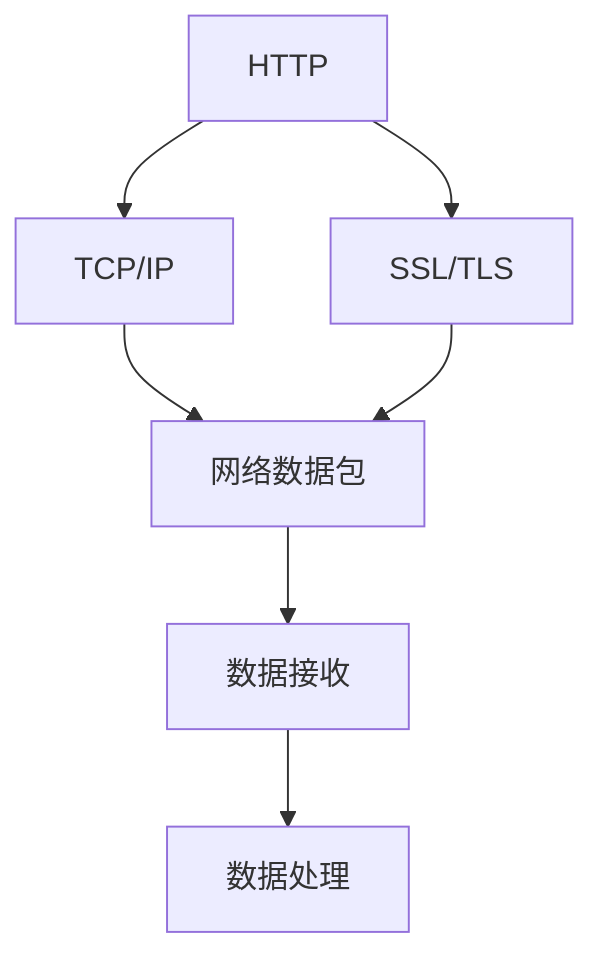
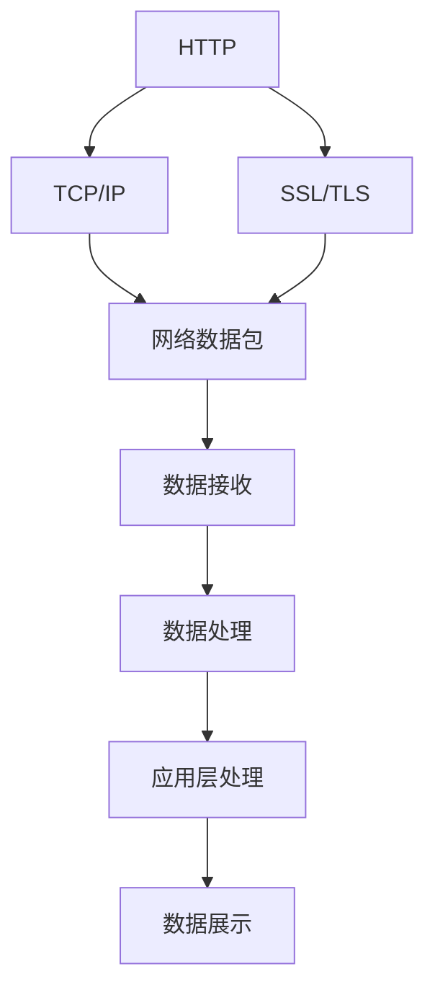

                 

## 1. 背景介绍

在当今数字化、网络化的时代，网络通信和数据交换变得前所未有的频繁和重要。为了规范和保障网络通信的安全、高效和互操作性，广泛使用的开源协议和数据协议（如HTTP、TCP/IP、SSL/TLS、JSON等）成为了全球互联网生态的基石。本系列文章将深入探讨这些协议和技术，介绍其核心概念、原理和应用，帮助读者理解和掌握在网络通信和数据交换中广泛使用的开源协议和数据协议。

### 1.1 问题由来

随着互联网的普及和信息技术的快速发展，网络通信协议和数据格式已经深入到各行各业，成为了现代信息社会的核心基础设施。然而，面对复杂多变的互联网应用场景和不断涌现的网络安全威胁，如何设计、实现和使用这些协议和格式，成为了技术开发者、网络工程师、安全专家等众多专业人士面临的重要挑战。

为了解决这些挑战，全球各地的研究机构、开源社区和企业纷纷贡献力量，推出了众多高质量的开源协议和数据协议，并不断迭代更新以适应新的技术趋势和应用需求。这些协议和格式不仅促进了网络通信的标准化和互操作性，也为数据安全和隐私保护提供了坚实保障。

## 2. 核心概念与联系

### 2.1 核心概念概述

本节将介绍几个与网络通信和数据交换紧密相关的核心概念：

- **HTTP**：超文本传输协议（HyperText Transfer Protocol），用于在Web浏览器和Web服务器之间传输超文本的协议。
- **TCP/IP**：传输控制协议/网际协议（Transmission Control Protocol/Internet Protocol），用于互联网络中的数据包传输的协议族。
- **SSL/TLS**：安全套接层/传输层安全性（Secure Sockets Layer/Transport Layer Security），用于在网络通信中提供加密和身份认证的协议。
- **JSON**：JavaScript Object Notation，一种轻量级、易于阅读和编写的数据交换格式。

这些协议和格式相互配合，共同构建了互联网的基础通信架构。它们在网络通信中的作用、相互关系以及如何保障数据安全和隐私，是本系列文章的重点内容。

### 2.2 核心概念之间的关系

这些核心概念之间的关系可以通过以下Mermaid流程图来展示：



这个流程图展示了大语言模型微调过程中各个概念的相互关系：

- HTTP使用TCP/IP协议进行数据传输。
- HTTPS协议在HTTP基础上增加了SSL/TLS协议以提供安全通信。
- 数据在网络中通过TCP/IP协议封装成数据包进行传输。
- 接收方通过解包、解密等操作获取原始数据，并进行进一步处理。

### 2.3 核心概念的整体架构

最后，我们用一个综合的流程图来展示这些核心概念在大语言模型微调过程中的整体架构：



这个综合流程图展示了从HTTP协议的客户端请求到数据在应用层的处理和展示的整个流程。

## 3. 核心算法原理 & 具体操作步骤

### 3.1 算法原理概述

开源协议和数据协议的核心原理涉及网络通信和数据传输的多个层面，包括但不限于以下方面：

- 数据包的分割与重组：确保数据能够在不可靠的网络环境中完整传输。
- 流量控制和拥塞控制：优化网络资源利用，防止网络拥堵和资源浪费。
- 加密和认证：保障数据传输的安全性，防止数据被窃听、篡改和伪造。
- 协议版本协商：确保不同版本和实现之间的兼容性。

这些原理通常以协议栈的形式呈现，每一层负责不同的功能和优化。例如，TCP/IP协议栈包括应用层、传输层和网络层，每一层都有其特定的功能和优化目标。

### 3.2 算法步骤详解

以下是一些典型协议和数据格式的核心算法步骤：

#### HTTP协议

1. **请求与响应**：客户端向服务器发送HTTP请求，服务器根据请求生成HTTP响应，包含状态码、头部信息、主体内容等。
2. **状态码处理**：服务器返回的状态码表示请求处理结果，常见的状态码包括200、404、500等。
3. **头部信息**：头部信息包含HTTP协议版本、响应内容类型、编码方式、缓存控制等元数据。
4. **主体内容**：响应主体内容根据请求的具体类型而定，可以是文本、图片、视频等。

#### TCP/IP协议

1. **连接建立**：使用三次握手协议建立TCP连接，确认双方通信能力。
2. **数据传输**：将数据分块封装成TCP数据段，进行可靠传输。
3. **流量控制**：使用滑动窗口机制控制数据传输速度，防止网络拥塞。
4. **连接释放**：使用四次挥手协议释放TCP连接，清理通信资源。

#### SSL/TLS协议

1. **握手协商**：双方交换加密算法和参数，生成共享密钥。
2. **加密传输**：使用共享密钥对数据进行加密，防止数据被窃听和篡改。
3. **认证和信任**：通过数字证书验证通信双方的身份，建立信任关系。
4. **密钥更新**：定期更新加密密钥，防止长期密钥被破解。

#### JSON格式

1. **数据结构**：采用键值对形式组织数据，易于阅读和理解。
2. **序列化和反序列化**：JSON格式通过序列化和反序列化将数据转换成可传输的格式。
3. **跨平台支持**：支持多种编程语言和平台，便于数据交换和共享。

### 3.3 算法优缺点

这些协议和数据格式各有优缺点：

#### HTTP协议

- **优点**：简单易用，支持多种请求方法，灵活度高。
- **缺点**：数据传输不安全，不保证数据完整性。

#### TCP/IP协议

- **优点**：可靠性强，支持多连接和流控制，传输速度快。
- **缺点**：头部开销大，复杂度高，不利于实时通信。

#### SSL/TLS协议

- **优点**：保障数据传输安全，支持身份认证，传输可靠。
- **缺点**：计算复杂度高，性能开销大，握手协商过程耗时。

#### JSON格式

- **优点**：格式简单，易于解析，跨平台支持。
- **缺点**：不提供数据类型检查，易出错。

## 4. 数学模型和公式 & 详细讲解

### 4.1 数学模型构建

本节将使用数学语言对开源协议和数据格式的核心算法进行更加严格的刻画。

#### HTTP协议

HTTP协议的请求和响应模型可以用以下公式表示：

$$
\text{Request} = \{\text{Method}, \text{URL}, \text{Headers}, \text{Body}\}
$$

其中，Method表示请求方法（如GET、POST），URL表示资源地址，Headers包含HTTP头部信息，Body为请求正文。

响应模型的表示如下：

$$
\text{Response} = \{\text{Status Code}, \text{Headers}, \text{Body}\}
$$

其中，Status Code表示请求处理状态码，Headers包含HTTP头部信息，Body为响应正文。

#### TCP/IP协议

TCP协议的数据传输模型可以用以下公式表示：

$$
\text{TCP Segment} = \{\text{Source Port}, \text{Destination Port}, \text{Sequence Number}, \text{Acknowledgment Number}, \text{Data Offset}, \text{Window Size}, \text{Flags}, \text{Checksum}, \text{Urgent Pointer}, \text{Options}, \text{Payload}\}
$$

其中，Source Port和Destination Port表示通信双方端口号，Sequence Number和Acknowledgment Number表示数据段编号和确认号，Data Offset表示数据偏移量，Window Size表示滑动窗口大小，Flags表示控制标志，Checksum表示校验和，Urgent Pointer表示紧急数据指针，Options表示可选字段，Payload表示传输数据。

#### SSL/TLS协议

SSL/TLS协议的握手协商模型可以用以下公式表示：

$$
\text{Handshake} = \{\text{Hello Message}, \text{Certificate}, \text{Server Hello}, \text{Client Hello}, \text{Key Exchange}, \text{Certificate Request}, \text{Server Hello Done}, \text{Finished}\}
$$

其中，Hello Message表示握手开始消息，Certificate表示数字证书，Server Hello和Client Hello表示握手协商消息，Key Exchange表示加密密钥交换，Certificate Request表示证书请求，Server Hello Done表示服务器端完成握手，Finished表示握手成功。

#### JSON格式

JSON格式的数据模型可以用以下公式表示：

$$
\text{JSON Data} = \{\text{Object}, \text{Array}\}
$$

其中，Object表示键值对结构，Array表示有序序列。

### 4.2 公式推导过程

以TCP协议的数据传输模型为例，推导数据段编号（Sequence Number）和确认号（Acknowledgment Number）的计算公式：

设当前TCP连接的数据段编号为$n$，发送窗口大小为$w$，接收窗口大小为$r$，最大数据段长度为$m$，每个数据段的头部长度为$h$。则数据段编号$n$的计算公式如下：

$$
n = (n - w + m + h) \mod 2^{32}
$$

确认号（Acknowledgment Number）的计算公式如下：

$$
n' = (n + m + h) \mod 2^{32}
$$

其中，$n'$表示下一个期望接收的数据段编号。

### 4.3 案例分析与讲解

以HTTP请求和响应为例，分析典型的响应码和头部信息。

假设客户端向服务器发送了一个GET请求，请求地址为`https://example.com/path/to/resource`，头部信息包含`User-Agent: Mozilla/5.0`和`Accept-Encoding: gzip`。

服务器返回了一个200 OK响应，状态码为200，头部信息包含`Content-Type: text/html; charset=UTF-8`、`Server: Apache/2.4.29`、`Date: Thu, 05 May 2022 08:00:00 GMT`等。

响应主体内容为`<html><head><title>Example Page</title></head><body><h1>Welcome to Example Page</h1><p>This is an example page.</p></body></html>`。

## 5. 项目实践：代码实例和详细解释说明

### 5.1 开发环境搭建

在进行开源协议和数据格式实践前，我们需要准备好开发环境。以下是使用Python进行Python开发的环境配置流程：

1. 安装Anaconda：从官网下载并安装Anaconda，用于创建独立的Python环境。

2. 创建并激活虚拟环境：
```bash
conda create -n pyenv python=3.8 
conda activate pyenv
```

3. 安装Python依赖库：
```bash
pip install requests
```

4. 安装HTTP和TCP/IP相关库：
```bash
pip install httplib2
```

5. 安装SSL/TLS和JSON相关库：
```bash
pip install pycrypto
```

完成上述步骤后，即可在`pyenv`环境中开始开源协议和数据格式实践。

### 5.2 源代码详细实现

这里以HTTP请求和响应为例，给出使用Python进行HTTP请求和响应的代码实现。

```python
import requests

url = 'https://example.com/path/to/resource'
headers = {'User-Agent': 'Mozilla/5.0', 'Accept-Encoding': 'gzip'}

response = requests.get(url, headers=headers)

print(response.status_code)
print(response.headers)
print(response.text)
```

在这个代码中，首先导入了`requests`库，用于发送HTTP请求。然后定义了请求的URL和头部信息。最后，使用`requests.get`方法发送GET请求，获取响应对象。通过打印响应状态码、头部信息和主体内容，分析响应结果。

### 5.3 代码解读与分析

这段代码展示了使用Python进行HTTP请求和响应处理的基本步骤。

- 使用`requests.get`方法发送HTTP GET请求，并传递请求的URL和头部信息。
- 获取响应对象`response`，包含状态码、头部信息和主体内容。
- 打印响应状态码、头部信息和主体内容，分析响应结果。

## 6. 实际应用场景

### 6.1 实际应用场景

开源协议和数据格式已经在众多实际应用场景中得到广泛应用，以下是几个典型场景：

#### Web应用

Web应用是HTTP协议的主要应用场景之一。用户通过浏览器向Web服务器发送HTTP请求，获取Web页面和资源。Web服务器根据请求生成HTTP响应，包含状态码、头部信息和主体内容。

#### 文件传输

FTP（文件传输协议）使用TCP/IP协议进行文件传输。客户端向FTP服务器发送文件请求，服务器响应文件列表，客户端选择文件进行下载或上传。

#### 网络通信

TCP/IP协议广泛用于网络通信。客户端与服务器建立TCP连接，进行数据传输和通信。

#### 数据加密

SSL/TLS协议常用于数据加密和身份认证。客户端与服务器通过SSL/TLS握手协商，建立安全通信通道。

#### 数据交换

JSON格式常用于数据交换和API接口开发。客户端通过HTTP请求获取JSON数据，然后根据需要进行处理和展示。

## 7. 工具和资源推荐

### 7.1 学习资源推荐

为了帮助开发者系统掌握开源协议和数据格式的核心原理和应用，这里推荐一些优质的学习资源：

1. 《TCP/IP详解》系列书籍：由W.Richard Stevens等著，详细介绍了TCP/IP协议族的核心原理和实现细节。

2. 《HTTP权威指南》：由David Gourley和Yochai Karas等著，介绍了HTTP协议的详细规范和应用场景。

3. 《SSL/TLS设计与实现》：由Bodo Haas等著，深入探讨了SSL/TLS协议的实现原理和安全性。

4. 《JSON简介》：由Douglas Crockford著，介绍了JSON格式的基本概念和应用。

5. 《Python网络编程》：由张俊等著，介绍了使用Python进行网络编程的基本方法和实践。

通过对这些资源的学习实践，相信你一定能够系统掌握开源协议和数据格式的核心原理和应用，并用于解决实际的网络通信和数据交换问题。

### 7.2 开发工具推荐

高效的开发离不开优秀的工具支持。以下是几款用于开源协议和数据格式开发的常用工具：

1. Python：简单易学，社区活跃，广泛应用于Web开发、数据处理、网络编程等领域。

2. requests：Python的HTTP客户端库，简单易用，支持HTTP请求和响应处理。

3. httplib2：Python的HTTP客户端库，支持HTTP代理、缓存等功能。

4. pycrypto：Python的加密库，支持SSL/TLS协议实现。

5. json：Python的JSON处理库，支持JSON数据的序列化和反序列化。

6. Wireshark：网络协议分析工具，支持捕捉、分析网络数据包，理解网络通信细节。

合理利用这些工具，可以显著提升开源协议和数据格式开发的效率，加快创新迭代的步伐。

### 7.3 相关论文推荐

开源协议和数据格式的发展源于学界的持续研究。以下是几篇奠基性的相关论文，推荐阅读：

1. A. C. Menezes等著的《Handbook of Applied Cryptography》，介绍了公钥密码学和SSL/TLS协议的安全性。

2. D. J. Blackman等著的《TCP/IP Illustrated》，详细介绍了TCP/IP协议的核心原理和实现细节。

3. F. Karels等著的《HTTP in Practice》，介绍了HTTP协议的详细规范和应用场景。

4. S. Floyd等著的《Network Protocol》，详细介绍了网络协议的核心原理和实现细节。

5. Y. Yoshida等著的《Python Network Programming》，介绍了使用Python进行网络编程的基本方法和实践。

这些论文代表了大语言模型微调技术的发展脉络。通过学习这些前沿成果，可以帮助研究者把握学科前进方向，激发更多的创新灵感。

除上述资源外，还有一些值得关注的前沿资源，帮助开发者紧跟开源协议和数据格式技术的最新进展，例如：

1. arXiv论文预印本：人工智能领域最新研究成果的发布平台，包括大量尚未发表的前沿工作，学习前沿技术的必读资源。

2. 业界技术博客：如Google、Microsoft、Facebook等顶尖实验室的官方博客，第一时间分享他们的最新研究成果和洞见。

3. 技术会议直播：如ACM、IEEE、IEEE等相关领域的顶级会议现场或在线直播，能够聆听到大佬们的前沿分享，开拓视野。

4. GitHub热门项目：在GitHub上Star、Fork数最多的开源协议和数据格式相关项目，往往代表了该技术领域的发展趋势和最佳实践，值得去学习和贡献。

5. 行业分析报告：各大咨询公司如McKinsey、PwC等针对开源协议和数据格式技术的分析报告，有助于从商业视角审视技术趋势，把握应用价值。

总之，对于开源协议和数据格式的学习和实践，需要开发者保持开放的心态和持续学习的意愿。多关注前沿资讯，多动手实践，多思考总结，必将收获满满的成长收益。

## 8. 总结：未来发展趋势与挑战

### 8.1 总结

本文对广泛使用的开源协议和数据格式进行了全面系统的介绍。首先阐述了HTTP、TCP/IP、SSL/TLS、JSON等核心协议和格式的研究背景和意义，明确了它们在网络通信和数据交换中的核心作用。其次，从原理到实践，详细讲解了这些协议和格式的核心算法和操作步骤，给出了具体的代码实现和分析。同时，本文还广泛探讨了这些协议和格式在Web应用、文件传输、网络通信、数据加密、数据交换等多个实际应用场景中的应用前景，展示了它们在推动互联网技术发展中的重要作用。此外，本文精选了相关的学习资源、开发工具和学术论文，力求为读者提供全方位的技术指引。

通过本文的系统梳理，可以看到，开源协议和数据格式在大规模互联网应用中扮演了至关重要的角色，极大地促进了网络通信的标准化和互操作性。未来，伴随技术的不断演进，这些协议和格式将持续提升网络通信的效率和安全性，推动人工智能和网络技术的进一步融合。

### 8.2 未来发展趋势

展望未来，开源协议和数据格式的发展趋势可能包括以下几个方向：

1. **协议演进**：随着互联网技术的发展，现有的协议和格式将被不断迭代和优化。例如，IPv6协议和HTTP/3协议将逐渐取代IPv4协议和HTTP/2协议，提升网络通信的效率和安全性。

2. **新协议引入**：随着新的应用场景和需求的出现，新的协议将被引入以应对挑战。例如，WebAssembly协议将逐步取代JavaScript，提升Web应用的性能和安全性。

3. **数据格式更新**：现有的数据格式将被不断优化和升级。例如，JSON格式将逐步引入更多数据类型和语义，提升数据交换的灵活性和效率。

4. **协议融合**：不同的协议和格式将被深度整合，提升网络通信的效率和兼容性。例如，HTTPS协议将与WebAssembly协议深度整合，提升Web应用的安全性和性能。

5. **跨平台支持**：开源协议和数据格式将更加注重跨平台支持，确保不同设备和平台之间的互操作性。例如，WebAssembly协议将支持多个操作系统和浏览器，提升Web应用的可移植性。

这些趋势凸显了开源协议和数据格式技术的持续演进和创新，相信未来将会有更多先进技术和思想被引入到网络通信和数据交换领域。

### 8.3 面临的挑战

尽管开源协议和数据格式技术已经取得了显著成就，但在迈向更加智能化、普适化应用的过程中，它仍面临诸多挑战：

1. **兼容性问题**：不同设备和平台之间的兼容性问题仍然存在，尤其是老旧设备和不支持新协议的浏览器，导致一些新功能无法实现。

2. **安全问题**：虽然SSL/TLS协议提供了加密和身份认证机制，但网络攻击手段也在不断演进，如何保障数据传输的安全性和隐私性仍然是一个重要挑战。

3. **性能问题**：网络通信和数据交换涉及大量的计算和传输操作，如何提升性能和效率，减少延迟和带宽消耗，是一个持续优化的课题。

4. **标准统一**：不同公司和组织制定的标准和实现可能存在差异，如何统一标准，确保协议和格式的一致性和互操作性，是一个重要的研究方向。

5. **新协议支持**：随着新技术和新应用的出现，如何快速引入和支持新协议，是一个挑战。例如，WebAssembly协议的引入需要广泛的兼容和支持。

这些挑战需要全球技术开发者、网络工程师和标准制定者共同努力，不断优化和完善开源协议和数据格式技术，确保其在互联网生态中的广泛应用和持续发展。

### 8.4 研究展望

未来，开源协议和数据格式技术的进一步发展将需要关注以下几个方面：

1. **协议性能优化**：通过改进协议算法和实现，提升网络通信和数据交换的性能和效率。

2. **安全性和隐私保护**：引入更先进的安全技术和加密算法，确保数据传输的安全性和隐私性。

3. **跨平台支持和兼容性**：开发和推广跨平台协议和数据格式，确保不同设备和平台之间的互操作性。

4. **新协议和格式的引入**：持续引入新的协议和格式，以应对新的应用场景和需求。

5. **标准统一和规范化**：推动开源协议和数据格式的标准化，确保其一致性和互操作性。

6. **开源社区的贡献**：鼓励开源社区的积极参与和贡献，推动开源协议和数据格式技术的持续演进和创新。

总之，开源协议和数据格式技术是大规模互联网应用的重要基石，未来的发展需要全球技术开发者、网络工程师和标准制定者共同努力，持续优化和完善其核心原理和应用，以应对未来的挑战和需求。

## 9. 附录：常见问题与解答

**Q1：HTTP协议和HTTPS协议的区别是什么？**

A: HTTP协议是一种超文本传输协议，用于在Web浏览器和Web服务器之间传输超文本。HTTPS协议则是在HTTP协议基础上增加了SSL/TLS协议，提供加密和身份认证机制，保障数据传输的安全性。

**Q2：TCP/IP协议和UDP协议的区别是什么？**

A: TCP/IP协议是一种面向连接的协议，提供可靠的数据传输和流量控制，适用于文件传输和网络通信。UDP协议则是一种无连接的协议，不提供可靠性保障，适用于实时通信和数据交换。

**Q3：SSL/TLS协议和TLS协议的区别是什么？**

A: SSL/TLS协议是一种安全套接层协议，提供加密和身份认证机制，保障数据传输的安全性。TLS协议是SSL协议的后续版本，采用更先进的加密算法和安全性机制，进一步提升了数据传输的安全性。

**Q4：JSON格式的优势和劣势是什么？**

A: JSON格式的优势包括格式简单、易于解析、跨平台支持、数据交换灵活等。劣势包括缺乏数据类型检查、易出错、不支持复杂数据结构等。

**Q5：如何提升Web应用的安全性和性能？**

A: 提升Web应用的安全性和性能可以从以下几个方面入手：

- 使用HTTPS协议，提供加密和身份认证机制。
- 使用CDN（内容分发网络），提升页面加载速度。
- 使用WebAssembly协议，提升JavaScript执行效率。
- 使用HTTP/3协议，提升Web应用的网络性能。

这些措施可以显著提升Web应用的安全性和性能，提供更优质的用户体验。

---

作者：禅与计算机程序设计艺术 / Zen and the Art of Computer Programming

