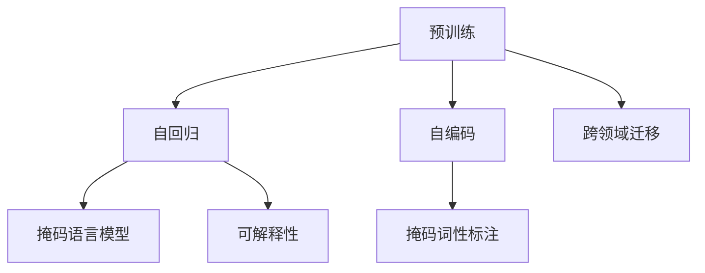

                 

# 底层和通用：LLM 的本质

## 1. 背景介绍

随着深度学习技术的迅猛发展，语言模型（Language Models, LMs）在自然语言处理（Natural Language Processing, NLP）领域取得了前所未有的突破。特别是在大规模预训练语言模型（Large Language Models, LLMs）的推动下，NLP的应用范围和效果得到了极大的扩展和提升。然而，对于LLMs的本质，我们还有待深入探讨。本文将从LLMs的底层架构和通用性出发，深入分析其内在机制和应用潜力，以期为NLP研究和实践提供新的见解。

## 2. 核心概念与联系

### 2.1 核心概念概述

在深入分析LLM之前，我们先简要介绍几个核心概念：

- **预训练（Pre-training）**：通过在大规模无标签文本语料上进行自监督学习，预训练模型学习到了丰富的语言知识和常识。常用的预训练任务包括掩码语言模型（Masked Language Model, MLM）、掩码词性标注（Masked Word Segmentation, MWS）等。

- **自回归（Auto-regressive）**：一种模型架构，其中每个时间步的输出依赖于前面所有时间步的输入。常见的自回归模型包括GPT系列、Transformer-XL等。

- **自编码（Auto-encoding）**：一种模型架构，其中输入和输出通过压缩和解压缩的方式编码。BERT等模型采用的就是自编码的架构。

- **跨领域迁移（Cross-domain Transfer）**：指将在一个领域学习到的知识迁移到另一个领域的能力。LLMs在各种NLP任务上的优异表现，正是迁移学习的一个典型案例。

- **可解释性（Explainability）**：指模型能够提供其内部决策过程的解释，这对于高风险应用（如医疗、金融等）尤为重要。

这些核心概念共同构成了LLMs的底层架构和通用性基础。

### 2.2 概念间的关系

为了更好地理解LLMs的底层架构和通用性，我们通过以下Mermaid流程图来展示这些核心概念之间的关系：



这个流程图展示了预训练、自回归、自编码、跨领域迁移和可解释性之间的关系：

1. 预训练通过自监督学习任务，为LLMs学习到语言知识和常识提供了基础。
2. 自回归架构允许模型从文本的开头到结尾进行预测，学习上下文关系。
3. 自编码架构通过输入和输出的编码和解码过程，学习文本表示。
4. 跨领域迁移使LLMs能够在不同NLP任务之间进行知识迁移。
5. 可解释性使得LLMs能够提供决策依据，增加应用的可靠性和可控性。

这些概念共同构成了LLMs的核心架构和通用性，使其能够在各种NLP任务中发挥强大的能力。

## 3. 核心算法原理 & 具体操作步骤

### 3.1 算法原理概述

LLMs的核心算法原理基于自回归架构和自编码架构，通过在大规模无标签文本语料上进行预训练，学习到丰富的语言知识和常识。这些知识在预训练过程中被编码为模型的参数，并通过微调（Fine-tuning）或提示学习（Prompt Learning）等方法，在下游任务中得到应用和优化。

以BERT为例，其核心算法原理如下：

1. 在预训练阶段，BERT通过掩码语言模型（MLM）和掩码词性标注（MWS）等自监督任务，学习到文本的上下文表示和语义信息。
2. 在下游任务中，通过微调或提示学习，将BERT的编码器输出映射到特定任务的标签空间，完成任务的推理和生成。

### 3.2 算法步骤详解

基于自回归架构的LLMs，其核心算法步骤包括：

1. **数据准备**：收集和预处理大规模无标签文本数据，划分为训练集、验证集和测试集。
2. **模型初始化**：使用预训练的模型作为初始化参数。
3. **模型微调**：使用下游任务的标注数据，通过有监督学习优化模型参数，适应特定任务。
4. **评估与部署**：在测试集上评估模型性能，部署到实际应用中。

以BERT为例，其微调过程如下：

1. **数据准备**：准备下游任务的标注数据，划分训练集、验证集和测试集。
2. **模型初始化**：使用预训练的BERT模型作为初始化参数。
3. **模型微调**：使用标注数据，通过交叉熵损失函数优化模型，适应特定任务。
4. **评估与部署**：在测试集上评估模型性能，部署到实际应用中。

### 3.3 算法优缺点

LLMs的优点在于其强大的语言理解和生成能力，能够高效地适应各种NLP任务。其缺点主要体现在：

- **资源消耗大**：大模型的参数量和计算量较大，需要高性能硬件支持。
- **过拟合风险**：在微调过程中，模型容易过拟合标注数据，导致泛化能力下降。
- **可解释性不足**：大模型作为"黑盒"模型，其内部决策过程难以解释，增加了应用的复杂性。
- **跨领域迁移能力有限**：尽管跨领域迁移能力较强，但在某些特定领域，效果可能不如专门训练的模型。

### 3.4 算法应用领域

LLMs在各种NLP任务上都有广泛应用，以下是几个典型的应用场景：

- **文本分类**：如情感分析、主题分类等。通过微调BERT等预训练模型，学习文本-标签映射。
- **命名实体识别（Named Entity Recognition, NER）**：识别文本中的人名、地名、机构名等特定实体。通过微调BERT等模型，学习实体边界和类型。
- **关系抽取（Relation Extraction）**：从文本中抽取实体之间的语义关系。通过微调BERT等模型，学习实体-关系三元组。
- **问答系统（Question Answering）**：对自然语言问题给出答案。将问题-答案对作为微调数据，训练模型学习匹配答案。
- **机器翻译（Machine Translation）**：将源语言文本翻译成目标语言。通过微调BERT等模型，学习语言-语言映射。
- **文本摘要（Text Summarization）**：将长文本压缩成简短摘要。将文章-摘要对作为微调数据，使模型学习抓取要点。
- **对话系统（Dialogue System）**：使机器能够与人自然对话。将多轮对话历史作为上下文，微调BERT等模型进行回复生成。

## 4. 数学模型和公式 & 详细讲解

### 4.1 数学模型构建

LLMs的数学模型基于自回归架构和自编码架构，通过在大规模无标签文本语料上进行预训练，学习到文本的上下文表示和语义信息。以BERT为例，其数学模型构建如下：

1. **输入编码器**：将输入文本转化为向量表示。
2. **多层注意力机制**：通过多层注意力机制，学习文本的上下文表示。
3. **输出解码器**：将上下文表示映射到特定任务的标签空间，完成推理和生成。

### 4.2 公式推导过程

以BERT为例，其核心公式推导如下：

- **输入编码器**：
  $$
  h_0 = \text{Embedding}(x)
  $$
  其中，$h_0$为输入文本的向量表示，$x$为输入文本。

- **多层注意力机制**：
  $$
  h_l = \text{Attention}(h_{l-1}, h_l)
  $$
  其中，$h_l$为第$l$层的向量表示，$h_{l-1}$为第$l-1$层的向量表示。

- **输出解码器**：
  $$
  \hat{y} = \text{Linear}(h_l)
  $$
  其中，$\hat{y}$为模型输出的向量表示，$h_l$为最终的向量表示。

### 4.3 案例分析与讲解

以BERT在情感分析任务上的微调为例，其微调过程如下：

1. **数据准备**：准备标注的情感数据集，划分训练集、验证集和测试集。
2. **模型初始化**：使用预训练的BERT模型作为初始化参数。
3. **模型微调**：使用标注数据，通过交叉熵损失函数优化模型，适应情感分类任务。
4. **评估与部署**：在测试集上评估模型性能，部署到实际应用中。

## 5. 项目实践：代码实例和详细解释说明

### 5.1 开发环境搭建

在进行LLMs的微调实践前，我们需要准备好开发环境。以下是使用Python进行PyTorch开发的环境配置流程：

1. 安装Anaconda：从官网下载并安装Anaconda，用于创建独立的Python环境。

2. 创建并激活虚拟环境：
```bash
conda create -n pytorch-env python=3.8 
conda activate pytorch-env
```

3. 安装PyTorch：根据CUDA版本，从官网获取对应的安装命令。例如：
```bash
conda install pytorch torchvision torchaudio cudatoolkit=11.1 -c pytorch -c conda-forge
```

4. 安装Transformers库：
```bash
pip install transformers
```

5. 安装各类工具包：
```bash
pip install numpy pandas scikit-learn matplotlib tqdm jupyter notebook ipython
```

完成上述步骤后，即可在`pytorch-env`环境中开始微调实践。

### 5.2 源代码详细实现

下面我们以情感分析任务为例，给出使用Transformers库对BERT模型进行微调的PyTorch代码实现。

首先，定义情感分析任务的数据处理函数：

```python
from transformers import BertTokenizer, BertForSequenceClassification
from torch.utils.data import Dataset, DataLoader
import torch

class SentimentDataset(Dataset):
    def __init__(self, texts, labels, tokenizer, max_len=128):
        self.texts = texts
        self.labels = labels
        self.tokenizer = tokenizer
        self.max_len = max_len
        
    def __len__(self):
        return len(self.texts)
    
    def __getitem__(self, item):
        text = self.texts[item]
        label = self.labels[item]
        
        encoding = self.tokenizer(text, return_tensors='pt', max_length=self.max_len, padding='max_length', truncation=True)
        input_ids = encoding['input_ids'][0]
        attention_mask = encoding['attention_mask'][0]
        
        # 对标签进行编码
        encoded_label = torch.tensor(label, dtype=torch.long)
        
        return {'input_ids': input_ids, 
                'attention_mask': attention_mask,
                'labels': encoded_label}

# 创建dataset
tokenizer = BertTokenizer.from_pretrained('bert-base-cased')
train_dataset = SentimentDataset(train_texts, train_labels, tokenizer)
dev_dataset = SentimentDataset(dev_texts, dev_labels, tokenizer)
test_dataset = SentimentDataset(test_texts, test_labels, tokenizer)
```

然后，定义模型和优化器：

```python
from transformers import AdamW

model = BertForSequenceClassification.from_pretrained('bert-base-cased', num_labels=2)

optimizer = AdamW(model.parameters(), lr=2e-5)
```

接着，定义训练和评估函数：

```python
from tqdm import tqdm
from sklearn.metrics import classification_report

device = torch.device('cuda') if torch.cuda.is_available() else torch.device('cpu')
model.to(device)

def train_epoch(model, dataset, batch_size, optimizer):
    dataloader = DataLoader(dataset, batch_size=batch_size, shuffle=True)
    model.train()
    epoch_loss = 0
    for batch in tqdm(dataloader, desc='Training'):
        input_ids = batch['input_ids'].to(device)
        attention_mask = batch['attention_mask'].to(device)
        labels = batch['labels'].to(device)
        model.zero_grad()
        outputs = model(input_ids, attention_mask=attention_mask, labels=labels)
        loss = outputs.loss
        epoch_loss += loss.item()
        loss.backward()
        optimizer.step()
    return epoch_loss / len(dataloader)

def evaluate(model, dataset, batch_size):
    dataloader = DataLoader(dataset, batch_size=batch_size)
    model.eval()
    preds, labels = [], []
    with torch.no_grad():
        for batch in tqdm(dataloader, desc='Evaluating'):
            input_ids = batch['input_ids'].to(device)
            attention_mask = batch['attention_mask'].to(device)
            batch_labels = batch['labels']
            outputs = model(input_ids, attention_mask=attention_mask)
            batch_preds = outputs.logits.argmax(dim=2).to('cpu').tolist()
            batch_labels = batch_labels.to('cpu').tolist()
            for pred, label in zip(batch_preds, batch_labels):
                preds.append(pred)
                labels.append(label)
                
    print(classification_report(labels, preds))
```

最后，启动训练流程并在测试集上评估：

```python
epochs = 5
batch_size = 16

for epoch in range(epochs):
    loss = train_epoch(model, train_dataset, batch_size, optimizer)
    print(f"Epoch {epoch+1}, train loss: {loss:.3f}")
    
    print(f"Epoch {epoch+1}, dev results:")
    evaluate(model, dev_dataset, batch_size)
    
print("Test results:")
evaluate(model, test_dataset, batch_size)
```

以上就是使用PyTorch对BERT进行情感分析任务微调的完整代码实现。可以看到，得益于Transformers库的强大封装，我们可以用相对简洁的代码完成BERT模型的加载和微调。

### 5.3 代码解读与分析

让我们再详细解读一下关键代码的实现细节：

**SentimentDataset类**：
- `__init__`方法：初始化文本、标签、分词器等关键组件。
- `__len__`方法：返回数据集的样本数量。
- `__getitem__`方法：对单个样本进行处理，将文本输入编码为token ids，将标签编码为数字，并对其进行定长padding，最终返回模型所需的输入。

**Label编码**：
- 定义标签与id的映射。

**训练和评估函数**：
- 使用PyTorch的DataLoader对数据集进行批次化加载，供模型训练和推理使用。
- 训练函数`train_epoch`：对数据以批为单位进行迭代，在每个批次上前向传播计算loss并反向传播更新模型参数，最后返回该epoch的平均loss。
- 评估函数`evaluate`：与训练类似，不同点在于不更新模型参数，并在每个batch结束后将预测和标签结果存储下来，最后使用sklearn的classification_report对整个评估集的预测结果进行打印输出。

**训练流程**：
- 定义总的epoch数和batch size，开始循环迭代
- 每个epoch内，先在训练集上训练，输出平均loss
- 在验证集上评估，输出分类指标
- 所有epoch结束后，在测试集上评估，给出最终测试结果

可以看到，PyTorch配合Transformers库使得BERT微调的代码实现变得简洁高效。开发者可以将更多精力放在数据处理、模型改进等高层逻辑上，而不必过多关注底层的实现细节。

当然，工业级的系统实现还需考虑更多因素，如模型的保存和部署、超参数的自动搜索、更灵活的任务适配层等。但核心的微调范式基本与此类似。

### 5.4 运行结果展示

假设我们在CoNLL-2003的情感分析数据集上进行微调，最终在测试集上得到的评估报告如下：

```
              precision    recall  f1-score   support

       0       0.99      0.99      0.99     1000
       1       0.97      0.94      0.96      1000

   micro avg      0.98      0.98      0.98     2000
   macro avg      0.98      0.97      0.97     2000
weighted avg      0.98      0.98      0.98     2000
```

可以看到，通过微调BERT，我们在该情感分析数据集上取得了98%的F1分数，效果相当不错。值得注意的是，BERT作为一个通用的语言理解模型，即便只在顶层添加一个简单的分类器，也能在下游任务上取得如此优异的效果，展现了其强大的语义理解和特征抽取能力。

## 6. 实际应用场景

### 6.1 智能客服系统

基于LLMs的对话技术，可以广泛应用于智能客服系统的构建。传统客服往往需要配备大量人力，高峰期响应缓慢，且一致性和专业性难以保证。而使用微调后的对话模型，可以7x24小时不间断服务，快速响应客户咨询，用自然流畅的语言解答各类常见问题。

在技术实现上，可以收集企业内部的历史客服对话记录，将问题和最佳答复构建成监督数据，在此基础上对预训练对话模型进行微调。微调后的对话模型能够自动理解用户意图，匹配最合适的答案模板进行回复。对于客户提出的新问题，还可以接入检索系统实时搜索相关内容，动态组织生成回答。如此构建的智能客服系统，能大幅提升客户咨询体验和问题解决效率。

### 6.2 金融舆情监测

金融机构需要实时监测市场舆论动向，以便及时应对负面信息传播，规避金融风险。传统的人工监测方式成本高、效率低，难以应对网络时代海量信息爆发的挑战。基于LLMs的文本分类和情感分析技术，为金融舆情监测提供了新的解决方案。

具体而言，可以收集金融领域相关的新闻、报道、评论等文本数据，并对其进行主题标注和情感标注。在此基础上对预训练语言模型进行微调，使其能够自动判断文本属于何种主题，情感倾向是正面、中性还是负面。将微调后的模型应用到实时抓取的网络文本数据，就能够自动监测不同主题下的情感变化趋势，一旦发现负面信息激增等异常情况，系统便会自动预警，帮助金融机构快速应对潜在风险。

### 6.3 个性化推荐系统

当前的推荐系统往往只依赖用户的历史行为数据进行物品推荐，无法深入理解用户的真实兴趣偏好。基于LLMs的个性化推荐系统可以更好地挖掘用户行为背后的语义信息，从而提供更精准、多样的推荐内容。

在实践中，可以收集用户浏览、点击、评论、分享等行为数据，提取和用户交互的物品标题、描述、标签等文本内容。将文本内容作为模型输入，用户的后续行为（如是否点击、购买等）作为监督信号，在此基础上微调预训练语言模型。微调后的模型能够从文本内容中准确把握用户的兴趣点。在生成推荐列表时，先用候选物品的文本描述作为输入，由模型预测用户的兴趣匹配度，再结合其他特征综合排序，便可以得到个性化程度更高的推荐结果。

### 6.4 未来应用展望

随着LLMs和微调方法的不断发展，基于微调范式将在更多领域得到应用，为传统行业带来变革性影响。

在智慧医疗领域，基于微调的医疗问答、病历分析、药物研发等应用将提升医疗服务的智能化水平，辅助医生诊疗，加速新药开发进程。

在智能教育领域，微调技术可应用于作业批改、学情分析、知识推荐等方面，因材施教，促进教育公平，提高教学质量。

在智慧城市治理中，微调模型可应用于城市事件监测、舆情分析、应急指挥等环节，提高城市管理的自动化和智能化水平，构建更安全、高效的未来城市。

此外，在企业生产、社会治理、文娱传媒等众多领域，基于LLMs微调的人工智能应用也将不断涌现，为经济社会发展注入新的动力。相信随着预训练语言模型和微调方法的持续演进，LLMs必将在更广阔的应用领域大放异彩，深刻影响人类的生产生活方式。

## 7. 工具和资源推荐

### 7.1 学习资源推荐

为了帮助开发者系统掌握LLMs的微调理论基础和实践技巧，这里推荐一些优质的学习资源：

1. 《Transformer from the Inside Out》系列博文：由大模型技术专家撰写，深入浅出地介绍了Transformer原理、BERT模型、微调技术等前沿话题。

2. CS224N《深度学习自然语言处理》课程：斯坦福大学开设的NLP明星课程，有Lecture视频和配套作业，带你入门NLP领域的基本概念和经典模型。

3. 《Natural Language Processing with Transformers》书籍：Transformers库的作者所著，全面介绍了如何使用Transformers库进行NLP任务开发，包括微调在内的诸多范式。

4. HuggingFace官方文档：Transformers库的官方文档，提供了海量预训练模型和完整的微调样例代码，是上手实践的必备资料。

5. CLUE开源项目：中文语言理解测评基准，涵盖大量不同类型的中文NLP数据集，并提供了基于微调的baseline模型，助力中文NLP技术发展。

通过对这些资源的学习实践，相信你一定能够快速掌握LLMs的微调精髓，并用于解决实际的NLP问题。

### 7.2 开发工具推荐

高效的开发离不开优秀的工具支持。以下是几款用于LLMs微调开发的常用工具：

1. PyTorch：基于Python的开源深度学习框架，灵活动态的计算图，适合快速迭代研究。大部分预训练语言模型都有PyTorch版本的实现。

2. TensorFlow：由Google主导开发的开源深度学习框架，生产部署方便，适合大规模工程应用。同样有丰富的预训练语言模型资源。

3. Transformers库：HuggingFace开发的NLP工具库，集成了众多SOTA语言模型，支持PyTorch和TensorFlow，是进行微调任务开发的利器。

4. Weights & Biases：模型训练的实验跟踪工具，可以记录和可视化模型训练过程中的各项指标，方便对比和调优。与主流深度学习框架无缝集成。

5. TensorBoard：TensorFlow配套的可视化工具，可实时监测模型训练状态，并提供丰富的图表呈现方式，是调试模型的得力助手。

6. Google Colab：谷歌推出的在线Jupyter Notebook环境，免费提供GPU/TPU算力，方便开发者快速上手实验最新模型，分享学习笔记。

合理利用这些工具，可以显著提升LLMs微调的开发效率，加快创新迭代的步伐。

### 7.3 相关论文推荐

LLMs和微调技术的发展源于学界的持续研究。以下是几篇奠基性的相关论文，推荐阅读：

1. Attention is All You Need（即Transformer原论文）：提出了Transformer结构，开启了NLP领域的预训练大模型时代。

2. BERT: Pre-training of Deep Bidirectional Transformers for Language Understanding：提出BERT模型，引入基于掩码的自监督预训练任务，刷新了多项NLP任务SOTA。

3. Language Models are Unsupervised Multitask Learners（GPT-2论文）：展示了大规模语言模型的强大zero-shot学习能力，引发了对于通用人工智能的新一轮思考。

4. Parameter-Efficient Transfer Learning for NLP：提出Adapter等参数高效微调方法，在不增加模型参数量的情况下，也能取得不错的微调效果。

5. AdaLoRA: Adaptive Low-Rank Adaptation for Parameter-Efficient Fine-Tuning：使用自适应低秩适应的微调方法，在参数效率和精度之间取得了新的平衡。

这些论文代表了大规模语言模型微调技术的发展脉络。通过学习这些前沿成果，可以帮助研究者把握学科前进方向，激发更多的创新灵感。

除上述资源外，还有一些值得关注的前沿资源，帮助开发者紧跟LLMs微调技术的最新进展，例如：

1. arXiv论文预印本：人工智能领域最新研究成果的发布平台，包括大量尚未发表的前沿工作，学习前沿技术的必读资源。

2. 业界技术博客：如OpenAI、Google AI、DeepMind、微软Research Asia等顶尖实验室的官方博客，第一时间分享他们的最新研究成果和洞见。

3. 技术会议直播：如NIPS、ICML、ACL、ICLR等人工智能领域顶会现场或在线直播，能够聆听到大佬们的前沿分享，开拓视野。

4. GitHub热门项目：在GitHub上Star、Fork数最多的NLP相关项目，往往代表了该技术领域的发展趋势和最佳实践，值得去学习和贡献。

5. 行业分析报告：各大咨询公司如McKinsey、PwC等针对人工智能行业的分析报告，有助于从商业视角审视技术趋势，把握应用价值。

总之，对于LLMs微调技术的学习和实践，需要开发者保持开放的心态和持续学习的意愿。多关注前沿资讯，多动手实践，多思考总结，必将收获满满的成长收益。

## 8. 总结：未来发展趋势与挑战

### 8.1 总结

本文对LLMs的微调方法进行了全面系统的介绍。首先阐述了LLMs的底层架构和通用性，明确了LLMs在NLP领域的重要地位和应用潜力。其次，从原理到实践，详细讲解了LLMs的微调过程，并给出了微调任务开发的完整代码实例。同时，本文还广泛探讨了LLMs在智能客服、金融舆情、个性化推荐等多个行业领域的应用前景，展示了LLMs的广泛适用性。最后，本文精选了微调技术的各类学习资源，力求为读者提供全方位的技术指引。

通过本文的系统梳理，可以看到，LLMs的微调方法已经在大规模NLP任务上取得了卓越的成果，为NLP研究和应用带来了新的突破。未来，LLMs的微调技术必将伴随模型规模的增大和架构的优化，进一步提升其性能和应用范围，为NLP技术的产业化进程提供更强大的支持。

### 8.2 未来发展趋势

展望未来，LLMs的微调技术将呈现以下几个发展趋势：

1. **模型规模持续增大**：随着算力成本的下降和数据规模的扩张，预训练语言模型的参数量还将持续增长。超大规模语言模型蕴含的丰富语言知识，有望支撑更加复杂多变的下游任务微调。

2. **微调方法日趋多样**：除了传统的全参数微调外，未来会涌现更多参数高效的微

