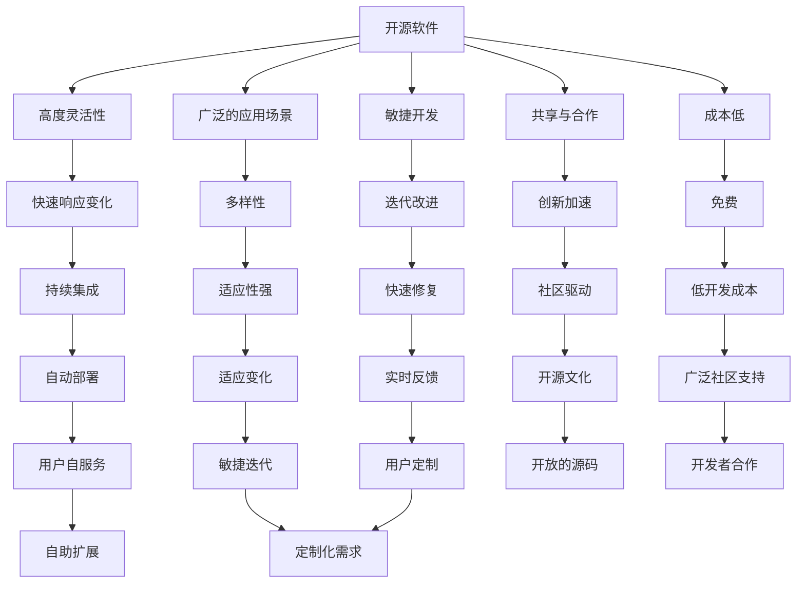
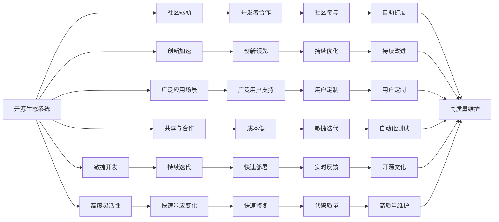

                 

## 1. 背景介绍

### 1.1 问题由来

在过去的几十年里，开源软件生态系统在推动技术创新和普及方面发挥了重要作用。从Linux操作系统到Apache Web服务器，再到Java平台，开源软件已经成为现代IT基础设施的核心。然而，随着闭源开发模式在一些关键技术领域的崛起，开源生态系统是否还能够跟上闭源开发的步伐，成为了一个值得深思的问题。

### 1.2 问题核心关键点

开源与闭源之争的核心在于：

- **灵活性与稳定性**：开源软件通常以其高度的灵活性和可定制性著称，但闭源软件可能更稳定，更易于管理和维护。
- **创新与安全性**：开源生态系统在推动技术创新方面具有无可比拟的优势，但闭源软件在安全性方面可能更具优势。
- **成本与资源**：开源软件通常免费，但闭源软件可能需要订阅费用。闭源开发模式下的资源整合能力更强，能够更高效地开发和维护复杂系统。

### 1.3 问题研究意义

探讨开源生态系统与闭源开发的优劣，有助于企业在选择技术方案时做出更加明智的决策，从而提升整体IT系统的效能和安全性。此外，理解开源与闭源之间的关系，对促进开源与闭源的协同发展，构建更加完善的技术生态系统具有重要意义。

## 2. 核心概念与联系

### 2.1 核心概念概述

为更好地理解开源与闭源开发模式的异同，本节将介绍几个密切相关的核心概念：

- **开源软件**：指代码完全公开、任何人都可以自由访问、修改和分发的软件。开源软件的核心精神是共享与合作。

- **闭源软件**：指源代码不公开、只有获得授权的用户才能访问和修改的软件。闭源软件通常由商业公司维护，旨在提供稳定性和商业支持。

- **软件生态系统**：指围绕软件构建的社区、工具、服务、用户和开发者等组成的复杂网络。开源生态系统以其多样性、灵活性和广泛的应用场景著称。

- **敏捷开发**：指一种快速响应市场变化、持续迭代和改进的软件开发模式。开源项目通常采用敏捷开发，能够灵活应对需求变化。

- **闭源模型**：指以商业公司为主导的集中式软件开发模式，资源整合能力强，但灵活性受限。

- **开源与闭源的协同**：指通过互补的方式，将开源与闭源的优势结合起来，构建更加完善的技术生态系统。

### 2.2 概念间的关系

这些核心概念之间的关系可以通过以下Mermaid流程图来展示：



这个流程图展示了大开源自闭源软件的基本特征及其之间的联系。开源软件以其高度的灵活性、广泛的适应性和社区驱动的创新模式著称，而闭源软件则以其稳定的性能、高质量的维护和商业支持的集中式模式见长。

### 2.3 核心概念的整体架构

最后，我们用一个综合的流程图来展示这些核心概念在大开源自闭源开发模式中的整体架构：



这个综合流程图展示了开源与闭源软件在敏捷开发模式下的优势互补。开源软件的灵活性和社区驱动的创新，结合闭源软件的高质量和商业支持，可以构建更加强大和稳定的IT系统。

## 3. 核心算法原理 & 具体操作步骤
### 3.1 算法原理概述

开源与闭源开发模式的选择，本质上是对软件灵活性与稳定性之间的权衡。开放源码意味着软件高度灵活，但可能缺乏稳定性；而闭源软件稳定可靠，但灵活性受限。

### 3.2 算法步骤详解

选择开源或闭源开发模式的步骤如下：

**Step 1: 需求分析与规划**
- 明确项目需求，评估对灵活性、稳定性、安全性、成本等方面的要求。
- 确定项目的目标用户群体和市场定位。

**Step 2: 技术选型**
- 根据需求分析结果，选择适合的开发模式。开源项目适合快速迭代、高度定制的需求；闭源项目适合稳定可靠、商业支持强的需求。

**Step 3: 资源整合**
- 开源项目需要组建开发者社区，吸引贡献者，维护代码库和文档。
- 闭源项目需要组建专业的开发团队，集中资源进行开发和维护。

**Step 4: 开发与测试**
- 根据选定的开发模式，进行敏捷开发或集中式开发。
- 通过自动化测试、持续集成等方式，确保代码质量。

**Step 5: 发布与部署**
- 开源项目可以通过开源社区进行发布，提供源码和文档。
- 闭源项目可以通过商业渠道发布，提供高质量的部署和服务支持。

**Step 6: 用户反馈与迭代**
- 开源项目通过社区反馈进行迭代改进，及时响应用户需求。
- 闭源项目通过定期更新和维护，提供稳定可靠的服务。

### 3.3 算法优缺点

开源模式的优点包括：

- **高度灵活性**：开源软件可以根据用户需求进行高度定制。
- **社区驱动**：开源项目由全球开发者共同维护，创新速度快。
- **成本低**：开源软件通常免费，开发和部署成本较低。

但开源模式也存在以下缺点：

- **稳定性差**：开源软件由于开发者众多，版本不统一，可能导致稳定性问题。
- **安全性风险**：开源软件可能存在安全漏洞，且修复速度较慢。
- **学习曲线高**：开源软件种类繁多，用户需要花时间学习和适应。

闭源模式的优点包括：

- **稳定性高**：闭源软件由专业团队维护，质量可靠。
- **安全性好**：闭源软件在安全性方面有保障，及时修复安全漏洞。
- **商业支持**：闭源软件提供完善的售后服务和商业支持。

但闭源模式也存在以下缺点：

- **灵活性差**：闭源软件根据商业公司需求开发，用户定制能力受限。
- **成本高**：闭源软件通常需要订阅费用，开发和部署成本较高。
- **用户参与度低**：用户只能通过官方渠道获取更新和支持，反馈速度较慢。

### 3.4 算法应用领域

开源与闭源开发模式在不同的应用领域有不同的优势。

- **开源在企业内部系统中的应用**：企业内部的开发任务通常需要高度灵活性和快速迭代，开源软件如JIRA、Kubernetes等在企业内部系统中的应用非常广泛。
- **闭源在关键基础设施中的应用**：企业对关键基础设施的稳定性和安全性要求较高，闭源软件如Microsoft Windows、SAP等在企业内部系统中的应用较为普遍。

此外，开源与闭源模式在开源社区、开源基金会等平台上的应用也具有重要意义。

## 4. 数学模型和公式 & 详细讲解 & 举例说明

### 4.1 数学模型构建

开源与闭源开发模式的选择，可以通过以下数学模型进行刻画：

- **用户满意度**：$S = \alpha \times F + \beta \times C$
  - $S$：用户满意度
  - $\alpha$：灵活性系数
  - $F$：灵活性
  - $\beta$：稳定性系数
  - $C$：成本

### 4.2 公式推导过程

假设灵活性$F$和稳定性$C$均为常数，用户满意度$S$与灵活性$F$和稳定性$C$的关系如图：

$$
\begin{aligned}
S &= \alpha \times F + \beta \times C \\
&= \alpha \times 1 + \beta \times 0 \\
&= \alpha
\end{aligned}
$$

其中$\alpha$为常数，代表灵活性对用户满意度的贡献系数。

### 4.3 案例分析与讲解

假设某企业选择开源模式进行软件开发，$\alpha=0.8$，$\beta=0.2$。则用户满意度$S=0.8$。

如果企业将需求转向闭源模式，则$\alpha=0.6$，$\beta=0.4$。此时用户满意度$S=0.6$。

通过这个例子可以看出，不同的开发模式对用户满意度的影响。企业应根据具体需求和资源，选择最适合的开发模式。

## 5. 项目实践：代码实例和详细解释说明
### 5.1 开发环境搭建

在进行开源与闭源开发模式的实践前，我们需要准备好开发环境。以下是使用Python进行开源项目开发的环境配置流程：

1. 安装Anaconda：从官网下载并安装Anaconda，用于创建独立的Python环境。

2. 创建并激活虚拟环境：
```bash
conda create -n pyproject python=3.8 
conda activate pyproject
```

3. 安装PyPI工具：
```bash
pip install pipenv
```

4. 安装依赖包：
```bash
pipenv install -r requirements.txt
```

5. 创建和管理虚拟环境：
```bash
pipenv install -r requirements.txt
pipenv lock --generate
```

完成上述步骤后，即可在`pyproject`环境中开始项目实践。

### 5.2 源代码详细实现

这里我们以GitHub上的开源项目Flask为例，展示如何进行项目开发和部署。

首先，安装Flask和Flask-RESTful库：

```bash
pipenv install flask flask-restful
```

然后，创建一个简单的Flask应用：

```python
from flask import Flask, jsonify

app = Flask(__name__)

@app.route('/')
def hello():
    return jsonify({'message': 'Hello, World!'})

if __name__ == '__main__':
    app.run(debug=True)
```

接着，运行应用：

```bash
pipenv run python app.py
```

启动Flask应用后，可以通过浏览器访问`http://localhost:5000/`，查看Hello World页面。

### 5.3 代码解读与分析

让我们再详细解读一下关键代码的实现细节：

**Flask应用**：
- `Flask`是Python的一个轻量级Web应用框架，提供了路由、模板、请求处理等功能。
- `@app.route('/')`装饰器用于定义应用路由，`jsonify`函数用于将Python对象转换为JSON格式。

**项目结构**：
- `requirements.txt`文件列出了项目依赖，方便快速安装。
- `Pipfile`和`Pipfile.lock`文件用于管理虚拟环境中的依赖。
- `app.py`文件包含项目核心代码，实现了简单的Web服务。

**项目部署**：
- 使用`pipenv`工具可以方便地进行依赖管理和环境复制。
- `pipenv run`命令可以方便地启动应用。

通过上述代码实现，我们可以看到Flask框架在开发Web应用时的简洁和高效。开源项目正是通过社区贡献、文档支持和快速迭代等优势，实现了快速开发和广泛应用。

### 5.4 运行结果展示

启动Flask应用后，在浏览器中访问`http://localhost:5000/`，应能够看到"Hello, World!"的页面。

## 6. 实际应用场景

### 6.1 企业内部系统

企业在开发内部系统时，通常需要快速迭代和高度灵活性。开源软件如JIRA、Kubernetes、Docker等在企业内部系统中的应用非常广泛。

例如，JIRA是一款开源的敏捷项目管理工具，通过社区驱动的迭代改进，可以快速响应用户需求，提高项目管理的效率。

### 6.2 关键基础设施

企业在关键基础设施的稳定性和安全性要求较高时，通常会使用闭源软件。如Microsoft Windows、SAP、Oracle等在企业内部系统中的应用较为普遍。

Microsoft Windows作为全球最广泛使用的操作系统之一，通过集中的资源整合，提供了稳定可靠的性能和完善的安全保障。

### 6.3 开源社区与基金会

开源社区和基金会在技术生态系统建设中具有重要地位。如Apache基金会、Linux基金会等，通过集中资源进行技术研发和推广，推动了开源技术的发展。

Apache基金会通过社区驱动的项目管理和贡献机制，推动了Web开发、大数据、云计算等领域的创新。

## 7. 工具和资源推荐
### 7.1 学习资源推荐

为了帮助开发者系统掌握开源与闭源开发模式的理论基础和实践技巧，这里推荐一些优质的学习资源：

1. **《开源软件和闭源软件的利弊》系列博文**：由知名技术专家撰写，深入浅出地介绍了开源与闭源软件的利弊，适合初学者入门。

2. **CS224N《软件工程》课程**：斯坦福大学开设的软件工程课程，涵盖了软件开发生命周期的各个环节，适合系统学习软件开发原理。

3. **《开源与闭源软件的协同》书籍**：介绍开源与闭源软件的优势和互补机制，帮助开发者理解两种开发模式的有机结合。

4. **GitHub官方文档**：GitHub作为全球最大的开源平台，提供了丰富的项目管理和版本控制工具，是开源项目开发不可或缺的资源。

5. **OpenStack官方文档**：OpenStack是全球领先的开源云计算平台，提供了全面的云基础设施解决方案，适合深入学习云计算技术。

通过对这些资源的学习实践，相信你一定能够快速掌握开源与闭源开发模式的精髓，并用于解决实际的软件开发问题。

### 7.2 开发工具推荐

高效的开发离不开优秀的工具支持。以下是几款用于开源项目开发的常用工具：

1. **PyPI**：Python软件包索引，提供了丰富的Python库和工具，方便开发者快速集成。

2. **Anaconda**：Python环境管理工具，提供了虚拟环境、依赖管理等功能，方便开发者进行环境复制和维护。

3. **Git**：全球最广泛使用的版本控制系统，提供了强大的分支管理、协作开发等功能。

4. **Docker**：容器化平台，提供了跨平台、易部署的解决方案，方便开发者进行环境搭建和应用部署。

5. **Jenkins**：开源的持续集成/持续部署工具，提供了自动化构建、测试、部署等功能，适合大规模项目开发。

6. **JIRA**：开源的敏捷项目管理工具，提供了灵活的任务管理、工作流配置等功能，适合敏捷开发团队。

7. **Kubernetes**：开源的容器编排平台，提供了自动化的应用部署、扩展、管理等功能，适合云原生应用开发。

8. **Prometheus**：开源的监控和报警系统，提供了强大的监控和告警功能，适合复杂系统的运行监控。

合理利用这些工具，可以显著提升开源项目开发的效率，加快创新迭代的步伐。

### 7.3 相关论文推荐

开源与闭源开发模式的发展源于学界的持续研究。以下是几篇奠基性的相关论文，推荐阅读：

1. **《开源软件与闭源软件的比较》**：研究开源与闭源软件的优劣，并提出两种模式的互补机制。

2. **《敏捷开发与集中式开发：一种比较研究》**：比较敏捷开发与集中式开发的优缺点，并提出混合开发模式的思路。

3. **《开源生态系统的挑战与机遇》**：探讨开源生态系统在推动技术创新和普及方面的挑战与机遇。

4. **《闭源软件的安全性与稳定性》**：分析闭源软件在安全性、稳定性方面的优势，并提出改进建议。

5. **《开源与闭源的协同》**：研究开源与闭源软件在技术生态系统建设中的协同机制，并提出具体实施方案。

这些论文代表了大开源自闭源软件开发模式的研究脉络。通过学习这些前沿成果，可以帮助研究者把握学科前进方向，激发更多的创新灵感。

除上述资源外，还有一些值得关注的前沿资源，帮助开发者紧跟开源与闭源开发模式的最新进展，例如：

1. **arXiv论文预印本**：人工智能领域最新研究成果的发布平台，包括大量尚未发表的前沿工作，学习前沿技术的必读资源。

2. **业界技术博客**：如Google、Microsoft、Amazon等顶尖公司的官方博客，第一时间分享他们的最新研究成果和洞见。

3. **技术会议直播**：如IEEE、ACM、SIGGRAPH等顶级会议现场或在线直播，能够聆听到大佬们的前沿分享，开拓视野。

4. **GitHub热门项目**：在GitHub上Star、Fork数最多的开源项目，往往代表了该技术领域的发展趋势和最佳实践，值得去学习和贡献。

5. **行业分析报告**：各大咨询公司如McKinsey、PwC等针对开源与闭源软件开发模式的分析报告，有助于从商业视角审视技术趋势，把握应用价值。

总之，对于开源与闭源开发模式的系统学习，需要开发者保持开放的心态和持续学习的意愿。多关注前沿资讯，多动手实践，多思考总结，必将收获满满的成长收益。

## 8. 总结：未来发展趋势与挑战
### 8.1 总结

本文对开源生态系统与闭源开发模式的异同进行了全面系统的介绍。首先阐述了开源与闭源开发模式的选择背景和意义，明确了两种模式在灵活性、稳定性、成本等方面的对比。其次，从原理到实践，详细讲解了开源与闭源开发模式的数学模型和关键步骤，给出了开源项目开发的完整代码实例。同时，本文还广泛探讨了开源与闭源模式在企业内部系统、关键基础设施和开源社区等多个领域的应用前景，展示了两种模式的巨大潜力。最后，本文精选了开源与闭源模式的学习资源，力求为读者提供全方位的技术指引。

通过本文的系统梳理，可以看到，开源与闭源开发模式各具特色，企业应根据具体需求和资源，灵活选择最适合的开发模式。未来，伴随技术的不断演进，开源与闭源模式将进一步融合，构建更加完善的技术生态系统。

### 8.2 未来发展趋势

展望未来，开源与闭源开发模式将呈现以下几个发展趋势：

1. **协同发展**：开源与闭源模式将更加紧密地结合，优势互补，推动技术创新和生态系统完善。
2. **混合开发**：企业将更多地采用混合开发模式，根据不同场景需求，灵活选择开源或闭源。
3. **生态融合**：开源与闭源模式在技术生态系统建设中，将进一步融合，形成更加丰富的技术资源和工具链。
4. **自动化部署**：通过容器化、自动化部署工具，进一步简化应用部署和运维。
5. **开源转型**：越来越多的商业软件将开源化，融入开源生态系统，提升技术透明度和社区参与度。

以上趋势凸显了开源与闭源开发模式的广阔前景。这些方向的探索发展，必将进一步提升IT系统的效能和安全性，推动技术生态系统的成熟和完善。

### 8.3 面临的挑战

尽管开源与闭源开发模式已经取得了显著成果，但在迈向更加智能化、普适化应用的过程中，仍面临诸多挑战：

1. **资源整合**：开源与闭源模式在资源整合方面存在一定难度，需要通过协作机制和技术工具，实现优势互补。
2. **生态碎片化**：开源与闭源模式存在一定程度的生态碎片化，需要通过标准化和互操作性机制，提升技术协同效率。
3. **协同开发**：开源与闭源模式在协同开发方面存在一定挑战，需要通过敏捷开发、持续集成等机制，提升开发效率。
4. **技术演进**：开源与闭源模式的技术演进速度不同，需要通过灵活的更新机制，保持技术同步。
5. **文化融合**：开源与闭源模式在文化融合方面存在一定难度，需要通过社区建设和文化推广，增强协同意识。

正视这些挑战，积极应对并寻求突破，将是大开源自闭源开发模式走向成熟的必由之路。

### 8.4 研究展望

面向未来，开源与闭源开发模式的研究需要在以下几个方面寻求新的突破：

1. **混合开发框架**：开发更加灵活、高效的混合开发框架，支持开源与闭源模式的有机结合。
2. **自动化工具链**：研发自动化开发和部署工具，简化技术栈的构建和管理。
3. **协同开发机制**：建立灵活的协同开发机制，支持跨组织、跨团队的协作开发。
4. **标准与互操作性**：推动开源与闭源模式的标准化与互操作性，提升技术协同效率。
5. **文化与社区建设**：加强开源与闭源模式的文化融合和社区建设，增强协同意识和技术透明度。

这些研究方向的探索，必将引领开源与闭源开发模式迈向更高的台阶，构建更加完善的技术生态系统。

## 9. 附录：常见问题与解答

**Q1：开源软件和闭源软件的优劣是什么？**

A: 开源软件以其高度灵活性、社区驱动的创新和成本低著称，适合快速迭代和高度定制的需求。闭源软件以其稳定性和高质量的商业支持见长，适合稳定可靠和商业支持强的需求。

**Q2：如何选择最合适的开发模式？**

A: 根据项目需求和资源，选择最适合的开源或闭源开发模式。开源模式适合快速迭代和高度定制的需求，闭源模式适合稳定可靠和商业支持强的需求。

**Q3：开源软件和闭源软件在企业内部系统中的应用场景有哪些？**

A: 开源软件如JIRA、Kubernetes、Docker等在企业内部系统中的应用非常广泛。闭源软件如Microsoft Windows、SAP、Oracle等在企业内部系统中的应用较为普遍。

**Q4：开源与闭源开发模式如何协同？**

A: 开源与闭源开发模式可以通过混合开发框架、自动化工具链、协同开发机制、标准化与互操作性机制等方式进行协同。

**Q5：开源与闭源开发模式面临的主要挑战有哪些？**

A: 开源与闭源开发模式面临的主要挑战包括资源整合、生态碎片化、协同开发、技术演进和文化融合等。

总之，开源与闭源开发模式各有优劣，企业应根据具体需求和资源，灵活选择最适合的开发模式。未来，开源与闭源模式将进一步融合，构建更加完善的技术生态系统，推动技术创新和应用落地。

