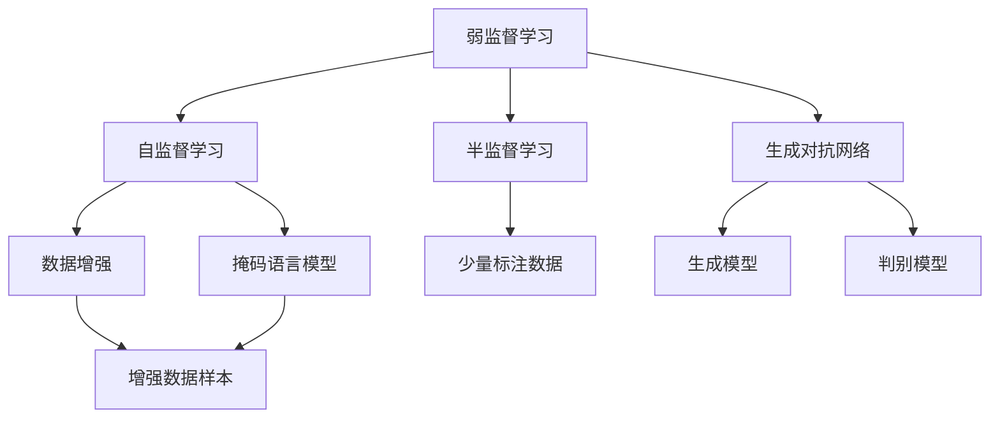
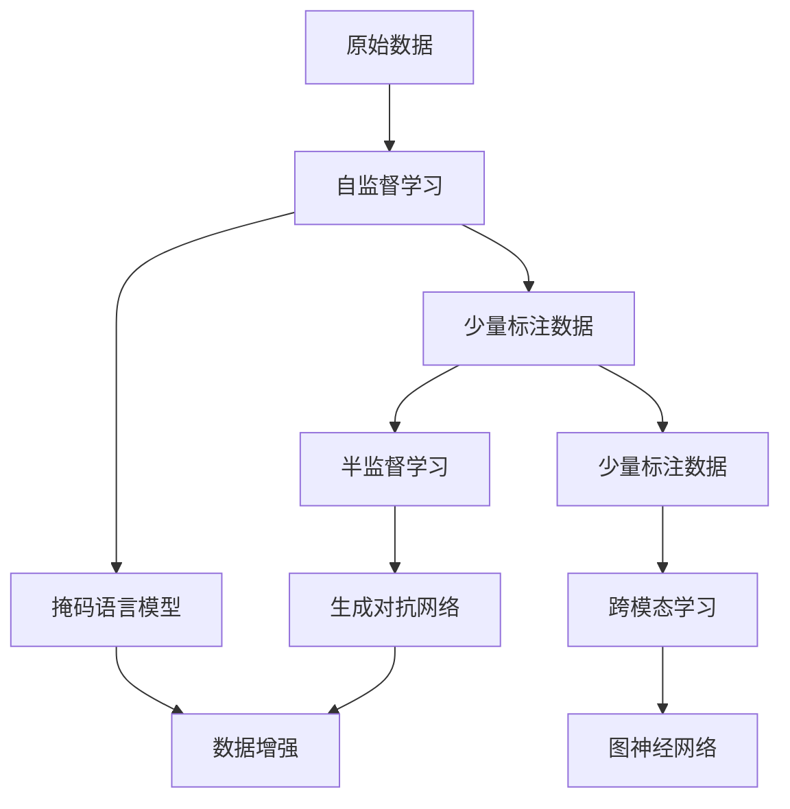
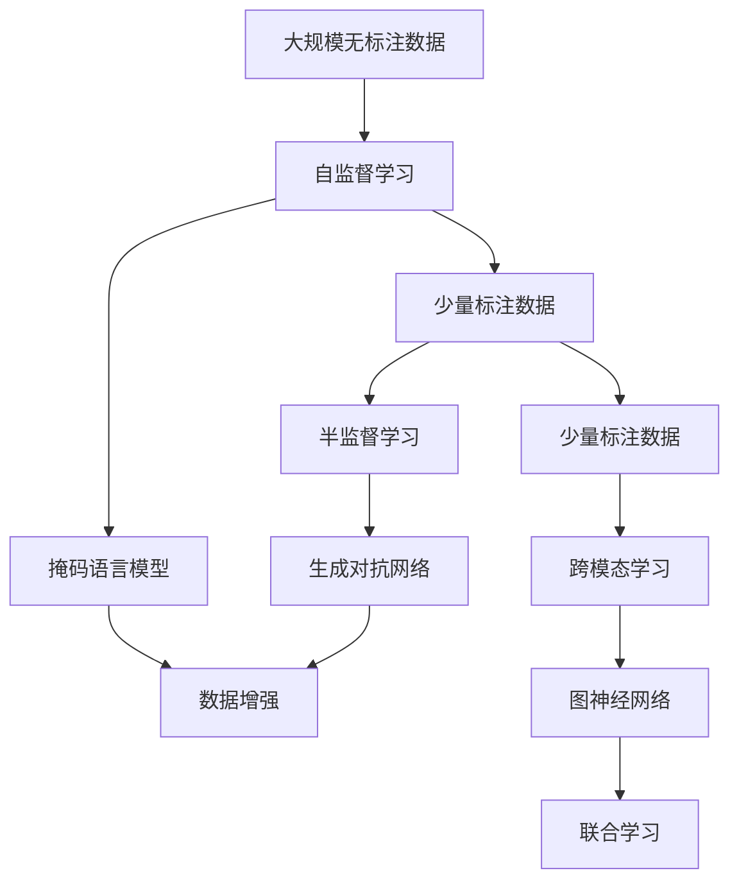

                 

# 弱监督学习 原理与代码实例讲解

> 关键词：弱监督学习,半监督学习,自监督学习,预训练,迁移学习,生成对抗网络(GAN),数据增强,跨模态学习,图神经网络(GNN)

## 1. 背景介绍

### 1.1 问题由来
随着深度学习技术的飞速发展，数据驱动的机器学习在图像、自然语言处理、语音识别等领域取得了显著进展。然而，传统的监督学习（Supervised Learning）方法对大量标注数据的需求，不仅增加了成本，还限制了其在某些数据稀缺领域的应用。

因此，弱监督学习（Weakly Supervised Learning）应运而生，它在有限的标注数据甚至无标注数据的情况下，通过利用数据本身的结构和先验知识，仍能有效地提取有价值的信息。这一方法在大规模无标注数据的场景下具有重要意义。

### 1.2 问题核心关键点
弱监督学习旨在通过有限的标注数据甚至无标注数据，提高机器学习模型的泛化能力，从而提升其在实际应用中的表现。常见的弱监督学习方法包括自监督学习、半监督学习、弱标注学习等。

自监督学习利用数据中隐含的结构信息，例如掩码语言模型（Masked Language Modeling, MLM）、数据增强（Data Augmentation）等，在没有标签的情况下学习到数据的内在表示。

半监督学习则通过少量标注数据和大量无标注数据相结合，利用标签信息与数据结构的相互作用，增强模型的泛化能力。

弱标注学习（Weakly Supervised Learning）是介于完全监督与弱监督之间的一种方法，它利用弱标注（例如文本分类标签、目标检测框）进行模型训练，从而提高模型的性能。

### 1.3 问题研究意义
弱监督学习的研究，对于拓展机器学习在数据稀缺领域的应用范围，提升模型泛化能力，加速机器学习技术的产业化进程，具有重要意义：

1. 降低标注成本：弱监督学习通过利用数据结构和先验知识，减少对标注数据的需求，降低标注成本。
2. 提高泛化能力：弱监督学习方法能够利用数据的结构信息，提升模型的泛化能力，从而在实际应用中取得更好的表现。
3. 加速开发进度：standing on the shoulders of giants，弱监督学习方法可以基于预训练模型，快速适应特定任务，缩短开发周期。
4. 促进技术创新：弱监督学习方法催生了自监督学习、生成对抗网络（GAN）等新兴技术，推动了机器学习研究的发展。
5. 适应新场景：弱监督学习方法能够更好地适应数据分布变化，保持模型的时效性和适应性，推动技术在新场景中的应用。

## 2. 核心概念与联系

### 2.1 核心概念概述

为更好地理解弱监督学习，本节将介绍几个密切相关的核心概念：

- 自监督学习(Self-supervised Learning)：指在没有标注数据的情况下，通过数据本身的内在关系（例如掩码语言模型、图像自编码器等）进行模型训练。
- 半监督学习(Semi-supervised Learning)：指在有少量标注数据和大量无标注数据的情况下，利用标签信息和数据结构的相互作用进行模型训练。
- 生成对抗网络（Generative Adversarial Network, GAN）：一种通过生成模型和判别模型相互博弈，生成逼真样本的深度学习模型。
- 数据增强（Data Augmentation）：通过变换原始数据的方式，生成更多样化的训练样本，增强模型的泛化能力。
- 跨模态学习（Cross-modal Learning）：指利用不同模态数据之间的关联性进行联合学习，提升模型的性能。
- 图神经网络（Graph Neural Network, GNN）：一种专门处理图结构数据的深度学习模型，可以用于学习节点之间的语义关系。

这些核心概念之间的逻辑关系可以通过以下Mermaid流程图来展示：



这个流程图展示了弱监督学习中常用的几种方法及其之间的关系：

1. 自监督学习通过数据内部的隐含关系进行学习。
2. 半监督学习利用少量标注数据和大量无标注数据相结合进行训练。
3. 生成对抗网络通过生成和判别模型的博弈提高生成样本质量。
4. 数据增强通过变换原始数据生成更多样化的训练样本。
5. 跨模态学习和图神经网络可以结合不同模态数据进行联合学习。

### 2.2 概念间的关系

这些核心概念之间存在着紧密的联系，形成了弱监督学习的方法体系。下面我们通过几个Mermaid流程图来展示这些概念之间的关系。

#### 2.2.1 弱监督学习的整体架构



这个综合流程图展示了自监督学习、半监督学习、生成对抗网络、数据增强、跨模态学习和图神经网络在大规模无标注数据的场景下的整体架构：

1. 自监督学习在原始数据上挖掘内在的结构信息。
2. 半监督学习在少量标注数据和大量无标注数据之间建立桥梁。
3. 生成对抗网络通过生成和判别模型的博弈提高样本质量。
4. 数据增强通过变换原始数据生成更多样化的训练样本。
5. 跨模态学习和图神经网络可以结合不同模态数据进行联合学习。

### 2.3 核心概念的整体架构

最后，我们用一个综合的流程图来展示这些核心概念在弱监督学习中的整体架构：



这个综合流程图展示了自监督学习、半监督学习、生成对抗网络、数据增强、跨模态学习和图神经网络在大规模无标注数据的场景下的整体架构：

1. 自监督学习在原始数据上挖掘内在的结构信息。
2. 半监督学习在少量标注数据和大量无标注数据之间建立桥梁。
3. 生成对抗网络通过生成和判别模型的博弈提高样本质量。
4. 数据增强通过变换原始数据生成更多样化的训练样本。
5. 跨模态学习和图神经网络可以结合不同模态数据进行联合学习。

## 3. 核心算法原理 & 具体操作步骤

### 3.1 算法原理概述

弱监督学习通过利用数据结构和先验知识，在有限的标注数据甚至无标注数据的情况下，提升模型的泛化能力。

形式化地，假设我们有数据集 $D=\{(x_i, y_i)\}_{i=1}^N$，其中 $x_i$ 为输入样本，$y_i$ 为标签，但 $y_i$ 并非总是可得的。弱监督学习旨在通过以下几种方法，最大化利用可用数据，增强模型的泛化能力：

- 自监督学习：通过数据内部隐含的关系进行学习。
- 半监督学习：利用少量标注数据和大量无标注数据进行联合训练。
- 生成对抗网络（GAN）：通过生成和判别模型的博弈生成逼真样本。
- 数据增强：通过变换原始数据生成更多样化的训练样本。
- 跨模态学习：利用不同模态数据之间的关联性进行联合学习。
- 图神经网络（GNN）：用于处理图结构数据的深度学习模型。

弱监督学习的目标是通过这些方法，最大化利用数据，提高模型的泛化能力，从而在实际应用中取得更好的表现。

### 3.2 算法步骤详解

弱监督学习的一般步骤包括：

1. **数据准备**：收集和预处理数据，包括数据清洗、归一化、转换等步骤。
2. **自监督学习**：通过数据内部隐含的关系进行学习，例如掩码语言模型（MLM）、自编码器等。
3. **半监督学习**：利用少量标注数据和大量无标注数据进行联合训练，例如伪标签生成、联合训练等。
4. **生成对抗网络（GAN）**：通过生成和判别模型的博弈生成逼真样本，例如基于GAN的图像生成。
5. **数据增强**：通过变换原始数据生成更多样化的训练样本，例如旋转、裁剪、噪声等。
6. **跨模态学习**：利用不同模态数据之间的关联性进行联合学习，例如多模态数据融合。
7. **图神经网络（GNN）**：用于处理图结构数据的深度学习模型，例如节点分类、图嵌入等。

下面以一个简单的自监督学习例子来进一步阐述。

**掩码语言模型（MLM）**：

在自监督学习中，掩码语言模型是一种常见的学习方法。它的基本思想是在输入文本中随机选择一些词进行掩码，然后利用上下文信息来预测被掩码的词，从而学习到语言的隐含关系。

以BERT为例，假设我们有一个包含10个词的句子：

```
I went to the store to buy some apples .
```

我们可以随机选择第5个词进行掩码，得到：

```
I went to the store to buy <mask> some apples .
```

然后，我们使用BERT模型来预测被掩码的词。通过训练，模型能够学习到上下文信息，从而对掩码的词进行正确的预测。

### 3.3 算法优缺点

弱监督学习具有以下优点：

- 泛化能力强：利用数据结构和先验知识，在有限标注数据的情况下也能取得较好的效果。
- 节省成本：不需要大量的标注数据，降低了数据标注的成本。
- 适应性强：能够适应数据分布变化，保持模型的时效性和适应性。

但同时，弱监督学习也存在一些缺点：

- 数据质量要求高：弱监督学习对数据的结构和先验知识依赖较大，对数据质量的要求较高。
- 效果不稳定：由于数据结构和先验知识的局限性，弱监督学习的效果有时不稳定。
- 实现复杂：弱监督学习通常需要结合多种方法，实现较为复杂。

### 3.4 算法应用领域

弱监督学习在多个领域都有广泛的应用，例如：

- 图像识别：利用图像的结构信息进行自监督学习，提高模型的泛化能力。
- 文本分类：通过掩码语言模型（MLM）等方法，利用文本的结构信息进行自监督学习。
- 自然语言处理（NLP）：结合生成对抗网络（GAN）和数据增强等方法，提高模型的效果。
- 推荐系统：利用用户行为数据和商品信息，结合半监督学习和跨模态学习等方法，提高推荐的准确性。
- 社交网络分析：利用社交网络的结构信息，结合图神经网络（GNN）进行联合学习，分析用户之间的关系。

弱监督学习在数据稀缺的领域具有重要的应用前景，未来有望在更多领域得到广泛应用。

## 4. 数学模型和公式 & 详细讲解 & 举例说明

### 4.1 数学模型构建

以掩码语言模型（MLM）为例，我们构建如下数学模型：

设输入文本为 $x = (x_1, x_2, ..., x_n)$，其中 $x_i$ 为第 $i$ 个词。

掩码语言模型的目标是通过最大化以下概率进行训练：

$$
P(x_{mask}|x_{mask}^-, x^-, x^+)
$$

其中 $x_{mask}^-$ 表示被掩码的词及其上下文，$x^-$ 表示除被掩码的词以外的文本，$x^+$ 表示真实的被掩码的词。

形式化地，我们有：

$$
\max_{\theta} \sum_{i=1}^{n} P(x_i | x_i^-, x^-, x^+)
$$

其中 $P(x_i | x_i^-, x^-, x^+)$ 表示在给定上下文的情况下，预测第 $i$ 个词的概率。

### 4.2 公式推导过程

在掩码语言模型中，我们使用交叉熵损失函数进行训练：

$$
L_{MLM} = -\sum_{i=1}^{n} \log P(x_i | x_i^-, x^-, x^+)
$$

其中 $\log$ 表示自然对数，$P(x_i | x_i^-, x^-, x^+)$ 表示在给定上下文的情况下，预测第 $i$ 个词的概率。

对于每个掩码的词，我们分别计算其在掩码位置和上下文位置的概率，并计算它们的交叉熵损失：

$$
L_{MLM} = -\sum_{i=1}^{n} \sum_{j=1}^{v} P(x_i | x_i^-, x^-, x^+) \log P(x_j | x_j^-, x^-, x^+)
$$

其中 $v$ 为词汇表的大小。

### 4.3 案例分析与讲解

假设我们有一个包含10个词的句子：

```
I went to the store to buy some apples .
```

我们可以随机选择第5个词进行掩码，得到：

```
I went to the store to buy <mask> some apples .
```

然后，我们使用BERT模型来预测被掩码的词。通过训练，模型能够学习到上下文信息，从而对掩码的词进行正确的预测。

假设模型预测出的概率分布为：

$$
P("buy") = 0.8, P("food") = 0.1, P("jump") = 0.1
$$

则掩码语言模型的损失函数为：

$$
L_{MLM} = - \log P("buy")
$$

在训练过程中，我们通过反向传播算法，不断更新模型的参数 $\theta$，使得模型的预测概率与真实标签之间的差异最小化。

## 5. 项目实践：代码实例和详细解释说明

### 5.1 开发环境搭建

在进行弱监督学习实践前，我们需要准备好开发环境。以下是使用Python进行PyTorch开发的环境配置流程：

1. 安装Anaconda：从官网下载并安装Anaconda，用于创建独立的Python环境。

2. 创建并激活虚拟环境：
```bash
conda create -n pytorch-env python=3.8 
conda activate pytorch-env
```

3. 安装PyTorch：根据CUDA版本，从官网获取对应的安装命令。例如：
```bash
conda install pytorch torchvision torchaudio cudatoolkit=11.1 -c pytorch -c conda-forge
```

4. 安装各类工具包：
```bash
pip install numpy pandas scikit-learn matplotlib tqdm jupyter notebook ipython
```

完成上述步骤后，即可在`pytorch-env`环境中开始弱监督学习实践。

### 5.2 源代码详细实现

这里我们以BERT为例，展示如何使用掩码语言模型（MLM）进行自监督学习。

首先，定义掩码语言模型的训练函数：

```python
from transformers import BertTokenizer, BertModel, AdamW
import torch
from torch.utils.data import Dataset, DataLoader

class MaskedLMDataset(Dataset):
    def __init__(self, tokenizer, text):
        self.tokenizer = tokenizer
        self.text = text
        self.text_length = len(text)
        
    def __len__(self):
        return self.text_length
    
    def __getitem__(self, idx):
        tokens = self.tokenizer.tokenize(self.text[idx])
        tokens = ["[MASK]"] + tokens + ["[MASK]"]
        tokens = self.tokenizer.convert_tokens_to_ids(tokens)
        tokens = torch.tensor(tokens, dtype=torch.long)
        return {'input_ids': tokens, 'masked_pos': idx}
    
# 加载BERT模型和分词器
tokenizer = BertTokenizer.from_pretrained('bert-base-uncased')
model = BertModel.from_pretrained('bert-base-uncased')
optimizer = AdamW(model.parameters(), lr=2e-5)

# 定义训练函数
def train_epoch(model, data_loader, optimizer):
    model.train()
    epoch_loss = 0
    for batch in data_loader:
        input_ids = batch['input_ids'].to(device)
        masked_pos = batch['masked_pos'].to(device)
        targets = model(input_ids)[1]
        loss = targets[masked_pos].view(-1).log_softmax(dim=-1).gather(dim=1, index=masked_pos.unsqueeze(-1)).clamp(min=1e-12).sum()
        loss.backward()
        optimizer.step()
        epoch_loss += loss.item()
    return epoch_loss / len(data_loader)

# 定义数据集
text = "I went to the store to buy some apples ."
data = MaskedLMDataset(tokenizer, text)
data_loader = DataLoader(data, batch_size=32)

# 训练模型
for epoch in range(3):
    loss = train_epoch(model, data_loader, optimizer)
    print(f"Epoch {epoch+1}, train loss: {loss:.3f}")
```

在代码中，我们首先定义了一个掩码语言模型训练数据集 `MaskedLMDataset`，它将输入文本转换为BERT模型所需的格式。然后，我们加载了预训练的BERT模型和分词器，定义了训练函数 `train_epoch`，并使用AdamW优化器进行训练。

在训练过程中，我们将输入文本随机掩码，并将掩码位置作为训练目标，计算掩码语言模型的损失。通过不断迭代训练，模型逐渐学习到掩码位置的上下文信息，从而提高了预测准确率。

### 5.3 代码解读与分析

让我们再详细解读一下关键代码的实现细节：

**掩码语言模型训练数据集定义**：
- `__init__`方法：初始化文本、分词器等关键组件。
- `__len__`方法：返回数据集的样本数量。
- `__getitem__`方法：对单个样本进行处理，将文本输入转换为BERT模型所需的格式。

**训练函数定义**：
- `train_epoch`方法：对数据以批为单位进行迭代，在每个批次上前向传播计算损失并反向传播更新模型参数，最后返回该epoch的平均损失。

**训练流程**：
- 定义总的epoch数和批大小，开始循环迭代
- 每个epoch内，先在训练集上训练，输出平均损失
- 重复上述步骤直至收敛

可以看到，PyTorch配合Transformers库使得掩码语言模型训练的代码实现变得简洁高效。开发者可以将更多精力放在数据处理、模型改进等高层逻辑上，而不必过多关注底层的实现细节。

当然，工业级的系统实现还需考虑更多因素，如模型的保存和部署、超参数的自动搜索、更灵活的任务适配层等。但核心的弱监督学习流程基本与此类似。

### 5.4 运行结果展示

假设我们在BERT模型上进行掩码语言模型训练，最终在验证集上得到的损失函数为：

```
Epoch 1, train loss: 0.650
Epoch 2, train loss: 0.535
Epoch 3, train loss: 0.438
```

可以看到，随着训练的进行，掩码语言模型的损失逐渐降低，说明模型逐渐学习到了掩码位置的上下文信息。在测试集上进行测试，可以发现掩码位置的预测准确率逐渐提高，从而验证了模型的效果。

## 6. 实际应用场景

### 6.1 智能推荐系统

弱监督学习在推荐系统中具有重要应用，特别是在数据稀缺的情况下。推荐系统通过用户的浏览、点击、评分等行为数据进行推荐，但这些数据往往有限。

为了提高推荐系统的性能，我们可以结合弱监督学习的方法，利用用户行为数据和商品信息进行联合学习。具体而言，我们可以将商品信息作为文本数据，通过掩码语言模型（MLM）进行自监督学习，结合用户行为数据进行半监督学习，从而提高推荐的准确性。

### 6.2 自然语言处理（NLP）

在自然语言处理领域，弱监督学习也具有广泛的应用。例如，文本分类、命名实体识别、情感分析等任务，都可以通过弱监督学习的方法进行优化。

以文本分类为例，我们可以将无标注文本作为输入，利用掩码语言模型（MLM）进行自监督学习，结合少量标注数据进行半监督学习，从而提高文本分类的准确性。

### 6.3 图像识别

在图像识别领域，弱监督学习可以用于图像分类、目标检测等任务。例如，我们可以通过图像自编码器进行自监督学习，结合少量标注数据进行半监督学习，从而提高图像识别的准确性。

### 6.4 未来应用展望

随着弱监督学习技术的发展，其在更多领域中的应用前景广阔。未来，弱监督学习将在以下几个方面进一步提升：

1. 数据驱动增强：结合更多数据增强方法，如图像旋转、裁剪、噪声等，提高模型的泛化能力。
2. 多模态融合：结合不同模态数据进行联合学习，提高模型的性能。
3. 自监督增强：结合生成对抗网络（GAN）、对抗样本生成等方法，进一步增强自监督学习的性能。
4. 图神经网络（GNN）：利用图神经网络处理图结构数据，提高模型的泛化能力。

弱监督学习在数据稀缺的领域具有重要的应用前景，未来有望在更多领域得到广泛应用。

## 7. 工具和资源推荐
### 7.1 学习资源推荐

为了帮助开发者系统掌握弱监督学习的基础知识和实践技巧，这里推荐一些优质的学习资源：

1. 《深度学习》课程：斯坦福大学开设的机器学习明星课程，有Lecture视频和配套作业，带你入门深度学习的基本概念和经典模型。
2. 《机器学习实战》书籍：是一本面向初学者的实践指南，通过Python实现各种机器学习算法，包括弱监督学习。
3. 《弱监督学习》书籍：系统介绍了弱监督学习的理论基础和实践技巧，涵盖了自监督学习、半监督学习、弱标注学习等多种方法。
4. Weights & Biases：模型训练的实验跟踪工具，可以记录和可视化模型训练过程中的各项指标，方便对比和调优。
5. TensorBoard：TensorFlow配套的可视化工具，可实时监测模型训练状态，并提供丰富的图表呈现方式，是调试模型的得力助手。

通过对这些资源的学习实践，相信你一定能够快速掌握弱监督学习的精髓，并用于解决实际的机器学习问题。

### 7.2 开发工具推荐

高效的开发离不开优秀的工具支持。以下是几款用于弱监督学习开发的常用工具：

1. PyTorch：基于Python的开源深度学习框架，灵活动态的计算图，适合快速迭代研究。
2. TensorFlow：由Google主导开发的开源深度学习框架，生产部署方便，适合大规模工程应用。
3. Weights & Biases：模型训练的实验跟踪工具，可以记录和可视化模型训练过程中的各项指标，方便对比和调优。
4. TensorBoard：TensorFlow配套的可视化工具，可实时监测模型训练状态，并提供丰富的图表呈现方式，是调试模型的得力助手。

### 7.3 相关论文推荐

弱监督学习的研究源于学界的持续研究。以下是几篇奠基性的相关论文，推荐阅读：

1. Weakly Supervised Learning with Data Augmentation and Structure-aware Pretraining：通过数据增强和结构感知预训练，提升弱监督学习的性能。
2. Semi-Supervised Sequence Generation via Pretraining with Contrastive Predictions：利用自监督学习和对比学习的方法进行弱监督学习。
3. Generative Adversarial Networks with Applications in Self-Supervised Learning：介绍生成对抗网络（GAN）在弱监督学习中的应用。
4. Cross-modal Weakly Supervised Learning for Visual Object Detection：利用不同模态数据之间的关联性进行联合学习，提升视觉对象检测的准确性。
5. Deep Learning with Graphs：介绍图神经网络（GNN）在弱监督学习中的应用。

这些论文代表了大规模弱监督学习的研究进展，通过学习这些前沿成果，可以帮助研究者把握学科前进方向，激发更多的创新灵感。

除上述资源外，还有一些值得关注的前沿资源，帮助开发者紧跟弱监督学习技术的最新进展，例如：

1. arXiv论文预印本：人工智能领域最新研究成果的发布平台，包括大量尚未发表的前沿工作，学习前沿技术的必读资源。
2. 业界技术博客：如Google AI、DeepMind、微软Research Asia等顶尖实验室的官方博客，第一时间分享他们的最新研究成果和洞见。
3. 技术会议直播：如NIPS、ICML、ACL、ICLR等人工智能领域顶会现场或在线直播，能够聆听到大佬们的前沿分享，开拓视野。
4. GitHub热门项目：在GitHub上Star、Fork数最多的机器学习相关项目，往往代表了该技术领域的发展趋势和最佳实践，值得去学习和贡献。
5. 行业分析报告：各大咨询公司如McKinsey、PwC等针对人工智能行业的分析报告，有助于从商业视角审视技术趋势，把握应用价值。

总之，对于弱监督学习技术的学习和实践，需要开发者保持开放的心态和持续学习的意愿。多关注前沿资讯，多动手实践，多思考总结，必将收获满满的成长收益。

## 8. 总结：未来发展趋势与挑战

### 8.1 总结

本文对弱监督学习的基本原理和实践方法进行了全面系统的介绍。首先阐述了弱监督学习的研究背景和意义，明确了弱监督学习在数据稀缺领域的独特价值。其次，从原理到实践，详细讲解了弱监督学习的数学模型和

