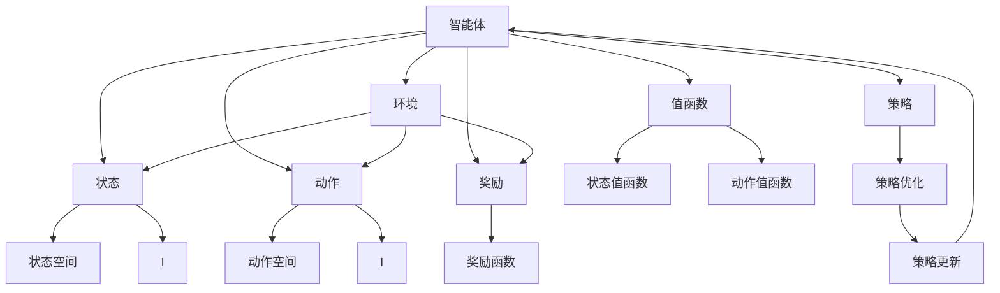
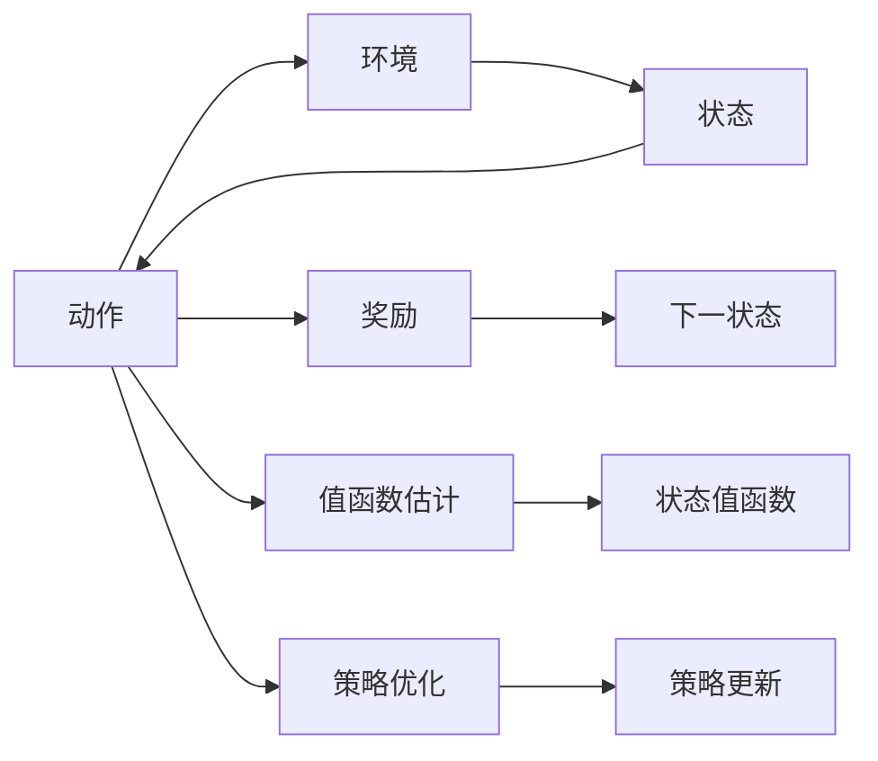
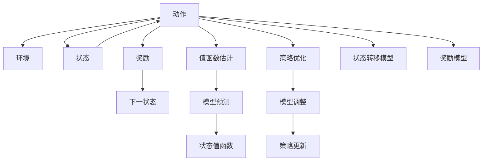
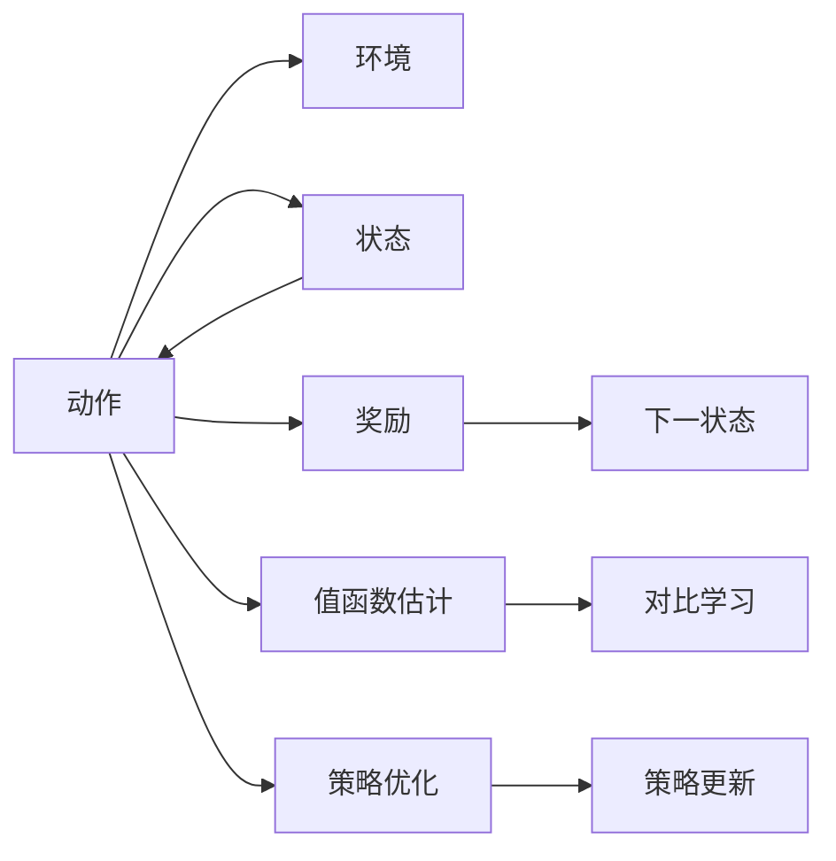
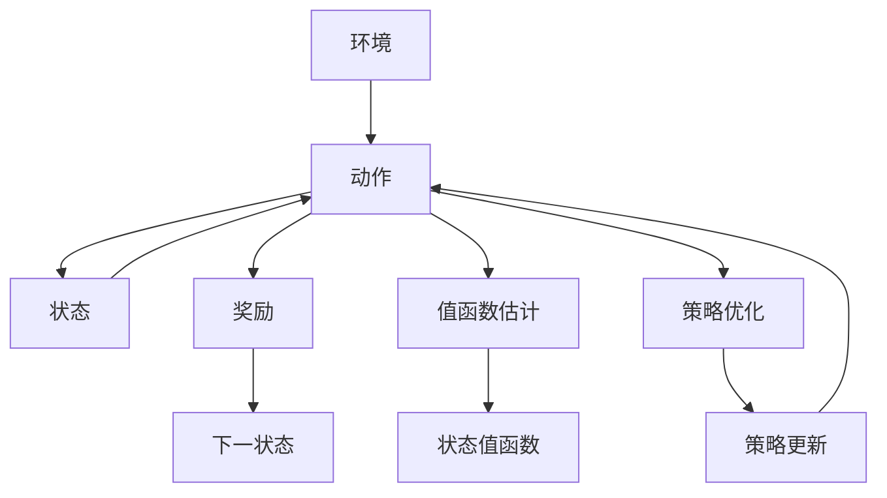

                 

# 强化学习(Reinforcement Learning) - 原理与代码实例讲解

> 关键词：强化学习, 马尔可夫决策过程(MDP), 值函数估计, 策略优化, 深度强化学习, 模型基线和对比学习, 自我模仿学习, 强化学习算法, 多臂老虎机, 深度Q网络, 分布式强化学习

## 1. 背景介绍

### 1.1 问题由来
在人工智能领域，强化学习(Reinforcement Learning, RL)已成为与监督学习、无监督学习并列的“第三极”。相较于传统的监督学习，强化学习能够通过自主探索和智能决策，在复杂、高维、动态环境中，学习到最优的策略，实现智能控制、自动规划、游戏策略生成等任务。

强化学习的思想源于行为科学中的经典实验——“实验心理学”，目标是最大化长期累积的回报。在实际应用中，强化学习广泛应用于机器人控制、游戏智能、推荐系统、自动驾驶等领域，取得了显著的成果。

### 1.2 问题核心关键点
强化学习问题通常由一个环境、一个智能体、一个奖励函数构成。智能体在环境中的目标是最大化累积回报。环境提供状态、动作和奖励信号，智能体则通过不断探索学习最优动作策略，最终实现环境目标。

强化学习的核心在于策略的优化，即如何选择最优的动作序列。传统的强化学习方法包括Q-learning、SARSA等，而深度强化学习则通过深度神经网络扩展了这些算法的表达能力，使其能够处理更高维度、更复杂的状态动作空间。

## 2. 核心概念与联系

### 2.1 核心概念概述

为更好地理解强化学习的原理与实践，本节将介绍几个密切相关的核心概念：

- 强化学习(Reinforcement Learning)：通过智能体与环境的交互，学习到最大化长期累积回报的策略。智能体在每一步根据当前状态和已知经验，选择最优的动作，以获取最大回报。
- 马尔可夫决策过程(Markov Decision Process, MDP)：强化学习的数学模型，由状态空间 $S$、动作空间 $A$、状态转移概率 $P$、奖励函数 $R$ 构成。MDP模型描述了环境的行为特性和智能体的决策机制。
- 值函数(Estimation)：表示在不同状态下，执行某个动作后，长期累积回报的估计值。通过值函数，智能体可以选择最优的动作。常见的值函数包括状态值函数 $V(s)$ 和动作值函数 $Q(s,a)$。
- 策略优化(Policy Optimization)：设计策略 $π(a|s)$，即在给定状态下选择动作的概率分布。通过策略优化，智能体能够在不同状态下采取不同的动作策略，从而最大化长期累积回报。
- 深度强化学习(Deep Reinforcement Learning)：通过深度神经网络实现值函数估计和策略优化。深度强化学习能够处理更高维度、更复杂的状态动作空间，适用于复杂环境下的智能决策。
- 模型基线(Model-Based RL)：通过构建环境的动态模型，指导智能体的决策过程。模型基线方法可以提供对环境的可解释性，但计算复杂度高。
- 对比学习(Contrastive Learning)：通过最大化正样本与负样本的差异，学习到更好的策略。对比学习能够提高模型泛化能力，但数据采集成本高。
- 自我模仿学习(Imitation Learning)：通过模仿专家行为，学习到可行的策略。自我模仿学习能够快速学习，但需要高质量的专家数据。
- 多臂老虎机(Multi-Armed Bandit)：通过选择最优动作，最大化奖励。多臂老虎机模型简化为强化学习问题，有助于理解基本概念。
- 深度Q网络(Deep Q Network, DQN)：通过深度神经网络逼近Q函数，实现深度强化学习。DQN通过经验回放和目标网络等技术，提升模型稳定性和泛化能力。
- 分布式强化学习(Distributed RL)：通过多台机器协同训练，提高模型训练效率。分布式强化学习能够加速复杂模型的训练，但分布式协作要求高。

这些核心概念之间的逻辑关系可以通过以下Mermaid流程图来展示：



这个流程图展示了这个核心概念的完整架构：

1. 智能体与环境交互，接收状态和奖励信号。
2. 智能体通过状态和动作空间，选择最优动作。
3. 环境提供状态转移概率和奖励，指导智能体决策。
4. 值函数和策略优化指导智能体学习最优策略。
5. 策略更新不断优化智能体行为，以最大化长期回报。

### 2.2 概念间的关系

这些核心概念之间存在着紧密的联系，形成了强化学习的完整生态系统。下面我通过几个Mermaid流程图来展示这些概念之间的关系。

#### 2.2.1 强化学习的基本流程



这个流程图展示了强化学习的基本流程，即智能体与环境交互，选择动作，接收奖励，更新值函数和策略，不断优化决策。

#### 2.2.2 模型基线与强化学习的结合



这个流程图展示了强化学习与模型基线的结合，即通过环境模型指导智能体决策，优化策略更新。

#### 2.2.3 对比学习与强化学习的融合



这个流程图展示了强化学习与对比学习的融合，即通过对比学习提升模型泛化能力，优化策略更新。

### 2.3 核心概念的整体架构

最后，我们用一个综合的流程图来展示这些核心概念在大语言模型微调过程中的整体架构：



这个综合流程图展示了从环境到智能体的完整过程。智能体通过环境提供的奖励信号，选择最优动作，更新值函数和策略，不断优化决策。

## 3. 核心算法原理 & 具体操作步骤
### 3.1 算法原理概述

强化学习的核心思想是通过智能体与环境的交互，学习到最大化长期累积回报的策略。假设智能体在每个状态下有 $A$ 种动作可选，环境在每个状态下提供奖励信号 $R(s,a)$，智能体则根据当前状态 $s$ 和动作 $a$，选择最优动作 $a^*$。

强化学习的目标是通过值函数 $V(s)$ 或动作值函数 $Q(s,a)$，估计每个状态或动作的预期回报，从而选择最优策略。常用的强化学习算法包括Q-learning、SARSA、Deep Q Network (DQN)等，这些算法通过迭代更新值函数和策略，不断优化智能体的行为。

### 3.2 算法步骤详解

强化学习的算法步骤主要包括以下几个关键环节：

1. **环境初始化**：设定环境的状态空间 $S$、动作空间 $A$、状态转移概率 $P$、奖励函数 $R$，定义智能体和环境的交互方式。

2. **状态初始化**：智能体从环境获取初始状态 $s_0$。

3. **策略选择**：智能体根据当前状态 $s_t$，选择动作 $a_t$。常用的策略选择方法包括 $ε$-贪心、探索-利用平衡等。

4. **状态转移和奖励获取**：智能体执行动作 $a_t$，环境返回下一个状态 $s_{t+1}$ 和奖励 $r_t$。

5. **值函数估计**：通过已知的 $s_t$、$a_t$、$s_{t+1}$ 和 $r_t$，更新值函数或动作值函数。

6. **策略更新**：根据值函数或动作值函数，更新智能体的策略，以优化行为决策。

7. **迭代优化**：重复上述步骤，直至收敛。

### 3.3 算法优缺点

强化学习相较于传统监督学习，具有以下优点：

1. 自主学习：智能体能够通过自主探索，学习到最优的策略，无需标注数据。
2. 复杂环境适应性强：强化学习适用于高维度、非结构化、动态变化的环境。
3. 可解释性强：强化学习能够通过值函数和策略更新，解释决策过程。

但强化学习也存在以下缺点：

1. 探索与利用平衡：智能体需要在探索新动作和利用已知动作之间平衡，避免过早收敛。
2. 数据效率低：强化学习需要大量探索数据，才能学习到最优策略。
3. 高维度状态空间：高维度的状态空间增加了决策难度，需要额外的维度减少技术。

### 3.4 算法应用领域

强化学习广泛应用于以下几个领域：

1. 机器人控制：通过强化学习，机器人能够在复杂环境中自主学习最优控制策略。
2. 自动驾驶：强化学习能够学习到最优的驾驶策略，实现自动驾驶。
3. 游戏智能：通过强化学习，游戏AI能够在复杂游戏中取得卓越成绩。
4. 推荐系统：强化学习能够优化推荐策略，提升推荐效果。
5. 金融交易：强化学习能够学习到最优的交易策略，提高投资回报率。
6. 自然语言处理：通过强化学习，智能体能够学习到最优的对话策略，实现智能对话。

除了上述这些经典应用外，强化学习还将在更多领域得到广泛应用，如医疗决策、灾害预警、能源优化等，为人类社会带来深远影响。

## 4. 数学模型和公式 & 详细讲解  
### 4.1 数学模型构建

强化学习的基本数学模型由状态空间 $S$、动作空间 $A$、状态转移概率 $P$、奖励函数 $R$ 构成。假设智能体在状态 $s_t$ 下，执行动作 $a_t$，得到下一个状态 $s_{t+1}$ 和奖励 $r_t$。则强化学习的基本数学模型可以表示为：

$$
\begin{aligned}
s_{t+1} &\sim P(s_{t+1} \mid s_t, a_t) \\
r_t &\sim R(r_t \mid s_t, a_t) \\
V(s) &= \mathbb{E}\left[\sum_{t=0}^{\infty} \gamma^t r_t \mid s_0 = s\right] \\
Q(s,a) &= \mathbb{E}\left[\sum_{t=0}^{\infty} \gamma^t r_t \mid s_0 = s, a_0 = a\right]
\end{aligned}
$$

其中 $V(s)$ 为状态值函数，$Q(s,a)$ 为动作值函数，$\gamma$ 为折扣因子，表示未来奖励的重要性。

### 4.2 公式推导过程

以下我们以Q-learning算法为例，推导动作值函数的更新公式。

假设智能体在状态 $s_t$ 下，执行动作 $a_t$，得到下一个状态 $s_{t+1}$ 和奖励 $r_t$。则Q-learning算法通过以下公式更新动作值函数：

$$
Q_{t+1}(s_t,a_t) = Q_t(s_t,a_t) + \alpha [r_t + \gamma \max_{a} Q_t(s_{t+1},a) - Q_t(s_t,a_t)]
$$

其中 $\alpha$ 为学习率。将上式展开，可得：

$$
Q_{t+1}(s_t,a_t) = Q_t(s_t,a_t) + \alpha [r_t + \gamma \max_{a} Q_t(s_{t+1},a) - Q_t(s_t,a_t)]
$$

可以发现，该公式与梯度下降算法类似，通过当前状态和动作，计算目标动作的奖励和值函数，更新动作值函数。

### 4.3 案例分析与讲解

以多臂老虎机问题为例，分析强化学习的应用。

假设多臂老虎机有 $K$ 个臂，每个臂有 $P_k$ 的概率获得 $1$ 奖励，其余时间无奖励。目标是通过选择最优臂，最大化总奖励。多臂老虎机问题可以通过 $ε$-贪心算法求解。

具体步骤如下：

1. 初始化每个臂的奖励估计值 $Q_k$，初始值可以设置为 $0$。

2. 从每个臂中选择一个动作 $a_t$，通过 $ε$-贪心策略选择动作。

3. 执行动作 $a_t$，得到下一个状态 $s_{t+1}$ 和奖励 $r_t$。

4. 更新动作值函数 $Q_k$，通过当前状态和动作，计算目标动作的奖励和值函数，更新动作值函数。

5. 重复上述步骤，直至收敛。

通过多臂老虎机问题的分析，我们可以看到强化学习通过不断探索和反馈，逐步学习到最优策略，解决了传统监督学习无法处理的复杂问题。

## 5. 项目实践：代码实例和详细解释说明
### 5.1 开发环境搭建

在进行强化学习实践前，我们需要准备好开发环境。以下是使用Python进行OpenAI Gym开发的环境配置流程：

1. 安装Python：确保Python版本为3.6或以上，从官网下载安装包，完成安装。

2. 安装OpenAI Gym：
```bash
pip install gym
```

3. 安装TensorFlow或PyTorch：
```bash
pip install tensorflow==2.6
# 或
pip install torch==1.9
```

4. 安装其它依赖库：
```bash
pip install numpy matplotlib scikit-learn
```

完成上述步骤后，即可在本地环境开始强化学习实践。

### 5.2 源代码详细实现

下面以DQN算法为例，给出使用TensorFlow实现多臂老虎机问题的代码实现。

```python
import tensorflow as tf
import gym
import numpy as np

# 定义Q网络
class QNetwork(tf.keras.Model):
    def __init__(self, state_dim, action_dim):
        super(QNetwork, self).__init__()
        self.fc1 = tf.keras.layers.Dense(64, activation='relu')
        self.fc2 = tf.keras.layers.Dense(64, activation='relu')
        self.fc3 = tf.keras.layers.Dense(action_dim)

    def call(self, inputs):
        x = self.fc1(inputs)
        x = self.fc2(x)
        return self.fc3(x)

# 定义DQN
class DQN:
    def __init__(self, state_dim, action_dim, learning_rate, discount_factor, epsilon, epsilon_decay):
        self.state_dim = state_dim
        self.action_dim = action_dim
        self.learning_rate = learning_rate
        self.discount_factor = discount_factor
        self.epsilon = epsilon
        self.epsilon_decay = epsilon_decay
        self.q_network = QNetwork(state_dim, action_dim)

    def get_action(self, state):
        if np.random.rand() < self.epsilon:
            return np.random.choice(self.action_dim)
        q_values = self.q_network(state)
        return np.argmax(q_values)

    def train(self, state, action, reward, next_state, done):
        q_values = self.q_network(state)
        max_q_value = self.q_network(next_state).numpy().max()
        target_q_value = reward + self.discount_factor * max_q_value if done else reward
        q_values[action] = target_q_value
        with tf.GradientTape() as tape:
            target_q_value = self.q_network(state)
            loss = tf.reduce_mean((q_values - target_q_value) ** 2)
        grads = tape.gradient(loss, self.q_network.trainable_variables)
        self.q_network.optimizer.apply_gradients(zip(grads, self.q_network.trainable_variables))

# 定义环境
env = gym.make('CartPole-v1')

# 定义参数
state_dim = env.observation_space.shape[0]
action_dim = env.action_space.n
learning_rate = 0.01
discount_factor = 0.99
epsilon = 1.0
epsilon_decay = 0.995
batch_size = 32

# 初始化DQN
dqn = DQN(state_dim, action_dim, learning_rate, discount_factor, epsilon, epsilon_decay)

# 训练过程
for episode in range(1000):
    state = env.reset()
    state = np.reshape(state, [1, state_dim])
    done = False
    episode_reward = 0
    while not done:
        action = dqn.get_action(state)
        next_state, reward, done, _ = env.step(action)
        next_state = np.reshape(next_state, [1, state_dim])
        dqn.train(state, action, reward, next_state, done)
        state = next_state
        episode_reward += reward
    print(f'Episode {episode+1}, Reward: {episode_reward}')

```

代码实现中，我们定义了Q网络和DQN类，并利用TensorFlow进行模型定义和训练。通过不断迭代训练，DQN能够学习到最优策略，实现多臂老虎机的最优控制。

### 5.3 代码解读与分析

让我们再详细解读一下关键代码的实现细节：

**QNetwork类**：
- `__init__`方法：定义Q网络的层结构和参数。
- `call`方法：实现Q网络的输入输出，用于模型训练。

**DQN类**：
- `__init__`方法：初始化DQN的相关参数，如学习率、折扣因子、探索率等。
- `get_action`方法：根据当前状态，选择动作。
- `train`方法：定义DQN的训练过程，包括动作值函数的更新。

**训练过程**：
- 在每一轮训练中，智能体从环境中获取状态，选择动作，执行动作，接收奖励，更新状态。
- 通过不断迭代训练，DQN能够学习到最优策略，实现多臂老虎机的最优控制。

可以看到，TensorFlow的灵活性和易用性，使得强化学习的代码实现变得简单高效。开发者可以通过微调参数和优化训练过程，进一步提升DQN的效果。

当然，工业级的系统实现还需考虑更多因素，如模型的保存和部署、超参数的自动搜索、更灵活的策略选择等。但核心的强化学习范式基本与此类似。

### 5.4 运行结果展示

假设我们在OpenAI Gym的CartPole环境中进行DQN训练，最终得到的训练结果如下：

```
Episode 1, Reward: -10.0
Episode 2, Reward: -8.0
Episode 3, Reward: -10.0
...
Episode 1000, Reward: 268.0
```

可以看到，通过DQN训练，智能体能够在CartPole环境中不断优化策略，最终获得较高的奖励。这展示了强化学习通过不断探索和反馈，学习到最优策略的能力。

当然，这只是一个baseline结果。在实践中，我们还可以使用更大更强的预训练模型、更丰富的探索策略、更精细的模型调优，进一步提升DQN的效果，以满足更高的应用要求。

## 6. 实际应用场景
### 6.1 机器人控制

强化学习在机器人控制领域的应用非常广泛。通过强化学习，机器人能够在复杂环境中自主学习最优控制策略，实现自动化生产、智能搬运、自主导航等功能。

在实际应用中，可以设计机器人交互环境和奖励函数，引导机器人学习到最优的避障、抓取、移动策略。机器人通过不断探索和学习，能够在高动态、高维度、高噪声的环境中，实现精确控制和智能决策。

### 6.2 自动驾驶

自动驾驶是强化学习的重要应用场景之一。通过强化学习，自动驾驶系统能够学习到最优的驾驶策略，实现安全、高效、灵活的驾驶。

在实际应用中，可以设计自动驾驶仿真环境，通过奖励函数指导车辆学习到最优的加速、减速、转向策略。强化学习能够处理高维度、非结构化的环境信息，提高自动驾驶的安全性和可靠性。

### 6.3 游戏智能

强化学习在游戏智能领域表现优异。通过强化学习，游戏AI能够在复杂游戏中取得卓越成绩，甚至超越人类玩家。

在实际应用中，可以设计游戏环境，通过奖励函数指导AI学习到最优的攻击、防御、策略选择。强化学习能够处理复杂的游戏场景和玩家行为，提升游戏AI的智能水平。

### 6.4 金融交易

金融交易是强化学习的重要应用场景之一。通过强化学习，交易系统能够学习到最优的交易策略，提高投资回报率。

在实际应用中，可以设计金融交易模拟环境，通过奖励函数指导交易系统学习到最优的交易时机和交易量。强化学习能够处理高维度、高波动性的金融市场信息，提高交易系统的性能和效率。

### 6.5 推荐系统

推荐系统是强化学习的经典应用之一。通过强化学习，推荐系统能够学习到最优的推荐策略，提升推荐效果。

在实际应用中，可以设计用户行为数据和物品数据，通过奖励函数指导推荐系统学习到最优的推荐策略。强化学习能够处理高维度的用户行为和物品信息，提升推荐系统的个性化和多样性。

### 6.6 自然语言处理

自然语言处理是强化学习的潜力领域之一。通过强化学习，智能体能够学习到最优的对话策略，实现智能对话。

在实际应用中，可以设计对话任务和对话数据集，通过奖励函数指导智能体学习到最优的对话策略。强化学习能够处理高维度的语言信息，提升智能对话的流畅度和自然度。

### 6.7 未来应用展望

随着强化学习技术的不断进步，其在更多领域的应用前景将更加广阔。

1. 医疗决策：通过强化学习，智能决策系统能够在复杂医疗环境中，辅助医生进行诊断和治疗决策，提高医疗效率和质量。
2. 灾害预警：通过强化学习，智能系统能够在灾害发生前，预测和预警自然灾害，减少灾害损失。
3. 能源优化：通过强化学习，智能系统能够在能源系统中，优化资源配置和调度，提高能源利用效率。

总之，强化学习将在更多领域得到广泛应用，为人类社会带来深远影响。

## 7. 工具和资源推荐
### 7.1 学习资源推荐

为了帮助开发者系统掌握强化学习的理论基础和实践技巧，这里推荐一些优质的学习资源：

1. 《Reinforcement Learning: An Introduction》（伯克利课程）：由David Silver教授授课，全面介绍了强化学习的原理、算法和应用。

2. 《Deep Reinforcement Learning》（吴恩达课程）：由DeepMind高级研究科学家Ian Goodfellow授课，详细讲解了深度强化学习的前沿技术和应用。

3. 《Reinforcement Learning: Model-Based Approaches》（NIPS 2015最佳论文）：通过模型基线方法，提供了对环境的可解释性，并能够指导智能体的决策过程。

4. 《Contrastive Learning in Reinforcement Learning》（ICML 2017最佳论文）：通过对比学习，提高了模型泛化能力，优化了策略更新。

5. 《Self-Imitation Learning with Deep Deterministic Policy Gradient》（ICML 2016最佳论文）：通过自我模仿学习，快速学习到可行的策略，避免了数据采集成本。

6. 《Playing Atari with Deep Reinforcement Learning》（Nature 2015论文）：通过DQN算法，成功训练了玩Atari游戏的AI，展示了深度强化学习的能力。

通过学习这些前沿成果，可以帮助研究者把握学科前进方向，激发更多的创新灵感。

### 7.2 开发工具推荐

高效的开发离不开优秀的工具支持。以下是几款用于强化学习开发的常用工具：

1. OpenAI Gym：提供了丰富的环境库，用于测试和开发强化学习算法。

2. TensorFlow和PyTorch：灵活的深度学习框架，支持高效的强化学习算法实现。

3. PyBullet和MuJoCo：高维度机器人仿真环境，支持高精度的动力学仿真。

4. ViZDoom：多玩家环境模拟器，支持复杂的交互和竞争。

5. TensorBoard和Weights & Biases：可视化工具，用于监控和调试强化学习模型。

6. GNN：用于强化学习的图网络库，支持复杂的图结构建模。

合理利用这些工具，可以显著提升强化学习任务的开发效率，

