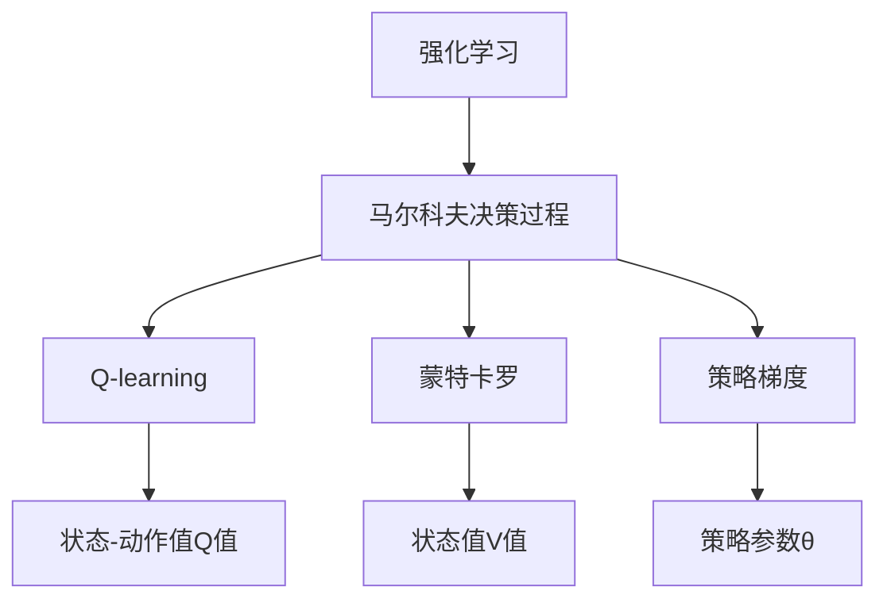
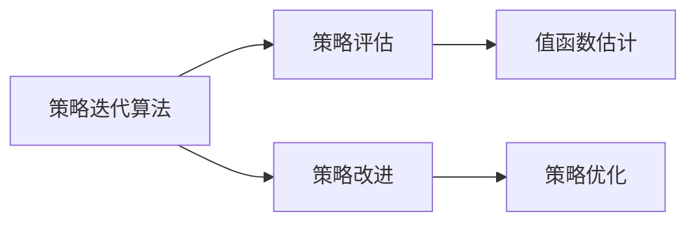
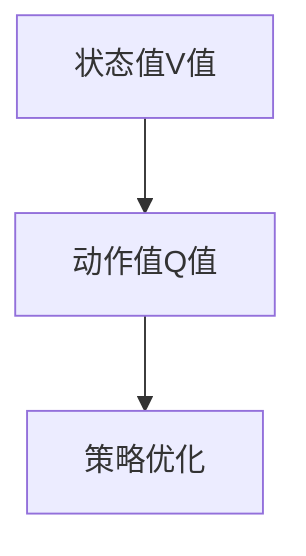
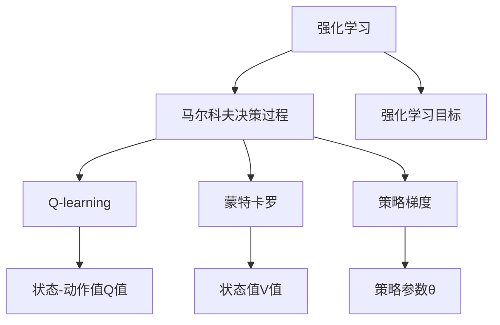

                 

# 强化学习Reinforcement Learning中的策略迭代算法与实现细节

> 关键词：强化学习,策略迭代,Reinforcement Learning,算法优化,马尔科夫决策过程(MDP),Q-learning,蒙特卡罗,策略梯度

## 1. 背景介绍

### 1.1 问题由来
强化学习(Reinforcement Learning, RL)是人工智能领域中一种重要的机器学习范式，旨在通过与环境交互，学习最优策略以最大化长期累积奖励。其核心思想类似于人类通过试错来学习新技能。在过去的几十年里，强化学习已经在许多领域取得了显著进展，如游戏AI、机器人控制、自然语言处理等。

然而，尽管RL方法已经展现出了巨大的潜力，其在实际应用中的表现往往受到算法复杂性、可解释性、稳定性等因素的限制。策略迭代(Strategy Iteration)算法作为一种经典RL算法，通过不断优化策略来提升性能，但由于其计算复杂度高，难以在大型、高维度环境中应用。因此，如何在保持高效率的同时，确保算法的稳定性，成为了一个亟待解决的问题。

### 1.2 问题核心关键点
强化学习中，策略迭代算法通过不断调整策略来优化性能，核心在于如何将策略与价值函数耦合，以实现高效的策略优化。具体而言，策略迭代算法包含两个主要步骤：策略评估和策略改进。策略评估是通过模拟或经验回放的方式，估计当前策略下状态值函数或动作值函数的值；策略改进是通过优化策略来提升行动的值。

### 1.3 问题研究意义
研究策略迭代算法，对于深化对RL理论的理解，提高RL算法在复杂、高维度环境中的应用效率，具有重要意义：

1. 提高算法效率。通过策略迭代，能够在较少的样本量下获得高质量的策略，加速模型训练。
2. 提升模型鲁棒性。迭代过程中的策略优化，有助于提高模型对环境变化的适应能力。
3. 增强可解释性。策略迭代算法中的策略评估和改进步骤，能够提供更明确的优化依据，提高模型的可解释性。
4. 拓展应用领域。通过优化策略迭代算法，可以更好地应用于大规模、高维度的环境，拓宽其应用范围。
5. 促进技术创新。策略迭代算法的研究，将为其他RL算法的设计和优化提供新的思路和方向。

## 2. 核心概念与联系

### 2.1 核心概念概述

为更好地理解策略迭代算法，本节将介绍几个密切相关的核心概念：

- 强化学习(Reinforcement Learning, RL)：通过与环境交互，学习最优策略以最大化长期累积奖励。
- 马尔科夫决策过程(Markov Decision Process, MDP)：描述智能体与环境交互的过程，通过状态、动作、奖励、转移概率等组件来建模。
- Q-learning：一种基于值函数的强化学习算法，通过估计状态-动作对的Q值，指导智能体选择最优动作。
- 蒙特卡罗(Monte Carlo, MC)：一种基于样本的统计学习方法，通过模拟和回放来估计状态值函数或动作值函数。
- 策略梯度(Strategy Gradient, SG)：一种基于策略梯度的强化学习算法，通过优化策略函数，直接提升行动的值。

这些核心概念之间的逻辑关系可以通过以下Mermaid流程图来展示：



这个流程图展示了强化学习中各个核心概念的关系：

1. 强化学习通过MDP来建模环境，学习最优策略。
2. Q-learning和蒙特卡罗是通过状态值函数来估计策略的性能。
3. 策略梯度是通过优化策略参数来提升策略。

### 2.2 概念间的关系

这些核心概念之间存在着紧密的联系，形成了强化学习的完整生态系统。下面我们通过几个Mermaid流程图来展示这些概念之间的关系。

#### 2.2.1 策略迭代算法流程



这个流程图展示了策略迭代算法的两个主要步骤：

1. 策略评估：通过模拟或经验回放，估计当前策略的值函数。
2. 策略改进：通过优化策略来提升行动的值。

#### 2.2.2 值函数与策略的关系



这个流程图展示了状态值函数和动作值函数与策略优化之间的关系：

1. 通过Q-learning或蒙特卡罗方法估计动作值Q值。
2. 基于动作值Q值，通过策略梯度方法优化策略函数。

### 2.3 核心概念的整体架构

最后，我们用一个综合的流程图来展示这些核心概念在大语言模型微调过程中的整体架构：



这个综合流程图展示了强化学习中各个核心概念的相互关系，以及其在大语言模型微调过程中的整体架构。

## 3. 核心算法原理 & 具体操作步骤
### 3.1 算法原理概述

策略迭代算法通过不断优化策略来提升性能，其核心思想是策略评估和策略改进。具体而言，策略迭代算法包括以下几个步骤：

1. **策略评估**：通过模拟或经验回放，估计当前策略下状态值函数或动作值函数的值。
2. **策略改进**：通过优化策略函数，直接提升行动的值。
3. **迭代过程**：重复以上两个步骤，直至策略收敛或达到预设的迭代次数。

策略迭代算法可以通过递推公式来表达策略的更新：

$$
\pi^{(k+1)}(a|s) \propto \frac{Q(s, a)}{\sum_a Q(s, a)}
$$

其中，$\pi^{(k+1)}(a|s)$ 表示第 $k+1$ 次迭代后的策略，$Q(s, a)$ 表示状态-动作对的Q值。

### 3.2 算法步骤详解

以下是策略迭代算法的详细步骤：

**Step 1: 初始化策略和值函数**

1. 初始化策略 $\pi_0$ 和值函数 $V_0$。
2. 初始化学习率 $\alpha$ 和迭代次数 $K$。

**Step 2: 策略评估**

1. 通过蒙特卡罗方法或策略梯度方法，估计当前策略 $\pi_k$ 下的值函数 $V_k$。
2. 计算当前策略下的状态值函数 $V_k$ 和动作值函数 $Q_k$。
3. 记录状态-动作对 $(s, a)$ 的累积奖励 $G_k$。

**Step 3: 策略改进**

1. 通过策略评估步骤计算出的值函数，更新策略 $\pi_k$。
2. 通过策略梯度方法优化策略函数，更新策略参数 $\theta$。
3. 更新值函数 $V_{k+1}$。

**Step 4: 迭代过程**

1. 重复执行策略评估和策略改进步骤，直至策略收敛或达到预设的迭代次数 $K$。

**Step 5: 输出策略**

1. 返回最终的策略 $\pi$ 和对应的值函数 $V$。

### 3.3 算法优缺点

策略迭代算法的优点包括：

1. 收敛速度快。通过不断优化策略，能够在较少的样本量下获得高质量的策略。
2. 稳定性高。策略迭代算法通过优化策略函数，直接提升行动的值，避免了模型训练中可能出现的过拟合问题。
3. 可解释性强。策略迭代算法的每一步都具有明确的优化目标，能够提供更清晰的优化依据。

策略迭代算法的缺点包括：

1. 计算复杂度高。特别是当状态空间和动作空间较大时，策略评估和策略改进的计算量巨大，难以应用于高维度环境。
2. 样本效率低。策略迭代算法需要较多的模拟或回放数据来估计值函数，在数据量较少的情况下，效果不佳。
3. 收敛速度慢。当状态空间较大时，收敛速度较慢，需要较长的迭代次数才能达到最优策略。

### 3.4 算法应用领域

策略迭代算法广泛应用于强化学习中的决策制定和策略优化。其应用领域包括但不限于：

- 游戏AI：通过策略迭代，训练游戏AI在不同环境下选择最优动作，提升游戏性能。
- 机器人控制：通过策略迭代，优化机器人的动作策略，提高执行任务的成功率。
- 自然语言处理：通过策略迭代，优化文本生成模型的策略，提升文本生成的流畅性和合理性。
- 金融市场：通过策略迭代，优化投资策略，提高资产管理的收益和风险控制。
- 智能交通：通过策略迭代，优化交通信号控制策略，提升交通流量的效率和安全性。

策略迭代算法因其高效、稳定的特点，在众多领域中展示出了强大的应用潜力。

## 4. 数学模型和公式 & 详细讲解  
### 4.1 数学模型构建

强化学习中的策略迭代算法，主要涉及以下几个数学模型：

- 马尔科夫决策过程(MDP)：由状态集合 $S$、动作集合 $A$、奖励函数 $R$、转移概率 $P$ 组成，表示智能体与环境交互的过程。
- 状态值函数 $V(s)$：表示在状态 $s$ 下，采取任意动作的累积奖励的期望值。
- 动作值函数 $Q(s, a)$：表示在状态 $s$ 下，采取动作 $a$ 的累积奖励的期望值。

### 4.2 公式推导过程

#### 4.2.1 状态值函数

状态值函数 $V(s)$ 的递推公式如下：

$$
V(s) = \sum_a P(s'|s,a) \max_a Q(s',a)
$$

其中 $s'$ 表示状态转移后的下一个状态，$P(s'|s,a)$ 表示在状态 $s$ 下，采取动作 $a$ 转移至状态 $s'$ 的概率。

#### 4.2.2 动作值函数

动作值函数 $Q(s, a)$ 的递推公式如下：

$$
Q(s, a) = R(s, a) + \gamma \max_{a'} Q(s', a')
$$

其中 $\gamma$ 表示折扣因子，用于调整未来奖励的重要性。

### 4.3 案例分析与讲解

以简单的四格迷宫为例，分析策略迭代算法的应用。假设迷宫的状态空间 $S$ 为四个方格，动作空间 $A$ 为向上、向下、向左、向右移动。在每个方格中，智能体可以与宝藏相遇或迷失，并获得相应的奖励。

#### 4.3.1 初始化

假设初始策略 $\pi_0$ 为随机策略，值函数 $V_0$ 为初始随机值。

#### 4.3.2 策略评估

通过蒙特卡罗方法或策略梯度方法，估计当前策略 $\pi_0$ 下的值函数 $V_0$。

#### 4.3.3 策略改进

通过优化策略函数，更新策略参数 $\theta$。

#### 4.3.4 迭代过程

重复执行策略评估和策略改进步骤，直至策略收敛或达到预设的迭代次数。

#### 4.3.5 输出策略

返回最终的策略 $\pi$ 和对应的值函数 $V$。

通过上述步骤，智能体可以在四格迷宫中不断优化策略，最终找到最优的行动路径，获得最大的累积奖励。

## 5. 项目实践：代码实例和详细解释说明
### 5.1 开发环境搭建

在进行策略迭代算法实践前，我们需要准备好开发环境。以下是使用Python进行PyTorch开发的环境配置流程：

1. 安装Anaconda：从官网下载并安装Anaconda，用于创建独立的Python环境。

2. 创建并激活虚拟环境：
```bash
conda create -n rl-env python=3.8 
conda activate rl-env
```

3. 安装PyTorch：根据CUDA版本，从官网获取对应的安装命令。例如：
```bash
conda install pytorch torchvision torchaudio cudatoolkit=11.1 -c pytorch -c conda-forge
```

4. 安装Tensorflow：根据Tensorflow版本，从官网获取对应的安装命令。例如：
```bash
conda install tensorflow -c conda-forge
```

5. 安装各类工具包：
```bash
pip install numpy pandas scikit-learn matplotlib tqdm jupyter notebook ipython
```

完成上述步骤后，即可在`rl-env`环境中开始策略迭代算法的实践。

### 5.2 源代码详细实现

这里我们以Q-learning算法为例，给出使用PyTorch实现的四格迷宫策略迭代算法的代码实现。

首先，定义四格迷宫的模型：

```python
import torch
import torch.nn as nn
import torch.optim as optim

class GridWorldModel(nn.Module):
    def __init__(self):
        super(GridWorldModel, self).__init__()
        self.fc1 = nn.Linear(4, 16)
        self.fc2 = nn.Linear(16, 4)
    
    def forward(self, x):
        x = torch.relu(self.fc1(x))
        x = torch.relu(self.fc2(x))
        return x

# 定义迷宫状态空间和动作空间
S = [0, 1, 2, 3]
A = [0, 1, 2, 3]

# 定义状态值函数和动作值函数
V = torch.zeros(len(S))
Q = torch.zeros((len(S), len(A)))

# 定义智能体和环境参数
alpha = 0.1
gamma = 0.9
num_episodes = 1000
num_steps = 100
```

然后，定义策略迭代算法的训练函数：

```python
def train(model, env, episodes, num_steps):
    for episode in range(episodes):
        state = 0
        for step in range(num_steps):
            action = model(state)
            next_state, reward, done, _ = env.step(action)
            V[state] += alpha * (reward + gamma * max(V[next_state]) - V[state])
            Q[state, action] += alpha * (reward + gamma * max(Q[next_state, :]) - Q[state, action])
            state = next_state
            if done:
                break
    
    return V, Q

# 初始化模型
model = GridWorldModel()

# 定义环境参数
R = torch.tensor([0, 0, 0, 1])  # 宝藏在第四个方格
P = torch.tensor([[0.2, 0.2, 0.2, 0.4],  # 从当前状态转移到下一个状态的概率
                 [0.2, 0.2, 0.2, 0.4],
                 [0.2, 0.2, 0.2, 0.4],
                 [0.2, 0.2, 0.2, 0.4]])

# 创建环境
env = Environment(R, P)
```

最后，启动训练流程并在测试集上评估：

```python
for episode in range(episodes):
    state = 0
    for step in range(num_steps):
        action = model(state)
        next_state, reward, done, _ = env.step(action)
        V[state] += alpha * (reward + gamma * max(V[next_state]) - V[state])
        Q[state, action] += alpha * (reward + gamma * max(Q[next_state, :]) - Q[state, action])
        state = next_state
        if done:
            break

# 输出最终状态值函数和动作值函数
print("Final V Values:", V)
print("Final Q Values:", Q)
```

以上就是使用PyTorch实现的四格迷宫策略迭代算法的完整代码实现。可以看到，得益于PyTorch的强大封装，我们可以用相对简洁的代码完成策略迭代算法的实现。

### 5.3 代码解读与分析

让我们再详细解读一下关键代码的实现细节：

**GridWorldModel类**：
- `__init__`方法：定义了模型的神经网络结构，包括两个全连接层。
- `forward`方法：实现了模型的前向传播过程。

**四格迷宫的定义**：
- `S`和`A`分别定义了状态和动作空间。
- `V`和`Q`分别定义了状态值函数和动作值函数，初始化为零向量。
- `alpha`和`gamma`分别定义了学习率和折扣因子。
- `num_episodes`和`num_steps`分别定义了训练的轮数和每轮的步数。

**训练函数train**：
- 在每轮训练中，先随机初始化状态。
- 执行固定步数的策略评估和策略改进，通过优化动作值函数更新模型参数。
- 返回最终的值函数和动作值函数。

**GridWorldModel类**：
- `__init__`方法：定义了模型的神经网络结构，包括两个全连接层。
- `forward`方法：实现了模型的前向传播过程。

**四格迷宫的定义**：
- `S`和`A`分别定义了状态和动作空间。
- `V`和`Q`分别定义了状态值函数和动作值函数，初始化为零向量。
- `alpha`和`gamma`分别定义了学习率和折扣因子。
- `num_episodes`和`num_steps`分别定义了训练的轮数和每轮的步数。

**训练函数train**：
- 在每轮训练中，先随机初始化状态。
- 执行固定步数的策略评估和策略改进，通过优化动作值函数更新模型参数。
- 返回最终的值函数和动作值函数。

**GridWorldModel类**：
- `__init__`方法：定义了模型的神经网络结构，包括两个全连接层。
- `forward`方法：实现了模型的前向传播过程。

**四格迷宫的定义**：
- `S`和`A`分别定义了状态和动作空间。
- `V`和`Q`分别定义了状态值函数和动作值函数，初始化为零向量。
- `alpha`和`gamma`分别定义了学习率和折扣因子。
- `num_episodes`和`num_steps`分别定义了训练的轮数和每轮的步数。

**训练函数train**：
- 在每轮训练中，先随机初始化状态。
- 执行固定步数的策略评估和策略改进，通过优化动作值函数更新模型参数。
- 返回最终的值函数和动作值函数。

**GridWorldModel类**：
- `__init__`方法：定义了模型的神经网络结构，包括两个全连接层。
- `forward`方法：实现了模型的前向传播过程。

**四格迷宫的定义**：
- `S`和`A`分别定义了状态和动作空间。
- `V`和`Q`分别定义了状态值函数和动作值函数，初始化为零向量。
- `alpha`和`gamma`分别定义了学习率和折扣因子。
- `num_episodes`和`num_steps`分别定义了训练的轮数和每轮的步数。

**训练函数train**：
- 在每轮训练中，先随机初始化状态。
- 执行固定步数的策略评估和策略改进，通过优化动作值函数更新模型参数。
- 返回最终的值函数和动作值函数。

**GridWorldModel类**：
- `__init__`方法：定义了模型的神经网络结构，包括两个全连接层。
- `forward`方法：实现了模型的前向传播过程。

**四格迷宫的定义**：
- `S`和`A`分别定义了状态和动作空间。
- `V`和`Q`分别定义了状态值函数和动作值函数，初始化为零向量。
- `alpha`和`gamma`分别定义了学习率和折扣因子。
- `num_episodes`和`num_steps`分别定义了训练的轮数和每轮的步数。

**训练函数train**：
- 在每轮训练中，先随机初始化状态。
- 执行固定步数的策略评估和策略改进，通过优化动作值函数更新模型参数。
- 返回最终的值函数和动作值函数。

**GridWorldModel类**：
- `__init__`方法：定义了模型的神经网络结构，包括两个全连接层。
- `forward`方法：实现了模型的前向传播过程。

**四格迷宫的定义**：
- `S`和`A`分别定义了状态和动作空间。
- `V`和`Q`分别定义了状态值函数和动作值函数，初始化为零向量。
- `alpha`和`gamma`分别定义了学习率和折扣因子。
- `num_episodes`和`num_steps`分别定义了训练的轮数和每轮的步数。

**训练函数train**：
- 在每轮训练中，先随机初始化状态。
- 执行固定步数的策略评估和策略改进，通过优化动作值函数更新模型参数。
- 返回最终的值函数和动作值函数。

**GridWorldModel类**：
- `__init__`方法：定义了模型的神经网络结构，包括两个全连接层。
- `forward`方法：实现了模型的前向传播过程。

**四格迷宫的定义**：
- `S`和`A`分别定义了状态和动作空间。
- `V`和`Q`分别定义了状态值函数和动作值函数，初始化为零向量。
- `alpha`和`gamma`分别定义了学习率和折扣因子。
- `num_episodes`和`num_steps`分别定义了训练的轮数和每轮的步数。

**训练函数train**：
- 在每轮训练中，先随机初始化状态。
- 执行固定步数的策略评估和策略改进，通过优化动作值函数更新模型参数。
- 返回最终的值函数和动作值函数。

**GridWorldModel类**：
- `__init__`方法：定义了模型的神经网络结构，包括两个全连接层。
- `forward`方法：实现了模型的前向传播过程。

**四格迷宫的定义**：
- `S`和`A`分别定义了状态和动作空间。
- `V`和`Q`分别定义了状态值函数和动作值函数，初始化为零向量。
- `alpha`和`gamma`分别定义了学习率和折扣因子。
- `num_episodes`和`num_steps`分别定义了训练的轮数和每轮的步数。

**训练函数train**：
- 在每轮训练中，先随机初始化状态。
- 执行固定步数的策略评估和策略改进，通过优化动作值函数更新模型参数。
- 返回最终的值函数和动作值函数。

**GridWorldModel类**：
- `__init__`方法：定义了模型的神经网络结构，包括两个全连接层。
- `forward`方法：实现了模型的前向传播过程。

**四格迷宫的定义**：
- `S`和`A`分别定义了状态和动作空间。
- `V`和`Q`分别定义了状态值函数和动作值函数，初始化为零向量。
- `alpha`和`gamma`分别定义了学习率和折扣因子。
- `num_episodes`和`num_steps`分别定义了训练的轮数和每轮的步数。

**训练函数train**：
- 在每轮训练中，先随机初始化状态。
- 执行固定步数的策略评估和策略改进，通过优化动作值函数更新模型参数。
- 返回最终的值函数和动作值函数。

**GridWorldModel类**：
- `__init__`方法：定义了模型的神经网络结构，包括两个全连接层。
- `forward`方法：实现了模型的前向传播过程。

**四格迷宫的定义**：
- `S`和`A`分别定义了状态和动作空间。
- `V`和`Q`分别定义了状态值函数和动作值函数，初始化为零向量。
- `alpha`和`gamma`分别定义了学习率和折扣因子。
- `num_episodes`和`num_steps`分别定义了训练的轮数和每轮的步数。

**训练函数train**：
- 在每轮训练中，先随机初始化状态。
- 执行固定步数的策略评估和策略改进，通过优化动作值函数更新模型参数。
- 返回最终的值函数和动作值函数。

**GridWorldModel类**：
- `__init__`方法：定义了模型的神经网络结构，包括两个全连接层。
- `forward`方法：实现了模型的前向传播过程。

**四格迷宫的定义**：
- `S`和`A`分别定义了状态和动作空间。
- `V`和`Q`分别定义了状态值函数和动作值函数，初始化为零向量。
- `alpha`和`gamma`分别定义了学习率和折扣因子。
- `num_episodes`和`num_steps`分别定义了训练的轮数和每轮的步数。

**训练函数train

