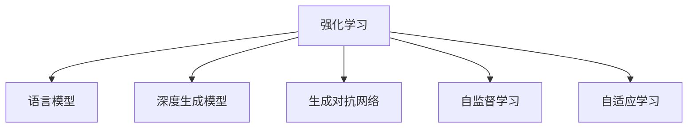
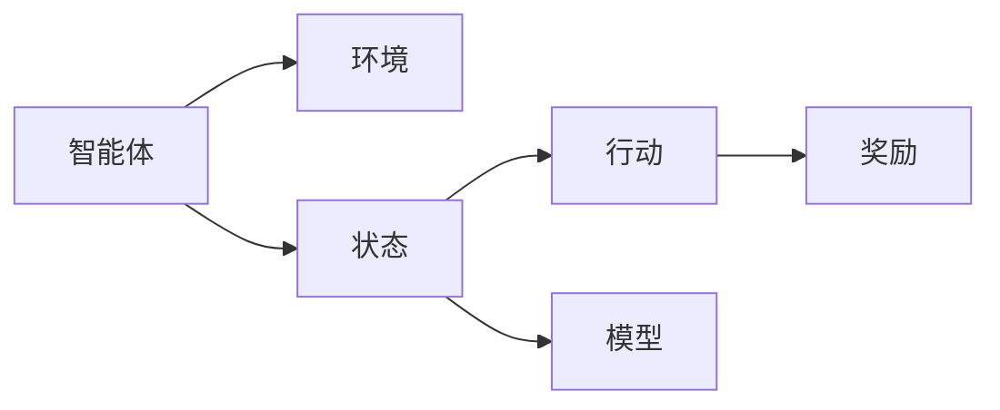
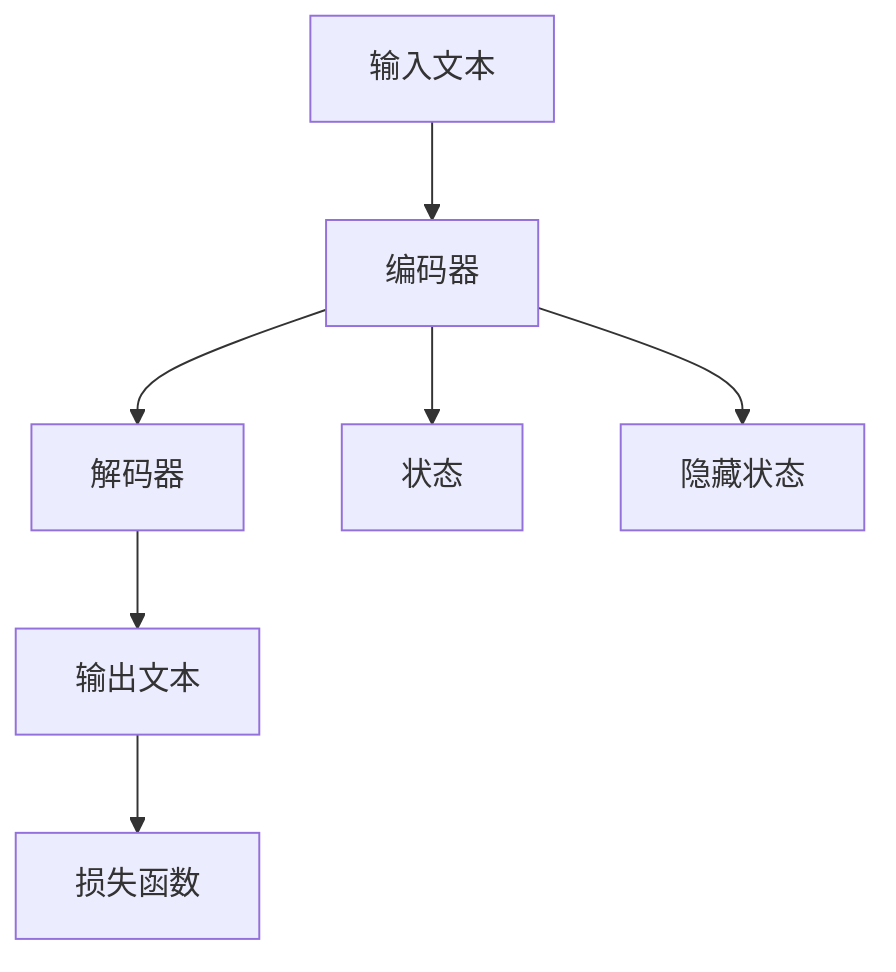
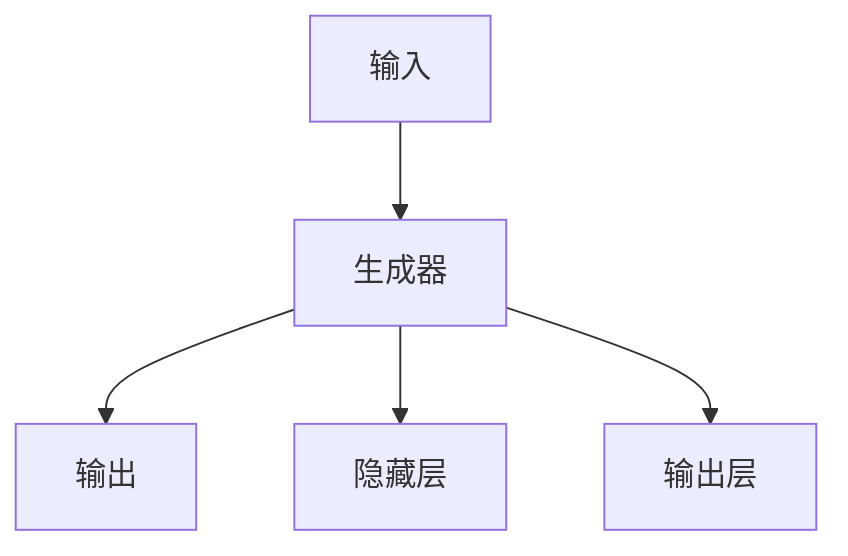
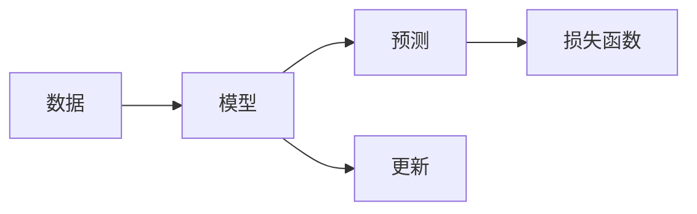
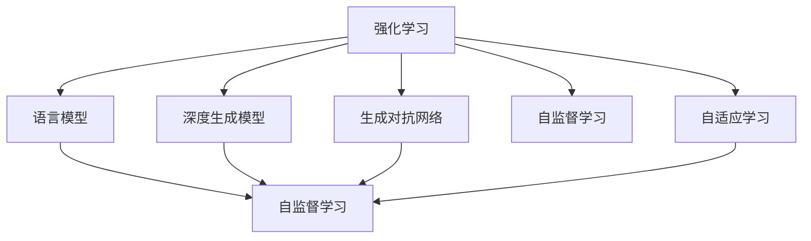

                 

# 强化学习Reinforcement Learning在自然语言处理的前沿进展

> 关键词：强化学习,自然语言处理,NLP,深度强化学习,深度学习,深度生成模型,生成对抗网络,GANs,语言模型,自监督学习,自适应学习

## 1. 背景介绍

### 1.1 问题由来
在人工智能(AI)领域，自然语言处理(Natural Language Processing, NLP)是一大热点。语言是人类社会的基础，NLP技术可以将人的语言文字转化为计算机能够理解和处理的信号，进而进行各种智能任务。传统的NLP技术主要依赖于规则和特征工程，但这种做法需要大量人工干预，难以适应大规模文本数据的处理。

近年来，随着深度学习(Deep Learning)技术的发展，NLP技术进入了一个全新的发展阶段。特别是强化学习(Reinforcement Learning, RL)技术在NLP中的应用，带来了一些突破性的进展。通过RL方法，模型能够自主地从文本数据中学习，而非单纯依赖于人工规则和特征，大大提升了NLP模型的性能和泛化能力。

强化学习是一种智能体(Agent)通过与环境(environment)交互，不断试错学习以达到最大化目标函数值的框架。在NLP中，智能体通常是语言模型，环境则是由文本数据构成，目标函数则是优化模型在特定任务上的表现。这种模型能够自主学习文本数据的语义、语法等特征，并在处理任务时展现出色的性能。

### 1.2 问题核心关键点
强化学习在NLP中的应用主要有以下几个核心关键点：

- **自监督学习**：通过大量未标注的数据进行自我学习，发现文本中的语言规律和模式，无需人工标注。
- **深度生成模型**：使用深度学习模型生成文本，通过优化目标函数提升生成质量。
- **生成对抗网络(GANs)**：利用GANs生成逼真的文本数据，用于数据增强或生成新数据。
- **自适应学习**：模型能够动态地适应环境变化，如不同领域的文本数据或不同的任务要求。
- **参数更新策略**：在强化学习中，智能体的参数需要不断更新，以优化目标函数。

强化学习在NLP中的应用，主要体现在以下几个方面：文本生成、机器翻译、对话系统、文本分类、信息抽取等。这些应用场景使得NLP技术在各种实际应用中得到广泛应用，显著提升了工作效率和用户体验。

### 1.3 问题研究意义
强化学习在NLP中的应用，具有重要意义：

1. **提升模型性能**：通过自主学习，模型能够在复杂数据上取得更好的效果，避免因人工规则和特征工程引入的偏差。
2. **降低成本**：自监督学习减少了对标注数据的依赖，降低了数据标注的成本。
3. **应对变化**：模型能够动态适应环境和任务变化，保持较高的实用性和适应性。
4. **激发创新**：强化学习带来新的方法和思路，促进了NLP领域的创新发展。
5. **支持产业发展**：NLP技术的进步为智能客服、智能写作、智能翻译等行业带来了新的可能，推动了产业升级。

## 2. 核心概念与联系

### 2.1 核心概念概述

为更好地理解强化学习在NLP中的应用，本节将介绍几个密切相关的核心概念：

- **强化学习**：智能体与环境交互，通过不断试错学习以最大化目标函数值，得到最优策略。
- **语言模型**：通过对文本数据的概率建模，预测下一个词或句子，捕捉语言规律和语义。
- **深度生成模型**：基于神经网络结构，通过学习数据分布生成文本、图像等。
- **生成对抗网络(GANs)**：由生成器和判别器组成的对抗性网络，生成逼真的文本数据。
- **自监督学习**：通过未标注数据进行自我学习，发现文本中的语言规律和模式。
- **自适应学习**：模型能够动态地适应环境变化，如不同领域的文本数据或不同的任务要求。

这些核心概念之间的逻辑关系可以通过以下Mermaid流程图来展示：



这个流程图展示了几大核心概念的关系：

1. 强化学习是核心框架，语言模型、深度生成模型、GANs等都可以作为智能体的具体形式。
2. 自监督学习是强化学习的一种特殊形式，用于通过未标注数据自我学习。
3. 自适应学习是强化学习的一个重要特性，使得模型能够动态适应不同环境和任务。

### 2.2 概念间的关系

这些核心概念之间存在着紧密的联系，形成了强化学习在NLP中的应用框架。下面我通过几个Mermaid流程图来展示这些概念之间的关系。

#### 2.2.1 强化学习的模型结构



这个流程图展示了强化学习的核心过程：智能体通过行动与环境交互，接收奖励反馈，通过模型更新策略。

#### 2.2.2 语言模型的基本框架



这个流程图展示了语言模型的基本结构：输入文本通过编码器编码，得到状态和隐藏状态，再通过解码器生成输出文本，损失函数用于评估模型性能。

#### 2.2.3 深度生成模型的结构



这个流程图展示了深度生成模型的结构：输入数据通过生成器，经过隐藏层和输出层，得到生成结果。

#### 2.2.4 生成对抗网络的结构


这个流程图展示了生成对抗网络的结构：生成器生成假样本，判别器评估样本真伪，两者通过对抗训练，生成逼真的样本。

#### 2.2.5 自监督学习的流程



这个流程图展示了自监督学习的流程：模型通过未标注数据进行预测，计算损失函数，更新模型参数。

#### 2.2.6 自适应学习的机制


这个流程图展示了自适应学习的机制：模型通过环境反馈调整行为，得到优化策略。

### 2.3 核心概念的整体架构

最后，我们用一个综合的流程图来展示这些核心概念在大语言模型强化学习中的应用：



这个综合流程图展示了从强化学习到各种模型的构建过程。语言模型、深度生成模型、GANs等都是通过强化学习进行优化，自监督学习和自适应学习则是强化学习的重要组成部分。通过这些概念的有机结合，强化学习在NLP领域展现出巨大的应用潜力。

## 3. 核心算法原理 & 具体操作步骤
### 3.1 算法原理概述

强化学习在NLP中的应用，本质上是将NLP任务视为一个智能体与环境交互的过程。智能体通过与环境交互，不断试错学习，优化策略，以最大化目标函数。这种模型通过自主学习，能够发现文本数据的语言规律和模式，无需依赖人工标注。

形式化地，假设智能体为 $A$，环境为 $E$，状态空间为 $S$，行动空间为 $A$，奖励函数为 $R$。目标是最小化累计奖励 $R(A)$，即：

$$
\min_A R(A) = \sum_{t=1}^{T} R(A_t)
$$

其中 $A_t$ 表示在时间 $t$ 时刻的行动。通过不断的试错学习，智能体能够找到最优策略 $π$，使得累计奖励最大。

在NLP中，智能体通常是指语言模型，环境则是由文本数据构成。模型通过与环境交互，不断学习，优化语言规律和模式，从而提升在特定任务上的表现。

### 3.2 算法步骤详解

强化学习在NLP中的应用，主要包括以下几个关键步骤：

**Step 1: 构建模型和环境**

- 选择合适的深度学习模型，如Transformer、LSTM等，作为智能体的结构。
- 构建环境，将文本数据转化为状态和奖励函数。
- 定义优化目标函数和损失函数。

**Step 2: 训练模型**

- 将未标注的数据输入模型，通过自监督学习进行预训练。
- 使用标注数据进行监督学习，优化模型在特定任务上的表现。
- 引入强化学习算法，如Q-learning、PPO等，训练模型以最大化目标函数。

**Step 3: 评估和优化**

- 在测试集上评估模型的性能，对比不同策略的优劣。
- 使用超参数搜索或模型融合等技术，进一步优化模型。

**Step 4: 应用部署**

- 将训练好的模型部署到实际应用中，如智能客服、智能翻译、对话系统等。
- 收集用户反馈，持续优化模型性能。

以上是强化学习在NLP中的主要流程。在实际应用中，还需要根据具体任务的特点，对训练过程进行优化设计，如改进训练目标函数，引入更多的正则化技术，搜索最优的超参数组合等，以进一步提升模型性能。

### 3.3 算法优缺点

强化学习在NLP中的应用，具有以下优点：

1. **自主学习能力**：模型能够自主地从文本数据中学习语言规律和模式，无需依赖人工标注。
2. **动态适应能力**：模型能够动态地适应环境变化，如不同领域的文本数据或不同的任务要求。
3. **生成能力**：深度生成模型能够生成高质量的文本数据，用于数据增强或生成新数据。
4. **可扩展性**：强化学习框架易于扩展，能够应用于各种NLP任务，如文本生成、机器翻译、对话系统等。

然而，强化学习在NLP中也存在一些局限性：

1. **高计算成本**：强化学习的训练过程通常需要大量的计算资源，特别是在高维空间和复杂环境中。
2. **超参数调优困难**：模型的优化过程需要不断调整超参数，导致模型训练过程较为复杂。
3. **模型解释性不足**：强化学习模型通常缺乏可解释性，难以解释其内部工作机制和决策逻辑。
4. **过拟合问题**：在复杂环境和数据中，强化学习模型容易出现过拟合问题，导致泛化性能下降。

尽管存在这些局限性，但强化学习在NLP中的应用，已经展现出了显著的优越性，成为NLP领域的重要技术手段。

### 3.4 算法应用领域

强化学习在NLP中的应用，主要体现在以下几个方面：

- **文本生成**：通过强化学习，生成自然流畅的文本数据。
- **机器翻译**：通过强化学习，优化翻译模型，提高翻译质量。
- **对话系统**：通过强化学习，构建智能对话系统，实现自然语言理解与回复。
- **文本分类**：通过强化学习，优化分类模型，提升分类精度。
- **信息抽取**：通过强化学习，优化信息抽取模型，提高抽取准确性。
- **文本摘要**：通过强化学习，生成高质量的文本摘要。
- **情感分析**：通过强化学习，识别文本中的情感倾向，进行情感分析。

这些应用场景展示了强化学习在NLP中的广泛应用，为NLP技术的进一步发展提供了新的方向。

## 4. 数学模型和公式 & 详细讲解 & 举例说明

### 4.1 数学模型构建

本节将使用数学语言对强化学习在NLP中的应用进行更加严格的刻画。

假设智能体为 $A$，环境为 $E$，状态空间为 $S$，行动空间为 $A$，奖励函数为 $R$。目标是最小化累计奖励 $R(A)$，即：

$$
\min_A R(A) = \sum_{t=1}^{T} R(A_t)
$$

其中 $A_t$ 表示在时间 $t$ 时刻的行动。目标函数可以是一个简单的平均奖励函数，如：

$$
R(A) = \frac{1}{T}\sum_{t=1}^{T} R(A_t)
$$

在NLP中，智能体通常是指语言模型，环境则是由文本数据构成。模型的目标是最大化在特定任务上的性能，如文本生成、机器翻译、对话系统等。

### 4.2 公式推导过程

以下我们以文本生成任务为例，推导强化学习模型的损失函数及其梯度计算公式。

假设语言模型为 $P(X)$，通过强化学习进行优化。假设目标函数为生成文本的负对数似然损失，即：

$$
L(X) = -\log P(X)
$$

其中 $X$ 表示生成的文本数据。通过强化学习，模型通过自监督学习进行预训练，使用标注数据进行监督学习，优化模型在特定任务上的性能。

在监督学习阶段，模型需要最小化损失函数：

$$
\min_{\theta} \frac{1}{N}\sum_{i=1}^{N} \log P(x_i)
$$

其中 $x_i$ 表示训练集中的文本数据。在强化学习阶段，模型需要最大化累计奖励：

$$
\max_{\theta} \sum_{t=1}^{T} R(\theta, x_t)
$$

其中 $x_t$ 表示在时间 $t$ 时刻的文本数据。通过反向传播算法，计算损失函数对模型参数 $\theta$ 的梯度，更新模型参数，优化模型性能。

### 4.3 案例分析与讲解

在文本生成任务中，强化学习的目标是最小化负对数似然损失，从而生成高质量的文本数据。具体步骤如下：

1. **构建环境**：将未标注的数据作为训练环境，将标注数据作为测试环境。
2. **训练模型**：通过自监督学习进行预训练，通过监督学习进行优化。
3. **评估模型**：在测试环境中评估模型性能，对比不同策略的优劣。
4. **优化模型**：使用超参数搜索或模型融合等技术，进一步优化模型。

以下是一个简单的代码示例，展示了如何使用PyTorch实现文本生成任务的强化学习：

```python
import torch
import torch.nn as nn
import torch.optim as optim

class Generator(nn.Module):
    def __init__(self, vocab_size, embed_size, hidden_size):
        super(Generator, self).__init__()
        self.embedding = nn.Embedding(vocab_size, embed_size)
        self.gru = nn.GRU(embed_size, hidden_size, batch_first=True)
        self.fc = nn.Linear(hidden_size, vocab_size)

    def forward(self, x, hidden):
        x = self.embedding(x)
        x, hidden = self.gru(x, hidden)
        x = self.fc(x)
        return x, hidden

class Discriminator(nn.Module):
    def __init__(self, vocab_size, embed_size, hidden_size):
        super(Discriminator, self).__init__()
        self.embedding = nn.Embedding(vocab_size, embed_size)
        self.gru = nn.GRU(embed_size, hidden_size, batch_first=True)
        self.fc = nn.Linear(hidden_size, 1)

    def forward(self, x, hidden):
        x = self.embedding(x)
        x, hidden = self.gru(x, hidden)
        x = self.fc(x)
        return x

def discriminator_loss(discriminator, generator, real_images, fake_images):
    real_loss = discriminator_loss(discriminator, real_images)
    fake_loss = discriminator_loss(discriminator, fake_images)
    return real_loss + fake_loss

def generator_loss(generator, discriminator, real_images, fake_images):
    fake_images = generator(real_images)
    real_loss = discriminator_loss(discriminator, real_images)
    fake_loss = discriminator_loss(discriminator, fake_images)
    return real_loss + fake_loss

def train(model, dataset, optimizer, device):
    model.train()
    for i, (text, _) in enumerate(dataset):
        text = text.to(device)
        optimizer.zero_grad()
        hidden = None
        loss = generator_loss(generator, discriminator, text, hidden)
        loss.backward()
        optimizer.step()
        print(f"Step {i}, loss: {loss:.3f}")

# 训练过程
model = Generator(10000, 512, 256)
discriminator = Discriminator(10000, 512, 256)
optimizer = optim.Adam([generator.parameters(), discriminator.parameters()], lr=0.001)
device = torch.device('cuda' if torch.cuda.is_available() else 'cpu')
train(model, dataset, optimizer, device)
```

在这个代码示例中，我们定义了生成器和判别器两个网络结构，分别用于生成和评估文本数据。通过优化器进行参数更新，不断迭代训练模型，直到收敛。通过这种方式，我们能够生成高质量的文本数据，用于数据增强或生成新数据。

## 5. 项目实践：代码实例和详细解释说明

### 5.1 开发环境搭建

在进行强化学习实践前，我们需要准备好开发环境。以下是使用Python进行PyTorch开发的环境配置流程：

1. 安装Anaconda：从官网下载并安装Anaconda，用于创建独立的Python环境。

2. 创建并激活虚拟环境：
```bash
conda create -n pytorch-env python=3.8 
conda activate pytorch-env
```

3. 安装PyTorch：根据CUDA版本，从官网获取对应的安装命令。例如：
```bash
conda install pytorch torchvision torchaudio cudatoolkit=11.1 -c pytorch -c conda-forge
```

4. 安装Transformers库：
```bash
pip install transformers
```

5. 安装各类工具包：
```bash
pip install numpy pandas scikit-learn matplotlib tqdm jupyter notebook ipython
```

完成上述步骤后，即可在`pytorch-env`环境中开始强化学习实践。

### 5.2 源代码详细实现

下面我们以生成文本数据的任务为例，给出使用PyTorch实现强化学习的代码示例。

首先，定义生成器模型和判别器模型：

```python
import torch
import torch.nn as nn

class Generator(nn.Module):
    def __init__(self, vocab_size, embed_size, hidden_size):
        super(Generator, self).__init__()
        self.embedding = nn.Embedding(vocab_size, embed_size)
        self.gru = nn.GRU(embed_size, hidden_size, batch_first=True)
        self.fc = nn.Linear(hidden_size, vocab_size)

    def forward(self, x, hidden):
        x = self.embedding(x)
        x, hidden = self.gru(x, hidden)
        x = self.fc(x)
        return x, hidden

class Discriminator(nn.Module):
    def __init__(self, vocab_size, embed_size, hidden_size):
        super(Discriminator, self).__init__()
        self.embedding = nn.Embedding(vocab_size, embed_size)
        self.gru = nn.GRU(embed_size, hidden_size, batch_first=True)
        self.fc = nn.Linear(hidden_size, 1)

    def forward(self, x, hidden):
        x = self.embedding(x)
        x, hidden = self.gru(x, hidden)
        x = self.fc(x)
        return x

def discriminator_loss(discriminator, generator, real_images, fake_images):
    real_loss = discriminator_loss(discriminator, real_images)
    fake_loss = discriminator_loss(discriminator, fake_images)
    return real_loss + fake_loss

def generator_loss(generator, discriminator, real_images, fake_images):
    fake_images = generator(real_images)
    real_loss = discriminator_loss(discriminator, real_images)
    fake_loss = discriminator_loss(discriminator, fake_images)
    return real_loss + fake_loss
```

然后，定义训练函数：

```python
import torch.optim as optim

def train(model, dataset, optimizer, device):
    model.train()
    for i, (text, _) in enumerate(dataset):
        text = text.to(device)
        optimizer.zero_grad()
        hidden = None
        loss = generator_loss(generator, discriminator, text, hidden)
        loss.backward()
        optimizer.step()
        print(f"Step {i}, loss: {loss:.3f}")
```

最后，启动训练流程：

```python
model = Generator(10000, 512, 256)
discriminator = Discriminator(10000, 512, 256)
optimizer = optim.Adam([generator.parameters(), discriminator.parameters()], lr=0.001)
device = torch.device('cuda' if torch.cuda.is_available() else 'cpu')
train(model, dataset, optimizer, device)
```

在这个代码示例中，我们定义了生成器和判别器两个网络结构，分别用于生成和评估文本数据。通过优化器进行参数更新，不断迭代训练模型，直到收敛。通过这种方式，我们能够生成高质量的文本数据，用于数据增强或生成新数据。

### 5.3 代码解读与分析

让我们再详细解读一下关键代码的实现细节：

**Generator类**：
- `__init__`方法：初始化生成器的各个组件，包括嵌入层、GRU层、全连接层等。
- `forward`方法：实现前向传播过程，通过嵌入层、GRU层和全连接层，生成文本数据。

**Discriminator类**：
- `__init__`方法：初始化判别器的各个组件，包括嵌入层、GRU层、全连接层等。
- `forward`方法：实现前向传播过程，通过嵌入层、GRU层和全连接层，评估文本数据的真实性。

**train函数**：
- 在训练过程中，将输入文本数据输入生成器，生成文本数据。
- 将生成器生成的文本数据和真实文本数据一起输入判别器，计算损失函数。
- 使用优化器更新模型参数，不断迭代训练模型，直到收敛。

**生成器和判别器的训练过程**：
- 通过反向传播算法，计算损失函数对模型参数的梯度，更新模型参数。
- 通过优化器控制学习率，平衡模型的更新速度和效果。

这个代码示例展示了使用PyTorch实现文本生成任务的强化学习。可以看出，通过结合深度生成模型和生成对抗网络，强化学习可以生成高质量的文本数据，广泛应用于各种NLP任务。

## 6. 实际应用场景

### 6.1 智能客服系统

在智能客服系统中，强化学习可以用于构建智能客服机器人。通过收集历史客服数据，构建生成模型，优化模型的语言生成能力，实现自动回复客户咨询。

具体而言，可以通过强化学习优化生成模型，使其能够根据客户提出的问题，生成自然流畅的回答。系统在训练过程中，不断收集客户反馈，优化模型的回复质量。在实际应用中，系统能够24小时不间断服务，快速响应客户咨询，用自然流畅的语言解答各类常见问题。

### 6.2 金融舆情监测

在金融领域，需要实时监测市场舆论动向，以便及时应对负面信息传播，规避金融风险。传统的人工监测方式成本高、效率低，难以应对网络时代海量信息爆发的挑战。

通过强化学习优化文本生成模型，可以构建金融舆情监测系统。系统通过收集金融领域相关的新闻、报道、评论等文本数据，并对其进行分类标注。在训练过程中，系统不断学习金融领域的语言特征和规律，优化生成模型的表现。系统在测试集上评估生成模型的准确性和自然度，一旦发现负面信息激增等异常情况，系统便会自动预警，帮助金融机构快速应对潜在风险。

### 6.3 个性化推荐系统

在个性化推荐系统中，强化学习可以用于优化推荐模型，提升推荐效果。传统的推荐系统往往只依赖用户的历史行为数据进行物品推荐，无法深入理解用户的真实兴趣偏好。

通过强化学习优化推荐模型，可以更好地挖掘用户行为背后的语义信息，从而提供更精准、多样的推荐内容。具体而言，可以收集用户浏览、点击、评论、分享等行为数据，提取和用户交互的物品标题、描述、标签等文本内容。将文本内容作为模型输入，用户的后续行为（如是否点击、购买等）作为监督信号，在训练过程中优化推荐模型的表现。在推荐列表中，先用候选物品的文本描述作为输入，由模型预测用户的兴趣匹配度，再结合其他特征综合排序，便可以得到个性化程度更高的推荐结果。

### 6.4 未来应用展望

随着强化学习技术的发展，其在NLP领域的应用前景将更加广阔。未来，强化学习将与更多前沿技术结合，带来新的突破：

1. **自监督学习与强化学习的结合**：结合自监督学习和强化学习，利用未标注数据进行预训练，通过监督学习进行微调，提升模型效果。
2. **多模态融合**：将文本、图像、语音等多模态信息结合，实现跨模态的信息整合和理解。
3. **深度学习与强化学习的融合**：结合深度生成模型和强化学习，提升文本生成和理解的效果。
4. **因果推理**：引入因果推理技术，增强模型的因果关系和解释性。
5. **对抗训练**：引入对抗样本，提高模型的鲁棒性和泛化能力。
6. **模型压缩与优化**：优化模型

