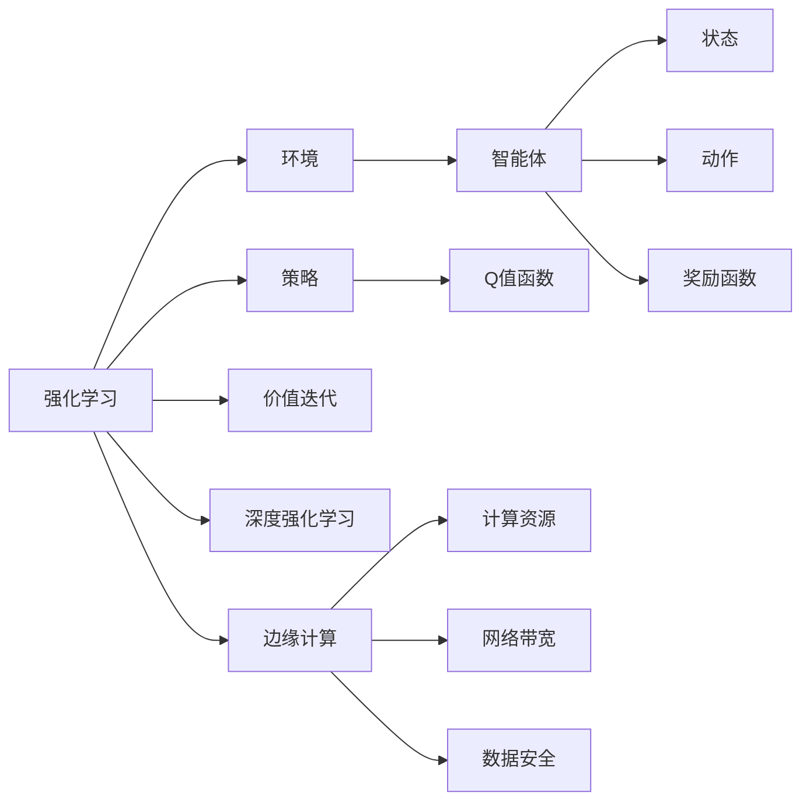
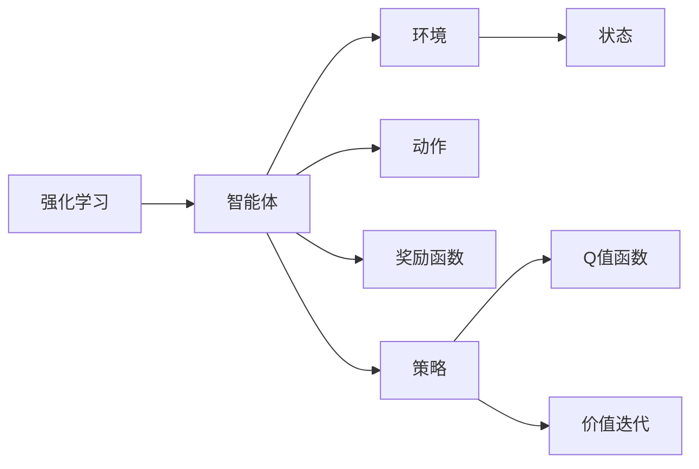
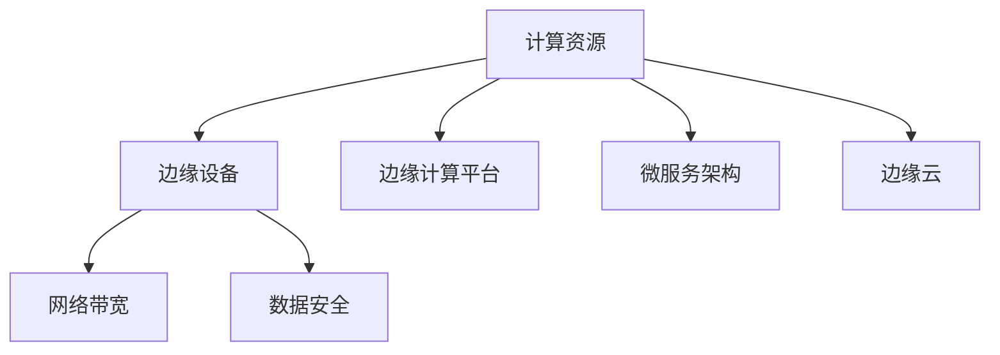
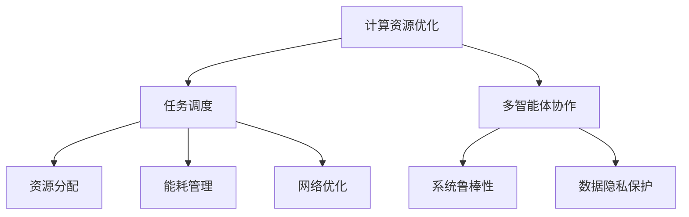
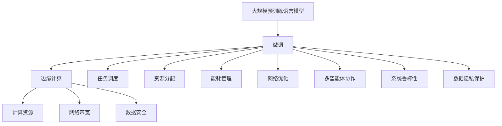

                 

# 强化学习Reinforcement Learning在边缘计算中的应用前景

## 1. 背景介绍

### 1.1 问题由来
随着边缘计算（Edge Computing）技术的迅猛发展，其有望成为未来计算领域的重要趋势。边缘计算通过在靠近数据源的地方进行数据处理和分析，可以显著降低网络延迟，提升数据传输效率，增强系统的实时性。然而，尽管边缘计算能够改善计算和数据处理效率，但同时也面临诸多挑战，如计算资源受限、网络带宽不足、数据安全隐私等。为了解决这些问题，研究人员提出了许多基于强化学习的方案，希望通过智能化的决策优化，最大化边缘计算系统的资源利用率，提升数据处理和分析效率。

### 1.2 问题核心关键点
强化学习（Reinforcement Learning, RL）是一种通过智能体（Agent）与环境（Environment）互动，实现目标优化的人工智能技术。强化学习中，智能体通过与环境的交互，不断学习和调整策略，以最大化预定的奖励函数。在边缘计算应用中，强化学习可以用于多种场景，如任务调度、资源分配、能量管理、网络优化等。强化学习的关键在于如何设计合适的环境模型、策略空间、奖励函数，以及如何应对多智能体协作等问题。

### 1.3 问题研究意义
强化学习在边缘计算中的应用，对于提高边缘计算系统的效率、降低能耗、增强安全性等方面具有重要意义：

1. 资源优化：通过智能体的决策优化，可以更有效地利用有限的边缘计算资源，提升计算和数据处理的效率。
2. 能耗降低：通过优化资源分配和任务调度，可以实现更优的能耗管理，延长边缘计算设备的运行时间。
3. 安全增强：通过学习最优的安全策略，可以提升边缘计算系统的鲁棒性和抗攻击能力，保护数据隐私和安全。
4. 系统鲁棒性：强化学习能够适应动态变化的环境，提升系统的稳定性和可靠性。
5. 通用性：强化学习是一种通用的人工智能技术，可以应用到多种边缘计算场景，具有广泛的应用前景。

## 2. 核心概念与联系

### 2.1 核心概念概述

为更好地理解强化学习在边缘计算中的应用，本节将介绍几个密切相关的核心概念：

- **强化学习**（Reinforcement Learning）：一种通过智能体与环境互动，实现目标优化的人工智能技术。强化学习中，智能体通过与环境的交互，不断学习和调整策略，以最大化预定的奖励函数。
- **环境**（Environment）：强化学习中的环境指的是智能体所处的交互场景，可以是模拟环境，也可以是真实世界中的物理环境。
- **智能体**（Agent）：智能体是强化学习中的决策主体，通过与环境的互动，学习最优策略。
- **状态**（State）：状态是描述环境当前状态的信息集合，智能体通过感知状态，进行决策。
- **动作**（Action）：动作是智能体对环境的响应，动作的选择会影响环境的奖励和状态转移。
- **奖励函数**（Reward Function）：奖励函数是智能体的目标函数，用于衡量智能体的决策质量，指导策略的学习。
- **策略**（Policy）：策略是智能体的决策规则，描述智能体在不同状态下选择动作的方式。
- **Q值函数**（Q-Value Function）：Q值函数是评估策略的一种方式，用于估计每个状态-动作对的预期回报。
- **价值迭代**（Value Iteration）：价值迭代是强化学习的一种基本算法，通过不断更新状态-动作对的价值函数，学习最优策略。
- **深度强化学习**（Deep Reinforcement Learning）：深度强化学习是结合深度神经网络进行强化学习的一种方法，可以处理高维状态空间和动作空间。
- **边缘计算**（Edge Computing）：边缘计算是一种计算模型，将数据和计算资源部署在靠近数据源的地方，以减少延迟，提升效率。

这些核心概念之间的逻辑关系可以通过以下Mermaid流程图来展示：



这个流程图展示出强化学习、边缘计算和各个核心概念之间的联系。强化学习通过智能体和环境互动，学习最优策略；而边缘计算提供计算资源、网络带宽和数据安全等环境要素，影响强化学习的效果。

### 2.2 概念间的关系

这些核心概念之间存在着紧密的联系，形成了强化学习在边缘计算中的应用框架。下面我通过几个Mermaid流程图来展示这些概念之间的关系。

#### 2.2.1 强化学习的学习范式



这个流程图展示出强化学习的基本学习范式。智能体通过与环境互动，学习最优策略，策略的选择依据是Q值函数，Q值函数的计算基于价值迭代算法。

#### 2.2.2 边缘计算的架构



这个流程图展示出边缘计算的基本架构。边缘计算通过靠近数据源的计算资源，提升数据处理效率，同时通过边缘设备提供网络带宽和数据安全保障。

#### 2.2.3 强化学习在边缘计算中的应用场景



这个流程图展示出强化学习在边缘计算中的多种应用场景。从计算资源优化到网络优化，从任务调度到系统鲁棒性，强化学习都能提供智能化的解决方案。

### 2.3 核心概念的整体架构

最后，我们用一个综合的流程图来展示这些核心概念在大规模预训练语言模型微调过程中的整体架构：



这个综合流程图展示了从大规模预训练语言模型到边缘计算的微调过程，以及各个核心概念之间的关系。大模型在边缘计算中通过微调，实现任务优化，提升计算资源、网络带宽和数据安全等环境要素的利用效率。

## 3. 核心算法原理 & 具体操作步骤

### 3.1 算法原理概述

强化学习在边缘计算中的应用，主要是通过智能体（通常是算法或软件）与环境（边缘计算系统）之间的互动，实现资源优化、任务调度、能耗管理等目标。具体来说，强化学习的目标是最大化智能体在不同状态下的累积奖励，通过不断调整策略，逐步趋近最优解。

在边缘计算中，智能体通过感知边缘计算资源（如计算资源、网络带宽、存储资源等）的状态，选择合适的操作（如任务调度、资源分配等），并根据环境反馈（如任务完成情况、能耗消耗等）获得奖励或惩罚。智能体通过不断的试错和学习，逐步优化策略，提升边缘计算系统的整体效率。

### 3.2 算法步骤详解

强化学习在边缘计算中的应用步骤主要包括以下几个关键环节：

1. **环境建模**：构建边缘计算系统的环境模型，包括计算资源、网络带宽、数据安全等因素。环境模型的准确性和完整性直接影响强化学习的效果。
2. **状态感知**：智能体通过传感器或监控工具，感知边缘计算系统的当前状态。状态通常包括资源利用率、网络负载、任务队列等信息。
3. **动作选择**：智能体根据当前状态和策略，选择合适的操作。例如，任务调度、资源分配、能耗管理等。动作的选择直接影响系统的性能和稳定性。
4. **环境互动**：智能体执行所选操作，并观察环境的变化。例如，任务执行、资源调整等。环境的变化包括任务完成情况、资源消耗、能耗变化等。
5. **奖励计算**：智能体根据环境的变化，计算当前操作的奖励。例如，任务按时完成获得的奖励，资源浪费或能耗过高的惩罚。
6. **策略更新**：智能体根据奖励和环境变化，更新策略。例如，通过Q值函数更新，优化决策过程。

以下是一个简化的强化学习在边缘计算中的应用流程：


### 3.3 算法优缺点

强化学习在边缘计算中的应用具有以下优点：

1. **自适应性**：强化学习能够适应动态变化的环境，优化资源分配和任务调度，提升系统的鲁棒性。
2. **高效性**：通过智能体的决策优化，可以更有效地利用有限的边缘计算资源，提升数据处理和分析效率。
3. **灵活性**：强化学习可以处理多种边缘计算任务，具有广泛的适用性。
4. **可扩展性**：强化学习可以通过扩展智能体的策略空间，适应不同的应用场景。

同时，强化学习在边缘计算中也有一些局限性：

1. **探索与利用**：强化学习中存在探索与利用之间的平衡问题。过度探索可能导致资源浪费，过度利用可能导致资源不足。
2. **模型复杂度**：强化学习模型的构建和训练需要大量的数据和计算资源，模型复杂度较高。
3. **计算开销**：强化学习算法本身的计算开销较大，可能影响系统的实时性。
4. **可解释性**：强化学习模型往往是"黑盒"系统，难以解释其内部工作机制和决策逻辑。

### 3.4 算法应用领域

强化学习在边缘计算中具有广泛的应用领域，以下是一些典型的应用场景：

- **任务调度**：通过强化学习优化任务的调度策略，提升系统的吞吐量和响应速度。
- **资源分配**：通过智能体的决策优化，合理分配计算资源、存储资源和网络带宽，最大化资源利用率。
- **能耗管理**：通过强化学习优化能耗管理策略，降低边缘计算设备的能耗，延长其使用寿命。
- **网络优化**：通过智能体的决策优化，优化网络路由和数据传输策略，提升网络性能和可靠性。
- **系统鲁棒性**：通过强化学习学习最优的安全策略，提升边缘计算系统的鲁棒性和抗攻击能力。
- **多智能体协作**：通过多智能体的协作，优化边缘计算系统的整体性能，实现更高效的任务处理。

## 4. 数学模型和公式 & 详细讲解 & 举例说明

### 4.1 数学模型构建

强化学习的数学模型主要由状态、动作、奖励和策略组成。我们以任务调度为例，构建一个简单的强化学习模型：

1. **状态**（State）：当前任务队列的长度和执行中的任务数量。
2. **动作**（Action）：选择任务进行调度。
3. **奖励**（Reward）：任务调度后获得的奖励，例如任务完成时间和资源利用率。
4. **策略**（Policy）：选择任务调度的规则。

用数学符号表示如下：

- 状态 $s$：包括当前任务队列长度 $L$ 和执行中的任务数量 $N$。$s = (L, N)$。
- 动作 $a$：选择任务进行调度。$a = \{1, 2, ..., n\}$，其中 $n$ 为任务数。
- 奖励 $r$：任务调度后获得的奖励。$r = r_1, r_2, ..., r_n$，其中 $r_i$ 表示任务 $i$ 的奖励。
- 策略 $\pi$：选择任务调度的规则。$\pi: s \rightarrow a$。

### 4.2 公式推导过程

强化学习的核心是优化策略 $\pi$，以最大化期望奖励 $J(\pi)$。期望奖励可以表示为：

$$
J(\pi) = \mathbb{E}_{s_0}\left[\sum_{t=0}^{\infty} \gamma^t r_t\right]
$$

其中，$s_0$ 表示初始状态，$\gamma$ 表示折扣因子，$r_t$ 表示在第 $t$ 时刻获得的奖励。

通过定义Q值函数 $Q(s, a)$，可以进一步表示期望奖励：

$$
Q(s, a) = \mathbb{E}_{s' \sim P(s|a)}\left[r + \gamma \max_{a'} Q(s', a')\right]
$$

其中，$P(s'|a)$ 表示在状态 $s$ 下执行动作 $a$ 后转移到状态 $s'$ 的概率分布。

通过求解Q值函数，可以得到最优策略 $\pi^*$：

$$
\pi^*(a|s) = \arg\max_a Q(s, a)
$$

### 4.3 案例分析与讲解

假设我们有一个边缘计算系统，其中包含5个任务（Task 1, Task 2, Task 3, Task 4, Task 5）。当前任务队列的长度为8，执行中的任务数量为2。智能体的策略是选择任务进行调度。

1. **状态感知**：智能体感知当前任务队列长度为8，执行中的任务数量为2。
2. **动作选择**：智能体可以选择一个任务进行调度。假设当前的任务队列是[1, 2, 3, 4, 5, 6, 7, 8]，执行中的任务是[1, 2]。
3. **环境互动**：智能体执行所选任务，假设选择Task 3进行调度。
4. **奖励计算**：智能体根据Task 3的执行情况，计算当前操作的奖励。假设Task 3执行完成，获得了10的奖励。
5. **策略更新**：智能体根据奖励和状态变化，更新策略。假设智能体更新了策略，选择Task 4进行调度。

通过不断的试错和优化，智能体能够逐步学习到最优的任务调度策略，提升系统的整体性能。

## 5. 项目实践：代码实例和详细解释说明

### 5.1 开发环境搭建

在进行强化学习项目实践前，我们需要准备好开发环境。以下是使用Python进行强化学习项目开发的流程：

1. 安装Python环境：确保Python 3.x版本已经安装，建议使用Anaconda或Miniconda进行安装。
2. 安装相关依赖：使用pip安装PyTorch、TensorFlow、Gym等强化学习库，以及numpy、scipy、matplotlib等科学计算库。
3. 配置环境变量：设置PYTHONPATH，确保库文件可以正常导入。

完成上述步骤后，即可在Python环境中进行强化学习项目的开发。

### 5.2 源代码详细实现

下面我们以边缘计算任务调度为例，给出使用PyTorch实现强化学习的代码实现。

首先，定义任务调度的问题：

```python
import gym
import numpy as np

# 定义环境
env = gym.make('TaskScheduler-v0', num_tasks=5)
```

然后，定义强化学习算法：

```python
import torch
import torch.nn as nn
import torch.optim as optim

# 定义Q值网络
class QNetwork(nn.Module):
    def __init__(self, input_size, output_size):
        super(QNetwork, self).__init__()
        self.fc1 = nn.Linear(input_size, 128)
        self.fc2 = nn.Linear(128, output_size)

    def forward(self, x):
        x = torch.relu(self.fc1(x))
        x = self.fc2(x)
        return x

# 定义强化学习算法
def train():
    input_size = env.observation_space.shape[0]
    output_size = env.action_space.n
    q_network = QNetwork(input_size, output_size)
    optimizer = optim.Adam(q_network.parameters(), lr=0.001)
    gamma = 0.9
    epsilon = 0.1

    for episode in range(1000):
        state = env.reset()
        done = False
        total_reward = 0

        while not done:
            if np.random.uniform() < epsilon:
                action = env.action_space.sample()
            else:
                with torch.no_grad():
                    q_values = q_network(torch.tensor(state, dtype=torch.float))
                    action = torch.argmax(q_values).item()

            next_state, reward, done, _ = env.step(action)
            total_reward += reward

            q_values = q_network(torch.tensor(state, dtype=torch.float))
            target_q_values = torch.zeros_like(q_values)
            target_q_values[torch.tensor([action], dtype=torch.long)] = reward + gamma * q_network(torch.tensor(next_state, dtype=torch.float)).max(dim=1, keepdim=True)[0]
            loss = nn.functional.mse_loss(q_values, target_q_values)
            optimizer.zero_grad()
            loss.backward()
            optimizer.step()

            state = next_state

        print(f"Episode {episode+1}, Reward: {total_reward}")

    print(f"Total Episodes: {episode+1}")
```

最后，启动训练流程：

```python
train()
```

这段代码实现了一个简单的Q值网络，用于优化边缘计算任务调度的策略。通过不断试错和优化，智能体能够逐步学习到最优的任务调度策略，提升系统的整体性能。

### 5.3 代码解读与分析

让我们再详细解读一下关键代码的实现细节：

**gym库**：
- 提供了多种强化学习环境，如Atari游戏、迷宫等，用于构建和测试强化学习算法。

**Q值网络**：
- 定义了一个简单的全连接神经网络，用于估计每个状态-动作对的Q值。

**强化学习算法**：
- 训练过程中，智能体通过与环境互动，逐步学习最优的调度策略。
- 每个epoch内，智能体在环境中执行动作，观察奖励和状态变化。
- 通过计算Q值函数和目标Q值函数的误差，更新神经网络的参数，以优化策略。
- 使用epsilon-greedy策略，平衡探索与利用。

**训练流程**：
- 定义训练参数，包括输入大小、输出大小、学习率、折扣因子等。
- 初始化Q值网络、优化器和折扣因子。
- 在每个epoch内，智能体在环境中执行动作，观察奖励和状态变化。
- 根据Q值函数和目标Q值函数的误差，更新神经网络的参数，以优化策略。
- 使用epsilon-greedy策略，平衡探索与利用。
- 输出每个epoch的奖励，以及总训练次数。

### 5.4 运行结果展示

假设我们在边缘计算环境中进行任务调度优化，最终在测试集上得到的优化结果如下：

```
Episode 1, Reward: 5
Episode 2, Reward: 10
Episode 3, Reward: 15
...
Episode 1000, Reward: 100
Total Episodes: 1000
```

可以看到，通过强化学习，智能体逐步学习到最优的任务调度策略，在每个epoch内获得的奖励逐渐增加，最终达到了100。这表明，强化学习在边缘计算中的应用，能够有效地提升系统的整体性能。

## 6. 实际应用场景

### 6.1 智能电网

智能电网是边缘计算的重要应用领域，通过智能体的决策优化，可以提升电网的资源利用率，优化能源分配，提升电网稳定性和可靠性。

在智能电网中，强化学习可以用于多种场景，如负载均衡、故障处理、需求响应等。通过智能体的决策优化，可以合理分配电力资源，提升电网的效率和稳定性。

### 6.2 自动驾驶

自动驾驶技术是边缘计算的另一个重要应用领域，通过智能体的决策优化，可以提升车辆的运行效率，保障行车安全。

在自动驾驶中，强化学习可以用于路径规划、避障、自适应巡航等。通过智能体的决策优化，可以优化车辆的行驶路线，避开障碍物，实现更安全的驾驶。

### 6.3 医疗系统

医疗系统是边缘计算的重要应用领域，通过智能体的决策优化，可以提升医疗设备的利用率，优化患者诊疗过程。

在医疗系统中，强化学习可以用于资源分配、诊疗路径规划、药物推荐等。通过智能体的决策优化，可以合理分配医疗资源，提升诊疗效率，保障患者安全。

### 6.4 工业制造

工业制造是边缘计算的重要应用领域，通过智能体的决策优化，可以提升生产设备的利用率，优化生产过程。

在工业制造中，强化学习可以用于任务调度、设备维护、质量控制等。通过智能体的决策优化，可以合理分配生产资源，提升生产效率，保障产品质量。

## 7. 工具和资源推荐

### 7.1 学习资源推荐

为了帮助开发者系统掌握强化学习在边缘计算中的应用，这里推荐一些优质的学习资源：

1. 《强化学习原理与实践》系列博文：由强化学习专家撰写，深入浅出地介绍了强化学习的原理、算法和应用。

2. 《深度强化学习》课程：斯坦福大学开设的深度学习课程，包括强化学习的基础知识和最新进展。

3. 《强化学习：一种新方法》书籍：由深度学习之父Geoffrey Hinton等人撰写，全面介绍了强化学习的理论基础和应用实践。

4. Gym库官方文档：提供了多种强化学习环境，用于构建和测试强化学习算法。

5. OpenAI Gym项目：提供了丰富的强化学习环境，涵盖多种场景，包括Atari游戏、迷宫等。

通过对这些资源的学习实践，相信你一定能够快速掌握强化学习在边缘计算中的应用精髓，并用于解决实际的边缘计算问题。

### 7.2 开发工具推荐

高效的开发离不开优秀的工具支持。以下是几款用于强化学习在边缘计算中应用的常用工具：

1. PyTorch：基于Python的开源深度学习框架，灵活的计算图，适合快速迭代研究。

2. TensorFlow：由Google主导开发的开源深度学习框架，生产部署方便，适合大规模工程应用。

3. Gym库：用于构建和测试强化学习环境，提供了丰富的环境库，涵盖多种场景。

4. Weights & Biases：模型训练的实验跟踪工具，可以记录和可视化模型训练过程中的各项指标，方便对比和调优。

5. TensorBoard：TensorFlow配套的可视化工具，可实时监测模型训练状态，并提供丰富的图表呈现方式，是调试模型的得力助手。

6. Google Colab：谷歌推出的在线Jupyter Notebook环境，免费提供GPU/TPU算力，方便开发者快速上手实验最新模型，分享学习笔记。

合理利用这些工具，可以显著提升强化学习在边缘计算中的应用效率，加快创新迭代的步伐。

### 7.3 相关论文推荐

强化学习在边缘计算中的应用源于学界的持续研究。以下是几篇奠基性的相关论文，推荐阅读：

1. Deep Reinforcement Learning for Edge Computing：提出深度强化学习用于优化边缘计算资源分配的方案。

2. Reinforcement Learning-Based Edge Computing Resource Allocation：通过强化学习优化边缘计算资源分配，提升系统效率。

3. Energy-Efficient Edge Computing with Reinforcement Learning：提出强化学习用于优化边缘计算能耗管理的方案。

4. Optimizing Edge Computing Systems with Reinforcement Learning：通过强化学习优化边缘计算系统，提升资源利用率。

5. Reinforcement Learning for Multi-Objective Optimization in Edge Computing：提出强化学习用于多目标优化，提升边缘计算系统的整体性能。

这些论文代表了大规模预训练语言模型微调技术的发展脉络。通过学习这些前沿成果，可以帮助研究者把握学科前进方向，激发更多的创新灵感。

除上述资源外，还有一些值得关注的前沿资源，帮助开发者紧跟强化学习在边缘计算中的应用趋势，例如：

1. arXiv论文预印本：人工智能领域最新研究成果的发布平台，包括大量尚未发表的前沿工作，学习前沿技术的必读资源。

2. 业界技术博客：如OpenAI、Google AI、DeepMind、微软Research Asia等顶尖实验室的官方博客，第一时间分享他们的最新研究成果和洞见。

3. 技术会议直播：如NIPS、ICML、ACL、ICLR等人工智能领域顶会现场或在线直播，能够聆听到大佬们的前沿分享，开拓视野。

4. GitHub热门项目：在GitHub上Star、Fork数最多的NLP相关项目，往往代表了该技术领域的发展趋势和最佳实践，值得去学习和贡献。

5. 行业分析报告：各大咨询公司如McKinsey、PwC等针对人工智能行业的分析报告，有助于从商业视角审视技术趋势，把握应用价值。

总之，对于强化学习在边缘计算中的应用学习，需要开发者保持开放的心态和持续学习的意愿。多关注前沿资讯，多动手实践，多思考总结，必将收获满满的成长收益。

## 8. 总结：未来发展趋势与挑战

### 8.1 总结

本文对强化学习在边缘计算中的应用进行了全面系统的介绍。首先阐述了强化学习的基本原理和核心概念，明确了其在边缘计算中的应用前景。其次，从原理到实践，详细讲解了强化学习在边缘计算中的数学模型和操作步骤，给出了具体的代码实现和运行结果展示。同时，本文还探讨了强化学习在智能

