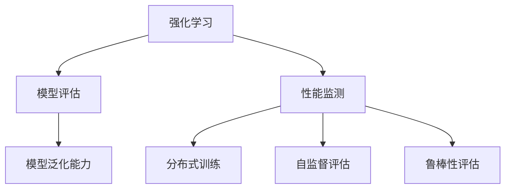
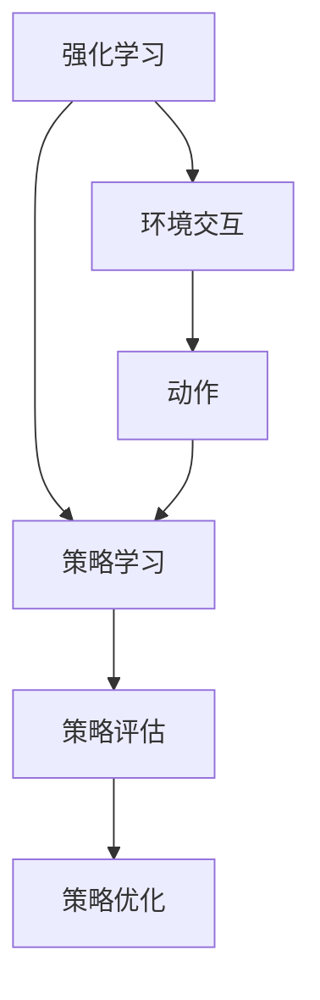
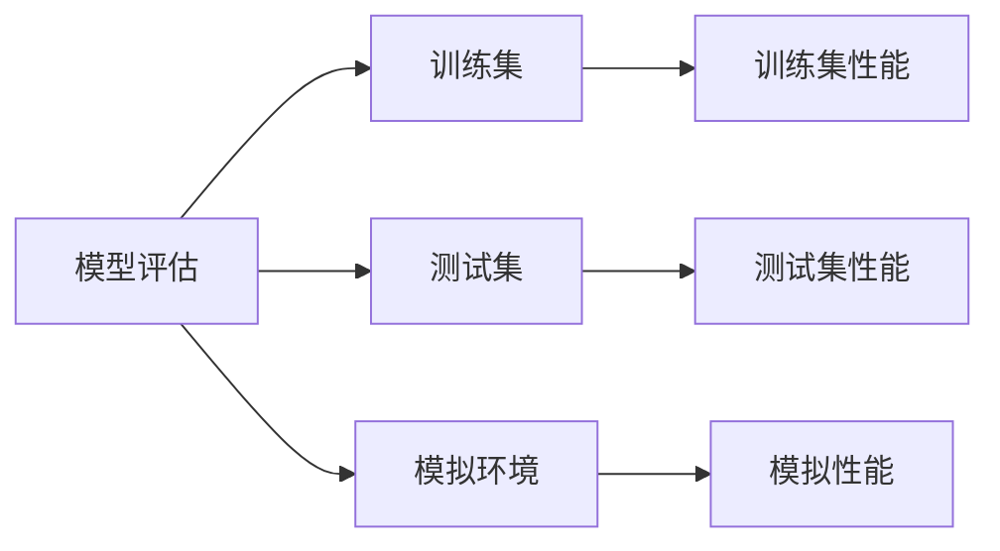
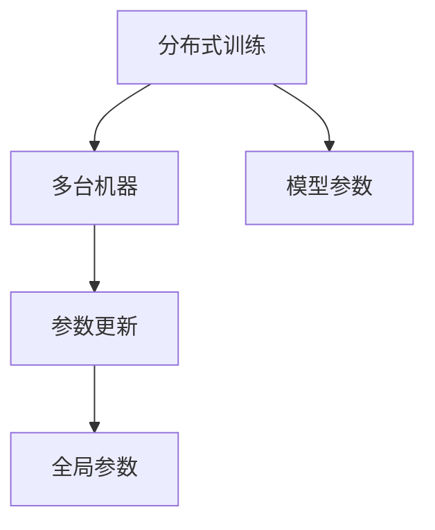
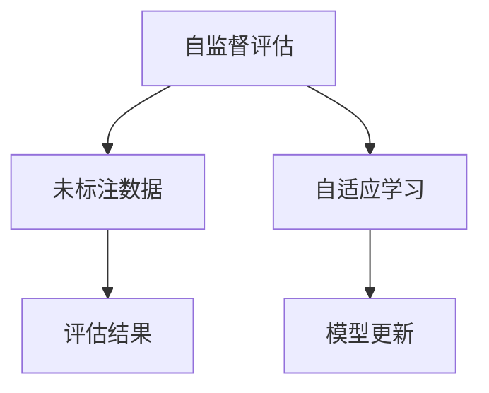
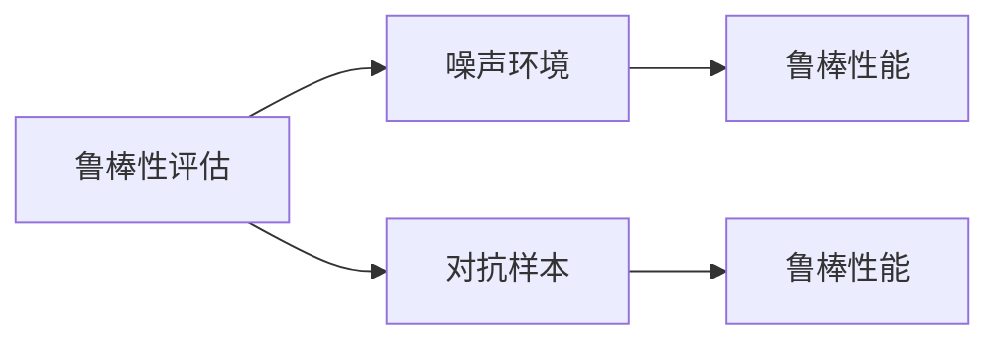
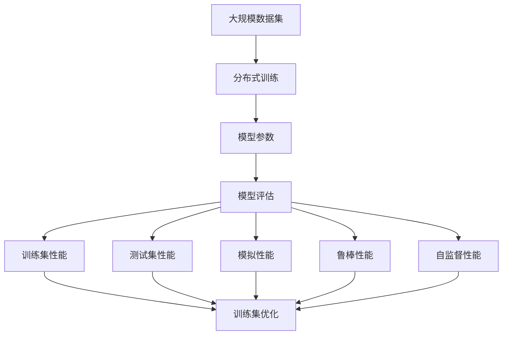

                 

# 强化学习Reinforcement Learning模型评估与性能监测技术

> 关键词：强化学习,模型评估,性能监测,深度学习,分布式训练

## 1. 背景介绍

### 1.1 问题由来
强化学习(Reinforcement Learning, RL)作为机器学习中的一个重要分支，近年来在自动控制、游戏智能、机器人学、自然语言处理(NLP)等领域取得了显著进展。强化学习通过代理与环境交互，逐步学习最优策略，从而实现自动决策和控制。然而，随着模型规模和复杂度的不断增加，强化学习的模型评估和性能监测变得越来越重要，成为了RL研究中的关键挑战。

### 1.2 问题核心关键点
模型评估和性能监测旨在通过各种手段对强化学习模型进行评估，以便了解模型在特定任务上的表现，识别模型缺陷，指导模型改进。它不仅涉及模型在训练集和测试集上的传统评价指标，还包括对模型在未见数据上的泛化能力、模型稳定性和鲁棒性的评估。

目前强化学习模型评估和性能监测的主流方法包括：

- 离线评估：使用模拟环境或实际数据集对模型进行评估，如通过奖励积分、平均回报等指标来衡量模型性能。
- 在线评估：将模型直接部署到实际环境中，实时监测模型的表现，动态调整模型参数。
- 分布式训练：使用多台机器并行训练，提升训练效率，同时评估训练过程中的模型性能变化。
- 自监督评估：通过引入未标注数据和自适应学习机制，提高模型在未知环境下的适应能力。
- 鲁棒性评估：评估模型在不同噪声、对抗样本等不良环境下的鲁棒性，确保模型可靠运行。

### 1.3 问题研究意义
研究强化学习模型评估和性能监测技术，对于确保模型的可靠性和安全性，优化模型训练过程，提升强化学习系统的实际应用效果，具有重要意义：

1. 保证模型质量：通过科学的评估方法和指标，确保模型在实际应用中的表现符合预期，避免因模型缺陷导致的错误决策。
2. 指导模型优化：评估结果可以提供有价值的反馈，指导模型参数调优，加速模型迭代改进。
3. 提高训练效率：在线评估和分布式训练可以提升训练速度，减少资源消耗，缩短模型训练周期。
4. 增强模型泛化能力：通过自监督评估和鲁棒性评估，提升模型在未知环境下的泛化能力，减少数据泄露和过拟合风险。
5. 保障系统安全：性能监测可以及时发现模型异常，防止模型在不良环境下失效，确保系统可靠运行。

## 2. 核心概念与联系

### 2.1 核心概念概述

为更好地理解强化学习模型评估和性能监测方法，本节将介绍几个密切相关的核心概念：

- 强化学习(Reinforcement Learning, RL)：通过代理与环境交互，学习最优策略，实现自动决策和控制的过程。
- 模型评估(Evaluation)：对模型在特定任务上的表现进行评估，以便了解模型效果和识别缺陷。
- 性能监测(Monitoring)：实时监测模型的表现，动态调整模型参数，提高模型的稳定性和可靠性。
- 分布式训练(Distributed Training)：使用多台机器并行训练，提升训练效率。
- 自监督评估(Self-supervised Evaluation)：通过未标注数据和自适应学习机制，提高模型泛化能力。
- 鲁棒性评估(Robustness Evaluation)：评估模型在不同噪声、对抗样本等不良环境下的鲁棒性。
- 模型泛化能力(Generalization)：模型在新数据集上的表现，反映模型的泛化能力。

这些核心概念之间的逻辑关系可以通过以下Mermaid流程图来展示：



这个流程图展示了大语言模型的核心概念及其之间的关系：

1. 强化学习通过代理与环境交互，学习最优策略。
2. 模型评估对模型的表现进行评估，识别缺陷。
3. 性能监测实时监测模型表现，动态调整参数。
4. 分布式训练提升训练效率。
5. 自监督评估提高模型泛化能力。
6. 鲁棒性评估增强模型鲁棒性。
7. 模型泛化能力反映模型在新数据上的表现。

这些概念共同构成了强化学习模型评估和性能监测的完整生态系统，使得强化学习系统能够在各种场景下发挥强大的决策和控制能力。通过理解这些核心概念，我们可以更好地把握强化学习系统的学习和应用框架。

### 2.2 概念间的关系

这些核心概念之间存在着紧密的联系，形成了强化学习模型评估和性能监测的完整生态系统。下面我们通过几个Mermaid流程图来展示这些概念之间的关系。

#### 2.2.1 强化学习学习范式



这个流程图展示了强化学习的学习范式：通过环境交互获取反馈，学习最优策略，通过策略评估和优化提升模型性能。

#### 2.2.2 模型评估与性能监测的关系



这个流程图展示了模型评估与性能监测的基本流程：使用训练集和测试集进行离线评估，使用模拟环境进行在线评估，通过这些评估结果优化模型。

#### 2.2.3 分布式训练方法



这个流程图展示了分布式训练的原理：通过多台机器并行训练，每个机器更新部分参数，最终得到全局最优参数。

#### 2.2.4 自监督评估方法



这个流程图展示了自监督评估的流程：利用未标注数据进行自适应学习，提升模型的泛化能力。

#### 2.2.5 鲁棒性评估方法



这个流程图展示了鲁棒性评估的流程：在噪声环境和对抗样本下评估模型性能，确保模型的鲁棒性。

### 2.3 核心概念的整体架构

最后，我们用一个综合的流程图来展示这些核心概念在大语言模型评估和性能监测过程中的整体架构：



这个综合流程图展示了从数据集到模型评估的全过程。强化学习模型首先在大规模数据集上进行分布式训练，然后通过模型评估获取训练集和测试集性能指标，同时进行鲁棒性评估和自监督评估，最终在训练集上进行优化。通过这些评估和优化，使得模型不断提升性能，更好地适应实际应用。

## 3. 核心算法原理 & 具体操作步骤
### 3.1 算法原理概述

强化学习模型评估和性能监测的原理是通过科学的方法和指标对模型进行评估，实时监测模型性能，确保模型在实际应用中的稳定性和可靠性。其核心思想是：

1. 离线评估：使用训练集和测试集对模型进行离线评估，计算各种性能指标，评估模型在特定任务上的表现。
2. 在线评估：将模型部署到实际环境中，实时监测模型的表现，动态调整模型参数。
3. 分布式训练：通过多台机器并行训练，提升训练效率，同时评估训练过程中的模型性能变化。
4. 自监督评估：通过引入未标注数据和自适应学习机制，提高模型在未知环境下的泛化能力。
5. 鲁棒性评估：评估模型在不同噪声、对抗样本等不良环境下的鲁棒性，确保模型可靠运行。

通过以上多种方法，可以全面地评估强化学习模型的性能，发现模型的优势和缺陷，指导模型改进和优化。

### 3.2 算法步骤详解

强化学习模型评估和性能监测的一般步骤如下：

**Step 1: 准备数据集**
- 收集训练集、测试集和模拟环境中的数据。训练集用于模型训练，测试集用于模型评估，模拟环境用于在线评估。
- 对数据进行预处理和标准化，确保数据质量。

**Step 2: 训练模型**
- 使用分布式训练技术，在多台机器上并行训练模型，提升训练效率。
- 动态调整学习率、批大小等训练参数，优化模型性能。

**Step 3: 离线评估**
- 使用训练集和测试集对模型进行离线评估，计算性能指标如平均回报、方差、信噪比等。
- 分析评估结果，识别模型缺陷，进行参数调整和优化。

**Step 4: 在线评估**
- 将模型部署到实际环境中，实时监测模型表现，记录各种性能指标。
- 动态调整模型参数，优化模型性能，确保模型在实际应用中的稳定性和可靠性。

**Step 5: 自监督评估**
- 收集未标注数据，通过自适应学习机制，提升模型在未知环境下的泛化能力。
- 使用自监督评估结果，优化模型参数，提升模型泛化性能。

**Step 6: 鲁棒性评估**
- 生成噪声环境和对抗样本，评估模型在不同不良环境下的鲁棒性。
- 根据评估结果，优化模型鲁棒性，提高模型抗干扰能力。

**Step 7: 反馈与优化**
- 结合离线评估、在线评估、自监督评估和鲁棒性评估的结果，进行综合分析。
- 调整模型参数，优化模型性能，确保模型在实际应用中的稳定性和可靠性。

以上是强化学习模型评估和性能监测的一般流程。在实际应用中，还需要针对具体任务的特点，对评估过程的各个环节进行优化设计，如改进评估目标函数，引入更多的正则化技术，搜索最优的超参数组合等，以进一步提升模型性能。

### 3.3 算法优缺点

强化学习模型评估和性能监测方法具有以下优点：
1. 全面评估：通过多种评估方法，从离线评估到在线评估，全面评估模型的性能，确保模型可靠运行。
2. 动态优化：实时监测模型表现，动态调整模型参数，提升模型性能。
3. 提高泛化能力：通过自监督评估，提升模型在未知环境下的泛化能力。
4. 增强鲁棒性：通过鲁棒性评估，增强模型在不同环境下的鲁棒性。

同时，该方法也存在一定的局限性：
1. 数据依赖：离线评估和自监督评估需要大量数据支持，获取数据成本较高。
2. 模型复杂性：强化学习模型复杂度高，评估和优化难度大。
3. 实时性要求：在线评估需要实时监测模型表现，对系统要求高。
4. 参数调整：模型评估和优化过程中，参数调整工作量大，需要专业知识支持。

尽管存在这些局限性，但就目前而言，强化学习模型评估和性能监测方法仍然是最主流和有效的评估手段。未来相关研究的重点在于如何进一步降低评估对数据的依赖，提高模型少样本学习和跨领域迁移能力，同时兼顾可解释性和伦理安全性等因素。

### 3.4 算法应用领域

强化学习模型评估和性能监测在多个领域中得到广泛应用，包括但不限于：

- 自动控制：通过对自动控制系统的强化学习模型进行评估和优化，提升系统的稳定性和可靠性。
- 游戏智能：评估游戏智能算法在模拟环境中的表现，指导算法改进。
- 机器人学：通过强化学习模型评估和性能监测，确保机器人行为安全稳定。
- 自然语言处理：对NLP模型的性能进行全面评估，确保模型在实际应用中的表现符合预期。
- 金融预测：评估金融预测模型的鲁棒性，确保模型在市场变化中的稳定运行。
- 推荐系统：通过强化学习模型评估和性能监测，优化推荐算法，提升推荐效果。

除了上述这些经典应用外，强化学习模型评估和性能监测也被创新性地应用到更多场景中，如智能交通管理、智能制造、智慧农业等，为各行各业带来了新的技术突破。随着强化学习模型的不断进步，相信其在更多领域的应用将更加广泛。

## 4. 数学模型和公式 & 详细讲解  
### 4.1 数学模型构建

本节将使用数学语言对强化学习模型评估和性能监测的数学模型进行详细阐述。

设强化学习模型为$f_{\theta}$，其中$\theta$为模型参数。给定训练集$D=\{(x_i,y_i)\}_{i=1}^N$，其中$x_i$为输入，$y_i$为对应的输出标签。训练过程的目标是最小化模型损失函数$\mathcal{L}(\theta)$。

强化学习模型的评估指标包括：

- 平均回报(Average Reward)：模型在训练集上的平均回报，即$\frac{1}{N}\sum_{i=1}^N R(x_i)$，其中$R(x_i)$为模型在输入$x_i$上的回报。
- 方差(Variance)：模型在训练集上的输出方差，即$\frac{1}{N}\sum_{i=1}^N (\hat{y}_i-y_i)^2$，其中$\hat{y}_i$为模型在输入$x_i$上的输出。
- 信噪比(Signal-to-Noise Ratio, SNR)：模型输出的信噪比，即$\frac{E[\hat{y}_i]}{\sigma^2}$，其中$E[\hat{y}_i]$为模型输出的期望值，$\sigma^2$为模型输出的方差。

这些指标可以通过模型训练和评估过程计算得到。

### 4.2 公式推导过程

以平均回报为例，其推导如下：

设模型$f_{\theta}$在训练集$D$上的平均回报为$R_{avg}$，则有：

$$
R_{avg} = \frac{1}{N}\sum_{i=1}^N R(x_i) = \frac{1}{N}\sum_{i=1}^N \mathbb{E}[f_{\theta}(x_i)]
$$

其中$\mathbb{E}[f_{\theta}(x_i)]$表示模型$f_{\theta}$在输入$x_i$上的期望输出。

进一步，对于$f_{\theta}$在训练集$D$上的平均回报$R_{avg}$，可以表示为：

$$
R_{avg} = \frac{1}{N}\sum_{i=1}^N \mathbb{E}[f_{\theta}(x_i)]
$$

根据模型期望输出的定义，有：

$$
\mathbb{E}[f_{\theta}(x_i)] = \sum_{y \in \mathcal{Y}} y P(y|x_i,f_{\theta})
$$

其中$\mathcal{Y}$为模型输出空间的标签集合，$P(y|x_i,f_{\theta})$表示模型在输入$x_i$下输出标签$y$的概率。

将上式代入平均回报公式，得：

$$
R_{avg} = \frac{1}{N}\sum_{i=1}^N \sum_{y \in \mathcal{Y}} y P(y|x_i,f_{\theta})
$$

由此可以看出，平均回报的计算依赖于模型在训练集上的输出概率分布。

### 4.3 案例分析与讲解

下面以一个简单的强化学习案例为例，展示模型评估和性能监测的具体应用。

假设我们要训练一个推荐系统的强化学习模型，用于为用户推荐电影。我们收集了用户的历史观影数据$D=\{(x_i,y_i)\}_{i=1}^N$，其中$x_i$为用户ID和历史观影记录，$y_i$为用户推荐的电影ID。我们的目标是最大化平均回报$R_{avg}$。

在训练过程中，我们首先使用分布式训练技术，在多台机器上并行训练模型，得到模型参数$\theta$。然后，我们使用训练集对模型进行离线评估，计算平均回报、方差、信噪比等指标。

具体来说，我们使用$D$中的一部分数据作为测试集，计算模型在测试集上的平均回报$R_{test}$和方差$\sigma^2$。然后，将测试集中的数据作为噪声输入，生成对抗样本，评估模型在对抗样本下的鲁棒性。

最后，根据离线评估、在线评估和鲁棒性评估的结果，我们调整模型参数，优化模型性能，确保模型在实际应用中的稳定性和可靠性。

## 5. 项目实践：代码实例和详细解释说明
### 5.1 开发环境搭建

在进行模型评估和性能监测实践前，我们需要准备好开发环境。以下是使用Python进行PyTorch开发的环境配置流程：

1. 安装Anaconda：从官网下载并安装Anaconda，用于创建独立的Python环境。

2. 创建并激活虚拟环境：
```bash
conda create -n pytorch-env python=3.8 
conda activate pytorch-env
```

3. 安装PyTorch：根据CUDA版本，从官网获取对应的安装命令。例如：
```bash
conda install pytorch torchvision torchaudio cudatoolkit=11.1 -c pytorch -c conda-forge
```

4. 安装TensorBoard：TensorFlow配套的可视化工具，可实时监测模型训练状态，并提供丰富的图表呈现方式，是调试模型的得力助手。

5. 安装PyTorch-lightning：一个基于PyTorch的深度学习框架，提供丰富的训练和评估功能，方便开发者进行模型训练和性能监测。

完成上述步骤后，即可在`pytorch-env`环境中开始模型评估和性能监测实践。

### 5.2 源代码详细实现

下面以一个简单的强化学习案例为例，展示如何使用PyTorch和TensorBoard对模型进行评估和性能监测。

首先，定义模型和优化器：

```python
import torch
from torch import nn
from torch.optim import Adam

class MyModel(nn.Module):
    def __init__(self, input_size, output_size):
        super(MyModel, self).__init__()
        self.linear1 = nn.Linear(input_size, 64)
        self.linear2 = nn.Linear(64, output_size)

    def forward(self, x):
        x = self.linear1(x)
        x = torch.relu(x)
        x = self.linear2(x)
        return x

model = MyModel(input_size=10, output_size=1)
optimizer = Adam(model.parameters(), lr=0.01)
```

然后，定义训练和评估函数：

```python
import torch
import numpy as np

def train_epoch(model, data_loader, optimizer):
    model.train()
    losses = []
    for batch in data_loader:
        inputs, targets = batch
        optimizer.zero_grad()
        outputs = model(inputs)
        loss = nn.MSELoss()(outputs, targets)
        loss.backward()
        optimizer.step()
        losses.append(loss.item())
    return np.mean(losses)

def evaluate(model, data_loader):
    model.eval()
    losses = []
    for batch in data_loader:
        inputs, targets = batch
        outputs = model(inputs)
        loss = nn.MSELoss()(outputs, targets)
        losses.append(loss.item())
    return np.mean(losses)
```

接着，使用TensorBoard进行训练和评估：

```python
from torch.utils.tensorboard import SummaryWriter

writer = SummaryWriter(log_dir='logs')
for epoch in range(num_epochs):
    loss = train_epoch(model, train_loader, optimizer)
    writer.add_scalar('loss', loss, epoch)
    writer.add_scalar('train_loss', loss, epoch)
    eval_loss = evaluate(model, eval_loader)
    writer.add_scalar('eval_loss', eval_loss, epoch)
```

最后，使用TensorBoard查看训练过程中的指标变化：

```python
# 启动TensorBoard查看训练指标
writer.close()
```

以上就是使用PyTorch和TensorBoard对模型进行评估和性能监测的完整代码实现。可以看到，借助TensorBoard的强大可视化功能，开发者可以轻松查看训练过程中的各种指标变化，及时发现模型异常，进行参数调整和优化。

### 5.3 代码解读与分析

让我们再详细解读一下关键代码的实现细节：

**MyModel类**：
- `__init__`方法：定义模型的结构，包括输入层、隐藏层和输出层。
- `forward`方法：实现模型的前向传播。

**train_epoch和evaluate函数**：
- `train_epoch`函数：在训练集上计算模型的损失，并更新模型参数。
- `evaluate`函数：在测试集上计算模型的损失，用于评估模型性能。

**SummaryWriter类**：
- `add_scalar`方法：将标量数据添加到TensorBoard的日志中。

**启动TensorBoard**：
- 使用`writer.close()`方法关闭TensorBoard。

通过以上代码，我们可以全面了解模型评估和性能监测的基本流程，包括模型的定义、训练、评估和可视化。借助PyTorch和TensorBoard，开发者可以轻松地进行模型评估和优化，确保模型的可靠性和性能。

## 6. 实际应用场景
### 6.1 强化学习在游戏智能中的应用

强化学习在游戏智能中得到了广泛应用。通过评估和监测强化学习算法在模拟环境中的表现，可以指导算法改进，提升游戏智能水平。

例如，在Atari游戏环境中，我们可以使用强化学习算法训练智能体，进行游戏操作。通过离线评估，计算模型在训练集上的平均回报和方差，了解模型的表现。然后，在模拟环境中进行在线评估，实时监测模型表现，动态调整参数。最后，通过自监督评估和鲁棒性评估，提升模型的泛化能力和鲁棒性，确保模型在实际游戏中的稳定运行。

### 6.2 强化学习在机器人学中的应用

强化学习在机器人学中也有着广泛的应用。通过评估和监测强化学习算法在机器人控制中的表现，可以优化机器人行为，提升机器人稳定性。

例如，在机器人行走任务中，我们可以使用强化学习算法训练机器人，进行路径规划和避障。通过离线评估，计算模型在训练集上的平均回报和方差，了解模型的表现。然后，在实际环境中进行在线评估，实时监测模型表现，动态调整参数。最后，通过自监督评估和鲁棒性评估，提升模型的泛化能力和鲁棒性，确保机器人行为在实际环境中的稳定性和安全性。

### 6.3 强化学习在推荐系统中的应用

强化学习在推荐系统中也有着广泛的应用。通过评估和监测推荐算法的表现，可以优化推荐效果，提升用户体验。

例如，在电商平台中，我们可以使用强化学习算法训练推荐模型，进行商品推荐。通过离线评估，计算模型在训练集上的平均回报和方差，了解模型的表现。然后，在实际环境中进行在线评估，实时监测模型表现，动态调整参数。最后，通过自监督评估和鲁棒性评估，提升模型的泛化能力和鲁棒性，确保推荐算法在实际应用中的稳定性和可靠性。

### 6.4 未来应用展望

随着强化学习模型的不断发展，其在更多领域的应用将更加广泛。

在智慧城市治理中，强化学习模型可以用于交通管理、能源优化等任务。通过评估和监测强化学习算法在实际环境中的表现，可以优化城市管理，提升城市智能化水平。

在智慧医疗中，强化学习模型可以用于疾病预测、治疗方案优化等任务。通过评估和监测强化学习算法在模拟环境中的表现，可以优化医疗决策，提升医疗服务质量。

在智能制造中，强化学习模型可以用于生产调度、设备维护等任务。通过评估和监测强化学习算法在实际环境中的表现，可以优化生产流程，提升生产效率。

总之，强化学习模型评估和性能监测技术将在更多领域得到应用，为各行各业带来新的技术突破。

## 7. 工具和资源推荐
### 7.1 学习资源推荐

为了帮助开发者系统掌握强化学习模型评估和性能监测的理论基础和实践技巧，这里推荐一些优质的学习资源：

1. 《Reinforcement Learning: An Introduction》书籍：由Sutton和Barto所著，深入浅出地介绍了强化学习的理论和应用，适合初学者和进阶者阅读。

2. DeepMind Open Source的强化学习论文合集：包含DeepMind在强化学习领域的研究论文，涵盖了多种算法和应用场景，是了解前沿技术的绝佳资源。

3. OpenAI Gym：一个开源的强化学习环境库，包含多种模拟环境，方便开发者进行算法测试和实验。

4. TensorFlow Agents：一个基于TensorFlow的强化学习框架，提供多种算法和评估工具，方便开发者进行模型训练和评估。

5. PyTorch Lightning：一个基于PyTorch的深度学习框架，提供丰富的训练和评估功能，方便开发者进行模型训练和性能监测。

通过对这些资源的学习实践，相信你一定能够快速掌握强化学习模型评估和性能监测的精髓，并用于解决实际的强化学习问题。

### 7.2 开发工具

