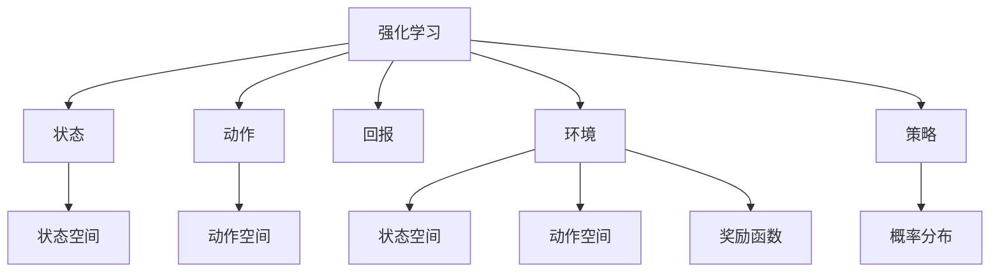
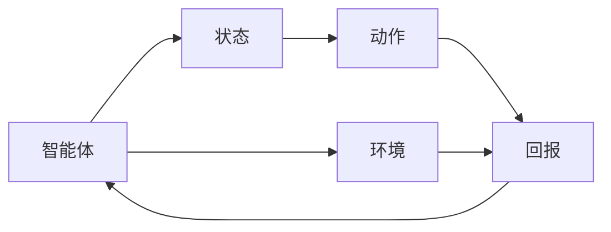
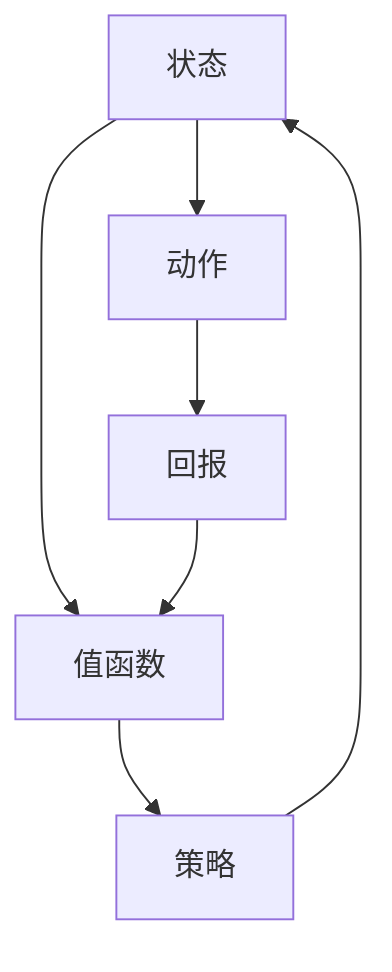
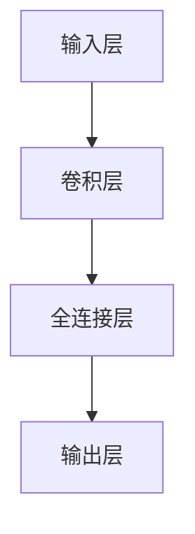
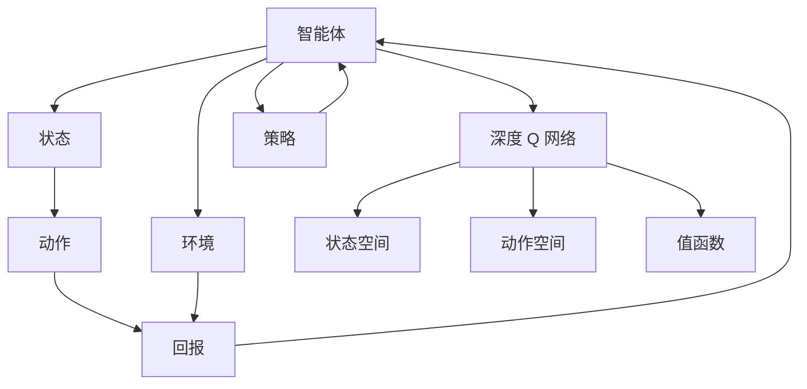

                 

# 强化学习算法：深度 Q 网络 (DQN) 原理与代码实例讲解

> 关键词：深度 Q 网络,强化学习,卷积神经网络,深度强化学习,代码实例,矩阵求幂,多线程

## 1. 背景介绍

### 1.1 问题由来
强化学习 (Reinforcement Learning, RL) 是机器学习的一个分支，它通过智能体在环境中与环境交互，不断学习决策策略，以最大化累积回报 (Cumulative Reward)。强化学习的核心思想是：智能体根据环境反馈，通过不断尝试与优化，学习到最优决策策略。在实际应用中，强化学习已经被广泛应用于游戏、机器人控制、自动驾驶、自然语言处理等多个领域。

其中，深度 Q 网络 (Deep Q-Network, DQN) 是一种将深度神经网络 (Deep Neural Network, DNN) 引入强化学习中的经典方法，它通过将 Q 值函数的计算由传统的表格查询变为深度神经网络进行估计，大幅提升了强化学习的性能和泛化能力。DQN 方法由 DeepMind 团队于 2013 年在游戏《Atari 2600》上提出，并取得了显著的成功。

### 1.2 问题核心关键点
DQN 算法的核心在于如何将强化学习任务转化为深度学习问题，并使用深度神经网络进行 Q 值函数的近似估计。其主要步骤如下：
1. 数据采集：智能体与环境交互，收集状态、动作、回报等数据。
2. 网络构建：构建深度神经网络模型，用于估计 Q 值函数。
3. 经验回放：将收集的数据存储到经验回放缓冲区，供神经网络训练使用。
4. 神经网络训练：通过经验回放缓冲区的数据，优化神经网络参数，更新 Q 值函数。
5. 智能体策略：根据 Q 值函数，智能体选择合适的动作进行环境交互。

### 1.3 问题研究意义
DQN 算法作为深度强化学习的经典方法，具有以下显著意义：
1. 解决了深度神经网络在强化学习中的应用问题。通过深度神经网络逼近 Q 值函数，实现了对复杂非线性环境的有效建模和优化。
2. 提高了强化学习的泛化能力。DQN 方法可以在多种复杂环境中学习到高效决策策略，并在新环境中快速适应。
3. 推动了深度学习与强化学习的结合。DQN 方法的提出，将深度学习与强化学习的优势相结合，提升了整个领域的研发水平。
4. 促进了强化学习的应用落地。DQN 方法为智能体与环境交互、决策策略优化提供了有效的算法框架，加速了强化学习技术的工程化应用。
5. 催生了更多的深度强化学习算法。DQN 方法的提出，激发了后续深度强化学习算法的研究，如 Twin DQN、Double DQN、A3C 等。

## 2. 核心概念与联系

### 2.1 核心概念概述

为更好地理解 DQN 算法，本节将介绍几个密切相关的核心概念：

- 强化学习 (Reinforcement Learning)：智能体在环境中通过与环境交互，学习最优决策策略，以最大化累积回报的方法。
- 状态 (State)：智能体在某个时刻所处的环境状态。状态描述了当前环境的状态特征，可以是状态向量或状态集合。
- 动作 (Action)：智能体在当前状态下所采取的行动。动作是智能体对环境进行交互的具体方式。
- 回报 (Reward)：智能体在执行动作后，环境给予的反馈值。回报是对智能体当前行为的质量评价。
- 环境 (Environment)：智能体执行动作后，接收到的环境反馈。环境通常由状态空间、动作空间、奖励函数等组成。
- 策略 (Policy)：智能体在每个状态下选择动作的概率分布。策略是智能体的决策函数。
- 值函数 (Value Function)：衡量智能体在某个状态下执行某个动作后的累积回报的函数。值函数是策略评估的基础。

这些核心概念之间的关系可以通过以下 Mermaid 流程图来展示：



### 2.2 概念间的关系

这些核心概念之间存在着紧密的联系，形成了强化学习的完整生态系统。下面我们通过几个 Mermaid 流程图来展示这些概念之间的关系。

#### 2.2.1 强化学习的流程



这个流程图展示了强化学习的核心流程：智能体在环境中通过动作与环境交互，接收环境反馈（回报），然后根据当前的策略（概率分布）选择下一个动作。

#### 2.2.2 值函数的构建



这个流程图展示了值函数的构建过程：值函数通过当前状态和动作计算累积回报，从而评估当前策略的好坏。值函数是智能体选择动作的基础。

#### 2.2.3 深度 Q 网络的结构



这个流程图展示了深度 Q 网络的结构：输入层接收状态表示，通过卷积层和全连接层进行特征提取和计算，最终输出 Q 值。

### 2.3 核心概念的整体架构

最后，我们用一个综合的流程图来展示这些核心概念在 DQN 算法中的整体架构：



这个综合流程图展示了 DQN 算法中各个核心概念的相互作用，以及它们如何协同工作，完成智能体的决策过程。

## 3. 核心算法原理 & 具体操作步骤
### 3.1 算法原理概述

DQN 算法是一种将深度神经网络引入强化学习的经典方法。其核心思想是将 Q 值函数的计算由传统的表格查询变为深度神经网络进行估计。Q 值函数 $Q(s, a)$ 表示在状态 $s$ 下采取动作 $a$ 后的累积回报，即：

$$
Q(s, a) = r + \gamma \max_a Q(s', a')
$$

其中 $r$ 是当前回报，$\gamma$ 是回报折扣因子，$s'$ 和 $a'$ 分别是下一个状态和动作。

DQN 算法通过神经网络逼近 Q 值函数，使用经验回放技术，优化神经网络参数，更新 Q 值函数。具体步骤如下：

1. 数据采集：智能体与环境交互，收集状态、动作、回报等数据。
2. 神经网络构建：构建深度神经网络模型，用于估计 Q 值函数。
3. 经验回放：将收集的数据存储到经验回放缓冲区，供神经网络训练使用。
4. 神经网络训练：通过经验回放缓冲区的数据，优化神经网络参数，更新 Q 值函数。
5. 智能体策略：根据 Q 值函数，智能体选择合适的动作进行环境交互。

### 3.2 算法步骤详解

**Step 1: 准备环境与智能体**

在开始实验前，需要准备一个环境和一个智能体。可以使用 Python 的 gym 库，构建模拟环境，并定义智能体的行为策略。

```python
import gym

env = gym.make('CartPole-v0')
state_dim = env.observation_space.shape[0]
action_dim = env.action_space.n
```

这里构建了一个简单的悬臂杆平衡环境，智能体需要控制吊杆保持平衡，防止倾倒。

**Step 2: 初始化 Q 网络**

构建深度 Q 网络模型，用于估计 Q 值函数。可以选用卷积神经网络 (Convolutional Neural Network, CNN) 或全连接神经网络 (Fully Connected Neural Network, FCN)，根据具体问题选择合适的架构。

```python
import torch.nn as nn
import torch.optim as optim
import torch.nn.functional as F

class DQN(nn.Module):
    def __init__(self, state_dim, action_dim, hidden_dim):
        super(DQN, self).__init__()
        self.fc1 = nn.Linear(state_dim, hidden_dim)
        self.fc2 = nn.Linear(hidden_dim, hidden_dim)
        self.fc3 = nn.Linear(hidden_dim, action_dim)
        
    def forward(self, x):
        x = F.relu(self.fc1(x))
        x = F.relu(self.fc2(x))
        return self.fc3(x)
        
state_dim = env.observation_space.shape[0]
action_dim = env.action_space.n
hidden_dim = 64
model = DQN(state_dim, action_dim, hidden_dim)
optimizer = optim.Adam(model.parameters(), lr=0.001)
```

这里构建了一个简单的深度神经网络，包含两个全连接层，输出 Q 值。

**Step 3: 经验回放缓冲区**

为了使神经网络训练更加稳定，DQN 算法引入了经验回放缓冲区 (Experience Replay Buffer)，将收集的数据存储到缓冲区中，供神经网络训练使用。

```python
import collections

class ReplayBuffer:
    def __init__(self, capacity):
        self.capacity = capacity
        self.buffer = collections.deque(maxlen=capacity)
        self.ptr = 0
        
    def add(self, state, action, reward, next_state, done):
        experience = (state, action, reward, next_state, done)
        self.buffer.append(experience)
        self.ptr = (self.ptr + 1) % self.capacity
        
    def sample(self, batch_size):
        idx = np.random.randint(0, len(self.buffer), batch_size)
        return [self.buffer[idx] for idx in idx]
```

这里定义了一个基于双端队列的经验回放缓冲区，用于存储和随机抽取数据。

**Step 4: 神经网络训练**

在每次智能体与环境交互后，将收集的数据存储到经验回放缓冲区中。然后，从缓冲区中随机抽取批量数据，更新神经网络参数。

```python
def update_model(model, target_model, optimizer, replay_buffer, batch_size):
    for i in range(100):
        batch = replay_buffer.sample(batch_size)
        state_batch = torch.from_numpy(np.vstack([exp[0] for exp in batch]))
        action_batch = torch.from_numpy(np.vstack([exp[1] for exp in batch]))
        reward_batch = torch.from_numpy(np.vstack([exp[2] for exp in batch]))
        next_state_batch = torch.from_numpy(np.vstack([exp[3] for exp in batch]))
        done_batch = torch.from_numpy(np.vstack([exp[4] for exp in batch]))
        
        Q_pred = model(state_batch)
        max_Q_next = target_model(next_state_batch).detach().max(1)[0].unsqueeze(1)
        target_Q = reward_batch + (1 - done_batch) * gamma * max_Q_next
        loss = F.smooth_l1_loss(Q_pred, target_Q)
        optimizer.zero_grad()
        loss.backward()
        optimizer.step()
```

这里定义了一个训练函数，使用 Adam 优化器更新神经网络参数。每次训练时，从缓冲区中随机抽取批量数据，计算预测 Q 值和目标 Q 值，并使用均方损失函数进行优化。

**Step 5: 智能体策略**

在训练过程中，智能体根据当前状态和 Q 值函数，选择合适的动作进行环境交互。具体实现如下：

```python
def select_action(state, model, epsilon):
    if np.random.rand() < epsilon:
        return env.action_space.sample()
    else:
        with torch.no_grad():
            Q = model(torch.from_numpy(state[np.newaxis, :])).detach().cpu().numpy()
        return np.argmax(Q[0])
```

这里定义了一个动作选择函数，根据当前状态和 Q 值函数，选择动作。当随机数小于阈值 $\epsilon$ 时，随机选择动作；否则，选择 Q 值最大的动作。

**Step 6: 训练流程**

将以上步骤组合成一个完整的训练流程，进行模拟实验。

```python
batch_size = 64
epsilon = 0.1
gamma = 0.9
replay_buffer_capacity = 10000
replay_buffer = ReplayBuffer(replay_buffer_capacity)
global_step = 0
total_reward = 0

for episode in range(num_episodes):
    state = env.reset()
    done = False
    while not done:
        global_step += 1
        Q = model(torch.from_numpy(state[np.newaxis, :])).detach().cpu().numpy()
        action = select_action(state, model, epsilon)
        next_state, reward, done, _ = env.step(action)
        replay_buffer.add(state, action, reward, next_state, done)
        
        if global_step % 100 == 0:
            update_model(model, target_model, optimizer, replay_buffer, batch_size)
            total_reward += reward
            
    print('Episode {}: Total reward {}'.format(episode, total_reward))
```

这里定义了一个训练函数，模拟智能体在环境中的交互过程，并在每 100 步时进行一次神经网络更新。最终输出每集的累积回报。

### 3.3 算法优缺点

DQN 算法具有以下优点：
1. 适用于复杂环境：DQN 算法能够处理高维、非线性的状态空间，适应多种复杂环境。
2. 高效探索：DQN 算法在训练初期使用 $\epsilon$-greedy 策略进行探索，能够在状态空间中快速找到可行动作，加速学习过程。
3. 稳定性好：DQN 算法通过经验回放技术，减少了神经网络训练中的数据偏差，提高了模型的稳定性和泛化能力。
4. 计算效率高：DQN 算法使用了小批量随机梯度下降，避免了全量更新的计算开销，提高了训练效率。

同时，DQN 算法也存在一些局限性：
1. 内存占用大：DQN 算法需要存储大量的经验数据，占用了较大的内存空间。
2. 计算资源消耗高：DQN 算法需要进行大量的矩阵求幂运算，计算资源消耗较大。
3. 需要大量数据：DQN 算法在训练初期需要大量的经验数据，才能保证模型稳定收敛。
4. 无法处理连续动作空间：DQN 算法适用于离散动作空间，处理连续动作空间时需要进行离散化处理。

尽管存在这些局限性，但 DQN 算法仍然是强化学习领域的重要方法之一，具有广泛的应用前景。

### 3.4 算法应用领域

DQN 算法在多个领域中得到了广泛应用，主要包括以下几个方面：

1. 游戏：DQN 算法在《Atari 2600》等游戏中取得了显著的成果，展示了其强大的决策能力。
2. 机器人控制：DQN 算法在机器人控制、飞行器导航等任务中，实现了对复杂环境的适应和优化。
3. 自动驾驶：DQN 算法在自动驾驶领域中，用于决策路径规划和避障控制，提高了驾驶安全性。
4. 金融交易：DQN 算法在金融交易领域中，用于量化交易策略优化，提高了投资回报率。
5. 自然语言处理：DQN 算法在自然语言处理任务中，用于文本生成、情感分析等，提升了语言的理解和生成能力。

## 4. 数学模型和公式 & 详细讲解
### 4.1 数学模型构建

DQN 算法使用深度神经网络逼近 Q 值函数，通过最小化预测 Q 值与目标 Q 值之间的差距，优化神经网络参数。其数学模型如下：

定义状态空间 $S$、动作空间 $A$ 和 Q 值函数 $Q(s, a)$，其中 $s \in S, a \in A$。神经网络模型的输入为状态 $s$，输出为 Q 值 $Q(s, a)$。

$$
Q(s, a) = \theta^T \phi(s)
$$

其中 $\theta$ 为神经网络模型参数，$\phi(s)$ 为状态 $s$ 的特征表示。

### 4.2 公式推导过程

在 DQN 算法中，神经网络模型的训练过程可以看作是求解如下优化问题：

$$
\min_{\theta} \mathbb{E}_{(s, a, r, s') \sim D} [\ell(Q_\theta(s, a), Q_{\theta^-}(s', a'))]
$$

其中 $D$ 为经验回放缓冲区中的数据分布，$\ell$ 为损失函数，$Q_\theta(s, a)$ 为当前神经网络模型的 Q 值，$Q_{\theta^-}(s', a')$ 为目标神经网络模型的 Q 值。

使用均方误差作为损失函数，定义如下：

$$
\ell(Q_\theta(s, a), Q_{\theta^-}(s', a')) = \frac{1}{2} \|Q_\theta(s, a) - Q_{\theta^-}(s', a')\|^2
$$

通过反向传播算法，计算神经网络模型参数的梯度，更新模型参数：

$$
\theta \leftarrow \theta - \eta \nabla_\theta \ell(Q_\theta(s, a), Q_{\theta^-}(s', a'))
$$

其中 $\eta$ 为学习率。

### 4.3 案例分析与讲解

以悬臂杆平衡环境为例，分析 DQN 算法的训练过程。假设智能体的状态空间为 $[0, 1]^4$，动作空间为 $[0, 1]$，智能体的目标是控制吊杆平衡，防止倾倒。

智能体在每次执行动作后，接收环境反馈，包括状态和回报。智能体的决策过程如下：
1. 初始化智能体状态 $s_0$，随机选择动作 $a_0$。
2. 执行动作 $a_0$，接收环境反馈 $s_1, r_1$，判断是否到达终止状态 $s_T$。
3. 根据智能体的当前状态 $s_1$ 和动作 $a_1$，计算 Q 值 $Q(s_1, a_1)$，选择合适的动作 $a_1$。
4. 重复步骤 2-3，直到到达终止状态 $s_T$。

在 DQN 算法中，智能体的动作选择过程如下：
1. 输入当前状态 $s_t$，神经网络模型计算 Q 值 $Q(s_t, a_t)$。
2. 使用 $\epsilon$-greedy 策略选择动作 $a_t$，如果随机数小于 $\epsilon$，则随机选择动作；否则选择 Q 值最大的动作。
3. 执行动作 $a_t$，接收环境反馈 $s_{t+1}, r_{t+1}$，判断是否到达终止状态 $s_T$。
4. 将当前状态、动作、回报和下一个状态存储到经验回放缓冲区中，供神经网络训练使用。

## 5. 项目实践：代码实例和详细解释说明
### 5.1 开发环境搭建

在进行 DQN 实践前，我们需要准备好开发环境。以下是使用 Python 进行 TensorFlow 开发的环境配置流程：

1. 安装 Anaconda：从官网下载并安装 Anaconda，用于创建独立的 Python 环境。

2. 创建并激活虚拟环境：
```bash
conda create -n tf-env python=3.8 
conda activate tf-env
```

3. 安装 TensorFlow：从官网获取对应的安装命令。例如：
```bash
conda install tensorflow -c conda-forge -c pytorch -c pypi
```

4. 安装各类工具包：
```bash
pip install numpy pandas scikit-learn matplotlib tqdm jupyter notebook ipython
```

完成上述步骤后，即可在 `tf-env` 环境中开始 DQN 实践。

### 5.2 源代码详细实现

这里我们以悬臂杆平衡环境为例，给出使用 TensorFlow 实现 DQN 的代码实现。

首先，定义悬臂杆平衡环境的奖励函数和状态表示：

```python
import numpy as np

def reward(env):
    if env.state[0] <= -1.2:
        return -1
    elif env.state[0] >= 1.2:
        return -1
    else:
        return 0

def observation(env):
    return env.state
```

这里定义了悬臂杆平衡环境的奖励函数和状态表示函数，用于计算环境回报和状态表示。

然后，构建深度神经网络模型，用于估计 Q 值函数：

```python
import tensorflow as tf

class DQN:
    def __init__(self, state_dim, action_dim, hidden_dim):
        self.state_dim = state_dim
        self.action_dim = action_dim
        self.hidden_dim = hidden_dim
        
        self.input = tf.keras.layers.Input(shape=(self.state_dim,))
        self.hidden1 = tf.keras.layers.Dense(self.hidden_dim, activation='relu')(self.input)
        self.hidden2 = tf.keras.layers.Dense(self.hidden_dim, activation='relu')(self.hidden1)
        self.output = tf.keras.layers.Dense(self.action_dim)(self.hidden2)
        
        self.model = tf.keras.models.Model(self.input, self.output)
        self.target_model = tf.keras.models.Model(self.input, self.output)
        self.optimizer = tf.keras.optimizers.Adam(learning_rate=0.001)
        
        self.target_model.set_weights(self.model.get_weights())
        self.update_target_model()
        
    def update_target_model(self):
        self.target_model.set_weights(self.model.get_weights())
    
    def select_action(self, state, epsilon):
        if np.random.rand() < epsilon:
            return np.random.randint(self.action_dim)
        else:
            state = np.array(state[np.newaxis, :])
            Q = self.model.predict(state)
            return np.argmax(Q[0])
        
    def update_model(self, replay_buffer, batch_size):
        state_batch, action_batch, reward_batch, next_state_batch, done_batch = replay_buffer.sample(batch_size)
        
        with tf.GradientTape() as tape:
            Q_pred = self.model(tf.constant(state_batch))
            Q_next = self.target_model(tf.constant(next_state_batch))
            Q_target = reward_batch + (1 - done_batch) * gamma * tf.reduce_max(Q_next, axis=1)
            loss = tf.reduce_mean(tf.square(Q_pred - Q_target))
        
        gradients = tape.gradient(loss, self.model.trainable_variables)
        self.optimizer.apply_gradients(zip(gradients, self.model.trainable_variables))
        
    def train(self, replay_buffer, num_steps):
        for step in range(num_steps):
            state = env.reset()
            done = False
            total_reward = 0
            while not done:
                action = self.select_action(state, epsilon)
                next_state, reward, done, _ = env.step(action)
                replay_buffer.add(state, action, reward, next_state, done)
                total_reward += reward
                
                state = next_state
            print('Episode {}: Total reward {}'.format(step, total_reward))
            
            if step % 100 == 0:
                self.update_model(replay_buffer, batch_size)
```

这里定义了 DQN 类，用于训练和控制智能体。其中，`select_action` 函数根据当前状态和 Q 值函数，选择动作；`update_model` 函数根据经验回放缓冲区中的数据，更新神经网络参数；`train` 函数模拟智能体在环境中的交互过程，并在每 100 步时进行一次神经网络更新。

### 5.3 代码解读与分析

让我们再详细解读一下关键代码的实现细节：

**DQN 类定义**：
- `__init__`方法：初始化状态、动作、神经网络模型等关键组件。
- `update_target_model`方法：更新目标模型参数。
- `select_action`方法：根据当前状态和 Q 值函数，选择动作。
- `update_model`方法：根据经验回放缓冲区中的数据，更新神经网络参数。
- `train`方法：模拟智能体在环境中的交互过程，并在每 100 步时进行一次神经网络更新。

**经验回放缓冲区**：
- 在训练过程中，智能体需要从经验回放缓冲区中随机抽取批量数据，进行神经网络训练。

**奖励函数和状态表示**：
- 定义了悬臂杆平衡环境的奖励函数和状态表示函数，用于计算环境回报和状态表示。

**神经网络模型**：
- 定义了深度神经网络模型，包含两个全连接层，用于估计 Q 值函数。

**训练过程**：
- 使用 TensorFlow 的深度学习框架，实现 DQN 算法。
- 在训练过程中，智能体与环境交互，每次执行动作后，将收集的数据存储到经验回放缓冲区中。
- 使用小批量随机梯度下降，更新神经网络参数，优化 Q 值函数。
- 在每 100 步时进行一次神经网络更新，输出每集的累积回报。

可以看到，TensorFlow 框架为 DQN 算法的实现提供了强大的支持，使代码编写更加简洁高效。开发者可以通过简单的修改，快速上手实验其他深度强化学习算法。

当然，工业级的系统实现还需考虑更多因素，

