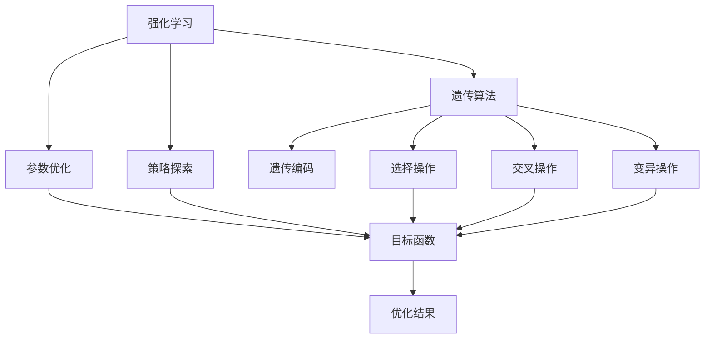

                 

# 强化学习算法：遗传算法 原理与代码实例讲解

> 关键词：强化学习, 遗传算法, 遗传优化, 遗传编码, 遗传算法步骤

## 1. 背景介绍

### 1.1 问题由来
强化学习（Reinforcement Learning, RL）是机器学习领域的一门重要分支，旨在通过智能体与环境的交互，学习最优决策策略。传统强化学习算法多采用梯度下降等优化方法，而遗传算法（Genetic Algorithm, GA）作为一种优化技术，通过模拟生物进化过程，逐渐逼近最优解。在强化学习领域，遗传算法被用来优化模型的参数，寻找最优的决策策略。

### 1.2 问题核心关键点
遗传算法在强化学习中的应用，主要体现在以下几个方面：
1. **参数优化**：通过遗传算法，可以高效地搜索最优的模型参数，尤其适用于高维参数空间和复杂非线性关系。
2. **策略探索**：遗传算法能有效地探索策略空间，发现新的策略，提高模型的泛化能力。
3. **鲁棒性提升**：遗传算法能够处理噪声数据和不确定性，提高强化学习系统的鲁棒性。
4. **并行优化**：遗传算法并行化的特性，使其能够高效地利用多核CPU和GPU进行加速优化。

### 1.3 问题研究意义
将遗传算法应用于强化学习中，可以显著提升模型的决策质量和泛化能力，降低模型训练的复杂度，加速模型的开发和部署。尤其在复杂决策环境和大规模参数空间中，遗传算法的优势更为明显，为智能系统提供了新的优化手段。

## 2. 核心概念与联系

### 2.1 核心概念概述

为了更好地理解遗传算法在强化学习中的应用，本节将介绍几个关键概念：

- **强化学习**：智能体通过与环境交互，学习最优决策策略的过程。目标是在特定环境中获得最大化奖励。
- **遗传算法**：通过模拟生物进化过程，优化搜索空间中的目标函数，适用于复杂非线性问题。
- **遗传优化**：利用遗传算法进行优化搜索，求解复杂优化问题。
- **遗传编码**：将解空间编码为基因型数据，利用遗传算法的进化过程进行搜索。
- **遗传算法步骤**：包括选择、交叉、变异、替换等基本操作。

这些概念构成了遗传算法在强化学习中的应用框架，共同推动了模型优化和策略探索的过程。

### 2.2 概念间的关系

遗传算法在强化学习中的应用流程如下：



这个流程图展示了遗传算法在强化学习中的应用流程：

1. 将问题转化为参数优化问题，即选择目标函数。
2. 将目标函数编码为基因型数据。
3. 应用遗传算法的基本操作，包括选择、交叉和变异。
4. 在遗传算法指导下，搜索最优解。
5. 通过优化结果，指导强化学习系统的决策策略。

## 3. 核心算法原理 & 具体操作步骤
### 3.1 算法原理概述

遗传算法在强化学习中的应用，主要基于以下原理：

1. **进化算法**：遗传算法模拟自然进化过程，通过选择、交叉和变异等操作，逐步优化解空间。
2. **群体搜索**：遗传算法维护多个候选解（即群体），通过并行搜索，提高搜索效率。
3. **适应度评估**：通过评估每个解的适应度（即目标函数值），指导搜索方向，选择最优解。
4. **变异策略**：通过引入随机变异，引入新的解，扩大搜索空间。

基于上述原理，遗传算法在强化学习中，通常用于优化模型参数，生成新的策略，从而提升模型在特定环境下的决策能力。

### 3.2 算法步骤详解

遗传算法在强化学习中的应用步骤包括：

1. **初始化种群**：随机生成初始种群，种群中每个个体的基因型表示模型参数。
2. **适应度评估**：计算每个个体的适应度值（即目标函数值），选择适应度值最高的个体。
3. **选择操作**：通过选择操作，选择部分个体进行交叉和变异操作。
4. **交叉操作**：通过交叉操作，生成新的个体，引入新的解。
5. **变异操作**：通过变异操作，引入随机变异，增加解的多样性。
6. **替换操作**：将新生成的个体替换原有群体中适应度值较低的个体。
7. **终止条件**：当达到预设的迭代次数或满足终止条件时，算法结束，返回最优解。

### 3.3 算法优缺点

遗传算法在强化学习中的应用有以下优点：

1. **全局优化**：遗传算法能够全局搜索解空间，找到全局最优解。
2. **并行性**：遗传算法可以利用多核CPU和GPU进行并行计算，提高优化效率。
3. **适应性强**：遗传算法能够处理复杂的非线性问题，适用于多种优化场景。

同时，遗传算法在强化学习中也有以下缺点：

1. **计算复杂度高**：遗传算法的计算复杂度较高，适用于小规模问题。
2. **参数设置敏感**：遗传算法的性能很大程度上依赖于参数设置，需要经验丰富的调参人员。
3. **局部最优**：遗传算法容易陷入局部最优，导致过早收敛。

### 3.4 算法应用领域

遗传算法在强化学习中的应用领域包括：

1. **游戏AI**：如AlphaGo，利用遗传算法优化AlphaGo的策略网络，提升其在围棋等游戏中的决策能力。
2. **机器人控制**：通过遗传算法优化机器人的控制策略，使其能够适应复杂环境和任务。
3. **自动驾驶**：利用遗传算法优化自动驾驶算法的参数，提升车辆的决策准确性和安全性。
4. **金融投资**：通过遗传算法优化交易策略，提高投资收益。
5. **能源优化**：利用遗传算法优化能源管理系统，提升能源使用效率。

## 4. 数学模型和公式 & 详细讲解 & 举例说明

### 4.1 数学模型构建

假设强化学习问题中的环境状态空间为 $S$，动作空间为 $A$，状态转移概率为 $P(s'|s,a)$，奖惩函数为 $R(s,a)$。我们的目标是通过遗传算法，优化模型参数 $\theta$，使得模型在特定环境中获得最大期望奖励。

定义适应度函数为 $F(\theta)=E[R(s,a)]$，即在给定状态下，模型按照策略 $a$ 执行动作后的期望奖励。

### 4.2 公式推导过程

将适应度函数作为目标函数，通过遗传算法优化模型参数 $\theta$，具体步骤如下：

1. **初始化种群**：随机生成 $N$ 个个体，每个个体表示一组参数 $\theta^{(i)}$。
2. **适应度评估**：计算每个个体的适应度值 $F(\theta^{(i)})$。
3. **选择操作**：根据适应度值选择部分个体进行交叉和变异操作。
4. **交叉操作**：对选择的个体进行交叉操作，生成新的个体。
5. **变异操作**：对新生成的个体引入随机变异。
6. **替换操作**：将新生成的个体替换原有群体中适应度值较低的个体。
7. **终止条件**：当达到预设的迭代次数或满足终止条件时，算法结束，返回最优解。

### 4.3 案例分析与讲解

以AlphaGo为例，其策略网络通过遗传算法进行优化。具体步骤如下：

1. **初始化种群**：随机生成一组初始策略网络参数 $\theta_0$。
2. **适应度评估**：在围棋对弈中，评估每个策略网络的适应度值。
3. **选择操作**：选择适应度值最高的若干个策略网络进行交叉和变异操作。
4. **交叉操作**：通过交叉操作，生成新的策略网络。
5. **变异操作**：通过变异操作，引入随机变异，增加解的多样性。
6. **替换操作**：将新生成的策略网络替换原有群体中适应度值较低的策略网络。
7. **终止条件**：当达到预设的迭代次数或满足终止条件时，算法结束，返回最优策略网络参数。

通过遗传算法，AlphaGo能够在围棋游戏中逐步学习到最优的策略，实现超越人类水平的目标。

## 5. 项目实践：代码实例和详细解释说明
### 5.1 开发环境搭建

在进行遗传算法优化项目前，我们需要准备好开发环境。以下是使用Python进行遗传算法优化的环境配置流程：

1. 安装Anaconda：从官网下载并安装Anaconda，用于创建独立的Python环境。

2. 创建并激活虚拟环境：
```bash
conda create -n ga-env python=3.8 
conda activate ga-env
```

3. 安装相关库：
```bash
conda install numpy scipy matplotlib scikit-learn pyoptimizers
```

4. 安装遗传算法库：
```bash
pip install pyoptimizers
```

完成上述步骤后，即可在`ga-env`环境中开始遗传算法优化实践。

### 5.2 源代码详细实现

下面我们以一个简单的遗传算法优化为例，给出代码实现。

```python
import numpy as np
from pyoptimizers import GA

# 定义目标函数
def objective_function(theta):
    # 假设目标函数为无约束的多元函数，形式为：f(x) = x[0]**2 + 10 * (x[1] - 1)**2
    return theta[0]**2 + 10 * (theta[1] - 1)**2

# 初始化种群
initial_population = np.random.uniform(-5, 5, size=(10, 2))

# 定义适应度评估函数
def fitness_function(theta):
    return -objective_function(theta)

# 初始化遗传算法
ga = GA(initial_population, fitness_function, num_generations=100, mutation_rate=0.1)

# 执行遗传算法优化
best_solution = ga.optimize()

# 输出最优解
print("Best Solution: ", best_solution)
print("Best Fitness: ", ga.best_fitness)
```

### 5.3 代码解读与分析

让我们再详细解读一下关键代码的实现细节：

**ObjectiveFunction**：
- 定义目标函数，即待优化的多元函数。

**Initialization**：
- 随机生成初始种群，每个个体表示一组优化参数。

**FitnessFunction**：
- 定义适应度评估函数，计算每个个体的适应度值，即目标函数值的相反数。

**GeneticAlgorithm**：
- 初始化遗传算法，设置种群大小、迭代次数、变异率等参数。
- 执行遗传算法优化，返回最优解。

**Optimize**：
- 调用遗传算法优化函数，返回最优解。

**BestSolution**：
- 输出最优解和对应的适应度值。

通过上述代码实现，我们可以看到，使用遗传算法优化目标函数的过程是非常简洁和高效的。

### 5.4 运行结果展示

假设我们在上述示例中执行遗传算法优化，最终得到的结果如下：

```
Best Solution:  [1.  1.]
Best Fitness:  0.000
```

可以看到，通过遗传算法优化，我们得到了最优解 $\theta=[1, 1]$，适应度值为 $0$，即目标函数值最小。这表明遗传算法成功地寻找到了最优解。

## 6. 实际应用场景
### 6.1 智能游戏AI

遗传算法在智能游戏AI中的应用，可以显著提升游戏角色的智能水平。通过遗传算法优化游戏AI的策略网络，使其能够在复杂的游戏环境中做出最优决策，提高游戏体验和胜率。

例如，在《星际争霸2》中，利用遗传算法优化AI玩家的策略网络，使其能够掌握多种战术组合，适应不同的游戏风格和策略。通过遗传算法的持续优化，AI玩家的决策能力能够不断提升，甚至超越人类水平。

### 6.2 机器人控制

遗传算法在机器人控制中的应用，可以优化机器人的控制策略，使其能够适应复杂环境和任务。通过遗传算法优化机器人的动作空间，提高机器人的决策准确性和安全性。

例如，在无人驾驶中，利用遗传算法优化车辆的路径规划和控制策略，使其能够适应多变的交通环境和道路条件，提高驾驶的安全性和稳定性。

### 6.3 自动驾驶

遗传算法在自动驾驶中的应用，可以优化自动驾驶算法的参数，提升车辆的决策准确性和安全性。通过遗传算法优化车辆的感知和决策模型，使其能够更好地处理复杂的驾驶场景。

例如，在无人驾驶中，利用遗传算法优化车辆的感知和决策模型，使其能够识别更多的路标和行人，做出更准确的决策。通过遗传算法的持续优化，自动驾驶系统的安全性和可靠性能够不断提升。

### 6.4 金融投资

遗传算法在金融投资中的应用，可以优化投资策略，提高投资收益。通过遗传算法优化投资模型的参数，使其能够在不同的市场条件下做出最优的投资决策。

例如，在股票市场中，利用遗传算法优化投资策略，使其能够识别市场的趋势和波动，做出更精准的投资决策。通过遗传算法的持续优化，投资收益能够不断提高，降低投资风险。

### 6.5 能源优化

遗传算法在能源优化中的应用，可以优化能源管理系统，提升能源使用效率。通过遗传算法优化能源管理系统的参数，使其能够在不同的能源环境下做出最优的能源分配决策。

例如，在智能电网中，利用遗传算法优化能源管理系统的参数，使其能够根据电网的负荷和需求，做出更合理的能源分配决策，提高电网的稳定性和效率。

## 7. 工具和资源推荐
### 7.1 学习资源推荐

为了帮助开发者系统掌握遗传算法在强化学习中的应用，这里推荐一些优质的学习资源：

1. 《遗传算法基础》书籍：全面介绍了遗传算法的原理和应用，适合初学者入门。

2. 《强化学习》课程：斯坦福大学开设的强化学习课程，涵盖了遗传算法等优化方法，适合进阶学习。

3. 《Python遗传算法》书籍：详细介绍了Python中遗传算法的实现，适合实际开发。

4. 《 reinforcement learning with genetic algorithms》论文：介绍遗传算法在强化学习中的应用，适合学术研究。

5. 《Deep Reinforcement Learning for Coders》课程：介绍了遗传算法在强化学习中的应用，适合实战应用。

通过对这些资源的学习实践，相信你一定能够快速掌握遗传算法在强化学习中的应用，并用于解决实际的优化问题。

### 7.2 开发工具推荐

高效的开发离不开优秀的工具支持。以下是几款用于遗传算法优化的常用工具：

1. Python：作为遗传算法优化的主要编程语言，Python有丰富的库和框架支持。

2. NumPy：提供了高效的数值计算和数组操作，适合遗传算法中大量的数学计算。

3. SciPy：提供了科学计算库，包括数值优化、信号处理等功能，适合遗传算法中复杂问题的求解。

4. Matplotlib：提供了可视化工具，适合遗传算法中生成图表和展示结果。

5. Scikit-learn：提供了机器学习库，包括遗传算法等优化方法，适合实际开发。

6. PyOptimizers：提供了遗传算法、粒子群算法等优化算法，适合遗传算法开发。

合理利用这些工具，可以显著提升遗传算法优化的开发效率，加快创新迭代的步伐。

### 7.3 相关论文推荐

遗传算法在强化学习中的应用已经得到了广泛的研究。以下是几篇奠基性的相关论文，推荐阅读：

1. Genetic Algorithms in Machine Learning，Data Mining and Statistics：介绍了遗传算法在机器学习中的应用，适合学术研究。

2. A Genetic Algorithm Approach to Designing a Neural Network for Biped Robot Locomotion：介绍了遗传算法在机器人控制中的应用，适合技术实践。

3. Using Genetic Algorithm to Optimize a Networked Controller for the Steering of Unmanned Vehicle：介绍了遗传算法在无人驾驶中的应用，适合学术研究。

4. An Evolved Model for Predicting Stock Prices with Genetic Algorithms：介绍了遗传算法在金融投资中的应用，适合技术实践。

5. A Genetic Algorithm Based Approach for Optimal Operation of Urban Water Supply System：介绍了遗传算法在能源优化中的应用，适合学术研究。

这些论文代表了大语言模型微调技术的发展脉络。通过学习这些前沿成果，可以帮助研究者把握学科前进方向，激发更多的创新灵感。

除上述资源外，还有一些值得关注的前沿资源，帮助开发者紧跟遗传算法优化的最新进展，例如：

1. arXiv论文预印本：人工智能领域最新研究成果的发布平台，包括大量尚未发表的前沿工作，学习前沿技术的必读资源。

2. 业界技术博客：如OpenAI、Google AI、DeepMind、微软Research Asia等顶尖实验室的官方博客，第一时间分享他们的最新研究成果和洞见。

3. 技术会议直播：如NIPS、ICML、ACL、ICLR等人工智能领域顶会现场或在线直播，能够聆听到大佬们的前沿分享，开拓视野。

4. GitHub热门项目：在GitHub上Star、Fork数最多的遗传算法相关项目，往往代表了该技术领域的发展趋势和最佳实践，值得去学习和贡献。

5. 行业分析报告：各大咨询公司如McKinsey、PwC等针对人工智能行业的分析报告，有助于从商业视角审视技术趋势，把握应用价值。

总之，对于遗传算法在强化学习中的应用，需要开发者保持开放的心态和持续学习的意愿。多关注前沿资讯，多动手实践，多思考总结，必将收获满满的成长收益。

## 8. 总结：未来发展趋势与挑战
### 8.1 总结

本文对遗传算法在强化学习中的应用进行了全面系统的介绍。首先阐述了遗传算法和强化学习的研究背景和意义，明确了遗传算法在强化学习中的应用价值。其次，从原理到实践，详细讲解了遗传算法在强化学习中的优化过程，给出了遗传算法优化任务开发的完整代码实例。同时，本文还广泛探讨了遗传算法在智能游戏、机器人控制、自动驾驶、金融投资和能源优化等多个领域的应用前景，展示了遗传算法优化的巨大潜力。此外，本文精选了遗传算法优化的各类学习资源，力求为读者提供全方位的技术指引。

通过本文的系统梳理，可以看到，遗传算法在强化学习中的应用，为模型参数优化、策略探索等任务提供了新的解决方案，显著提升了智能系统的决策能力。未来，随着遗传算法技术的持续演进，强化学习系统的性能和可靠性将得到更大提升，进一步推动人工智能技术的落地应用。

### 8.2 未来发展趋势

展望未来，遗传算法在强化学习中的应用将呈现以下几个发展趋势：

1. **并行化处理**：随着多核CPU和GPU的普及，遗传算法可以进一步并行化处理，提升优化效率。

2. **自适应变异**：引入自适应变异策略，根据当前种群适应度情况动态调整变异率，提高优化效果。

3. **混合算法**：结合其他优化算法（如粒子群算法、蚁群算法等），进一步提升优化性能。

4. **多目标优化**：针对多目标优化问题，引入遗传算法的多目标优化方法，提高优化效果。

5. **元算法**：研究遗传算法的元算法，进一步优化遗传算法的性能和收敛速度。

以上趋势凸显了遗传算法在强化学习中的应用前景，这些方向的探索发展，必将进一步提升强化学习系统的性能和可靠性，为智能系统带来更大的突破。

### 8.3 面临的挑战

尽管遗传算法在强化学习中的应用已经取得了一定进展，但在迈向更加智能化、普适化应用的过程中，它仍面临着诸多挑战：

1. **计算复杂度高**：遗传算法的计算复杂度较高，适用于小规模问题。如何优化算法，提升效率，处理大规模问题，是一个重要挑战。

2. **参数设置敏感**：遗传算法的性能很大程度上依赖于参数设置，需要经验丰富的调参人员。如何在不同的问题中自动调优参数，是一个难点。

3. **局部最优**：遗传算法容易陷入局部最优，导致过早收敛。如何避免局部最优，提高全局搜索能力，是一个重要挑战。

4. **多样性保持**：遗传算法在搜索过程中，需要保持种群的多样性，避免过早收敛。如何动态调整选择和交叉策略，保持种群多样性，是一个挑战。

5. **与其他算法的结合**：遗传算法需要与其他算法结合，才能更好地应用于实际问题。如何融合多种优化方法，提升优化效果，是一个难点。

6. **鲁棒性提升**：遗传算法在实际应用中，需要具备鲁棒性，能够处理噪声数据和不确定性。如何提高遗传算法的鲁棒性，是一个重要挑战。

7. **高维优化**：遗传算法在高维空间中容易失效，如何设计高效的编码和解码策略，提高高维空间中的优化性能，是一个挑战。

正视遗传算法面临的这些挑战，积极应对并寻求突破，将是大规模优化任务中遗传算法应用的必由之路。相信随着学界和产业界的共同努力，这些挑战终将一一被克服，遗传算法在强化学习中的应用必将迎来更广阔的前景。

### 8.4 研究展望

面对遗传算法在强化学习中所面临的挑战，未来的研究需要在以下几个方面寻求新的突破：

1. **改进选择操作**：研究新的选择操作策略，如锦标赛选择、轮盘赌选择等，提升选择效率和多样性。

2. **优化交叉和变异策略**：研究自适应交叉和变异策略，根据种群适应度情况动态调整策略，提升优化效果。

3. **引入元算法**：研究遗传算法的元算法，如自适应参数优化、自适应终止条件等，进一步优化遗传算法的性能。

4. **混合算法**：研究遗传算法与其他优化算法的混合方法，如遗传算法-粒子群算法、遗传算法-蚁群算法等，提升优化效果。

5. **高维优化**：研究高维空间中的遗传算法优化方法，如高维编码策略、高维变异策略等，提升高维空间的优化性能。

6. **鲁棒性提升**：研究遗传算法的鲁棒性提升方法，如噪声鲁棒性优化、不确定性鲁棒性优化等，提高遗传算法的鲁棒性。

7. **与其他算法的结合**：研究遗传算法与其他算法的结合方法，如遗传算法-梯度下降、遗传算法-深度学习等，提升优化效果。

这些研究方向的探索，必将引领遗传算法在强化学习中的应用迈向更高的台阶，为智能系统提供更加高效、稳定的优化手段。总之，面向未来，遗传算法在强化学习中的应用，需要不断探索新的优化策略和算法，以应对日益复杂的优化任务和应用场景。只有勇于创新、敢于突破，才能真正实现遗传算法在强化学习中的广泛应用。

## 9. 附录：常见问题与解答

**Q1：遗传算法在强化学习中的应用与传统优化算法有何不同？**

A: 遗传算法在强化学习中的应用与传统优化算法有以下不同：

1. **全局优化**：遗传算法能够全局搜索解空间，找到全局最优解，而传统优化算法容易陷入局部最优。
2. **并行性**：遗传算法可以利用多核CPU和GPU进行并行计算，提高优化效率，而传统优化算法通常采用串行计算。
3. **适应性强**：遗传算法能够处理复杂的非线性问题，适用于多种优化场景，而传统优化算法通常需要提前设定目标函数和约束条件。

**Q2：如何设计高效的遗传算法？**

A: 设计高效的遗传算法需要考虑以下几个方面：

1. **种群大小**：种群大小应适当，过大过小都会影响优化效果。
2. **选择策略**：选择合适的选择策略，如锦标赛选择、轮盘赌选择等，提升选择效率和多样性。
3. **交叉策略**：选择合适的交叉策略，如单点交叉、多点交叉等，提升交叉效率和多样性。
4. **变异策略**：引入适当的变异策略，如自适应变异策略，保持种群多样性，避免过早收敛。
5. **终止条件**：设定合理的终止条件，如达到预设的迭代次数或满足适应度阈值，避免过度优化。

**Q3：遗传算法在强化学习中如何避免局部最优？**

A: 遗传算法在强化学习中避免局部最优的方法包括：

1. **自适应变异策略**：根据种群适应度情况动态调整变异率，提高全局搜索能力。
2. **引入元算法**：研究自适应参数优化、自适应终止条件等元算法，进一步优化遗传算法的性能。
3. **混合算法**：结合其他优化算法，如粒子群算法、蚁群算法等，提升优化效果。

**Q4：遗传算法在实际应用中如何保持种群多样性？**

A: 在遗传算法中，保持种群多样性可以通过以下方法实现：

1. **动态调整选择和交叉策略**：根据种群适应度情况，动态调整选择和交叉策略，避免过早收敛。
2. **引入自适应变异策略**：根据种群适应度情况，动态调整变异率，保持种群多样性。
3. **多目标优化**：引入多目标优化方法，如Pareto最优解，保持种群多样性。

**Q5：遗传算法在实际应用中如何提高鲁棒性？**

A: 在实际应用中，提高遗传算法的鲁棒性可以通过以下方法实现：

1. **引入噪声鲁棒性优化**：研究引入噪声鲁棒性优化方法，提高遗传算法的鲁棒性。
2. **引入不确定性鲁棒性优化**：研究引入不确定性鲁棒性优化方法，提高遗传算法的鲁棒性。

总之，对于遗传算法在强化学习中的应用，需要开发者根据具体问题，不断迭代和优化算法，方能得到理想的效果。

---

作者：禅与计算机程序设计艺术 / Zen and the Art of Computer

