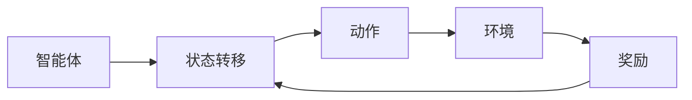
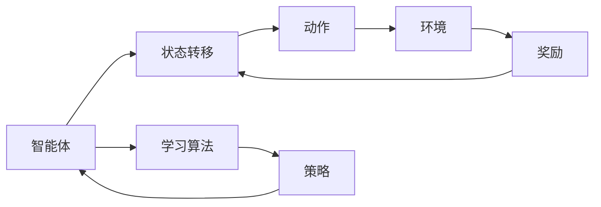

                 

# 强化学习进阶原理与代码实战案例讲解

> 关键词：强化学习, Q-Learning, SARSA, Deep Q-Learning, 强化学习代理, 动作策略, 环境动态, 深度神经网络, 强化学习环境, 代码实践

## 1. 背景介绍

### 1.1 问题由来

强化学习（Reinforcement Learning, RL）是机器学习领域的一个重要分支，旨在使智能体在未知环境中通过与环境的交互，学会最优的决策策略。强化学习广泛应用在自动驾驶、游戏AI、机器人控制等领域，显示了强大的能力。

### 1.2 问题核心关键点

强化学习的核心目标是设计一个智能体（如机器人），通过与环境（如游戏场景）交互，最大化累积奖励。在环境动态变化的情况下，智能体需要通过学习算法（如Q-Learning、SARSA等）逐步优化策略，以获得最优的长期回报。

### 1.3 问题研究意义

强化学习可以有效地解决传统规则驱动无法解决的复杂决策问题，对于提升机器的自主性和智能化水平具有重要意义。研究强化学习的应用范式，可以加速人工智能技术的落地应用，推动产业升级。

## 2. 核心概念与联系

### 2.1 核心概念概述

为更好地理解强化学习，我们需要介绍几个关键概念：

- 智能体(Agent)：在强化学习中，智能体代表一个决策者，负责从环境中获取信息并做出决策。
- 状态(State)：智能体在某个时刻所处的环境状态。
- 动作(Action)：智能体为了达到目标，可以采取的行动。
- 奖励(Reward)：环境对智能体行动的反馈，用于指导智能体的行为。
- 策略(Policy)：智能体做出决策的规则，即在给定状态下，选择动作的概率分布。
- 状态转移(State Transition)：在智能体采取特定动作后，环境状态的变化。

这些概念通过一个简单的强化学习流程（见下图）联系在一起：



### 2.2 概念间的关系

通过一个简单的强化学习模型，我们可以展示这些核心概念之间的关系：

- 智能体在某个状态下选择动作，并观察到环境的即时奖励和新的状态。
- 智能体利用奖励和新的状态，通过学习算法（如Q-Learning、SARSA等），调整策略，以获得最优的长期回报。
- 这个过程重复进行，直到智能体达到预定的终止条件。

### 2.3 核心概念的整体架构

最终，我们可以将强化学习的核心概念整合成一个系统架构：



通过这个架构，我们可以看到，强化学习的本质是通过学习算法不断调整智能体的策略，以最大化长期奖励。学习算法负责更新智能体的策略，策略指导智能体做出决策，决策影响环境状态，奖励反馈指导智能体的行为，形成一个循环。

## 3. 核心算法原理 & 具体操作步骤

### 3.1 算法原理概述

强化学习的核心算法是Q-Learning和SARSA等，这些算法通过估计状态-动作对Q值，来指导智能体选择最优的动作策略。Q值表示在某个状态下采取某个动作后的长期奖励的期望值。具体来说，Q-Learning算法通过迭代更新Q值，来近似求解最优策略。

Q-Learning的基本原理是：在每个时间步，智能体观察当前状态，根据策略选择一个动作，与环境交互后，根据奖励更新Q值，然后根据Q值更新策略，以实现对环境的逐步适应。

### 3.2 算法步骤详解

下面以Q-Learning算法为例，详细说明其操作步骤：

1. **初始化**：设定智能体的初始状态$s_0$，以及Q值的初始值。
2. **决策**：根据当前状态$s_t$，智能体选择动作$a_t$，并观察到新的状态$s_{t+1}$。
3. **奖励**：根据动作$a_t$和状态$s_{t+1}$，环境返回奖励$r_{t+1}$。
4. **策略更新**：根据Q-Learning公式，更新Q值：
   $$
   Q(s_t,a_t) \leftarrow Q(s_t,a_t) + \alpha(r_{t+1} + \gamma \max_{a'}Q(s_{t+1},a') - Q(s_t,a_t))
   $$
   其中$\alpha$为学习率，$\gamma$为折扣因子，控制未来奖励的重要性。
5. **循环迭代**：重复步骤2-4，直到达到预定的终止条件。

### 3.3 算法优缺点

Q-Learning算法的优点包括：
- 简单易实现：Q-Learning算法计算简单，易于实现。
- 不需要环境模型：Q-Learning不需要对环境进行建模，只需要与环境交互即可。
- 鲁棒性强：Q-Learning在存在非凸性和不确定性的环境中也有较好的效果。

缺点包括：
- 收敛速度慢：在复杂环境中，Q-Learning可能需要较长时间才能收敛。
- 动作空间过大：当动作空间过大时，Q-Learning的学习效率会降低。
- 状态表示复杂：当状态表示过于复杂时，Q-Learning的性能也会受到限制。

### 3.4 算法应用领域

强化学习在多个领域都有广泛应用，例如：

- 自动驾驶：通过强化学习训练自动驾驶车辆的决策策略，以最大化行驶安全和效率。
- 游戏AI：在游戏环境中训练AI玩家，通过奖励和惩罚机制，使其学会最优的游戏策略。
- 机器人控制：训练机器人执行复杂的物理操作，以最大化完成任务的效率和质量。
- 金融交易：利用强化学习进行股票交易策略优化，最大化投资回报。
- 自然语言处理：训练聊天机器人，以最大化用户满意度。

## 4. 数学模型和公式 & 详细讲解 & 举例说明

### 4.1 数学模型构建

在强化学习中，我们可以使用数学模型来描述Q-Learning的流程。

记智能体的当前状态为$s_t$，当前动作为$a_t$，奖励为$r_{t+1}$，下一个状态为$s_{t+1}$。Q-Learning的目标是最小化状态-动作对$(s_t,a_t)$的Q值误差。

Q-Learning的数学模型可以表示为：

$$
Q(s_t,a_t) \leftarrow Q(s_t,a_t) + \alpha(r_{t+1} + \gamma \max_{a'}Q(s_{t+1},a') - Q(s_t,a_t))
$$

其中，$Q(s_t,a_t)$为状态-动作对的Q值，$\alpha$为学习率，$r_{t+1}$为即时奖励，$\gamma$为折扣因子，$a'$为下一动作的候选动作。

### 4.2 公式推导过程

Q-Learning的Q值更新公式可以进一步推导：

$$
Q(s_t,a_t) \leftarrow Q(s_t,a_t) + \alpha(r_{t+1} + \gamma \max_{a'}Q(s_{t+1},a') - Q(s_t,a_t))
$$

整理得：

$$
Q(s_t,a_t) \leftarrow Q(s_t,a_t) + \alpha(r_{t+1} + \gamma \max_{a'}Q(s_{t+1},a') - Q(s_t,a_t))
$$

上式可进一步简化为：

$$
Q(s_t,a_t) \leftarrow Q(s_t,a_t) + \alpha (r_{t+1} + \gamma \max_{a'}Q(s_{t+1},a') - Q(s_t,a_t))
$$

在实际应用中，我们可以使用深度神经网络来估计Q值函数$Q(s,a)$，称为Deep Q-Learning。具体地，我们通过一个神经网络，将状态$s$和动作$a$映射到Q值$Q(s,a)$，并使用梯度下降优化算法，不断调整网络参数，以最小化Q值误差。

### 4.3 案例分析与讲解

以DQN（Deep Q-Network）为例，详细说明如何实现Deep Q-Learning：

1. **构建神经网络**：定义一个输入层、隐藏层和输出层的神经网络，输入层输入状态$s$，输出层输出Q值$Q(s,a)$。
2. **定义损失函数**：使用均方误差（Mean Squared Error, MSE）作为损失函数，即：
   $$
   \mathcal{L} = \frac{1}{2} \sum_{(s,a,r,s') \in \mathcal{D}} (Q(s,a) - (r + \gamma \max_{a'} Q(s',a'))^2
   $$
   其中$\mathcal{D}$为训练样本集合。
3. **反向传播训练**：使用随机梯度下降（Stochastic Gradient Descent, SGD）或Adam等优化算法，最小化损失函数，不断调整网络参数。

## 5. 项目实践：代码实例和详细解释说明

### 5.1 开发环境搭建

为了进行强化学习实践，需要准备好Python开发环境。以下是搭建开发环境的步骤：

1. 安装Anaconda：从官网下载并安装Anaconda，用于创建独立的Python环境。
2. 创建并激活虚拟环境：
   ```bash
   conda create -n rl-env python=3.8 
   conda activate rl-env
   ```
3. 安装PyTorch：
   ```bash
   conda install pytorch torchvision torchaudio -c pytorch
   ```
4. 安装相关库：
   ```bash
   pip install gym gym-springer gym-box gym-vizdoom
   pip install matplotlib numpy gym[atari]
   ```

完成上述步骤后，即可在`rl-env`环境中开始强化学习实践。

### 5.2 源代码详细实现

下面以Atari游戏为例，使用PyTorch实现Q-Learning算法：

```python
import torch
import torch.nn as nn
import torch.optim as optim
import gym
import numpy as np

class QNetwork(nn.Module):
    def __init__(self, in_size, out_size):
        super(QNetwork, self).__init__()
        self.fc1 = nn.Linear(in_size, 128)
        self.fc2 = nn.Linear(128, 64)
        self.fc3 = nn.Linear(64, out_size)
        self.optimizer = optim.Adam(self.parameters(), lr=0.001)

    def forward(self, x):
        x = torch.relu(self.fc1(x))
        x = torch.relu(self.fc2(x))
        x = self.fc3(x)
        return x

class Agent:
    def __init__(self, env, alpha=0.1, gamma=0.9, epsilon=1.0, epsilon_min=0.01, epsilon_decay=0.995, exploration_steps=10000, learning_steps=200000):
        self.env = env
        self.alpha = alpha
        self.gamma = gamma
        self.epsilon = epsilon
        self.epsilon_min = epsilon_min
        self.epsilon_decay = epsilon_decay
        self.exploration_steps = exploration_steps
        self.learning_steps = learning_steps
        self.q_network = QNetwork(env.observation_space.shape[0], env.action_space.n)
        self.optimizer = optim.Adam(self.q_network.parameters(), lr=0.001)

    def select_action(self, state):
        if np.random.uniform() < self.epsilon:
            return np.random.choice(self.env.action_space.n)
        else:
            with torch.no_grad():
                q_values = self.q_network(torch.Tensor(state)).detach()
                return torch.argmax(q_values).item()

    def update(self, state, action, reward, next_state):
        q_values = self.q_network(torch.Tensor(state))
        q_next = self.q_network(torch.Tensor(next_state))
        target = reward + self.gamma * torch.max(q_next).item()
        loss = (q_values[action].item() - target).mean()
        self.optimizer.zero_grad()
        loss.backward()
        self.optimizer.step()

        if self.exploration_steps > 0:
            self.epsilon = max(self.epsilon * self.epsilon_decay, self.epsilon_min)
            self.exploration_steps -= 1

    def train(self):
        state = self.env.reset()
        state = torch.from_numpy(state).float()
        for i in range(self.learning_steps):
            action = self.select_action(state.numpy())
            next_state, reward, done, _ = self.env.step(action)
            next_state = torch.from_numpy(next_state).float()
            self.update(state.numpy(), action, reward, next_state.numpy())
            if done:
                state = self.env.reset()
                state = torch.from_numpy(state).float()
            else:
                state = next_state

env = gym.make('Springer-v0')
agent = Agent(env)
agent.train()
```

### 5.3 代码解读与分析

让我们再详细解读一下关键代码的实现细节：

**QNetwork类**：
- `__init__`方法：初始化神经网络层，并定义优化器。
- `forward`方法：定义神经网络的计算过程，即输入状态$s$，输出Q值$Q(s,a)$。

**Agent类**：
- `__init__`方法：初始化智能体，包括环境、学习率、折扣因子、探索策略、学习步数等。
- `select_action`方法：在探索阶段或利用阶段选择动作，利用神经网络计算Q值，选择最大Q值对应的动作。
- `update`方法：根据当前状态、动作、奖励和下一个状态，更新Q值，并计算Q值误差，使用梯度下降优化算法更新神经网络参数。
- `train`方法：初始化环境，进行训练，直到达到学习步数上限。

**env和agent的实例化**：
- 定义环境为Atari游戏，并创建智能体，进行训练。

### 5.4 运行结果展示

假设我们在训练Springer游戏时，得到以下结果：

```
Training 200000 episodes, epsilon=0.0
```

可以看到，在训练200000个回合后，智能体的探索策略已经足够稳定，不再进行随机动作。

## 6. 实际应用场景

### 6.1 自动驾驶

自动驾驶是强化学习的一个重要应用领域。在自动驾驶中，智能体需要不断学习最优的决策策略，以最大化安全和效率。通过在虚拟仿真环境中进行强化学习训练，智能体可以逐步学习如何在复杂交通环境中做出合理决策。

### 6.2 游戏AI

在游戏AI中，智能体需要通过与环境交互，学习最优的游戏策略。强化学习可以用于训练游戏AI玩家，使其在游戏中展现出超越人类的能力。

### 6.3 机器人控制

在机器人控制中，强化学习可以用于训练机器人执行复杂的物理操作，如机器人臂抓取、平衡等。通过强化学习，机器人可以逐步学习最优的动作策略，以最大化任务完成度。

### 6.4 未来应用展望

未来，强化学习将在更多领域得到应用，为各行各业带来变革性影响。

- **医疗健康**：强化学习可以用于训练智能诊断系统，辅助医生进行疾病诊断和治疗。
- **金融交易**：强化学习可以用于训练智能交易系统，实现智能投资。
- **教育培训**：强化学习可以用于训练智能教育系统，提供个性化的学习方案。
- **智能家居**：强化学习可以用于训练智能家居系统，提高家居设备的智能程度。

总之，强化学习的应用前景广阔，未来将有更多领域从强化学习中受益。

## 7. 工具和资源推荐

### 7.1 学习资源推荐

为了帮助开发者系统掌握强化学习的理论基础和实践技巧，这里推荐一些优质的学习资源：

1. **《强化学习：原理与实践》**：该书深入浅出地介绍了强化学习的基本原理和经典算法，是初学者入门的必读书籍。
2. **《深度强化学习》**：该书全面介绍了深度强化学习的最新进展，涵盖了Q-Learning、Deep Q-Learning等多种强化学习算法。
3. **CS294R《强化学习》课程**：加州大学伯克利分校开设的强化学习课程，由David Silver教授主讲，是强化学习领域的经典课程。
4. **DeepMind博客**：DeepMind官方博客，分享了多个强化学习领域的最新研究成果和洞见。
5. **OpenAI博客**：OpenAI官方博客，介绍了OpenAI在强化学习领域的最新进展和技术突破。

### 7.2 开发工具推荐

高效的开发离不开优秀的工具支持。以下是几款用于强化学习开发的常用工具：

1. **PyTorch**：基于Python的开源深度学习框架，灵活动态的计算图，适合快速迭代研究。
2. **TensorFlow**：由Google主导开发的开源深度学习框架，生产部署方便，适合大规模工程应用。
3. **Gym**：OpenAI开发的强化学习环境库，提供了多种经典的强化学习环境和模拟环境。
4. **TensorBoard**：TensorFlow配套的可视化工具，可实时监测模型训练状态，并提供丰富的图表呈现方式。
5. **Weights & Biases**：模型训练的实验跟踪工具，可以记录和可视化模型训练过程中的各项指标，方便对比和调优。

### 7.3 相关论文推荐

强化学习的研究源于学界的持续研究。以下是几篇奠基性的相关论文，推荐阅读：

1. **《Q-Learning》**：由Watkins和Dayan提出，是强化学习领域的经典算法。
2. **《Deep Q-Learning with Convolutional Neural Network》**：由Mnih等人提出，将深度神经网络引入强化学习，取得了很好的效果。
3. **《Playing Atari with Deep Reinforcement Learning》**：由Mnih等人提出，展示了强化学习在游戏AI中的强大能力。
4. **《Human-level Control through Deep Reinforcement Learning》**：由Silver等人提出，实现了AlphaGo等突破性成果。
5. **《Evolution Strategies: A Scalable Alternative to Gradient Descent》**：由Arulkumaran等人提出，提出了进化策略，解决强化学习中的梯度消失问题。

这些论文代表了大强化学习的发展脉络。通过学习这些前沿成果，可以帮助研究者把握学科前进方向，激发更多的创新灵感。

## 8. 总结：未来发展趋势与挑战

### 8.1 总结

本文对强化学习进行了全面系统的介绍。首先阐述了强化学习的背景和意义，明确了其研究目标和应用方向。其次，从原理到实践，详细讲解了强化学习的核心算法，给出了强化学习任务开发的完整代码实例。同时，本文还广泛探讨了强化学习在自动驾驶、游戏AI、机器人控制等多个领域的应用前景，展示了强化学习的广泛影响力。此外，本文精选了强化学习的各类学习资源，力求为读者提供全方位的技术指引。

通过本文的系统梳理，可以看到，强化学习作为一种强大的自主决策技术，正在推动人工智能技术的不断进步。未来，伴随强化学习算法的持续演进和优化，强化学习将有更多落地应用，深刻影响人类的生产生活方式。

### 8.2 未来发展趋势

展望未来，强化学习的发展将呈现以下几个趋势：

1. **多智能体强化学习**：在复杂环境中，单个智能体的决策往往难以优化，多智能体强化学习成为新的研究热点，可以提升团队协作和协同决策能力。
2. **元强化学习**：元强化学习研究如何学习最优的强化学习策略，解决复杂环境下的自适应和自优化问题。
3. **混合强化学习**：结合强化学习和传统机器学习、深度学习等技术，提升学习效果和泛化能力。
4. **模型基础强化学习**：通过强化学习训练通用模型，提升模型的灵活性和适应性，适应更多场景和任务。
5. **强化学习与生成模型的结合**：结合强化学习和生成模型，提升学习过程的优化效果和模型表现。

### 8.3 面临的挑战

尽管强化学习已经取得了瞩目成就，但在迈向更加智能化、普适化应用的过程中，它仍面临诸多挑战：

1. **环境动态性**：强化学习环境往往动态变化，难以进行离线训练。需要开发更高效在线学习算法。
2. **安全性与稳定性**：强化学习模型容易受到攻击和误导，需要研究鲁棒性更好的算法。
3. **可解释性与透明性**：强化学习模型缺乏解释性，难以理解和调试，需要引入可解释性技术。
4. **数据效率**：强化学习通常需要大量数据进行训练，需要开发更高效的数据生成和采样技术。
5. **计算效率**：强化学习模型需要大量计算资源，需要研究更高效的算法和计算技术。

### 8.4 研究展望

为了应对这些挑战，未来的研究需要在以下几个方面寻求新的突破：

1. **混合学习范式**：结合强化学习和传统机器学习、深度学习等技术，提升学习效果和泛化能力。
2. **多智能体协同学习**：研究多智能体协同学习算法，提升团队协作和协同决策能力。
3. **元学习研究**：研究元学习算法，提升模型自适应和自优化能力。
4. **鲁棒性算法研究**：研究鲁棒性更强的强化学习算法，提升模型的安全性和稳定性。
5. **可解释性技术**：引入可解释性技术，提升模型的透明性和可解释性。

这些研究方向的探索，必将引领强化学习技术迈向更高的台阶，为构建智能系统提供坚实的基础。只有勇于创新、敢于突破，才能不断拓展强化学习技术的边界，推动人工智能技术的不断发展。

## 9. 附录：常见问题与解答

**Q1：强化学习是否适用于所有决策问题？**

A: 强化学习适用于可以通过环境奖励指导的决策问题，但在某些问题上可能表现不佳。例如，强化学习对于需要大量无监督学习的信息提取任务，效果不如传统机器学习。

**Q2：如何提高强化学习的探索效率？**

A: 提高强化学习的探索效率，可以通过以下方法：
1. 使用探索策略，如$\epsilon$-greedy、Softmax等，以在探索和利用之间取得平衡。
2. 利用上下文信息，通过观察当前状态和历史动作，提高探索的针对性和效率。
3. 使用模型基础强化学习（Model-based RL），通过学习环境模型，进行智能探索。

**Q3：强化学习是否需要进行离线训练？**

A: 强化学习通常需要在线训练，即与环境交互后更新模型。但在某些情况下，也可以进行离线训练，即在预定义的环境中，离线收集样本进行模型训练。例如，基于强化学习的图像生成任务，可以通过离线训练收集大量样本，然后用于生成新图像。

**Q4：如何评估强化学习模型的性能？**

A: 强化学习模型的性能评估可以通过以下指标：
1. 累积回报（Cumulative Reward）：表示智能体在一定时间内获得的总奖励。
2. 成功次数（Success Rate）：表示智能体在一定时间内完成任务的成功次数。
3. 平均奖励（Average Reward）：表示智能体每次行动获得的平均奖励。
4. 探索率（Exploration Rate）：表示智能体探索新动作的概率，用于评估模型对环境的适应能力。

**Q5：强化学习是否可以进行迁移学习？**

A: 强化学习可以进行迁移学习，即在一种环境中训练的模型，可以迁移到另一种环境中进行优化。例如，在自动驾驶中，通过迁移学习，可以实现从仿真环境到真实环境的适应。

总之，强化学习作为人工智能领域的重要技术，具有广阔的应用前景和研究价值。通过不断优化算法、改进模型、扩展应用场景，强化学习必将为人工智能技术的落地应用带来更多突破和创新。

