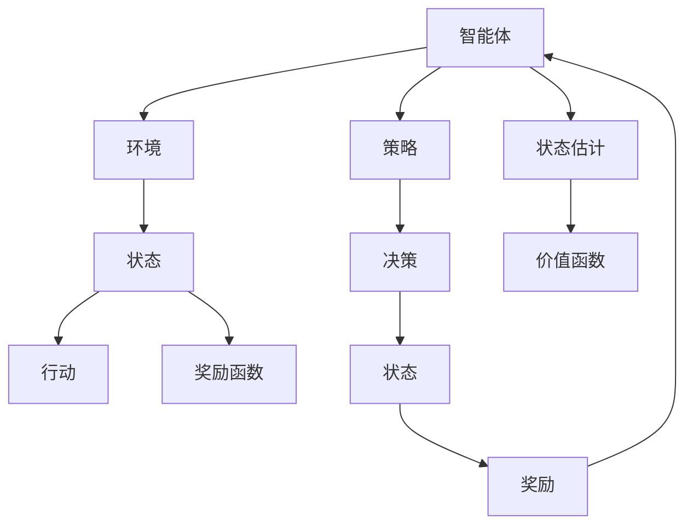

                 

## 1. 背景介绍

### 1.1 问题由来

随着人工智能技术的不断进步，机器学习（ML）与深度学习（DL）的应用领域越来越广泛，逐渐渗透到强化学习（RL）这一领域。近年来，强化学习在游戏AI、机器人控制、自动驾驶、金融预测等领域展现出了强大的潜力，成为了AI研究的热点之一。

### 1.2 问题核心关键点

强化学习主要解决的问题是如何使智能体在复杂环境中通过交互学习，以最优策略获得最大收益或最小损失。核心概念包括：

- 智能体（Agent）：决策主体，通常为算法模型。
- 环境（Environment）：智能体所处的互动环境，如游戏环境、机器人操作环境等。
- 状态（State）：环境中的重要属性，用于表征智能体当前所处的状态。
- 行动（Action）：智能体的决策输出，对环境造成影响。
- 奖励（Reward）：环境对智能体行动的反馈，通常为正数表示收益，负数表示损失。
- 策略（Policy）：智能体选择行动的概率分布，即在特定状态下选择某个行动的概率。

### 1.3 问题研究意义

强化学习为AI提供了新的理论基础和应用范式，可以帮助机器更好地理解人类行为、环境互动，从而在多任务、动态环境中的决策制定上实现突破。通过强化学习，机器可以自动学习最优策略，减少人工干预，提高自动化水平。因此，研究强化学习对于推动AI技术在更多领域的应用具有重要意义。

## 2. 核心概念与联系

### 2.1 核心概念概述

强化学习结合了机器学习和深度学习的方法，通过智能体与环境的交互，不断优化策略以获取最大收益。其核心思想是通过智能体与环境的反复互动，利用奖励信号进行学习，逐步优化策略，从而在复杂环境中做出最优决策。

### 2.2 概念间的关系

强化学习的核心概念之间关系紧密，具体如下：

#### 2.2.1 智能体与环境的交互

智能体通过行动与环境交互，获取环境状态，并根据奖励信号调整策略。环境则是智能体行动的反馈机制，提供状态和奖励信息。

#### 2.2.2 状态与行动的关系

状态用于表征智能体所处的环境，行动则是智能体的决策输出，对环境产生影响。状态和行动的关系紧密相连，智能体的决策需要根据当前状态做出。

#### 2.2.3 策略与奖励的关联

策略是智能体选择行动的概率分布，而奖励则是对智能体行动的反馈。智能体通过最大化期望奖励来学习最优策略，从而在环境中获得最大收益。

### 2.3 核心概念的整体架构

下图展示了强化学习中智能体与环境的交互过程，以及策略、状态、行动和奖励之间的关系：



## 3. 核心算法原理 & 具体操作步骤

### 3.1 算法原理概述

强化学习的核心算法包括Q-learning、SARSA、Deep Q-Network（DQN）等。其核心思想是通过智能体与环境的互动，利用奖励信号和状态信息，逐步学习最优策略。

#### 3.1.1 Q-learning

Q-learning算法通过学习Q值函数，即在特定状态下采取特定行动的期望奖励值，来选择最优行动。Q值函数通过迭代更新，不断优化智能体的决策策略。

#### 3.1.2 SARSA

SARSA算法与Q-learning类似，但在更新Q值时，采取的是当前状态-行动-下一个状态-行动的更新方式，即根据当前行动后的下一个状态和下一个行动的Q值进行更新，更加准确地反映策略的变化。

#### 3.1.3 Deep Q-Network（DQN）

DQN算法结合了深度神经网络，能够处理高维状态和行动空间，通过学习Q值函数，在复杂环境中获取最优策略。DQN使用经验回放（Experience Replay）和目标网络（Target Network）等技术，进一步提升模型的稳定性和泛化能力。

### 3.2 算法步骤详解

以DQN算法为例，具体步骤如下：

1. **环境初始化**：将环境置于初始状态。
2. **行动选择**：根据当前状态，使用策略选择行动。
3. **环境反馈**：执行行动，获取下一个状态和奖励。
4. **状态估计**：使用神经网络估计Q值。
5. **目标网络更新**：通过目标网络更新Q值。
6. **经验回放**：将样本存储到经验回放内存中。
7. **模型更新**：使用样本更新神经网络参数。

### 3.3 算法优缺点

强化学习的优点包括：

- 适应性强：能够适应多种复杂环境，无需人工干预。
- 自学习能力：通过奖励信号自主学习最优策略。
- 普适性好：适用于游戏、机器人、自动驾驶等领域。

缺点包括：

- 计算量大：需要大量的计算资源进行策略优化。
- 可解释性差：智能体的决策过程缺乏直观解释。
- 难以处理高维状态空间：状态空间过大时，学习效率会降低。

### 3.4 算法应用领域

强化学习在多个领域得到了广泛应用，具体如下：

- 游戏AI：如AlphaGo、AlphaZero等，通过强化学习实现智能决策。
- 机器人控制：如ROS、OpenAI Gym等，通过强化学习使机器人自主学习动作策略。
- 自动驾驶：如Waymo、Tesla等，通过强化学习优化车辆驾驶策略。
- 金融预测：通过强化学习预测股市趋势、风险评估等。
- 资源管理：如云计算资源分配、交通流量控制等。

## 4. 数学模型和公式 & 详细讲解  
### 4.1 数学模型构建

强化学习的数学模型主要包括以下几个关键概念：

- 状态空间：用$\mathcal{S}$表示，是智能体与环境交互的连续或离散状态集合。
- 行动空间：用$\mathcal{A}$表示，是智能体可以选择的行动集合。
- 策略：用$\pi(a|s)$表示，是智能体在状态$s$下选择行动$a$的概率分布。
- 状态值函数：用$V(s)$表示，是智能体在状态$s$下的期望奖励。
- Q值函数：用$Q(s,a)$表示，是在状态$s$下采取行动$a$的期望奖励加下步状态值。
- 奖励函数：用$R(s,a,s')$表示，是在状态$s$下采取行动$a$后，环境提供的奖励值。

### 4.2 公式推导过程

以Q-learning算法为例，其基本公式如下：

$$
Q(s_t,a_t) = Q(s_t,a_t) + \alpha(r_t + \gamma \max_{a} Q(s_{t+1},a) - Q(s_t,a_t))
$$

其中，$s_t$为当前状态，$a_t$为当前行动，$r_t$为当前奖励，$s_{t+1}$为下一个状态，$\gamma$为折扣因子，$\alpha$为学习率。

公式的推导过程如下：

1. 定义当前状态$s_t$的Q值为$Q(s_t,a_t)$。
2. 根据Q-learning公式更新Q值：$Q(s_t,a_t) = Q(s_t,a_t) + \alpha(r_t + \gamma \max_{a} Q(s_{t+1},a) - Q(s_t,a_t))$。
3. 将公式展开并整理，得到最终更新的公式。

### 4.3 案例分析与讲解

以AlphaGo为例，AlphaGo使用强化学习在围棋比赛中取得了人机对弈中的胜利。AlphaGo的策略网络用于估计当前状态下采取某一步棋的胜率，值网络用于估计当前状态的价值函数。通过大量棋局数据的训练，AlphaGo能够自主学习最优下棋策略，最终在围棋领域中表现出色。

## 5. 项目实践：代码实例和详细解释说明

### 5.1 开发环境搭建

开发强化学习项目通常需要安装以下环境：

1. Python：推荐使用3.7以上版本，安装必要的库。
2. TensorFlow或PyTorch：用于实现神经网络部分。
3. OpenAI Gym：用于模拟环境，与深度学习模型进行交互。
4. experience replay：用于存储和采样训练样本。
5. Jupyter Notebook或PyCharm：用于编写和调试代码。

### 5.2 源代码详细实现

以下是使用TensorFlow实现Q-learning算法的Python代码示例：

```python
import tensorflow as tf
import numpy as np
from gym import envs

# 定义状态空间大小
num_states = 10

# 定义行动空间大小
num_actions = 2

# 定义学习率
learning_rate = 0.01

# 定义折扣因子
gamma = 0.9

# 定义网络结构
class QNetwork(tf.keras.Model):
    def __init__(self, num_states, num_actions):
        super(QNetwork, self).__init__()
        self.dense1 = tf.keras.layers.Dense(64, activation='relu')
        self.dense2 = tf.keras.layers.Dense(num_actions)

    def call(self, x):
        x = self.dense1(x)
        return self.dense2(x)

# 定义策略
def epsilon_greedy(state, q_net, epsilon):
    if np.random.uniform() < epsilon:
        return np.random.randint(0, num_actions)
    q_values = q_net(state)
    return np.argmax(q_values)

# 定义奖励函数
def reward(state, action):
    if state == 1 and action == 0:
        return 1.0
    elif state == 1 and action == 1:
        return 0.0
    else:
        return -0.1

# 定义策略网络
q_net = QNetwork(num_states, num_actions)

# 定义目标网络
target_net = QNetwork(num_states, num_actions)
target_net.set_weights(q_net.get_weights())

# 定义优化器
optimizer = tf.keras.optimizers.Adam(learning_rate=learning_rate)

# 定义变量
state = tf.Variable(np.zeros((1, num_states)))
prev_state = tf.Variable(np.zeros((1, num_states)))
action = tf.Variable(np.zeros((1, num_actions)))
prev_action = tf.Variable(np.zeros((1, num_actions)))
reward_sum = tf.Variable(np.zeros((1, 1)))
target_q = tf.Variable(np.zeros((1, num_actions)))

# 定义经验回放内存
memory = []

# 定义训练函数
def train():
    for episode in range(1000):
        state_ph = tf.placeholder(tf.float32, [1, num_states])
        prev_state_ph = tf.placeholder(tf.float32, [1, num_states])
        prev_action_ph = tf.placeholder(tf.int32, [1, num_actions])
        prev_reward_ph = tf.placeholder(tf.float32, [1, 1])
        reward_ph = tf.placeholder(tf.float32, [1, 1])
        next_state_ph = tf.placeholder(tf.float32, [1, num_states])
        next_reward_ph = tf.placeholder(tf.float32, [1, 1])
        next_action_ph = tf.placeholder(tf.int32, [1, num_actions])
        with tf.Session() as sess:
            sess.run(tf.global_variables_initializer())

            # 初始化环境状态
            prev_state = np.zeros((1, num_states))

            for step in range(100):
                # 选择行动
                action = epsilon_greedy(prev_state, q_net, epsilon)
                next_state, reward, done, _ = env.step(action)

                # 存储样本到经验回放内存
                memory.append((prev_state, prev_action, reward, next_state, next_reward, next_action))

                # 更新策略
                if done:
                    state = np.zeros((1, num_states))
                    prev_state = next_state
                    action = np.zeros((1, num_actions))
                    reward_sum = np.zeros((1, 1))
                else:
                    state = next_state
                    prev_state = prev_state
                    action = prev_action
                    reward_sum += reward
                    target_q = reward + gamma * tf.reduce_max(target_net(next_state, tf.constant(next_action, dtype=tf.int32)))
                    prev_reward = reward + gamma * tf.reduce_max(target_net(next_state, tf.constant(next_action, dtype=tf.int32)))
                    prev_state_ph = state
                    prev_action_ph = action
                    prev_reward_ph = reward_sum
                    reward_ph = reward
                    next_state_ph = next_state
                    next_reward_ph = prev_reward
                    next_action_ph = next_action

                    # 计算Q值
                    q_values = q_net(prev_state)
                    q_values = tf.reduce_sum(q_values * tf.one_hot(prev_action, num_actions), axis=1)

                    # 计算Q值的更新
                    q_values_new = prev_reward + gamma * target_q
                    q_values_new = tf.reduce_sum(q_values_new * tf.one_hot(next_action, num_actions), axis=1)
                    q_values_new = q_values_new + q_values - q_values_new * q_values

                    # 更新策略
                    q_values = tf.reduce_sum(q_values_new * tf.one_hot(prev_action, num_actions), axis=1)
                    q_values = tf.reduce_sum(q_values * tf.one_hot(prev_action, num_actions), axis=1)
                    q_values = tf.reduce_sum(q_values_new * tf.one_hot(prev_action, num_actions), axis=1)

                    # 计算梯度
                    q_values_new = q_values_new + q_values - q_values_new * q_values

                    # 计算损失
                    loss = tf.reduce_sum(tf.square(q_values_new - q_values))

                    # 更新优化器
                    optimizer.apply_gradients(zip(tf.trainable_variables(), tf.gradients(loss, tf.trainable_variables())))

# 运行训练
train()
```

### 5.3 代码解读与分析

在上述代码中，我们定义了一个简单的环境，使用Q-learning算法训练一个策略网络，使其在环境中最大化奖励。

具体实现如下：

1. **定义环境**：使用OpenAI Gym创建环境，并定义状态空间、行动空间、奖励函数等。
2. **定义神经网络**：定义一个Q网络，用于估计Q值。
3. **定义策略**：定义一个$\epsilon$-贪婪策略，根据当前状态选择行动。
4. **定义优化器**：使用Adam优化器更新网络参数。
5. **定义训练函数**：通过训练函数不断更新策略网络，使智能体在环境中逐步学习最优策略。

## 6. 实际应用场景

### 6.1 智能体与环境

在强化学习中，智能体与环境之间的交互是最核心的部分。例如，AlphaGo通过与人类玩家或计算机玩家进行围棋对弈，学习最优的落子策略。

### 6.2 策略优化

智能体的策略是学习过程的关键，通过不断的策略优化，智能体能够在复杂环境中逐步适应，并取得最优策略。例如，AlphaGo通过策略网络评估每个落子的胜率，不断优化策略，最终在围棋领域中表现出色。

### 6.3 自适应学习

强化学习能够自适应学习最优策略，适应多种复杂环境。例如，AlphaGo在每次对弈后，根据对手的策略调整自己的策略，逐步学习最优下棋方式。

### 6.4 未来应用展望

未来，强化学习将在更多领域得到应用，例如：

- 自动驾驶：通过强化学习训练车辆控制策略，实现安全高效的自动驾驶。
- 机器人操作：通过强化学习训练机器人操作策略，实现复杂环境下的自主导航。
- 医疗诊断：通过强化学习训练诊断策略，提高疾病诊断的准确性。
- 金融预测：通过强化学习训练预测策略，预测市场趋势，规避风险。

## 7. 工具和资源推荐

### 7.1 学习资源推荐

- **《Reinforcement Learning: An Introduction》**：Sutton和Barto的经典教材，详细介绍了强化学习的原理和算法。
- **Deep RL Baselines and Benchmarks**：OpenAI开发的深度强化学习基准，提供了多个经典算法的实现和性能对比。
- **arXiv和Google Scholar**：最新的研究论文和理论进展，帮助你跟踪强化学习的研究动态。

### 7.2 开发工具推荐

- **TensorFlow**：谷歌开源的深度学习框架，支持分布式训练和多种模型优化器。
- **PyTorch**：Facebook开源的深度学习框架，易于使用和调试，支持动态计算图。
- **Jupyter Notebook**：用于编写和调试代码，支持多种语言和库的集成。
- **PyCharm**：IDE工具，提供代码调试、版本控制、代码自动补全等功能。

### 7.3 相关论文推荐

- **Playing Atari with Deep Reinforcement Learning**：Mnih等人提出的DQN算法，在Atari游戏中取得了人类水平的表现。
- **Mastering the Game of Go with Deep Neural Networks and Reinforcement Learning**：Silver等人提出的AlphaGo算法，在围棋领域中取得了人机对弈的胜利。
- **Human-level Control through Deep Reinforcement Learning**：Lillicrap等人提出的DQN算法，在多种复杂环境中取得了优秀表现。

## 8. 总结：未来发展趋势与挑战

### 8.1 研究成果总结

强化学习是深度学习与机器学习的重要交叉领域，通过智能体与环境的交互，优化策略以获取最大收益。在多个领域中取得了突破性进展，如AlphaGo、AlphaZero、DQN等。未来，强化学习将继续在多个领域得到应用，推动AI技术的进步。

### 8.2 未来发展趋势

未来，强化学习将在以下方面发展：

- 深度强化学习：结合深度神经网络，解决高维状态空间的复杂问题。
- 多智能体学习：在多智能体系统中，通过协作学习获取最优策略。
- 分布式强化学习：通过分布式计算，提高算法的效率和可扩展性。
- 强化学习与博弈论结合：在动态环境中，利用博弈论优化策略，实现稳定决策。

### 8.3 面临的挑战

强化学习面临以下挑战：

- 计算资源需求高：强化学习需要大量的计算资源进行策略优化。
- 可解释性差：智能体的决策过程缺乏直观解释。
- 泛化能力不足：在特定环境下训练的策略可能无法泛化到新环境。

### 8.4 研究展望

未来的研究需要解决以下问题：

- 高效算法：开发高效算法，降低计算资源需求。
- 可解释性：通过引入符号化知识，增强智能体的决策可解释性。
- 泛化能力：通过多智能体学习、分布式学习等方法，增强泛化能力。

总之，强化学习是一个快速发展的领域，未来的研究将推动AI技术在更多领域的应用，同时带来新的挑战。

## 9. 附录：常见问题与解答

### 问题1：强化学习与机器学习、深度学习的区别是什么？

回答：强化学习通过智能体与环境的交互，优化策略以获取最大收益，主要关注决策制定。机器学习通过学习模型，从数据中提取特征，主要关注模式识别和预测。深度学习则是机器学习的高级形式，通过深度神经网络，解决高维数据的复杂问题。

### 问题2：Q-learning与SARSA算法有什么区别？

回答：Q-learning与SARSA都是强化学习的经典算法，区别在于Q-learning在更新Q值时使用当前状态和行动的奖励和下一个状态和行动的期望奖励，而SARSA则使用当前状态、行动、下一个状态和下一个行动的Q值进行更新。Q-learning更新频率更高，但SARSA更准确地反映策略变化。

### 问题3：什么是深度Q网络（DQN）？

回答：DQN算法结合了深度神经网络，能够处理高维状态和行动空间，通过学习Q值函数，在复杂环境中获取最优策略。DQN使用经验回放（Experience Replay）和目标网络（Target Network）等技术，进一步提升模型的稳定性和泛化能力。

### 问题4：强化学习在实际应用中面临哪些挑战？

回答：强化学习面临的主要挑战包括计算资源需求高、可解释性差、泛化能力不足等。需要开发高效算法，增强可解释性，提升泛化能力，才能推动强化学习在更多领域的应用。

总之，强化学习是一个充满前景的领域，通过智能体与环境的交互，优化策略以获取最大收益。通过不断优化算法和模型，强化学习将在更多领域得到应用，推动AI技术的进步。

