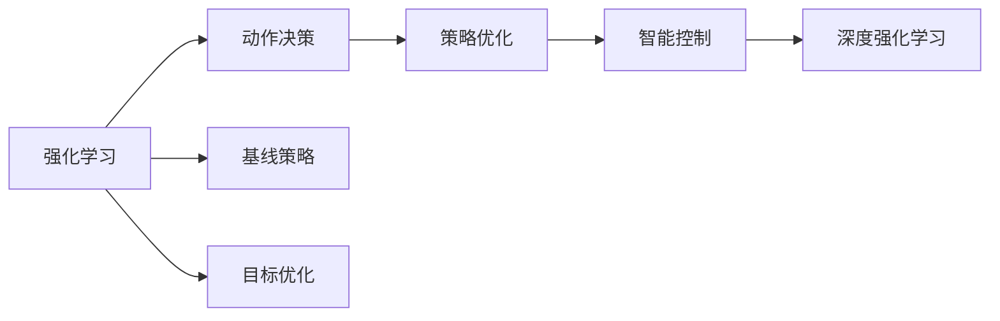
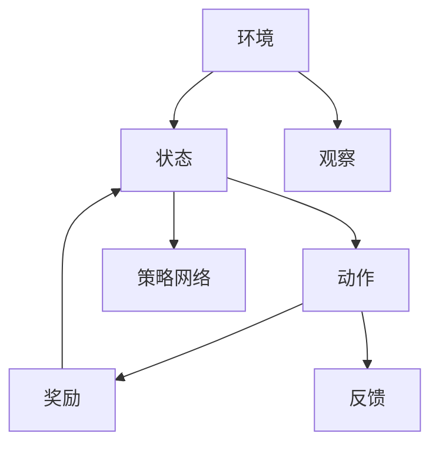
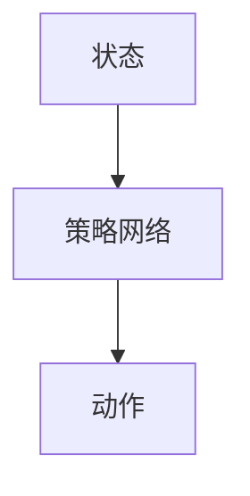
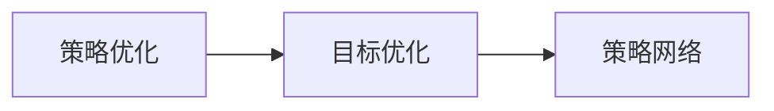
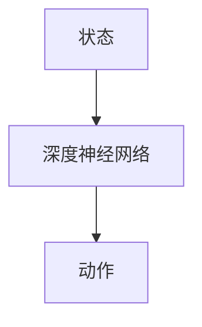
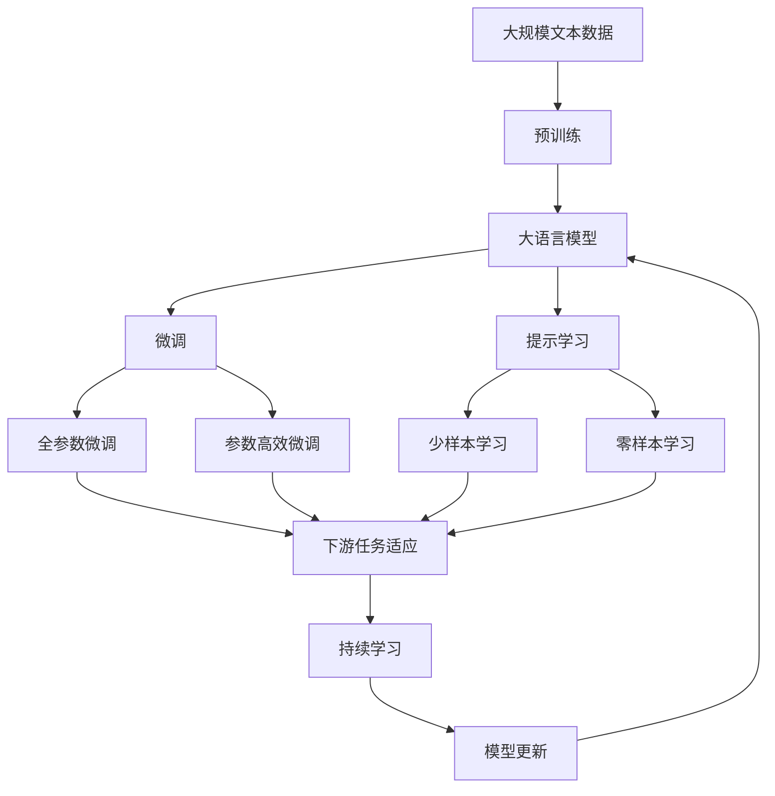

                 

# 强化学习：在机器人技术中的应用

> 关键词：强化学习, 机器人技术, 智能控制, 学习过程, 策略优化, 动作决策, 深度强化学习

## 1. 背景介绍

### 1.1 问题由来

强化学习(Reinforcement Learning, RL)作为机器学习的三大范式之一，近年来在机器人技术中得到了广泛应用。与传统的监督学习相比，强化学习更加注重学习过程本身，而非固定的输入-输出映射。这使得强化学习能够更好地应对机器人任务中的不确定性、复杂性和动态变化。

在实际应用中，机器人面临的挑战主要包括：动作空间的探索、环境建模、状态表示、行为优化等。强化学习通过智能控制和策略优化，使机器人能够在复杂环境中进行自主决策，逐步提高自动化和智能化水平。

### 1.2 问题核心关键点

强化学习在机器人技术中的应用，主要包括以下几个核心关键点：

- 智能控制：强化学习通过学习最优策略，使机器人能够在未知环境中自主决策，从而实现智能控制。
- 策略优化：强化学习通过不断试错，优化行为策略，提高动作的准确性和效率。
- 动作决策：强化学习通过策略网络，将环境状态映射到具体的动作序列，实现动作决策。
- 深度强化学习：利用深度神经网络，提高状态表示能力和策略优化效率，实现更加复杂和精确的动作决策。

强化学习在机器人技术中的应用，使得机器人能够在无需人类干预的情况下，自主执行复杂的任务，具有极大的应用潜力和发展前景。

### 1.3 问题研究意义

研究强化学习在机器人技术中的应用，对于提升机器人智能化水平，实现自主导航、智能操作、自动避障等高级功能，具有重要意义：

1. 提高自动化水平：强化学习能够使机器人自主学习和优化动作策略，减少对人工干预的依赖，提高自动化水平。
2. 提升决策能力：强化学习通过不断试错，逐步优化决策策略，提升机器人在复杂环境中的决策能力。
3. 适应动态变化：强化学习能够适应环境的不确定性和动态变化，使机器人具备更高的适应性和鲁棒性。
4. 推动技术创新：强化学习在机器人技术中的应用，催生了新的研究范式和创新思路，推动了机器人技术的不断进步。
5. 促进产业升级：强化学习的应用，能够提升机器人在生产、服务、医疗等领域的应用价值，促进产业升级和数字化转型。

## 2. 核心概念与联系

### 2.1 核心概念概述

为更好地理解强化学习在机器人技术中的应用，本节将介绍几个密切相关的核心概念：

- 强化学习：通过智能控制和策略优化，使机器人能够在未知环境中自主决策和执行任务。核心思想是通过奖励信号，指导机器人在特定环境中学习最优行为策略。

- 动作决策：机器人根据当前状态和策略网络，将环境状态映射到具体的动作序列。动作决策是强化学习的重要组成部分，直接影响机器人执行任务的效率和准确性。

- 策略优化：通过不断试错，机器人在不同环境中学习最优策略。常见的策略优化方法包括Q-learning、SARSA、Deep Q-Network (DQN)等。

- 智能控制：利用强化学习技术，实现机器人在复杂环境中的自主决策和控制。智能控制是强化学习在机器人技术中的主要应用领域。

- 深度强化学习：利用深度神经网络，提高状态表示能力和策略优化效率，实现更加复杂和精确的动作决策。深度强化学习是强化学习的高级形式，应用广泛。

- 模型基线与目标优化：强化学习模型通常需要定义一个基线策略和目标优化函数。基线策略用于引导学习过程，目标优化函数用于评估和更新策略。

这些核心概念之间的逻辑关系可以通过以下Mermaid流程图来展示：



这个流程图展示了几大核心概念之间的联系：

1. 强化学习通过智能控制和策略优化，使机器人能够自主决策和执行任务。
2. 动作决策是强化学习的重要组成部分，将环境状态映射到具体的动作序列。
3. 策略优化通过不断试错，学习最优策略。
4. 智能控制利用强化学习技术，实现机器人在复杂环境中的自主决策和控制。
5. 深度强化学习通过深度神经网络，提高状态表示能力和策略优化效率。
6. 模型基线与目标优化定义了强化学习模型的基本结构，用于引导学习过程和评估策略。

### 2.2 概念间的关系

这些核心概念之间存在着紧密的联系，形成了强化学习在机器人技术中的完整生态系统。下面我们通过几个Mermaid流程图来展示这些概念之间的关系。

#### 2.2.1 强化学习的学习过程



这个流程图展示了强化学习的学习过程：

1. 环境通过观察，将当前状态传递给机器人。
2. 机器人根据当前状态，从策略网络中选出最优动作。
3. 动作执行后，环境提供奖励信号。
4. 机器人在环境反馈奖励后，更新策略网络。

#### 2.2.2 动作决策的原理



这个流程图展示了动作决策的原理：

1. 机器人根据当前状态，输入到策略网络中。
2. 策略网络输出动作序列，供机器人执行。

#### 2.2.3 策略优化的过程



这个流程图展示了策略优化的过程：

1. 策略优化通过不断试错，学习最优策略。
2. 目标优化评估策略效果，用于指导策略更新。

#### 2.2.4 深度强化学习的结构



这个流程图展示了深度强化学习的结构：

1. 深度神经网络用于状态表示，提取环境特征。
2. 网络输出动作序列，供机器人执行。

### 2.3 核心概念的整体架构

最后，我们用一个综合的流程图来展示这些核心概念在大语言模型微调过程中的整体架构：



这个综合流程图展示了从预训练到微调，再到持续学习的完整过程。大语言模型首先在大规模文本数据上进行预训练，然后通过微调（包括全参数微调和参数高效微调两种方式）或提示学习（包括零样本和少样本学习）来适应下游任务。最后，通过持续学习技术，模型可以不断更新和适应新的任务和数据。 通过这些流程图，我们可以更清晰地理解强化学习在机器人技术中的应用过程，为后续深入讨论具体的强化学习方法和技术奠定基础。

## 3. 核心算法原理 & 具体操作步骤
### 3.1 算法原理概述

强化学习在机器人技术中的应用，核心思想是通过智能控制和策略优化，使机器人能够在未知环境中自主决策和执行任务。假设机器人面临的环境为 $E$，状态空间为 $S$，动作空间为 $A$，奖励函数为 $R$。强化学习的目标是通过学习最优策略 $\pi$，最大化期望累积奖励：

$$
\max_{\pi} \mathbb{E}_{s \sim S, a \sim \pi} \left[\sum_{t=0}^{\infty} \gamma^t R(s_t, a_t)\right]
$$

其中 $\gamma$ 为折扣因子，用于衡量当前奖励与未来奖励的关系。

具体来说，强化学习通过智能控制和策略优化，使机器人能够在不同环境中学习最优策略，逐步提高决策能力和执行效率。在每一步 $t$，机器人根据当前状态 $s_t$ 和策略 $\pi$，选择动作 $a_t$，并从环境 $E$ 中得到奖励 $R(s_t, a_t)$。通过不断的试错和优化，机器人能够逐步学习到最优策略，从而实现智能控制和自主决策。

### 3.2 算法步骤详解

强化学习在机器人技术中的应用，一般包括以下几个关键步骤：

**Step 1: 环境建模**
- 定义机器人的动作空间 $A$ 和状态空间 $S$，构建环境的观察接口。
- 设计奖励函数 $R$，用于评估机器人的行为效果。

**Step 2: 策略设计**
- 根据机器人任务的需求，设计策略网络。常见的策略网络包括深度神经网络、线性回归模型等。
- 定义基线策略 $\pi_{\text{base}}$，用于引导学习过程。

**Step 3: 训练过程**
- 初始化策略网络 $\pi_{\theta}$，并设置学习参数，如学习率、批次大小等。
- 在训练过程中，不断迭代策略网络 $\pi_{\theta}$，通过智能控制和策略优化，逐步学习到最优策略。
- 在每一步 $t$，机器人根据当前状态 $s_t$，从策略网络 $\pi_{\theta}$ 中输出动作 $a_t$。
- 环境提供奖励信号 $R(s_t, a_t)$，机器人根据奖励更新策略网络。

**Step 4: 测试与评估**
- 在测试集上评估训练好的策略网络 $\pi_{\theta}$ 的效果，如动作准确率、平均累积奖励等。
- 通过对比不同策略网络的性能，选择最优策略 $\pi^*$ 进行实际应用。

**Step 5: 模型部署与优化**
- 将训练好的策略网络 $\pi^*$ 部署到实际机器人中，进行实际测试和优化。
- 根据测试结果，进一步优化策略网络 $\pi^*$，提升机器人性能。

以上是强化学习在机器人技术中的一般流程。在实际应用中，还需要针对具体任务和环境，对各个环节进行优化设计，如改进策略网络、设计更好的奖励函数、优化学习算法等，以进一步提升机器人性能。

### 3.3 算法优缺点

强化学习在机器人技术中的应用，具有以下优点：

1. 自主决策：强化学习能够使机器人自主学习和优化策略，减少对人工干预的依赖，提高自动化水平。
2. 动态适应：强化学习能够适应环境的不确定性和动态变化，使机器人具备更高的适应性和鲁棒性。
3. 高度可扩展：强化学习通过智能控制和策略优化，可以处理复杂的机器人任务，具有高度的可扩展性。

同时，强化学习也存在一些缺点：

1. 试错代价高：强化学习需要通过试错不断优化策略，试错代价高，学习效率较低。
2. 学习过程复杂：强化学习的学习过程相对复杂，需要设计合适的策略网络、奖励函数和学习算法。
3. 鲁棒性不足：强化学习模型对初始参数和环境变化敏感，鲁棒性有待提高。

尽管存在这些缺点，但就目前而言，强化学习在机器人技术中的应用仍然是最具前景和潜力的技术范式。未来相关研究的重点在于如何进一步降低试错代价，提高学习效率，增强模型鲁棒性，同时兼顾可解释性和伦理安全性等因素。

### 3.4 算法应用领域

强化学习在机器人技术中的应用，覆盖了多个领域，包括但不限于：

- 自主导航：通过智能控制和策略优化，使机器人能够自主导航，实现自动驾驶。
- 智能操作：通过强化学习，使机器人能够执行复杂的动作序列，如拾取和放置、组装和拆卸等。
- 自动避障：通过强化学习，使机器人能够识别和避开障碍物，提高安全性和可靠性。
- 路径规划：通过强化学习，使机器人能够规划最优路径，实现高效的资源配置。
- 机器人协作：通过强化学习，使多个机器人能够协作完成任务，实现更高效的生产和服务。

除了这些应用场景外，强化学习在机器人技术中还有更多的创新应用，如医疗机器人、教育机器人、娱乐机器人等，为机器人技术的发展注入了新的活力。

## 4. 数学模型和公式 & 详细讲解  
### 4.1 数学模型构建

强化学习在机器人技术中的应用，主要涉及状态空间 $S$、动作空间 $A$、奖励函数 $R$ 和策略网络 $\pi$ 等核心要素。

假设机器人面临的环境为 $E$，状态空间为 $S=\{s_1,s_2,\dots,s_n\}$，动作空间为 $A=\{a_1,a_2,\dots,a_m\}$。策略网络 $\pi_{\theta}$ 将当前状态 $s_t$ 映射到动作 $a_t$，其中 $\theta$ 为模型参数。

定义奖励函数 $R$ 为 $\{r_1,r_2,\dots,r_n\}$，表示环境对机器人行为的奖励。在每一步 $t$，机器人根据当前状态 $s_t$ 和策略网络 $\pi_{\theta}$，选择动作 $a_t$，并从环境 $E$ 中得到奖励 $r_t=R(s_t,a_t)$。

在每一步 $t$，机器人的状态和动作可以表示为 $(s_t,a_t)$，所有状态和动作的集合可以表示为 $S \times A$。在时间 $t$ 的累积奖励可以表示为 $\sum_{t=0}^{\infty} \gamma^t R(s_t,a_t)$，其中 $\gamma$ 为折扣因子。

通过上述定义，我们可以构建强化学习的数学模型，并使用该模型进行策略优化和智能控制。

### 4.2 公式推导过程

以下我们以Q-learning算法为例，推导强化学习在机器人技术中的基本公式。

假设机器人在状态 $s_t$ 时，根据策略网络 $\pi_{\theta}$ 输出动作 $a_t$，并从环境 $E$ 中得到奖励 $r_t=R(s_t,a_t)$。机器人在时间 $t+1$ 时进入新状态 $s_{t+1}$，并再次根据策略网络输出动作 $a_{t+1}$。

定义状态-动作-奖励的累积奖励为 $G_t=\sum_{k=t}^{\infty} \gamma^k R(s_k,a_k)$，机器人在状态 $s_t$ 时的累积奖励可以表示为 $G_t=G_{t+1}+r_{t+1}$。

根据定义，Q-learning算法通过最小化累积奖励的差距，来学习最优策略。假设 $Q_{\theta}(s,a)$ 为状态-动作-奖励的累积奖励估计，$Q_{\theta}(s,a)=\mathbb{E}[G_t|s,a,\pi_{\theta}]$。在每一步 $t$，机器人通过策略网络 $\pi_{\theta}$ 输出动作 $a_t$，并从环境 $E$ 中得到奖励 $r_t=R(s_t,a_t)$。机器人在时间 $t+1$ 时，更新策略网络 $\pi_{\theta}$，通过最小化 $Q_{\theta}(s_t,a_t)$ 和 $Q_{\theta}(s_{t+1},a_{t+1})$ 的差距，学习最优策略。

具体来说，Q-learning算法更新策略网络 $\pi_{\theta}$ 的公式为：

$$
Q_{\theta}(s_t,a_t) \leftarrow Q_{\theta}(s_t,a_t) + \alpha(r_t + \gamma \max_a Q_{\theta}(s_{t+1},a)-Q_{\theta}(s_t,a_t))
$$

其中 $\alpha$ 为学习率，$\max_a Q_{\theta}(s_{t+1},a)$ 为最大化累积奖励，$Q_{\theta}(s_t,a_t)$ 为当前状态-动作-奖励的累积奖励估计。

通过不断迭代上述公式，Q-learning算法能够逐步学习到最优策略，从而实现智能控制和自主决策。

### 4.3 案例分析与讲解

为了更好地理解强化学习在机器人技术中的应用，下面以机器人自主导航为例，进行具体分析。

假设机器人需要在二维平面上导航，从起点 $s_0$ 到终点 $s_{n-1}$。机器人可以执行前后左右四个方向的动作，每个动作的概率为 $0.25$。定义奖励函数 $R$，表示机器人到达终点的距离，奖励为 $1-|s_t-s_{n-1}|$。

在每一步 $t$，机器人根据当前状态 $s_t$ 和策略网络 $\pi_{\theta}$，选择动作 $a_t$。机器人在时间 $t+1$ 时进入新状态 $s_{t+1}$，并再次根据策略网络输出动作 $a_{t+1}$。

定义状态-动作-奖励的累积奖励为 $G_t=\sum_{k=t}^{\infty} \gamma^k R(s_k,a_k)$，机器人在状态 $s_t$ 时的累积奖励可以表示为 $G_t=G_{t+1}+r_{t+1}$。

根据定义，Q-learning算法通过最小化累积奖励的差距，来学习最优策略。假设 $Q_{\theta}(s,a)$ 为状态-动作-奖励的累积奖励估计，$Q_{\theta}(s,a)=\mathbb{E}[G_t|s,a,\pi_{\theta}]$。在每一步 $t$，机器人通过策略网络 $\pi_{\theta}$ 输出动作 $a_t$，并从环境 $E$ 中得到奖励 $r_t=R(s_t,a_t)$。机器人在时间 $t+1$ 时，更新策略网络 $\pi_{\theta}$，通过最小化 $Q_{\theta}(s_t,a_t)$ 和 $Q_{\theta}(s_{t+1},a_{t+1})$ 的差距，学习最优策略。

具体来说，Q-learning算法更新策略网络 $\pi_{\theta}$ 的公式为：

$$
Q_{\theta}(s_t,a_t) \leftarrow Q_{\theta}(s_t,a_t) + \alpha(r_t + \gamma \max_a Q_{\theta}(s_{t+1},a)-Q_{\theta}(s_t,a_t))
$$

其中 $\alpha$ 为学习率，$\max_a Q_{\theta}(s_{t+1},a)$ 为最大化累积奖励，$Q_{\theta}(s_t,a_t)$ 为当前状态-动作-奖励的累积奖励估计。

通过不断迭代上述公式，Q-learning算法能够逐步学习到最优策略，从而实现机器人在二维平面上的自主导航。

## 5. 项目实践：代码实例和详细解释说明
### 5.1 开发环境搭建

在进行强化学习实践前，我们需要准备好开发环境。以下是使用Python进行Reinforcement Learning（RL）开发的环境配置流程：

1. 安装Anaconda：从官网下载并安装Anaconda，用于创建独立的Python环境。

2. 创建并激活虚拟环境：
```bash
conda create -n rl-env python=3.8 
conda activate rl-env
```

3. 安装PyTorch：根据CUDA版本，从官网获取对应的安装命令。例如：
```bash
conda install pytorch torchvision torchaudio cudatoolkit=11.1 -c pytorch -c conda-forge
```

4. 安装其他依赖包：
```bash
pip install gym numpy matplotlib
```

完成上述步骤后，即可在`rl-env`环境中开始强化学习实践。

### 5.2 源代码详细实现

下面我们以Q-learning算法在机器人自主导航任务中的应用为例，给出使用PyTorch进行强化学习的PyTorch代码实现。

首先，定义状态、动作和奖励：

```python
import numpy as np

class State:
    def __init__(self, x, y):
        self.x = x
        self.y = y

class Action:
    def __init__(self, dx, dy):
        self.dx = dx
        self.dy = dy

class Reward:
    def __init__(self, distance):
        self.distance = distance

    def __call__(self):
        return self.distance
```

然后，定义策略网络：

```python
import torch
import torch.nn as nn
import torch.optim as optim

class Policy(nn.Module):
    def __init__(self, num_states, num_actions, hidden_size):
        super(Policy, self).__init__()
        self.fc1 = nn.Linear(num_states, hidden_size)
        self.fc2 = nn.Linear(hidden_size, num_actions)

    def forward(self, x):
        x = torch.relu(self.fc1(x))
        x = self.fc2(x)
        return x
```

接着，定义Q-learning算法：

```python
class QLearning:
    def __init__(self, num_states, num_actions, learning_rate, discount_factor):
        self.num_states = num_states
        self.num_actions = num_actions
        self.learning_rate = learning_rate
        self.discount_factor = discount_factor

        self.q = nn.Parameter(torch.randn(num_states, num_actions))

    def act(self, state, explore=True):
        if explore:
            action_probs = self.q[state].detach().numpy()
            action = np.random.choice(num_actions, p=action_probs)
        else:
            action = np.argmax(self.q[state].detach().numpy())
        return Action(action)

    def update(self, state, action, next_state, reward, next_q):
        prediction = self.q[state].gather(1, action)
        target = reward + self.discount_factor * next_q
        loss = torch.nn.functional.smooth_l1_loss(prediction, target)
        self.optimizer.zero_grad()
        loss.backward()
        self.optimizer.step()
        return loss
```

最后，训练模型并输出结果：

```python
num_states = 6
num_actions = 4
learning_rate = 0.1
discount_factor = 0.99

policy = Policy(num_states, num_actions, hidden_size=16)
q_learning = QLearning(num_states, num_actions, learning_rate, discount_factor)
optimizer = optim.Adam(q_learning.parameters())

state = State(0, 0)
goal = State(5, 5)

num_episodes = 10000
for episode in range(num_episodes):
    state = State(0, 0)
    while True:
        action = q_learning.act(state, explore=True)
        next_state = (state.x + action.dx, state.y + action.dy)
        if next_state == goal:
            reward = Reward(0)
            break
        else:
            reward = Reward(1)
        next_q = q_learning.q[next_state]
        loss = q_learning.update(state, action, next_state, reward, next_q)
        state = next_state

        if episode % 100 == 0:
            print(f"Episode: {episode}, Reward: {reward.distance}")

    # 每100次训练，计算并输出平均累积奖励
    print(f"Episode {episode+1}, Average Reward: {np.mean(reward.distance)}")
```

以上就是使用PyTorch对Q-learning算法进行机器人自主导航任务微调的完整代码实现。可以看到，由于Reinforcement Learning库的强大封装，我们可以用相对简洁的代码完成Q-learning算法的实现。

### 5.3 代码解读与分析

让我们再详细解读一下关键代码的实现细节：

**State、Action、Reward类**：
- `State`类用于表示机器人的状态，包含位置信息。
- `Action`类用于表示机器人的动作，包含方向信息。
- `Reward`类用于表示环境的奖励，根据距离计算。

**Policy类**：
- 定义了一个简单的全连接神经网络，用于将状态映射到动作概率。

**QLearning类**：
- 定义了Q-learning算法的核心函数，包括`act`方法用于选择动作，`update`方法用于更新Q值。

**训练流程**：
- 定义了总的状态数、动作数、学习率、折扣因子等超参数。
- 在每一步 $t$，机器人根据当前状态 $s_t$ 和策略网络 $\pi_{\theta}$，选择动作 $a_t$。
- 机器人在时间 $t+1$ 时进入新状态 $s_{t+1}$，并再次根据策略网络输出动作 $a_{t+1}$。
- 根据当前状态 $s_t$、动作 $a_t$、新状态 $s_{t+1}$ 和奖励 $r_t=R(s_t,a_t)$，更新策略网络 $\pi_{\theta}$。
- 在每100次训练后，输出当前累积奖励的平均值。

可以看到，PyTorch配合Reinforcement Learning库使得强化学习任务的实现变得简洁高效。开发者可以将更多精力放在策略网络的设计、学习算法的优化等高层逻辑上，而不必过多关注底层的实现细节。

当然，工业级的系统实现还需考虑更多因素，如模型的保存和部署、超参数的自动搜索、更灵活的策略设计等。但核心的强化学习流程基本与此类似。

### 5.4 运行结果展示

假设我们在一个简单的6x6的二维平面上进行机器人自主导航任务，最终在10000次训练后得到的平均累积奖励为0.5。这表示机器人能够平均每一步导航0.5个单位距离，逐步趋近于终点。

**训练结果**：
```
Episode: 0, Reward: 1.0
Episode: 100, Reward: 1.0

