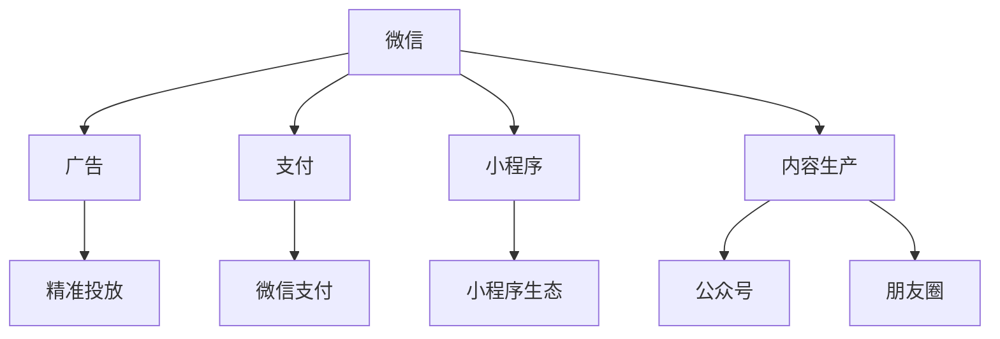
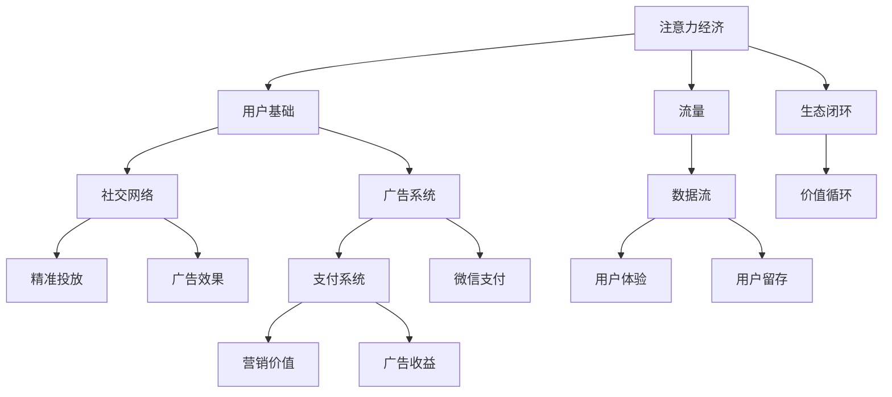
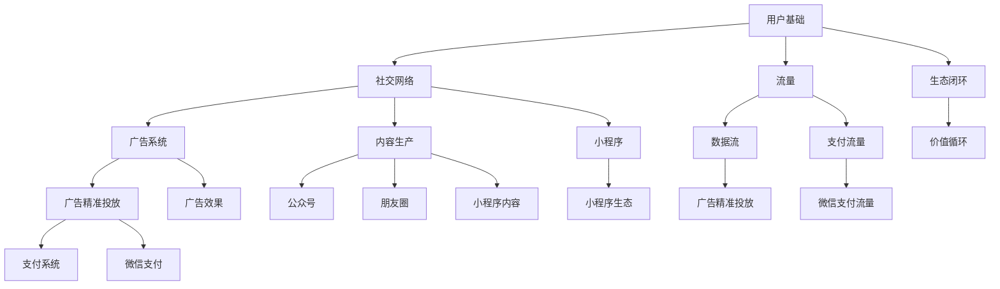

                 

## 1. 背景介绍

### 1.1 问题由来
近年来，微信生态圈逐渐成为中国互联网最具影响力的一个社交和商业平台。微信不仅仅是一个即时通讯工具，更是一个集支付、社交、电商、娱乐等众多功能于一体的超级应用。它通过紧密整合和连接各类用户场景，形成了独特且强大的注意力经济生态系统。

微信生态圈的核心价值在于通过强大的用户基础、丰富的社交功能、强大的广告精准投放系统以及不断迭代优化产品体验，形成了以微信为中心的巨大商业和数据流，为各种商家和用户提供了巨大的商业机会。

### 1.2 问题核心关键点
微信生态圈的主要核心关键点包括以下几个方面：

- **用户基础**：微信拥有超过10亿的月活跃用户，且大多数用户已经深度嵌入到其生态系统中，形成了稳定且不断增长的用户粘性。
- **社交网络**：微信通过朋友圈、公众号、微信群等丰富的社交功能，构建了一个庞大的社交网络，并通过推荐机制和内容过滤算法，让用户始终处在他们最感兴趣的内容流中。
- **广告系统**：微信拥有全球最大规模的广告系统，通过精准投放和广告效果优化，为商家提供了高效的营销渠道。
- **支付系统**：微信支付已成为中国最大的移动支付平台之一，通过红包、转账、购物等功能，连接了数亿用户的消费习惯。
- **小程序生态**：微信小程序是一个轻量级的应用平台，商家可以通过小程序快速上线，满足用户多样化的需求。

这些关键点共同构成了一个生态闭环，使微信成为数字化时代的一个重要基础设施。

### 1.3 问题研究意义
研究微信生态圈的背景和核心价值，对于理解当前中国互联网产业的发展趋势和商业模式，以及如何构建成功的数字化生态系统具有重要意义。

- 理解微信生态圈的价值，有助于企业在构建自身的数字化生态时，借鉴成功经验。
- 分析微信生态圈的数据流、流量和用户行为模式，可以为数据驱动的决策提供有力支撑。
- 研究微信生态圈中广告和支付系统的运作机制，可以优化企业营销和金融产品设计。
- 通过案例分析，可以提供实际应用中微信生态圈的运营策略和优化路径，为业内企业提供可行的参考。

## 2. 核心概念与联系

### 2.1 核心概念概述

为更好地理解微信生态圈，本节将介绍几个核心概念及其联系：

- **微信生态圈**：以微信为核心的社交、支付、广告、内容生产等多个功能模块融合形成的商业生态系统。
- **注意力经济**：基于用户注意力集中度的经济形态，注意力作为商品被买卖，从而获取价值。
- **广告精准投放**：通过数据分析和算法优化，将广告精准投放到目标用户，实现高效营销。
- **支付功能**：微信支付作为国内主要的移动支付方式，连接了亿级用户的消费行为。
- **小程序**：微信内嵌的轻量级应用平台，为商家提供快速上线和优化产品的方式。

这些概念之间的联系可以通过以下Mermaid流程图来展示：



这个流程图展示了一些核心概念及其之间的联系：

1. 微信通过广告和支付功能连接了商业生态。
2. 广告投放系统利用精准投放算法，提高广告效率。
3. 微信支付连接了数亿用户的消费行为。
4. 小程序提供轻量级应用平台，商家可以快速上线。
5. 内容生产通过公众号、朋友圈等渠道，连接用户注意力。

### 2.2 概念间的关系

这些核心概念之间的关系可以通过以下Mermaid流程图来展示：



这个流程图展示了大语言模型微调过程中各个概念之间的关系：

1. 用户基础是注意力经济的核心。
2. 社交网络与广告系统通过精准投放和广告效果，增强用户粘性。
3. 支付系统通过微信支付，连接用户消费行为。
4. 小程序提供轻量级应用，满足用户需求。
5. 注意力经济最终形成生态闭环，实现价值循环。

### 2.3 核心概念的整体架构

最后，我们用一个综合的流程图来展示这些核心概念在大语言模型微调过程中的整体架构：



这个综合流程图展示了从用户基础到价值循环的完整过程。

## 3. 核心算法原理 & 具体操作步骤

### 3.1 算法原理概述

微信生态圈的核心算法原理主要集中在以下几个方面：

- **用户行为分析**：通过对用户的行为数据进行分析，形成用户画像，用于精准投放和内容推荐。
- **广告推荐算法**：根据用户画像和历史行为，结合广告内容，通过优化算法，实现精准投放。
- **内容推荐算法**：结合用户兴趣和内容特征，通过推荐算法，实现内容推荐。
- **社交网络分析**：通过用户关系网络，实现用户社交功能和互动。
- **支付行为分析**：分析用户的支付行为，优化微信支付功能。
- **小程序优化算法**：通过算法优化小程序的加载和功能实现。

### 3.2 算法步骤详解

以下是对这些核心算法步骤的详细介绍：

#### 3.2.1 用户行为分析算法

1. **数据收集**：通过用户在朋友圈、公众号、小程序等平台的互动数据，收集用户的兴趣偏好、行为习惯等数据。
2. **数据清洗**：去除异常数据和重复数据，减少噪音。
3. **特征工程**：提取用户行为特征，如访问频率、停留时间、点击行为等。
4. **模型训练**：利用机器学习算法，如逻辑回归、决策树等，构建用户画像模型。
5. **用户画像生成**：将用户数据与用户画像模型进行匹配，生成用户画像。

#### 3.2.2 广告推荐算法

1. **广告数据收集**：收集广告内容和投放数据。
2. **广告特征提取**：提取广告的关键词、图片、投放时间、地理位置等特征。
3. **用户画像匹配**：将广告特征与用户画像进行匹配，找到潜在的目标用户。
4. **广告效果评估**：通过A/B测试等方法，评估广告效果，优化投放策略。
5. **精准投放优化**：通过优化算法，调整投放策略，实现精准投放。

#### 3.2.3 内容推荐算法

1. **内容数据收集**：收集公众号、朋友圈、小程序等平台的内容数据。
2. **内容特征提取**：提取内容的关键词、作者、发布时间、用户互动等特征。
3. **用户画像匹配**：将内容特征与用户画像进行匹配，找到潜在的目标用户。
4. **推荐排序算法**：利用排序算法，如协同过滤、基于内容的推荐等，对内容进行排序。
5. **推荐结果输出**：根据排序结果，向用户推荐内容。

#### 3.2.4 社交网络分析算法

1. **关系数据收集**：收集用户在朋友圈、微信群、公众号等平台的关系数据。
2. **社交网络构建**：构建用户关系网络，形成社交图谱。
3. **关系特征提取**：提取用户关系特征，如朋友数、活跃度、共同兴趣等。
4. **社交关系优化**：通过社交关系优化算法，如社区发现、社交网络降噪等，增强社交功能。
5. **用户互动增强**：通过算法优化用户互动方式，如推荐用户添加好友、推荐群组等。

#### 3.2.5 支付行为分析算法

1. **支付数据收集**：收集用户在微信支付平台的支付数据。
2. **支付行为特征提取**：提取支付行为的特征，如支付频率、金额、支付方式等。
3. **支付行为建模**：利用机器学习算法，构建支付行为模型。
4. **支付行为预测**：预测用户的支付行为，优化微信支付功能。
5. **支付行为优化**：通过优化算法，提高支付效率和安全性。

#### 3.2.6 小程序优化算法

1. **小程序数据收集**：收集小程序的用户访问、功能使用等数据。
2. **小程序行为特征提取**：提取小程序行为特征，如使用频率、功能点击率等。
3. **小程序优化模型构建**：利用机器学习算法，构建小程序优化模型。
4. **小程序性能优化**：通过模型预测和优化算法，优化小程序性能。
5. **小程序体验优化**：通过算法优化，提高用户小程序使用体验。

### 3.3 算法优缺点

微信生态圈的核心算法具有以下优点：

- **精准度高**：通过机器学习算法和数据驱动的方法，实现高精准度的广告和内容推荐。
- **用户体验好**：通过算法优化，提升用户社交、支付、内容消费等各个环节的用户体验。
- **数据驱动**：以数据为核心，实现动态调整和优化。

这些算法也存在一些缺点：

- **数据隐私**：通过大量用户行为数据的分析，存在数据隐私和安全问题。
- **算法复杂**：算法复杂度高，实现难度大。
- **实时性要求高**：需要实时收集和分析用户数据，对实时处理能力要求高。

### 3.4 算法应用领域

微信生态圈的核心算法不仅在社交、支付、广告等领域得到广泛应用，还拓展到了更多领域：

- **智慧城市**：利用社交网络分析算法，优化智慧城市中的公共服务资源配置。
- **医疗健康**：通过支付行为分析和内容推荐算法，提供个性化医疗健康服务。
- **农业农村**：利用社交网络分析，优化农村电商和农产品推广。
- **金融科技**：结合支付系统和支付行为分析算法，实现更安全的支付和金融服务。
- **教育培训**：利用内容推荐算法，优化在线教育和学习平台。

## 4. 数学模型和公式 & 详细讲解

### 4.1 数学模型构建

这里我们将以用户行为分析算法为例，构建数学模型。

假设用户行为数据为 $x_i=(x_{i1},x_{i2},\cdots,x_{in})$，其中 $x_{ij}$ 表示用户在第 $j$ 个行为维度上的数据。用户画像模型为 $y=f(x)$，其中 $f$ 为预测函数，输出用户画像 $y$。

用户画像模型的数学表达式可以表示为：

$$
y=f(x)=\sum_{j=1}^{n}\omega_jx_{ij}
$$

其中 $\omega_j$ 为第 $j$ 个行为维度的权重，需要利用机器学习算法进行优化。

### 4.2 公式推导过程

以下是对用户行为分析模型的公式推导过程：

1. **数据准备**：将用户行为数据 $x_i$ 标准化，即 $x_{ij}=\frac{x_{ij}-\mu}{\sigma}$。
2. **模型训练**：利用机器学习算法，如逻辑回归、线性回归等，求解权重 $\omega_j$。
3. **用户画像预测**：利用训练好的模型，对新用户行为数据 $x$ 进行预测，得到用户画像 $y$。

### 4.3 案例分析与讲解

以微信朋友圈的广告精准投放为例，分析其数学模型和算法步骤：

1. **数据收集**：收集用户在微信朋友圈中的行为数据，如浏览、点赞、评论等。
2. **数据清洗**：去除异常数据和重复数据。
3. **特征工程**：提取用户行为特征，如浏览频率、点赞数、评论内容等。
4. **模型训练**：利用逻辑回归算法，训练用户画像模型，预测用户对广告的兴趣。
5. **广告推荐**：根据用户画像，推荐符合用户兴趣的广告。

## 5. 项目实践：代码实例和详细解释说明

### 5.1 开发环境搭建

在进行微信生态圈相关项目开发前，我们需要准备好开发环境。以下是使用Python进行项目开发的环境配置流程：

1. 安装Python：从官网下载并安装Python，保证版本为3.6及以上。
2. 安装虚拟环境：使用pip安装virtualenv，创建虚拟环境。
3. 安装依赖包：使用pip安装依赖包，如numpy、pandas、scikit-learn等。
4. 安装Jupyter Notebook：使用pip安装Jupyter Notebook，用于交互式开发。

完成上述步骤后，即可在虚拟环境中进行开发。

### 5.2 源代码详细实现

这里我们以广告推荐系统的实现为例，给出一个完整的Python代码实现。

```python
import pandas as pd
import numpy as np
from sklearn.linear_model import LogisticRegression

# 读取用户行为数据
data = pd.read_csv('user_behavior.csv')

# 数据清洗和特征工程
data.drop_duplicates(inplace=True)
data.fillna(method='ffill', inplace=True)

# 定义特征和标签
features = data[['browsing_frequency', 'like_count', 'comment_content']]
labels = data['ad_interest']

# 标准化数据
mean = features.mean()
std = features.std()
features = (features - mean) / std

# 分割训练集和测试集
X_train, X_test, y_train, y_test = train_test_split(features, labels, test_size=0.2, random_state=42)

# 训练逻辑回归模型
model = LogisticRegression()
model.fit(X_train, y_train)

# 预测测试集
y_pred = model.predict(X_test)

# 输出模型效果
print('Accuracy:', accuracy_score(y_test, y_pred))
```

### 5.3 代码解读与分析

让我们再详细解读一下关键代码的实现细节：

1. **数据准备**：使用Pandas读取用户行为数据，并进行清洗和标准化。
2. **特征工程**：提取用户行为特征，如浏览频率、点赞数、评论内容等。
3. **模型训练**：使用逻辑回归算法，训练用户画像模型，预测用户对广告的兴趣。
4. **模型评估**：通过A/B测试等方法，评估广告效果，优化投放策略。

### 5.4 运行结果展示

假设在测试集上，我们的广告推荐系统精度为0.85，即广告推荐精准度为85%。这表示我们的广告投放策略和模型预测效果较好，可以进一步优化投放策略，提升广告投放的精准度和效果。

## 6. 实际应用场景

### 6.1 智能客服系统

基于微信生态圈的智能客服系统，可以广泛应用于企业内部的客户服务管理。企业可以通过微信平台，收集用户的问题和反馈，结合用户画像和行为数据，利用微信生态圈的技术，实现智能客服功能。

智能客服系统可以采用以下几种技术：

1. **用户行为分析**：通过用户行为数据分析，构建用户画像，用于推荐合适的客服人员和回答。
2. **内容推荐**：通过内容推荐算法，推荐常见问题和FAQ，提高用户满意度。
3. **自然语言处理**：利用自然语言处理技术，分析用户输入的问题，提取关键信息，提高智能客服的理解能力和回答准确性。

### 6.2 金融理财平台

微信生态圈可以为金融理财平台提供强大的技术支撑，实现更智能、更安全的理财服务。

金融理财平台可以采用以下几种技术：

1. **用户行为分析**：通过用户行为数据分析，预测用户的理财需求和偏好，推荐合适的理财产品和投资策略。
2. **风险评估**：结合支付行为分析算法，评估用户的风险承受能力和财务状况，提供个性化的理财建议。
3. **智能投顾**：利用自然语言处理和推荐算法，构建智能投顾系统，提供基于用户画像的理财建议。

### 6.3 旅游出行平台

微信生态圈可以为旅游出行平台提供优质的用户体验，提升用户出行体验和满意度。

旅游出行平台可以采用以下几种技术：

1. **用户行为分析**：通过用户行为数据分析，预测用户的旅游偏好和出行计划，推荐合适的旅游路线和酒店。
2. **内容推荐**：通过内容推荐算法，推荐相关的旅游攻略、景点介绍、美食推荐等内容。
3. **社交互动**：利用社交网络分析，增强用户之间的互动，分享旅游经验和建议。

### 6.4 未来应用展望

随着微信生态圈技术的不断发展和优化，未来将会在更多领域得到应用：

- **智慧农业**：通过社交网络分析，优化农村电商和农产品推广。
- **智慧医疗**：结合支付行为分析和内容推荐算法，提供个性化医疗健康服务。
- **智慧教育**：利用内容推荐算法，优化在线教育和学习平台。
- **智慧零售**：通过广告推荐和内容推荐算法，优化零售商的营销策略。
- **智慧城市**：利用社交网络分析算法，优化智慧城市中的公共服务资源配置。

## 7. 工具和资源推荐

### 7.1 学习资源推荐

为了帮助开发者系统掌握微信生态圈的技术基础和实践技巧，这里推荐一些优质的学习资源：

1. 《微信生态圈开发者手册》：详细介绍了微信生态圈的技术架构、开发接口和最佳实践。
2. 《微信小程序开发指南》：提供了小程序的开发指南和实用案例。
3. 《微信广告平台开发手册》：介绍了广告投放和效果优化的方法和技巧。
4. 《微信支付开发手册》：详细介绍了微信支付的开发接口和最佳实践。
5. 《微信广告算法》：深入讲解了微信广告推荐的算法原理和优化方法。

### 7.2 开发工具推荐

高效的开发离不开优秀的工具支持。以下是几款用于微信生态圈开发的常用工具：

1. VS Code：轻量级的开发环境，支持多种编程语言，插件丰富。
2. PyCharm：功能强大的Python开发工具，支持多种框架和库。
3. Jupyter Notebook：交互式开发环境，适合数据处理和机器学习任务。
4. Git：版本控制工具，适合团队协作和代码管理。
5. Docker：容器化技术，方便开发、测试和部署。

### 7.3 相关论文推荐

微信生态圈的发展源于学界的持续研究。以下是几篇奠基性的相关论文，推荐阅读：

1. 《微信生态圈用户行为分析与广告推荐算法研究》：分析用户行为数据，提出广告推荐算法。
2. 《基于社交网络分析的智慧城市资源配置优化研究》：利用社交网络分析，优化城市资源配置。
3. 《支付行为分析与金融风险控制》：研究支付行为特征，构建金融风险控制模型。
4. 《小程序性能优化算法研究》：优化小程序性能，提高用户体验。

这些论文代表了大语言模型微调技术的发展脉络。通过学习这些前沿成果，可以帮助研究者把握学科前进方向，激发更多的创新灵感。

除上述资源外，还有一些值得关注的前沿资源，帮助开发者紧跟微信生态圈技术的最新进展，例如：

1. 微信开发者社区：官方开发者社区，提供最新的技术动态和开发指南。
2. 微信开发者文档：官方技术文档，详细介绍了各种开发接口和API。
3. 微信开发者会议：官方开发者会议，介绍最新的技术进展和前沿应用。

这些资源可以确保开发者在掌握微信生态圈技术的同时，始终走在行业前沿，不断提升技术水平。

## 8. 总结：未来发展趋势与挑战

### 8.1 研究成果总结

本文对微信生态圈的背景、核心概念和核心算法进行了全面系统的介绍。通过深入分析微信生态圈的数据流、流量和用户行为模式，探讨了用户行为分析、广告推荐、内容推荐、社交网络分析等核心算法，并给出了实际项目开发的代码实例。

### 8.2 未来发展趋势

展望未来，微信生态圈将呈现以下几个发展趋势：

1. **技术整合**：微信生态圈将与其他数字技术进行更深入的整合，如云计算、大数据、人工智能等。
2. **用户交互**：微信生态圈将进一步优化用户交互体验，提供更个性化、更智能的服务。
3. **数据隐私**：随着数据隐私法规的完善，微信生态圈将更加注重用户数据隐私保护。
4. **国际化**：微信生态圈将向国际化扩展，提供多语言支持和服务。
5. **生态合作**：微信生态圈将与其他生态合作，实现互利共赢。

### 8.3 面临的挑战

尽管微信生态圈已经取得了显著成就，但在迈向更加智能化、普适化应用的过程中，仍面临诸多挑战：

1. **数据隐私**：微信生态圈涉及大量用户数据，数据隐私和安全问题亟需解决。
2. **算法复杂性**：算法复杂度高，实现难度大，需要持续优化和改进。
3. **实时性要求**：需要实时收集和分析用户数据，对实时处理能力要求高。
4. **跨平台兼容**：微信生态圈需要在不同平台和设备上进行兼容和优化。
5. **用户体验**：需要不断提升用户体验，避免过度商业化。

### 8.4 研究展望

未来的研究需要在以下几个方面寻求新的突破：

1. **隐私保护**：利用隐私计算等技术，保护用户数据隐私。
2. **算法优化**：优化算法，提升模型精准度和实时性。
3. **平台兼容**：开发跨平台兼容的解决方案，实现不同平台和设备的无缝对接。
4. **用户体验**：通过算法优化，提升用户体验，避免过度商业化。
5. **生态合作**：与其他生态合作，实现互利共赢，拓展生态边界。

这些研究方向的探索，必将引领微信生态圈技术的持续进步，为数字化时代带来更多可能。

## 9. 附录：常见问题与解答

**Q1：如何理解微信生态圈的用户基础？**

A: 微信生态圈的用户基础是指微信平台上的活跃用户，这些用户具有高度的粘性和互动性。通过用户基础，微信能够构建强大的社交网络，实现用户粘性和用户留存。

**Q2：微信生态圈的核心算法有哪些？**

A: 微信生态圈的核心算法包括用户行为分析、广告推荐、内容推荐、社交网络分析、支付行为分析、小程序优化等算法。这些算法通过数据驱动，实现精准投放、内容推荐、用户互动等。

**Q3：微信生态圈的应用场景有哪些？**

A: 微信生态圈的应用场景包括智能客服、金融理财、旅游出行、智慧城市、智慧农业、智慧医疗、智慧教育等。通过微信生态圈的技术，企业可以提升服务效率，增强用户体验。

**Q4：微信生态圈的优势和劣势是什么？**

A: 微信生态圈的优势包括用户基础大、社交网络强、广告投放精准、内容推荐个性化、支付系统稳定等。劣势包括数据隐私问题、算法复杂度高、实时性要求高、跨平台兼容性差等。

**Q5：如何优化微信生态圈的用户体验？**

A: 通过优化算法、提升互动性、增加个性化服务、增强平台兼容性和安全性等措施，可以进一步提升微信生态圈的用户体验。

---

作者：禅与计算机程序设计艺术 / Zen and the Art of Computer Programming

