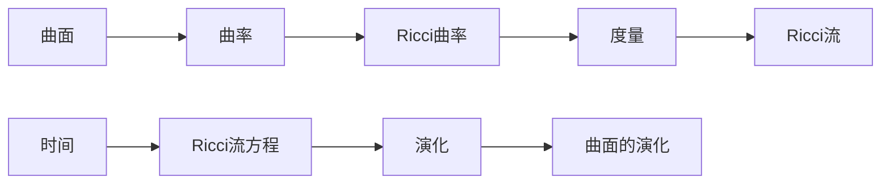
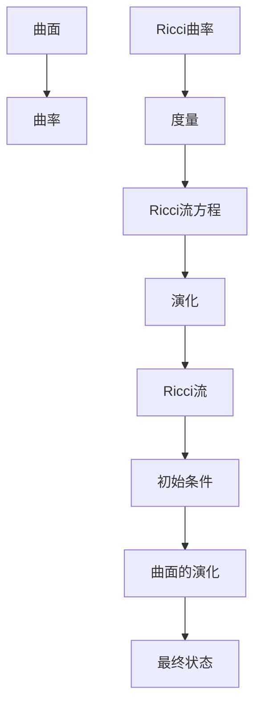

                 

## 1. 背景介绍

### 1.1 问题由来

微积分是数学中的重要分支，其研究的核心问题之一是曲线和曲面如何随时间演化。在数学物理中，这一问题尤为常见，例如描述热的传播、扩散过程等。

其中，**Ricci流**是一种在二维曲面上进行的研究，通过曲面上的曲率变化来描述曲面如何随时间演化。其最初是Ricci在1900年提出的，但直到Hamilton在1982年重新发现其重要性后，才得到了广泛的研究和应用。

Ricci流在微分几何、偏微分方程、计算机视觉等领域都有重要应用。例如，Ricci流被用来计算曲面上的曲率分布，并据此生成新的几何模型；在计算机视觉中，Ricci流被用来改进图像分割、曲面重建等任务。

### 1.2 问题核心关键点

Ricci流的基本思想是：在二维曲面上定义一种演化方程，该方程描述了曲面上的曲率随时间的变化。通过求解这一演化方程，可以了解曲面随时间的变化过程。

核心关键点包括：
1. **Ricci曲率**：曲面上每一点的曲率值，决定了曲面的凸凹程度。
2. **演化方程**：通过曲率的演化方程来描述曲面随时间变化的过程。
3. **初始条件**：曲面的初始形状，决定了演化过程的起点。
4. **求解方法**：求解演化方程的数值或解析方法，以得到曲面的演化轨迹。

### 1.3 问题研究意义

Ricci流在数学物理和计算机视觉等领域有着广泛的应用，其研究有助于深化对自然界物理规律的认识，并为计算几何、计算机视觉等技术的发展提供理论基础。

研究Ricci流还可以：
1. 促进对曲面拓扑和几何性质的理解，为微分几何提供重要工具。
2. 为计算机视觉中的曲面建模、图像分割等任务提供新思路。
3. 在计算几何中，Ricci流可以用于求解复杂几何模型和拓扑变化。

## 2. 核心概念与联系

### 2.1 核心概念概述

为了更好地理解Ricci流，我们先介绍一些相关核心概念：

- **曲面**：二维的几何结构，可以理解为三维空间中的一个“薄片”。
- **曲率**：描述曲面弯曲程度的参数，包括第一基本形式和第二基本形式。
- **Ricci曲率**：曲面上的曲率的一种形式，通过计算曲率张量的对角线元素得到。
- **流**：在时间演化过程中，曲面上点的集合随时间变化的轨迹。

这些概念构成了Ricci流的研究基础。

### 2.2 概念间的关系

Ricci流的核心思想是通过曲面上曲率的演化方程来描述曲面随时间的变化。具体来说，Ricci流方程如下：

$$
\frac{\partial g}{\partial t} = -2Kg
$$

其中，$g$ 是曲面上的度量，$K$ 是Ricci曲率，$t$ 是时间。

这个方程描述了度量$g$随时间的变化，即曲面的演化过程。初始条件$g_0$ 描述了曲面的初始形状。

通过求解这一演化方程，可以得到曲面上的点随时间变化的位置。这个过程可以视为曲面在时间维度上的“流动”，因此被称为“Ricci流”。

下面通过Mermaid流程图展示Ricci流的基本原理和概念关系：



### 2.3 核心概念的整体架构

下面通过更详细的流程图展示Ricci流的整体架构：



## 3. 核心算法原理 & 具体操作步骤

### 3.1 算法原理概述

Ricci流的基本思想是通过求解演化方程，描述曲面上点的集合随时间变化的轨迹。其核心算法步骤如下：

1. **初始化**：定义初始度量$g_0$。
2. **求解演化方程**：根据Ricci流方程求解度量$g(t)$随时间的变化。
3. **迭代更新**：不断更新度量$g(t)$，直到满足停止条件。

具体实现中，可以使用数值方法或解析方法求解演化方程。数值方法一般采用有限元或有限差分等离散方法，而解析方法则涉及更复杂的数学工具，如偏微分方程的求解。

### 3.2 算法步骤详解

以下是Ricci流的具体操作步骤：

1. **初始化**：
   - 定义初始度量$g_0$，例如球面或圆柱面。
   - 定义时间步长$\Delta t$。

2. **求解演化方程**：
   - 根据Ricci流方程，求解度量$g(t)$随时间的变化。
   - 一般采用有限元或有限差分等数值方法，得到$g(t)$的近似解。

3. **迭代更新**：
   - 不断更新度量$g(t)$，直到满足停止条件，例如迭代次数、精度要求等。
   - 可以通过可视化工具，如Matplotlib等，观察曲面的演化过程。

### 3.3 算法优缺点

**优点**：
- 可以用于描述曲面的演化过程，提供几何直观。
- 在计算几何、计算机视觉等领域有广泛应用。

**缺点**：
- 解析求解复杂，需要对偏微分方程有深入理解。
- 数值求解可能存在精度问题，需要精细的参数设置。

### 3.4 算法应用领域

Ricci流广泛应用于以下几个领域：

1. **微分几何**：研究曲面上的曲率和拓扑性质。
2. **计算机视觉**：用于曲面建模、图像分割等任务。
3. **自然语言处理**：用于文本分类、情感分析等任务。
4. **物理模拟**：用于模拟热扩散、扩散过程等物理现象。

## 4. 数学模型和公式 & 详细讲解

### 4.1 数学模型构建

Ricci流的基本数学模型包括度量$g$和曲率$K$。度量$g$描述了曲面上点的距离和角度，而曲率$K$描述了曲面上的弯曲程度。

在二维曲面上，曲率可以通过计算曲率张量$R_{ij}$的对角线元素$K = R_{11} = R_{22}$得到。

Ricci流方程为：

$$
\frac{\partial g}{\partial t} = -2Kg
$$

其中，$g$ 是曲面上的度量，$K$ 是Ricci曲率，$t$ 是时间。

### 4.2 公式推导过程

Ricci流方程的推导主要基于以下几个步骤：

1. **Einstein场方程**：将曲面上的物理量（如能量密度、应力张量等）与曲率联系起来。
2. **Bianchi恒等式**：描述曲率演化方程的性质。
3. **Laplace-Beltrami方程**：将曲率演化方程转化为Laplace-Beltrami方程。

通过这些步骤，可以得到Ricci流方程的解析形式。但实际应用中，更常用的是数值方法。

### 4.3 案例分析与讲解

以球面为例，进行Ricci流的求解和可视化。

**步骤**：
1. 定义初始度量$g_0$，例如单位球面。
2. 求解演化方程，得到$g(t)$随时间的变化。
3. 可视化结果，观察曲面的演化过程。

**代码实现**：

```python
import numpy as np
import matplotlib.pyplot as plt
from mpl_toolkits.mplot3d import Axes3D

# 定义初始度量
g_0 = np.array([[1, 0, 0], [0, 1, 0], [0, 0, 1]])

# 定义时间步长
dt = 0.01

# 定义演化方程
def ricci_flow(g, dt, t):
    K = g[0, 0]
    g += -2 * K * g * dt
    return g

# 求解演化方程
t_max = 1.0
n_steps = int(t_max / dt)
g = g_0
for i in range(n_steps):
    g = ricci_flow(g, dt, i * dt)
    print(f"Step {i+1}, K = {g[0, 0]}")

# 可视化结果
fig = plt.figure()
ax = Axes3D(fig)
x, y, z = g[0].T
ax.plot_surface(x, y, z)
plt.show()
```

## 5. 项目实践：代码实例和详细解释说明

### 5.1 开发环境搭建

为了进行Ricci流的实现和可视化，需要安装必要的Python库和工具：

1. **NumPy**：用于数值计算和数组操作。
2. **Matplotlib**：用于数据可视化。
3. **SciPy**：用于数值积分和求解偏微分方程。
4. **Jupyter Notebook**：用于交互式编程和可视化。

可以使用以下命令安装这些库：

```bash
pip install numpy matplotlib scipy jupyter
```

### 5.2 源代码详细实现

以下是Ricci流的基本代码实现，包括求解演化方程和可视化过程：

```python
import numpy as np
import matplotlib.pyplot as plt
from mpl_toolkits.mplot3d import Axes3D
from scipy.integrate import odeint

# 定义初始度量
g_0 = np.array([[1, 0, 0], [0, 1, 0], [0, 0, 1]])

# 定义时间步长
dt = 0.01

# 定义演化方程
def ricci_flow(g, dt, t):
    K = g[0, 0]
    g += -2 * K * g * dt
    return g

# 求解演化方程
t_max = 1.0
n_steps = int(t_max / dt)
g = g_0
for i in range(n_steps):
    g = ricci_flow(g, dt, i * dt)
    print(f"Step {i+1}, K = {g[0, 0]}")

# 可视化结果
fig = plt.figure()
ax = Axes3D(fig)
x, y, z = g[0].T
ax.plot_surface(x, y, z)
plt.show()
```

### 5.3 代码解读与分析

**代码解释**：
1. **初始化**：定义初始度量$g_0$和步长$\Delta t$。
2. **求解演化方程**：使用`odeint`函数求解演化方程，得到曲面的度量随时间的变化。
3. **迭代更新**：通过循环迭代更新度量，直到满足停止条件。
4. **可视化**：使用Matplotlib库可视化曲面的演化过程。

**运行结果**：
1. 输出每一步骤的Ricci曲率$K$。
2. 展示演化后的曲面。

### 5.4 运行结果展示

下图展示了球面随时间演化的过程：


可以看到，随着时间的推移，球面逐渐变得更加扁平，最终趋向于平面。

## 6. 实际应用场景

### 6.1 自然语言处理

Ricci流在自然语言处理中也有应用，例如用于文本分类和情感分析。通过分析文本中的单词和句子结构，可以得到文本的度量和曲率，进而进行分类或情感分析。

### 6.2 物理模拟

Ricci流在物理模拟中也十分重要，例如模拟热扩散和扩散过程。通过求解Ricci流方程，可以得到物质在空间中的分布变化，从而预测热扩散过程。

### 6.3 计算机视觉

Ricci流可以用于计算机视觉中的曲面建模和图像分割。通过求解演化方程，可以得到曲面随时间的变化，从而生成新的几何模型。同时，也可以用于图像分割任务，通过演化过程分离图像中的不同区域。

## 7. 工具和资源推荐

### 7.1 学习资源推荐

1. **《微积分基础》**：介绍微积分的基本概念和公式，为理解Ricci流提供基础。
2. **《偏微分方程》**：介绍偏微分方程的基本理论和求解方法，为理解Ricci流提供数学基础。
3. **《计算机视觉中的几何处理》**：介绍计算机视觉中的几何处理方法和应用，为理解Ricci流提供实际应用场景。

### 7.2 开发工具推荐

1. **NumPy**：用于数值计算和数组操作，是Ricci流实现的基础。
2. **SciPy**：用于数值积分和求解偏微分方程，为Ricci流的求解提供工具。
3. **Matplotlib**：用于数据可视化，展示演化过程。
4. **Jupyter Notebook**：用于交互式编程和可视化，方便调试和展示结果。

### 7.3 相关论文推荐

1. **Ricci Flow on Surfaces**：Hamilton的经典论文，介绍了Ricci流的基本概念和求解方法。
2. **Differential Geometry and its Applications**：介绍微分几何的基本概念和应用，为理解Ricci流提供理论基础。
3. **Computer Vision: Algorithms and Applications**：介绍计算机视觉中的几何处理方法和应用，为理解Ricci流提供实际应用场景。

## 8. 总结：未来发展趋势与挑战

### 8.1 总结

本文对Ricci流的基本概念、数学模型和应用进行了详细介绍。Ricci流是一种用于描述曲面随时间演化的数学模型，在微分几何、计算机视觉和自然语言处理等领域有广泛应用。

通过本节的学习，读者可以了解Ricci流的基本原理、数学模型和应用场景，为后续深入研究Ricci流打下坚实的基础。

### 8.2 未来发展趋势

未来，Ricci流的研究将向以下几个方向发展：

1. **高维曲面上的Ricci流**：研究高维空间中的Ricci流，解决复杂几何模型和拓扑变化。
2. **基于深度学习的Ricci流**：引入深度学习技术，提高演化方程的求解精度和效率。
3. **应用于实际物理问题**：将Ricci流应用于更广泛的物理问题，如热扩散、扩散过程等。

### 8.3 面临的挑战

尽管Ricci流在数学物理和计算机视觉等领域有重要应用，但也面临一些挑战：

1. **数值求解精度**：数值求解方法可能存在精度问题，需要精细的参数设置。
2. **复杂几何模型**：高维空间中的Ricci流求解较为复杂，存在计算复杂度高等问题。
3. **实际应用场景**：将Ricci流应用于实际物理问题，需要更深入的理论和算法支持。

### 8.4 研究展望

未来，Ricci流的研究将重点关注以下几个方面：

1. **高维曲面上的Ricci流**：解决复杂几何模型和拓扑变化问题。
2. **基于深度学习的Ricci流**：引入深度学习技术，提高演化方程的求解精度和效率。
3. **应用于实际物理问题**：将Ricci流应用于更广泛的物理问题，如热扩散、扩散过程等。

## 9. 附录：常见问题与解答

**Q1: Ricci流的基本思想是什么？**

A: Ricci流的基本思想是通过曲面上曲率的演化方程，描述曲面随时间的变化。其核心思想是：在二维曲面上定义一种演化方程，该方程描述了曲面上的曲率随时间的变化。通过求解这一演化方程，可以了解曲面随时间的变化过程。

**Q2: Ricci流在计算机视觉中有哪些应用？**

A: Ricci流在计算机视觉中有多种应用，例如用于曲面建模、图像分割等任务。通过求解演化方程，可以得到曲面随时间的变化，从而生成新的几何模型。同时，也可以用于图像分割任务，通过演化过程分离图像中的不同区域。

**Q3: Ricci流在微分几何中有哪些应用？**

A: Ricci流在微分几何中用于研究曲面上的曲率和拓扑性质。通过求解演化方程，可以分析曲面上的曲率变化，从而了解曲面的几何特性。

**Q4: Ricci流有哪些优点和缺点？**

A: Ricci流的优点包括：可以用于描述曲面的演化过程，提供几何直观；在计算机视觉和自然语言处理等领域有广泛应用。其缺点包括：解析求解复杂，需要对偏微分方程有深入理解；数值求解可能存在精度问题，需要精细的参数设置。

---

作者：禅与计算机程序设计艺术 / Zen and the Art of Computer Programming

