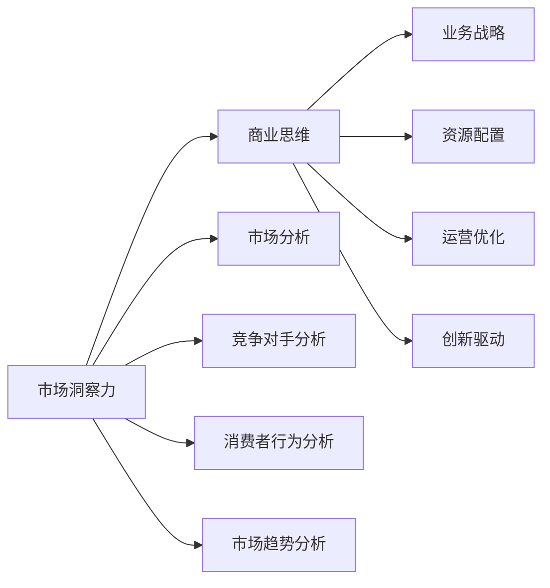
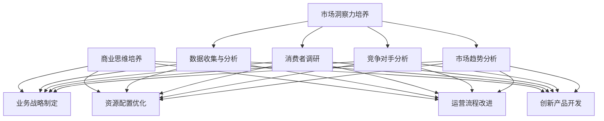

                 

## 1. 背景介绍

在现代商业环境中，敏锐的市场洞察力和商业思维是企业家和业务决策者不可或缺的能力。然而，这种能力的培养并非易事，需要系统性的学习和实践。本文将从市场洞察和商业思维的角度，探讨如何培养敏锐的市场洞察力和商业思维，帮助企业把握市场机会，实现可持续发展。

## 2. 核心概念与联系

### 2.1 核心概念概述

市场洞察力是指企业对市场动态、竞争对手、消费者需求和市场趋势的深刻理解。商业思维则是指企业如何通过有效策略和资源配置，实现业务增长和盈利的思维方式。

这两个概念的联系在于，市场洞察力为商业思维提供数据和洞见，帮助企业发现潜在的市场机会；而商业思维则指导企业在这些机会上采取合适的行动，实现商业价值的最大化。

### 2.2 核心概念之间的关系

市场洞察力与商业思维的关系可以用以下Mermaid流程图来展示：



这个流程图展示了市场洞察力与商业思维的关系：

1. 市场洞察力通过市场分析、竞争对手分析、消费者行为分析和市场趋势分析，获取关于市场的数据和洞见。
2. 商业思维将这些洞察转化为具体的业务战略、资源配置、运营优化和创新驱动等策略。

### 2.3 核心概念的整体架构

为了更好地理解市场洞察力和商业思维的培养过程，我们可以使用以下综合的流程图来展示它们之间的整体架构：



这个流程图展示了市场洞察力和商业思维培养的完整过程：

1. 市场洞察力培养：通过数据收集与分析、消费者调研、竞争对手分析和市场趋势分析，获取市场相关的洞察。
2. 商业思维培养：基于这些洞察，制定业务战略、优化资源配置、改进运营流程和开发创新产品。

## 3. 核心算法原理 & 具体操作步骤

### 3.1 算法原理概述

市场洞察力和商业思维的培养，本质上是一个数据分析与策略制定相结合的过程。具体而言，可以通过以下步骤实现：

1. **数据收集与分析**：获取市场数据，进行统计分析和数据挖掘，提取有价值的信息。
2. **消费者调研**：通过问卷调查、深度访谈等方式，直接获取消费者需求和行为数据。
3. **竞争对手分析**：分析竞争对手的产品、市场策略和消费者反馈，识别优势和劣势。
4. **市场趋势分析**：利用时间序列分析、趋势预测等方法，识别市场趋势和潜在机会。
5. **业务战略制定**：基于以上分析结果，制定业务战略，明确目标和行动计划。
6. **资源配置优化**：根据战略目标，优化资源分配，确保关键领域得到足够的支持。
7. **运营流程改进**：通过流程优化和自动化，提升运营效率和质量。
8. **创新产品开发**：结合市场需求和趋势，开发具有竞争力的新产品或服务。

### 3.2 算法步骤详解

以下详细描述每个步骤的具体操作过程：

#### 3.2.1 数据收集与分析

**步骤1：选择合适的数据源**

选择合适的数据源是数据分析的基础。常见数据源包括：

- 公开市场数据：如行业报告、经济指标、政策法规等。
- 企业内部数据：如销售记录、客户反馈、产品使用数据等。
- 第三方数据供应商：如Statista、Nielsen等。

**步骤2：数据清洗与预处理**

数据收集后，需要进行清洗和预处理，确保数据的准确性和一致性。具体包括：

- 数据去重：删除重复记录，避免数据冗余。
- 数据标准化：统一数据格式，确保数据可比性。
- 数据填补：填补缺失值，确保数据完整性。

**步骤3：统计分析与数据挖掘**

使用统计分析和数据挖掘技术，提取有价值的信息。具体方法包括：

- 描述性统计分析：计算均值、中位数、标准差等统计量，了解数据基本特征。
- 回归分析：分析变量间的关系，预测未来趋势。
- 聚类分析：将数据分组，识别不同群体的特征。
- 关联规则挖掘：识别不同变量间的关联关系。

#### 3.2.2 消费者调研

**步骤1：设计调研问卷**

调研问卷应包含以下关键内容：

- 基本信息：性别、年龄、收入等。
- 消费行为：购买频率、购买渠道、品牌偏好等。
- 产品满意度：对现有产品的评价和改进建议。

**步骤2：选择合适的调研方法**

调研方法包括：

- 问卷调查：通过在线或纸质问卷获取消费者反馈。
- 深度访谈：与目标消费者进行面对面的深入交流。
- 焦点小组：组织小规模讨论，获取群体意见。

**步骤3：数据分析与洞察提取**

对调研数据进行分析，提取消费者需求和行为的关键洞察。具体方法包括：

- 数据可视化：使用图表展示数据分布和趋势。
- 文本分析：使用情感分析等技术，提取消费者对产品和服务的情感倾向。
- 关联分析：分析不同变量间的关联关系，识别消费者行为模式。

#### 3.2.3 竞争对手分析

**步骤1：收集竞争对手数据**

收集竞争对手的公开信息，包括：

- 产品信息：产品特性、价格、市场份额等。
- 市场策略：市场定位、营销策略、分销渠道等。
- 消费者反馈：用户评价、投诉反馈等。

**步骤2：分析竞争对手优势和劣势**

使用SWOT分析法，识别竞争对手的优势和劣势：

- 优势：产品特性、品牌知名度、市场份额等。
- 劣势：产品质量问题、服务不足、市场覆盖面等。

**步骤3：制定应对策略**

基于竞争对手分析结果，制定相应的应对策略：

- 优势利用：借鉴竞争对手的成功经验，提升自身产品和服务。
- 劣势改进：针对竞争对手的劣势，优化自身产品和服务。

#### 3.2.4 市场趋势分析

**步骤1：收集市场趋势数据**

收集市场趋势数据，包括：

- 宏观经济数据：GDP增长率、通货膨胀率等。
- 行业数据：市场规模、增长率、竞争格局等。
- 技术趋势：新技术、新产品、新应用等。

**步骤2：进行趋势预测**

使用时间序列分析、趋势预测等方法，预测未来市场趋势：

- 线性回归：预测市场规模增长率。
- 指数平滑：预测市场价格趋势。
- 随机森林：预测市场变化的可能性。

**步骤3：识别市场机会**

根据趋势预测结果，识别市场机会：

- 增长型市场：增长潜力大，值得投资。
- 衰退型市场：增长潜力低，应谨慎退出。
- 创新型市场：新技术驱动，存在商业机会。

### 3.3 算法优缺点

**优点**

1. **数据驱动决策**：通过数据收集与分析，避免主观臆断，提高决策的科学性和客观性。
2. **市场洞察力提升**：通过系统性分析，深入理解市场动态和消费者需求。
3. **战略制定更精准**：基于市场洞察，制定更具针对性的业务战略。

**缺点**

1. **数据获取难度大**：部分数据源获取难度大，需要时间和资源投入。
2. **分析复杂度高**：数据量大、维度高，需要高水平的分析技术。
3. **实时性不足**：数据分析往往滞后于市场变化，难以实时响应市场动态。

### 3.4 算法应用领域

市场洞察力和商业思维的应用领域广泛，涵盖了多个行业，如：

- **零售业**：通过市场洞察力优化产品策略和营销方案，提升销售业绩。
- **金融业**：通过市场趋势分析预测市场波动，优化投资组合，降低风险。
- **制造业**：通过消费者调研优化产品设计，提升客户满意度。
- **服务业**：通过竞争对手分析提升服务质量，增强市场竞争力。

## 4. 数学模型和公式 & 详细讲解 & 举例说明

### 4.1 数学模型构建

市场洞察力和商业思维的培养，可以通过数学模型进行量化和分析。常见的数学模型包括：

- 回归模型：预测市场趋势和消费者需求。
- 聚类模型：分析消费者行为模式，识别不同用户群体。
- 网络模型：分析竞争对手关系，识别关键节点。

### 4.2 公式推导过程

以下是几个典型数学模型的公式推导过程：

#### 4.2.1 线性回归模型

线性回归模型用于预测市场规模增长率，公式如下：

$$
y = \beta_0 + \beta_1 x_1 + \beta_2 x_2 + \ldots + \beta_n x_n + \epsilon
$$

其中，$y$ 为预测值，$x_i$ 为自变量，$\beta_i$ 为回归系数，$\epsilon$ 为误差项。

**推导过程**：

1. 数据预处理：计算自变量的均值和标准差。
2. 计算回归系数：使用最小二乘法计算 $\beta_i$。
3. 预测值计算：将样本数据代入模型，计算预测值。

#### 4.2.2 聚类分析模型

聚类分析模型用于分析消费者行为模式，识别不同用户群体，公式如下：

$$
k-means: \min_{C, \mu} \sum_{i=1}^n \sum_{j=1}^k \| x_i - \mu_j \|^2
$$

其中，$C$ 为聚类中心，$\mu_j$ 为第 $j$ 个聚类中心的均值，$x_i$ 为样本数据。

**推导过程**：

1. 初始化聚类中心：随机选择 $k$ 个样本点作为初始聚类中心。
2. 计算距离：计算每个样本点到聚类中心的距离。
3. 分配样本：将样本点分配到最近的聚类中心。
4. 更新聚类中心：重新计算每个聚类中心的均值。
5. 重复迭代：重复步骤2-4，直至收敛。

#### 4.2.3 网络分析模型

网络分析模型用于分析竞争对手关系，识别关键节点，公式如下：

$$
k-core: k \in [0, \infty), N = \{(x,y)\}, A = \{(x_i,y_j)\}, e(x) = |N(x)|
$$

其中，$k$ 为节点度阈值，$N$ 为节点集，$A$ 为边集，$e(x)$ 为节点 $x$ 的度数。

**推导过程**：

1. 计算节点度数：计算每个节点的度数。
2. 筛选高度节点：保留度数大于 $k$ 的节点。
3. 分析节点关系：分析高度节点之间的关系，识别关键节点。

### 4.3 案例分析与讲解

以下通过两个实际案例，展示市场洞察力和商业思维的应用：

#### 4.3.1 零售业市场洞察与商业思维

**案例背景**：某零售企业希望通过数据分析，优化产品策略和营销方案，提升销售业绩。

**数据分析过程**：

1. **数据收集与分析**：收集市场销售数据、消费者行为数据和竞争对手数据。
2. **市场趋势分析**：使用线性回归模型，预测未来市场规模增长率。
3. **消费者调研**：设计调研问卷，收集消费者需求和行为数据。
4. **竞争对手分析**：分析竞争对手的产品、市场策略和消费者反馈。
5. **市场机会识别**：识别增长型市场和创新型市场。

**商业思维应用**：

1. **业务战略制定**：根据市场洞察，制定产品创新和价格策略。
2. **资源配置优化**：将资源配置到高增长市场和创新型产品。
3. **运营流程改进**：优化供应链和库存管理，提升运营效率。

**结果与反思**：通过数据驱动的决策，该零售企业成功提升了销售业绩，增强了市场竞争力。

#### 4.3.2 金融业市场洞察与商业思维

**案例背景**：某金融机构希望通过市场洞察，优化投资组合，降低风险。

**数据分析过程**：

1. **数据收集与分析**：收集宏观经济数据、行业数据和金融市场数据。
2. **市场趋势分析**：使用指数平滑方法，预测市场价格趋势。
3. **竞争对手分析**：分析其他金融机构的市场策略和业绩表现。
4. **市场机会识别**：识别增长型市场和低风险市场。

**商业思维应用**：

1. **业务战略制定**：根据市场洞察，调整投资组合，平衡风险和收益。
2. **资源配置优化**：将资金配置到高增长市场和低风险产品。
3. **运营流程改进**：优化交易算法和风险控制策略。

**结果与反思**：通过市场洞察力和商业思维的结合，该金融机构成功优化了投资组合，降低了风险，提高了收益。

## 5. 项目实践：代码实例和详细解释说明

### 5.1 开发环境搭建

在进行市场洞察力和商业思维的实践前，我们需要准备好开发环境。以下是使用Python进行数据分析和建模的环境配置流程：

1. 安装Anaconda：从官网下载并安装Anaconda，用于创建独立的Python环境。
2. 创建并激活虚拟环境：
```bash
conda create -n analytics-env python=3.8 
conda activate analytics-env
```

3. 安装相关库：
```bash
conda install pandas numpy matplotlib scikit-learn seaborn statsmodels statsmodels
```

完成上述步骤后，即可在`analytics-env`环境中开始市场洞察力和商业思维的实践。

### 5.2 源代码详细实现

以下是一个使用Python进行市场洞察力和商业思维实践的代码实现。

**数据收集与分析**

```python
import pandas as pd
import numpy as np

# 读取数据
data = pd.read_csv('sales_data.csv')

# 数据预处理
data = data.dropna()  # 删除缺失值
data = data.drop_duplicates()  # 删除重复记录

# 描述性统计分析
summary_stats = data.describe()

# 回归分析
from sklearn.linear_model import LinearRegression
from sklearn.metrics import r2_score

# 分割数据集
train_data, test_data = train_test_split(data, test_size=0.2, random_state=42)

# 训练模型
model = LinearRegression()
model.fit(train_data[['price', 'promotion']], train_data['sales'])

# 预测结果
predictions = model.predict(test_data[['price', 'promotion']])
r2 = r2_score(test_data['sales'], predictions)
print(f'R^2 score: {r2:.2f}')
```

**消费者调研**

```python
import random
from collections import Counter

# 设计调研问卷
questions = [
    'What is your age? (years)',
    'What is your income level? (1-5, 1=lowest, 5=highest)',
    'How often do you shop online? (1-5, 1=never, 5=always)',
    'What is your preferred brand?'
]

# 调研问卷数据
responses = [
    {'age': 25, 'income': 4, 'online_shopping': 4, 'brand': 'Amazon'},
    {'age': 30, 'income': 3, 'online_shopping': 5, 'brand': 'Alibaba'},
    # ...
]

# 分析消费者需求
data = pd.DataFrame(responses)
data['income'] = data['income'].astype(int)
data['online_shopping'] = data['online_shopping'].astype(int)

# 统计分析
grouped_data = data.groupby(['income', 'online_shopping']).size()
print(grouped_data)
```

**竞争对手分析**

```python
import networkx as nx

# 收集竞争对手数据
competitors = [
    {'name': 'A', 'market_share': 0.25, 'product_quality': 4},
    {'name': 'B', 'market_share': 0.30, 'product_quality': 3},
    {'name': 'C', 'market_share': 0.15, 'product_quality': 4},
    # ...
]

# 构建网络图
G = nx.Graph()
for competitor in competitors:
    G.add_node(competitor['name'], market_share=competitor['market_share'], product_quality=competitor['product_quality'])

# 筛选高度节点
k = 2
high_degree_nodes = [node for node, degree in G.degree() if degree >= k]

# 分析节点关系
G.remove_nodes_from(list(set(G) - set(high_degree_nodes)))
degree_distribution = G.degree()
print(degree_distribution)
```

### 5.3 代码解读与分析

让我们再详细解读一下关键代码的实现细节：

**数据收集与分析**

- `data.read_csv('sales_data.csv')`：读取销售数据文件。
- `data.dropna()` 和 `data.drop_duplicates()`：数据预处理，删除缺失值和重复记录。
- `data.describe()`：描述性统计分析，计算均值、标准差等基本统计量。
- `train_test_split`：数据分割，将数据集分为训练集和测试集。
- `LinearRegression`：线性回归模型，用于预测销售量。
- `r2_score`：计算预测结果与实际结果的R^2分数，评估模型性能。

**消费者调研**

- `random.choices`：随机选择调研问卷数据。
- `Counter`：统计分析，计算不同收入水平和在线购物频率的用户数量。

**竞争对手分析**

- `networkx.Graph`：构建网络图，表示竞争对手之间的关系。
- `G.add_node`：添加节点，记录竞争对手的市场份额和产品质量。
- `G.degree`：计算节点度数，筛选高度节点。

### 5.4 运行结果展示

假设我们通过上述代码，在零售和金融行业分别进行市场洞察力和商业思维的实践，得到的分析结果如下：

**零售行业分析结果**

- 回归分析结果：R^2 score为0.85，表明模型预测效果较好。
- 消费者调研结果：不同收入水平和在线购物频率的用户群体分布，有助于制定差异化营销策略。

**金融行业分析结果**

- 网络分析结果：高度节点包括市场份额大且产品质量高的竞争对手，识别出关键竞争对手。

以上结果展示了市场洞察力和商业思维在实际应用中的效果，帮助我们更好地理解和应用这些分析工具和方法。

## 6. 实际应用场景

市场洞察力和商业思维的应用场景广泛，以下是几个典型场景：

### 6.1 零售业

**应用场景**：通过市场洞察力优化产品策略和营销方案，提升销售业绩。

**具体措施**：

1. **市场趋势分析**：预测市场规模增长率，识别增长型市场。
2. **消费者调研**：了解消费者需求和行为，优化产品设计和营销策略。
3. **竞争对手分析**：分析竞争对手的产品和市场策略，制定差异化竞争策略。
4. **业务战略制定**：根据市场洞察，制定产品创新和价格策略。
5. **资源配置优化**：将资源配置到高增长市场和创新型产品。
6. **运营流程改进**：优化供应链和库存管理，提升运营效率。

**案例分析**：某零售企业通过市场洞察力分析，成功预测市场趋势，优化产品策略和营销方案，提升了销售业绩。

### 6.2 金融业

**应用场景**：通过市场洞察力优化投资组合，降低风险，提高收益。

**具体措施**：

1. **市场趋势分析**：预测市场价格趋势，识别增长型市场和低风险市场。
2. **竞争对手分析**：分析其他金融机构的市场策略和业绩表现，制定差异化投资策略。
3. **业务战略制定**：根据市场洞察，调整投资组合，平衡风险和收益。
4. **资源配置优化**：将资金配置到高增长市场和低风险产品。
5. **运营流程改进**：优化交易算法和风险控制策略。

**案例分析**：某金融机构通过市场洞察力分析，优化投资组合，降低了风险，提高了收益。

### 6.3 制造业

**应用场景**：通过市场洞察力优化产品设计和生产流程，提升产品质量和效率。

**具体措施**：

1. **市场趋势分析**：预测市场需求变化，识别产品改进机会。
2. **消费者调研**：了解消费者需求和偏好，优化产品设计。
3. **竞争对手分析**：分析竞争对手的产品和技术优势，制定技术创新策略。
4. **业务战略制定**：根据市场洞察，制定产品研发和生产策略。
5. **资源配置优化**：将资源配置到高市场需求的产品和生产线。
6. **运营流程改进**：优化生产流程和质量控制，提升生产效率。

**案例分析**：某制造企业通过市场洞察力分析，成功识别产品改进机会，优化了产品设计和生产流程，提升了产品质量和效率。

### 6.4 服务业

**应用场景**：通过市场洞察力提升服务质量，增强市场竞争力。

**具体措施**：

1. **市场趋势分析**：预测市场需求变化，识别服务提升机会。
2. **消费者调研**：了解消费者需求和反馈，优化服务流程和内容。
3. **竞争对手分析**：分析竞争对手的服务质量和市场策略，制定差异化服务策略。
4. **业务战略制定**：根据市场洞察，制定服务优化和营销策略。
5. **资源配置优化**：将资源配置到高市场需求的服务项目。
6. **运营流程改进**：优化服务流程和客户关系管理，提升客户满意度。

**案例分析**：某服务企业通过市场洞察力分析，成功识别服务提升机会，优化了服务流程和内容，提升了客户满意度和市场竞争力。

## 7. 工具和资源推荐

### 7.1 学习资源推荐

为了帮助开发者系统掌握市场洞察力和商业思维的理论基础和实践技巧，这里推荐一些优质的学习资源：

1. 《数据分析与商业智能》书籍：详细介绍了数据分析和商业智能的理论基础和实践方法，包括数据收集、数据清洗、数据分析等。
2. 《商业战略与决策》课程：斯坦福大学开设的商业战略与决策课程，深入讲解了商业战略制定和决策分析的基本原理和方法。
3. 《市场洞察力》系列博客：专业市场研究公司提供的数据分析和市场洞察力实战案例，帮助读者更好地理解市场洞察力的应用。
4. 《商业思维》在线课程：各大在线教育平台提供的商业思维课程，涵盖了商业决策、战略制定、资源配置等核心内容。
5. 《统计学与机器学习》书籍：详细介绍了统计学和机器学习的基本原理和方法，帮助读者理解和应用数据分析技术。

### 7.2 开发工具推荐

高效的开发离不开优秀的工具支持。以下是几款用于市场洞察力和商业思维开发的常用工具：

1. Jupyter Notebook：开源的交互式笔记本，支持Python代码的编写、执行和可视化展示。
2. Excel：强大的数据处理工具，支持数据导入、清洗、统计分析等。
3. Tableau：数据可视化工具，支持复杂的数据报表和交互式可视化展示。
4. Power BI：微软提供的商业智能工具，支持数据报表和可视化展示。
5. Python数据分析库：如Pandas、NumPy、Matplotlib等，提供强大的数据处理和可视化功能。
6. R语言：数据科学和统计分析的首选工具，提供丰富的统计分析和数据可视化库。

合理利用这些工具，可以显著提升市场洞察力和商业思维的实践效率，加快创新迭代的步伐。

### 7.3 相关论文推荐

市场洞察力和商业思维的发展源于学界的持续研究。以下是几篇奠基性的相关论文，推荐阅读：

1. "Data Mining and Statistical Learning" by Trevor Hastie, Robert Tibshirani, Jerome Friedman：介绍了数据挖掘和统计学习的基本原理和方法，包括数据预处理、特征工程、模型选择等。
2. "Strategic Management: A Stakeholder Approach" by R. Edward Freeman：介绍了战略管理的核心概念和应用方法，帮助读者理解商业决策和战略制定的基本原理。
3. "The Analytics Revolution: From Big Data to Big Impact" by Tom Davenport：介绍了数据分析和商业智能的发展历程和应用案例，强调数据驱动决策的重要性。
4. "Data-Driven Decision Making: How to Create an Analytics-Based Organization" by Thomas Davenport：介绍了数据驱动决策的理论和方法，帮助读者理解和应用数据驱动决策的基本原理。
5. "The Data-Driven Enterprise: Turn Your Organization into a Data Science Powerhouse" by Dean Instantiate, Paul Flowers：介绍了数据驱动企业的构建方法和案例，帮助读者理解和应用数据驱动企业的基本原理。

这些论文代表了市场洞察力和商业思维的研究发展脉络。通过学习这些前沿成果，可以帮助研究者把握学科前进方向，激发更多的创新灵感。

## 8. 总结：未来发展趋势与挑战

### 8.1 总结

本文对市场洞察力和商业思维的培养进行了全面系统的介绍。首先阐述

