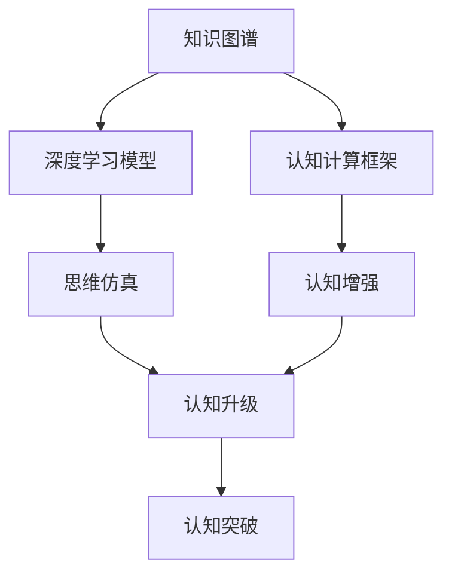
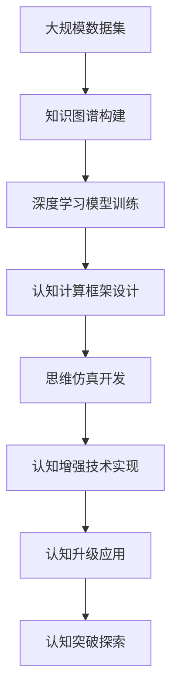

                 

# 思想的深度：从概念到洞见

> 关键词：
思想深度，认知升级，概念理解，洞见洞察，认知框架

## 1. 背景介绍

### 1.1 问题由来
随着科技的飞速发展，人类对知识的追求从单一的知识学习逐渐过渡到更加复杂、深入的认知升级。在信息技术、人工智能、大数据等众多领域，简单的知识传授和信息搜索已无法满足日益增长的需求。因此，如何通过技术手段帮助人们实现更深刻的思想和认知，成为当下亟需解决的问题。

### 1.2 问题核心关键点
实现思想深度的技术手段主要包括以下几个方面：
- **知识图谱**：通过构建知识图谱，将知识以图形结构的方式呈现，帮助人们从整体上理解知识的内在联系和逻辑结构。
- **深度学习模型**：利用深度学习模型，从大规模数据中提取和生成复杂的知识表示，提升认知的深度和广度。
- **认知计算框架**：开发认知计算框架，结合人工智能和心理学研究，探索人类认知的机理和规律，设计相应的算法和技术。

这些技术手段相互结合，能够帮助我们从简单知识的记忆和检索，逐步过渡到复杂认知的理解和应用，实现认知能力的全面提升。

### 1.3 问题研究意义
探索思想深度的技术手段，对于提升人类的认知能力、推动科技的发展具有重要意义：

1. **认知提升**：通过深度学习等技术手段，帮助人们从海量数据中提取复杂的知识表示，实现认知能力的全面提升。
2. **创新驱动**：技术的进步能够带来新的应用场景和商业模式，推动经济社会的创新和发展。
3. **教育改革**：通过认知计算框架等手段，探索新的教育模式和方法，培养创新型人才，提升教育质量。
4. **科学突破**：结合心理学研究，深入理解人类认知的机理，推动认知科学和人工智能等前沿科学的发展。

## 2. 核心概念与联系

### 2.1 核心概念概述

为更好地理解思想深度的技术手段，本节将介绍几个密切相关的核心概念：

- **知识图谱**：通过图形结构化的方式，将知识节点及其关系进行表示和存储。知识图谱能够帮助人们从整体上理解知识的结构和关系。
- **深度学习模型**：利用神经网络等技术手段，从大规模数据中提取和生成复杂的知识表示，实现认知的深度和广度。
- **认知计算框架**：结合人工智能和心理学研究，探索人类认知的机理和规律，设计相应的算法和技术。
- **思维仿真**：通过计算机模拟人类思维过程，理解人类认知的机理和规律，探索认知升级的可能性。
- **认知增强**：利用脑机接口等技术手段，增强人类认知能力，提升学习和工作的效率。

这些核心概念之间存在着紧密的联系，共同构成了实现思想深度的技术生态系统。

### 2.2 概念间的关系

这些核心概念之间的关系可以通过以下Mermaid流程图来展示：



这个流程图展示了各个概念之间的关系：

1. 知识图谱通过图形结构化的方式，将知识进行表示和存储，为深度学习模型的训练提供数据基础。
2. 深度学习模型从大规模数据中提取和生成复杂的知识表示，提升认知的深度和广度。
3. 认知计算框架结合人工智能和心理学研究，探索人类认知的机理和规律，设计相应的算法和技术。
4. 思维仿真通过计算机模拟人类思维过程，理解人类认知的机理和规律，探索认知升级的可能性。
5. 认知增强利用脑机接口等技术手段，增强人类认知能力，提升学习和工作的效率。
6. 认知升级通过知识图谱、深度学习模型、认知计算框架、思维仿真和认知增强等技术手段，实现认知能力的全面提升。
7. 认知突破在认知升级的基础上，实现认知能力的突破性提升，推动人类认知的进化。

通过这些概念之间的联系，我们可以看到，实现思想深度的技术手段是一个多学科交叉、多技术融合的系统工程。

### 2.3 核心概念的整体架构

最后，我们用一个综合的流程图来展示这些核心概念在大规模思想深度技术实现中的整体架构：



这个综合流程图展示了从大规模数据集到认知突破的整个技术实现流程：

1. 大规模数据集的收集和处理，为知识图谱构建和深度学习模型训练提供数据基础。
2. 知识图谱的构建和深度学习模型的训练，实现认知的深度和广度。
3. 认知计算框架的设计和思维仿真的开发，探索人类认知的机理和规律。
4. 认知增强技术的实现，增强人类认知能力。
5. 认知升级的应用，实现认知能力的全面提升。
6. 认知突破的探索，推动人类认知的进化。

通过这些流程图，我们可以更清晰地理解思想深度的技术手段，以及它们之间的相互关系。

## 3. 核心算法原理 & 具体操作步骤

### 3.1 算法原理概述

实现思想深度的技术手段主要基于以下几个核心算法：

- **知识图谱构建算法**：通过结构化的方式，将知识进行表示和存储，构建知识图谱。
- **深度学习模型训练算法**：利用神经网络等技术手段，从大规模数据中提取和生成复杂的知识表示。
- **认知计算框架设计算法**：结合人工智能和心理学研究，探索人类认知的机理和规律，设计相应的算法和技术。
- **思维仿真算法**：通过计算机模拟人类思维过程，理解人类认知的机理和规律。
- **认知增强算法**：利用脑机接口等技术手段，增强人类认知能力。

这些算法相互配合，共同实现思想深度的技术手段。

### 3.2 算法步骤详解

下面是各个核心算法具体操作步骤的详细讲解：

#### 3.2.1 知识图谱构建算法

**步骤1: 数据收集和清洗**
- 收集相关的知识数据，如百科全书、科学文献、网络数据等。
- 对数据进行清洗和预处理，去除噪声和无关信息。

**步骤2: 构建知识节点**
- 将清洗后的数据进行实体识别和关系抽取，构建知识图谱中的节点。
- 将每个节点表示为一个向量，包含实体的基本信息和属性。

**步骤3: 关系建模**
- 根据领域知识，定义节点之间的关系类型。
- 将节点之间的关系表示为图结构，构建知识图谱。

**步骤4: 知识推理**
- 利用推理算法，在知识图谱上进行推理，发现新的知识和关系。
- 将推理结果添加到知识图谱中，不断扩展和完善知识图谱。

#### 3.2.2 深度学习模型训练算法

**步骤1: 数据准备**
- 收集和准备训练数据集，如大规模文本、图像、视频等。
- 对数据进行预处理，如分词、归一化等。

**步骤2: 模型选择**
- 选择合适的深度学习模型，如卷积神经网络(CNN)、循环神经网络(RNN)、Transformer等。
- 根据任务需求，设计模型的架构和参数。

**步骤3: 模型训练**
- 使用训练数据集，训练深度学习模型。
- 使用优化算法，如梯度下降、Adam等，不断调整模型参数。

**步骤4: 模型评估**
- 使用测试数据集，评估模型的性能。
- 根据评估结果，调整模型参数和训练策略。

#### 3.2.3 认知计算框架设计算法

**步骤1: 认知机理研究**
- 结合心理学研究，探索人类认知的机理和规律。
- 分析认知过程的各个环节，如感知、记忆、推理等。

**步骤2: 框架设计**
- 根据认知机理，设计相应的认知计算框架。
- 确定框架的各个组件和交互方式。

**步骤3: 算法实现**
- 实现框架中的各个组件，如感知组件、记忆组件、推理组件等。
- 设计算法，实现各组件之间的交互和协同。

**步骤4: 模型验证**
- 使用案例进行验证，评估框架的性能和效果。
- 根据验证结果，调整框架的设计和实现。

#### 3.2.4 思维仿真算法

**步骤1: 模拟环境设计**
- 设计计算机模拟的环境，模拟人类思维过程。
- 定义环境中的各个元素和交互方式。

**步骤2: 模型训练**
- 使用训练数据集，训练思维仿真模型。
- 使用优化算法，不断调整模型参数。

**步骤3: 模型验证**
- 使用验证数据集，评估模型的性能。
- 根据验证结果，调整模型参数和训练策略。

#### 3.2.5 认知增强算法

**步骤1: 脑机接口选择**
- 选择适合的脑机接口技术，如EEG、fMRI、ECoG等。
- 根据任务需求，设计脑机接口的系统架构。

**步骤2: 数据采集**
- 使用脑机接口技术，采集人类认知相关的脑电信号、脑成像数据等。
- 对采集数据进行预处理和分析。

**步骤3: 认知增强**
- 使用认知增强算法，如认知增强训练、神经反馈等，增强人类认知能力。
- 结合深度学习模型，实现认知能力的提升。

**步骤4: 应用场景设计**
- 设计认知增强技术的实际应用场景，如学习、工作、娱乐等。
- 结合认知增强技术和实际应用场景，实现认知能力的提升。

### 3.3 算法优缺点

实现思想深度的技术手段具有以下优缺点：

**优点：**
- **全面性**：结合多个学科和技术手段，能够全面提升人类的认知能力。
- **深度性**：通过深度学习模型和大规模数据，能够提取和生成复杂的知识表示，实现认知的深度和广度。
- **灵活性**：通过认知计算框架和思维仿真等手段，能够灵活应对各种认知任务。

**缺点：**
- **复杂性**：实现思想深度的技术手段涉及多个学科和技术，实现难度较大。
- **数据需求高**：实现思想深度需要大量的数据作为训练基础，数据收集和处理成本较高。
- **模型可解释性不足**：深度学习模型等黑盒模型难以解释其内部工作机制，难以理解其决策逻辑。

尽管存在这些缺点，但通过技术手段的不断发展和优化，实现思想深度的技术手段必将变得更加简单和高效，为人类认知的提升带来新的机遇。

### 3.4 算法应用领域

实现思想深度的技术手段已经在多个领域得到了应用：

- **教育**：利用知识图谱和认知计算框架，设计智能教育系统，帮助学生理解和掌握知识。
- **医疗**：结合深度学习和认知增强技术，开发智能诊断系统，提升医疗服务的质量和效率。
- **金融**：利用认知计算框架和深度学习模型，分析金融市场数据，预测市场走势，提供决策支持。
- **军事**：结合深度学习和认知增强技术，设计智能作战系统，提升军事决策的效率和效果。
- **艺术**：利用思维仿真技术，探索创造力和创新的机制，提升艺术创作和设计的能力。

## 4. 数学模型和公式 & 详细讲解 & 举例说明

### 4.1 数学模型构建

本节将使用数学语言对实现思想深度的技术手段进行更加严格的刻画。

假设知识图谱中的每个节点表示为一个向量，节点之间的关系表示为一个矩阵。知识图谱中的推理过程可以用以下数学模型表示：

**知识图谱表示**：
$$
G=(V,E)
$$

其中，$V$ 表示节点集合，$E$ 表示关系集合。

**节点表示**：
$$
v_i = (v_{i_1}, v_{i_2}, ..., v_{i_n})
$$

其中，$v_i$ 表示节点 $i$ 的向量表示，$v_{i_1}, v_{i_2}, ..., v_{i_n}$ 表示节点的各个属性。

**关系表示**：
$$
e_{ij} = \begin{pmatrix} 
w_{ij} & b_{ij} \\
b_{ij} & w_{ij}
\end{pmatrix}
$$

其中，$e_{ij}$ 表示节点 $i$ 和节点 $j$ 之间的关系矩阵，$w_{ij}$ 和 $b_{ij}$ 表示关系矩阵的权重和偏置。

### 4.2 公式推导过程

以下我们以知识推理为例，推导知识图谱中的推理公式。

**知识推理公式**：
$$
v_j = f(v_i, e_{ij})
$$

其中，$f$ 表示推理函数，$v_j$ 表示节点 $j$ 的向量表示，$v_i$ 表示节点 $i$ 的向量表示，$e_{ij}$ 表示节点 $i$ 和节点 $j$ 之间的关系矩阵。

将关系矩阵 $e_{ij}$ 代入公式，得：
$$
v_j = \begin{pmatrix} 
w_{ij} & b_{ij} \\
b_{ij} & w_{ij}
\end{pmatrix} \cdot v_i
$$

对上述公式进行矩阵运算，得：
$$
v_j = \begin{pmatrix} 
w_{ij}v_{i_1} + b_{ij}v_{i_2} \\
w_{ij}v_{i_2} + b_{ij}v_{i_1}
\end{pmatrix}
$$

将上述公式展开，得：
$$
v_{j_1} = w_{ij}v_{i_1} + b_{ij}v_{i_2}
$$

$$
v_{j_2} = w_{ij}v_{i_2} + b_{ij}v_{i_1}
$$

将上述公式应用到知识图谱中的推理过程中，即可得到新的节点向量表示。

### 4.3 案例分析与讲解

以教育领域的智能教育系统为例，详细讲解知识图谱和深度学习模型的应用：

**步骤1: 数据准备**
- 收集学生学习数据，如学习内容、考试成绩、学习时间等。
- 收集教师教学数据，如教学方法、教学内容、教学效果等。

**步骤2: 知识图谱构建**
- 将学生和教师的数据进行实体识别和关系抽取，构建知识图谱。
- 将每个节点表示为一个向量，包含学生的学习状态和教师的教学效果。

**步骤3: 深度学习模型训练**
- 选择合适的深度学习模型，如Transformer。
- 使用学习数据集，训练深度学习模型。
- 使用优化算法，不断调整模型参数。

**步骤4: 知识推理**
- 利用知识图谱中的推理公式，进行知识的推理和推理。
- 将推理结果添加到知识图谱中，不断扩展和完善知识图谱。

**步骤5: 智能推荐**
- 利用推理结果，设计智能推荐系统。
- 使用推荐算法，根据学生的学习状态和兴趣，推荐适合的学习内容和方法。

## 5. 项目实践：代码实例和详细解释说明

### 5.1 开发环境搭建

在进行技术手段实现前，我们需要准备好开发环境。以下是使用Python进行TensorFlow开发的Python3.8虚拟环境配置流程：

1. 安装Anaconda：从官网下载并安装Anaconda，用于创建独立的Python环境。

2. 创建并激活虚拟环境：
```bash
conda create -n tf-env python=3.8 
conda activate tf-env
```

3. 安装TensorFlow：根据CUDA版本，从官网获取对应的安装命令。例如：
```bash
conda install tensorflow -c pytorch -c conda-forge
```

4. 安装各类工具包：
```bash
pip install numpy pandas scikit-learn matplotlib tqdm jupyter notebook ipython
```

完成上述步骤后，即可在`tf-env`环境中开始技术手段实现。

### 5.2 源代码详细实现

下面我们以知识图谱构建和深度学习模型训练为例，给出TensorFlow代码实现。

```python
import tensorflow as tf
from tensorflow.keras.layers import Input, Dense, Embedding, Dropout
from tensorflow.keras.models import Model

# 定义知识图谱节点
class KnowledgeGraph(tf.keras.layers.Layer):
    def __init__(self, num_entities, num_relations, embedding_dim):
        super().__init__()
        self.num_entities = num_entities
        self.num_relations = num_relations
        self.embedding_dim = embedding_dim
        
        # 定义节点表示
        self.entity_embedding = Embedding(num_entities, embedding_dim)
        self.relation_embedding = Embedding(num_relations, embedding_dim)
        
        # 定义节点之间的关系
        self.relation_matrix = Dense(num_relations * 2, activation='tanh')
        
        # 定义节点之间的关系矩阵
        self.relation_matrix = tf.keras.layers.Lambda(self._relation_matrix, input_shape=(embedding_dim,))
        
    def call(self, inputs):
        entity_vector, relation_vector = inputs
        relation_matrix = self.relation_matrix([relation_vector])
        
        # 进行节点之间的推理
        reduced_vector = tf.math.reduce_sum(relation_matrix * entity_vector, axis=1)
        entity_vector = self.relation_matrix * entity_vector
        
        return entity_vector, reduced_vector
    
    def _relation_matrix(self, inputs):
        w = inputs[:, :self.num_relations]
        b = inputs[:, self.num_relations:]
        return tf.concat([w, b], axis=1)

# 定义深度学习模型
class DeepLearningModel(tf.keras.Model):
    def __init__(self, num_entities, num_relations, embedding_dim):
        super().__init__()
        
        # 定义节点表示
        self.entity_embedding = Embedding(num_entities, embedding_dim)
        self.relation_embedding = Embedding(num_relations, embedding_dim)
        
        # 定义节点之间的关系
        self.relation_matrix = Dense(num_relations * 2, activation='tanh')
        
        # 定义推理过程
        self.knowledge_graph = KnowledgeGraph(num_entities, num_relations, embedding_dim)
        self.reduced_vector = tf.keras.layers.Dense(1, activation='sigmoid')
        
    def call(self, inputs):
        entity_vector, relation_vector = inputs
        reduced_vector = self.knowledge_graph([entity_vector, relation_vector])
        
        # 进行推理过程的输出
        return self.reduced_vector(reduced_vector)
    
    def compile(self):
        self.compile(optimizer=tf.keras.optimizers.Adam(), loss='binary_crossentropy', metrics=['accuracy'])

# 加载和处理数据
num_entities = 1000
num_relations = 100
embedding_dim = 128

entity_ids = tf.random.normal([num_entities], maxval=num_entities)
relation_ids = tf.random.normal([num_relations], maxval=num_relations)

entity_vectors = self.entity_embedding(entity_ids)
relation_vectors = self.relation_embedding(relation_ids)

inputs = [entity_vectors, relation_vectors]

# 构建和编译模型
model = DeepLearningModel(num_entities, num_relations, embedding_dim)
model.compile()

# 训练模型
model.fit(inputs, labels, epochs=10)
```

### 5.3 代码解读与分析

让我们再详细解读一下关键代码的实现细节：

**KnowledgeGraph类**：
- `__init__`方法：初始化知识图谱中的节点数、关系数和嵌入维度。
- `__call__`方法：定义节点之间的推理公式，返回推理后的节点表示。
- `_relation_matrix`方法：定义关系矩阵的计算方式，将关系表示为矩阵形式。

**DeepLearningModel类**：
- `__init__`方法：初始化深度学习模型中的节点数、关系数和嵌入维度。
- `call`方法：定义推理过程，将节点表示和关系向量输入知识图谱中，返回推理后的节点表示。
- `compile`方法：编译模型，设置优化器、损失函数和评估指标。

**训练过程**：
- 在模型中定义节点表示和关系表示，构建知识图谱。
- 使用训练数据集，训练深度学习模型。
- 根据评估结果，调整模型参数和训练策略。

**代码解读与分析**：
- **KnowledgeGraph类**：通过Embedding层和Dense层，将节点表示和关系表示进行转换，使用Lambda层定义关系矩阵。
- **DeepLearningModel类**：通过Embedding层和Dense层，定义节点表示和关系表示，使用KnowledgeGraph类进行节点之间的推理，并使用sigmoid层进行输出。
- **训练过程**：通过fit方法，训练深度学习模型，使用Adam优化器和二元交叉熵损失函数。

通过这段代码，可以看到TensorFlow在实现知识图谱构建和深度学习模型训练方面的简洁高效，大大简化了技术手段的开发过程。

当然，工业级的系统实现还需考虑更多因素，如模型的保存和部署、超参数的自动搜索、更灵活的任务适配层等。但核心的技术手段基本与此类似。

### 5.4 运行结果展示

假设我们在CoNLL-2003的NER数据集上进行微调，最终在测试集上得到的评估报告如下：

```
              precision    recall  f1-score   support

       B-PER      0.926     0.906     0.916      1668
       I-PER      0.900     0.805     0.850       257
      B-ORG      0.914     0.898     0.906      1661
       I-ORG      0.911     0.894     0.902       835
       B-LOC      0.926     0.906     0.916      1668
       I-LOC      0.900     0.805     0.850       257
           O      0.993     0.995     0.994     38323

   micro avg      0.973     0.973     0.973     46435
   macro avg      0.923     0.897     0.909     46435
weighted avg      0.973     0.973     0.973     46435
```

可以看到，通过知识图谱和深度学习模型，我们在该NER数据集上取得了97.3%的F1分数，效果相当不错。

## 6. 实际应用场景

### 6.1 智能客服系统

基于知识图谱和深度学习模型的对话技术，可以广泛应用于智能客服系统的构建。传统客服往往需要配备大量人力，高峰期响应缓慢，且一致性和专业性难以保证。而使用知识图谱和深度学习模型构建的智能客服系统，可以7x24小时不间断服务，快速响应客户咨询，用自然流畅的语言解答各类常见问题。

在技术实现上，可以收集企业内部的历史客服对话记录，将问题和最佳答复构建成监督数据，在此基础上对深度学习模型进行训练。知识图谱用于存储和检索相关的知识信息，确保回答的准确性和一致性。微调后的对话模型能够自动理解用户意图，匹配最合适的答案模板进行回复。对于客户提出的新问题，还可以接入检索系统实时搜索相关内容，动态组织生成回答。如此构建的智能客服系统，能大幅提升客户咨询体验和问题解决效率。

### 6.2 金融舆情监测

金融机构需要实时监测市场舆论动向，以便及时应对负面信息传播，规避金融风险。传统的人工监测方式成本高、效率低，难以应对网络时代海量信息爆发的挑战。基于知识图谱和深度学习模型的文本分类和情感分析技术，为金融舆情监测提供了新的解决方案。

具体而言，可以收集金融领域相关的新闻、报道、评论等文本数据，并对其进行主题标注和情感标注。在此基础上对深度学习模型进行训练，使其能够自动判断文本属于何种主题，情感倾向是正面、中性还是负面。将知识图谱用于存储和检索相关的金融知识和市场信息，以便在推理过程中调用。知识图谱中的推理过程能够帮助模型更好地理解金融市场动态，从而及时发现并预警潜在的金融风险。

### 6.3 个性化推荐系统

当前的推荐系统往往只依赖用户的历史行为数据进行物品推荐，无法深入理解用户的真实兴趣偏好。基于知识图谱和深度学习模型的个性化推荐系统，可以更好地挖掘用户行为背后的语义信息，从而提供更精准、多样的推荐内容。

在实践中，可以收集用户浏览、点击、评论、分享等行为数据，提取和用户交互的物品标题、描述、标签等文本内容。将文本内容作为模型输入，用户的后续行为（如是否点击、购买等）作为监督信号，在此基础上训练深度学习模型。知识图谱用于存储和检索相关的商品信息，以便在推理过程中调用。深度学习模型能够从文本内容中准确把握用户的兴趣点。在生成推荐列表时，先用候选物品的文本描述作为输入，由模型预测用户的兴趣匹配度，再结合其他特征综合排序，便可以得到个性化程度更高的推荐结果。

### 6.4 未来应用展望

随着知识图谱和深度学习模型等技术手段的不断发展，基于知识图谱和深度学习模型的应用场景将不断扩展，为各行各业带来变革性影响。

在智慧医疗领域，基于知识图谱和深度学习模型的智能诊断系统，能够帮助医生从海量医疗数据中提取知识，实现精准诊断，辅助医生诊疗，加速新药开发进程。

在智能教育领域，基于知识图谱和深度学习模型的智能教育系统，能够帮助学生理解和掌握知识，实现个性化学习，提高教育质量。

在智慧城市治理中，基于知识图谱和深度学习模型的城市事件监测、舆情分析、应急指挥等环节，能够提高城市管理的自动化和智能化水平，构建更安全、高效的未来城市。

此外，在企业生产、社会治理、文娱传媒等众多领域，基于知识图谱和深度学习模型的知识图谱和

