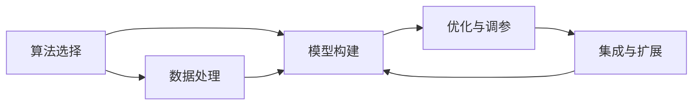

                 

# 思想的进化：从简单到复杂

## 1. 背景介绍

### 1.1 问题由来
随着时间的推移，人类社会不断发展，我们对世界认知的深度和广度也在逐步提升。在计算机科学领域，从早期的简单算法到今天复杂的人工智能系统，每一步的进步都离不开对已有技术的继承与发展。在面对复杂问题时，理解思想如何从简单到复杂，逐步构建起一个全面的、高效的系统，是实现技术突破的关键。

### 1.2 问题核心关键点
从简单的算法到复杂的人工智能系统，这一过程中涉及到的关键点主要包括：
1. **算法选择**：不同的问题可能需要不同的算法来解决。算法的选择直接影响到系统的效率和效果。
2. **数据处理**：数据的质量和处理方式对算法的效果有重要影响。高质量的数据和合理的预处理可以大大提高算法的效果。
3. **模型构建**：在算法的基础上，选择合适的模型进行训练，构建起系统的核心部分。
4. **优化与调参**：在模型构建之后，需要不断优化模型的参数，以达到最优的效果。
5. **集成与扩展**：将多个模块集成起来，构建起完整系统，并根据需求不断扩展和优化。

### 1.3 问题研究意义
通过对思想进化的深入研究，我们不仅能够更好地理解现有的技术体系，还能够为未来的技术发展提供指导。这种研究有助于我们：
- 理解和掌握当前的技术体系。
- 识别技术中的瓶颈和局限性。
- 找到技术发展的方向和潜力。
- 探索新技术的可能性。
- 指导未来的技术创新和应用。

## 2. 核心概念与联系

### 2.1 核心概念概述

1. **算法选择**：选择合适的算法是解决问题的基础。不同的算法有其适用的场景和局限性。
2. **数据处理**：数据处理包括数据清洗、特征提取、数据增强等步骤。高质量的数据处理能够提高算法的性能。
3. **模型构建**：模型构建包括选择模型结构、训练模型、调整模型参数等步骤。
4. **优化与调参**：优化和调参是提高模型性能的重要手段，通过调整模型的超参数和结构，可以提升模型的准确性和效率。
5. **集成与扩展**：集成多个模块可以构建起完整系统，扩展模块可以根据需求添加新功能。

这些概念之间存在紧密的联系，共同构成了一个完整的技术系统。

### 2.2 概念间的关系

这些概念之间的联系可以通过以下Mermaid流程图来展示：



这个流程图展示了算法选择、数据处理、模型构建、优化与调参以及集成与扩展之间的关系：
1. 算法选择是起点，确定了后续的处理方式。
2. 数据处理是算法运行的基础。
3. 模型构建在算法和数据的基础上，进一步优化和提升。
4. 优化与调参是提高模型性能的关键步骤。
5. 集成与扩展将各个模块组合成一个完整的系统。

### 2.3 核心概念的整体架构

最后，我们用一个综合的流程图来展示这些核心概念在大规模技术系统中的整体架构：


这个综合流程图展示了从算法选择到系统部署的整个流程：
1. 大规模技术系统的构建以算法选择为起点。
2. 数据处理是算法运行的必要前提。
3. 模型构建在算法和数据的基础上进行。
4. 优化与调参是提高模型性能的关键。
5. 集成与扩展将各个模块组合成完整的系统。
6. 系统部署与运行是将系统投入到实际使用中。
7. 持续优化与升级是保持系统竞争力的关键。
8. 知识积累与更新是技术发展的动力。

## 3. 核心算法原理 & 具体操作步骤
### 3.1 算法原理概述

构建复杂技术系统的核心算法原理包括：
1. **算法的基本原理**：选择适合的算法，明确算法的基本原理和适用场景。
2. **算法实现细节**：具体实现算法时需要注意的各个细节，包括数据结构、时间复杂度等。
3. **算法优化**：在实际应用中，如何对算法进行优化，提升算法的效率和效果。

### 3.2 算法步骤详解

1. **算法选择**：根据问题的性质和数据特点，选择适合的算法。
2. **数据处理**：对数据进行清洗、特征提取等预处理，以提高算法的性能。
3. **模型构建**：选择合适的模型结构，进行训练和调整。
4. **优化与调参**：通过调整超参数和模型结构，提升模型的性能。
5. **集成与扩展**：将多个模块集成起来，构建完整系统，并根据需求不断扩展。

### 3.3 算法优缺点

算法选择和应用需要考虑其优缺点，以便在具体问题上做出合理的决策。
- **优点**：
  - 提高问题解决的效率和效果。
  - 降低问题的复杂度。
  - 提供系统的模块化和可扩展性。
- **缺点**：
  - 算法的选择和实现需要经验和专业知识。
  - 数据质量和处理方式对算法效果有重要影响。
  - 模型构建和调参需要时间和资源投入。

### 3.4 算法应用领域

不同的算法在各自的应用领域中具有不同的优势和局限性。
- **分类算法**：如决策树、随机森林、支持向量机等，适用于分类问题。
- **回归算法**：如线性回归、岭回归、Lasso回归等，适用于预测问题。
- **聚类算法**：如K-means、层次聚类等，适用于无监督学习。
- **深度学习算法**：如卷积神经网络、循环神经网络、Transformer等，适用于复杂的数据结构和大量数据。

## 4. 数学模型和公式 & 详细讲解 & 举例说明

### 4.1 数学模型构建

在技术系统中，数学模型是构建算法的基础。以线性回归为例，其数学模型为：
$$ y = \beta_0 + \beta_1 x_1 + \beta_2 x_2 + ... + \beta_n x_n + \epsilon $$
其中，$y$ 是预测值，$x_i$ 是特征，$\beta_i$ 是系数，$\epsilon$ 是误差。

### 4.2 公式推导过程

以线性回归为例，其优化目标是使得预测值 $y$ 与真实值 $y'$ 之间的平方误差最小化。公式推导过程如下：
$$ \min \sum_{i=1}^n (y_i - y'_i)^2 $$
通过求解导数，得到系数 $\beta$ 的求解公式：
$$ \beta = (X^T X)^{-1} X^T y $$
其中，$X$ 是特征矩阵，$y$ 是真实值向量。

### 4.3 案例分析与讲解

以房价预测为例，其数据集包含多个特征，如房屋面积、房间数量、位置等。通过对这些特征进行线性回归，可以预测房价。在实际应用中，需要不断调整特征选择和模型参数，以提高预测精度。

## 5. 项目实践：代码实例和详细解释说明

### 5.1 开发环境搭建

在构建技术系统时，开发环境搭建是基础。以下是Python环境下开发环境搭建的步骤：

1. 安装Python：从官网下载并安装Python。
2. 安装Pip：安装Pip包管理工具。
3. 安装虚拟环境：使用`virtualenv`或`conda`创建虚拟环境。
4. 安装所需的库：安装相关的Python库，如NumPy、Pandas、Scikit-learn等。

### 5.2 源代码详细实现

以下是一个线性回归的Python代码实现：

```python
import numpy as np
from sklearn.linear_model import LinearRegression
from sklearn.metrics import mean_squared_error
from sklearn.model_selection import train_test_split

# 数据准备
X = np.array([[10, 2], [20, 3], [30, 4], [40, 5]])
y = np.array([500, 1000, 1500, 2000])

# 分割训练集和测试集
X_train, X_test, y_train, y_test = train_test_split(X, y, test_size=0.2)

# 模型训练
model = LinearRegression()
model.fit(X_train, y_train)

# 模型预测
y_pred = model.predict(X_test)

# 评估模型
mse = mean_squared_error(y_test, y_pred)
print(f"Mean Squared Error: {mse}")
```

### 5.3 代码解读与分析

以上代码展示了线性回归的完整流程，包括数据准备、模型训练、模型预测和模型评估。通过这些步骤，可以构建起一个简单的线性回归系统。

## 6. 实际应用场景

### 6.1 智能推荐系统

智能推荐系统是复杂技术系统的一个典型应用。其核心思想是通过分析用户的历史行为数据，预测用户可能感兴趣的商品或服务，实现个性化推荐。

1. **数据处理**：收集用户的历史行为数据，如浏览记录、购买记录等，并进行预处理和特征提取。
2. **模型构建**：选择适合的推荐算法，如协同过滤、基于内容的推荐等。
3. **优化与调参**：通过调整模型参数和特征权重，提高推荐效果。
4. **集成与扩展**：将多个推荐算法集成起来，构建完整的推荐系统，并根据需求添加新的推荐功能。

### 6.2 自然语言处理

自然语言处理是另一个复杂技术系统应用的典型例子。其核心思想是通过对文本数据的分析和处理，实现文本分类、情感分析、机器翻译等任务。

1. **数据处理**：收集和预处理文本数据，并进行分词、词性标注等预处理。
2. **模型构建**：选择适合的NLP算法，如RNN、LSTM、Transformer等。
3. **优化与调参**：通过调整模型参数和超参数，提高模型性能。
4. **集成与扩展**：将多个NLP模块集成起来，构建完整的NLP系统，并根据需求添加新的功能。

## 7. 工具和资源推荐

### 7.1 学习资源推荐

为了更好地理解技术系统的构建过程，以下是一些推荐的学习资源：

1. 《Python编程：从入门到实践》：适合Python编程初学者的入门书籍，涵盖了Python基础和实际应用。
2. 《深度学习入门：基于Python的理论与实现》：介绍了深度学习的基本原理和实现方法，适合初学者学习。
3. Coursera上的《机器学习》课程：由斯坦福大学开设的著名课程，涵盖了机器学习的基本原理和算法。
4. Kaggle：数据科学竞赛平台，提供大量数据集和竞赛，适合实践和提升技术能力。

### 7.2 开发工具推荐

以下是一些常用的开发工具，可以帮助开发者提高工作效率：

1. PyCharm：Python IDE，功能丰富，支持代码调试、自动补全等。
2. Visual Studio Code：轻量级的代码编辑器，支持多种编程语言和插件。
3. Git：版本控制系统，支持代码版本管理和团队协作。
4. Docker：容器技术，支持快速部署和管理应用。

### 7.3 相关论文推荐

以下是一些经典的机器学习和自然语言处理论文，推荐阅读：

1. 《神经网络与深度学习》：Yoshua Bengio等人所著，介绍了神经网络和深度学习的原理和方法。
2. 《自然语言处理综论》：Daniel Jurafsky和James H. Martin所著，全面介绍了自然语言处理的基本概念和前沿技术。
3. 《深度学习》：Ian Goodfellow等人所著，介绍了深度学习的基本原理和实现方法。

## 8. 总结：未来发展趋势与挑战

### 8.1 总结

本文对技术系统的构建过程进行了全面系统的介绍。从算法选择到系统部署，每个环节都需要深思熟虑，精心设计。通过理解思想进化的过程，我们可以更好地把握技术的发展方向和应用场景，为未来的技术创新和应用提供指导。

### 8.2 未来发展趋势

未来技术系统的发展趋势主要体现在以下几个方面：
1. **自动化和智能化**：通过自动化和智能化技术，提高系统的效率和效果。
2. **数据驱动**：以数据为核心，通过大数据分析和技术优化，提升系统性能。
3. **跨学科融合**：将不同学科的知识和技术进行融合，构建更加全面和高效的技术系统。
4. **人机协作**：通过人机协作技术，实现机器和人的优势互补，提高系统性能和用户体验。
5. **伦理和安全**：在技术系统中，需要考虑伦理和安全的因素，保障技术应用的公平和透明。

### 8.3 面临的挑战

技术系统的构建和应用过程中，面临以下挑战：
1. **数据质量和隐私保护**：高质量的数据是技术系统的基础，但数据的隐私保护也是必须考虑的因素。
2. **模型复杂度和可解释性**：复杂模型的性能虽然优秀，但其可解释性较差，难以理解和调试。
3. **算力限制**：大规模数据和高性能模型的计算需求，对算力提出了很高的要求。
4. **系统集成和扩展**：多个模块的集成和扩展需要考虑系统的模块化和可扩展性。
5. **持续优化和更新**：技术系统的持续优化和更新需要大量的资源和人力投入。

### 8.4 研究展望

未来的研究需要在以下几个方面进行突破：
1. **自动化和智能化技术**：进一步提升自动化和智能化水平，减少人工干预。
2. **数据质量和隐私保护**：提升数据质量和隐私保护水平，保障数据安全。
3. **模型复杂度和可解释性**：提升模型的可解释性，提高系统可理解和可调试性。
4. **算力限制**：通过优化算法和模型结构，减少计算需求。
5. **系统集成和扩展**：构建模块化、可扩展的系统架构，方便集成和扩展。
6. **持续优化和更新**：通过持续优化和更新，保持技术系统的竞争力。

总之，技术系统的构建和应用是一个复杂而多维的过程，需要不断探索和创新。只有通过不断的学习和实践，才能更好地理解和应用技术系统，为未来的技术发展做出贡献。

## 9. 附录：常见问题与解答

### Q1: 什么是技术系统的构建过程？

A: 技术系统的构建过程包括算法选择、数据处理、模型构建、优化与调参、集成与扩展等多个环节。每个环节都需要深思熟虑，精心设计。

### Q2: 为什么需要考虑算法的优缺点？

A: 算法的优缺点直接影响技术系统的性能和效果。选择适合的算法，可以提高系统效率和效果，避免不必要的计算资源浪费。

### Q3: 如何提升模型的可解释性？

A: 提升模型的可解释性需要从多个方面入手，如选择合适的模型结构、解释模型决策过程、提供可视化工具等。

### Q4: 未来技术系统的发展趋势是什么？

A: 未来技术系统的发展趋势包括自动化和智能化、数据驱动、跨学科融合、人机协作、伦理和安全等。

### Q5: 技术系统的构建过程中有哪些挑战？

A: 技术系统的构建过程中面临数据质量、模型复杂度、算力限制、系统集成和扩展、持续优化和更新等挑战。

