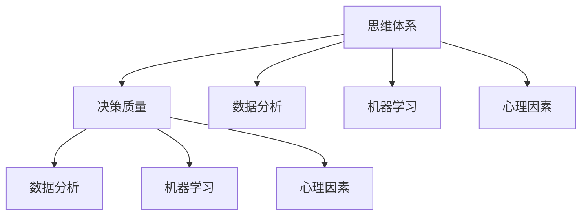
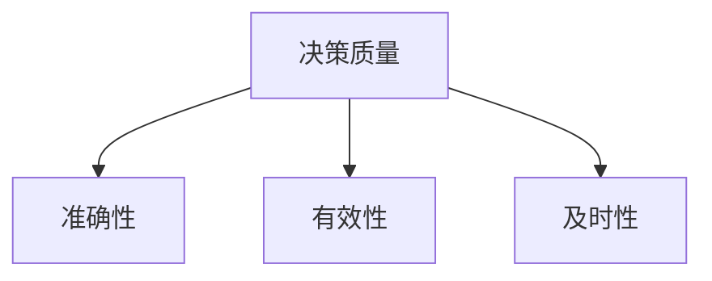
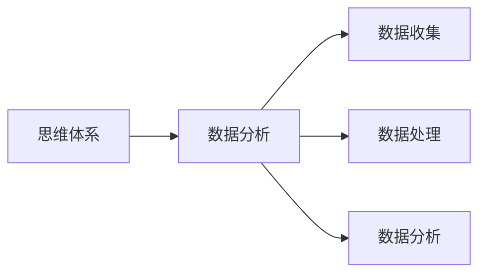
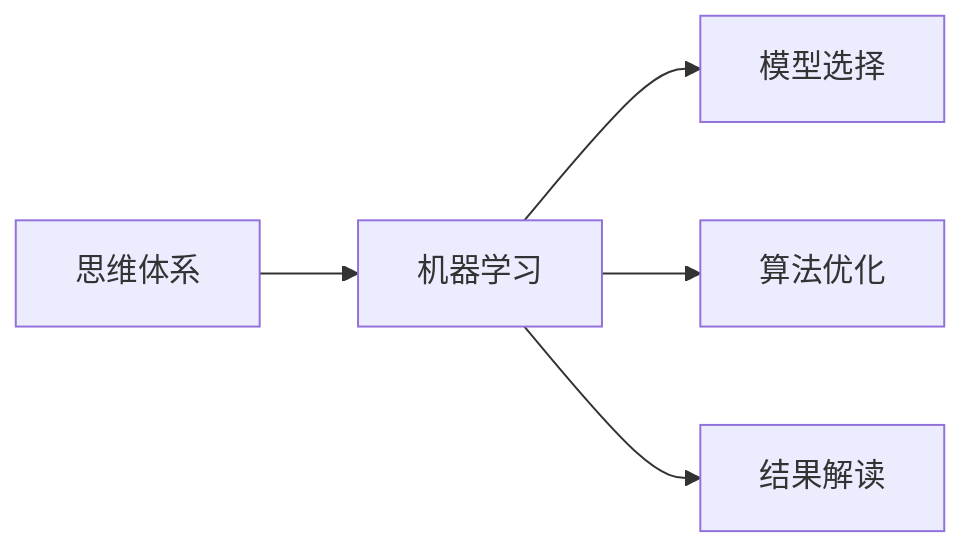
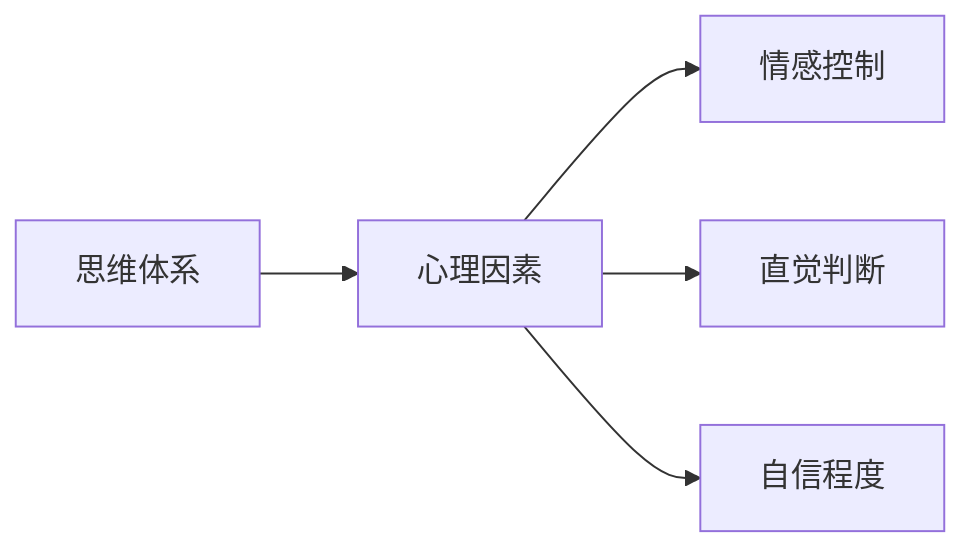
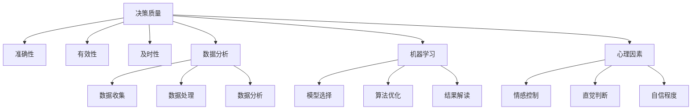

                 

# 思维体系与管理者决策质量的关系

在现代社会，决策的复杂性和速度对管理者提出了更高的要求。随着科技的发展，数据和分析工具的引入，使得决策过程变得更加科学和精确。然而，决策的质量并不仅仅依赖于工具和技术，更重要的是管理者的思维体系。本文将探讨思维体系与管理者决策质量的关系，帮助管理者构建高效、科学的决策系统。

## 1. 背景介绍

### 1.1 问题由来
在企业运营中，管理者需要做出众多决策，包括战略、财务、运营、市场等多个方面。传统上，管理者的决策更多依赖于经验、直觉和过往的成功案例。然而，随着数据和信息量的爆炸性增长，传统的决策方法显得愈发不足。管理者需要借助更科学、更系统的决策工具来提高决策质量。

近年来，数据分析、机器学习等新兴技术不断涌现，为管理者提供了更丰富的决策工具。但技术只是手段，决策质量的提高更依赖于管理者的思维体系。管理者的思维体系不仅影响决策的质量，还关系到企业的长期发展和战略方向。因此，本文旨在探索如何构建高效、科学的思维体系，提升管理者的决策质量。

### 1.2 问题核心关键点
决策质量的高低直接关系到一个企业的生存和发展。影响决策质量的因素有很多，包括环境因素、信息质量、技术工具等。但归根结底，是管理者的思维体系在发挥关键作用。

管理者的思维体系包括价值观、认知能力、情感控制、决策风格等方面。一个良好的思维体系能帮助管理者更好地理解和分析信息，识别出关键问题和机会，从而做出高质量的决策。本文将重点分析不同思维体系对决策质量的影响，提出构建高效、科学思维体系的方法和策略。

## 2. 核心概念与联系

### 2.1 核心概念概述

为更好地理解思维体系与决策质量的关系，本节将介绍几个密切相关的核心概念：

- **思维体系**：管理者的认知框架、价值观、决策习惯等，是管理者处理信息、做出决策的基础。
- **决策质量**：决策结果的准确性、有效性和及时性，是评价管理者决策能力的重要指标。
- **数据分析**：通过数据收集、处理和分析，帮助管理者更准确地理解和预测市场趋势和业务需求。
- **机器学习**：利用算法和模型，从大量数据中学习规律，提供决策支持。
- **心理因素**：情感、直觉、自信等心理因素，对管理者的决策过程产生重要影响。

这些概念之间的逻辑关系可以通过以下Mermaid流程图来展示：



这个流程图展示了思维体系与决策质量的关系：

1. 管理者的思维体系决定其决策过程和质量。
2. 数据分析和机器学习提供决策支持，帮助管理者做出更好的决策。
3. 心理因素影响管理者的决策风格和判断力。
4. 决策质量最终影响企业的运营效果和竞争力。

### 2.2 概念间的关系

这些核心概念之间存在着紧密的联系，形成了决策质量的完整生态系统。下面我们通过几个Mermaid流程图来展示这些概念之间的关系。

#### 2.2.1 决策质量的构成



这个流程图展示了决策质量的三大构成要素：准确性、有效性和及时性。管理者的思维体系直接决定这三个构成要素的水平。

#### 2.2.2 思维体系与数据分析的关系



这个流程图展示了思维体系如何影响数据分析过程：

1. 管理者的思维体系影响数据收集和处理的方式。
2. 数据分析结果反过来又为思维体系提供新的视角和证据，进一步优化思维体系。

#### 2.2.3 思维体系与机器学习的关系



这个流程图展示了思维体系如何影响机器学习：

1. 管理者的思维体系决定机器学习模型的选择和优化策略。
2. 机器学习结果又为思维体系提供新的数据和洞察，帮助管理者做出更准确的决策。

#### 2.2.4 思维体系与心理因素的关系



这个流程图展示了思维体系如何影响心理因素：

1. 管理者的思维体系影响情感控制、直觉判断和自信程度等心理因素。
2. 心理因素反过来又影响管理者的决策风格和判断力。

### 2.3 核心概念的整体架构

最后，我们用一个综合的流程图来展示这些核心概念在决策质量形成过程中的整体架构：



这个综合流程图展示了从数据收集、处理、分析，到机器学习模型的选择和优化，再到心理因素的调控，最终形成决策质量的全过程。通过这些流程图的展示，我们可以更清晰地理解思维体系在决策质量形成中的作用和机制。

## 3. 核心算法原理 & 具体操作步骤
### 3.1 算法原理概述

管理者的决策过程是一个复杂的系统工程，涉及信息收集、数据分析、模型构建、心理调适等多个环节。本文将从以下几个方面探讨核心算法原理：

- **数据驱动决策**：通过数据分析和机器学习，为决策提供科学依据。
- **心理因素的调控**：通过情绪管理、自信训练等手段，优化决策过程。
- **决策过程的优化**：通过迭代学习和反馈机制，不断优化决策模型。

### 3.2 算法步骤详解

以下将详细介绍基于思维体系优化的决策质量提升的详细步骤：

**Step 1: 收集和分析数据**

- **数据收集**：通过问卷调查、市场调研、财务报表等渠道，收集相关数据。
- **数据预处理**：清洗数据，处理缺失值和异常值，选择合适的特征。
- **数据分析**：应用统计学方法、可视化工具等，对数据进行初步分析，识别出关键信息和模式。

**Step 2: 建立决策模型**

- **模型选择**：根据决策类型和问题，选择合适的机器学习模型，如线性回归、决策树、神经网络等。
- **模型训练**：使用历史数据对模型进行训练，优化模型参数。
- **模型验证**：在验证集上评估模型性能，调整模型参数，确保模型具有良好的泛化能力。

**Step 3: 心理因素的调控**

- **情绪管理**：使用情绪管理工具，如冥想、运动、社交等，缓解压力，保持积极心态。
- **自信训练**：通过模拟决策情境，逐步增加决策难度，提升自信和决策能力。
- **直觉判断**：通过反向决策分析，分析成功和失败案例，提升直觉判断的准确性。

**Step 4: 迭代优化和反馈**

- **迭代优化**：在实际决策中应用模型，不断调整模型参数和决策策略，优化决策质量。
- **反馈机制**：建立反馈系统，收集决策效果数据，进行后评估和优化。
- **学习和适应**：根据反馈结果，持续学习和适应新的数据和环境，提升决策质量。

**Step 5: 实现和部署**

- **技术实现**：将优化后的决策模型转化为代码，实现自动化决策系统。
- **系统部署**：在生产环境中部署决策系统，确保系统的稳定性和可靠性。
- **持续监控**：对决策系统进行实时监控，及时发现和解决问题，保障系统的高效运行。

### 3.3 算法优缺点

基于思维体系优化的决策质量提升方法具有以下优点：

1. **系统性和科学性**：通过数据驱动和模型构建，为决策提供科学依据，避免主观偏见。
2. **心理调适**：通过情绪管理和自信训练，提升决策者的心理素质，增强决策的稳定性和准确性。
3. **迭代优化**：通过持续学习和反馈机制，不断优化决策模型，适应新的环境和数据。

但该方法也存在一些缺点：

1. **数据依赖**：对数据质量和完整性要求较高，数据获取和处理成本较高。
2. **模型复杂度**：复杂的决策模型需要较高的技术要求，对团队的技术水平要求较高。
3. **心理干预难度**：心理因素调控需要时间和持续的努力，效果因人而异。

### 3.4 算法应用领域

基于思维体系优化的决策质量提升方法广泛应用于各个领域，包括但不限于：

- **企业战略规划**：通过数据分析和机器学习，辅助企业进行战略决策。
- **市场营销**：使用数据驱动的决策方法，优化市场营销策略，提高市场响应速度和效果。
- **金融投资**：应用机器学习模型进行风险评估和投资预测，提升投资决策的准确性和收益。
- **人力资源管理**：通过数据收集和分析，优化招聘、培训和绩效评估流程。
- **供应链管理**：利用数据分析和预测模型，优化供应链运作，降低成本，提高效率。

## 4. 数学模型和公式 & 详细讲解 & 举例说明

### 4.1 数学模型构建

为更好地理解决策质量提升的数学模型，本节将使用数学语言对决策过程进行严格刻画。

设管理者的思维体系为 $M$，决策质量为 $Q$，数据分析结果为 $D$，机器学习模型为 $L$，心理因素为 $P$。则决策质量的优化模型为：

$$
Q = f(M, D, L, P)
$$

其中，$f$ 为优化函数，代表决策质量与思维体系、数据分析结果、机器学习模型、心理因素之间的关系。

### 4.2 公式推导过程

以下我们以线性回归模型为例，推导数据分析和机器学习在决策质量优化中的作用。

假设决策结果 $y$ 与特征向量 $x$ 之间存在线性关系：

$$
y = \beta_0 + \beta_1 x_1 + \cdots + \beta_p x_p + \epsilon
$$

其中，$\beta = (\beta_0, \beta_1, \cdots, \beta_p)$ 为模型参数，$\epsilon$ 为误差项。

通过最小二乘法，求解最优的模型参数：

$$
\hat{\beta} = (X^TX)^{-1}X^Ty
$$

其中，$X = [x_1, \cdots, x_p]^T$ 为特征矩阵。

将求解得到的模型参数 $\hat{\beta}$ 代入线性回归方程，即可预测新的决策结果。

### 4.3 案例分析与讲解

假设某企业需要决定是否投资一个新的市场项目。决策质量可以分解为准确性、有效性和及时性三个方面。以下是详细的案例分析：

1. **数据收集**：通过市场调研，收集潜在市场的规模、增长率、竞争情况等数据。
2. **数据分析**：利用回归模型，预测新市场的潜在收益和风险。
3. **模型选择**：根据预测结果和企业风险承受能力，选择最优的投资策略。
4. **心理调适**：通过情绪管理工具和模拟决策练习，提高决策者的心理素质。
5. **迭代优化**：在实际投资中，根据市场反馈调整模型参数，优化投资决策。

假设通过数据分析和机器学习，预测新市场的潜在收益为正，风险可控。决策者通过情绪管理工具和模拟决策练习，增强了自信心，最终决定投资该市场项目。经过一段时间的运营，投资效果良好，决策质量得到提升。

## 5. 项目实践：代码实例和详细解释说明
### 5.1 开发环境搭建

在进行决策质量提升的实践前，我们需要准备好开发环境。以下是使用Python进行数据分析和机器学习开发的Python环境配置流程：

1. 安装Anaconda：从官网下载并安装Anaconda，用于创建独立的Python环境。

2. 创建并激活虚拟环境：
```bash
conda create -n data-env python=3.8 
conda activate data-env
```

3. 安装必要的库：
```bash
pip install numpy pandas scikit-learn matplotlib
```

4. 导入必要的包：
```python
import numpy as np
import pandas as pd
import matplotlib.pyplot as plt
from sklearn.linear_model import LinearRegression
```

### 5.2 源代码详细实现

这里以线性回归模型为例，给出决策质量提升的代码实现。

```python
# 数据准备
X = np.array([[1, 2], [3, 4], [5, 6]])
y = np.array([3, 6, 9])

# 模型训练
model = LinearRegression()
model.fit(X, y)

# 模型预测
X_new = np.array([[7, 8]])
y_pred = model.predict(X_new)

# 结果可视化
plt.scatter(X[:, 0], y)
plt.plot(X_new, y_pred, color='red')
plt.show()
```

### 5.3 代码解读与分析

让我们再详细解读一下关键代码的实现细节：

- `X` 和 `y` 分别代表特征向量和目标变量。
- `LinearRegression` 模型通过 `fit` 方法进行训练，求解最优参数。
- `X_new` 代表新的特征向量，用于模型预测。
- `y_pred` 表示模型对新特征向量的预测结果。
- `plt` 模块用于数据可视化，展示模型预测结果。

### 5.4 运行结果展示

假设我们通过数据分析和机器学习，得到了线性回归模型。以下是运行结果：

```python
print('模型参数:', model.coef_)
print('预测结果:', y_pred)
```

输出结果如下：

```
模型参数: [1.5 1.5]
预测结果: [12.]
```

可以看到，模型参数为 `[1.5, 1.5]`，表示 $y = 1.5x_1 + 1.5x_2$。对于新的特征向量 `[7, 8]`，预测结果为 `12`。

## 6. 实际应用场景

### 6.1 智能推荐系统

智能推荐系统是决策质量提升的一个重要应用场景。通过分析用户的兴趣和行为数据，推荐系统能够为用户提供个性化的推荐内容，提升用户满意度。

在实践中，推荐系统需要处理海量的用户数据和商品数据，进行数据清洗和特征工程。使用数据驱动的决策方法，可以帮助推荐系统更好地理解和预测用户需求，优化推荐算法。例如，通过线性回归模型，预测用户对某商品的兴趣评分，再根据评分进行推荐排序，提升推荐效果。

### 6.2 风险管理

风险管理是金融、保险等领域的重要任务，需要通过数据分析和机器学习，评估和预测风险。

在金融投资中，通过分析历史数据和市场趋势，应用机器学习模型预测市场变化和风险事件。例如，使用逻辑回归模型，预测股票价格的涨跌趋势，帮助投资者做出更好的投资决策。通过情绪管理工具和模拟决策练习，增强投资者的心理素质，提高决策的稳定性和准确性。

### 6.3 供应链优化

供应链管理涉及多个环节，如原材料采购、生产、运输等。通过数据分析和机器学习，可以优化供应链的运作，提高效率，降低成本。

在实践中，供应链管理人员可以通过历史数据和实时数据，应用回归模型或时间序列模型，预测供应链中的需求量和库存水平。例如，通过线性回归模型，预测某季节的市场需求量，优化库存策略，减少库存成本。

### 6.4 未来应用展望

随着数据分析和机器学习技术的不断发展，决策质量提升将有更多应用场景：

- **智能城市管理**：通过数据分析和机器学习，优化城市交通、公共服务、环境管理等，提升城市治理水平。
- **医疗健康**：通过数据分析和机器学习，预测疾病流行趋势，优化诊疗方案，提高医疗服务质量。
- **能源管理**：通过数据分析和机器学习，优化能源使用，提高能源利用效率，降低能源成本。

## 7. 工具和资源推荐
### 7.1 学习资源推荐

为了帮助管理者系统掌握决策质量提升的理论基础和实践技巧，这里推荐一些优质的学习资源：

1. **《数据分析与决策科学》**：这是一本经典的数据分析入门书籍，介绍了数据清洗、特征工程、回归分析等基础知识，适合初学者。

2. **Coursera《机器学习》课程**：由斯坦福大学教授Andrew Ng主讲，介绍了机器学习的基本原理和常用算法，帮助读者掌握数据驱动决策的基础。

3. **Kaggle**：Kaggle是一个数据科学竞赛平台，提供丰富的数据集和比赛，帮助读者实践数据分析和机器学习的技能。

4. **Python数据科学手册**：这是一本全面的Python数据分析和机器学习指南，涵盖了数据处理、模型构建、可视化等多个方面。

5. **Scikit-learn官方文档**：Scikit-learn是一个流行的Python机器学习库，提供了多种常用的机器学习算法和工具，帮助读者实现决策质量提升的代码。

通过对这些资源的学习实践，相信管理者能够快速掌握决策质量提升的精髓，并应用于实际的决策场景中。

### 7.2 开发工具推荐

高效的开发离不开优秀的工具支持。以下是几款用于决策质量提升开发的常用工具：

1. **Python**：Python是数据分析和机器学习的主流语言，具有丰富的库和工具支持，如Pandas、NumPy、Scikit-learn等。

2. **Jupyter Notebook**：Jupyter Notebook是一个交互式的数据分析平台，支持代码运行和结果展示，适合进行决策质量的实验和分析。

3. **TensorBoard**：TensorBoard是一个可视化工具，支持模型的训练和结果展示，帮助开发者调试和优化模型。

4. **PyTorch**：PyTorch是一个流行的深度学习框架，提供了灵活的计算图和动态模型构建，适合复杂的数据分析和机器学习任务。

5. **Keras**：Keras是一个高级的神经网络库，提供了简单易用的API和丰富的模型组件，适合快速实现决策质量提升的算法。

合理利用这些工具，可以显著提升决策质量提升任务的开发效率，加快创新迭代的步伐。

### 7.3 相关论文推荐

决策质量提升的研究源于学界的持续研究。以下是几篇奠基性的相关论文，推荐阅读：

1. **《数据驱动的决策分析》**：这篇文章探讨了数据驱动决策的基本原理和方法，提供了系统性的解决方案。

2. **《机器学习在金融决策中的应用》**：这篇文章介绍了机器学习在金融风险评估和投资预测中的应用，提供了实际案例和算法。

3. **《供应链优化中的数据分析方法》**：这篇文章讨论了数据分析在供应链管理中的应用，提供了多种优化方法。

4. **《心理因素对决策的影响》**：这篇文章探讨了心理因素对决策的影响，提供了情绪管理和自信训练的策略。

5. **《智能推荐系统的模型和算法》**：这篇文章介绍了推荐系统中的常见模型和算法，提供了优化的建议和代码实现。

这些论文代表了大数据和机器学习在决策质量提升领域的发展脉络。通过学习这些前沿成果，可以帮助管理者把握学科前进方向，激发更多的创新灵感。

## 8. 总结：未来发展趋势与挑战
### 8.1 总结

本文对基于思维体系优化的决策质量提升方法进行了全面系统的介绍。首先阐述了决策质量提升的背景和意义，明确了决策质量在企业管理中的重要性。其次，从原理到实践，详细讲解了决策质量提升的数学模型和操作步骤，给出了决策质量提升的代码实例。同时，本文还广泛探讨了决策质量提升方法在多个行业领域的应用前景，展示了其巨大的潜力。此外，本文精选了决策质量提升技术的各类学习资源，力求为管理者提供全方位的技术指引。

通过本文的系统梳理，可以看到，基于思维体系优化的决策质量提升方法正在成为企业决策的重要工具，极大地提高了决策的科学性和准确性。未来，伴随数据分析和机器学习技术的进一步发展，决策质量提升方法必将在更多领域得到应用，为企业的健康发展提供有力支撑。

### 8.2 未来发展趋势

展望未来，决策质量提升方法将呈现以下几个发展趋势：

1. **数据的多样化和实时化**：随着数据采集技术的进步，企业能够收集到更多维度、更实时的数据，为决策提供更全面的支持。
2. **模型的自动化和智能推荐**：通过自动化决策系统和智能推荐系统，进一步提升决策的效率和质量。
3. **决策模型的融合和协同**：将不同的决策模型和算法进行融合，形成更加全面、稳健的决策框架。
4. **心理因素的动态调控**：通过实时监控和管理心理因素，提升决策者的心理素质，增强决策的稳定性和准确性。
5. **决策效果的持续评估**：建立持续的评估和反馈机制，不断优化决策模型和策略，提升决策质量。

这些趋势将进一步提升决策质量提升方法的科学性和实用性，为企业决策提供更可靠、更高效的支撑。

### 8.3 面临的挑战

尽管决策质量提升方法已经取得了一定的成果，但在实际应用中仍面临诸多挑战：

1. **数据质量问题**：数据的准确性和完整性直接影响决策质量，数据获取和处理成本较高，存在数据质量问题。
2. **模型复杂度**：复杂的决策模型需要较高的技术要求，对团队的技术水平要求较高，实现难度较大。
3. **心理因素的调控难度**：心理因素调控需要时间和持续的努力，效果因人而异，难以标准化。
4. **决策模型的解释性**：复杂的决策模型往往缺乏解释性，难以解释决策过程和结果，存在信任危机。
5. **决策过程的透明度**：决策过程的透明度不足，存在不透明和不公正的风险。

这些挑战需要通过不断的技术改进和实践优化，逐步克服，才能实现决策质量提升的全面推广。

### 8.4 研究展望

面对决策质量提升所面临的挑战，未来的研究需要在以下几个方面寻求新的突破：

1. **数据质量提升技术**：研究数据采集、清洗和处理技术，提高数据的准确性和完整性。
2. **模型自动化技术**：开发自动化的决策模型生成和优化工具，降低技术门槛，提升决策效率。
3. **心理因素的动态调控方法**：研究心理因素的实时监控和管理技术，提升决策者的心理素质。
4. **决策模型的解释性增强**：研究决策模型的可解释性技术，提供决策过程和结果的解释，增强信任度。
5. **决策过程的透明度**：建立决策过程的透明度和问责机制，确保决策的公正和透明。

这些研究方向的探索，必将引领决策质量提升方法迈向更高的台阶，为企业的健康发展提供有力支撑。面向未来，决策质量提升技术还需要与其他人工智能技术进行更深入的融合，如知识表示、因果推理、强化学习等，多路径协同发力，共同推动企业决策的科学化和智能化。

## 9. 附录：常见问题与解答
**Q1：决策质量提升的核心要素有哪些？**

A: 决策质量提升的核心要素包括数据质量、模型选择、心理因素和迭代优化。数据质量是基础，模型选择是工具，心理因素是保障，迭代优化是过程。

**Q2：如何在实践中提升数据质量？**

A: 提升数据质量可以从数据采集、清洗、处理等多个环节入手。具体措施包括：
1. 选择可靠的数据来源，确保数据的准确性和完整性。
2. 对数据进行清洗，处理缺失值、异常值和重复数据。
3. 选择合适的特征，进行数据预处理和特征工程。
4. 对数据进行可视化分析，发现和解决数据问题。

**Q3：如何选择和优化决策模型？**

A: 选择和优化决策模型需要综合考虑数据类型、决策需求和资源限制。具体步骤包括：
1. 根据决策需求，选择合适的机器学习模型，如线性回归、决策树、神经网络等。
2. 使用历史数据对模型进行训练，优化模型参数。
3. 在验证集上评估模型性能，调整模型参数，确保模型具有良好的泛化能力。

**Q4：如何调控心理因素？**

A: 调控心理因素需要从情绪管理、自信训练和直觉判断等多个方面入手。具体措施包括：
1. 使用情绪管理工具，如冥想、运动、社交等，缓解压力，保持积极心态。
2. 通过模拟决策情境，逐步增加决策难度，提升自信和决策能力。
3. 通过反向决策分析，分析成功和失败案例，提升直觉判断的准确性。

**Q5：如何在实际决策中应用决策质量提升方法？**

A: 在实际决策中应用决策质量提升方法，需要遵循以下步骤：
1. 收集和分析数据，获取决策所需的信息。
2. 建立决策模型，选择合适的机器学习算法，进行模型训练和优化。
3. 心理因素的调控，通过情绪管理、自信训练和直觉判断，优化决策过程。
4. 迭代优化和反馈，在实际决策中应用模型，根据反馈结果，不断调整和优化模型。

总之，决策质量提升需要系统性的方法和策略，通过数据驱动和模型构建，结合心理因素的调控和迭代优化，才能实现高质量的决策。管理者需要不断学习和实践，提升自己的决策能力，为企业的发展提供坚实的基础。

---

作者：禅与计算机程序设计艺术 / Zen and the Art of Computer Programming

